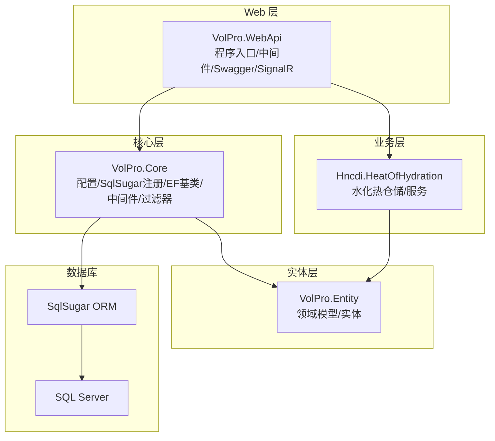
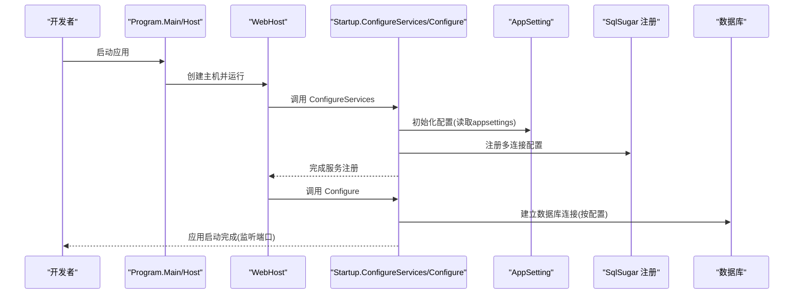
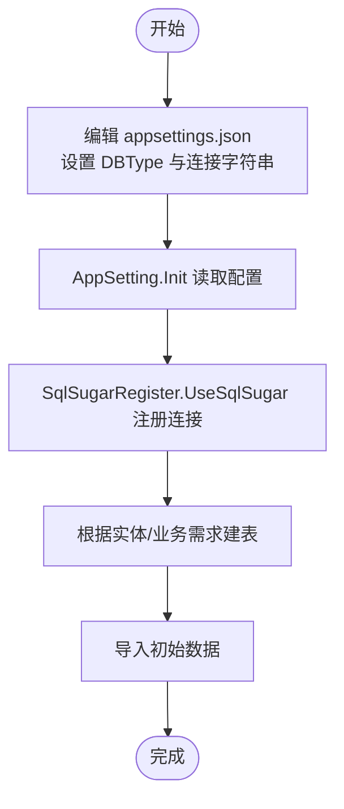
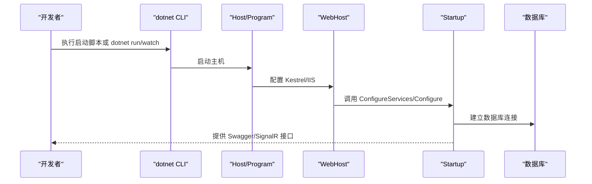
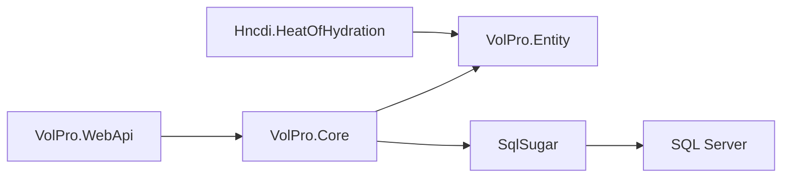

# 快速开始

<cite>
**本文引用的文件**
- [appsettings.json](file://VolPro.WebApi/appsettings.json)
- [appsettings.Development.json](file://VolPro.WebApi/appsettings.Development.json)
- [Program.cs](file://VolPro.WebApi/Program.cs)
- [Startup.cs](file://VolPro.WebApi/Startup.cs)
- [Dockerfile](file://VolPro.WebApi/Dockerfile)
- [dev_run.bat](file://VolPro.WebApi/dev_run.bat)
- [dev_run2.bat](file://VolPro.WebApi/dev_run2.bat)
- [AppSetting.cs](file://VolPro.Core/Configuration/AppSetting.cs)
- [SqlSugarRegister.cs](file://VolPro.Core/DbSqlSugar/SqlSugarRegister.cs)
- [BaseDbContext.cs](file://VolPro.Core/EFDbContext/BaseDbContext.cs)
- [Hoh_Project.cs](file://VolPro.Entity/DomainModels/Hoh/Hoh_Project.cs)
- [VolPro.sln](file://VolPro.sln)
</cite>

## 目录
1. [简介](#简介)
2. [项目结构](#项目结构)
3. [核心组件](#核心组件)
4. [架构总览](#架构总览)
5. [详细组件分析](#详细组件分析)
6. [依赖关系分析](#依赖关系分析)
7. [性能注意事项](#性能注意事项)
8. [故障排除指南](#故障排除指南)
9. [结论](#结论)
10. [附录](#附录)

## 简介
本“快速开始”指南面向首次接触水化热平台项目的开发者，目标是在最短时间内完成本地开发环境搭建、数据库配置、应用启动与基础功能验证，并提供常见问题排查建议。项目基于 .NET 8.0 与 ASP.NET Core，采用 SqlSugar ORM 进行数据库访问，支持多数据库类型配置（含 SQL Server），并通过 Swagger 提供接口文档。

## 项目结构
项目采用多项目解决方案组织，核心模块包括：
- VolPro.WebApi：Web 应用入口，负责路由、中间件、认证授权、Swagger、SignalR、Quartz 等。
- VolPro.Core：通用基础设施与扩展，包含配置读取、SqlSugar 注册、EF 上下文基类、中间件、过滤器、工具集等。
- VolPro.Entity：领域模型与实体定义，包含水化热相关业务实体。
- VolPro.Sys、VolPro.Builder、VolPro.DbTest 等：系统管理、代码生成、数据库测试等辅助模块。
- Hncdi.HeatOfHydration：水化热业务相关仓储与服务（与实体中的水化热模型配合使用）。

图表来源
- [VolPro.sln:1-69](file://VolPro.sln#L1-L69)
- [Startup.cs:60-213](file://VolPro.WebApi/Startup.cs#L60-L213)
- [SqlSugarRegister.cs:76-131](file://VolPro.Core/DbSqlSugar/SqlSugarRegister.cs#L76-L131)

章节来源
- [VolPro.sln:1-69](file://VolPro.sln#L1-L69)

## 核心组件
- 配置系统：通过 appsettings.json 与 AppSetting.cs 统一读取数据库连接、JWT、跨域、Kafka、邮件等配置。
- 数据库访问：SqlSugarRegister 负责注册多连接配置，支持系统库与业务库分离。
- 启动与中间件：Program.cs 指定 Kestrel 监听端口与 IIS 集成；Startup.cs 配置认证、CORS、Swagger、SignalR、Quartz 等。
- 实体模型：以 Hoh_Project 为例，展示水化热业务实体的字段与注解。

章节来源
- [appsettings.json:1-140](file://VolPro.WebApi/appsettings.json#L1-L140)
- [AppSetting.cs:85-163](file://VolPro.Core/Configuration/AppSetting.cs#L85-L163)
- [SqlSugarRegister.cs:76-131](file://VolPro.Core/DbSqlSugar/SqlSugarRegister.cs#L76-L131)
- [Program.cs:24-36](file://VolPro.WebApi/Program.cs#L24-L36)
- [Startup.cs:60-213](file://VolPro.WebApi/Startup.cs#L60-L213)
- [Hoh_Project.cs:17-229](file://VolPro.Entity/DomainModels/Hoh/Hoh_Project.cs#L17-L229)

## 架构总览
应用启动流程概览如下：

图表来源
- [Program.cs:17-36](file://VolPro.WebApi/Program.cs#L17-L36)
- [Startup.cs:60-213](file://VolPro.WebApi/Startup.cs#L60-L213)
- [AppSetting.cs:85-163](file://VolPro.Core/Configuration/AppSetting.cs#L85-L163)
- [SqlSugarRegister.cs:76-131](file://VolPro.Core/DbSqlSugar/SqlSugarRegister.cs#L76-L131)

## 详细组件分析

### 环境要求与安装
- 开发语言与框架
  - .NET 版本：.NET 8.0（参考解决方案与项目文件）
  - IDE：Visual Studio 或 VS Code（推荐使用 Visual Studio 2022+）
- 数据库
  - SQL Server：项目默认配置为 MsSql，需确保可访问目标实例
- 其他
  - Docker（可选）：Dockerfile 已提供容器化构建与运行方式

章节来源
- [VolPro.sln:1-69](file://VolPro.sln#L1-L69)
- [Dockerfile:1-29](file://VolPro.WebApi/Dockerfile#L1-L29)

### 数据库配置步骤
- 连接字符串设置
  - 在 appsettings.json 的 Connection 节点中配置数据库类型与连接字符串
  - 默认已提供 MsSql 示例连接串，包含系统库与业务库两条连接
- 初始化与注册
  - 启动时通过 AppSetting.Init 读取配置
  - SqlSugarRegister.UseSqlSugar 注册多连接，支持业务库日志输出
- 表结构与初始数据
  - 项目实体中包含水化热相关表模型（如 Hoh_Project），可结合实体注解与业务库结构进行建表
  - 初始数据导入建议通过业务接口或数据库工具完成

图表来源
- [appsettings.json:16-57](file://VolPro.WebApi/appsettings.json#L16-L57)
- [AppSetting.cs:85-163](file://VolPro.Core/Configuration/AppSetting.cs#L85-L163)
- [SqlSugarRegister.cs:76-131](file://VolPro.Core/DbSqlSugar/SqlSugarRegister.cs#L76-L131)
- [Hoh_Project.cs:17-229](file://VolPro.Entity/DomainModels/Hoh/Hoh_Project.cs#L17-L229)

章节来源
- [appsettings.json:16-57](file://VolPro.WebApi/appsettings.json#L16-L57)
- [AppSetting.cs:85-163](file://VolPro.Core/Configuration/AppSetting.cs#L85-L163)
- [SqlSugarRegister.cs:76-131](file://VolPro.Core/DbSqlSugar/SqlSugarRegister.cs#L76-L131)
- [Hoh_Project.cs:17-229](file://VolPro.Entity/DomainModels/Hoh/Hoh_Project.cs#L17-L229)

### 应用程序启动步骤
- 开发环境运行
  - 使用 dotnet CLI：执行 dev_run2.bat 或直接运行 dotnet watch run --framework net8.0
  - 热重载调试：dev_run.bat 提供带日志与临时脚本的启动方式
- 生产环境部署
  - 本地发布：dotnet publish -c Release -o out
  - 容器部署：Dockerfile 已配置，镜像暴露端口 5567，与 Program.cs 中监听端口一致
- 访问与验证
  - Swagger 文档：启动后访问 /swagger 查看接口文档
  - SignalR：若启用，可在前端通过指定 CORS 域名连接 /message

图表来源
- [dev_run.bat:1-20](file://VolPro.WebApi/dev_run.bat#L1-L20)
- [dev_run2.bat:1-3](file://VolPro.WebApi/dev_run2.bat#L1-L3)
- [Program.cs:24-36](file://VolPro.WebApi/Program.cs#L24-L36)
- [Startup.cs:309-382](file://VolPro.WebApi/Startup.cs#L309-L382)

章节来源
- [dev_run.bat:1-20](file://VolPro.WebApi/dev_run.bat#L1-L20)
- [dev_run2.bat:1-3](file://VolPro.WebApi/dev_run2.bat#L1-L3)
- [Program.cs:24-36](file://VolPro.WebApi/Program.cs#L24-L36)
- [Startup.cs:309-382](file://VolPro.WebApi/Startup.cs#L309-L382)
- [Dockerfile:7-7](file://VolPro.WebApi/Dockerfile#L7-L7)

### 基础功能演示
以下为常见操作指引（以实体与业务模型为准）：
- 用户登录
  - 通过认证中间件与 JWT 配置进行授权校验（配置于 appsettings.json 与 Startup.cs）
- 项目创建
  - 使用水化热实体（如 Hoh_Project）进行新增/保存，结合 AppSetting 中默认创建人字段配置
- 数据查看
  - 通过 Swagger 文档调用相应控制器接口，或在前端页面访问数据视图

章节来源
- [appsettings.json:58-68](file://VolPro.WebApi/appsettings.json#L58-L68)
- [Startup.cs:84-114](file://VolPro.WebApi/Startup.cs#L84-L114)
- [Hoh_Project.cs:17-229](file://VolPro.Entity/DomainModels/Hoh/Hoh_Project.cs#L17-L229)
- [AppSetting.cs:62-104](file://VolPro.Core/Configuration/AppSetting.cs#L62-L104)

## 依赖关系分析
- WebApi 依赖 Core 提供的配置与数据库注册能力
- Core 通过 SqlSugarRegister 与数据库交互
- 实体层提供业务模型，业务层（如 Hncdi.HeatOfHydration）通过仓储/服务访问实体
- 解决方案文件定义了各项目之间的依赖关系

图表来源
- [VolPro.sln:1-69](file://VolPro.sln#L1-L69)
- [Startup.cs:60-213](file://VolPro.WebApi/Startup.cs#L60-L213)
- [SqlSugarRegister.cs:76-131](file://VolPro.Core/DbSqlSugar/SqlSugarRegister.cs#L76-L131)

章节来源
- [VolPro.sln:1-69](file://VolPro.sln#L1-L69)
- [Startup.cs:60-213](file://VolPro.WebApi/Startup.cs#L60-L213)
- [SqlSugarRegister.cs:76-131](file://VolPro.Core/DbSqlSugar/SqlSugarRegister.cs#L76-L131)

## 性能注意事项
- 数据库连接与日志
  - SqlSugar 在注册时为业务库开启日志输出，便于调试但可能影响性能，建议在生产关闭或降级日志级别
- 文件上传与请求大小
  - Program.cs 中已设置 Kestrel 最大请求体大小，如需更大文件上传，可在 Startup 或 Program 中调整
- 缓存与并发
  - 支持内存缓存与 Redis（可选），合理使用可提升读性能
- Swagger 与 SignalR
  - Swagger 仅在开发环境启用，生产建议关闭或限制访问

章节来源
- [SqlSugarRegister.cs:110-126](file://VolPro.Core/DbSqlSugar/SqlSugarRegister.cs#L110-L126)
- [Program.cs:28-32](file://VolPro.WebApi/Program.cs#L28-L32)
- [Startup.cs:311-318](file://VolPro.WebApi/Startup.cs#L311-L318)

## 故障排除指南
- 启动失败（未配置数据库连接）
  - 现象：启动时报错提示未配置数据库默认连接
  - 处理：检查 appsettings.json 中 Connection 节点的 DbConnectionString 与 DBType
- 跨域错误
  - 现象：前端无法访问后端接口
  - 处理：确认 CorsUrls 已正确配置，且前端域名与端口匹配
- JWT 授权失败
  - 现象：返回 401 未授权
  - 处理：核对 appsettings.json 中 Secret 的 Issuer/Audience/JWT，以及客户端请求头携带的 Bearer Token
- Swagger 不可用
  - 现象：访问 /swagger 报错或空白
  - 处理：确认 Startup.cs 中已启用 Swagger 并正确配置 UI 端点
- Docker 镜像端口不一致
  - 现象：容器内应用监听端口与 Dockerfile EXPOSE 不一致
  - 处理：保持 Program.cs 中 UseUrls 与 Dockerfile EXPOSE 端口一致（均为 5567）

章节来源
- [AppSetting.cs:144-147](file://VolPro.Core/Configuration/AppSetting.cs#L144-L147)
- [appsettings.json:67-68](file://VolPro.WebApi/appsettings.json#L67-L68)
- [Startup.cs:84-114](file://VolPro.WebApi/Startup.cs#L84-L114)
- [Startup.cs:354-361](file://VolPro.WebApi/Startup.cs#L354-L361)
- [Dockerfile:7-7](file://VolPro.WebApi/Dockerfile#L7-L7)
- [Program.cs:33-33](file://VolPro.WebApi/Program.cs#L33-L33)

## 结论
通过本指南，您可以在本地快速完成环境准备、数据库配置与应用启动，并基于 Swagger 与实体模型进行基础功能验证。建议在开发阶段充分利用 Swagger 与日志输出，在生产阶段关注跨域、JWT、缓存与数据库日志策略，以获得稳定高效的运行体验。

## 附录
- 开发环境启动脚本
  - dev_run.bat：带日志与临时脚本的启动方式
  - dev_run2.bat：标准 dotnet watch run 启动
- 生产部署
  - Dockerfile 已提供容器化构建与运行方式，镜像暴露端口 5567，与 Program.cs 中监听端口一致

章节来源
- [dev_run.bat:1-20](file://VolPro.WebApi/dev_run.bat#L1-L20)
- [dev_run2.bat:1-3](file://VolPro.WebApi/dev_run2.bat#L1-L3)
- [Dockerfile:7-7](file://VolPro.WebApi/Dockerfile#L7-L7)
- [Program.cs:33-33](file://VolPro.WebApi/Program.cs#L33-L33)