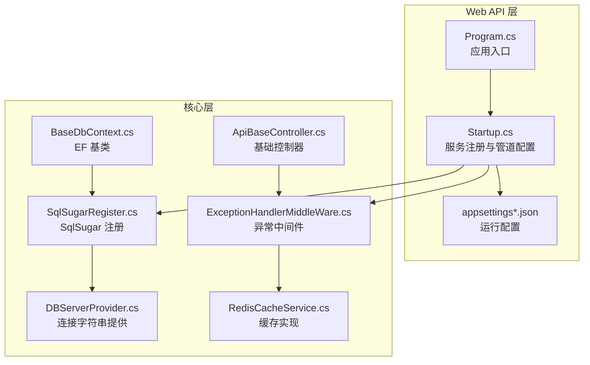
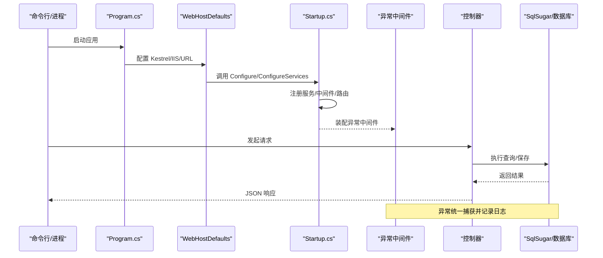
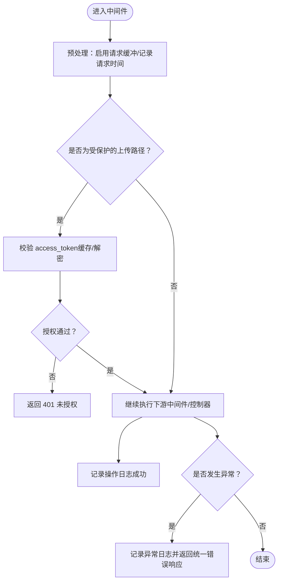
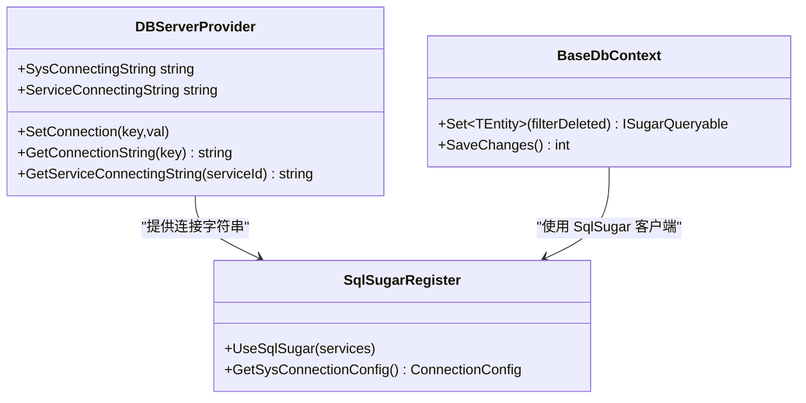
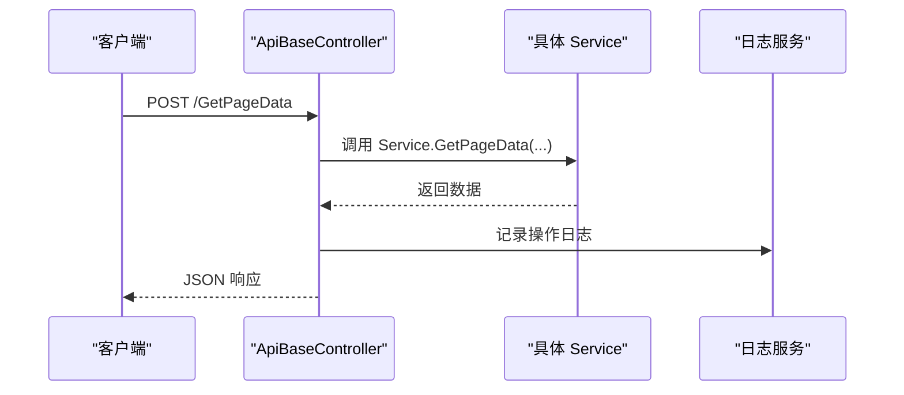
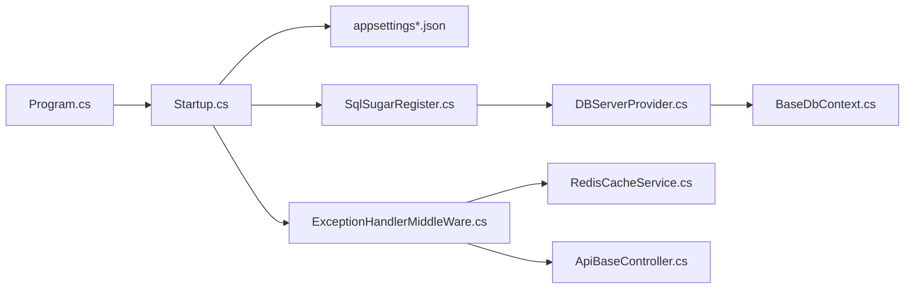

# 故障排除与FAQ

<cite>
**本文引用的文件**
- [VolPro.WebApi/appsettings.json](file://VolPro.WebApi/appsettings.json)
- [VolPro.WebApi/appsettings.Development.json](file://VolPro.WebApi/appsettings.Development.json)
- [VolPro.WebApi/Program.cs](file://VolPro.WebApi/Program.cs)
- [VolPro.WebApi/Startup.cs](file://VolPro.WebApi/Startup.cs)
- [VolPro.Core/Middleware/ExceptionHandlerMiddleWare.cs](file://VolPro.Core/Middleware/ExceptionHandlerMiddleWare.cs)
- [VolPro.Core/DbManager/DBServerProvider.cs](file://VolPro.Core/DbManager/DBServerProvider.cs)
- [VolPro.Core/DbSqlSugar/SqlSugarRegister.cs](file://VolPro.Core/DbSqlSugar/SqlSugarRegister.cs)
- [VolPro.Core/EFDbContext/BaseDbContext.cs](file://VolPro.Core/EFDbContext/BaseDbContext.cs)
- [VolPro.Core/Controllers/Basic/ApiBaseController.cs](file://VolPro.Core/Controllers/Basic/ApiBaseController.cs)
- [VolPro.Core/CacheManager/Service/RedisCacheService.cs](file://VolPro.Core/CacheManager/Service/RedisCacheService.cs)
</cite>

## 目录
1. [简介](#简介)
2. [项目结构](#项目结构)
3. [核心组件](#核心组件)
4. [架构总览](#架构总览)
5. [详细组件分析](#详细组件分析)
6. [依赖关系分析](#依赖关系分析)
7. [性能考虑](#性能考虑)
8. [故障排除指南](#故障排除指南)
9. [结论](#结论)
10. [附录](#附录)

## 简介
本文件面向“水化热平台”运维与开发人员，提供系统化的故障排除与常见问题解答（FAQ）。内容覆盖启动失败、数据库连接问题、权限与鉴权问题、性能问题等，并给出日志分析、错误追踪与性能分析方法；同时针对开发、测试、生产三类环境的差异处理流程进行说明；并包含紧急情况（系统崩溃恢复、数据丢失处理）预案、社区支持渠道与问题反馈流程，以及版本兼容性与迁移建议。

## 项目结构
该仓库采用多项目分层组织，Web API 层负责启动、中间件与路由，核心层提供通用能力（缓存、日志、数据库、权限、工作流等），实体层承载领域模型，MES/Sys/Hoh 等模块按业务域划分仓储与服务。

图表来源
- [VolPro.WebApi/Program.cs:1-39](file://VolPro.WebApi/Program.cs#L1-L39)
- [VolPro.WebApi/Startup.cs:1-407](file://VolPro.WebApi/Startup.cs#L1-L407)
- [VolPro.Core/Middleware/ExceptionHandlerMiddleWare.cs:1-110](file://VolPro.Core/Middleware/ExceptionHandlerMiddleWare.cs#L1-L110)
- [VolPro.Core/DbManager/DBServerProvider.cs:1-139](file://VolPro.Core/DbManager/DBServerProvider.cs#L1-L139)
- [VolPro.Core/DbSqlSugar/SqlSugarRegister.cs:1-155](file://VolPro.Core/DbSqlSugar/SqlSugarRegister.cs#L1-L155)
- [VolPro.Core/EFDbContext/BaseDbContext.cs:1-161](file://VolPro.Core/EFDbContext/BaseDbContext.cs#L1-L161)
- [VolPro.Core/Controllers/Basic/ApiBaseController.cs:1-230](file://VolPro.Core/Controllers/Basic/ApiBaseController.cs#L1-L230)
- [VolPro.Core/CacheManager/Service/RedisCacheService.cs:1-120](file://VolPro.Core/CacheManager/Service/RedisCacheService.cs#L1-L120)

章节来源
- [VolPro.WebApi/Program.cs:1-39](file://VolPro.WebApi/Program.cs#L1-L39)
- [VolPro.WebApi/Startup.cs:1-407](file://VolPro.WebApi/Startup.cs#L1-L407)

## 核心组件
- 应用入口与启动
  - Program.cs 负责构建主机、设置 Kestrel 监听端口与 IIS 集成，并使用 Autofac 作为容器工厂。
- 配置中心
  - appsettings.json 提供数据库连接、Redis、JWT、跨域、Kafka、邮件、定时任务等全局配置；appsettings.Development.json 提供开发环境日志级别。
- 中间件链
  - 异常中间件统一捕获异常并记录日志，返回标准化 JSON 错误响应；语言中间件、静态文件中间件、鉴权中间件依次装配。
- 数据访问
  - DBServerProvider 统一管理连接字符串；SqlSugarRegister 注册 SqlSugar 客户端并配置日志回调；BaseDbContext 封装 SqlSugar 查询与保存队列。
- 控制器基类
  - ApiBaseController 提供分页、导入导出、上传下载、增删改查等通用接口，统一记录操作日志。
- 缓存
  - RedisCacheService 基于 CSRedis/StackExchange.Redis 实现键值缓存与列表操作。

章节来源
- [VolPro.WebApi/Program.cs:17-37](file://VolPro.WebApi/Program.cs#L17-L37)
- [VolPro.WebApi/appsettings.json:1-140](file://VolPro.WebApi/appsettings.json#L1-L140)
- [VolPro.WebApi/appsettings.Development.json:1-10](file://VolPro.WebApi/appsettings.Development.json#L1-L10)
- [VolPro.Core/Middleware/ExceptionHandlerMiddleWare.cs:28-107](file://VolPro.Core/Middleware/ExceptionHandlerMiddleWare.cs#L28-L107)
- [VolPro.Core/DbManager/DBServerProvider.cs:37-136](file://VolPro.Core/DbManager/DBServerProvider.cs#L37-L136)
- [VolPro.Core/DbSqlSugar/SqlSugarRegister.cs:76-131](file://VolPro.Core/DbSqlSugar/SqlSugarRegister.cs#L76-L131)
- [VolPro.Core/EFDbContext/BaseDbContext.cs:32-40](file://VolPro.Core/EFDbContext/BaseDbContext.cs#L32-L40)
- [VolPro.Core/Controllers/Basic/ApiBaseController.cs:35-227](file://VolPro.Core/Controllers/Basic/ApiBaseController.cs#L35-L227)
- [VolPro.Core/CacheManager/Service/RedisCacheService.cs:14-117](file://VolPro.Core/CacheManager/Service/RedisCacheService.cs#L14-L117)

## 架构总览
系统采用 ASP.NET Core 默认管线，结合 SqlSugar 进行高性能 ORM 访问，配合 Redis 缓存与 SignalR 实现实时通信。启动流程如下：

图表来源
- [VolPro.WebApi/Program.cs:24-36](file://VolPro.WebApi/Program.cs#L24-L36)
- [VolPro.WebApi/Startup.cs:60-213](file://VolPro.WebApi/Startup.cs#L60-L213)
- [VolPro.Core/Middleware/ExceptionHandlerMiddleWare.cs:28-107](file://VolPro.Core/Middleware/ExceptionHandlerMiddleWare.cs#L28-L107)
- [VolPro.Core/DbSqlSugar/SqlSugarRegister.cs:102-129](file://VolPro.Core/DbSqlSugar/SqlSugarRegister.cs#L102-L129)

## 详细组件分析

### 组件A：异常处理与日志
- 功能要点
  - 在 next(context) 前后分别处理静态文件授权与操作日志记录；捕获异常后根据环境返回统一错误响应。
  - 支持文件访问授权（upload 目录），基于 access_token 与缓存校验。
- 关键路径
  - 异常捕获与响应：[ExceptionHandlerMiddleWare.cs:90-106](file://VolPro.Core/Middleware/ExceptionHandlerMiddleWare.cs#L90-L106)
  - 文件授权逻辑：[ExceptionHandlerMiddleWare.cs:34-70](file://VolPro.Core/Middleware/ExceptionHandlerMiddleWare.cs#L34-L70)

图表来源
- [VolPro.Core/Middleware/ExceptionHandlerMiddleWare.cs:28-107](file://VolPro.Core/Middleware/ExceptionHandlerMiddleWare.cs#L28-L107)

章节来源
- [VolPro.Core/Middleware/ExceptionHandlerMiddleWare.cs:28-107](file://VolPro.Core/Middleware/ExceptionHandlerMiddleWare.cs#L28-L107)

### 组件B：数据库连接与 SqlSugar 注册
- 功能要点
  - DBServerProvider 提供系统库与业务库连接字符串获取，并支持动态租户/分库场景。
  - SqlSugarRegister 注册 SqlSugarScope 并配置日志回调；BaseDbContext 封装 Set/SaveQueues。
- 关键路径
  - 获取连接字符串：[DBServerProvider.cs:108-126](file://VolPro.Core/DbManager/DBServerProvider.cs#L108-L126)
  - 注册 SqlSugar：[SqlSugarRegister.cs:76-131](file://VolPro.Core/DbSqlSugar/SqlSugarRegister.cs#L76-L131)
  - 查询封装：[BaseDbContext.cs:32-40](file://VolPro.Core/EFDbContext/BaseDbContext.cs#L32-L40)

图表来源
- [VolPro.Core/DbManager/DBServerProvider.cs:37-136](file://VolPro.Core/DbManager/DBServerProvider.cs#L37-L136)
- [VolPro.Core/DbSqlSugar/SqlSugarRegister.cs:76-131](file://VolPro.Core/DbSqlSugar/SqlSugarRegister.cs#L76-L131)
- [VolPro.Core/EFDbContext/BaseDbContext.cs:22-40](file://VolPro.Core/EFDbContext/BaseDbContext.cs#L22-L40)

章节来源
- [VolPro.Core/DbManager/DBServerProvider.cs:37-136](file://VolPro.Core/DbManager/DBServerProvider.cs#L37-L136)
- [VolPro.Core/DbSqlSugar/SqlSugarRegister.cs:76-131](file://VolPro.Core/DbSqlSugar/SqlSugarRegister.cs#L76-L131)
- [VolPro.Core/EFDbContext/BaseDbContext.cs:22-40](file://VolPro.Core/EFDbContext/BaseDbContext.cs#L22-L40)

### 组件C：控制器基类与通用接口
- 功能要点
  - ApiBaseController 提供分页查询、导入导出、上传下载、增删改查、审核/反审核等通用接口，并统一记录日志。
- 关键路径
  - 通用接口方法：[ApiBaseController.cs:35-227](file://VolPro.Core/Controllers/Basic/ApiBaseController.cs#L35-L227)

图表来源
- [VolPro.Core/Controllers/Basic/ApiBaseController.cs:35-227](file://VolPro.Core/Controllers/Basic/ApiBaseController.cs#L35-L227)

章节来源
- [VolPro.Core/Controllers/Basic/ApiBaseController.cs:35-227](file://VolPro.Core/Controllers/Basic/ApiBaseController.cs#L35-L227)

### 组件D：缓存与文件授权
- 功能要点
  - RedisCacheService 提供键值缓存与列表操作；异常中间件对 upload 目录访问进行授权校验。
- 关键路径
  - 缓存实现：[RedisCacheService.cs:14-117](file://VolPro.Core/CacheManager/Service/RedisCacheService.cs#L14-L117)
  - 文件授权：[ExceptionHandlerMiddleWare.cs:34-70](file://VolPro.Core/Middleware/ExceptionHandlerMiddleWare.cs#L34-L70)

章节来源
- [VolPro.Core/CacheManager/Service/RedisCacheService.cs:14-117](file://VolPro.Core/CacheManager/Service/RedisCacheService.cs#L14-L117)
- [VolPro.Core/Middleware/ExceptionHandlerMiddleWare.cs:34-70](file://VolPro.Core/Middleware/ExceptionHandlerMiddleWare.cs#L34-L70)

## 依赖关系分析
- 启动与配置
  - Program.cs -> Startup.cs -> appsettings*.json
- 中间件与控制器
  - Startup.cs -> ExceptionHandlerMiddleWare -> ApiBaseController
- 数据访问
  - Startup.cs -> SqlSugarRegister -> DBServerProvider -> BaseDbContext
- 缓存
  - ExceptionHandlerMiddleWare -> RedisCacheService

图表来源
- [VolPro.WebApi/Program.cs:24-36](file://VolPro.WebApi/Program.cs#L24-L36)
- [VolPro.WebApi/Startup.cs:60-213](file://VolPro.WebApi/Startup.cs#L60-L213)
- [VolPro.Core/Middleware/ExceptionHandlerMiddleWare.cs:28-107](file://VolPro.Core/Middleware/ExceptionHandlerMiddleWare.cs#L28-L107)
- [VolPro.Core/DbManager/DBServerProvider.cs:37-136](file://VolPro.Core/DbManager/DBServerProvider.cs#L37-L136)
- [VolPro.Core/DbSqlSugar/SqlSugarRegister.cs:76-131](file://VolPro.Core/DbSqlSugar/SqlSugarRegister.cs#L76-L131)
- [VolPro.Core/EFDbContext/BaseDbContext.cs:22-40](file://VolPro.Core/EFDbContext/BaseDbContext.cs#L22-L40)
- [VolPro.Core/CacheManager/Service/RedisCacheService.cs:14-117](file://VolPro.Core/CacheManager/Service/RedisCacheService.cs#L14-L117)
- [VolPro.Core/Controllers/Basic/ApiBaseController.cs:35-227](file://VolPro.Core/Controllers/Basic/ApiBaseController.cs#L35-L227)

章节来源
- [VolPro.WebApi/Startup.cs:60-213](file://VolPro.WebApi/Startup.cs#L60-L213)

## 性能考虑
- 日志与监控
  - SqlSugar 的 OnLogExecuting 已注册控制台输出，便于定位慢查询；可在生产环境接入结构化日志。
- 缓存策略
  - 使用 Redis 缓存热点数据与临时令牌，降低数据库压力；注意过期策略与内存占用。
- 请求体大小限制
  - Kestrel 与控制器已设置最大请求体大小，避免大文件上传导致的异常；如需调整，参考 Startup 中相关注释段落。
- 数据库连接
  - 多库配置与动态分库场景下，确保连接池与超时设置合理；避免长事务与阻塞。

章节来源
- [VolPro.Core/DbSqlSugar/SqlSugarRegister.cs:110-125](file://VolPro.Core/DbSqlSugar/SqlSugarRegister.cs#L110-L125)
- [VolPro.WebApi/Startup.cs:192-206](file://VolPro.WebApi/Startup.cs#L192-L206)
- [VolPro.Core/CacheManager/Service/RedisCacheService.cs:69-76](file://VolPro.Core/CacheManager/Service/RedisCacheService.cs#L69-L76)

## 故障排除指南

### 启动失败
- 常见原因
  - 端口被占用或权限不足；跨域配置缺失导致 CORS 抛错；缺少必要的 appsettings 配置。
- 排查步骤
  - 检查 Program.cs 中 UseUrls 的端口是否可用；确认防火墙放行。
  - 检查 appsettings.json 中 CorsUrls 是否存在且格式正确；Startup.cs 中会显式校验。
  - 开发环境日志级别已在 appsettings.Development.json 中配置，可观察控制台输出。
- 相关路径
  - 端口与启动：[Program.cs:28-36](file://VolPro.WebApi/Program.cs#L28-L36)
  - CORS 校验：[Startup.cs:115-130](file://VolPro.WebApi/Startup.cs#L115-L130)
  - 开发日志：[appsettings.Development.json:2-8](file://VolPro.WebApi/appsettings.Development.json#L2-L8)

章节来源
- [VolPro.WebApi/Program.cs:28-36](file://VolPro.WebApi/Program.cs#L28-L36)
- [VolPro.WebApi/Startup.cs:115-130](file://VolPro.WebApi/Startup.cs#L115-L130)
- [VolPro.WebApi/appsettings.Development.json:2-8](file://VolPro.WebApi/appsettings.Development.json#L2-L8)

### 数据库连接问题
- 常见原因
  - 连接字符串错误或网络不可达；数据库类型配置不匹配；动态分库/租户场景下未正确设置当前服务ID。
- 排查步骤
  - 核对 appsettings.json 中 DBType 与连接串；确认网络连通性与证书信任设置。
  - 检查 DBServerProvider 的连接字符串获取逻辑，确认默认键与动态键映射。
  - 若使用 SqlSugar，确认 UseSqlSugar 注册与 OnLogExecuting 日志回调是否生效。
- 相关路径
  - 连接配置示例：[appsettings.json:16-26](file://VolPro.WebApi/appsettings.json#L16-L26)
  - 连接字符串获取：[DBServerProvider.cs:108-126](file://VolPro.Core/DbManager/DBServerProvider.cs#L108-L126)
  - 注册与日志：[SqlSugarRegister.cs:76-131](file://VolPro.Core/DbSqlSugar/SqlSugarRegister.cs#L76-L131)

章节来源
- [VolPro.WebApi/appsettings.json:16-26](file://VolPro.WebApi/appsettings.json#L16-L26)
- [VolPro.Core/DbManager/DBServerProvider.cs:108-126](file://VolPro.Core/DbManager/DBServerProvider.cs#L108-L126)
- [VolPro.Core/DbSqlSugar/SqlSugarRegister.cs:76-131](file://VolPro.Core/DbSqlSugar/SqlSugarRegister.cs#L76-L131)

### 权限与鉴权问题
- 常见原因
  - JWT 签发方/受众不匹配；Token 过期或无效；CORS 未允许 SignalR 或前端地址。
- 排查步骤
  - 校验 appsettings.json 中 Secret 的 Issuer/Audience/JWT；Startup.cs 中的 AddJwtBearer 参数需与之匹配。
  - 检查异常中间件对 upload 目录的 access_token 授权逻辑，确认缓存可用与过期时间合理。
  - 确认 SignalR 映射与 CORS 配置一致。
- 相关路径
  - JWT 配置与事件：[Startup.cs:84-114](file://VolPro.WebApi/Startup.cs#L84-L114)
  - 异常中间件授权：[ExceptionHandlerMiddleWare.cs:34-70](file://VolPro.Core/Middleware/ExceptionHandlerMiddleWare.cs#L34-L70)
  - SignalR/CORS：[Startup.cs:366-382](file://VolPro.WebApi/Startup.cs#L366-L382)

章节来源
- [VolPro.WebApi/Startup.cs:84-114](file://VolPro.WebApi/Startup.cs#L84-L114)
- [VolPro.Core/Middleware/ExceptionHandlerMiddleWare.cs:34-70](file://VolPro.Core/Middleware/ExceptionHandlerMiddleWare.cs#L34-L70)
- [VolPro.WebApi/Startup.cs:366-382](file://VolPro.WebApi/Startup.cs#L366-L382)

### 性能问题
- 常见表现
  - 接口响应慢、CPU/内存升高、数据库锁等待。
- 排查步骤
  - 启用 SqlSugar 日志回调，定位慢 SQL；结合 EF 日志（如需）分析查询计划。
  - 检查 Redis 缓存命中率与过期策略；评估批量操作是否使用 SaveQueues。
  - 观察 Kestrel 最大请求体限制，避免因上传导致的异常与重试。
- 相关路径
  - 日志回调：[SqlSugarRegister.cs:110-125](file://VolPro.Core/DbSqlSugar/SqlSugarRegister.cs#L110-L125)
  - 保存队列：[BaseDbContext.cs:37-40](file://VolPro.Core/EFDbContext/BaseDbContext.cs#L37-L40)
  - 请求体限制：[Startup.cs:192-206](file://VolPro.WebApi/Startup.cs#L192-L206)

章节来源
- [VolPro.Core/DbSqlSugar/SqlSugarRegister.cs:110-125](file://VolPro.Core/DbSqlSugar/SqlSugarRegister.cs#L110-L125)
- [VolPro.Core/EFDbContext/BaseDbContext.cs:37-40](file://VolPro.Core/EFDbContext/BaseDbContext.cs#L37-L40)
- [VolPro.WebApi/Startup.cs:192-206](file://VolPro.WebApi/Startup.cs#L192-L206)

### 不同环境下的排查流程
- 开发环境
  - 使用 appsettings.Development.json 提高日志级别；可启用开发者异常页面；关注本地数据库/缓存可达性。
- 测试环境
  - 对比 appsettings.json 与生产配置差异；重点验证 JWT、CORS、Redis 与数据库连接。
- 生产环境
  - 关闭开发者异常页面；统一异常中间件输出；关注日志聚合与告警；严格控制 CORS 与 SignalR 白名单。

章节来源
- [VolPro.WebApi/appsettings.Development.json:2-8](file://VolPro.WebApi/appsettings.Development.json#L2-L8)
- [VolPro.WebApi/Startup.cs:311-318](file://VolPro.WebApi/Startup.cs#L311-L318)

### 紧急情况处理预案
- 系统崩溃恢复
  - 快速回滚最近一次部署；检查异常中间件日志与数据库连接状态；必要时切换备用数据库实例。
- 数据丢失处理
  - 核对备份目录与策略（DBBackPath）；验证业务库连接串；优先恢复关键表与审计日志。
- 通知与协作
  - 通过邮件或消息通道通知相关团队；在问题反馈流程中附上时间线、日志片段与修复步骤。

章节来源
- [VolPro.WebApi/appsettings.json:134-135](file://VolPro.WebApi/appsettings.json#L134-L135)
- [VolPro.Core/Middleware/ExceptionHandlerMiddleWare.cs:90-106](file://VolPro.Core/Middleware/ExceptionHandlerMiddleWare.cs#L90-L106)

### 社区支持与问题反馈
- 建议流程
  - 准备最小复现步骤、环境信息（OS、.NET 版本、数据库类型）、配置片段与关键日志。
  - 通过项目内问题反馈渠道提交，附上上述材料以便快速定位。
- 注意事项
  - 避免在公开渠道泄露敏感配置（如连接串、密钥）；可脱敏后提交。

[本节为通用建议，无需源码引用]

### 版本兼容性与迁移
- 数据库类型
  - appsettings.json 支持 MsSql/MySql/PgSql/Oracle 等；迁移时需同步更新连接串与驱动。
- 缓存与序列化
  - Redis 驱动版本升级时，注意 API 变更与序列化兼容性。
- 框架与中间件
  - 升级 ASP.NET Core 时，关注中间件注册顺序与 Startup.cs 的变更；JWT 验签参数保持一致。

章节来源
- [VolPro.WebApi/appsettings.json:16-56](file://VolPro.WebApi/appsettings.json#L16-L56)
- [VolPro.Core/DbSqlSugar/SqlSugarRegister.cs:137-151](file://VolPro.Core/DbSqlSugar/SqlSugarRegister.cs#L137-L151)

## 结论
通过规范的启动与配置、完善的异常处理与日志记录、清晰的数据库连接与缓存策略，以及针对不同环境的差异化处理，水化热平台能够稳定运行并快速定位与解决问题。建议在日常运维中固化排障流程、完善应急预案与知识库，持续优化性能与可观测性。

## 附录
- 快速检查清单
  - 端口与 IIS 集成正常；CORS 配置完整；JWT 参数匹配；数据库连接可用；Redis 可达；日志输出正常；缓存策略合理。
- 常用路径索引
  - 启动与端口：[Program.cs:28-36](file://VolPro.WebApi/Program.cs#L28-L36)
  - CORS 与鉴权：[Startup.cs:115-130](file://VolPro.WebApi/Startup.cs#L115-L130)
  - 数据库连接：[DBServerProvider.cs:108-126](file://VolPro.Core/DbManager/DBServerProvider.cs#L108-L126)
  - 异常处理：[ExceptionHandlerMiddleWare.cs:90-106](file://VolPro.Core/Middleware/ExceptionHandlerMiddleWare.cs#L90-L106)