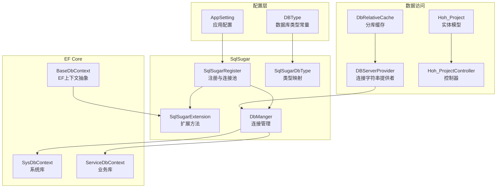
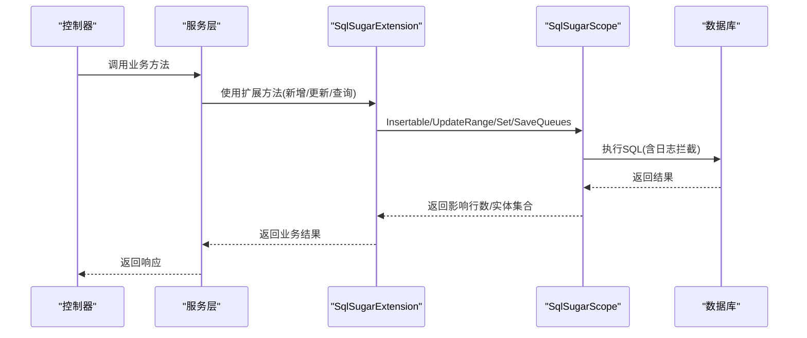
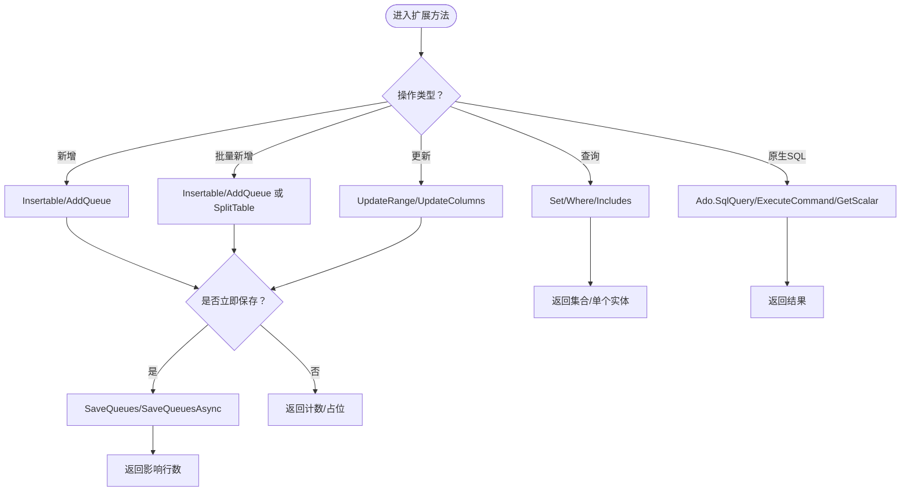
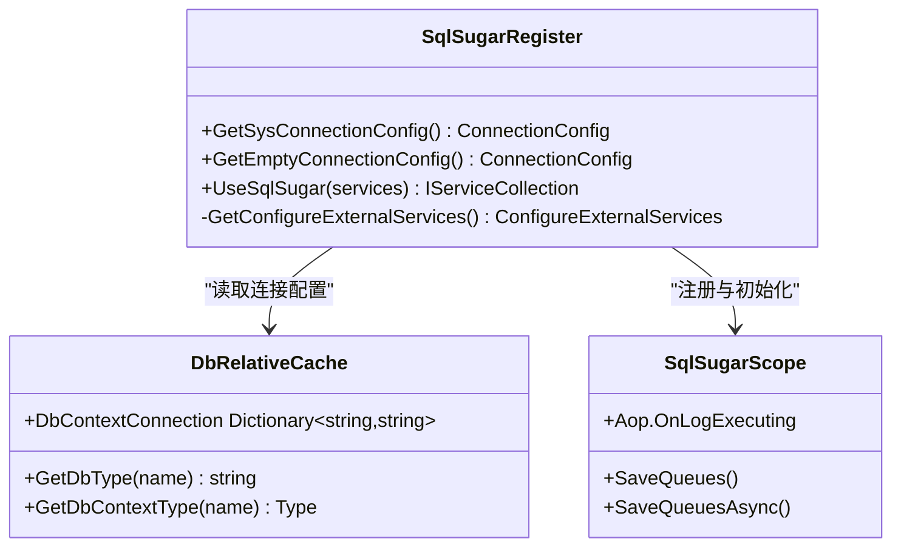
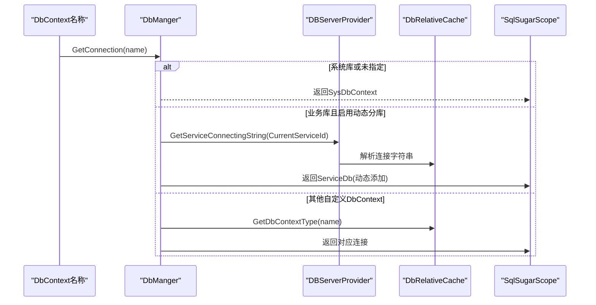
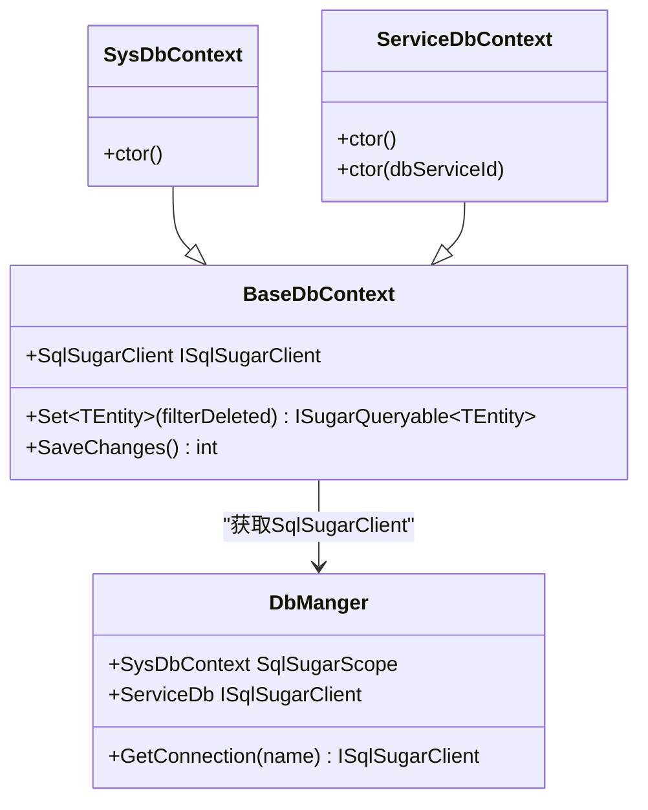
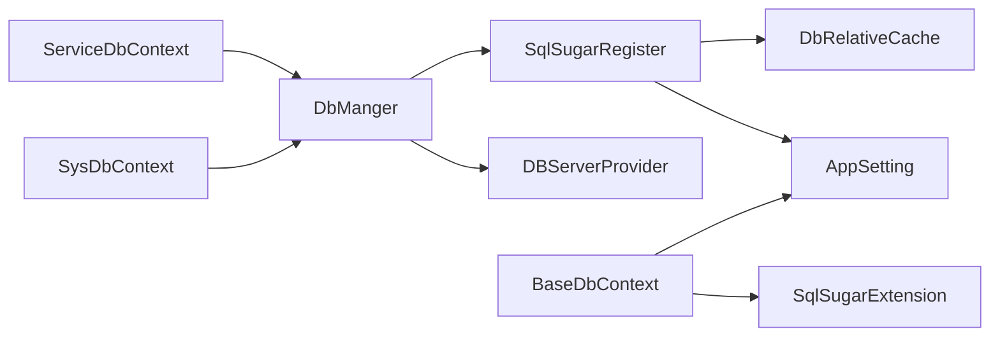

# ORM框架配置

<cite>
**本文引用的文件**
- [SqlSugarExtension.cs](file://VolPro.Core/DbSqlSugar/SqlSugarExtension.cs)
- [SqlSugarRegister.cs](file://VolPro.Core/DbSqlSugar/SqlSugarRegister.cs)
- [DbManger.cs](file://VolPro.Core/DbSqlSugar/DbManger.cs)
- [SqlSugarDbType.cs](file://VolPro.Core/DbSqlSugar/SqlSugarDbType.cs)
- [BaseDbContext.cs](file://VolPro.Core/EFDbContext/BaseDbContext.cs)
- [SysDbContext.cs](file://VolPro.Core/EFDbContext/SysDbContext.cs)
- [ServiceDbContext.cs](file://VolPro.Core/EFDbContext/ServiceDbContext.cs)
- [AppSetting.cs](file://VolPro.Core/Configuration/AppSetting.cs)
- [DBServerProvider.cs](file://VolPro.Core/DbManager/DBServerProvider.cs)
- [DbRelativeCache.cs](file://VolPro.Core/DbManager/DbRelativeCache.cs)
- [DataBaseType.cs](file://VolPro.Core/Const/DataBaseType.cs)
- [Hoh_Project.cs](file://VolPro.Entity/DomainModels/Hoh/Hoh_Project.cs)
- [Hoh_ProjectController.cs](file://VolPro.WebApi/Controllers/HeatOfHydration/Hoh_ProjectController.cs)
</cite>

## 目录
1. [简介](#简介)
2. [项目结构](#项目结构)
3. [核心组件](#核心组件)
4. [架构总览](#架构总览)
5. [详细组件分析](#详细组件分析)
6. [依赖关系分析](#依赖关系分析)
7. [性能考虑](#性能考虑)
8. [故障排查指南](#故障排查指南)
9. [结论](#结论)
10. [附录](#附录)

## 简介
本文件面向“水化热平台”的ORM框架配置，系统化阐述基于SqlSugar的ORM集成与扩展设计，涵盖以下主题：
- 数据库连接字符串配置、连接池与多数据库支持
- SqlSugarExtension扩展方法的实现与使用场景
- EF Core与SqlSugar的协同工作机制
- 数据库类型映射、方言适配与兼容性处理
- 性能优化（查询缓存、批量插入、连接复用）
- 错误处理、异常捕获与调试技巧
- 数据库迁移、版本管理与配置热更新机制

## 项目结构
围绕ORM配置的关键模块分布于以下命名空间与文件：
- VolPro.Core/DbSqlSugar：SqlSugar注册、扩展、连接管理与数据库类型映射
- VolPro.Core/EFDbContext：EF Core上下文抽象与系统/业务库上下文
- VolPro.Core/DbManager：连接字符串提供者、分库缓存与动态租户分库
- VolPro.Core/Configuration：应用配置与连接字符串解密
- VolPro.Core/Const：数据库类型常量
- VolPro.Entity：领域模型与实体特性标注
- VolPro.WebApi/Controllers：控制器入口（以水化热业务为例）

**图表来源**
- [SqlSugarRegister.cs:76-131](file://VolPro.Core/DbSqlSugar/SqlSugarRegister.cs#L76-L131)
- [DbManger.cs:115-131](file://VolPro.Core/DbSqlSugar/DbManger.cs#L115-L131)
- [BaseDbContext.cs:22-35](file://VolPro.Core/EFDbContext/BaseDbContext.cs#L22-L35)
- [SysDbContext.cs:13-17](file://VolPro.Core/EFDbContext/SysDbContext.cs#L13-L17)
- [ServiceDbContext.cs:13-21](file://VolPro.Core/EFDbContext/ServiceDbContext.cs#L13-L21)
- [DbRelativeCache.cs:25-72](file://VolPro.Core/DbManager/DbRelativeCache.cs#L25-L72)
- [DBServerProvider.cs:108-127](file://VolPro.Core/DbManager/DBServerProvider.cs#L108-L127)
- [Hoh_Project.cs:17-18](file://VolPro.Entity/DomainModels/Hoh/Hoh_Project.cs#L17-L18)
- [Hoh_ProjectController.cs:11-18](file://VolPro.WebApi/Controllers/HeatOfHydration/Hoh_ProjectController.cs#L11-L18)

**章节来源**
- [SqlSugarRegister.cs:76-131](file://VolPro.Core/DbSqlSugar/SqlSugarRegister.cs#L76-L131)
- [DbManger.cs:115-131](file://VolPro.Core/DbSqlSugar/DbManger.cs#L115-L131)
- [BaseDbContext.cs:22-35](file://VolPro.Core/EFDbContext/BaseDbContext.cs#L22-L35)
- [SysDbContext.cs:13-17](file://VolPro.Core/EFDbContext/SysDbContext.cs#L13-L17)
- [ServiceDbContext.cs:13-21](file://VolPro.Core/EFDbContext/ServiceDbContext.cs#L13-L21)
- [DbRelativeCache.cs:25-72](file://VolPro.Core/DbManager/DbRelativeCache.cs#L25-L72)
- [DBServerProvider.cs:108-127](file://VolPro.Core/DbManager/DBServerProvider.cs#L108-L127)
- [Hoh_Project.cs:17-18](file://VolPro.Entity/DomainModels/Hoh/Hoh_Project.cs#L17-L18)
- [Hoh_ProjectController.cs:11-18](file://VolPro.WebApi/Controllers/HeatOfHydration/Hoh_ProjectController.cs#L11-L18)

## 核心组件
- SqlSugar注册与连接池
  - 通过服务注册集中管理多个连接配置，支持业务库与系统库的日志拦截与统一生命周期
  - 支持动态分库（租户维度）按需添加连接并复用
- SqlSugar扩展方法
  - 封装新增、批量新增、更新、逻辑删除过滤、原生SQL执行等常用操作
  - 提供队列化保存与分表插入能力
- EF Core上下文抽象
  - BaseDbContext桥接SqlSugarClient，统一Set<TEntity>()与SaveChanges()
  - SysDbContext与ServiceDbContext分别绑定系统库与业务库
- 连接字符串与多数据库支持
  - 基于配置文件与DbRelativeCache缓存，动态解析DbContext到连接字符串与数据库类型
  - 支持MySQL、Oracle、PostgreSQL、Kdbndp、GaussDB、OceanBase、DM等类型映射
- 类型映射与方言适配
  - 针对特定数据库（如DM）进行列名全大写处理
  - 通过ConfigureExternalServices实现字段命名策略定制

**章节来源**
- [SqlSugarRegister.cs:76-131](file://VolPro.Core/DbSqlSugar/SqlSugarRegister.cs#L76-L131)
- [SqlSugarExtension.cs:23-224](file://VolPro.Core/DbSqlSugar/SqlSugarExtension.cs#L23-L224)
- [BaseDbContext.cs:22-40](file://VolPro.Core/EFDbContext/BaseDbContext.cs#L22-L40)
- [SysDbContext.cs:13-17](file://VolPro.Core/EFDbContext/SysDbContext.cs#L13-L17)
- [ServiceDbContext.cs:13-21](file://VolPro.Core/EFDbContext/ServiceDbContext.cs#L13-L21)
- [DbRelativeCache.cs:25-72](file://VolPro.Core/DbManager/DbRelativeCache.cs#L25-L72)
- [SqlSugarDbType.cs:19-67](file://VolPro.Core/DbSqlSugar/SqlSugarDbType.cs#L19-L67)

## 架构总览
SqlSugar与EF Core在本项目中采用“EF抽象 + SqlSugar实现”的协同模式：
- 控制器通过服务层调用，服务层可直接使用SqlSugar扩展方法进行高效数据操作
- EF Core上下文仅作为抽象层，实际查询与变更通过SqlSugarClient完成
- 通过DbManger与DBServerProvider实现连接的集中管理与动态租户分库

**图表来源**
- [SqlSugarExtension.cs:23-224](file://VolPro.Core/DbSqlSugar/SqlSugarExtension.cs#L23-L224)
- [SysDbContext.cs:13-17](file://VolPro.Core/EFDbContext/SysDbContext.cs#L13-L17)
- [ServiceDbContext.cs:13-21](file://VolPro.Core/EFDbContext/ServiceDbContext.cs#L13-L21)

**章节来源**
- [SqlSugarExtension.cs:23-224](file://VolPro.Core/DbSqlSugar/SqlSugarExtension.cs#L23-L224)
- [SysDbContext.cs:13-17](file://VolPro.Core/EFDbContext/SysDbContext.cs#L13-L17)
- [ServiceDbContext.cs:13-21](file://VolPro.Core/EFDbContext/ServiceDbContext.cs#L13-L21)

## 详细组件分析

### 组件A：SqlSugar扩展方法（SqlSugarExtension）
- 新增与批量新增
  - 支持单条与批量插入，并可选择立即保存或队列化延迟保存
  - 对分表实体自动走SplitTable路径，确保按表规则插入
- 更新与批量更新
  - 支持指定字段更新，自动剔除主键字段并校验字段存在性
  - 分表实体走SplitTable执行命令；非分表实体可队列化延迟保存
- 查询与逻辑删除过滤
  - Set<TEntity>(filterDeleted)根据配置自动过滤逻辑删除标记字段
  - 提供FirstOrDefault/First/Include/ThenByDescending等常用查询扩展
- 原生SQL与超时控制
  - 提供SqlQuery/ExecuteCommand/GetScalar等ADO封装
  - SetTimout预留超时设置接口（当前注释，便于后续启用）

**图表来源**
- [SqlSugarExtension.cs:23-224](file://VolPro.Core/DbSqlSugar/SqlSugarExtension.cs#L23-L224)

**章节来源**
- [SqlSugarExtension.cs:23-224](file://VolPro.Core/DbSqlSugar/SqlSugarExtension.cs#L23-L224)

### 组件B：SqlSugar注册与连接池（SqlSugarRegister）
- 多连接配置
  - 从DbRelativeCache缓存中读取所有DbContext连接配置，统一注入SqlSugarScope
  - 为每个连接配置AOP日志拦截，便于调试与性能观测
- 系统库与空库配置
  - 系统库（SysDbContext）与模板空库（用于租户动态分库）独立配置
- 字段命名策略
  - 通过ConfigureExternalServices对特定数据库（如DM）进行列名全大写处理

**图表来源**
- [SqlSugarRegister.cs:30-131](file://VolPro.Core/DbSqlSugar/SqlSugarRegister.cs#L30-L131)
- [DbRelativeCache.cs:25-72](file://VolPro.Core/DbManager/DbRelativeCache.cs#L25-L72)

**章节来源**
- [SqlSugarRegister.cs:30-131](file://VolPro.Core/DbSqlSugar/SqlSugarRegister.cs#L30-L131)
- [DbRelativeCache.cs:25-72](file://VolPro.Core/DbManager/DbRelativeCache.cs#L25-L72)

### 组件C：连接管理与动态租户分库（DbManger、DBServerProvider、DbRelativeCache）
- 连接管理
  - ServiceDb：根据当前用户服务ID动态添加连接，避免重复注册
  - GetConnection：根据DbContext名称选择系统库、业务库或自定义连接
- 连接字符串提供者
  - SysConnectingString/ServiceConnectingString：分别获取系统库与业务库连接
  - 支持动态租户分库：按serviceId生成ConfigId并获取连接
- 分库缓存
  - 初始化DbContext类型、实体类型与数据库类型映射
  - 支持根据DbContext名称获取连接字符串与DbType

**图表来源**
- [DbManger.cs:115-131](file://VolPro.Core/DbSqlSugar/DbManger.cs#L115-L131)
- [DBServerProvider.cs:108-127](file://VolPro.Core/DbManager/DBServerProvider.cs#L108-L127)
- [DbRelativeCache.cs:109-159](file://VolPro.Core/DbManager/DbRelativeCache.cs#L109-L159)

**章节来源**
- [DbManger.cs:26-90](file://VolPro.Core/DbSqlSugar/DbManger.cs#L26-L90)
- [DBServerProvider.cs:108-127](file://VolPro.Core/DbManager/DBServerProvider.cs#L108-L127)
- [DbRelativeCache.cs:99-159](file://VolPro.Core/DbManager/DbRelativeCache.cs#L99-L159)

### 组件D：EF Core与SqlSugar的协同（BaseDbContext、SysDbContext、ServiceDbContext）
- BaseDbContext
  - 暴露SqlSugarClient，统一Set<TEntity>()与SaveChanges()行为
  - 通过SqlSugarExtension.Set<TEntity>()实现逻辑删除过滤
- SysDbContext/ServiceDbContext
  - 分别绑定系统库与业务库的SqlSugarScope实例
  - 通过DbManger集中管理连接生命周期

**图表来源**
- [BaseDbContext.cs:22-40](file://VolPro.Core/EFDbContext/BaseDbContext.cs#L22-L40)
- [SysDbContext.cs:13-17](file://VolPro.Core/EFDbContext/SysDbContext.cs#L13-L17)
- [ServiceDbContext.cs:13-21](file://VolPro.Core/EFDbContext/ServiceDbContext.cs#L13-L21)
- [DbManger.cs:95-104](file://VolPro.Core/DbSqlSugar/DbManger.cs#L95-L104)

**章节来源**
- [BaseDbContext.cs:22-40](file://VolPro.Core/EFDbContext/BaseDbContext.cs#L22-L40)
- [SysDbContext.cs:13-17](file://VolPro.Core/EFDbContext/SysDbContext.cs#L13-L17)
- [ServiceDbContext.cs:13-21](file://VolPro.Core/EFDbContext/ServiceDbContext.cs#L13-L21)
- [DbManger.cs:95-104](file://VolPro.Core/DbSqlSugar/DbManger.cs#L95-L104)

### 组件E：数据库类型映射与方言适配（SqlSugarDbType、ConfigureExternalServices）
- 类型映射
  - 根据DbContext名称或全局DBType映射至SqlSugar DbType，支持MySQL、Oracle、PostgreSQL、Kdbndp、GaussDB、OceanBase、DM等
- 方言适配
  - 通过ConfigureExternalServices在实体映射阶段对列名进行全大写处理（针对DM等数据库）
  - 在SqlSugarRegister与DbManger中分别配置实体服务回调

**章节来源**
- [SqlSugarDbType.cs:19-67](file://VolPro.Core/DbSqlSugar/SqlSugarDbType.cs#L19-L67)
- [SqlSugarRegister.cs:137-151](file://VolPro.Core/DbSqlSugar/SqlSugarRegister.cs#L137-L151)
- [DbManger.cs:43-51](file://VolPro.Core/DbSqlSugar/DbManger.cs#L43-L51)

## 依赖关系分析
- 组件耦合
  - SqlSugarRegister依赖DbRelativeCache与AppSetting，集中构建连接配置
  - DbManger依赖DBServerProvider与SqlSugarRegister，负责运行时连接管理
  - BaseDbContext依赖SqlSugarExtension与AppSetting，提供统一查询与保存接口
- 外部依赖
  - SqlSugar：ORM核心能力（连接、AOP、分表、队列保存）
  - EF Core：上下文抽象与生命周期管理（本项目以桥接方式使用）

**图表来源**
- [SqlSugarRegister.cs:76-131](file://VolPro.Core/DbSqlSugar/SqlSugarRegister.cs#L76-L131)
- [DbManger.cs:115-131](file://VolPro.Core/DbSqlSugar/DbManger.cs#L115-L131)
- [BaseDbContext.cs:22-40](file://VolPro.Core/EFDbContext/BaseDbContext.cs#L22-L40)
- [SysDbContext.cs:13-17](file://VolPro.Core/EFDbContext/SysDbContext.cs#L13-L17)
- [ServiceDbContext.cs:13-21](file://VolPro.Core/EFDbContext/ServiceDbContext.cs#L13-L21)

**章节来源**
- [SqlSugarRegister.cs:76-131](file://VolPro.Core/DbSqlSugar/SqlSugarRegister.cs#L76-L131)
- [DbManger.cs:115-131](file://VolPro.Core/DbSqlSugar/DbManger.cs#L115-L131)
- [BaseDbContext.cs:22-40](file://VolPro.Core/EFDbContext/BaseDbContext.cs#L22-L40)
- [SysDbContext.cs:13-17](file://VolPro.Core/EFDbContext/SysDbContext.cs#L13-L17)
- [ServiceDbContext.cs:13-21](file://VolPro.Core/EFDbContext/ServiceDbContext.cs#L13-L21)

## 性能考虑
- 连接复用与连接池
  - 通过SqlSugarScope集中管理连接，避免频繁创建销毁连接
  - 业务库与系统库分离，降低锁竞争与资源争用
- 队列化批量操作
  - 插入/更新均支持AddQueue/UpdateRange队列化，减少网络往返
  - SaveQueues一次性提交，显著提升批量写入性能
- 日志与可观测性
  - AOP OnLogExecuting统一拦截SQL执行，便于定位慢查询与异常
- 字段命名策略
  - 针对特定数据库进行列名全大写，避免大小写不一致导致的索引失效
- 查询缓存
  - 可结合外部缓存（如Redis/MemoryCache）对热点查询结果进行缓存（本项目未直接内置SqlSugar查询缓存，建议在服务层实现）

[本节为通用性能建议，不直接分析具体文件]

## 故障排查指南
- 连接字符串问题
  - 确认AppSetting中Connection节与Secret节配置正确，且已解密成功
  - 检查DbRelativeCache是否正确缓存了DbContext名称与连接字符串
- 数据库类型映射错误
  - 核对DbContext名称与对应DbType配置项（如ServiceDbType），确保SqlSugarDbType映射正确
- 分表实体未生效
  - 确认实体具备分表特性标记，扩展方法会自动识别并走SplitTable路径
- 逻辑删除过滤无效
  - 确认AppSetting.LogicDelField已配置，且实体存在对应字段
- EF Core与SqlSugar协同异常
  - 检查BaseDbContext.SqlSugarClient是否正确赋值（SysDbContext/ServiceDbContext构造函数）
- 日志与调试
  - 利用AOP OnLogExecuting输出SQL，定位执行计划与参数绑定问题

**章节来源**
- [AppSetting.cs:144-163](file://VolPro.Core/Configuration/AppSetting.cs#L144-L163)
- [DbRelativeCache.cs:56-67](file://VolPro.Core/DbManager/DbRelativeCache.cs#L56-L67)
- [SqlSugarExtension.cs:194-206](file://VolPro.Core/DbSqlSugar/SqlSugarExtension.cs#L194-L206)
- [SysDbContext.cs:15-17](file://VolPro.Core/EFDbContext/SysDbContext.cs#L15-L17)
- [ServiceDbContext.cs:17-21](file://VolPro.Core/EFDbContext/ServiceDbContext.cs#L17-L21)

## 结论
本ORM配置以SqlSugar为核心，结合EF Core上下文抽象，实现了：
- 多数据库类型与方言适配
- 动态租户分库与连接复用
- 批量操作与队列化保存
- 统一日志拦截与可观察性
在保证灵活性的同时，兼顾性能与可维护性。建议在服务层进一步引入查询缓存与事务边界管理，以满足高并发场景需求。

[本节为总结性内容，不直接分析具体文件]

## 附录

### A. 数据库类型映射对照
- ServiceDbType: 对应DbType枚举（如mysql、oracle、pgsql、kdbndp、gaussdb、oceanbase、dm）

**章节来源**
- [DbRelativeCache.cs:56-61](file://VolPro.Core/DbManager/DbRelativeCache.cs#L56-L61)
- [SqlSugarDbType.cs:37-66](file://VolPro.Core/DbSqlSugar/SqlSugarDbType.cs#L37-L66)

### B. 实体与数据库服务器映射示例
- Hoh_Project实体通过Entity特性标注DBServer为ServiceDbContext，表示该实体归属业务库

**章节来源**
- [Hoh_Project.cs:17-18](file://VolPro.Entity/DomainModels/Hoh/Hoh_Project.cs#L17-L18)

### C. 控制器与服务调用链示例
- Hoh_ProjectController通过ApiBaseController与服务层交互，服务层可直接使用SqlSugar扩展方法

**章节来源**
- [Hoh_ProjectController.cs:11-18](file://VolPro.WebApi/Controllers/HeatOfHydration/Hoh_ProjectController.cs#L11-L18)