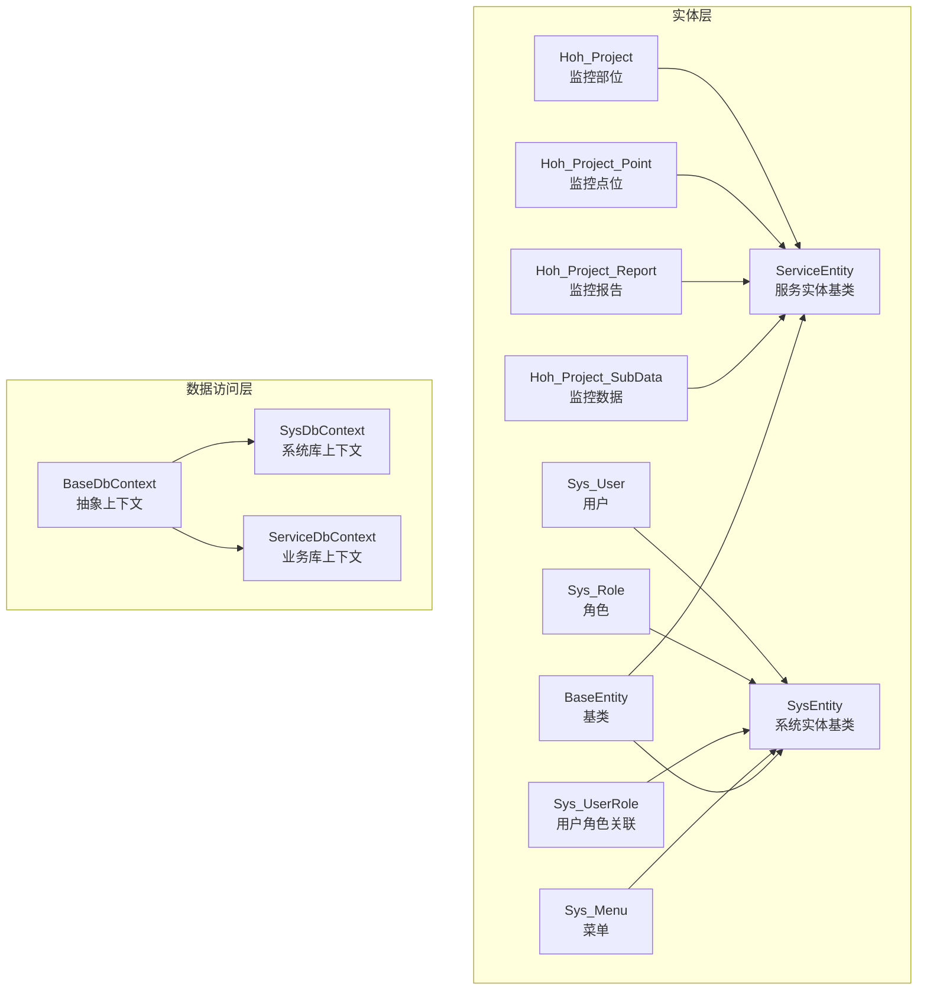
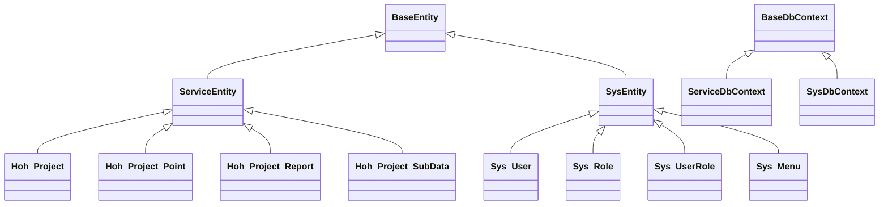
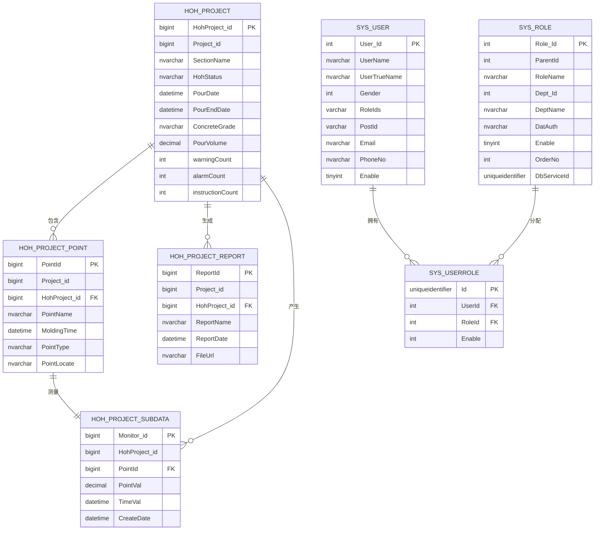
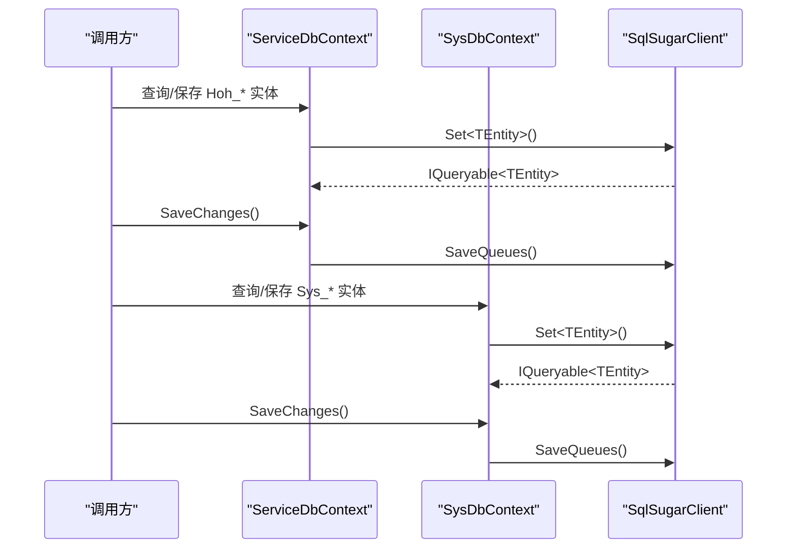
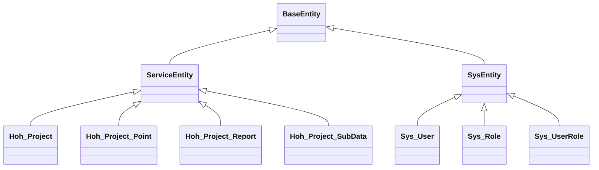
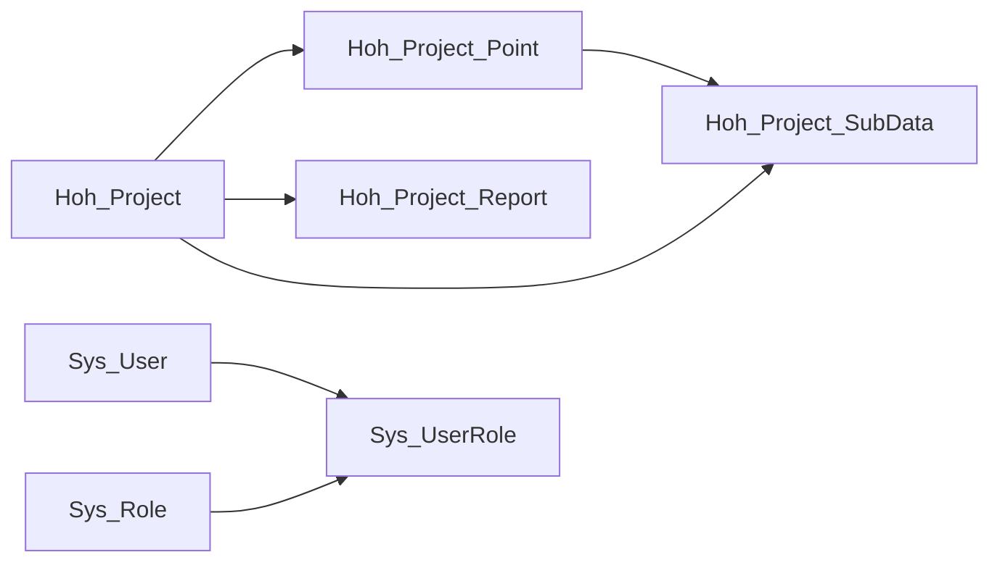

# 数据库设计

<cite>
**本文引用的文件**
- [BaseEntity.cs](file://VolPro.Entity/SystemModels/BaseEntity.cs)
- [SysEntity.cs](file://VolPro.Entity/SystemModels/SysEntity.cs)
- [ServiceEntity.cs](file://VolPro.Entity/SystemModels/ServiceEntity.cs)
- [Hoh_Project.cs](file://VolPro.Entity/DomainModels/Hoh/Hoh_Project.cs)
- [Hoh_Project_Point.cs](file://VolPro.Entity/DomainModels/Hoh/Hoh_Project_Point.cs)
- [Hoh_Project_Report.cs](file://VolPro.Entity/DomainModels/Hoh/Hoh_Project_Report.cs)
- [Hoh_Project_SubData.cs](file://VolPro.Entity/DomainModels/Hoh/Hoh_Project_SubData.cs)
- [Sys_User.cs](file://VolPro.Entity/DomainModels/System/Sys_User.cs)
- [Sys_Role.cs](file://VolPro.Entity/DomainModels/System/Sys_Role.cs)
- [Sys_UserRole.cs](file://VolPro.Entity/DomainModels/System/Sys_UserRole.cs)
- [Sys_Menu.cs](file://VolPro.Entity/DomainModels/System/Sys_Menu.cs)
- [BaseDbContext.cs](file://VolPro.Core/EFDbContext/BaseDbContext.cs)
- [SysDbContext.cs](file://VolPro.Core/EFDbContext/SysDbContext.cs)
- [ServiceDbContext.cs](file://VolPro.Core/EFDbContext/ServiceDbContext.cs)
</cite>

## 目录
1. [简介](#简介)
2. [项目结构](#项目结构)
3. [核心组件](#核心组件)
4. [架构总览](#架构总览)
5. [详细组件分析](#详细组件分析)
6. [依赖分析](#依赖分析)
7. [性能考虑](#性能考虑)
8. [故障排查指南](#故障排查指南)
9. [结论](#结论)
10. [附录](#附录)

## 简介
本文件面向“水化热平台”的数据库设计，系统性阐述实体关系模型的设计理念与实现方式，重点覆盖以下方面：
- 核心业务实体：Hoh_Project（监控部位）、Hoh_Project_Point（监控点位）、Hoh_Project_Report（监控报告）、Hoh_Project_SubData（监控数据）
- 系统管理实体：Sys_User（用户）、Sys_Role（角色）、Sys_UserRole（用户角色关联）、Sys_Menu（菜单）
- 表结构设计原则：主键设计、外键约束、字段类型选择、命名规范
- 索引策略与查询优化：复合索引设计思路、查询路径优化建议
- 继承体系：BaseEntity 基类与 ServiceEntity/SysEntity 的映射
- 版本管理与迁移：变更流程与最佳实践
- 完整性与一致性：数据完整性、参照完整性与事务一致性保障

## 项目结构
围绕数据库设计，项目采用分层与领域模型结合的方式组织：
- 实体层（VolPro.Entity）：定义业务与系统实体及其特性标注
- 数据访问层（VolPro.Core EFDbContext）：通过 SqlSugarClient 抽象不同数据库服务
- 仓储与服务层：位于上层工程中，基于实体与上下文进行数据操作

图表来源
- [BaseEntity.cs:1-11](file://VolPro.Entity/SystemModels/BaseEntity.cs#L1-L11)
- [SysEntity.cs:1-11](file://VolPro.Entity/SystemModels/SysEntity.cs#L1-L11)
- [ServiceEntity.cs:1-11](file://VolPro.Entity/SystemModels/ServiceEntity.cs#L1-L11)
- [Hoh_Project.cs:17-29](file://VolPro.Entity/DomainModels/Hoh/Hoh_Project.cs#L17-L29)
- [Hoh_Project_Point.cs:17-47](file://VolPro.Entity/DomainModels/Hoh/Hoh_Project_Point.cs#L17-L47)
- [Hoh_Project_Report.cs:17-29](file://VolPro.Entity/DomainModels/Hoh/Hoh_Project_Report.cs#L17-L29)
- [Hoh_Project_SubData.cs:17-29](file://VolPro.Entity/DomainModels/Hoh/Hoh_Project_SubData.cs#L17-L29)
- [Sys_User.cs:18-29](file://VolPro.Entity/DomainModels/System/Sys_User.cs#L18-L29)
- [Sys_Role.cs:18-29](file://VolPro.Entity/DomainModels/System/Sys_Role.cs#L18-L29)
- [Sys_UserRole.cs:17-29](file://VolPro.Entity/DomainModels/System/Sys_UserRole.cs#L17-L29)
- [Sys_Menu.cs:19-33](file://VolPro.Entity/DomainModels/System/Sys_Menu.cs#L19-L33)
- [BaseDbContext.cs:18-40](file://VolPro.Core/EFDbContext/BaseDbContext.cs#L18-L40)
- [SysDbContext.cs:13-18](file://VolPro.Core/EFDbContext/SysDbContext.cs#L13-L18)
- [ServiceDbContext.cs:13-29](file://VolPro.Core/EFDbContext/ServiceDbContext.cs#L13-L29)

章节来源
- [BaseEntity.cs:1-11](file://VolPro.Entity/SystemModels/BaseEntity.cs#L1-L11)
- [SysEntity.cs:1-11](file://VolPro.Entity/SystemModels/SysEntity.cs#L1-L11)
- [ServiceEntity.cs:1-11](file://VolPro.Entity/SystemModels/ServiceEntity.cs#L1-L11)
- [BaseDbContext.cs:18-40](file://VolPro.Core/EFDbContext/BaseDbContext.cs#L18-L40)
- [SysDbContext.cs:13-18](file://VolPro.Core/EFDbContext/SysDbContext.cs#L13-L18)
- [ServiceDbContext.cs:13-29](file://VolPro.Core/EFDbContext/ServiceDbContext.cs#L13-L29)

## 核心组件
本节聚焦关键实体与上下文，说明其职责、主键与字段类型选择、以及与数据库上下文的绑定。

- Hoh_Project（监控部位）
  - 主键：HohProject_id（bigint，自增）
  - 关键字段：Project_id（bigint），SectionName（nvarchar(200)），HohStatus（nvarchar(20)），PourDate/PourEndDate（datetime），ConcreteGrade（nvarchar(50)），PourVolume（decimal），warningCount/alarmCount/instructionCount（int），CreateDate/CreateID/Creator/Modifier/ModifyDate/ModifyID（时间与人员字段），Remark（text(16)），WaterFlow（nvarchar(500)）
  - 上下文绑定：DBServer = ServiceDbContext

- Hoh_Project_Point（监控点位）
  - 主键：PointId（bigint，自增）
  - 外键：Project_id（bigint），HohProject_id（bigint）
  - 字段：PointName（nvarchar(50)），MoldingTime（datetime），PointType（nvarchar(50)），PointLocate（nvarchar(500)），以及标准审计字段
  - 上下文绑定：DBServer = ServiceDbContext

- Hoh_Project_Report（监控报告）
  - 主键：ReportId（bigint，自增）
  - 外键：Project_id（bigint），HohProject_id（bigint）
  - 字段：ReportName（nvarchar(50)），ReportDate（datetime），FileUrl（nvarchar(500)），以及标准审计字段
  - 上下文绑定：DBServer = ServiceDbContext

- Hoh_Project_SubData（监控数据）
  - 主键：Monitor_id（bigint，自增）
  - 外键：HohProject_id（可空 bigint），PointId（bigint）
  - 字段：PointVal（decimal），TimeVal（datetime），CreateDate（datetime）
  - 上下文绑定：DBServer = ServiceDbContext

- Sys_User（用户）
  - 主键：User_Id（int，自增）
  - 字段：UserName/UserTrueName（nvarchar(100)/nvarchar(200)），Gender（int），HeadImageUrl（nvarchar(200)），RoleIds（varchar(2000)），PostId（varchar(2000)），Email/PhoneNo（nvarchar(200)/nvarchar(11)），Token（nvarchar(500)），UserPwd（nvarchar(200)，序列化排除），Enable（tinyint），CreateDate/CreateID/Creator/Modifier/ModifyDate/LastLoginDate/LastModifyPwdDate/Remark/OrderNo/DeptIds（多类审计与扩展字段），DefaultUrl（varchar(500)）
  - 上下文绑定：DBServer = SysDbContext

- Sys_Role（角色）
  - 主键：Role_Id（int，自增）
  - 字段：ParentId（int），RoleName（nvarchar(50)），Dept_Id/DeptName（int/nvarchar(50)），DatAuth（nvarchar(400)），Enable（tinyint），OrderNo（int），Creator/CreateDate/Modifier/ModifyDate/DeleteBy（guid，序列化排除），DbServiceId（uniqueidentifier）
  - 上下文绑定：DBServer = SysDbContext

- Sys_UserRole（用户角色关联）
  - 主键：Id（uniqueidentifier）
  - 外键：UserId（int），RoleId（int）
  - 字段：Enable（int），CreateID/Creator/CreateDate/ModifyID/Modifier/ModifyDate
  - 上下文绑定：DBServer = SysDbContext

- Sys_Menu（菜单）
  - 主键：Menu_Id（int，自增）
  - 字段：ParentId（int），MenuName（nvarchar(50)），TableName/Url/Auth（nvarchar(200)/nvarchar(10000)/nvarchar(10000)），AuthData/LinkType（int），Description（nvarchar(200)），Icon（nvarchar(50)），OrderNo（int），Creator/Creator/Modifier/ModifyDate（时间与人员字段），Enable（tinyint），MenuType（int）
  - 上下文绑定：SysDbContext（直接标注）

章节来源
- [Hoh_Project.cs:17-229](file://VolPro.Entity/DomainModels/Hoh/Hoh_Project.cs#L17-L229)
- [Hoh_Project_Point.cs:17-137](file://VolPro.Entity/DomainModels/Hoh/Hoh_Project_Point.cs#L17-L137)
- [Hoh_Project_Report.cs:17-129](file://VolPro.Entity/DomainModels/Hoh/Hoh_Project_Report.cs#L17-L129)
- [Hoh_Project_SubData.cs:17-76](file://VolPro.Entity/DomainModels/Hoh/Hoh_Project_SubData.cs#L17-L76)
- [Sys_User.cs:18-228](file://VolPro.Entity/DomainModels/System/Sys_User.cs#L18-L228)
- [Sys_Role.cs:18-141](file://VolPro.Entity/DomainModels/System/Sys_Role.cs#L18-L141)
- [Sys_UserRole.cs:17-109](file://VolPro.Entity/DomainModels/System/Sys_UserRole.cs#L17-L109)
- [Sys_Menu.cs:19-183](file://VolPro.Entity/DomainModels/System/Sys_Menu.cs#L19-L183)

## 架构总览
系统通过两个数据库上下文分离“业务”与“系统”数据域：
- ServiceDbContext：承载水化热业务实体（Hoh_*）
- SysDbContext：承载系统管理实体（Sys_*）

图表来源
- [BaseEntity.cs:7-9](file://VolPro.Entity/SystemModels/BaseEntity.cs#L7-L9)
- [SysEntity.cs:7-9](file://VolPro.Entity/SystemModels/SysEntity.cs#L7-L9)
- [ServiceEntity.cs:7-9](file://VolPro.Entity/SystemModels/ServiceEntity.cs#L7-L9)
- [Hoh_Project.cs:18](file://VolPro.Entity/DomainModels/Hoh/Hoh_Project.cs#L18)
- [Hoh_Project_Point.cs:18](file://VolPro.Entity/DomainModels/Hoh/Hoh_Project_Point.cs#L18)
- [Hoh_Project_Report.cs:18](file://VolPro.Entity/DomainModels/Hoh/Hoh_Project_Report.cs#L18)
- [Hoh_Project_SubData.cs:18](file://VolPro.Entity/DomainModels/Hoh/Hoh_Project_SubData.cs#L18)
- [Sys_User.cs:19](file://VolPro.Entity/DomainModels/System/Sys_User.cs#L19)
- [Sys_Role.cs:19](file://VolPro.Entity/DomainModels/System/Sys_Role.cs#L19)
- [Sys_UserRole.cs:18](file://VolPro.Entity/DomainModels/System/Sys_UserRole.cs#L18)
- [Sys_Menu.cs:21](file://VolPro.Entity/DomainModels/System/Sys_Menu.cs#L21)
- [BaseDbContext.cs:18-40](file://VolPro.Core/EFDbContext/BaseDbContext.cs#L18-L40)
- [ServiceDbContext.cs:13-29](file://VolPro.Core/EFDbContext/ServiceDbContext.cs#L13-L29)
- [SysDbContext.cs:13-18](file://VolPro.Core/EFDbContext/SysDbContext.cs#L13-L18)

## 详细组件分析

### 实体关系与外键设计
- Hoh_Project_Point.HohProject_id → Hoh_Project.HohProject_id
- Hoh_Project_Report.HohProject_id → Hoh_Project.HohProject_id
- Hoh_Project_SubData.PointId → Hoh_Project_Point.PointId
- Hoh_Project_SubData.HohProject_id → Hoh_Project.HohProject_id
- Sys_UserRole.UserId → Sys_User.User_Id
- Sys_UserRole.RoleId → Sys_Role.Role_Id

图表来源
- [Hoh_Project.cs:23-48](file://VolPro.Entity/DomainModels/Hoh/Hoh_Project.cs#L23-L48)
- [Hoh_Project_Point.cs:24-47](file://VolPro.Entity/DomainModels/Hoh/Hoh_Project_Point.cs#L24-L47)
- [Hoh_Project_Report.cs:24-47](file://VolPro.Entity/DomainModels/Hoh/Hoh_Project_Report.cs#L24-L47)
- [Hoh_Project_SubData.cs:24-46](file://VolPro.Entity/DomainModels/Hoh/Hoh_Project_SubData.cs#L24-L46)
- [Sys_User.cs:24-29](file://VolPro.Entity/DomainModels/System/Sys_User.cs#L24-L29)
- [Sys_Role.cs:24-29](file://VolPro.Entity/DomainModels/System/Sys_Role.cs#L24-L29)
- [Sys_UserRole.cs:23-47](file://VolPro.Entity/DomainModels/System/Sys_UserRole.cs#L23-L47)

章节来源
- [Hoh_Project.cs:23-48](file://VolPro.Entity/DomainModels/Hoh/Hoh_Project.cs#L23-L48)
- [Hoh_Project_Point.cs:24-47](file://VolPro.Entity/DomainModels/Hoh/Hoh_Project_Point.cs#L24-L47)
- [Hoh_Project_Report.cs:24-47](file://VolPro.Entity/DomainModels/Hoh/Hoh_Project_Report.cs#L24-L47)
- [Hoh_Project_SubData.cs:24-46](file://VolPro.Entity/DomainModels/Hoh/Hoh_Project_SubData.cs#L24-L46)
- [Sys_UserRole.cs:23-47](file://VolPro.Entity/DomainModels/System/Sys_UserRole.cs#L23-L47)

### 上下文与数据访问
- BaseDbContext 提供统一的 SqlSugarClient 访问入口与 SaveQueues 批处理保存能力
- ServiceDbContext 用于业务库（Hoh_*）上下文
- SysDbContext 用于系统库（Sys_*）上下文

图表来源
- [BaseDbContext.cs:32-40](file://VolPro.Core/EFDbContext/BaseDbContext.cs#L32-L40)
- [ServiceDbContext.cs:13-29](file://VolPro.Core/EFDbContext/ServiceDbContext.cs#L13-L29)
- [SysDbContext.cs:13-18](file://VolPro.Core/EFDbContext/SysDbContext.cs#L13-L18)

章节来源
- [BaseDbContext.cs:32-40](file://VolPro.Core/EFDbContext/BaseDbContext.cs#L32-L40)
- [ServiceDbContext.cs:13-29](file://VolPro.Core/EFDbContext/ServiceDbContext.cs#L13-L29)
- [SysDbContext.cs:13-18](file://VolPro.Core/EFDbContext/SysDbContext.cs#L13-L18)

### 继承体系与实体映射
- BaseEntity：所有实体的抽象基类
- ServiceEntity：业务实体基类（Hoh_*）
- SysEntity：系统实体基类（Sys_*）
- 各实体通过 Entity/Table 特性标注表名与上下文绑定

图表来源
- [BaseEntity.cs:7-9](file://VolPro.Entity/SystemModels/BaseEntity.cs#L7-L9)
- [SysEntity.cs:7-9](file://VolPro.Entity/SystemModels/SysEntity.cs#L7-L9)
- [ServiceEntity.cs:7-9](file://VolPro.Entity/SystemModels/ServiceEntity.cs#L7-L9)
- [Hoh_Project.cs:18](file://VolPro.Entity/DomainModels/Hoh/Hoh_Project.cs#L18)
- [Sys_User.cs:19](file://VolPro.Entity/DomainModels/System/Sys_User.cs#L19)

章节来源
- [BaseEntity.cs:7-9](file://VolPro.Entity/SystemModels/BaseEntity.cs#L7-L9)
- [SysEntity.cs:7-9](file://VolPro.Entity/SystemModels/SysEntity.cs#L7-L9)
- [ServiceEntity.cs:7-9](file://VolPro.Entity/SystemModels/ServiceEntity.cs#L7-L9)

## 依赖分析
- 业务实体依赖 ServiceEntity，系统实体依赖 SysEntity
- ServiceDbContext/SysDbContext 通过 BaseDbContext 暴露统一接口
- 实体间通过显式外键字段建立关系，避免 ORM 隐式导航导致的耦合

图表来源
- [Hoh_Project_Point.cs:24-47](file://VolPro.Entity/DomainModels/Hoh/Hoh_Project_Point.cs#L24-L47)
- [Hoh_Project_Report.cs:24-47](file://VolPro.Entity/DomainModels/Hoh/Hoh_Project_Report.cs#L24-L47)
- [Hoh_Project_SubData.cs:24-46](file://VolPro.Entity/DomainModels/Hoh/Hoh_Project_SubData.cs#L24-L46)
- [Sys_UserRole.cs:23-47](file://VolPro.Entity/DomainModels/System/Sys_UserRole.cs#L23-L47)

章节来源
- [Hoh_Project_Point.cs:24-47](file://VolPro.Entity/DomainModels/Hoh/Hoh_Project_Point.cs#L24-L47)
- [Hoh_Project_Report.cs:24-47](file://VolPro.Entity/DomainModels/Hoh/Hoh_Project_Report.cs#L24-L47)
- [Hoh_Project_SubData.cs:24-46](file://VolPro.Entity/DomainModels/Hoh/Hoh_Project_SubData.cs#L24-L46)
- [Sys_UserRole.cs:23-47](file://VolPro.Entity/DomainModels/System/Sys_UserRole.cs#L23-L47)

## 性能考虑
- 主键设计
  - 业务主键普遍使用自增 bigint，降低热点写入冲突概率；系统主键使用 int 或 uniqueidentifier，满足用户/角色等基数较小场景
- 字段类型选择
  - 文本类字段采用 nvarchar(n) 控制长度；数值型采用 decimal 并明确精度；布尔类采用 tinyint/int 以兼容不同数据库方言
- 索引策略建议
  - 查询热点字段：Hoh_Project.SectionName、Hoh_Project.HohStatus、Hoh_Project.Project_id
  - 关联查询字段：Hoh_Project_Point.HohProject_id、Hoh_Project_Report.HohProject_id、Hoh_Project_SubData.PointId/TimeVal
  - 用户/角色：Sys_User.UserName、Sys_UserRole.UserId/RoleId
  - 建议复合索引组合：
    - Hoh_Project(Point_id, HohStatus, PourDate)
    - Hoh_Project_SubData(PointId, TimeVal)
    - Sys_User(UserName, Enable)
    - Sys_UserRole(UserId, RoleId, Enable)
- 查询优化技巧
  - 使用投影查询减少字段传输
  - 对时间范围查询使用边界索引
  - 批量写入使用 SaveQueues 提升吞吐
- 缓存与批处理
  - 利用 SqlSugar 的队列提交能力减少往返开销

## 故障排查指南
- 常见问题
  - 主键重复或类型不匹配：检查实体主键标注与数据库定义一致
  - 外键约束失败：确认关联字段类型与取值范围
  - 上下文绑定错误：核对实体上的 DBServer 与实际上下文映射
- 排查步骤
  - 核对实体特性标注与数据库表结构
  - 检查 SaveChanges 是否正确调用 SaveQueues
  - 使用最小复现查询定位索引缺失或类型不匹配

## 结论
本设计以清晰的实体继承体系与上下文分离为基础，围绕水化热业务与系统管理构建了高内聚、低耦合的数据模型。通过合理的主键与字段类型设计、建议的索引策略与查询优化，能够有效支撑平台的读写性能与扩展需求。配合完善的上下文与批处理机制，可进一步提升事务一致性与整体稳定性。

## 附录
- 数据库版本管理与迁移最佳实践
  - 迁移脚本按模块拆分（Hoh_* 与 Sys_*），确保独立演进
  - 使用版本号前缀标识迁移批次，记录变更摘要
  - 在灰度环境验证后再推进到生产
- 数据完整性与参照完整性
  - 显式外键字段与实体标注共同保证关系完整性
  - 通过上下文统一事务控制，结合 SaveQueues 保证批量写入一致性
- 命名规范
  - 表名与字段采用英文语义化命名，避免缩写歧义
  - 审计字段统一（Creator/Modifier/CreateDate/ModifyDate/CreateID/ModifyID）