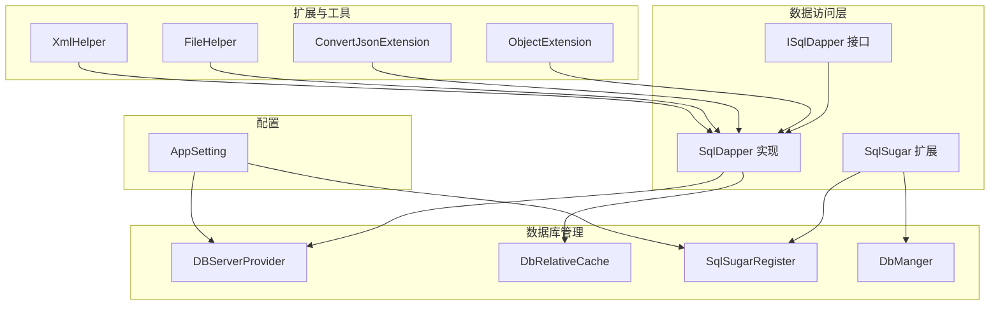
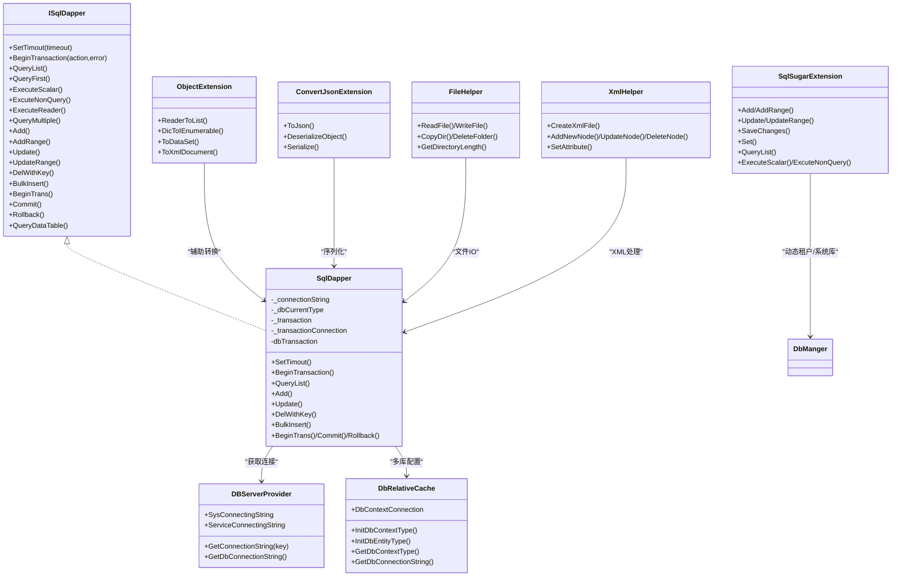
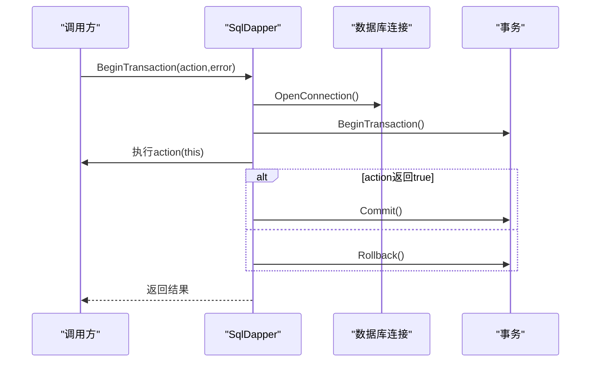
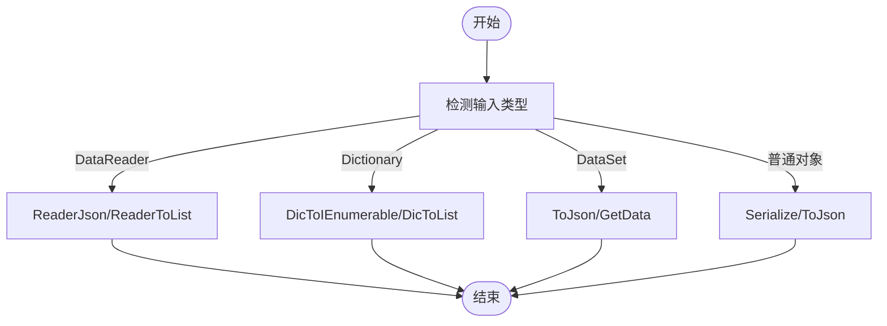
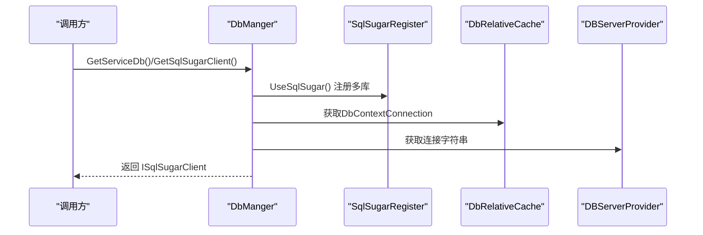
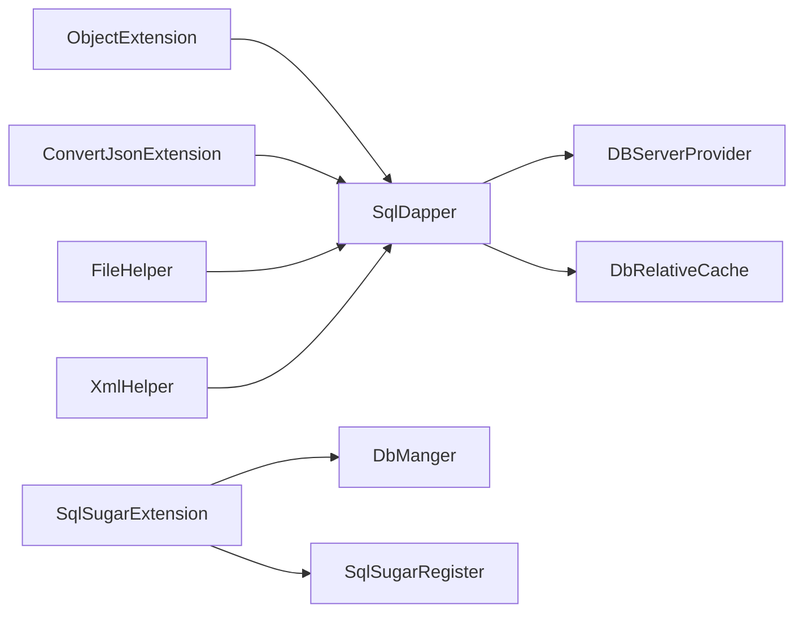

# 数据操作与事务

<cite>
**本文档引用的文件**
- [ISqlDapper.cs](file://VolPro.Core/Dapper/ISqlDapper.cs)
- [SqlDapper.cs](file://VolPro.Core/Dapper/SqlDapper.cs)
- [ObjectExtension.cs](file://VolPro.Core/Extensions/ObjectExtension.cs)
- [ConvertJsonExtension.cs](file://VolPro.Core/Extensions/ConvertJsonExtension.cs)
- [DBServerProvider.cs](file://VolPro.Core/DbManager/DBServerProvider.cs)
- [DbRelativeCache.cs](file://VolPro.Core/DbManager/DbRelativeCache.cs)
- [SqlSugarRegister.cs](file://VolPro.Core/DbSqlSugar/SqlSugarRegister.cs)
- [DbManger.cs](file://VolPro.Core/DbSqlSugar/DbManger.cs)
- [SqlSugarExtension.cs](file://VolPro.Core/DbSqlSugar/SqlSugarExtension.cs)
- [AppSetting.cs](file://VolPro.Core/Configuration/AppSetting.cs)
- [FileHelper.cs](file://VolPro.Core/Utilities/FileHelper.cs)
- [XmlHelper.cs](file://VolPro.Core/Utilities/XmlHelper.cs)
</cite>

## 目录
1. [简介](#简介)
2. [项目结构](#项目结构)
3. [核心组件](#核心组件)
4. [架构总览](#架构总览)
5. [详细组件分析](#详细组件分析)
6. [依赖关系分析](#依赖关系分析)
7. [性能考虑](#性能考虑)
8. [故障排查指南](#故障排查指南)
9. [结论](#结论)
10. [附录](#附录)

## 简介
本文件面向“水化热平台”的数据层与事务管理，系统性梳理基于 Dapper 的轻量级 ORM 实现（SqlDapper 与 ISqlDapper 接口）、事务管理策略（本地事务、嵌套事务与分布式事务支持思路）、数据操作模式（增删改查、批量操作、复杂查询）、数据转换与序列化（ObjectExtension、ConvertJsonExtension）、文件与 XML 处理（FileHelper、XmlHelper），并给出性能优化、一致性保障与并发控制的最佳实践。

## 项目结构
围绕数据操作与事务的关键模块分布如下：
- Dapper 层：ISqlDapper 接口与 SqlDapper 实现，统一查询、执行、批量与事务能力
- 扩展层：ObjectExtension（实体映射、Reader 转换、DataSet/Xml 输出）、ConvertJsonExtension（序列化/反序列化）
- 数据库管理：DBServerProvider（连接字符串获取）、DbRelativeCache（多库缓存与动态分库）
- SqlSugar 集成：SqlSugarRegister（注册多库连接）、DbManger（动态租户/系统库访问）、SqlSugarExtension（扩展方法）
- 文件与 XML：FileHelper（文件读写/拷贝/目录）、XmlHelper（XML 增删改查）

图示来源
- [ISqlDapper.cs](file://VolPro.Core/Dapper/ISqlDapper.cs)
- [SqlDapper.cs](file://VolPro.Core/Dapper/SqlDapper.cs)
- [DBServerProvider.cs](file://VolPro.Core/DbManager/DBServerProvider.cs)
- [DbRelativeCache.cs](file://VolPro.Core/DbManager/DbRelativeCache.cs)
- [SqlSugarRegister.cs](file://VolPro.Core/DbSqlSugar/SqlSugarRegister.cs)
- [DbManger.cs](file://VolPro.Core/DbSqlSugar/DbManger.cs)
- [SqlSugarExtension.cs](file://VolPro.Core/DbSqlSugar/SqlSugarExtension.cs)
- [ObjectExtension.cs](file://VolPro.Core/Extensions/ObjectExtension.cs)
- [ConvertJsonExtension.cs](file://VolPro.Core/Extensions/ConvertJsonExtension.cs)
- [FileHelper.cs](file://VolPro.Core/Utilities/FileHelper.cs)
- [XmlHelper.cs](file://VolPro.Core/Utilities/XmlHelper.cs)
- [AppSetting.cs](file://VolPro.Core/Configuration/AppSetting.cs)

章节来源
- [ISqlDapper.cs](file://VolPro.Core/Dapper/ISqlDapper.cs)
- [SqlDapper.cs](file://VolPro.Core/Dapper/SqlDapper.cs)
- [DBServerProvider.cs](file://VolPro.Core/DbManager/DBServerProvider.cs)
- [DbRelativeCache.cs](file://VolPro.Core/DbManager/DbRelativeCache.cs)
- [SqlSugarRegister.cs](file://VolPro.Core/DbSqlSugar/SqlSugarRegister.cs)
- [DbManger.cs](file://VolPro.Core/DbSqlSugar/DbManger.cs)
- [SqlSugarExtension.cs](file://VolPro.Core/DbSqlSugar/SqlSugarExtension.cs)
- [ObjectExtension.cs](file://VolPro.Core/Extensions/ObjectExtension.cs)
- [ConvertJsonExtension.cs](file://VolPro.Core/Extensions/ConvertJsonExtension.cs)
- [FileHelper.cs](file://VolPro.Core/Utilities/FileHelper.cs)
- [XmlHelper.cs](file://VolPro.Core/Utilities/XmlHelper.cs)
- [AppSetting.cs](file://VolPro.Core/Configuration/AppSetting.cs)

## 核心组件
- ISqlDapper：定义统一的查询、执行、批量、事务接口契约，覆盖同步/异步、动态结果、多结果集等场景
- SqlDapper：基于 Dapper 的具体实现，封装连接获取、超时设置、本地事务、嵌套事务、批量写入（SQL Server/MySQL/PG/Oracle）
- SqlSugar 扩展：提供队列化写入、批量更新、逻辑删除过滤、ADO 执行等便捷方法
- DBServerProvider/DbRelativeCache：集中管理多库连接字符串与动态分库
- ObjectExtension/ConvertJsonExtension：对象与 JSON 的双向转换、Reader/DataSet/XML 输出
- FileHelper/XmlHelper：文件与 XML 的读写与维护

章节来源
- [ISqlDapper.cs](file://VolPro.Core/Dapper/ISqlDapper.cs)
- [SqlDapper.cs](file://VolPro.Core/Dapper/SqlDapper.cs)
- [SqlSugarExtension.cs](file://VolPro.Core/DbSqlSugar/SqlSugarExtension.cs)
- [DBServerProvider.cs](file://VolPro.Core/DbManager/DBServerProvider.cs)
- [DbRelativeCache.cs](file://VolPro.Core/DbManager/DbRelativeCache.cs)
- [ObjectExtension.cs](file://VolPro.Core/Extensions/ObjectExtension.cs)
- [ConvertJsonExtension.cs](file://VolPro.Core/Extensions/ConvertJsonExtension.cs)
- [FileHelper.cs](file://VolPro.Core/Utilities/FileHelper.cs)
- [XmlHelper.cs](file://VolPro.Core/Utilities/XmlHelper.cs)

## 架构总览
系统采用“接口抽象 + 具体实现 + 扩展方法 + 多库管理 + 配置驱动”的分层设计：
- 接口层：ISqlDapper 统一对外能力
- 实现层：SqlDapper 基于 Dapper，结合 DBServerProvider/DbRelativeCache 获取连接
- 扩展层：SqlSugarExtension 提供队列化写入、批量更新、逻辑删除过滤等
- 管理层：DbManger/SqlSugarRegister 管理多库连接与动态租户
- 工具层：ObjectExtension/ConvertJsonExtension/XmlHelper/FileHelper 提供数据转换与文件/XML 支撑

图示来源
- [ISqlDapper.cs](file://VolPro.Core/Dapper/ISqlDapper.cs)
- [SqlDapper.cs](file://VolPro.Core/Dapper/SqlDapper.cs)
- [DBServerProvider.cs](file://VolPro.Core/DbManager/DBServerProvider.cs)
- [DbRelativeCache.cs](file://VolPro.Core/DbManager/DbRelativeCache.cs)
- [SqlSugarExtension.cs](file://VolPro.Core/DbSqlSugar/SqlSugarExtension.cs)
- [ObjectExtension.cs](file://VolPro.Core/Extensions/ObjectExtension.cs)
- [ConvertJsonExtension.cs](file://VolPro.Core/Extensions/ConvertJsonExtension.cs)
- [FileHelper.cs](file://VolPro.Core/Utilities/FileHelper.cs)
- [XmlHelper.cs](file://VolPro.Core/Utilities/XmlHelper.cs)

## 详细组件分析

### Dapper 轻量级 ORM：ISqlDapper 与 SqlDapper
- 设计要点
  - 以 ISqlDapper 抽象统一查询、执行、批量、事务能力
  - SqlDapper 基于 Dapper，自动注入连接、支持超时、本地事务、嵌套事务
  - 支持多数据库类型（SQL Server、MySQL、PG、Oracle），批量写入针对 SQL Server 使用临时表参数化
- 关键能力
  - 查询：QueryList<T>/QueryFirst<T>/QueryDynamic* 系列，支持同步/异步、动态结果、多结果集
  - 执行：ExecuteScalar/ExcuteNonQuery/ExecuteReader
  - 批量：Add/AddRange/Update/UpdateRange/DelWithKey/BulkInsert
  - 事务：BeginTransaction/BeginTrans/Commit/Rollback
- 事务策略
  - 本地事务：BeginTransaction/BeginTrans/Commit/Rollback
  - 嵌套事务：内部执行时检测已有事务，避免重复开启
  - 分布式事务：当前未见直接实现；建议通过消息/补偿机制在上层协调跨库事务

图示来源
- [SqlDapper.cs](file://VolPro.Core/Dapper/SqlDapper.cs)

章节来源
- [ISqlDapper.cs](file://VolPro.Core/Dapper/ISqlDapper.cs)
- [SqlDapper.cs](file://VolPro.Core/Dapper/SqlDapper.cs)

### 事务管理机制
- 本地事务
  - BeginTransaction：显式开启事务，执行回调，成功提交，异常回滚
  - BeginTrans/Commit/Rollback：细粒度控制
- 嵌套事务
  - 内部执行检测已有事务，复用外部事务，避免重复开启
- 分布式事务
  - 当前未见直接实现；建议结合消息队列与幂等设计，在服务层做最终一致性

章节来源
- [SqlDapper.cs](file://VolPro.Core/Dapper/SqlDapper.cs)

### 数据操作模式
- 增删改查
  - 查询：QueryList<T>/QueryFirst<T>/QueryDataTable
  - 新增：Add/AddRange（支持指定字段）
  - 更新：Update/UpdateRange（支持指定字段）
  - 删除：DelWithKey（支持主键批量删除）
- 批量操作
  - BulkInsert：SQL Server 使用 SqlBulkCopy，MySQL/PG/Oracle 采用 CSV/流方式或自定义批量
- 复杂查询
  - QueryMultiple/QueryDynamicMultiple 系列：多结果集读取
  - ADO 执行：ExecuteScalar/ExcuteNonQuery/QueryList<T>

章节来源
- [ISqlDapper.cs](file://VolPro.Core/Dapper/ISqlDapper.cs)
- [SqlDapper.cs](file://VolPro.Core/Dapper/SqlDapper.cs)

### 数据转换与序列化
- ObjectExtension
  - ReaderToList<T>/ReaderToDictionaryList：IDataReader 转实体/字典
  - DicToIEnumerable<T>/DicToList：字典集合转实体
  - ToDataSet/ToXmlDocument：DataSet/XML 输出
- ConvertJsonExtension
  - ToJson/Serialize/DeserializeObject：对象/集合/DataReader/DataSet JSON 序列化与反序列化
  - ReaderJson：IDataReader 转 JSON

图示来源
- [ObjectExtension.cs](file://VolPro.Core/Extensions/ObjectExtension.cs)
- [ConvertJsonExtension.cs](file://VolPro.Core/Extensions/ConvertJsonExtension.cs)

章节来源
- [ObjectExtension.cs](file://VolPro.Core/Extensions/ObjectExtension.cs)
- [ConvertJsonExtension.cs](file://VolPro.Core/Extensions/ConvertJsonExtension.cs)

### 文件操作与数据导入导出
- FileHelper
  - 文件读写：ReadFile/WriteFile
  - 目录操作：CopyDir/DeleteFolder/FolderCreate
  - 分页读取：ReadPageLine（适用于大文件分页）
- 导入导出
  - CSV/Excel：结合 BulkInsert 与 DataTable 转换
  - XML：XmlHelper 提供创建/增删改查/属性设置
  - JSON：ConvertJsonExtension 提供序列化

章节来源
- [FileHelper.cs](file://VolPro.Core/Utilities/FileHelper.cs)
- [XmlHelper.cs](file://VolPro.Core/Utilities/XmlHelper.cs)
- [ConvertJsonExtension.cs](file://VolPro.Core/Extensions/ConvertJsonExtension.cs)

### 多库与动态分库
- DBServerProvider：集中获取连接字符串，支持系统库与业务库
- DbRelativeCache：缓存 DbContext 类型、实体类型、连接字符串，支持动态租户分库
- DbManger/SqlSugarRegister：注册多库连接，动态租户按用户上下文切换

图示来源
- [DbManger.cs](file://VolPro.Core/DbSqlSugar/DbManger.cs)
- [SqlSugarRegister.cs](file://VolPro.Core/DbSqlSugar/SqlSugarRegister.cs)
- [DbRelativeCache.cs](file://VolPro.Core/DbManager/DbRelativeCache.cs)
- [DBServerProvider.cs](file://VolPro.Core/DbManager/DBServerProvider.cs)

章节来源
- [DBServerProvider.cs](file://VolPro.Core/DbManager/DBServerProvider.cs)
- [DbRelativeCache.cs](file://VolPro.Core/DbManager/DbRelativeCache.cs)
- [SqlSugarRegister.cs](file://VolPro.Core/DbSqlSugar/SqlSugarRegister.cs)
- [DbManger.cs](file://VolPro.Core/DbSqlSugar/DbManger.cs)

## 依赖关系分析
- 耦合与内聚
  - SqlDapper 与 DBServerProvider/DbRelativeCache 强耦合，便于集中管理连接与多库
  - SqlSugarExtension 与 DbManger/SqlSugarRegister 解耦，通过扩展方法提供便捷能力
- 外部依赖
  - Dapper、SqlSugar、Newtonsoft.Json、System.Data.*、System.Xml.Linq
- 潜在循环依赖
  - 未发现直接循环；各层职责清晰

图示来源
- [SqlDapper.cs](file://VolPro.Core/Dapper/SqlDapper.cs)
- [DBServerProvider.cs](file://VolPro.Core/DbManager/DBServerProvider.cs)
- [DbRelativeCache.cs](file://VolPro.Core/DbManager/DbRelativeCache.cs)
- [SqlSugarExtension.cs](file://VolPro.Core/DbSqlSugar/SqlSugarExtension.cs)
- [DbManger.cs](file://VolPro.Core/DbSqlSugar/DbManger.cs)
- [SqlSugarRegister.cs](file://VolPro.Core/DbSqlSugar/SqlSugarRegister.cs)
- [ObjectExtension.cs](file://VolPro.Core/Extensions/ObjectExtension.cs)
- [ConvertJsonExtension.cs](file://VolPro.Core/Extensions/ConvertJsonExtension.cs)
- [FileHelper.cs](file://VolPro.Core/Utilities/FileHelper.cs)
- [XmlHelper.cs](file://VolPro.Core/Utilities/XmlHelper.cs)

章节来源
- [SqlDapper.cs](file://VolPro.Core/Dapper/SqlDapper.cs)
- [SqlSugarExtension.cs](file://VolPro.Core/DbSqlSugar/SqlSugarExtension.cs)
- [DbManger.cs](file://VolPro.Core/DbSqlSugar/DbManger.cs)
- [SqlSugarRegister.cs](file://VolPro.Core/DbSqlSugar/SqlSugarRegister.cs)
- [DBServerProvider.cs](file://VolPro.Core/DbManager/DBServerProvider.cs)
- [DbRelativeCache.cs](file://VolPro.Core/DbManager/DbRelativeCache.cs)
- [ObjectExtension.cs](file://VolPro.Core/Extensions/ObjectExtension.cs)
- [ConvertJsonExtension.cs](file://VolPro.Core/Extensions/ConvertJsonExtension.cs)
- [FileHelper.cs](file://VolPro.Core/Utilities/FileHelper.cs)
- [XmlHelper.cs](file://VolPro.Core/Utilities/XmlHelper.cs)

## 性能考虑
- 连接池管理
  - 使用 SqlSugar 的连接池配置，合理设置连接字符串与自动关闭连接
  - 多库场景下按需注册，避免无用连接占用
- 查询缓存
  - 对热点查询结果进行应用层缓存（Redis/MemoryCache），减少数据库压力
- 批量处理优化
  - SQL Server 使用 SqlBulkCopy；MySQL/PG/Oracle 采用流式写入或 CSV 导入
  - 合理分批大小，避免一次性导入过大导致内存与锁竞争
- 并发控制
  - 使用乐观锁（版本号）或悲观锁（SELECT ... FOR UPDATE）控制并发更新
  - 事务边界最小化，避免长事务持有锁
- 日志与监控
  - 通过 SqlSugar AOP 记录慢查询与异常，定位性能瓶颈

## 故障排查指南
- 事务未提交/回滚
  - 检查 BeginTransaction 回调返回值与异常捕获
  - 确认嵌套事务场景下外部事务是否提前释放
- 连接字符串错误
  - 核对 DBServerProvider 与 DbRelativeCache 中的连接配置
  - 动态分库时确认用户上下文与租户字段
- 批量导入失败
  - SQL Server：检查 SqlBulkCopy 配置与列映射
  - MySQL/PG/Oracle：确认 CSV/流格式与字符集
- JSON/XML 序列化异常
  - 检查 ConvertJsonExtension/XmlHelper 的输入类型与编码
- 性能问题
  - 查看 SqlSugar AOP 日志，识别慢查询
  - 评估批量大小与缓存命中率

章节来源
- [SqlDapper.cs](file://VolPro.Core/Dapper/SqlDapper.cs)
- [DBServerProvider.cs](file://VolPro.Core/DbManager/DBServerProvider.cs)
- [DbRelativeCache.cs](file://VolPro.Core/DbManager/DbRelativeCache.cs)
- [SqlSugarRegister.cs](file://VolPro.Core/DbSqlSugar/SqlSugarRegister.cs)
- [ConvertJsonExtension.cs](file://VolPro.Core/Extensions/ConvertJsonExtension.cs)
- [XmlHelper.cs](file://VolPro.Core/Utilities/XmlHelper.cs)

## 结论
本系统通过 ISqlDapper 抽象与 SqlDapper 实现，结合 SqlSugar 扩展与多库管理，提供了稳定、可扩展的数据访问能力。事务管理以本地事务为主，嵌套事务与分布式事务可通过上层策略补充。配合完善的对象转换、文件与 XML 工具，满足水化热平台的数据导入导出与报表需求。建议在生产环境中强化缓存、批量与并发控制策略，持续优化慢查询与连接池配置。

## 附录
- 最佳实践清单
  - 事务：短事务、明确边界、异常即回滚
  - 批量：分批导入、列映射一致、字符集统一
  - 缓存：热点数据缓存、失效策略、缓存穿透防护
  - 并发：乐观锁/悲观锁、重试与幂等
  - 监控：慢查询日志、连接池指标、错误统计