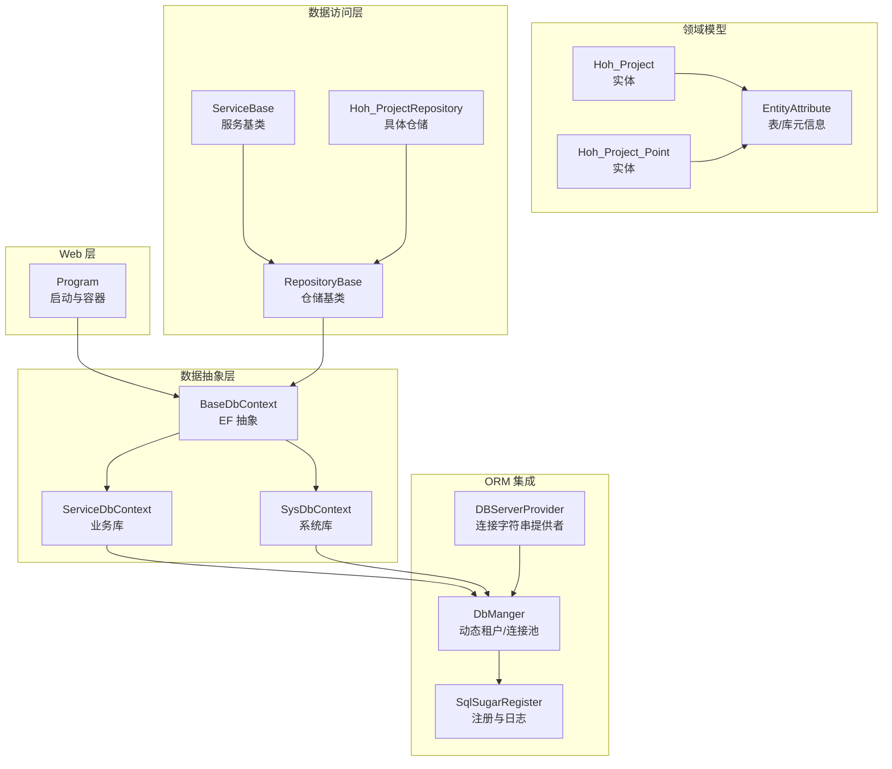
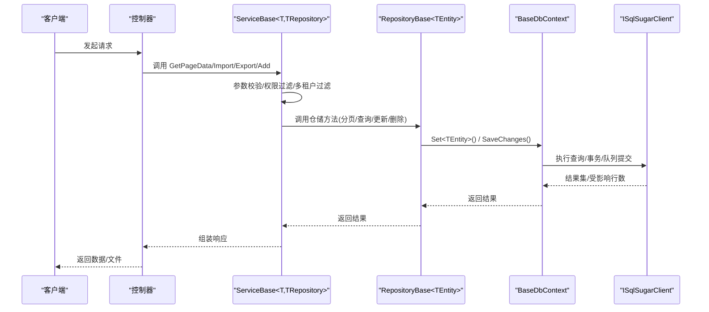
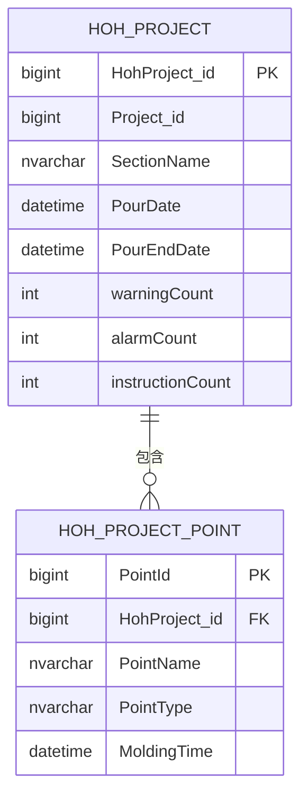
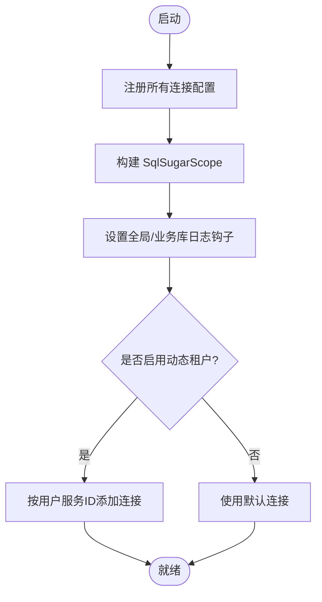
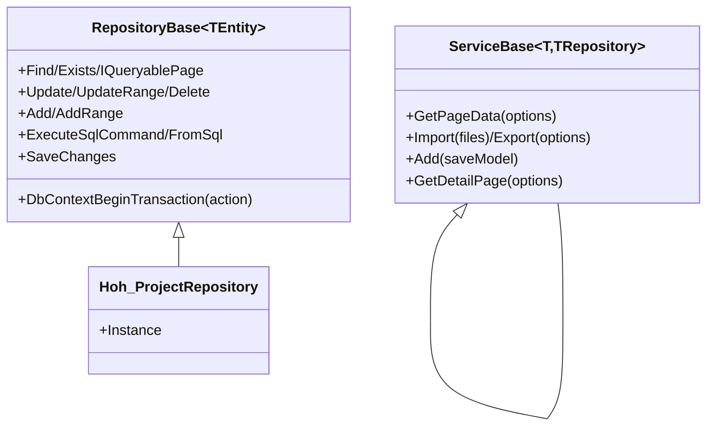
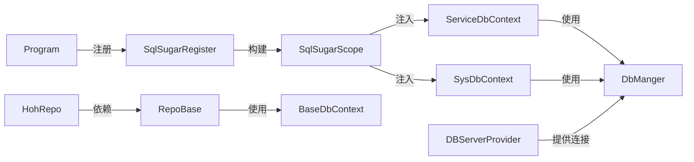

# 数据管理

<cite>
**本文引用的文件**
- [VolPro.Core/DbSqlSugar/SqlSugarRegister.cs](file://VolPro.Core/DbSqlSugar/SqlSugarRegister.cs)
- [VolPro.Core/EFDbContext/BaseDbContext.cs](file://VolPro.Core/EFDbContext/BaseDbContext.cs)
- [VolPro.Core/EFDbContext/SysDbContext.cs](file://VolPro.Core/EFDbContext/SysDbContext.cs)
- [VolPro.Core/EFDbContext/ServiceDbContext.cs](file://VolPro.Core/EFDbContext/ServiceDbContext.cs)
- [VolPro.Core/DbSqlSugar/DbManger.cs](file://VolPro.Core/DbSqlSugar/DbManger.cs)
- [VolPro.Core/DbManager/DBServerProvider.cs](file://VolPro.Core/DbManager/DBServerProvider.cs)
- [VolPro.Core/BaseProvider/RepositoryBase.cs](file://VolPro.Core/BaseProvider/RepositoryBase.cs)
- [VolPro.Core/BaseProvider/ServiceBase.cs](file://VolPro.Core/BaseProvider/ServiceBase.cs)
- [VolPro.Entity/DomainModels/Hoh/Hoh_Project.cs](file://VolPro.Entity/DomainModels/Hoh/Hoh_Project.cs)
- [VolPro.Entity/DomainModels/Hoh/Hoh_Project_Point.cs](file://VolPro.Entity/DomainModels/Hoh/Hoh_Project_Point.cs)
- [VolPro.Entity/AttributeManager/EntityAttribute.cs](file://VolPro.Entity/AttributeManager/EntityAttribute.cs)
- [Hncdi.HeatOfHydration/Repositories/Hoh/Hoh_ProjectRepository.cs](file://Hncdi.HeatOfHydration/Repositories/Hoh/Hoh_ProjectRepository.cs)
- [VolPro.WebApi/Program.cs](file://VolPro.WebApi/Program.cs)
</cite>

## 目录
1. [简介](#简介)
2. [项目结构](#项目结构)
3. [核心组件](#核心组件)
4. [架构总览](#架构总览)
5. [详细组件分析](#详细组件分析)
6. [依赖分析](#依赖分析)
7. [性能考虑](#性能考虑)
8. [故障排查指南](#故障排查指南)
9. [结论](#结论)
10. [附录](#附录)

## 简介
本文件面向“水化热平台”的数据管理系统，系统采用 SqlSugar 作为 ORM 主体，并通过轻量封装与 EF Core 的 DbContext 抽象结合，形成统一的仓储与服务层。系统支持多数据库类型、动态租户分库、逻辑删除、权限过滤、事务与并发控制等能力，满足水化热监测场景下的高可用与高性能需求。

## 项目结构
围绕数据管理的关键模块如下：
- 数据库注册与连接管理：SqlSugarRegister、DbManger、DBServerProvider
- EF 抽象与上下文：BaseDbContext、SysDbContext、ServiceDbContext
- 仓储与服务：RepositoryBase、ServiceBase
- 实体与元数据：Hoh_Project、Hoh_Project_Point、EntityAttribute
- 入口与容器：Program（Autofac 容器）

图表来源
- [VolPro.WebApi/Program.cs:1-39](file://VolPro.WebApi/Program.cs#L1-L39)
- [VolPro.Core/EFDbContext/BaseDbContext.cs:1-161](file://VolPro.Core/EFDbContext/BaseDbContext.cs#L1-L161)
- [VolPro.Core/EFDbContext/SysDbContext.cs:1-20](file://VolPro.Core/EFDbContext/SysDbContext.cs#L1-L20)
- [VolPro.Core/EFDbContext/ServiceDbContext.cs:1-31](file://VolPro.Core/EFDbContext/ServiceDbContext.cs#L1-L31)
- [VolPro.Core/DbSqlSugar/SqlSugarRegister.cs:1-155](file://VolPro.Core/DbSqlSugar/SqlSugarRegister.cs#L1-L155)
- [VolPro.Core/DbSqlSugar/DbManger.cs:1-159](file://VolPro.Core/DbSqlSugar/DbManger.cs#L1-L159)
- [VolPro.Core/DbManager/DBServerProvider.cs:1-139](file://VolPro.Core/DbManager/DBServerProvider.cs#L1-L139)
- [VolPro.Core/BaseProvider/RepositoryBase.cs:1-651](file://VolPro.Core/BaseProvider/RepositoryBase.cs#L1-L651)
- [VolPro.Core/BaseProvider/ServiceBase.cs:1-800](file://VolPro.Core/BaseProvider/ServiceBase.cs#L1-L800)
- [VolPro.Entity/DomainModels/Hoh/Hoh_Project.cs:1-230](file://VolPro.Entity/DomainModels/Hoh/Hoh_Project.cs#L1-L230)
- [VolPro.Entity/DomainModels/Hoh/Hoh_Project_Point.cs:1-138](file://VolPro.Entity/DomainModels/Hoh/Hoh_Project_Point.cs#L1-L138)
- [VolPro.Entity/AttributeManager/EntityAttribute.cs:1-39](file://VolPro.Entity/AttributeManager/EntityAttribute.cs#L1-L39)
- [Hncdi.HeatOfHydration/Repositories/Hoh/Hoh_ProjectRepository.cs:1-25](file://Hncdi.HeatOfHydration/Repositories/Hoh/Hoh_ProjectRepository.cs#L1-L25)

章节来源
- [VolPro.WebApi/Program.cs:1-39](file://VolPro.WebApi/Program.cs#L1-L39)
- [VolPro.Core/EFDbContext/BaseDbContext.cs:1-161](file://VolPro.Core/EFDbContext/BaseDbContext.cs#L1-L161)
- [VolPro.Core/EFDbContext/SysDbContext.cs:1-20](file://VolPro.Core/EFDbContext/SysDbContext.cs#L1-L20)
- [VolPro.Core/EFDbContext/ServiceDbContext.cs:1-31](file://VolPro.Core/EFDbContext/ServiceDbContext.cs#L1-L31)
- [VolPro.Core/DbSqlSugar/SqlSugarRegister.cs:1-155](file://VolPro.Core/DbSqlSugar/SqlSugarRegister.cs#L1-L155)
- [VolPro.Core/DbSqlSugar/DbManger.cs:1-159](file://VolPro.Core/DbSqlSugar/DbManger.cs#L1-L159)
- [VolPro.Core/DbManager/DBServerProvider.cs:1-139](file://VolPro.Core/DbManager/DBServerProvider.cs#L1-L139)
- [VolPro.Core/BaseProvider/RepositoryBase.cs:1-651](file://VolPro.Core/BaseProvider/RepositoryBase.cs#L1-L651)
- [VolPro.Core/BaseProvider/ServiceBase.cs:1-800](file://VolPro.Core/BaseProvider/ServiceBase.cs#L1-L800)
- [VolPro.Entity/DomainModels/Hoh/Hoh_Project.cs:1-230](file://VolPro.Entity/DomainModels/Hoh/Hoh_Project.cs#L1-L230)
- [VolPro.Entity/DomainModels/Hoh/Hoh_Project_Point.cs:1-138](file://VolPro.Entity/DomainModels/Hoh/Hoh_Project_Point.cs#L1-L138)
- [VolPro.Entity/AttributeManager/EntityAttribute.cs:1-39](file://VolPro.Entity/AttributeManager/EntityAttribute.cs#L1-L39)
- [Hncdi.HeatOfHydration/Repositories/Hoh/Hoh_ProjectRepository.cs:1-25](file://Hncdi.HeatOfHydration/Repositories/Hoh/Hoh_ProjectRepository.cs#L1-L25)

## 核心组件
- SqlSugar 注册与日志：集中注册多连接配置，统一 AOP 日志钩子，按数据库类型设置列名策略。
- 连接管理：DbManger 提供系统库、业务库、动态租户库的获取与缓存；DBServerProvider 提供连接字符串与上下文类型映射。
- EF 抽象：BaseDbContext 将 SqlSugar 的 ISqlSugarClient 与 EF 的 DbContext 能力桥接，提供 Set<TEntity>() 与 SaveChanges()。
- 仓储与服务：RepositoryBase 提供 CRUD、分页、事务、明细同步、原生 SQL 等通用能力；ServiceBase 提供分页查询、导入导出、权限字段过滤、多租户过滤等。
- 实体与元数据：EntityAttribute 描述表名、中文名、明细表、数据库服务器、权限等；实体标注于具体业务模型上。

章节来源
- [VolPro.Core/DbSqlSugar/SqlSugarRegister.cs:76-131](file://VolPro.Core/DbSqlSugar/SqlSugarRegister.cs#L76-L131)
- [VolPro.Core/DbSqlSugar/DbManger.cs:26-131](file://VolPro.Core/DbSqlSugar/DbManger.cs#L26-L131)
- [VolPro.Core/DbManager/DBServerProvider.cs:108-136](file://VolPro.Core/DbManager/DBServerProvider.cs#L108-L136)
- [VolPro.Core/EFDbContext/BaseDbContext.cs:32-40](file://VolPro.Core/EFDbContext/BaseDbContext.cs#L32-L40)
- [VolPro.Core/BaseProvider/RepositoryBase.cs:67-96](file://VolPro.Core/BaseProvider/RepositoryBase.cs#L67-L96)
- [VolPro.Core/BaseProvider/ServiceBase.cs:88-107](file://VolPro.Core/BaseProvider/ServiceBase.cs#L88-L107)
- [VolPro.Entity/AttributeManager/EntityAttribute.cs:9-38](file://VolPro.Entity/AttributeManager/EntityAttribute.cs#L9-L38)

## 架构总览
系统以“仓储+服务”为核心，ORM 采用 SqlSugar，通过 BaseDbContext 统一对外暴露查询与保存能力。DbManger/DBServerProvider 负责连接配置与动态租户切换，ServiceDbContext/SysDbContext 代表业务与系统库上下文。

图表来源
- [VolPro.Core/BaseProvider/ServiceBase.cs:285-340](file://VolPro.Core/BaseProvider/ServiceBase.cs#L285-L340)
- [VolPro.Core/BaseProvider/RepositoryBase.cs:570-607](file://VolPro.Core/BaseProvider/RepositoryBase.cs#L570-L607)
- [VolPro.Core/EFDbContext/BaseDbContext.cs:32-40](file://VolPro.Core/EFDbContext/BaseDbContext.cs#L32-L40)

## 详细组件分析

### 数据库设计与实体关系模型
- 实体 Hoh_Project：水化热子项目，主键自增长整型，包含项目主键、部位名称、浇筑时间、预警/报警/指令次数、创建/修改信息等。
- 实体 Hoh_Project_Point：监控点位，主键自增长整型，关联 Hoh_Project，包含点位名称、类型、位置、入模时间等。
- 关系：Hoh_Project 与 Hoh_Project_Point 为一对多关系，通过 Hoh_Project_Point.HohProject_id 外键关联。
- 元数据：EntityAttribute 指定真实表名、中文名、所属数据库上下文（DBServer），用于仓储路由与多租户分库。

图表来源
- [VolPro.Entity/DomainModels/Hoh/Hoh_Project.cs:17-229](file://VolPro.Entity/DomainModels/Hoh/Hoh_Project.cs#L17-L229)
- [VolPro.Entity/DomainModels/Hoh/Hoh_Project_Point.cs:17-137](file://VolPro.Entity/DomainModels/Hoh/Hoh_Project_Point.cs#L17-L137)
- [VolPro.Entity/AttributeManager/EntityAttribute.cs:9-38](file://VolPro.Entity/AttributeManager/EntityAttribute.cs#L9-L38)

章节来源
- [VolPro.Entity/DomainModels/Hoh/Hoh_Project.cs:17-229](file://VolPro.Entity/DomainModels/Hoh/Hoh_Project.cs#L17-L229)
- [VolPro.Entity/DomainModels/Hoh/Hoh_Project_Point.cs:17-137](file://VolPro.Entity/DomainModels/Hoh/Hoh_Project_Point.cs#L17-L137)
- [VolPro.Entity/AttributeManager/EntityAttribute.cs:9-38](file://VolPro.Entity/AttributeManager/EntityAttribute.cs#L9-L38)

### ORM 框架配置与使用（SqlSugar）
- 多连接注册：SqlSugarRegister.UseSqlSugar 收集配置文件中的所有 DbContext 连接，统一注册为 SqlSugarScope，支持业务库与系统库日志钩子。
- 字段命名策略：ConfigureExternalServices 在特定数据库类型（如达梦 DM）下将列名转为大写，保证跨库一致性。
- 动态租户：DbManger.ServiceDb 与 GetServiceDb 支持根据用户服务 ID 动态添加连接并缓存，实现无限分库。

图表来源
- [VolPro.Core/DbSqlSugar/SqlSugarRegister.cs:76-131](file://VolPro.Core/DbSqlSugar/SqlSugarRegister.cs#L76-L131)
- [VolPro.Core/DbSqlSugar/DbManger.cs:26-90](file://VolPro.Core/DbSqlSugar/DbManger.cs#L26-L90)

章节来源
- [VolPro.Core/DbSqlSugar/SqlSugarRegister.cs:76-151](file://VolPro.Core/DbSqlSugar/SqlSugarRegister.cs#L76-L151)
- [VolPro.Core/DbSqlSugar/DbManger.cs:26-156](file://VolPro.Core/DbSqlSugar/DbManger.cs#L26-L156)

### 数据访问层设计模式（仓储与服务）
- 仓储基类 RepositoryBase：提供 Exists/Find/分页/IQueryablePage/Update/UpdateRange/Delete/DeleteWithKeys/Add/AddRange/SaveChanges/ExecuteSqlCommand/FromSql 等通用方法；支持事务 DbContextBeginTransaction；支持按表拆分（分表）与明细同步。
- 服务基类 ServiceBase：提供 GetPageData、权限字段过滤、多租户过滤、导入导出、明细分页、雪花 ID/GUID 自动生成、逻辑删除过滤等。

图表来源
- [VolPro.Core/BaseProvider/RepositoryBase.cs:67-607](file://VolPro.Core/BaseProvider/RepositoryBase.cs#L67-L607)
- [VolPro.Core/BaseProvider/ServiceBase.cs:285-605](file://VolPro.Core/BaseProvider/ServiceBase.cs#L285-L605)
- [Hncdi.HeatOfHydration/Repositories/Hoh/Hoh_ProjectRepository.cs:13-24](file://Hncdi.HeatOfHydration/Repositories/Hoh/Hoh_ProjectRepository.cs#L13-L24)

章节来源
- [VolPro.Core/BaseProvider/RepositoryBase.cs:67-607](file://VolPro.Core/BaseProvider/RepositoryBase.cs#L67-L607)
- [VolPro.Core/BaseProvider/ServiceBase.cs:285-605](file://VolPro.Core/BaseProvider/ServiceBase.cs#L285-L605)
- [Hncdi.HeatOfHydration/Repositories/Hoh/Hoh_ProjectRepository.cs:13-24](file://Hncdi.HeatOfHydration/Repositories/Hoh/Hoh_ProjectRepository.cs#L13-L24)

### 数据模型设计原则
- 实体继承体系：实体均继承 BaseEntity/ServiceEntity，统一默认值、审计字段、多租户值设置与创建码生成。
- 属性映射：通过 EntityAttribute 指定表名、中文名、明细表、DBServer；SqlSugar 的 SugarColumn/Column/Key 等特性映射主键、标识列、列类型等。
- 关系配置：通过外键字段（如 Hoh_Project_Point.HohProject_id）建立一对多关系；EntityAttribute.DetailTable 支持明细表配置，便于服务层进行明细同步与分页。

章节来源
- [VolPro.Entity/DomainModels/Hoh/Hoh_Project.cs:17-229](file://VolPro.Entity/DomainModels/Hoh/Hoh_Project.cs#L17-L229)
- [VolPro.Entity/DomainModels/Hoh/Hoh_Project_Point.cs:17-137](file://VolPro.Entity/DomainModels/Hoh/Hoh_Project_Point.cs#L17-L137)
- [VolPro.Entity/AttributeManager/EntityAttribute.cs:9-38](file://VolPro.Entity/AttributeManager/EntityAttribute.cs#L9-L38)

### 数据迁移、备份与恢复
- 迁移策略：建议通过 SqlSugar 的 Insertable/Updateable/FromSql 等能力进行结构变更与数据迁移脚本化执行；对历史数据可采用分批导入与事务包裹。
- 备份恢复：结合数据库层面的备份策略与 EF 上下文的连接字符串切换，实现业务库与系统库的快速切换与恢复。
- 版本管理：导入流程支持数据版本字段（DataVersionField）生成，便于追踪与回滚。

章节来源
- [VolPro.Core/BaseProvider/ServiceBase.cs:688-692](file://VolPro.Core/BaseProvider/ServiceBase.cs#L688-L692)
- [VolPro.Core/BaseProvider/ServiceBase.cs:598-604](file://VolPro.Core/BaseProvider/ServiceBase.cs#L598-L604)

### 性能优化技巧
- 查询优化：优先使用仓储的分页与排序接口，避免一次性加载全量数据；对高频查询建立合适索引。
- 事务批处理：使用 SaveQueues/ExecuteCommand 批量提交，减少往返开销。
- 日志与诊断：通过 SqlSugar AOP OnLogExecuting 输出 SQL，定位慢查询；结合 EF 日志与中间件日志进行端到端诊断。
- 缓存与连接：DbManger 对动态租户连接进行缓存，避免重复注册；合理设置连接池与超时。

章节来源
- [VolPro.Core/DbSqlSugar/SqlSugarRegister.cs:115-127](file://VolPro.Core/DbSqlSugar/SqlSugarRegister.cs#L115-L127)
- [VolPro.Core/DbSqlSugar/DbManger.cs:33-56](file://VolPro.Core/DbSqlSugar/DbManger.cs#L33-L56)
- [VolPro.Core/BaseProvider/RepositoryBase.cs:595-607](file://VolPro.Core/BaseProvider/RepositoryBase.cs#L595-L607)

### 数据安全、事务与并发控制
- 数据安全：服务层对导出列与权限字段进行过滤，避免越权暴露；导入时进行字段类型校验与忽略列处理。
- 事务管理：RepositoryBase 的 DbContextBeginTransaction 统一封装事务，自动回滚异常；支持自定义回滚条件。
- 并发控制：仓储层对插入/更新/删除使用队列与即时执行命令，结合数据库锁与唯一约束保障一致性；对雪花 ID/GUID 的主键生成避免冲突。

章节来源
- [VolPro.Core/BaseProvider/ServiceBase.cs:346-378](file://VolPro.Core/BaseProvider/ServiceBase.cs#L346-L378)
- [VolPro.Core/BaseProvider/RepositoryBase.cs:67-96](file://VolPro.Core/BaseProvider/RepositoryBase.cs#L67-L96)
- [VolPro.Core/BaseProvider/ServiceBase.cs:568-584](file://VolPro.Core/BaseProvider/ServiceBase.cs#L568-L584)

## 依赖分析
- 容器与启动：Program 使用 AutofacServiceProviderFactory，统一注册仓储与服务。
- 上下文绑定：ServiceDbContext/SysDbContext 继承 BaseDbContext，注入 SqlSugarClient；DBServerProvider/DbManger 提供连接字符串与上下文类型映射。
- 仓储路由：实体通过 EntityAttribute 的 DBServer 指定上下文，DbManger.GetDbContext<TEntity>() 根据实体元数据解析上下文类型。

图表来源
- [VolPro.WebApi/Program.cs:36](file://VolPro.WebApi/Program.cs#L36)
- [VolPro.Core/DbSqlSugar/SqlSugarRegister.cs:102-130](file://VolPro.Core/DbSqlSugar/SqlSugarRegister.cs#L102-L130)
- [VolPro.Core/EFDbContext/ServiceDbContext.cs:17-28](file://VolPro.Core/EFDbContext/ServiceDbContext.cs#L17-L28)
- [VolPro.Core/EFDbContext/SysDbContext.cs:15-17](file://VolPro.Core/EFDbContext/SysDbContext.cs#L15-L17)
- [VolPro.Core/DbManager/DBServerProvider.cs:108-136](file://VolPro.Core/DbManager/DBServerProvider.cs#L108-L136)
- [VolPro.Core/DbSqlSugar/DbManger.cs:115-156](file://VolPro.Core/DbSqlSugar/DbManger.cs#L115-L156)
- [Hncdi.HeatOfHydration/Repositories/Hoh/Hoh_ProjectRepository.cs:13-24](file://Hncdi.HeatOfHydration/Repositories/Hoh/Hoh_ProjectRepository.cs#L13-L24)

章节来源
- [VolPro.WebApi/Program.cs:36](file://VolPro.WebApi/Program.cs#L36)
- [VolPro.Core/DbSqlSugar/SqlSugarRegister.cs:102-130](file://VolPro.Core/DbSqlSugar/SqlSugarRegister.cs#L102-L130)
- [VolPro.Core/EFDbContext/ServiceDbContext.cs:17-28](file://VolPro.Core/EFDbContext/ServiceDbContext.cs#L17-L28)
- [VolPro.Core/EFDbContext/SysDbContext.cs:15-17](file://VolPro.Core/EFDbContext/SysDbContext.cs#L15-L17)
- [VolPro.Core/DbManager/DBServerProvider.cs:108-136](file://VolPro.Core/DbManager/DBServerProvider.cs#L108-L136)
- [VolPro.Core/DbSqlSugar/DbManger.cs:115-156](file://VolPro.Core/DbSqlSugar/DbManger.cs#L115-L156)
- [Hncdi.HeatOfHydration/Repositories/Hoh/Hoh_ProjectRepository.cs:13-24](file://Hncdi.HeatOfHydration/Repositories/Hoh/Hoh_ProjectRepository.cs#L13-L24)

## 性能考虑
- 合理分页与排序：优先使用仓储提供的分页接口，避免一次性加载全量数据。
- 批量操作：利用 Insertable/Updateable 的队列与即时执行命令，减少网络往返。
- 日志与监控：开启 SqlSugar AOP 日志，定位慢查询；结合应用日志与指标监控进行整体性能评估。
- 连接与缓存：动态租户连接缓存避免重复注册；连接池参数与超时需结合业务峰值调优。

## 故障排查指南
- SQL 日志：通过 SqlSugar 的 OnLogExecuting 输出 SQL，定位执行计划与慢查询。
- 异常回滚：事务异常自动回滚，检查仓储层 DbContextBeginTransaction 的返回状态与错误消息。
- 导入/导出：核对字段映射、忽略列、权限字段过滤与模板列配置；确认文件路径与权限。
- 多租户：确认用户服务 ID 与连接字符串映射；检查 DbManger 是否已缓存对应连接。

章节来源
- [VolPro.Core/DbSqlSugar/SqlSugarRegister.cs:115-127](file://VolPro.Core/DbSqlSugar/SqlSugarRegister.cs#L115-L127)
- [VolPro.Core/BaseProvider/RepositoryBase.cs:86-95](file://VolPro.Core/BaseProvider/RepositoryBase.cs#L86-L95)
- [VolPro.Core/BaseProvider/ServiceBase.cs:514-524](file://VolPro.Core/BaseProvider/ServiceBase.cs#L514-L524)

## 结论
该数据管理系统以 SqlSugar 为核心，结合 EF 抽象与仓储/服务基类，实现了多数据库类型、动态租户分库、权限与逻辑删除过滤、事务与并发控制等关键能力。通过清晰的实体元数据与上下文路由，系统具备良好的扩展性与维护性，适合水化热平台的复杂业务场景。

## 附录
- 入口与容器：Program 使用 Autofac 容器工厂，统一注册与解析仓储/服务。
- 上下文类型：SysDbContext 与 ServiceDbContext 分别对应系统库与业务库，通过 BaseDbContext 暴露统一能力。

章节来源
- [VolPro.WebApi/Program.cs:36](file://VolPro.WebApi/Program.cs#L36)
- [VolPro.Core/EFDbContext/SysDbContext.cs:15-17](file://VolPro.Core/EFDbContext/SysDbContext.cs#L15-L17)
- [VolPro.Core/EFDbContext/ServiceDbContext.cs:17-28](file://VolPro.Core/EFDbContext/ServiceDbContext.cs#L17-L28)