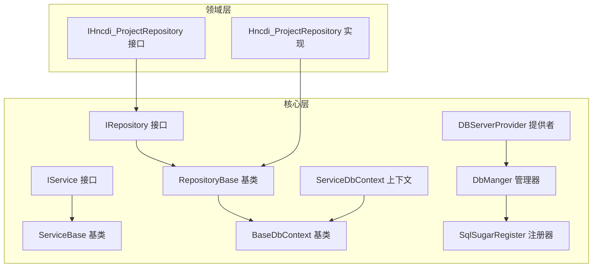
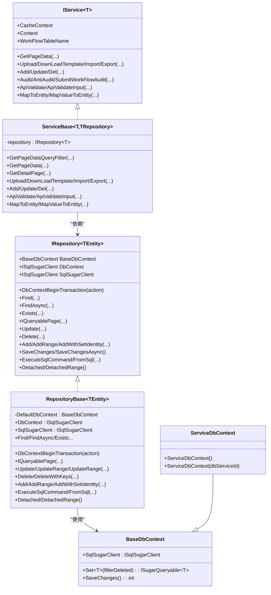
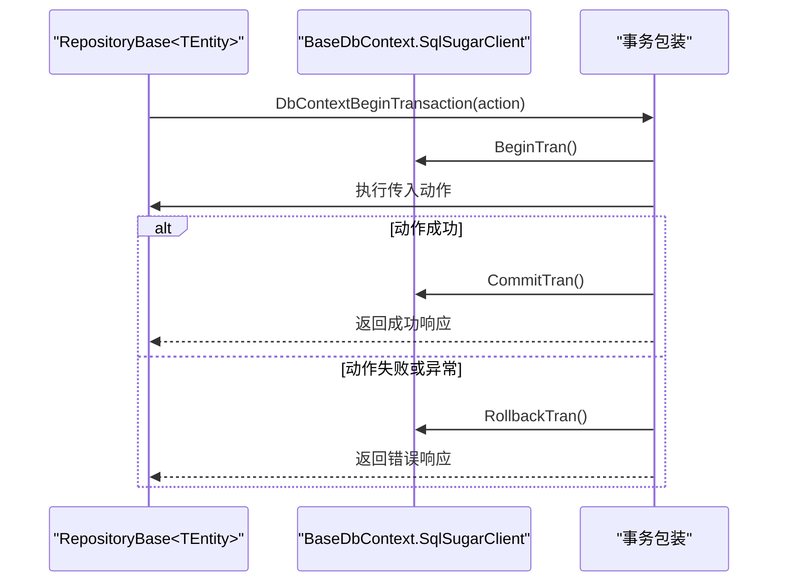
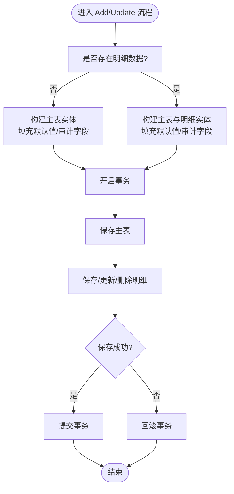
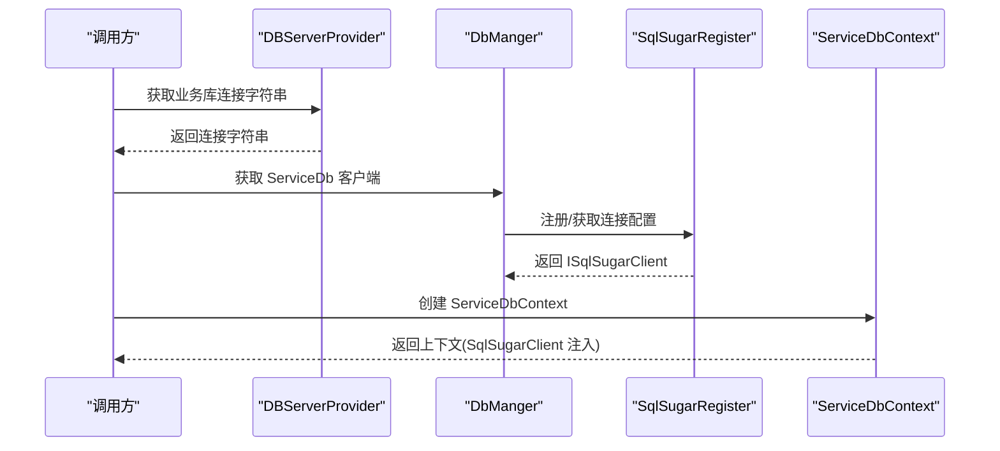

# 数据访问层

<cite>
**本文引用的文件**
- [IRepository 接口](file://VolPro.Core/BaseProvider/IRepository.cs)
- [RepositoryBase 基类](file://VolPro.Core/BaseProvider/RepositoryBase.cs)
- [IService 接口](file://VolPro.Core/BaseProvider/IService.cs)
- [ServiceBase 基类](file://VolPro.Core/BaseProvider/ServiceBase.cs)
- [DBServerProvider 类](file://VolPro.Core/DbManager/DBServerProvider.cs)
- [DbName 枚举](file://VolPro.Core/DbManager/DbName.cs)
- [DbManger 管理器](file://VolPro.Core/DbSqlSugar/DbManger.cs)
- [SqlSugarRegister 注册器](file://VolPro.Core/DbSqlSugar/SqlSugarRegister.cs)
- [BaseDbContext 基类](file://VolPro.Core/EFDbContext/BaseDbContext.cs)
- [ServiceDbContext 上下文](file://VolPro.Core/EFDbContext/ServiceDbContext.cs)
- [Hncdi_ProjectRepository 实现](file://Hncdi.HeatOfHydration/Repositories/Project/Hncdi_ProjectRepository.cs)
- [IHncdi_ProjectRepository 接口](file://Hncdi.HeatOfHydration/IRepositories/Project/IHncdi_ProjectRepository.cs)
</cite>

## 目录
1. [引言](#引言)
2. [项目结构](#项目结构)
3. [核心组件](#核心组件)
4. [架构总览](#架构总览)
5. [详细组件分析](#详细组件分析)
6. [依赖关系分析](#依赖关系分析)
7. [性能考量](#性能考量)
8. [故障排查指南](#故障排查指南)
9. [结论](#结论)
10. [附录](#附录)

## 引言
本文件面向“水化热平台”的数据访问层，系统性阐述仓储模式的设计与实现，涵盖 RepositoryBase 基类与 IRepository 接口、ServiceBase 基类与 IService 接口、数据库连接管理（DBServerProvider 与 DbManger）、以及与业务层的交互模式与数据传输对象设计。文档同时给出分层解耦、依赖注入与生命周期管理、事务与并发控制、查询优化与批量操作、异常处理与日志监控等最佳实践。

## 项目结构
数据访问层位于 VolPro.Core 模块，围绕仓储与服务两大抽象展开，并通过 EF Core 兼容层与 SqlSugar 客户端协同工作。水化热平台的领域仓储位于 Hncdi.HeatOfHydration 项目中，采用接口+基类+部分类（Partial）的扩展方式实现具体仓储。

图表来源
- [IRepository 接口:19-327](file://VolPro.Core/BaseProvider/IRepository.cs#L19-L327)
- [RepositoryBase 基类:29-651](file://VolPro.Core/BaseProvider/RepositoryBase.cs#L29-L651)
- [IService 接口:14-165](file://VolPro.Core/BaseProvider/IService.cs#L14-L165)
- [ServiceBase 基类:31-800](file://VolPro.Core/BaseProvider/ServiceBase.cs#L31-L800)
- [BaseDbContext 基类:18-161](file://VolPro.Core/EFDbContext/BaseDbContext.cs#L18-L161)
- [ServiceDbContext 上下文:13-31](file://VolPro.Core/EFDbContext/ServiceDbContext.cs#L13-L31)
- [DbManger 管理器:21-159](file://VolPro.Core/DbSqlSugar/DbManger.cs#L21-L159)
- [DBServerProvider 类:28-139](file://VolPro.Core/DbManager/DBServerProvider.cs#L28-L139)
- [SqlSugarRegister 注册器:23-155](file://VolPro.Core/DbSqlSugar/SqlSugarRegister.cs#L23-L155)
- [IHncdi_ProjectRepository 接口:15-17](file://Hncdi.HeatOfHydration/IRepositories/Project/IHncdi_ProjectRepository.cs#L15-L17)
- [Hncdi_ProjectRepository 实现:13-24](file://Hncdi.HeatOfHydration/Repositories/Project/Hncdi_ProjectRepository.cs#L13-L24)

章节来源
- [IRepository 接口:19-327](file://VolPro.Core/BaseProvider/IRepository.cs#L19-L327)
- [RepositoryBase 基类:29-651](file://VolPro.Core/BaseProvider/RepositoryBase.cs#L29-L651)
- [IService 接口:14-165](file://VolPro.Core/BaseProvider/IService.cs#L14-L165)
- [ServiceBase 基类:31-800](file://VolPro.Core/BaseProvider/ServiceBase.cs#L31-L800)
- [BaseDbContext 基类:18-161](file://VolPro.Core/EFDbContext/BaseDbContext.cs#L18-L161)
- [ServiceDbContext 上下文:13-31](file://VolPro.Core/EFDbContext/ServiceDbContext.cs#L13-L31)
- [DbManger 管理器:21-159](file://VolPro.Core/DbSqlSugar/DbManger.cs#L21-L159)
- [DBServerProvider 类:28-139](file://VolPro.Core/DbManager/DBServerProvider.cs#L28-L139)
- [SqlSugarRegister 注册器:23-155](file://VolPro.Core/DbSqlSugar/SqlSugarRegister.cs#L23-L155)
- [IHncdi_ProjectRepository 接口:15-17](file://Hncdi.HeatOfHydration/IRepositories/Project/IHncdi_ProjectRepository.cs#L15-L17)
- [Hncdi_ProjectRepository 实现:13-24](file://Hncdi.HeatOfHydration/Repositories/Project/Hncdi_ProjectRepository.cs#L13-L24)

## 核心组件
- 仓储接口与基类
  - IRepository<TEntity>：统一定义查询、分页、更新、删除、批量操作、事务、原生 SQL 等能力，屏蔽 EF/SqlSugar 差异。
  - RepositoryBase<TEntity>：实现通用 CRUD、分页、事务、明细联动更新、雪花 ID 生成、拆表支持等。
- 服务接口与基类
  - IService<T>：定义分页、导入导出、上传下载、工作流、数据映射等服务契约。
  - ServiceBase<T, TRepository>：封装分页查询、权限字段过滤、导入导出、主从保存、工作流集成、审计字段处理等。
- 数据库连接管理
  - DBServerProvider：集中管理连接字符串、按用户/租户动态切换业务库、系统库访问。
  - DbManger：根据上下文类型与用户服务 ID 获取 ISqlSugarClient，支持多租户动态分库。
  - SqlSugarRegister：注册 SqlSugar 多连接配置，统一日志与列名策略。
- EF 兼容层
  - BaseDbContext：桥接 EF Core 与 SqlSugar，提供 Set<TEntity>() 与 SaveChanges() 的统一入口。
  - ServiceDbContext：业务库上下文，注入 ServiceDb 客户端实例。

章节来源
- [IRepository 接口:19-327](file://VolPro.Core/BaseProvider/IRepository.cs#L19-L327)
- [RepositoryBase 基类:29-651](file://VolPro.Core/BaseProvider/RepositoryBase.cs#L29-L651)
- [IService 接口:14-165](file://VolPro.Core/BaseProvider/IService.cs#L14-L165)
- [ServiceBase 基类:31-800](file://VolPro.Core/BaseProvider/ServiceBase.cs#L31-L800)
- [DBServerProvider 类:28-139](file://VolPro.Core/DbManager/DBServerProvider.cs#L28-L139)
- [DbManger 管理器:21-159](file://VolPro.Core/DbSqlSugar/DbManger.cs#L21-L159)
- [SqlSugarRegister 注册器:23-155](file://VolPro.Core/DbSqlSugar/SqlSugarRegister.cs#L23-L155)
- [BaseDbContext 基类:18-161](file://VolPro.Core/EFDbContext/BaseDbContext.cs#L18-L161)
- [ServiceDbContext 上下文:13-31](file://VolPro.Core/EFDbContext/ServiceDbContext.cs#L13-L31)

## 架构总览
数据访问层采用仓储与服务双层抽象，结合 SqlSugar 的高性能 ORM 能力与 EF Core 的兼容层，实现跨数据库、多租户、动态分库与强一致事务的统一访问模型。

图表来源
- [IRepository 接口:19-327](file://VolPro.Core/BaseProvider/IRepository.cs#L19-L327)
- [RepositoryBase 基类:29-651](file://VolPro.Core/BaseProvider/RepositoryBase.cs#L29-L651)
- [IService 接口:14-165](file://VolPro.Core/BaseProvider/IService.cs#L14-L165)
- [ServiceBase 基类:31-800](file://VolPro.Core/BaseProvider/ServiceBase.cs#L31-L800)
- [BaseDbContext 基类:18-161](file://VolPro.Core/EFDbContext/BaseDbContext.cs#L18-L161)
- [ServiceDbContext 上下文:13-31](file://VolPro.Core/EFDbContext/ServiceDbContext.cs#L13-L31)

## 详细组件分析

### 仓储接口与基类
- 设计要点
  - 统一查询：支持 WhereIF 条件拼装、分页排序、投影查询、存在性检查。
  - 统一更新：支持指定字段更新、批量更新、主从联动更新（明细增删改）。
  - 统一删除：支持主键批量删除、级联删除标记。
  - 统一事务：DbContextBeginTransaction 包裹业务动作，自动提交/回滚。
  - 统一执行：ExecuteSqlCommand/FromSql 支持原生 SQL 与参数化查询。
- 关键实现
  - RepositoryBase<TEntity> 在基类中完成具体 CRUD、分页、事务、明细联动、雪花 ID 生成、拆表支持等。
  - 对于带 EntityAttribute 的实体，支持明细表联动更新，自动识别主键、明细集合与字段更新范围。
- 与 EF 兼容
  - BaseDbContext 将 SqlSugar 的 Set<TEntity>() 与 SaveChanges() 暴露给仓储，保证 EF/SqlSugar 的一致性。

图表来源
- [RepositoryBase 基类:67-96](file://VolPro.Core/BaseProvider/RepositoryBase.cs#L67-L96)
- [BaseDbContext 基类:32-40](file://VolPro.Core/EFDbContext/BaseDbContext.cs#L32-L40)

章节来源
- [IRepository 接口:19-327](file://VolPro.Core/BaseProvider/IRepository.cs#L19-L327)
- [RepositoryBase 基类:29-651](file://VolPro.Core/BaseProvider/RepositoryBase.cs#L29-L651)
- [BaseDbContext 基类:18-161](file://VolPro.Core/EFDbContext/BaseDbContext.cs#L18-L161)

### 服务接口与基类
- 设计要点
  - 分页查询：统一参数 PageDataOptions，自动排序、权限字段过滤、统计汇总。
  - 主从保存：Add/Update 支持 SaveModel 主从结构，自动处理明细增删改与审计字段。
  - 导入导出：EPPlus 模板下载、Excel 导入、导出列控制与权限字段合并。
  - 工作流：审核、反审、流程重启/回退等集成。
  - 数据映射：MapToEntity/MapValueToEntity 支持字段级映射与表达式筛选。
- 关键实现
  - ServiceBase<T, TRepository> 通过 ValidatePageOptions 与 GetPageDataQueryFilter 校验并构建查询链。
  - 多租户与动态分库：通过 GetSearchQueryable 与 TenancyManager<T> 应用过滤与 SQL 重写。
  - 审计与版本：自动填充创建/修改人、创建时间、数据版本号等。

图表来源
- [ServiceBase 基类:659-761](file://VolPro.Core/BaseProvider/ServiceBase.cs#L659-L761)
- [ServiceBase 基类:778-800](file://VolPro.Core/BaseProvider/ServiceBase.cs#L778-L800)

章节来源
- [IService 接口:14-165](file://VolPro.Core/BaseProvider/IService.cs#L14-L165)
- [ServiceBase 基类:31-800](file://VolPro.Core/BaseProvider/ServiceBase.cs#L31-L800)

### 数据库连接管理
- DBServerProvider
  - 提供连接字符串缓存与获取、系统库与业务库访问、动态租户分库连接选择。
- DbManger
  - 根据用户服务 ID 动态注册/获取 ISqlSugarClient，支持不同数据库类型与列名策略。
- SqlSugarRegister
  - 注册所有配置的连接，统一 AOP 日志与列名大小写策略，支持多租户场景下的空库模板。
- BaseDbContext 与 ServiceDbContext
  - BaseDbContext 将 SqlSugarClient 暴露为 Set<TEntity>() 与 SaveChanges()。
  - ServiceDbContext 注入 ServiceDb，实现业务库上下文。

图表来源
- [DBServerProvider 类:92-136](file://VolPro.Core/DbManager/DBServerProvider.cs#L92-L136)
- [DbManger 管理器:26-90](file://VolPro.Core/DbSqlSugar/DbManger.cs#L26-L90)
- [SqlSugarRegister 注册器:76-131](file://VolPro.Core/DbSqlSugar/SqlSugarRegister.cs#L76-L131)
- [ServiceDbContext 上下文:17-28](file://VolPro.Core/EFDbContext/ServiceDbContext.cs#L17-L28)

章节来源
- [DBServerProvider 类:28-139](file://VolPro.Core/DbManager/DBServerProvider.cs#L28-L139)
- [DbManger 管理器:21-159](file://VolPro.Core/DbSqlSugar/DbManger.cs#L21-L159)
- [SqlSugarRegister 注册器:23-155](file://VolPro.Core/DbSqlSugar/SqlSugarRegister.cs#L23-L155)
- [BaseDbContext 基类:18-161](file://VolPro.Core/EFDbContext/BaseDbContext.cs#L18-L161)
- [ServiceDbContext 上下文:13-31](file://VolPro.Core/EFDbContext/ServiceDbContext.cs#L13-L31)

### 与业务层的交互与数据传输对象
- 交互模式
  - 控制器仅依赖 IService<T>，通过依赖注入获取具体服务实现；服务内部依赖 IRepository<T> 执行数据访问。
  - 仓储通过 BaseDbContext.SqlSugarClient 与 DbManger/DBServerProvider 协同，实现多租户与动态分库。
- 数据传输对象
  - PageDataOptions：分页、排序、过滤、导出、列集等参数载体。
  - SaveModel：主从保存的输入载体，包含主表字典与明细列表。
  - WebResponseContent：统一响应载体，承载状态、消息与数据。
  - EPPlusHelper：用于导入导出的模板与数据处理。

章节来源
- [IService 接口:14-165](file://VolPro.Core/BaseProvider/IService.cs#L14-L165)
- [ServiceBase 基类:285-340](file://VolPro.Core/BaseProvider/ServiceBase.cs#L285-L340)
- [ServiceBase 基类:659-761](file://VolPro.Core/BaseProvider/ServiceBase.cs#L659-L761)

## 依赖关系分析
- 组件耦合
  - 仓储与 EF 兼容层弱耦合：通过 BaseDbContext 抽象，仓储不直接依赖 EF DbSet。
  - 服务与仓储松耦合：通过 IRepository<T> 接口依赖，便于替换与测试。
  - 连接管理独立：DBServerProvider/DbManger/SqlSugarRegister 解耦于业务实体，支持多租户与动态分库。
- 外部依赖
  - SqlSugar：提供高性能 ORM、事务、批量操作、原生 SQL。
  - EPPlus：提供 Excel 模板与导入导出。
  - Autofac：提供依赖注入容器与服务解析。

图表来源
- [ServiceBase 基类:72-76](file://VolPro.Core/BaseProvider/ServiceBase.cs#L72-L76)
- [RepositoryBase 基类:31-34](file://VolPro.Core/BaseProvider/RepositoryBase.cs#L31-L34)
- [BaseDbContext 基类:32-40](file://VolPro.Core/EFDbContext/BaseDbContext.cs#L32-L40)
- [DbManger 管理器:133-140](file://VolPro.Core/DbSqlSugar/DbManger.cs#L133-L140)
- [DBServerProvider 类:55-57](file://VolPro.Core/DbManager/DBServerProvider.cs#L55-L57)

章节来源
- [ServiceBase 基类:72-76](file://VolPro.Core/BaseProvider/ServiceBase.cs#L72-L76)
- [RepositoryBase 基类:31-34](file://VolPro.Core/BaseProvider/RepositoryBase.cs#L31-L34)
- [BaseDbContext 基类:18-161](file://VolPro.Core/EFDbContext/BaseDbContext.cs#L18-L161)
- [DbManger 管理器:21-159](file://VolPro.Core/DbSqlSugar/DbManger.cs#L21-L159)
- [DBServerProvider 类:28-139](file://VolPro.Core/DbManager/DBServerProvider.cs#L28-L139)

## 性能考量
- 查询优化
  - 使用 WhereIF 条件拼装，避免无效查询；优先使用索引列作为排序与过滤条件。
  - 分页查询使用 IQueryablePage，避免一次性加载大量数据；导出场景限制 Limit。
- 批量操作
  - 使用 AddRange/UpdateRange/Insertable/Updateable/Deleteable 的批量 API，减少往返次数。
  - 明细联动更新时，先计算差异再批量执行插入/更新/删除。
- 并发控制
  - 使用 DbContextBeginTransaction 确保业务原子性；在高并发场景下配合数据库锁或乐观版本号。
  - 对频繁读取的数据使用缓存（ICacheService），降低数据库压力。
- 连接与资源
  - 通过 DbManger 动态注册连接，避免重复创建；使用 ISqlSugarClient 单例模式。
  - 合理关闭连接与释放资源，避免连接池耗尽。

## 故障排查指南
- 事务异常
  - 若事务未提交或回滚，检查 DbContextBeginTransaction 的返回状态与异常捕获逻辑。
  - 开发环境可输出完整异常信息，生产环境仅返回通用错误提示。
- 重复跟踪实体
  - 更新时报“无法跟踪”错误时，调用 Detached/DetachedRange 取消跟踪。
- 导入导出问题
  - 导入失败时检查模板列与忽略字段配置；导出列与权限字段冲突时，确保导出列包含权限字段。
- 多租户与动态分库
  - 确认用户服务 ID 与连接字符串映射；检查 DbRelativeCache 中的连接配置是否完整。

章节来源
- [RepositoryBase 基类:67-96](file://VolPro.Core/BaseProvider/RepositoryBase.cs#L67-L96)
- [ServiceBase 基类:514-524](file://VolPro.Core/BaseProvider/ServiceBase.cs#L514-L524)
- [ServiceBase 基类:531-605](file://VolPro.Core/BaseProvider/ServiceBase.cs#L531-L605)
- [DBServerProvider 类:121-126](file://VolPro.Core/DbManager/DBServerProvider.cs#L121-L126)

## 结论
该数据访问层以仓储与服务双抽象为核心，结合 SqlSugar 的高性能 ORM 与 EF 兼容层，实现了跨数据库、多租户、动态分库与强一致事务的统一访问模型。通过 IRepository/IRepositoryBase 与 IService/ServiceBase 的清晰职责划分，以及 DBServerProvider/DbManger/SqlSugarRegister 的连接管理，有效提升了系统的可维护性、可扩展性与性能表现。

## 附录
- 最佳实践清单
  - 使用 WhereIF 构建条件，避免硬编码 SQL。
  - 分页查询限制每页数量，导出场景设置上限。
  - 批量操作使用 SqlSugar 的批量 API。
  - 事务包裹复杂业务，失败即回滚。
  - 导入导出前校验模板与字段映射。
  - 多租户场景下确保连接字符串与用户服务 ID 正确映射。
- 关键文件速览
  - 仓储接口与基类：[IRepository 接口:19-327](file://VolPro.Core/BaseProvider/IRepository.cs#L19-L327)、[RepositoryBase 基类:29-651](file://VolPro.Core/BaseProvider/RepositoryBase.cs#L29-L651)
  - 服务接口与基类：[IService 接口:14-165](file://VolPro.Core/BaseProvider/IService.cs#L14-L165)、[ServiceBase 基类:31-800](file://VolPro.Core/BaseProvider/ServiceBase.cs#L31-L800)
  - 连接管理：[DBServerProvider 类:28-139](file://VolPro.Core/DbManager/DBServerProvider.cs#L28-L139)、[DbManger 管理器:21-159](file://VolPro.Core/DbSqlSugar/DbManger.cs#L21-L159)、[SqlSugarRegister 注册器:23-155](file://VolPro.Core/DbSqlSugar/SqlSugarRegister.cs#L23-L155)
  - EF 兼容层：[BaseDbContext 基类:18-161](file://VolPro.Core/EFDbContext/BaseDbContext.cs#L18-L161)、[ServiceDbContext 上下文:13-31](file://VolPro.Core/EFDbContext/ServiceDbContext.cs#L13-L31)
  - 领域仓储示例：[IHncdi_ProjectRepository 接口:15-17](file://Hncdi.HeatOfHydration/IRepositories/Project/IHncdi_ProjectRepository.cs#L15-L17)、[Hncdi_ProjectRepository 实现:13-24](file://Hncdi.HeatOfHydration/Repositories/Project/Hncdi_ProjectRepository.cs#L13-L24)