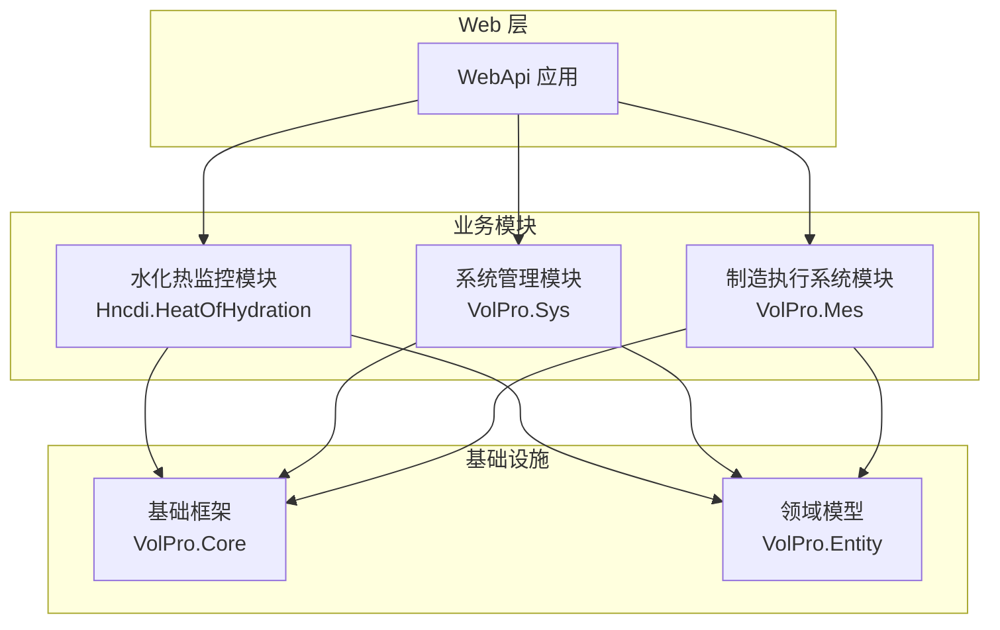
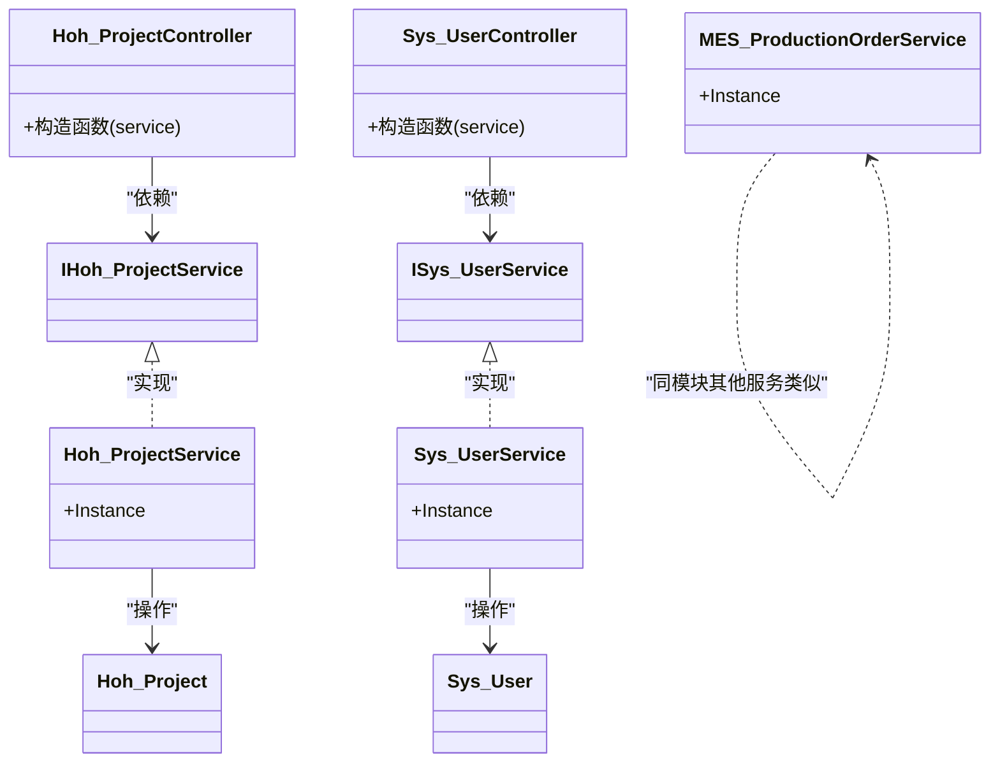
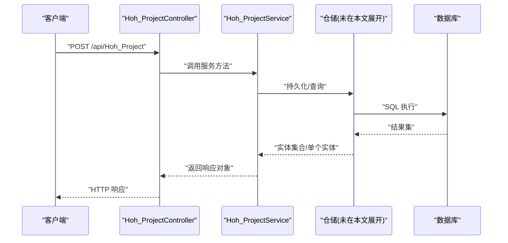
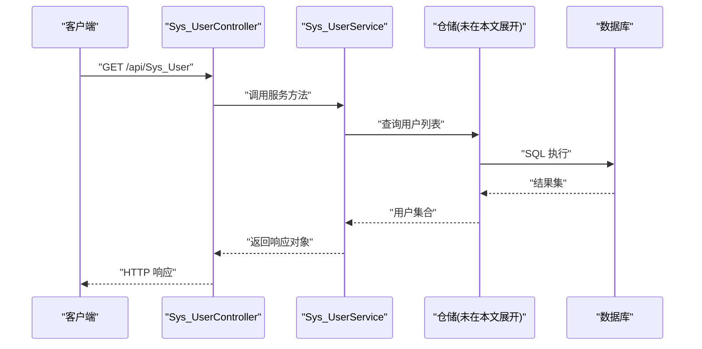
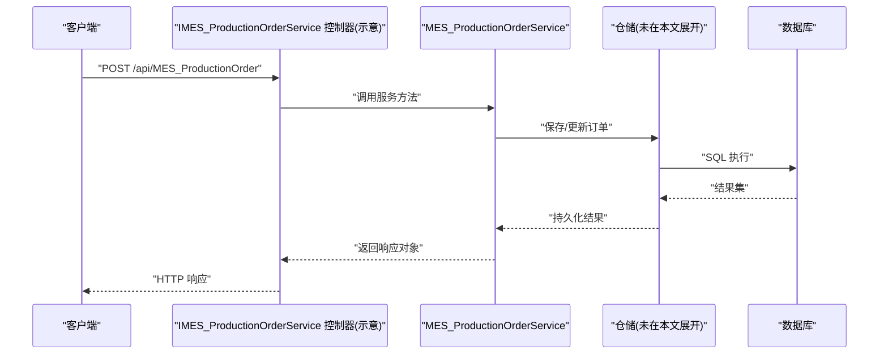
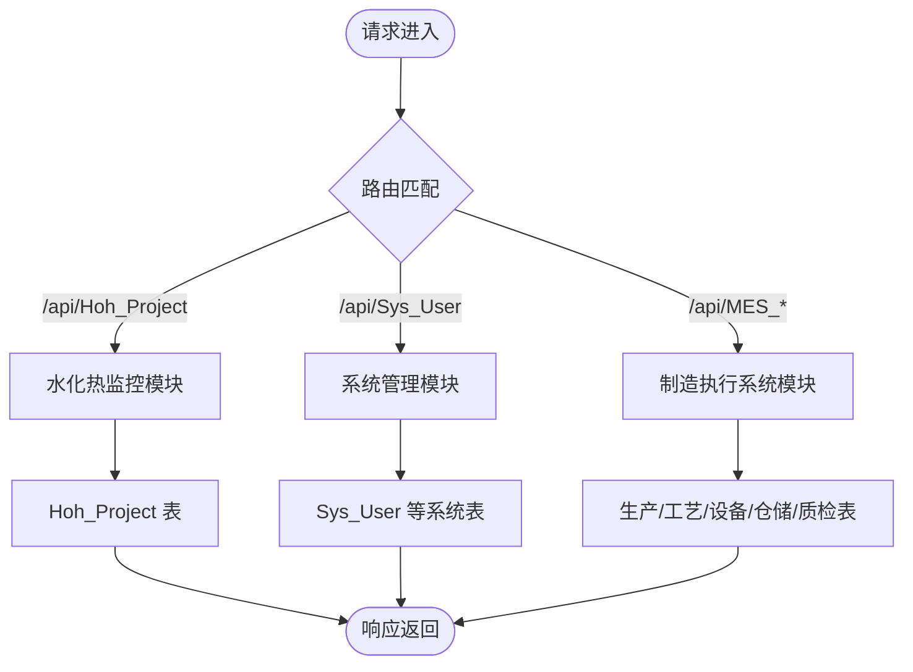
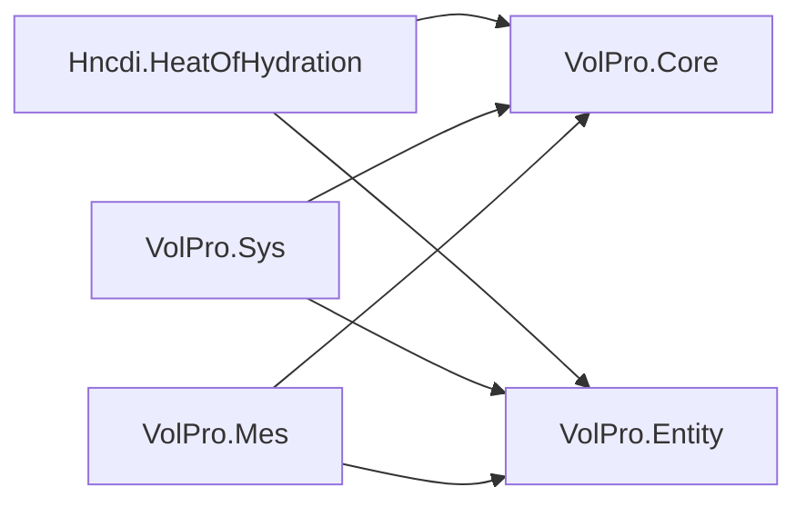

# 核心功能模块

<cite>
**本文引用的文件**
- [Hncdi.HeatOfHydration.csproj](file://Hncdi.HeatOfHydration/Hncdi.HeatOfHydration.csproj)
- [IHoh_ProjectService.cs](file://Hncdi.HeatOfHydration/IServices/Hoh/IHoh_ProjectService.cs)
- [Hoh_ProjectService.cs](file://Hncdi.HeatOfHydration/Services/Hoh/Hoh_ProjectService.cs)
- [Hoh_Project.cs](file://VolPro.Entity/DomainModels/Hoh/Hoh_Project.cs)
- [Hoh_ProjectController.cs](file://VolPro.WebApi/Controllers/HeatOfHydration/Hoh_ProjectController.cs)
- [VolPro.Sys.csproj](file://VolPro.Sys/VolPro.Sys.csproj)
- [ISys_UserService.cs](file://VolPro.Sys/IServices/System/ISys_UserService.cs)
- [Sys_UserService.cs](file://VolPro.Sys/Services/System/Sys_UserService.cs)
- [Sys_User.cs](file://VolPro.Entity/DomainModels/System/Sys_User.cs)
- [Sys_UserController.cs](file://VolPro.WebApi/Controllers/Sys/Sys_UserController.cs)
- [VolPro.Mes.csproj](file://VolPro.Mes/VolPro.Mes.csproj)
- [IMES_ProductionOrderService.cs](file://VolPro.Mes/IServices/mes/IMES_ProductionOrderService.cs)
- [MES_ProductionOrderService.cs](file://VolPro.Mes/Services/mes/MES_ProductionOrderService.cs)
- [VolPro.Core.csproj](file://VolPro.Core/VolPro.Core.csproj)
- [VolPro.Entity.csproj](file://VolPro.Entity/VolPro.Entity.cs)
</cite>

## 目录
1. 引言
2. 项目结构
3. 核心组件
4. 架构总览
5. 详细组件分析
6. 依赖分析
7. 性能考虑
8. 故障排查指南
9. 结论
10. 附录

## 引言
本文件面向水化热平台的核心功能模块，围绕三大业务域进行系统化梳理：水化热监控模块、系统管理模块与制造执行系统模块。文档从架构设计、模块职责、数据流、生命周期、错误处理与性能优化等维度展开，并结合仓库中的真实代码文件路径，给出可操作的扩展与定制建议，帮助开发者快速理解与二次开发。

## 项目结构
平台采用多项目分层组织，核心模块如下：
- 水化热监控模块：负责“监控部位”等业务实体的数据采集、展示与报表支撑。
- 系统管理模块：负责用户、权限、菜单、角色等基础系统能力。
- 制造执行系统模块：负责生产订单、工艺路线、设备、仓储等制造相关业务。
- 基础框架与实体：统一的仓储、服务基类、ORM、缓存、中间件、工具集等。

图表来源
- [Hncdi.HeatOfHydration.csproj:1-15](file://Hncdi.HeatOfHydration/Hncdi.HeatOfHydration.csproj#L1-L15)
- [VolPro.Sys.csproj:1-45](file://VolPro.Sys/VolPro.Sys.csproj#L1-L45)
- [VolPro.Mes.csproj:1-23](file://VolPro.Mes/VolPro.Mes.csproj#L1-L23)
- [VolPro.Core.csproj](file://VolPro.Core/VolPro.Core.csproj)
- [VolPro.Entity.csproj](file://VolPro.Entity/VolPro.Entity.csproj)

章节来源
- [Hncdi.HeatOfHydration.csproj:1-15](file://Hncdi.HeatOfHydration/Hncdi.HeatOfHydration.csproj#L1-L15)
- [VolPro.Sys.csproj:1-45](file://VolPro.Sys/VolPro.Sys.csproj#L1-L45)
- [VolPro.Mes.csproj:1-23](file://VolPro.Mes/VolPro.Mes.csproj#L1-L23)

## 核心组件
- 水化热监控模块
  - 业务目标：对“监控部位”进行全生命周期管理，包括浇筑状态、预警/报警/指令统计、报表期数、测点布置与三维图等。
  - 核心实体：Hoh_Project（监控部位）。
  - 控制器：Hoh_ProjectController（基于通用 ApiBaseController）。
  - 服务与仓储：IHoh_ProjectService、Hoh_ProjectService（继承 ServiceBase）。
- 系统管理模块
  - 业务目标：用户、角色、岗位、部门、菜单、字典等系统级资源管理。
  - 核心实体：Sys_User（用户）。
  - 控制器：Sys_UserController（基于通用 ApiBaseController）。
  - 服务与仓储：ISys_UserService、Sys_UserService（继承 ServiceBase）。
- 制造执行系统模块
  - 业务目标：生产订单、工艺路线、设备、仓储、质量检验等制造执行业务。
  - 核心实体：MES_ProductionOrder（生产订单）。
  - 控制器与服务：IMES_ProductionOrderService、MES_ProductionOrderService（继承 ServiceBase）。

章节来源
- [IHoh_ProjectService.cs:1-13](file://Hncdi.HeatOfHydration/IServices/Hoh/IHoh_ProjectService.cs#L1-L13)
- [Hoh_ProjectService.cs:1-24](file://Hncdi.HeatOfHydration/Services/Hoh/Hoh_ProjectService.cs#L1-L24)
- [Hoh_Project.cs:1-230](file://VolPro.Entity/DomainModels/Hoh/Hoh_Project.cs#L1-L230)
- [Hoh_ProjectController.cs:1-22](file://VolPro.WebApi/Controllers/HeatOfHydration/Hoh_ProjectController.cs#L1-L22)
- [ISys_UserService.cs:1-17](file://VolPro.Sys/IServices/System/ISys_UserService.cs#L1-L17)
- [Sys_UserService.cs:1-29](file://VolPro.Sys/Services/System/Sys_UserService.cs#L1-L29)
- [Sys_User.cs:1-230](file://VolPro.Entity/DomainModels/System/Sys_User.cs#L1-L230)
- [Sys_UserController.cs:1-24](file://VolPro.WebApi/Controllers/Sys/Sys_UserController.cs#L1-L24)
- [IMES_ProductionOrderService.cs:1-13](file://VolPro.Mes/IServices/mes/IMES_ProductionOrderService.cs#L1-L13)
- [MES_ProductionOrderService.cs:1-23](file://VolPro.Mes/Services/mes/MES_ProductionOrderService.cs#L1-L23)

## 架构总览
平台遵循“控制器-服务-仓储-实体”的分层架构，控制器通过通用基类注入对应服务；服务层继承统一的 ServiceBase，复用框架提供的仓储、日志、缓存、权限等能力；实体模型通过注解标注表名、中文名与数据库上下文，确保 ORM 映射一致性。

图表来源
- [Hoh_ProjectController.cs:1-22](file://VolPro.WebApi/Controllers/HeatOfHydration/Hoh_ProjectController.cs#L1-L22)
- [IHoh_ProjectService.cs:1-13](file://Hncdi.HeatOfHydration/IServices/Hoh/IHoh_ProjectService.cs#L1-L13)
- [Hoh_ProjectService.cs:1-24](file://Hncdi.HeatOfHydration/Services/Hoh/Hoh_ProjectService.cs#L1-L24)
- [Hoh_Project.cs:1-230](file://VolPro.Entity/DomainModels/Hoh/Hoh_Project.cs#L1-L230)
- [Sys_UserController.cs:1-24](file://VolPro.WebApi/Controllers/Sys/Sys_UserController.cs#L1-L24)
- [ISys_UserService.cs:1-17](file://VolPro.Sys/IServices/System/ISys_UserService.cs#L1-L17)
- [Sys_UserService.cs:1-29](file://VolPro.Sys/Services/System/Sys_UserService.cs#L1-L29)
- [Sys_User.cs:1-230](file://VolPro.Entity/DomainModels/System/Sys_User.cs#L1-L230)
- [IMES_ProductionOrderService.cs:1-13](file://VolPro.Mes/IServices/mes/IMES_ProductionOrderService.cs#L1-L13)
- [MES_ProductionOrderService.cs:1-23](file://VolPro.Mes/Services/mes/MES_ProductionOrderService.cs#L1-L23)

## 详细组件分析

### 水化热监控模块
- 业务目标
  - 对“监控部位”进行全生命周期管理，支持测点布置、三维图、浇筑状态、预警/报警/指令统计、报表期数等。
- 核心功能
  - 数据增删改查、分页查询、权限控制、报表集成。
- 实现方式
  - 控制器：Hoh_ProjectController 继承 ApiBaseController，路由前缀为 api/Hoh_Project。
  - 服务：Hoh_ProjectService 实现 IHoh_ProjectService，继承 ServiceBase，提供静态 Instance 获取服务实例。
  - 实体：Hoh_Project 使用 Entity 注解标注表名、中文名与数据库上下文，字段覆盖部位名称、浇筑时间、混凝土标号、测点数量、统计指标等。
- 生命周期与扩展点
  - 服务层可通过 Partial 扩展业务逻辑；控制器通过 Partial 扩展 API 行为。
  - 通过 Autofac 容器解析服务实例，便于替换与测试。
- 配置与定制
  - 权限控制通过 PermissionTable 注解绑定表名；可按需扩展鉴权与字段级权限。
  - 实体注解支持 API 输入输出类型映射，便于前后端契约一致。
- 错误处理与性能
  - 服务层继承自框架基类，具备统一异常处理与日志记录能力。
  - 可结合缓存与分页查询降低数据库压力。

图表来源
- [Hoh_ProjectController.cs:1-22](file://VolPro.WebApi/Controllers/HeatOfHydration/Hoh_ProjectController.cs#L1-L22)
- [IHoh_ProjectService.cs:1-13](file://Hncdi.HeatOfHydration/IServices/Hoh/IHoh_ProjectService.cs#L1-L13)
- [Hoh_ProjectService.cs:1-24](file://Hncdi.HeatOfHydration/Services/Hoh/Hoh_ProjectService.cs#L1-L24)

章节来源
- [Hoh_ProjectController.cs:1-22](file://VolPro.WebApi/Controllers/HeatOfHydration/Hoh_ProjectController.cs#L1-L22)
- [IHoh_ProjectService.cs:1-13](file://Hncdi.HeatOfHydration/IServices/Hoh/IHoh_ProjectService.cs#L1-L13)
- [Hoh_ProjectService.cs:1-24](file://Hncdi.HeatOfHydration/Services/Hoh/Hoh_ProjectService.cs#L1-L24)
- [Hoh_Project.cs:1-230](file://VolPro.Entity/DomainModels/Hoh/Hoh_Project.cs#L1-L230)

### 系统管理模块
- 业务目标
  - 用户管理、角色授权、岗位与部门、菜单与字典、登录认证与会话管理。
- 核心功能
  - 用户增删改查、角色分配、岗位与部门关联、登录鉴权、权限校验。
- 实现方式
  - 控制器：Sys_UserController 继承 ApiBaseController，路由前缀为 api/Sys_User。
  - 服务：Sys_UserService 实现 ISys_UserService，继承 ServiceBase，提供静态 Instance。
  - 实体：Sys_User 使用 Entity 注解标注表名与数据库上下文，字段覆盖账号、姓名、性别、角色、岗位、邮箱、手机号、启用状态等。
- 生命周期与扩展点
  - 服务层通过构造函数注入仓储，便于扩展复杂业务逻辑。
  - 支持通过中间件与过滤器实现统一鉴权与日志。
- 配置与定制
  - 可通过注解与配置文件扩展权限表、菜单树、字典项等。
  - 支持多租户表达式与字段级权限过滤。
- 错误处理与性能
  - 统一响应与异常中间件，保障接口稳定性。
  - 缓存常用字典与用户信息，减少数据库访问。

图表来源
- [Sys_UserController.cs:1-24](file://VolPro.WebApi/Controllers/Sys/Sys_UserController.cs#L1-L24)
- [ISys_UserService.cs:1-17](file://VolPro.Sys/IServices/System/ISys_UserService.cs#L1-L17)
- [Sys_UserService.cs:1-29](file://VolPro.Sys/Services/System/Sys_UserService.cs#L1-L29)

章节来源
- [Sys_UserController.cs:1-24](file://VolPro.WebApi/Controllers/Sys/Sys_UserController.cs#L1-L24)
- [ISys_UserService.cs:1-17](file://VolPro.Sys/IServices/System/ISys_UserService.cs#L1-L17)
- [Sys_UserService.cs:1-29](file://VolPro.Sys/Services/System/Sys_UserService.cs#L1-L29)
- [Sys_User.cs:1-230](file://VolPro.Entity/DomainModels/System/Sys_User.cs#L1-L230)

### 制造执行系统模块
- 业务目标
  - 生产订单、工艺路线、设备管理、仓储出入库、质量检验计划与记录等。
- 核心功能
  - 订单创建与变更、工艺报工、设备维护与故障记录、库存管理、质检计划与记录。
- 实现方式
  - 控制器与服务：IMES_ProductionOrderService、MES_ProductionOrderService（继承 ServiceBase），提供静态 Instance。
  - 模块内含大量 IServices/mes 与 Services/mes 的接口与实现，形成完整的 MEA 业务闭环。
- 生命周期与扩展点
  - 服务层通过 Autofac 容器解析，便于替换与单元测试。
  - 可在 Partial 中扩展业务规则与流程控制。
- 配置与定制
  - 可按需启用或禁用特定模块（例如 Sys 目录在部分项目中被移除），通过项目引用与条件编译控制。
- 错误处理与性能
  - 统一异常处理与日志记录，保障制造数据一致性。
  - 关键流程可引入队列或消息中间件异步处理。

图表来源
- [IMES_ProductionOrderService.cs:1-13](file://VolPro.Mes/IServices/mes/IMES_ProductionOrderService.cs#L1-L13)
- [MES_ProductionOrderService.cs:1-23](file://VolPro.Mes/Services/mes/MES_ProductionOrderService.cs#L1-L23)

章节来源
- [IMES_ProductionOrderService.cs:1-13](file://VolPro.Mes/IServices/mes/IMES_ProductionOrderService.cs#L1-L13)
- [MES_ProductionOrderService.cs:1-23](file://VolPro.Mes/Services/mes/MES_ProductionOrderService.cs#L1-L23)

### 概念性总览
以下为概念性流程图，展示三大模块在平台中的协作关系与数据流向（非具体代码映射）：

## 依赖分析
- 模块间依赖
  - 各业务模块均引用 VolPro.Core 与 VolPro.Entity，确保统一的基础设施与实体模型。
  - 水化热模块与系统模块在控制器层面通过通用基类注入服务，服务层通过 Autofac 解析。
- 外部依赖
  - 项目引用了 Autofac 作为 IoC 容器，用于服务解析与生命周期管理。
  - 项目结构显示部分目录（如 Sys 下的 IServices\Sys）被移除，表明模块可按需裁剪。

图表来源
- [Hncdi.HeatOfHydration.csproj:1-15](file://Hncdi.HeatOfHydration/Hncdi.HeatOfHydration.csproj#L1-L15)
- [VolPro.Sys.csproj:1-45](file://VolPro.Sys/VolPro.Sys.csproj#L1-L45)
- [VolPro.Mes.csproj:1-23](file://VolPro.Mes/VolPro.Mes.csproj#L1-L23)

章节来源
- [Hncdi.HeatOfHydration.csproj:1-15](file://Hncdi.HeatOfHydration/Hncdi.HeatOfHydration.csproj#L1-L15)
- [VolPro.Sys.csproj:1-45](file://VolPro.Sys/VolPro.Sys.csproj#L1-L45)
- [VolPro.Mes.csproj:1-23](file://VolPro.Mes/VolPro.Mes.csproj#L1-L23)

## 性能考虑
- 查询优化
  - 使用分页查询与索引字段，避免一次性加载大结果集。
  - 对高频查询使用缓存（内存/Redis），结合实体注解与缓存键扩展。
- 写入优化
  - 批量写入与事务合并，减少数据库往返。
  - 对热点实体（如用户、字典）建立本地缓存，降低读压力。
- 并发与锁
  - 对关键业务（如订单状态变更）采用乐观锁或版本号控制。
- 日志与监控
  - 统一日志与异常中间件，结合性能计数器与链路追踪定位瓶颈。

## 故障排查指南
- 常见问题
  - 权限不足：检查控制器上的 PermissionTable 注解与用户角色授权。
  - 服务解析失败：确认 Autofac 容器已注册对应服务接口与实现。
  - 实体映射异常：核对实体注解的表名、数据库上下文与字段类型。
- 排查步骤
  - 查看控制器到服务的调用链路，定位异常发生阶段。
  - 检查服务层日志与异常中间件输出，获取堆栈信息。
  - 对热点接口进行压测，识别慢查询与高延迟环节。

章节来源
- [Sys_UserController.cs:1-24](file://VolPro.WebApi/Controllers/Sys/Sys_UserController.cs#L1-L24)
- [Hoh_ProjectController.cs:1-22](file://VolPro.WebApi/Controllers/HeatOfHydration/Hoh_ProjectController.cs#L1-L22)

## 结论
水化热平台以清晰的分层架构与统一的基础设施为核心，三大模块各司其职：水化热监控聚焦“监控部位”的数据与报表；系统管理提供用户与权限的基础设施；制造执行系统覆盖生产全流程。通过服务基类、IoC 容器与实体注解，平台实现了良好的可扩展性与可维护性。建议在扩展时遵循现有模式，优先在 Partial 中实现业务逻辑，并结合缓存与日志完善性能与可观测性。

## 附录
- 代码示例路径（不展示具体代码内容）
  - 水化热监控控制器：[Hoh_ProjectController.cs:1-22](file://VolPro.WebApi/Controllers/HeatOfHydration/Hoh_ProjectController.cs#L1-L22)
  - 水化热监控服务接口与实现：[IHoh_ProjectService.cs:1-13](file://Hncdi.HeatOfHydration/IServices/Hoh/IHoh_ProjectService.cs#L1-L13)，[Hoh_ProjectService.cs:1-24](file://Hncdi.HeatOfHydration/Services/Hoh/Hoh_ProjectService.cs#L1-L24)
  - 水化热监控实体：[Hoh_Project.cs:1-230](file://VolPro.Entity/DomainModels/Hoh/Hoh_Project.cs#L1-L230)
  - 系统管理控制器：[Sys_UserController.cs:1-24](file://VolPro.WebApi/Controllers/Sys/Sys_UserController.cs#L1-L24)
  - 系统管理服务接口与实现：[ISys_UserService.cs:1-17](file://VolPro.Sys/IServices/System/ISys_UserService.cs#L1-L17)，[Sys_UserService.cs:1-29](file://VolPro.Sys/Services/System/Sys_UserService.cs#L1-L29)
  - 系统管理实体：[Sys_User.cs:1-230](file://VolPro.Entity/DomainModels/System/Sys_User.cs#L1-L230)
  - 制造执行服务接口与实现：[IMES_ProductionOrderService.cs:1-13](file://VolPro.Mes/IServices/mes/IMES_ProductionOrderService.cs#L1-L13)，[MES_ProductionOrderService.cs:1-23](file://VolPro.Mes/Services/mes/MES_ProductionOrderService.cs#L1-L23)
- 使用场景建议
  - 水化热监控：在控制器的 Partial 中扩展报表导出、趋势分析与阈值告警联动。
  - 系统管理：在服务层扩展用户登录审计、角色继承与字段级权限过滤。
  - 制造执行：在服务层扩展订单排程、设备工单与质量检验流程自动化。