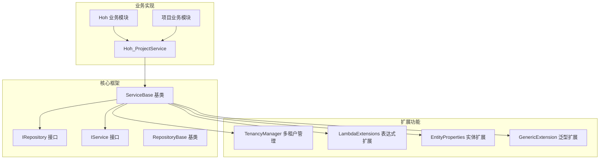
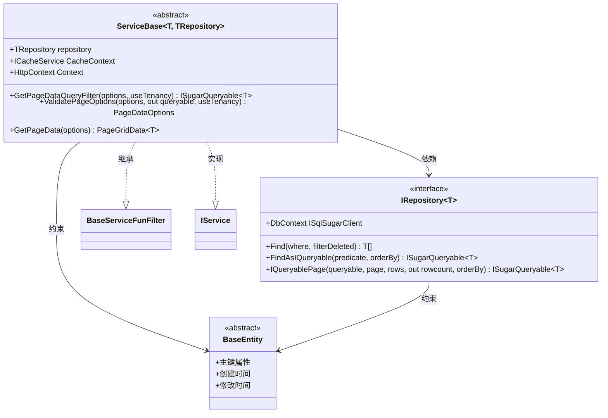
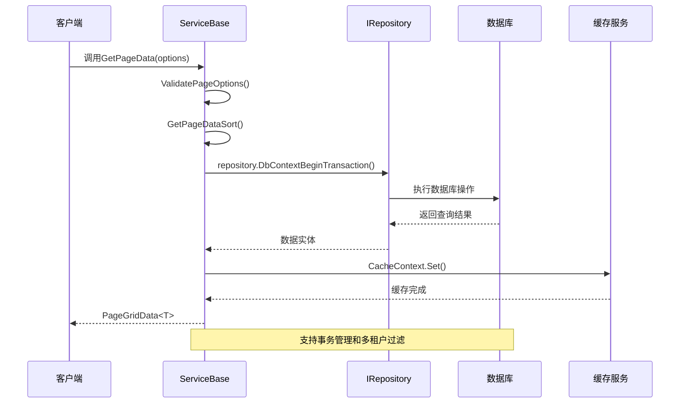
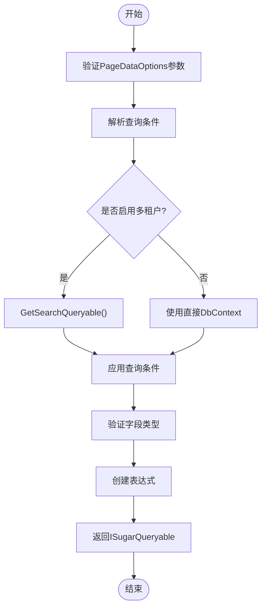
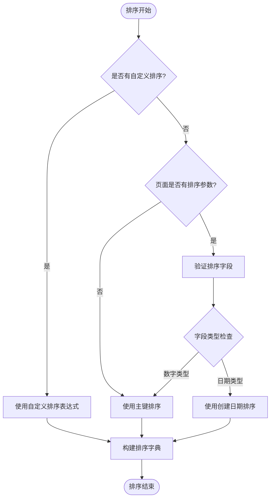
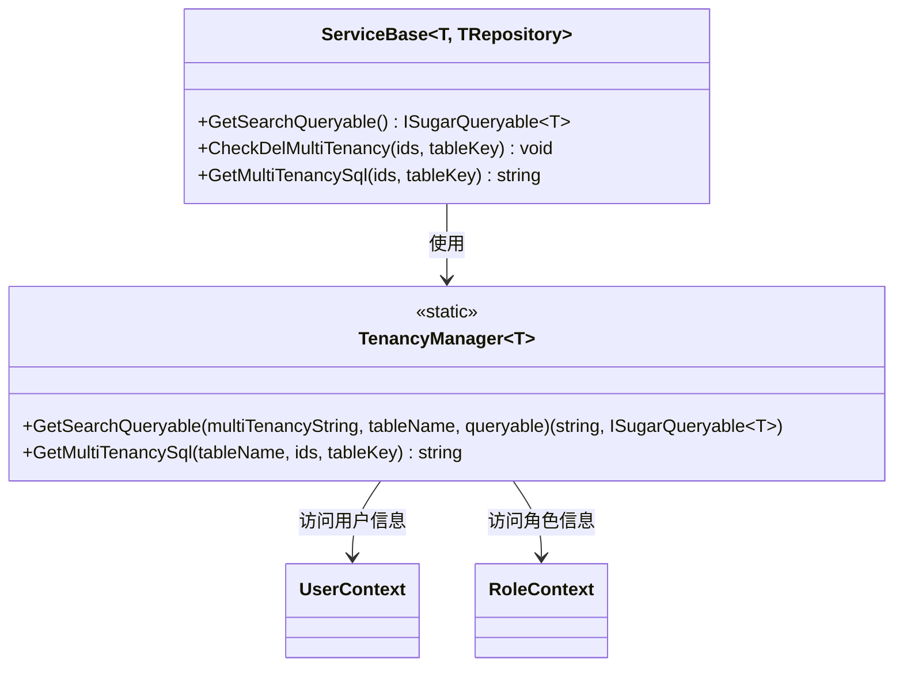
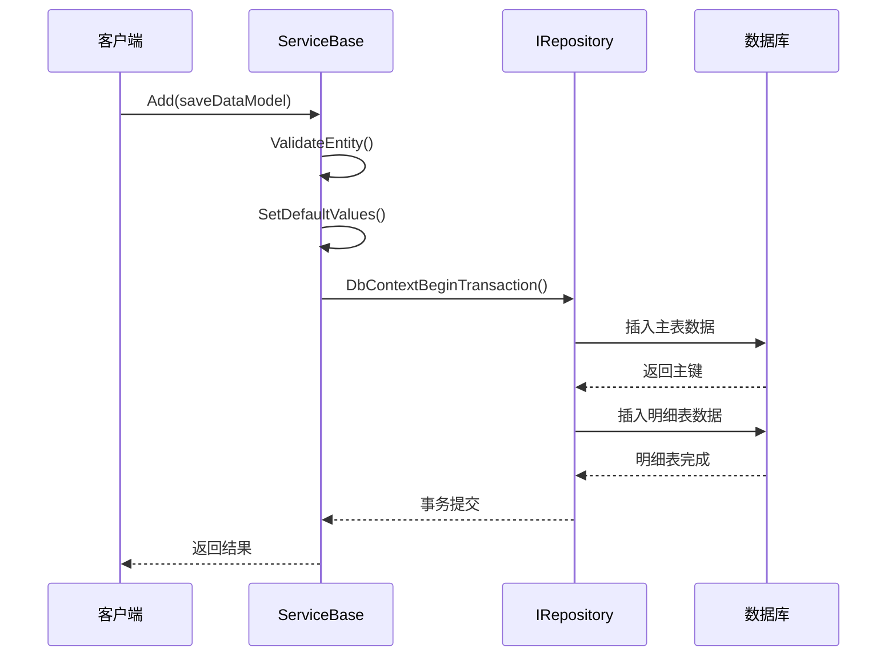
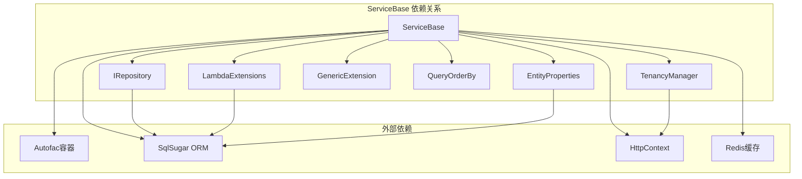
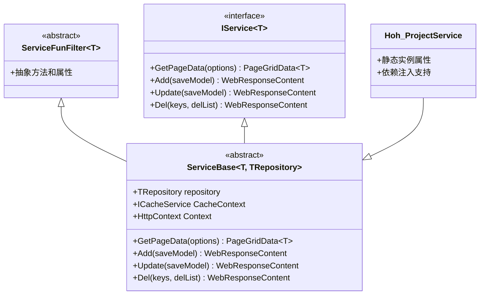

# ServiceBase基类设计

<cite>
**本文档引用的文件**
- [ServiceBase.cs](file://VolPro.Core/BaseProvider/ServiceBase.cs)
- [IRepository.cs](file://VolPro.Core/BaseProvider/IRepository.cs)
- [IService.cs](file://VolPro.Core/BaseProvider/IService.cs)
- [RepositoryBase.cs](file://VolPro.Core/BaseProvider/RepositoryBase.cs)
- [TenancyManager.cs](file://VolPro.Core/Tenancy/TenancyManager.cs)
- [LambdaExtensions.cs](file://VolPro.Core/Extensions/LambdaExtensions.cs)
- [EntityProperties.cs](file://VolPro.Core/Extensions/EntityProperties.cs)
- [GenericExtension.cs](file://VolPro.Core/Extensions/GenericExtension.cs)
- [QueryOrderBy.cs](file://VolPro.Core/Enums/QueryOrderBy.cs)
- [Hoh_ProjectService.cs](file://Hncdi.HeatOfHydration/Services/Hoh/Hoh_ProjectService.cs)
</cite>

## 目录
1. [简介](#简介)
2. [项目结构](#项目结构)
3. [核心组件](#核心组件)
4. [架构概览](#架构概览)
5. [详细组件分析](#详细组件分析)
6. [依赖关系分析](#依赖关系分析)
7. [性能考虑](#性能考虑)
8. [故障排除指南](#故障排除指南)
9. [结论](#结论)

## 简介

ServiceBase是水化热平台的核心服务基类，基于泛型设计实现了类型安全的服务层架构。该基类通过泛型约束机制确保编译时类型安全，同时提供了完整的CRUD操作、分页查询、数据验证、多租户过滤等企业级功能。

该设计的核心优势在于：
- **类型安全**：通过泛型约束确保T和TRepository的类型一致性
- **代码复用**：统一的业务逻辑实现，减少重复代码
- **扩展性**：支持复杂的主从表、多级明细表操作
- **安全性**：内置数据验证、权限控制和审计功能

## 项目结构

**图表来源**
- [ServiceBase.cs:31-34](file://VolPro.Core/BaseProvider/ServiceBase.cs#L31-34)
- [IRepository.cs:19-27](file://VolPro.Core/BaseProvider/IRepository.cs#L19-27)
- [IService.cs:14-18](file://VolPro.Core/BaseProvider/IService.cs#L14-18)

**章节来源**
- [ServiceBase.cs:1-800](file://VolPro.Core/BaseProvider/ServiceBase.cs#L1-800)
- [IRepository.cs:1-328](file://VolPro.Core/BaseProvider/IRepository.cs#L1-328)
- [IService.cs:1-165](file://VolPro.Core/BaseProvider/IService.cs#L1-165)

## 核心组件

### 泛型约束机制

ServiceBase采用双重泛型约束确保类型安全：

**图表来源**
- [ServiceBase.cs:31-34](file://VolPro.Core/BaseProvider/ServiceBase.cs#L31-34)
- [IRepository.cs:19-27](file://VolPro.Core/BaseProvider/IRepository.cs#L19-27)
- [IService.cs:14-18](file://VolPro.Core/BaseProvider/IService.cs#L14-18)

### 核心属性详解

#### repository属性
- **作用**：存储数据访问层实例，负责数据库操作
- **初始化**：通过构造函数注入，支持依赖注入容器
- **类型**：IRepository<T>泛型接口

#### CacheContext属性
- **作用**：提供缓存服务访问接口
- **实现**：通过Autofac容器获取ICacheService实例
- **用途**：支持内存缓存、Redis缓存等缓存策略

#### Context属性
- **作用**：提供HTTP上下文访问
- **实现**：静态访问HttpContext.Current
- **用途**：获取请求信息、用户身份等

**章节来源**
- [ServiceBase.cs:39-53](file://VolPro.Core/BaseProvider/ServiceBase.cs#L39-53)
- [ServiceBase.cs:72-76](file://VolPro.Core/BaseProvider/ServiceBase.cs#L72-76)

## 架构概览

**图表来源**
- [ServiceBase.cs:285-340](file://VolPro.Core/BaseProvider/ServiceBase.cs#L285-340)
- [IRepository.cs:36-36](file://VolPro.Core/BaseProvider/IRepository.cs#L36-36)

## 详细组件分析

### 查询过滤系统

#### GetPageDataQueryFilter方法
该方法是查询过滤的核心入口：

**图表来源**
- [ServiceBase.cs:206-210](file://VolPro.Core/BaseProvider/ServiceBase.cs#L206-210)
- [ServiceBase.cs:218-278](file://VolPro.Core/BaseProvider/ServiceBase.cs#L218-278)

#### ValidatePageOptions方法
该方法负责参数验证和查询构建：

**章节来源**
- [ServiceBase.cs:218-278](file://VolPro.Core/BaseProvider/ServiceBase.cs#L218-278)

### 排序系统

#### GetPageDataSort方法
智能排序逻辑确保数据查询的稳定性和性能：

**图表来源**
- [ServiceBase.cs:146-198](file://VolPro.Core/BaseProvider/ServiceBase.cs#L146-198)

**章节来源**
- [ServiceBase.cs:146-198](file://VolPro.Core/BaseProvider/ServiceBase.cs#L146-198)

### 多租户过滤机制

#### TenancyManager集成
ServiceBase深度集成了多租户管理功能：

**图表来源**
- [ServiceBase.cs:92-116](file://VolPro.Core/BaseProvider/ServiceBase.cs#L92-116)
- [TenancyManager.cs:26-89](file://VolPro.Core/Tenancy/TenancyManager.cs#L26-89)

**章节来源**
- [ServiceBase.cs:92-116](file://VolPro.Core/BaseProvider/ServiceBase.cs#L92-116)
- [TenancyManager.cs:17-117](file://VolPro.Core/Tenancy/TenancyManager.cs#L17-117)

### CRUD操作实现

#### 添加操作
ServiceBase支持复杂的一对多、三级明细表操作：

**图表来源**
- [ServiceBase.cs:759-761](file://VolPro.Core/BaseProvider/ServiceBase.cs#L759-761)
- [ServiceBase.cs:805-857](file://VolPro.Core/BaseProvider/ServiceBase.cs#L805-857)

**章节来源**
- [ServiceBase.cs:759-857](file://VolPro.Core/BaseProvider/ServiceBase.cs#L759-857)

### 权限控制和字段过滤

#### FilterQueryableAuthFields方法
实现基于角色的字段级权限控制：

**章节来源**
- [ServiceBase.cs:346-378](file://VolPro.Core/BaseProvider/ServiceBase.cs#L346-378)

## 依赖关系分析

**图表来源**
- [ServiceBase.cs:1-28](file://VolPro.Core/BaseProvider/ServiceBase.cs#L1-28)
- [IRepository.cs:1-16](file://VolPro.Core/BaseProvider/IRepository.cs#L1-16)

### 继承层次结构

**图表来源**
- [ServiceBase.cs:31-34](file://VolPro.Core/BaseProvider/ServiceBase.cs#L31-34)
- [IService.cs:14-18](file://VolPro.Core/BaseProvider/IService.cs#L14-18)
- [Hoh_ProjectService.cs:16-22](file://Hncdi.HeatOfHydration/Services/Hoh/Hoh_ProjectService.cs#L16-22)

**章节来源**
- [ServiceBase.cs:31-34](file://VolPro.Core/BaseProvider/ServiceBase.cs#L31-34)
- [IService.cs:14-18](file://VolPro.Core/BaseProvider/IService.cs#L14-18)
- [Hoh_ProjectService.cs:16-22](file://Hncdi.HeatOfHydration/Services/Hoh/Hoh_ProjectService.cs#L16-22)

## 性能考虑

### 查询优化策略

1. **延迟加载**：使用ISugarQueryable实现延迟执行
2. **批量操作**：支持批量插入、更新、删除
3. **缓存策略**：集成多种缓存方案
4. **事务管理**：自动事务边界管理

### 内存管理最佳实践

1. **对象池**：合理使用对象生命周期
2. **流式处理**：大数据量时使用流式读取
3. **及时释放**：确保数据库连接及时释放
4. **垃圾回收**：避免大对象长时间驻留

## 故障排除指南

### 常见问题及解决方案

#### 类型转换错误
- **症状**：泛型参数类型不匹配
- **解决方案**：检查T和TRepository的继承关系

#### 查询性能问题
- **症状**：查询响应缓慢
- **解决方案**：优化索引、使用适当的分页参数

#### 事务回滚
- **症状**：数据一致性问题
- **解决方案**：检查事务边界和异常处理

**章节来源**
- [ServiceBase.cs:67-70](file://VolPro.Core/BaseProvider/ServiceBase.cs#L67-70)
- [ServiceBase.cs:218-278](file://VolPro.Core/BaseProvider/ServiceBase.cs#L218-278)

## 结论

ServiceBase基类通过精心设计的泛型约束机制和丰富的扩展功能，为水化热平台提供了强大而灵活的服务层基础设施。其核心优势包括：

1. **类型安全**：编译时类型检查确保代码质量
2. **高度复用**：统一的业务逻辑减少重复代码
3. **扩展性强**：支持复杂的业务场景
4. **性能优化**：内置多种性能优化策略
5. **安全可靠**：完善的权限控制和数据验证

该设计为后续的功能扩展和维护奠定了坚实的基础，是企业级应用开发的优秀范例。