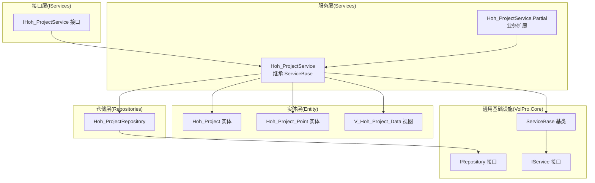
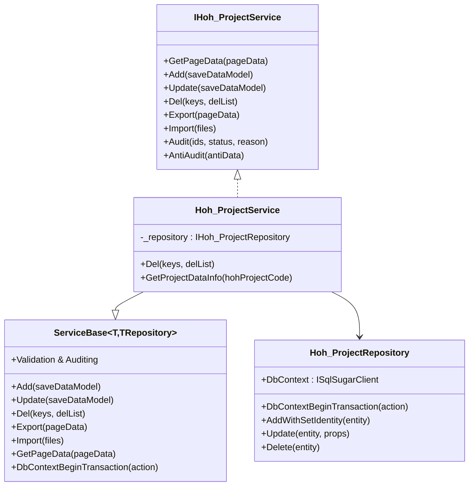
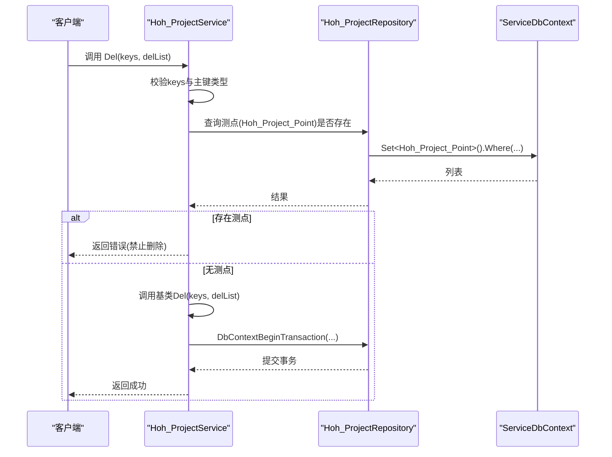
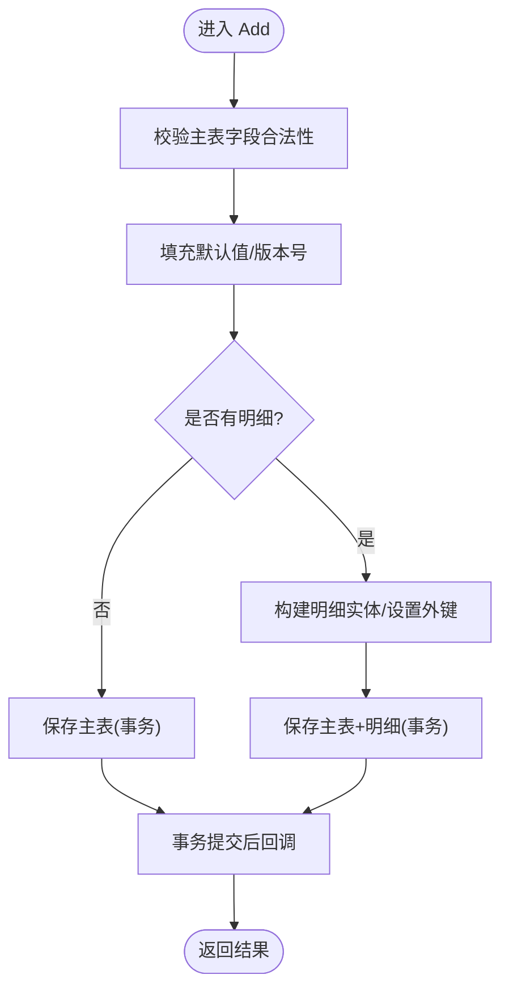
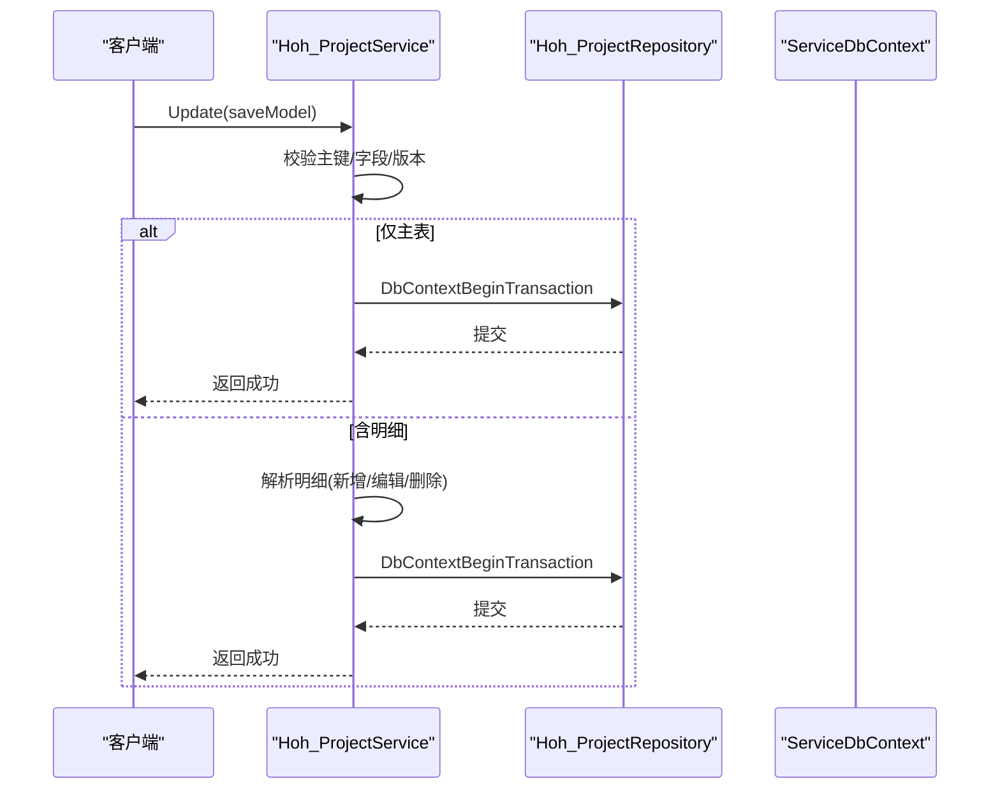
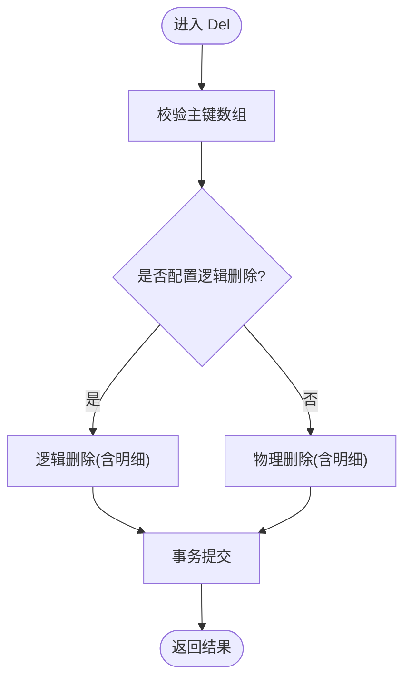
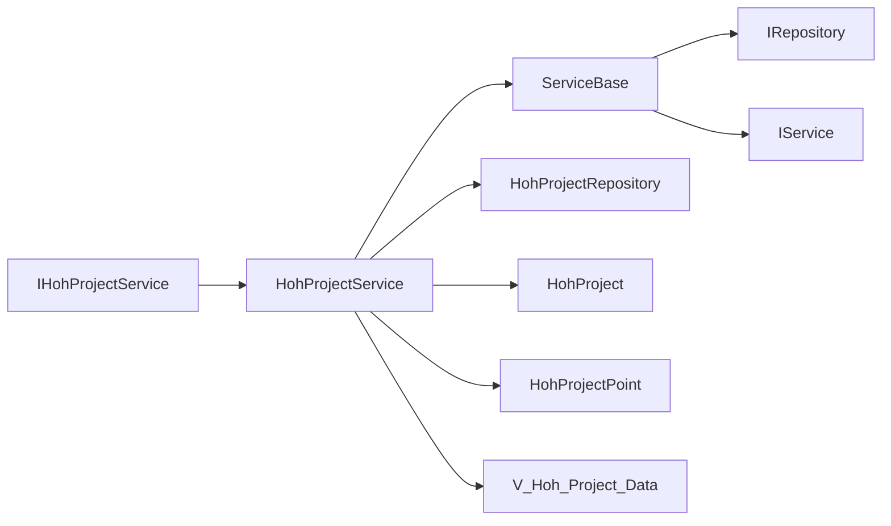

# 业务服务实现详解

<cite>
**本文引用的文件**
- [Hoh_ProjectService.cs](file://Hncdi.HeatOfHydration/Services/Hoh/Partial/Hoh_ProjectService.cs)
- [Hoh_ProjectService.cs](file://Hncdi.HeatOfHydration/Services/Hoh/Hoh_ProjectService.cs)
- [IHoh_ProjectService.cs](file://Hncdi.HeatOfHydration/IServices/Hoh/IHoh_ProjectService.cs)
- [Hoh_ProjectRepository.cs](file://Hncdi.HeatOfHydration/Repositories/Hoh/Hoh_ProjectRepository.cs)
- [ServiceBase.cs](file://VolPro.Core/BaseProvider/ServiceBase.cs)
- [IService.cs](file://VolPro.Core/BaseProvider/IService.cs)
- [IRepository.cs](file://VolPro.Core/BaseProvider/IRepository.cs)
- [Hoh_Project.cs](file://VolPro.Entity/DomainModels/Hoh/Hoh_Project.cs)
- [Hoh_Project_Point.cs](file://VolPro.Entity/DomainModels/Hoh/Hoh_Project_Point.cs)
- [V_Hoh_Project_Data.cs](file://VolPro.Entity/DomainModels/Hoh/V_Hoh_Project_Data.cs)
</cite>

## 目录
1. [引言](#引言)
2. [项目结构](#项目结构)
3. [核心组件](#核心组件)
4. [架构总览](#架构总览)
5. [详细组件分析](#详细组件分析)
6. [依赖关系分析](#依赖关系分析)
7. [性能考量](#性能考量)
8. [故障排查指南](#故障排查指南)
9. [结论](#结论)
10. [附录](#附录)

## 引言
本文件围绕“水化热平台”的业务服务实现展开，重点剖析Hoh_ProjectService如何继承通用ServiceBase并实现具体业务逻辑，涵盖CRUD操作（新增、编辑、删除）、数据验证、事务处理、异常捕获、复杂业务场景（批量操作、级联更新、数据同步）以及与仓储层的交互模式与性能优化策略。文档同时提供面向非技术读者的可读性说明与面向开发者的代码级参考。

## 项目结构
水化热平台采用分层清晰的架构：实体层（DomainModels）、仓储层（Repositories）、服务层（Services）、接口层（IServices），以及通用基础设施（VolPro.Core）。业务服务通过继承ServiceBase获得统一的CRUD、导入导出、分页查询、工作流集成等能力；具体业务逻辑在Partial文件中扩展实现。

图表来源
- [Hoh_ProjectService.cs:16-22](file://Hncdi.HeatOfHydration/Services/Hoh/Hoh_ProjectService.cs#L16-L22)
- [Hoh_ProjectService.cs:27-43](file://Hncdi.HeatOfHydration/Services/Hoh/Partial/Hoh_ProjectService.cs#L27-L43)
- [IHoh_ProjectService.cs:9-11](file://Hncdi.HeatOfHydration/IServices/Hoh/IHoh_ProjectService.cs#L9-L11)
- [Hoh_ProjectRepository.cs:13-22](file://Hncdi.HeatOfHydration/Repositories/Hoh/Hoh_ProjectRepository.cs#L13-L22)
- [ServiceBase.cs:31-34](file://VolPro.Core/BaseProvider/ServiceBase.cs#L31-L34)
- [IService.cs:14-16](file://VolPro.Core/BaseProvider/IService.cs#L14-L16)
- [IRepository.cs:19-28](file://VolPro.Core/BaseProvider/IRepository.cs#L19-L28)
- [Hoh_Project.cs:17-18](file://VolPro.Entity/DomainModels/Hoh/Hoh_Project.cs#L17-L18)
- [Hoh_Project_Point.cs:17-18](file://VolPro.Entity/DomainModels/Hoh/Hoh_Project_Point.cs#L17-L18)
- [V_Hoh_Project_Data.cs:17-18](file://VolPro.Entity/DomainModels/Hoh/V_Hoh_Project_Data.cs#L17-L18)

章节来源
- [Hoh_ProjectService.cs:16-22](file://Hncdi.HeatOfHydration/Services/Hoh/Hoh_ProjectService.cs#L16-L22)
- [Hoh_ProjectService.cs:27-43](file://Hncdi.HeatOfHydration/Services/Hoh/Partial/Hoh_ProjectService.cs#L27-L43)
- [IHoh_ProjectService.cs:9-11](file://Hncdi.HeatOfHydration/IServices/Hoh/IHoh_ProjectService.cs#L9-L11)
- [Hoh_ProjectRepository.cs:13-22](file://Hncdi.HeatOfHydration/Repositories/Hoh/Hoh_ProjectRepository.cs#L13-L22)
- [ServiceBase.cs:31-34](file://VolPro.Core/BaseProvider/ServiceBase.cs#L31-L34)
- [IService.cs:14-16](file://VolPro.Core/BaseProvider/IService.cs#L14-L16)
- [IRepository.cs:19-28](file://VolPro.Core/BaseProvider/IRepository.cs#L19-L28)
- [Hoh_Project.cs:17-18](file://VolPro.Entity/DomainModels/Hoh/Hoh_Project.cs#L17-L18)
- [Hoh_Project_Point.cs:17-18](file://VolPro.Entity/DomainModels/Hoh/Hoh_Project_Point.cs#L17-L18)
- [V_Hoh_Project_Data.cs:17-18](file://VolPro.Entity/DomainModels/Hoh/V_Hoh_Project_Data.cs#L17-L18)

## 核心组件
- Hoh_ProjectService：继承ServiceBase，承载水化热项目监控部位的业务逻辑，扩展了单条删除限制、项目聚合数据查询与统计计算等。
- ServiceBase：提供统一的CRUD、分页查询、导入导出、工作流集成、事务封装、数据版本控制、明细表一对多/三级联动等能力。
- Hoh_ProjectRepository：封装数据库访问，提供事务执行、查询、更新、删除等基础能力。
- 实体模型：Hoh_Project、Hoh_Project_Point、V_Hoh_Project_Data分别代表监控部位、测点、监测数据视图。

章节来源
- [Hoh_ProjectService.cs:16-22](file://Hncdi.HeatOfHydration/Services/Hoh/Hoh_ProjectService.cs#L16-L22)
- [ServiceBase.cs:31-34](file://VolPro.Core/BaseProvider/ServiceBase.cs#L31-L34)
- [Hoh_ProjectRepository.cs:13-22](file://Hncdi.HeatOfHydration/Repositories/Hoh/Hoh_ProjectRepository.cs#L13-L22)
- [Hoh_Project.cs:17-18](file://VolPro.Entity/DomainModels/Hoh/Hoh_Project.cs#L17-L18)
- [Hoh_Project_Point.cs:17-18](file://VolPro.Entity/DomainModels/Hoh/Hoh_Project_Point.cs#L17-L18)
- [V_Hoh_Project_Data.cs:17-18](file://VolPro.Entity/DomainModels/Hoh/V_Hoh_Project_Data.cs#L17-L18)

## 架构总览
业务服务通过接口与实现分离，遵循依赖倒置原则；服务层基于泛型基类ServiceBase复用通用能力；仓储层提供ISqlSugarClient与EF上下文的统一抽象；实体层通过特性标注实现多表关联、明细表配置与视图映射。

图表来源
- [IHoh_ProjectService.cs:9-11](file://Hncdi.HeatOfHydration/IServices/Hoh/IHoh_ProjectService.cs#L9-L11)
- [Hoh_ProjectService.cs:16-22](file://Hncdi.HeatOfHydration/Services/Hoh/Hoh_ProjectService.cs#L16-L22)
- [Hoh_ProjectService.cs:27-43](file://Hncdi.HeatOfHydration/Services/Hoh/Partial/Hoh_ProjectService.cs#L27-L43)
- [ServiceBase.cs:31-34](file://VolPro.Core/BaseProvider/ServiceBase.cs#L31-L34)
- [Hoh_ProjectRepository.cs:13-22](file://Hncdi.HeatOfHydration/Repositories/Hoh/Hoh_ProjectRepository.cs#L13-L22)

## 详细组件分析

### Hoh_ProjectService：继承ServiceBase的业务实现
- 继承关系：Hoh_ProjectService继承ServiceBase<Hoh_Project, IHoh_ProjectRepository>，复用通用CRUD、分页、导入导出、工作流等能力。
- 业务扩展：
  - 单条删除限制：重写Del方法，若存在关联测点则拒绝删除，确保数据完整性。
  - 聚合查询与统计：GetProjectDataInfo整合项目、部位、测点、监测数据、报告等信息，计算监控时长、最新更新时间、各类统计指标（最大/最小/平均、温升速率等）。

图表来源
- [Hoh_ProjectService.cs:45-59](file://Hncdi.HeatOfHydration/Services/Hoh/Partial/Hoh_ProjectService.cs#L45-L59)
- [Hoh_ProjectRepository.cs:13-22](file://Hncdi.HeatOfHydration/Repositories/Hoh/Hoh_ProjectRepository.cs#L13-L22)
- [ServiceBase.cs:2108-2193](file://VolPro.Core/BaseProvider/ServiceBase.cs#L2108-L2193)

章节来源
- [Hoh_ProjectService.cs:45-59](file://Hncdi.HeatOfHydration/Services/Hoh/Partial/Hoh_ProjectService.cs#L45-L59)
- [Hoh_ProjectService.cs:61-216](file://Hncdi.HeatOfHydration/Services/Hoh/Partial/Hoh_ProjectService.cs#L61-L216)

### CRUD操作实现要点

#### 新增（Add）
- 参数校验：ValidateDicInEntity对主表字段进行合法性校验，自动填充默认值（创建人、创建时间、租户等），支持数据版本号生成。
- 主键策略：根据AppSetting.UseSnow与字段类型生成雪花ID或GUID；字符串主键支持空值时自动生成。
- 明细处理：支持一对多/三级明细，自动设置主表外键、明细主键、默认值与逻辑删除字段。
- 事务保障：使用DbContextBeginTransaction包裹新增主表与明细，保证原子性。
- 审批集成：AddProcese触发工作流流程。

图表来源
- [ServiceBase.cs:659-761](file://VolPro.Core/BaseProvider/ServiceBase.cs#L659-L761)
- [ServiceBase.cs:805-857](file://VolPro.Core/BaseProvider/ServiceBase.cs#L805-L857)
- [ServiceBase.cs:964-1055](file://VolPro.Core/BaseProvider/ServiceBase.cs#L964-L1055)

章节来源
- [ServiceBase.cs:659-761](file://VolPro.Core/BaseProvider/ServiceBase.cs#L659-L761)
- [ServiceBase.cs:805-857](file://VolPro.Core/BaseProvider/ServiceBase.cs#L805-L857)
- [ServiceBase.cs:964-1055](file://VolPro.Core/BaseProvider/ServiceBase.cs#L964-L1055)

#### 编辑（Update）
- 主键校验：严格校验主键类型与值，避免误更新或空主键。
- 字段白名单：仅更新允许编辑的字段，排除创建人等字段。
- 数据版本控制：CheckDataVersion对比并更新版本号，防止并发覆盖。
- 明细联动：支持一对多/三级明细的新增、编辑、删除，按主键判断新增/编辑，删除键集合直接删除。
- 事务保障：使用DbContextBeginTransaction包裹主表与明细的批量更新。

图表来源
- [ServiceBase.cs:1376-1486](file://VolPro.Core/BaseProvider/ServiceBase.cs#L1376-L1486)
- [ServiceBase.cs:1532-1654](file://VolPro.Core/BaseProvider/ServiceBase.cs#L1532-L1654)
- [ServiceBase.cs:1668-1939](file://VolPro.Core/BaseProvider/ServiceBase.cs#L1668-L1939)

章节来源
- [ServiceBase.cs:1376-1486](file://VolPro.Core/BaseProvider/ServiceBase.cs#L1376-L1486)
- [ServiceBase.cs:1532-1654](file://VolPro.Core/BaseProvider/ServiceBase.cs#L1532-L1654)
- [ServiceBase.cs:1668-1939](file://VolPro.Core/BaseProvider/ServiceBase.cs#L1668-L1939)

#### 删除（Del）
- 逻辑删除优先：若实体配置逻辑删除字段，则走逻辑删除分支，更新状态并级联处理明细。
- 物理删除：否则走物理删除，支持级联删除明细表。
- 权限与租户：多租户场景下进行数据隔离校验。

图表来源
- [ServiceBase.cs:2108-2193](file://VolPro.Core/BaseProvider/ServiceBase.cs#L2108-L2193)
- [ServiceBase.cs:2231-2271](file://VolPro.Core/BaseProvider/ServiceBase.cs#L2231-L2271)
- [ServiceBase.cs:2195-2200](file://VolPro.Core/BaseProvider/ServiceBase.cs#L2195-L2200)

章节来源
- [ServiceBase.cs:2108-2193](file://VolPro.Core/BaseProvider/ServiceBase.cs#L2108-L2193)
- [ServiceBase.cs:2231-2271](file://VolPro.Core/BaseProvider/ServiceBase.cs#L2231-L2271)
- [ServiceBase.cs:2195-2200](file://VolPro.Core/BaseProvider/ServiceBase.cs#L2195-L2200)

### 复杂业务场景

#### 批量操作
- 一对多/三级明细：通过SetEntityDetail/UpdateToEntity/EntryDbContextMultipleTableEntities等方法，将主表与多明细合并为一次事务提交，确保一致性。
- 批量删除：CreateSubDel/CreateSubDelContext支持三级明细的批量删除。

章节来源
- [ServiceBase.cs:1223-1267](file://VolPro.Core/BaseProvider/ServiceBase.cs#L1223-L1267)
- [ServiceBase.cs:1668-1939](file://VolPro.Core/BaseProvider/ServiceBase.cs#L1668-L1939)
- [ServiceBase.cs:2051-2100](file://VolPro.Core/BaseProvider/ServiceBase.cs#L2051-L2100)

#### 级联更新
- 在编辑流程中，明细的新增/编辑/删除集合在一次事务内完成，避免部分更新导致的数据不一致。
- 通过SetMultipleTableEntities统一入口，减少重复代码与遗漏。

章节来源
- [ServiceBase.cs:1943-1955](file://VolPro.Core/BaseProvider/ServiceBase.cs#L1943-L1955)
- [ServiceBase.cs:1961-2000](file://VolPro.Core/BaseProvider/ServiceBase.cs#L1961-L2000)

#### 数据同步
- 项目聚合查询：GetProjectDataInfo从多表聚合数据，计算统计指标并返回统一结构，便于前端展示。
- 监测数据视图：通过V_Hoh_Project_Data视图统一查询测点数据，简化跨表查询。

章节来源
- [Hoh_ProjectService.cs:61-216](file://Hncdi.HeatOfHydration/Services/Hoh/Partial/Hoh_ProjectService.cs#L61-L216)
- [V_Hoh_Project_Data.cs:17-18](file://VolPro.Entity/DomainModels/Hoh/V_Hoh_Project_Data.cs#L17-L18)

### 业务服务与仓储层交互模式
- 依赖注入：构造函数注入IHoh_ProjectRepository与IHttpContextAccessor，便于在服务中使用仓储与上下文。
- 事务封装：统一通过IRepository.DbContextBeginTransaction(action)进行事务包裹，保证数据一致性。
- 查询与更新：通过ISqlSugarClient与EF上下文组合使用，满足复杂查询与高性能更新需求。

章节来源
- [Hoh_ProjectService.cs:29-43](file://Hncdi.HeatOfHydration/Services/Hoh/Partial/Hoh_ProjectService.cs#L29-L43)
- [IRepository.cs:36-36](file://VolPro.Core/BaseProvider/IRepository.cs#L36-L36)
- [Hoh_ProjectRepository.cs:13-22](file://Hncdi.HeatOfHydration/Repositories/Hoh/Hoh_ProjectRepository.cs#L13-L22)

## 依赖关系分析
- Hoh_ProjectService依赖于ServiceBase提供的通用能力，同时通过Hoh_ProjectRepository访问数据库。
- 实体模型通过Entity特性声明明细表关系，ServiceBase据此进行一对多/三级明细的解析与持久化。
- 接口层与实现层解耦，便于替换与测试。

图表来源
- [IHoh_ProjectService.cs:9-11](file://Hncdi.HeatOfHydration/IServices/Hoh/IHoh_ProjectService.cs#L9-L11)
- [Hoh_ProjectService.cs:16-22](file://Hncdi.HeatOfHydration/Services/Hoh/Hoh_ProjectService.cs#L16-L22)
- [ServiceBase.cs:31-34](file://VolPro.Core/BaseProvider/ServiceBase.cs#L31-L34)
- [IRepository.cs:19-28](file://VolPro.Core/BaseProvider/IRepository.cs#L19-L28)
- [IService.cs:14-16](file://VolPro.Core/BaseProvider/IService.cs#L14-L16)
- [Hoh_Project.cs:17-18](file://VolPro.Entity/DomainModels/Hoh/Hoh_Project.cs#L17-L18)
- [Hoh_Project_Point.cs:17-18](file://VolPro.Entity/DomainModels/Hoh/Hoh_Project_Point.cs#L17-L18)
- [V_Hoh_Project_Data.cs:17-18](file://VolPro.Entity/DomainModels/Hoh/V_Hoh_Project_Data.cs#L17-L18)

章节来源
- [IHoh_ProjectService.cs:9-11](file://Hncdi.HeatOfHydration/IServices/Hoh/IHoh_ProjectService.cs#L9-L11)
- [Hoh_ProjectService.cs:16-22](file://Hncdi.HeatOfHydration/Services/Hoh/Hoh_ProjectService.cs#L16-L22)
- [ServiceBase.cs:31-34](file://VolPro.Core/BaseProvider/ServiceBase.cs#L31-L34)
- [IRepository.cs:19-28](file://VolPro.Core/BaseProvider/IRepository.cs#L19-L28)
- [IService.cs:14-16](file://VolPro.Core/BaseProvider/IService.cs#L14-L16)
- [Hoh_Project.cs:17-18](file://VolPro.Entity/DomainModels/Hoh/Hoh_Project.cs#L17-L18)
- [Hoh_Project_Point.cs:17-18](file://VolPro.Entity/DomainModels/Hoh/Hoh_Project_Point.cs#L17-L18)
- [V_Hoh_Project_Data.cs:17-18](file://VolPro.Entity/DomainModels/Hoh/V_Hoh_Project_Data.cs#L17-L18)

## 性能考量
- 事务边界：将主表与明细的新增/更新/删除统一放入DbContextBeginTransaction，减少往返与锁竞争。
- 批量操作：一对多/三级明细通过集合一次性提交，降低多次往返成本。
- 查询优化：利用Entity特性与GetPageDataQueryFilter进行字段与排序优化，结合权限字段过滤减少不必要的列加载。
- 导入导出：EPPlusHelper批量导出/导入，避免逐条写入带来的性能损耗。
- 逻辑删除：在需要保留审计轨迹时优先使用逻辑删除，避免频繁物理删除带来的索引重建成本。

## 故障排查指南
- 参数缺失：Add/Update在参数校验阶段返回“参数不足”或“主键缺失/错误”，需检查前端传参与实体主键配置。
- 并发冲突：启用数据版本控制后，若版本不一致返回“数据已变化，请刷新页面”，需提示用户刷新后重试。
- 删除受限：若存在关联测点，删除会被拒绝，需先清理测点或调整业务规则。
- 事务异常：DbContextBeginTransaction内部异常会回滚，检查日志定位具体失败步骤。
- 审批状态：工作流审批状态需符合流程要求，否则返回“只能审批[待审核或审核中]的数据”。

章节来源
- [ServiceBase.cs:1495-1523](file://VolPro.Core/BaseProvider/ServiceBase.cs#L1495-L1523)
- [Hoh_ProjectService.cs:45-59](file://Hncdi.HeatOfHydration/Services/Hoh/Partial/Hoh_ProjectService.cs#L45-L59)
- [ServiceBase.cs:2313-2351](file://VolPro.Core/BaseProvider/ServiceBase.cs#L2313-L2351)

## 结论
Hoh_ProjectService通过继承ServiceBase实现了标准化的业务服务层，结合仓储层的事务封装与实体模型的明细表配置，能够高效处理复杂的CRUD与业务场景。通过统一的验证、事务、版本控制与工作流集成，既保证了数据一致性，也为后续扩展提供了清晰的边界与可维护性。

## 附录
- 关键实现参考路径
  - 新增：[ServiceBase.cs:659-761](file://VolPro.Core/BaseProvider/ServiceBase.cs#L659-L761)
  - 编辑：[ServiceBase.cs:1376-1486](file://VolPro.Core/BaseProvider/ServiceBase.cs#L1376-L1486)
  - 删除：[ServiceBase.cs:2108-2193](file://VolPro.Core/BaseProvider/ServiceBase.cs#L2108-L2193)
  - 一对多/三级明细：[ServiceBase.cs:1223-1267](file://VolPro.Core/BaseProvider/ServiceBase.cs#L1223-L1267)
  - 事务封装：[IRepository.cs:36-36](file://VolPro.Core/BaseProvider/IRepository.cs#L36-L36)
  - 项目聚合查询：[Hoh_ProjectService.cs:61-216](file://Hncdi.HeatOfHydration/Services/Hoh/Partial/Hoh_ProjectService.cs#L61-L216)