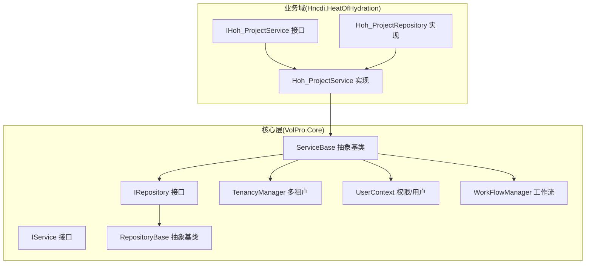
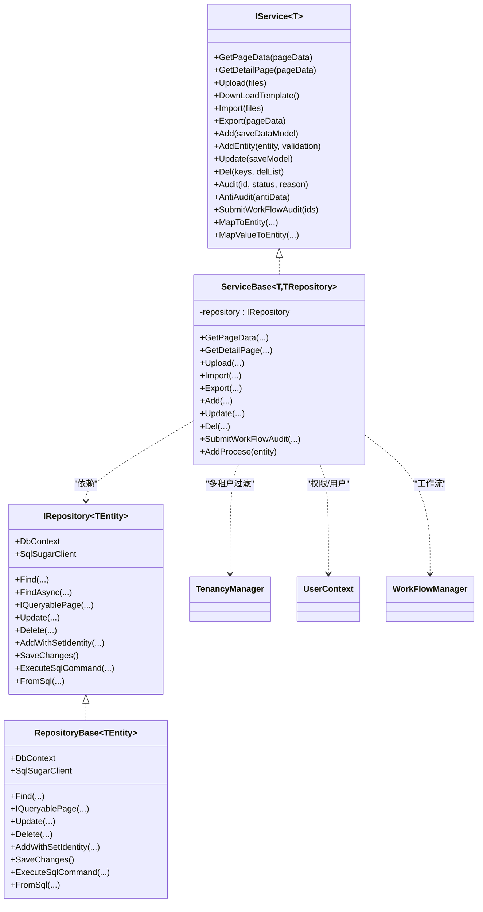
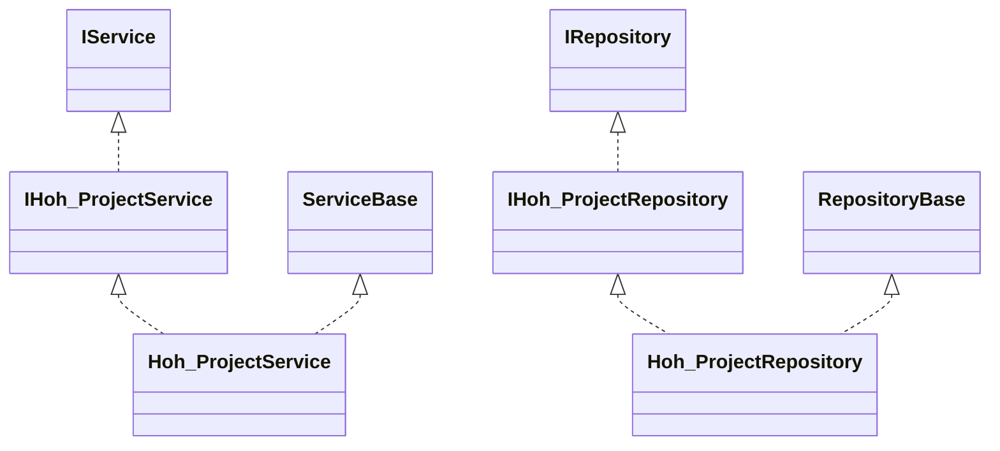
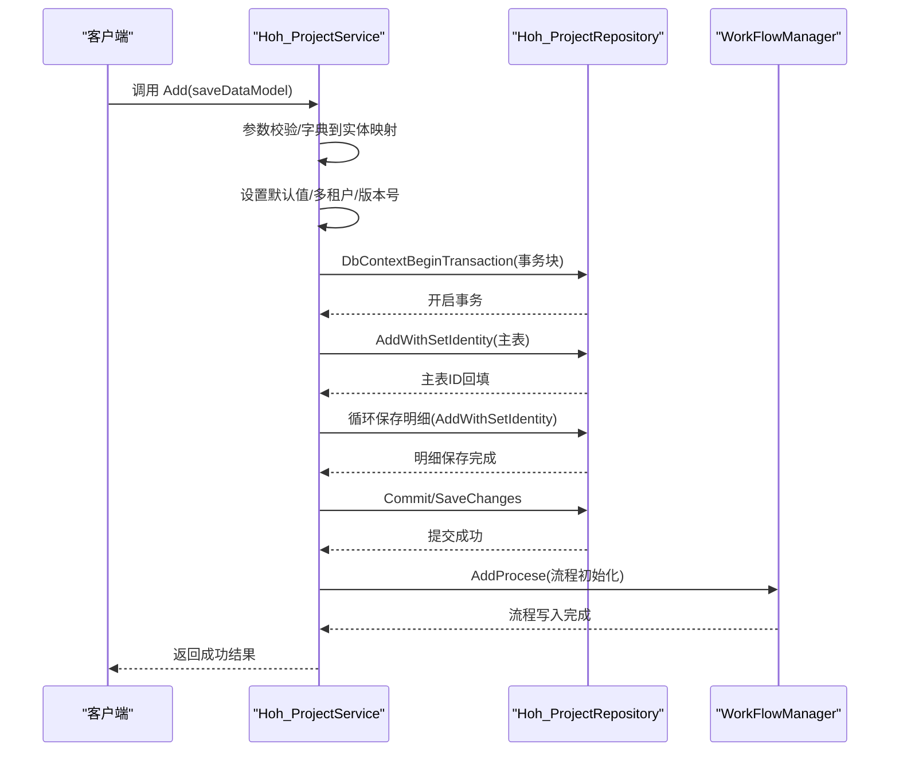
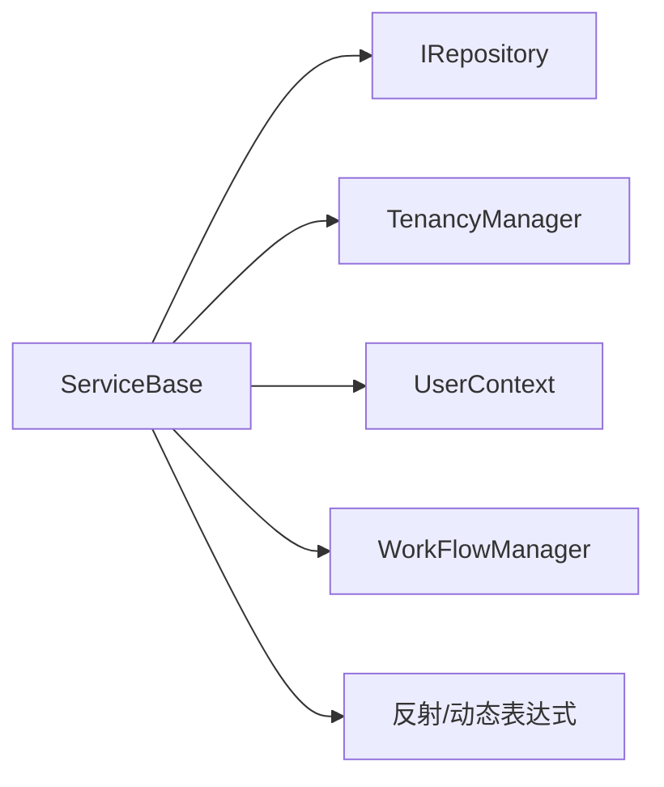

# 业务逻辑层设计

<cite>
**本文引用的文件**
- [ServiceBase.cs](file://VolPro.Core/BaseProvider/ServiceBase.cs)
- [IService.cs](file://VolPro.Core/BaseProvider/IService.cs)
- [IRepository.cs](file://VolPro.Core/BaseProvider/IRepository.cs)
- [RepositoryBase.cs](file://VolPro.Core/BaseProvider/RepositoryBase.cs)
- [TenancyManager.cs](file://VolPro.Core/Tenancy/TenancyManager.cs)
- [UserContext.cs](file://VolPro.Core/UserManager/UserContext.cs)
- [WorkFlowManager.cs](file://VolPro.Core/WorkFlow/WorkFlowManager.cs)
- [Hoh_ProjectService.cs](file://Hncdi.HeatOfHydration/Services/Hoh/Hoh_ProjectService.cs)
- [IHoh_ProjectService.cs](file://Hncdi.HeatOfHydration/IServices/Hoh/IHoh_ProjectService.cs)
- [Hoh_ProjectRepository.cs](file://Hncdi.HeatOfHydration/Repositories/Hoh/Hoh_ProjectRepository.cs)
- [IHoh_ProjectRepository.cs](file://Hncdi.HeatOfHydration/IRepositories/Hoh/IHoh_ProjectRepository.cs)
</cite>

## 目录
1. [引言](#引言)
2. [项目结构](#项目结构)
3. [核心组件](#核心组件)
4. [架构总览](#架构总览)
5. [详细组件分析](#详细组件分析)
6. [依赖关系分析](#依赖关系分析)
7. [性能考虑](#性能考虑)
8. [故障排查指南](#故障排查指南)
9. [结论](#结论)
10. [附录](#附录)

## 引言
本设计文档聚焦于水化热平台的业务逻辑层（Service Layer），系统性阐述ServiceBase基类的设计模式、泛型约束机制、反射与动态类型的应用、职责划分、事务管理、数据验证、多租户支持、权限控制与审计日志集成。文档同时提供Service接口与实现类的关系图、典型业务流程图，并总结设计原则、异常处理策略与性能优化技巧。

## 项目结构
业务逻辑层位于VolPro.Core模块，采用“接口 + 抽象基类 + 具体实现”的分层设计，结合仓储层与工作流、权限、多租户等横切能力，形成高内聚、低耦合的服务体系。

图表来源
- [ServiceBase.cs](file://VolPro.Core/BaseProvider/ServiceBase.cs)
- [IService.cs](file://VolPro.Core/BaseProvider/IService.cs)
- [IRepository.cs](file://VolPro.Core/BaseProvider/IRepository.cs)
- [RepositoryBase.cs](file://VolPro.Core/BaseProvider/RepositoryBase.cs)
- [TenancyManager.cs](file://VolPro.Core/Tenancy/TenancyManager.cs)
- [UserContext.cs](file://VolPro.Core/UserManager/UserContext.cs)
- [WorkFlowManager.cs](file://VolPro.Core/WorkFlow/WorkFlowManager.cs)
- [Hoh_ProjectService.cs](file://Hncdi.HeatOfHydration/Services/Hoh/Hoh_ProjectService.cs)
- [IHoh_ProjectService.cs](file://Hncdi.HeatOfHydration/IServices/Hoh/IHoh_ProjectService.cs)
- [Hoh_ProjectRepository.cs](file://Hncdi.HeatOfHydration/Repositories/Hoh/Hoh_ProjectRepository.cs)
- [IHoh_ProjectRepository.cs](file://Hncdi.HeatOfHydration/IRepositories/Hoh/IHoh_ProjectRepository.cs)

章节来源
- [ServiceBase.cs](file://VolPro.Core/BaseProvider/ServiceBase.cs)
- [IService.cs](file://VolPro.Core/BaseProvider/IService.cs)
- [IRepository.cs](file://VolPro.Core/BaseProvider/IRepository.cs)
- [RepositoryBase.cs](file://VolPro.Core/BaseProvider/RepositoryBase.cs)

## 核心组件
- ServiceBase<T, TRepository>：业务服务抽象基类，负责通用查询、分页、导入导出、主从/一对多保存、权限字段过滤、多租户过滤、事务管理、工作流集成、数据版本控制等。
- IService<T>：业务服务契约，定义统一的CRUD、导入导出、审批、映射等接口。
- RepositoryBase<TEntity>：仓储抽象基类，提供查询、分页、更新、删除、事务等基础能力。
- IRepository<TEntity>：仓储契约，面向实体的查询与持久化接口。
- TenancyManager<T>：多租户过滤器，基于用户上下文与配置生成查询过滤或SQL。
- UserContext：用户上下文，提供角色、权限、部门、租户等信息，支撑权限与多租户。
- WorkFlowManager：工作流引擎，负责流程初始化、提交、审核、回退等。

章节来源
- [ServiceBase.cs](file://VolPro.Core/BaseProvider/ServiceBase.cs)
- [IService.cs](file://VolPro.Core/BaseProvider/IService.cs)
- [IRepository.cs](file://VolPro.Core/BaseProvider/IRepository.cs)
- [RepositoryBase.cs](file://VolPro.Core/BaseProvider/RepositoryBase.cs)
- [TenancyManager.cs](file://VolPro.Core/Tenancy/TenancyManager.cs)
- [UserContext.cs](file://VolPro.Core/UserManager/UserContext.cs)
- [WorkFlowManager.cs](file://VolPro.Core/WorkFlow/WorkFlowManager.cs)

## 架构总览
业务逻辑层通过ServiceBase聚合仓储、多租户、权限、工作流等能力，向上提供统一的业务接口，向下复用通用的查询、验证、事务与导出导入逻辑。

图表来源
- [IService.cs](file://VolPro.Core/BaseProvider/IService.cs)
- [IRepository.cs](file://VolPro.Core/BaseProvider/IRepository.cs)
- [ServiceBase.cs](file://VolPro.Core/BaseProvider/ServiceBase.cs)
- [RepositoryBase.cs](file://VolPro.Core/BaseProvider/RepositoryBase.cs)
- [TenancyManager.cs](file://VolPro.Core/Tenancy/TenancyManager.cs)
- [UserContext.cs](file://VolPro.Core/UserManager/UserContext.cs)
- [WorkFlowManager.cs](file://VolPro.Core/WorkFlow/WorkFlowManager.cs)

## 详细组件分析

### ServiceBase基类设计模式与泛型约束
- 设计模式
  - 抽象工厂/模板方法：通过抽象基类定义通用流程骨架，子类覆盖钩子（如AddOnExecuting、UpdateOnExecuted、ImportOnExecuting等）以扩展行为。
  - 组合优于继承：ServiceBase组合仓储、缓存、用户上下文、工作流等能力，避免重复实现。
  - 策略模式：通过委托（如QueryRelativeExpression、OrderByExpression）与动态表达式构建查询策略。
- 泛型约束
  - T : BaseEntity, new()：确保实体具备基础元数据与可实例化能力。
  - TRepository : IRepository<T>：限定仓储类型，保证服务层与仓储层契约一致。
- 反射与动态类型
  - 属性缓存：延迟加载实体属性信息，避免重复反射开销。
  - 动态表达式：基于字段名与LINQ表达式类型生成Where条件，支持多字段、多条件组合查询。
  - 动态泛型调用：通过MakeGenericMethod与反射调用Add、AddMultipleDetail、SetEntityDetail等私有泛型方法，实现主从/一对多的统一处理。
  - 表单映射：利用Expression与MemberInit动态构造投影表达式，实现权限字段过滤与列裁剪。

章节来源
- [ServiceBase.cs](file://VolPro.Core/BaseProvider/ServiceBase.cs)

### 事务管理与数据一致性
- 事务封装
  - DbContextBeginTransaction：统一入口，自动开启/提交/回滚事务，捕获异常并返回标准化响应。
  - 业务方法（Add、Update、SubmitWorkFlowAudit等）均在事务块内执行，确保主从/一对多数据的一致性。
- 锁与并发
  - 数据版本控制：通过DataVersionField与DataVersionValue检测并发冲突，避免“脏写”。
  - 乐观锁：在Update场景中先查询当前版本，若不一致则提示刷新页面。

章节来源
- [ServiceBase.cs](file://VolPro.Core/BaseProvider/ServiceBase.cs)
- [RepositoryBase.cs](file://VolPro.Core/BaseProvider/RepositoryBase.cs)

### 数据验证机制
- 字段合法性
  - ValidatePageOptions：解析前端查询参数，按实体属性类型校验值的合法性，剔除不匹配项。
  - ValidateDicInEntity：校验字典到实体映射的字段是否存在、类型是否匹配、是否必填。
- 主键校验
  - Update前严格校验主键存在性、类型与默认值，防止非法主键导致的错误更新。
- 版本校验
  - CheckDataVersion：对比请求版本与数据库版本，不一致则拒绝更新。

章节来源
- [ServiceBase.cs](file://VolPro.Core/BaseProvider/ServiceBase.cs)

### 多租户支持
- 查询过滤
  - GetSearchQueryable：结合实体特性与配置，生成多租户过滤后的ISugarQueryable。
  - TenancyManager<T>.GetSearchQueryable：根据表名与用户上下文生成查询过滤或原生SQL。
- 删除过滤
  - GetMultiTenancySql：生成删除前的校验SQL，确保仅能删除本人创建或授权范围内的数据。
- 用户上下文
  - UserContext.CurrentServiceId/CurrentDeptId：动态选择租户库与部门库，支撑跨租户数据隔离。

章节来源
- [ServiceBase.cs](file://VolPro.Core/BaseProvider/ServiceBase.cs)
- [TenancyManager.cs](file://VolPro.Core/Tenancy/TenancyManager.cs)
- [UserContext.cs](file://VolPro.Core/UserManager/UserContext.cs)

### 权限控制与字段级过滤
- 字段级可见性
  - FilterQueryableAuthFields：基于角色权限字段集合与隐藏字段集合，动态生成投影表达式，仅返回允许访问的字段。
- 菜单与动作权限
  - UserContext.GetPermissions：聚合角色权限，支持菜单类型区分（移动端/PC端），并缓存版本号以降低Redis/Memory压力。
- 数据权限
  - 支持“仅自己”、“本部门及下级”、“本角色及下级”等策略，结合UserContext提供的用户/角色/部门树查询能力。

章节来源
- [ServiceBase.cs](file://VolPro.Core/BaseProvider/ServiceBase.cs)
- [UserContext.cs](file://VolPro.Core/UserManager/UserContext.cs)

### 审计日志与工作流
- 审计字段默认值
  - SetAuditDefaultValue：为实体设置默认审核状态（如草稿/待提交）。
- 流程提交
  - SubmitWorkFlowAudit：校验状态后提交流程，写入工作流表与步骤表，记录日志。
- 流程初始化
  - AddProcese：根据配置生成流程节点，支持上级部门/角色审批等动态节点。
- 审核与反审
  - WorkFlowManager.Audit：支持审核通过/驳回/回退等操作，维护流程状态与日志。

章节来源
- [ServiceBase.cs](file://VolPro.Core/BaseProvider/ServiceBase.cs)
- [WorkFlowManager.cs](file://VolPro.Core/WorkFlow/WorkFlowManager.cs)

### Service接口与实现类关系图

图表来源
- [IHoh_ProjectService.cs](file://Hncdi.HeatOfHydration/IServices/Hoh/IHoh_ProjectService.cs)
- [Hoh_ProjectService.cs](file://Hncdi.HeatOfHydration/Services/Hoh/Hoh_ProjectService.cs)
- [IHoh_ProjectRepository.cs](file://Hncdi.HeatOfHydration/IRepositories/Hoh/IHoh_ProjectRepository.cs)
- [Hoh_ProjectRepository.cs](file://Hncdi.HeatOfHydration/Repositories/Hoh/Hoh_ProjectRepository.cs)
- [IService.cs](file://VolPro.Core/BaseProvider/IService.cs)
- [IRepository.cs](file://VolPro.Core/BaseProvider/IRepository.cs)
- [ServiceBase.cs](file://VolPro.Core/BaseProvider/ServiceBase.cs)
- [RepositoryBase.cs](file://VolPro.Core/BaseProvider/RepositoryBase.cs)

### 典型业务流程图（新增主从数据）

图表来源
- [ServiceBase.cs](file://VolPro.Core/BaseProvider/ServiceBase.cs)
- [WorkFlowManager.cs](file://VolPro.Core/WorkFlow/WorkFlowManager.cs)

## 依赖关系分析
- 服务层依赖仓储层：ServiceBase持有IRepository<T>，通过仓储执行具体数据库操作。
- 多租户与权限：ServiceBase在查询与删除时调用TenancyManager与UserContext，实现数据隔离与字段级过滤。
- 工作流：ServiceBase在新增/提交时调用WorkFlowManager，写入流程表与步骤表。
- 反射与动态类型：广泛用于表达式构建、泛型方法调用与实体映射，提升代码复用性。

图表来源
- [ServiceBase.cs](file://VolPro.Core/BaseProvider/ServiceBase.cs)
- [TenancyManager.cs](file://VolPro.Core/Tenancy/TenancyManager.cs)
- [UserContext.cs](file://VolPro.Core/UserManager/UserContext.cs)
- [WorkFlowManager.cs](file://VolPro.Core/WorkFlow/WorkFlowManager.cs)

章节来源
- [ServiceBase.cs](file://VolPro.Core/BaseProvider/ServiceBase.cs)
- [IRepository.cs](file://VolPro.Core/BaseProvider/IRepository.cs)
- [RepositoryBase.cs](file://VolPro.Core/BaseProvider/RepositoryBase.cs)

## 性能考虑
- 反射缓存：实体属性信息仅首次反射后缓存，避免重复开销。
- 条件查询：ValidatePageOptions在构建表达式前先做类型校验与值过滤，减少无效查询。
- 权限字段裁剪：FilterQueryableAuthFields通过动态表达式仅查询允许字段，降低网络与序列化成本。
- 分页与排序：IQueryablePage统一处理分页与排序，避免一次性加载全量数据。
- 事务批处理：主从/一对多保存在单事务内完成，减少多次往返与锁竞争。
- 缓存与版本：UserContext对权限与用户信息采用版本号缓存，降低Redis/Memory读取频率。

## 故障排查指南
- 查询无数据或越权
  - 检查多租户过滤是否生效（TenancyManager）与UserContext角色/部门配置。
- 导入失败
  - 查看EPPlus读取与字典映射日志，确认列名映射与忽略字段配置。
- 并发更新失败
  - 检查DataVersion字段是否正确传递与比对。
- 工作流提交异常
  - 检查AuditStatus字段与流程配置，确认SubmitWorkFlowAudit前置状态校验。
- 事务回滚
  - 关注DbContextBeginTransaction异常分支，查看错误消息与堆栈。

章节来源
- [ServiceBase.cs](file://VolPro.Core/BaseProvider/ServiceBase.cs)
- [RepositoryBase.cs](file://VolPro.Core/BaseProvider/RepositoryBase.cs)
- [UserContext.cs](file://VolPro.Core/UserManager/UserContext.cs)
- [WorkFlowManager.cs](file://VolPro.Core/WorkFlow/WorkFlowManager.cs)

## 结论
ServiceBase通过抽象基类与泛型约束，结合反射与动态类型，实现了高度复用的业务逻辑骨架；配合仓储、多租户、权限、工作流与审计能力，形成完整的业务服务层。该设计在保证扩展性的同时，兼顾性能与安全性，适合复杂业务场景的持续演进。

## 附录
- 设计原则
  - 单一职责：查询、导入导出、主从保存、事务、权限、多租户、工作流各司其职。
  - 开闭原则：通过事件钩子与泛型扩展点，避免修改既有代码。
  - 依赖倒置：服务层依赖接口而非具体实现。
- 最佳实践
  - 在Add/Update前统一设置默认值与多租户值。
  - 使用DataVersion避免并发覆盖。
  - 对大字段与敏感字段使用权限字段裁剪。
  - 批量保存时尽量使用单事务，减少锁竞争。
  - 合理使用缓存与版本号，降低权限查询成本。