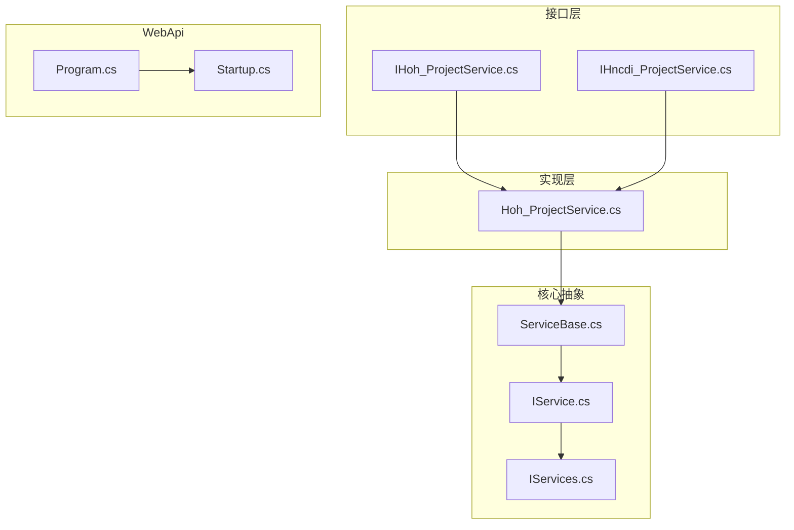
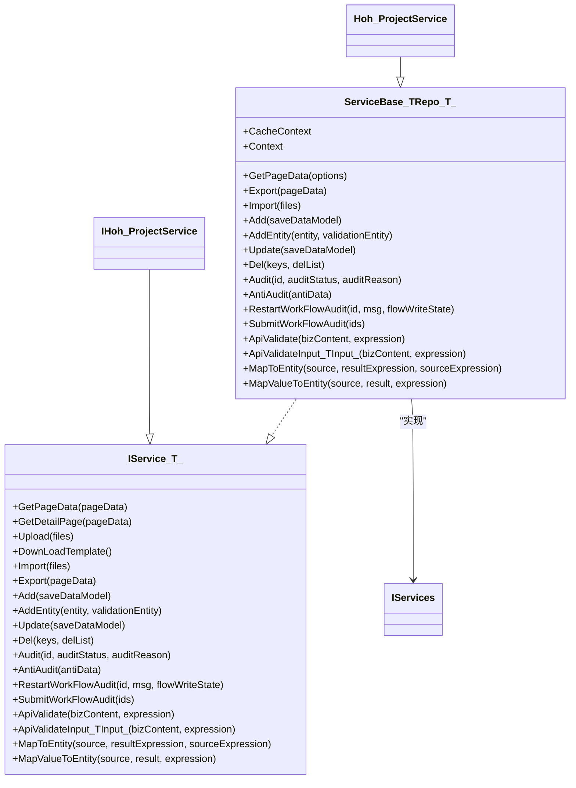
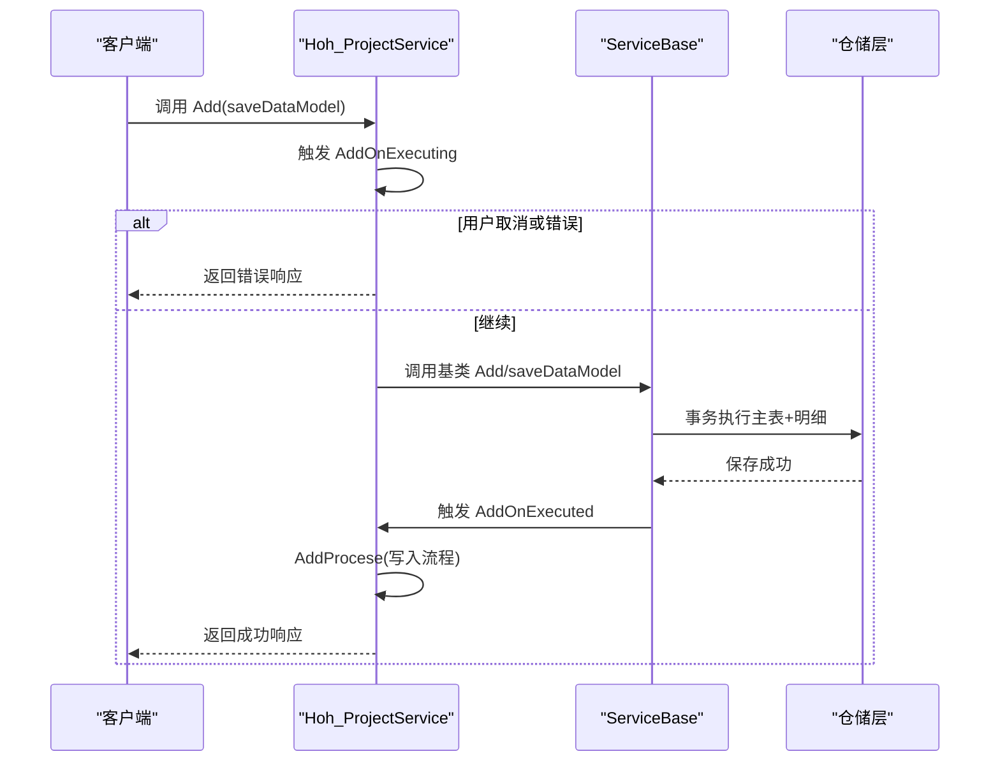
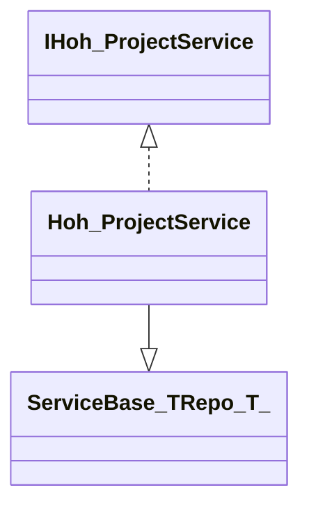
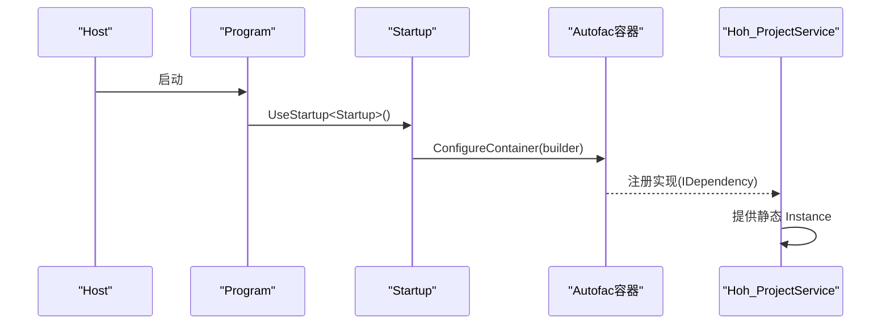
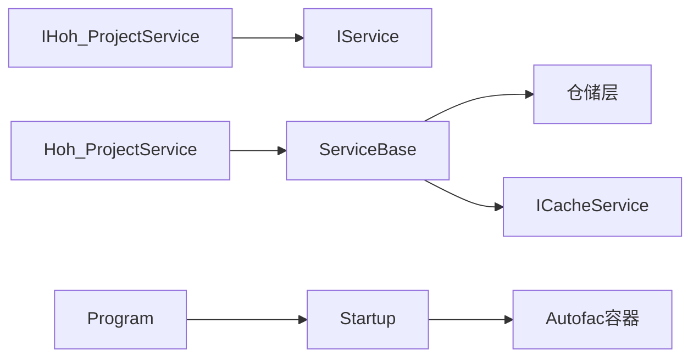

# 服务接口定义规范

<cite>
**本文引用的文件**
- [IServices.cs](file://VolPro.Core/BaseInterface/IServices.cs)
- [IService.cs](file://VolPro.Core/BaseProvider/IService.cs)
- [ServiceBase.cs](file://VolPro.Core/BaseProvider/ServiceBase.cs)
- [IHoh_ProjectService.cs](file://Hncdi.HeatOfHydration/IServices/Hoh/IHoh_ProjectService.cs)
- [IHncdi_ProjectService.cs](file://Hncdi.HeatOfHydration/IServices/Project/IHncdi_ProjectService.cs)
- [Hoh_ProjectService.cs](file://Hncdi.HeatOfHydration/Services/Hoh/Hoh_ProjectService.cs)
- [Program.cs](file://VolPro.WebApi/Program.cs)
- [Startup.cs](file://VolPro.WebApi/Startup.cs)
- [AutofacContainerModule.cs](file://VolPro.Core/Extensions/AutofacManager/AutofacContainerModule.cs)
</cite>

## 目录
1. [引言](#引言)
2. [项目结构](#项目结构)
3. [核心组件](#核心组件)
4. [架构总览](#架构总览)
5. [详细组件分析](#详细组件分析)
6. [依赖分析](#依赖分析)
7. [性能考虑](#性能考虑)
8. [故障排查指南](#故障排查指南)
9. [结论](#结论)
10. [附录](#附录)

## 引言
本规范面向“水化热平台”的服务层接口设计，旨在统一业务服务接口的命名约定、职责划分、参数设计与扩展点，明确接口与实现类的对应关系，并给出依赖注入配置示例。同时，文档阐述事件委托（如 AddOnExecuting、ExportOnExecuting 等）的使用模式与回调机制，以及接口版本管理与向后兼容策略。

## 项目结构
- 接口层位于 Hncdi.HeatOfHydration/IServices 下，按业务域分组（如 Hoh、Project），每个领域以 IHoh_*Service.cs、IHncdi_*Service.cs 等命名。
- 实现层位于 Hncdi.HeatOfHydration/Services 下，采用 ServiceBase<TRepo, T> 抽象基类，实现通用 CRUD、分页、导入导出、工作流等能力。
- 核心抽象接口 IService<T> 定义了标准服务契约；IServices 为空标记接口，用于统一服务接口的命名空间与识别。
- WebApi 层通过 Startup.cs 和 Program.cs 配置依赖注入容器（Autofac）与运行环境。

**图表来源**
- [IHoh_ProjectService.cs:1-13](file://Hncdi.HeatOfHydration/IServices/Hoh/IHoh_ProjectService.cs#L1-L13)
- [IHncdi_ProjectService.cs:1-13](file://Hncdi.HeatOfHydration/IServices/Project/IHncdi_ProjectService.cs#L1-L13)
- [Hoh_ProjectService.cs:1-24](file://Hncdi.HeatOfHydration/Services/Hoh/Hoh_ProjectService.cs#L1-L24)
- [IService.cs:1-165](file://VolPro.Core/BaseProvider/IService.cs#L1-L165)
- [IServices.cs:1-11](file://VolPro.Core/BaseInterface/IServices.cs#L1-L11)
- [ServiceBase.cs:1-200](file://VolPro.Core/BaseProvider/ServiceBase.cs#L1-L200)
- [Program.cs:1-39](file://VolPro.WebApi/Program.cs#L1-L39)
- [Startup.cs:214-307](file://VolPro.WebApi/Startup.cs#L214-L307)

**章节来源**
- [IHoh_ProjectService.cs:1-13](file://Hncdi.HeatOfHydration/IServices/Hoh/IHoh_ProjectService.cs#L1-L13)
- [IHncdi_ProjectService.cs:1-13](file://Hncdi.HeatOfHydration/IServices/Project/IHncdi_ProjectService.cs#L1-L13)
- [Hoh_ProjectService.cs:1-24](file://Hncdi.HeatOfHydration/Services/Hoh/Hoh_ProjectService.cs#L1-L24)
- [IService.cs:1-165](file://VolPro.Core/BaseProvider/IService.cs#L1-L165)
- [IServices.cs:1-11](file://VolPro.Core/BaseInterface/IServices.cs#L1-L11)
- [ServiceBase.cs:1-200](file://VolPro.Core/BaseProvider/ServiceBase.cs#L1-L200)
- [Program.cs:1-39](file://VolPro.WebApi/Program.cs#L1-L39)
- [Startup.cs:214-307](file://VolPro.WebApi/Startup.cs#L214-L307)

## 核心组件
- IServices：空标记接口，用于标识服务接口命名空间与统一识别。
- IService<T>：泛型服务接口，定义标准方法族，包括分页查询、详情加载、上传/下载模板、导入、导出、新增、更新、删除、审核/反审、工作流提交与重启、实体验证、映射等。
- ServiceBase<TRepo, T>：抽象基类，实现 IService<T> 的通用逻辑，包括分页查询、导入导出、事务处理、雪花ID生成、多租户过滤、权限字段过滤、工作流集成等。
- 业务服务接口：IHoh_ProjectService、IHncdi_ProjectService 等，继承 IService<T> 并标注为部分接口，便于代码生成器与手写扩展共存。
- 业务服务实现：Hoh_ProjectService 等，继承 ServiceBase<TRepo, T>，实现具体业务逻辑，并通过 IDependency 标识参与依赖注入。

**章节来源**
- [IServices.cs:1-11](file://VolPro.Core/BaseInterface/IServices.cs#L1-L11)
- [IService.cs:1-165](file://VolPro.Core/BaseProvider/IService.cs#L1-L165)
- [ServiceBase.cs:1-200](file://VolPro.Core/BaseProvider/ServiceBase.cs#L1-L200)
- [IHoh_ProjectService.cs:1-13](file://Hncdi.HeatOfHydration/IServices/Hoh/IHoh_ProjectService.cs#L1-L13)
- [IHncdi_ProjectService.cs:1-13](file://Hncdi.HeatOfHydration/IServices/Project/IHncdi_ProjectService.cs#L1-L13)
- [Hoh_ProjectService.cs:1-24](file://Hncdi.HeatOfHydration/Services/Hoh/Hoh_ProjectService.cs#L1-L24)

## 架构总览
服务层采用“接口 + 抽象基类 + 具体实现 + 依赖注入”的分层设计，接口负责契约定义，抽象基类负责通用能力，实现类聚焦业务细节，WebApi 层负责容器装配与运行时配置。

**图表来源**
- [IService.cs:1-165](file://VolPro.Core/BaseProvider/IService.cs#L1-L165)
- [ServiceBase.cs:1-200](file://VolPro.Core/BaseProvider/ServiceBase.cs#L1-L200)
- [IHoh_ProjectService.cs:1-13](file://Hncdi.HeatOfHydration/IServices/Hoh/IHoh_ProjectService.cs#L1-L13)
- [Hoh_ProjectService.cs:1-24](file://Hncdi.HeatOfHydration/Services/Hoh/Hoh_ProjectService.cs#L1-L24)

## 详细组件分析

### 接口设计原则与命名约定
- 命名规范
  - 接口以 I 开头，采用 IHoh_*Service.cs 或 IHncdi_*Service.cs 的形式，清晰区分业务域。
  - 实现类以 Hoh_*Service.cs 或 Hncdi_*Service.cs 的形式，部分实现通过 partial 文件与接口协同。
- 继承关系
  - 业务接口继承 IService<T>，其中 T 为对应实体类型。
  - 业务实现类继承 ServiceBase<TRepo, T>，并实现 IDependency 以便容器注册。
- 扩展点
  - 通过 partial 文件在不破坏代码生成器产物的前提下扩展实现。
  - 通过虚方法与事件委托（见下节）提供横切能力注入点。

**章节来源**
- [IHoh_ProjectService.cs:1-13](file://Hncdi.HeatOfHydration/IServices/Hoh/IHoh_ProjectService.cs#L1-L13)
- [IHncdi_ProjectService.cs:1-13](file://Hncdi.HeatOfHydration/IServices/Project/IHncdi_ProjectService.cs#L1-L13)
- [Hoh_ProjectService.cs:1-24](file://Hncdi.HeatOfHydration/Services/Hoh/Hoh_ProjectService.cs#L1-L24)

### 方法职责划分与参数设计
- 分页查询
  - 方法：GetPageData(PageDataOptions)
  - 职责：根据查询条件、排序、分页、多租户与权限字段过滤生成 PageGridData<T> 结果集。
  - 参数：PageDataOptions 包含页码、行数、排序字段、排序方向、过滤条件、导出标志、列集合等。
- 详情加载
  - 方法：GetDetailPage(PageDataOptions)
  - 职责：支持二级/三级明细表的动态查询与统计汇总。
- 上传/下载模板
  - 方法：Upload(files)、DownLoadTemplate()
  - 职责：文件上传与模板下载，模板列由系统配置与忽略字段控制。
- 导入
  - 方法：Import(files)
  - 职责：Excel 解析、数据校验、雪花ID生成、多租户值设置、默认值填充、事务落库、导入回调。
- 导出
  - 方法：Export(PageDataOptions)
  - 职责：基于分页查询结果导出 Excel，支持导出列定制与权限字段过滤。
- 新增/更新/删除
  - 方法：Add/AddEntity/Add<TDetail>、Update、Del
  - 职责：支持主从明细、一对多、三级明细、事务、雪花ID、默认值、逻辑删除字段处理。
- 审核/反审/工作流
  - 方法：Audit、AntiAudit、RestartWorkFlowAudit、SubmitWorkFlowAudit
  - 职责：审批状态变更、流程提交与重启、流程回调。
- 实体验证与映射
  - 方法：ApiValidate、ApiValidateInput<TInput>、MapToEntity、MapValueToEntity
  - 职责：业务参数校验、输入对象校验、实体/字典映射。

**章节来源**
- [IService.cs:1-165](file://VolPro.Core/BaseProvider/IService.cs#L1-L165)
- [ServiceBase.cs:285-652](file://VolPro.Core/BaseProvider/ServiceBase.cs#L285-L652)

### 标准化模式：GetPageData、Add、Export 等
- GetPageData 标准签名
  - 输入：PageDataOptions（过滤、排序、分页、导出、列集合）
  - 输出：PageGridData<T>（rows、total、summary）
  - 关键行为：多租户过滤、权限字段过滤、逻辑删除过滤、排序生成、统计汇总。
- Add 标准签名
  - 输入：SaveModel（主表数据、明细集合、数据版本字段）
  - 输出：WebResponseContent（状态、消息、数据）
  - 关键行为：雪花ID/UUID生成、默认值填充、事务、明细插入、流程写入。
- Export 标准签名
  - 输入：PageDataOptions（导出标志开启）
  - 输出：WebResponseContent（文件路径）
  - 关键行为：导出列定制、权限字段合并、忽略列处理、文件保存。

**章节来源**
- [IService.cs:25-39](file://VolPro.Core/BaseProvider/IService.cs#L25-L39)
- [ServiceBase.cs:285-652](file://VolPro.Core/BaseProvider/ServiceBase.cs#L285-L652)

### 事件委托与回调机制
- 常见事件委托
  - AddOnExecuting、AddOnExecuted：新增前后回调，可用于参数校验、日志记录、流程前置检查。
  - ImportOnExecuting、ImportOnExecuted：导入前后回调，支持自定义处理与二次落库。
  - ExportOnExecuting：导出前回调，支持动态调整导出列与忽略列。
  - AddWorkFlowExecuting、AddWorkFlowExecuted：新增流程写入前/后回调。
  - GetPageDataOnExecuted：分页查询完成后回调，支持结果二次加工。
- 回调执行顺序
  - 新增：AddOnExecuting → 事务执行 → AddOnExecuted → 流程写入。
  - 导入：ImportOnExecuting → 数据解析与校验 → ImportOnExecuted（可选二次处理）。
  - 导出：ExportOnExecuting → 生成文件 → 返回路径。
- 使用建议
  - 在实现类中通过重写虚方法或在构造/注册阶段注入委托，确保横切关注点与业务解耦。

**图表来源**
- [ServiceBase.cs:659-856](file://VolPro.Core/BaseProvider/ServiceBase.cs#L659-L856)
- [Hoh_ProjectService.cs:1-24](file://Hncdi.HeatOfHydration/Services/Hoh/Hoh_ProjectService.cs#L1-L24)

**章节来源**
- [ServiceBase.cs:587-604](file://VolPro.Core/BaseProvider/ServiceBase.cs#L587-L604)
- [ServiceBase.cs:621-625](file://VolPro.Core/BaseProvider/ServiceBase.cs#L621-L625)
- [ServiceBase.cs:661-665](file://VolPro.Core/BaseProvider/ServiceBase.cs#L661-L665)
- [ServiceBase.cs:896-910](file://VolPro.Core/BaseProvider/ServiceBase.cs#L896-L910)

### 接口与实现类的对应关系
- IHoh_ProjectService ↔ Hoh_ProjectService
  - 接口：定义业务服务契约。
  - 实现：继承 ServiceBase<Hoh_Project, IHoh_ProjectRepository>，实现 IDependency，提供静态 Instance 通过容器获取实例。
- 其他业务接口（如 IHncdi_ProjectService）遵循相同模式。

**图表来源**
- [IHoh_ProjectService.cs:1-13](file://Hncdi.HeatOfHydration/IServices/Hoh/IHoh_ProjectService.cs#L1-L13)
- [Hoh_ProjectService.cs:1-24](file://Hncdi.HeatOfHydration/Services/Hoh/Hoh_ProjectService.cs#L1-L24)
- [ServiceBase.cs:31-38](file://VolPro.Core/BaseProvider/ServiceBase.cs#L31-L38)

**章节来源**
- [IHoh_ProjectService.cs:1-13](file://Hncdi.HeatOfHydration/IServices/Hoh/IHoh_ProjectService.cs#L1-L13)
- [Hoh_ProjectService.cs:1-24](file://Hncdi.HeatOfHydration/Services/Hoh/Hoh_ProjectService.cs#L1-L24)

### 依赖注入配置示例
- 容器工厂
  - Program.cs 中使用 AutofacServiceProviderFactory，启用 Autofac 容器。
- 容器注册
  - Startup.cs 的 ConfigureContainer 中通过 Services.AddModule(builder, Configuration) 完成模块化注册。
  - 业务服务通过实现 IDependency 自动纳入容器。
- 获取服务
  - 通过 AutofacContainerModule.GetService<T>() 或静态属性 Instance 获取服务实例。

**图表来源**
- [Program.cs:36-36](file://VolPro.WebApi/Program.cs#L36-L36)
- [Startup.cs:214-216](file://VolPro.WebApi/Startup.cs#L214-L216)
- [AutofacContainerModule.cs:9-12](file://VolPro.Core/Extensions/AutofacManager/AutofacContainerModule.cs#L9-L12)
- [Hoh_ProjectService.cs:19-21](file://Hncdi.HeatOfHydration/Services/Hoh/Hoh_ProjectService.cs#L19-L21)

**章节来源**
- [Program.cs:36-36](file://VolPro.WebApi/Program.cs#L36-L36)
- [Startup.cs:214-216](file://VolPro.WebApi/Startup.cs#L214-L216)
- [AutofacContainerModule.cs:9-12](file://VolPro.Core/Extensions/AutofacManager/AutofacContainerModule.cs#L9-L12)
- [Hoh_ProjectService.cs:19-21](file://Hncdi.HeatOfHydration/Services/Hoh/Hoh_ProjectService.cs#L19-L21)

### 版本管理、向后兼容与扩展点
- 版本管理
  - 通过 SaveModel.DataVersionField 支持数据版本字段注入，避免并发覆盖与历史追踪。
- 向后兼容
  - IService<T> 保持稳定签名，新增能力通过虚方法与事件委托扩展，不破坏既有实现。
  - 多租户、权限字段过滤、逻辑删除等通用能力在 ServiceBase 中集中实现，降低业务侧改动成本。
- 扩展点
  - 通过重写虚方法（如 AddMultipleDetail、InsertNav 等）扩展复杂主从明细场景。
  - 通过事件委托注入横切逻辑（导入/导出/新增前后回调）。

**章节来源**
- [ServiceBase.cs:688-692](file://VolPro.Core/BaseProvider/ServiceBase.cs#L688-L692)
- [ServiceBase.cs:964-1055](file://VolPro.Core/BaseProvider/ServiceBase.cs#L964-L1055)

## 依赖分析
- 接口到实现的依赖
  - 业务接口仅依赖 IService<T>，实现类依赖 ServiceBase<TRepo, T>，形成清晰的层次依赖。
- 横切依赖
  - ServiceBase 依赖 Autofac 容器获取 CacheContext、HttpContext，依赖仓储层执行数据库操作。
- WebApi 依赖
  - WebApi 通过 Startup.cs 注册容器与中间件，Program.cs 指定容器工厂。

**图表来源**
- [IHoh_ProjectService.cs:1-13](file://Hncdi.HeatOfHydration/IServices/Hoh/IHoh_ProjectService.cs#L1-L13)
- [Hoh_ProjectService.cs:1-24](file://Hncdi.HeatOfHydration/Services/Hoh/Hoh_ProjectService.cs#L1-L24)
- [ServiceBase.cs:39-53](file://VolPro.Core/BaseProvider/ServiceBase.cs#L39-L53)
- [Program.cs:36-36](file://VolPro.WebApi/Program.cs#L36-L36)
- [Startup.cs:214-216](file://VolPro.WebApi/Startup.cs#L214-L216)

**章节来源**
- [IHoh_ProjectService.cs:1-13](file://Hncdi.HeatOfHydration/IServices/Hoh/IHoh_ProjectService.cs#L1-L13)
- [Hoh_ProjectService.cs:1-24](file://Hncdi.HeatOfHydration/Services/Hoh/Hoh_ProjectService.cs#L1-L24)
- [ServiceBase.cs:39-53](file://VolPro.Core/BaseProvider/ServiceBase.cs#L39-L53)
- [Program.cs:36-36](file://VolPro.WebApi/Program.cs#L36-L36)
- [Startup.cs:214-216](file://VolPro.WebApi/Startup.cs#L214-L216)

## 性能考虑
- 分页查询
  - 使用 IQueryable/ISugarQueryable 分页与排序，避免一次性加载全量数据。
  - 权限字段过滤在投影阶段完成，减少不必要的列传输。
- 导入导出
  - 导入采用批量写入与事务封装，导出使用 EPPlus 按需生成，避免内存峰值。
- 多租户与逻辑删除
  - 在查询阶段即应用过滤条件，减少无效数据扫描。
- 缓存与上下文
  - 通过 CacheContext 与 HttpContext 访问缓存与请求上下文，避免重复计算与 IO。

[本节为通用指导，无需特定文件来源]

## 故障排查指南
- 常见问题定位
  - 分页查询无结果：检查 PageDataOptions 的过滤条件与排序字段是否匹配实体属性。
  - 导入失败：查看 ImportOnExecuting/ImportOnExecuted 是否提前返回错误，或 Excel 列映射是否正确。
  - 新增失败：确认 AddOnExecuting 是否拦截，事务是否回滚，雪花ID/默认值是否生成。
- 日志与响应
  - ServiceBase 内部使用 Logger 记录错误堆栈，返回 WebResponseContent，便于前端统一处理。
- 工作流相关
  - 审核/反审失败：确认实体是否存在 AuditStatus 字段，流程是否已存在。

**章节来源**
- [ServiceBase.cs:500-503](file://VolPro.Core/BaseProvider/ServiceBase.cs#L500-L503)
- [ServiceBase.cs:551-555](file://VolPro.Core/BaseProvider/ServiceBase.cs#L551-L555)
- [ServiceBase.cs:918-951](file://VolPro.Core/BaseProvider/ServiceBase.cs#L918-L951)

## 结论
本规范明确了水化热平台服务接口的设计原则、命名约定与职责划分，给出了 GetPageData、Add、Export 等常用方法的标准化签名与实现要点，并通过事件委托与依赖注入提供了强大的扩展能力。结合多租户、权限字段过滤、逻辑删除与工作流集成，服务层在保证一致性的同时具备良好的可维护性与可扩展性。

## 附录
- 快速对照
  - 接口：IHoh_ProjectService、IHncdi_ProjectService
  - 实现：Hoh_ProjectService
  - 抽象：IService<T>、ServiceBase<TRepo, T>
  - 容器：Program.cs、Startup.cs、AutofacContainerModule

[本节为概览性内容，无需特定文件来源]