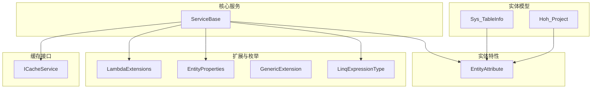
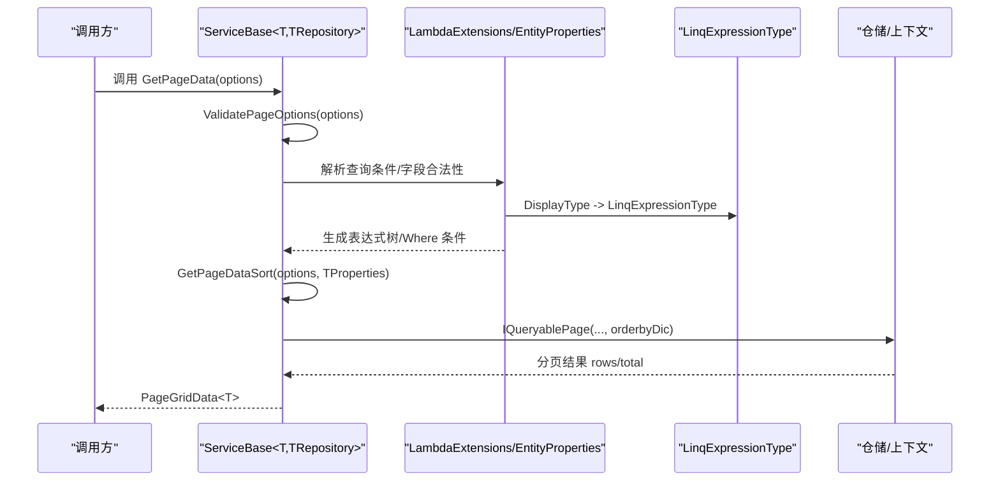
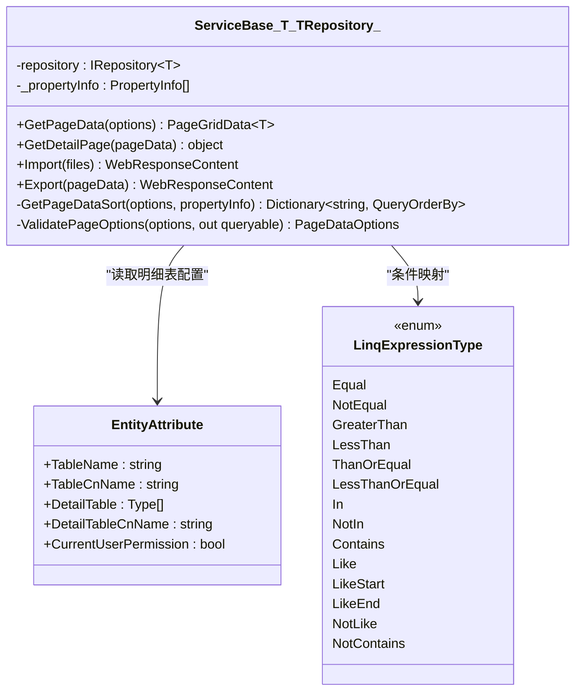
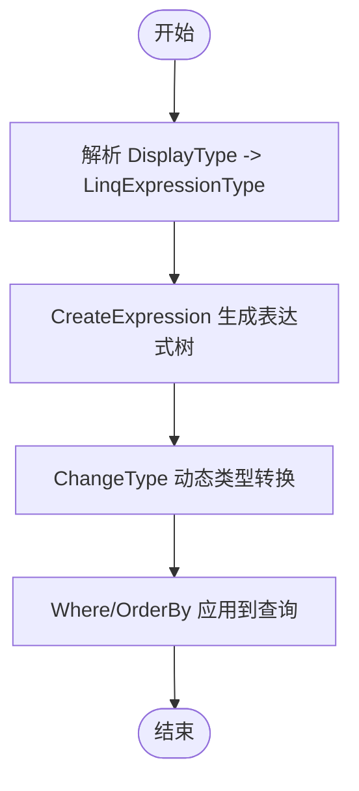
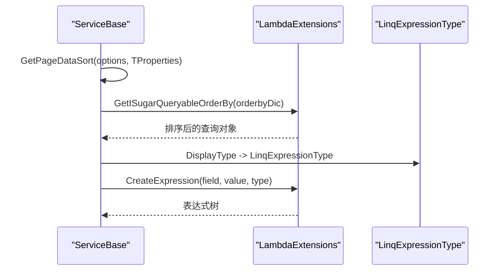
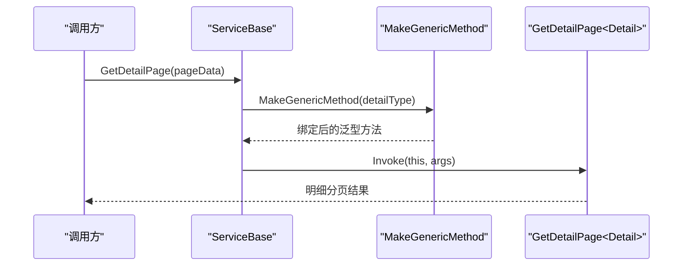
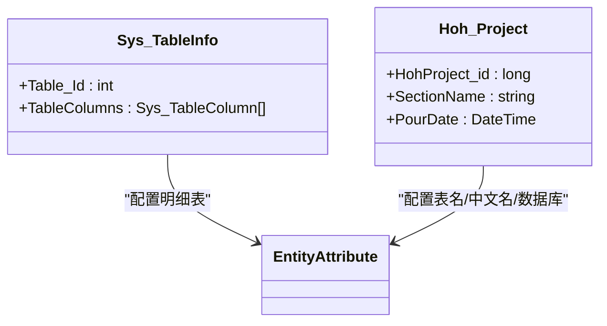
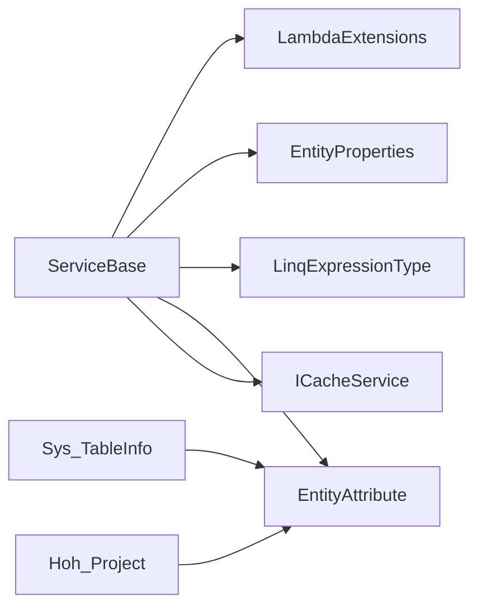

# 泛型与反射机制

<cite>
**本文引用的文件**
- [ServiceBase.cs](file://VolPro.Core/BaseProvider/ServiceBase.cs)
- [EntityAttribute.cs](file://VolPro.Entity/AttributeManager/EntityAttribute.cs)
- [LinqExpressionType.cs](file://VolPro.Core/Enums/LinqExpressionType.cs)
- [EntityProperties.cs](file://VolPro.Core/Extensions/EntityProperties.cs)
- [LambdaExtensions.cs](file://VolPro.Core/Extensions/LambdaExtensions.cs)
- [GenericExtension.cs](file://VolPro.Core/Extensions/GenericExtension.cs)
- [ICacheService.cs](file://VolPro.Core/CacheManager/IService/ICacheService.cs)
- [Sys_TableInfo.cs](file://VolPro.Entity/DomainModels/Core/Sys_TableInfo.cs)
- [Hoh_Project.cs](file://VolPro.Entity/DomainModels/Hoh/Hoh_Project.cs)
</cite>

## 目录
1. [简介](#简介)
2. [项目结构](#项目结构)
3. [核心组件](#核心组件)
4. [架构总览](#架构总览)
5. [详细组件分析](#详细组件分析)
6. [依赖关系分析](#依赖关系分析)
7. [性能考量](#性能考量)
8. [故障排查指南](#故障排查指南)
9. [结论](#结论)
10. [附录](#附录)

## 简介
本文件聚焦“水化热平台”在 VolPro.Core 与 VolPro.Entity 中的泛型与反射机制，系统阐述以下主题：
- ServiceBase 中的泛型约束与实现原理、优势与使用场景
- 反射在实体属性获取、表达式树构建与动态类型转换中的应用
- GetPageData 方法中排序字段的动态处理与 LinqExpressionType 枚举的使用
- MakeGenericMethod 等高级反射技术的应用实例
- 反射性能优化技巧与缓存策略
- EntityAttribute 特性使用场景与自定义属性扩展方法

## 项目结构
围绕“泛型与反射”的关键模块分布如下：
- 基础服务层：VolPro.Core/BaseProvider/ServiceBase.cs 提供统一的分页查询、明细表查询、导入导出、排序与表达式构建能力
- 实体特性层：VolPro.Entity/AttributeManager/EntityAttribute.cs 定义实体元信息（表名、明细表、权限等）
- 枚举与扩展：VolPro.Core/Enums/LinqExpressionType.cs、VolPro.Core/Extensions/LambdaExtensions.cs、VolPro.Core/Extensions/EntityProperties.cs、VolPro.Core/Extensions/GenericExtension.cs 提供表达式树、属性访问、类型转换与泛型工具
- 缓存接口：VolPro.Core/CacheManager/IService/ICacheService.cs 提供缓存抽象，支撑反射结果缓存

**图表来源**
- [ServiceBase.cs](file://VolPro.Core/BaseProvider/ServiceBase.cs)
- [EntityAttribute.cs](file://VolPro.Entity/AttributeManager/EntityAttribute.cs)
- [LambdaExtensions.cs](file://VolPro.Core/Extensions/LambdaExtensions.cs)
- [EntityProperties.cs](file://VolPro.Core/Extensions/EntityProperties.cs)
- [GenericExtension.cs](file://VolPro.Core/Extensions/GenericExtension.cs)
- [LinqExpressionType.cs](file://VolPro.Core/Enums/LinqExpressionType.cs)
- [ICacheService.cs](file://VolPro.Core/CacheManager/IService/ICacheService.cs)
- [Sys_TableInfo.cs](file://VolPro.Entity/DomainModels/Core/Sys_TableInfo.cs)
- [Hoh_Project.cs](file://VolPro.Entity/DomainModels/Hoh/Hoh_Project.cs)

**章节来源**
- [ServiceBase.cs](file://VolPro.Core/BaseProvider/ServiceBase.cs)
- [EntityAttribute.cs](file://VolPro.Entity/AttributeManager/EntityAttribute.cs)
- [LambdaExtensions.cs](file://VolPro.Core/Extensions/LambdaExtensions.cs)
- [EntityProperties.cs](file://VolPro.Core/Extensions/EntityProperties.cs)
- [GenericExtension.cs](file://VolPro.Core/Extensions/GenericExtension.cs)
- [LinqExpressionType.cs](file://VolPro.Core/Enums/LinqExpressionType.cs)
- [ICacheService.cs](file://VolPro.Core/CacheManager/IService/ICacheService.cs)
- [Sys_TableInfo.cs](file://VolPro.Entity/DomainModels/Core/Sys_TableInfo.cs)
- [Hoh_Project.cs](file://VolPro.Entity/DomainModels/Hoh/Hoh_Project.cs)

## 核心组件
- ServiceBase<T, TRepository>：基于泛型的服务基类，通过约束 T 与 TRepository，实现统一的分页查询、明细表查询、导入导出、排序与表达式构建；内部利用反射缓存实体属性信息，减少重复反射开销。
- EntityAttribute：实体元数据特性，支持表名、明细表、权限等配置，驱动 ServiceBase 的明细表查询与真实表名解析。
- LambdaExtensions：表达式树构建与动态类型转换的核心扩展，提供 CreateExpression、GetExpression、GetISugarQueryableOrderBy 等能力。
- EntityProperties：实体属性与类型映射扩展，提供主键识别、列类型推断、属性校验等。
- GenericExtension：泛型工具扩展，提供字典化、DataTable 转换等。
- LinqExpressionType：查询条件表达式类型枚举，统一映射 SQL 条件（等于、不等、包含、模糊等）。
- ICacheService：缓存接口，用于反射结果与表达式树的缓存。

**章节来源**
- [ServiceBase.cs](file://VolPro.Core/BaseProvider/ServiceBase.cs)
- [EntityAttribute.cs](file://VolPro.Entity/AttributeManager/EntityAttribute.cs)
- [LambdaExtensions.cs](file://VolPro.Core/Extensions/LambdaExtensions.cs)
- [EntityProperties.cs](file://VolPro.Core/Extensions/EntityProperties.cs)
- [GenericExtension.cs](file://VolPro.Core/Extensions/GenericExtension.cs)
- [LinqExpressionType.cs](file://VolPro.Core/Enums/LinqExpressionType.cs)
- [ICacheService.cs](file://VolPro.Core/CacheManager/IService/ICacheService.cs)

## 架构总览
ServiceBase 将“泛型约束 + 反射缓存 + 表达式树 + 枚举映射”整合为统一的数据访问与查询入口，贯穿分页、排序、过滤、明细表联动与导入导出流程。

**图表来源**
- [ServiceBase.cs](file://VolPro.Core/BaseProvider/ServiceBase.cs)
- [LambdaExtensions.cs](file://VolPro.Core/Extensions/LambdaExtensions.cs)
- [EntityProperties.cs](file://VolPro.Core/Extensions/EntityProperties.cs)
- [LinqExpressionType.cs](file://VolPro.Core/Enums/LinqExpressionType.cs)

## 详细组件分析

### ServiceBase 中的泛型约束与实现原理
- 泛型约束
  - T 必须继承 BaseEntity 并可 new，确保实体具备统一的基础行为与主键识别能力
  - TRepository 必须实现 IRepository<T>，保证仓储契约一致
- 反射缓存
  - TProperties 属性缓存 typeof(T).GetProperties() 结果，避免重复反射带来的性能损耗
- 明细表查询
  - 通过 GetRealDetailType 与 EntityAttribute 的 DetailTable 获取真实明细类型，结合 MakeGenericMethod 动态调用 GetDetailPage<Detail>，实现跨实体的明细联动查询
- 排序字段动态处理
  - GetPageDataSort 根据 options.Sort/Order 与实体属性合法性生成 Dictionary<string, QueryOrderBy>，若无显式排序则回退到主键或配置的创建时间字段
- 表达式树与条件构建
  - ValidatePageOptions 遍历查询参数，结合 LambdaExtensions.CreateExpression 与 LinqExpressionType 枚举生成 Where 条件
- 导入导出与权限过滤
  - 导出时通过 FilterQueryableAuthFields 使用 MemberInitExpression 仅选择授权字段，降低网络与序列化开销

**图表来源**
- [ServiceBase.cs](file://VolPro.Core/BaseProvider/ServiceBase.cs)
- [EntityAttribute.cs](file://VolPro.Entity/AttributeManager/EntityAttribute.cs)
- [LinqExpressionType.cs](file://VolPro.Core/Enums/LinqExpressionType.cs)

**章节来源**
- [ServiceBase.cs](file://VolPro.Core/BaseProvider/ServiceBase.cs)
- [EntityAttribute.cs](file://VolPro.Entity/AttributeManager/EntityAttribute.cs)
- [LinqExpressionType.cs](file://VolPro.Core/Enums/LinqExpressionType.cs)

### 反射机制在实体属性获取、表达式树构建与动态类型转换中的应用
- 实体属性获取
  - EntityProperties 提供 GetKeyProperty、GetKeyName、IsKey 等方法，统一主键识别与列类型推断
  - ServiceBase 中 TProperties 缓存属性数组，配合 EntityProperties 的扩展方法提升查询效率
- 表达式树构建
  - LambdaExtensions.CreateExpression 支持多种 LinqExpressionType，动态生成表达式树（含 In/NotIn、Contains/StartsWith/EndsWith、Like/NotLike 等），并处理 DateTime 边界与 Nullable 场景
  - GetISugarQueryableOrderBy 将 Dictionary<string, QueryOrderBy> 转换为链式排序
- 动态类型转换
  - CreateExpression 内部使用 ChangeType 进行目标类型转换，确保表达式树常量与属性类型一致
  - 对字符串值进行安全转义与边界修正（如日期范围）

**图表来源**
- [LambdaExtensions.cs](file://VolPro.Core/Extensions/LambdaExtensions.cs)
- [EntityProperties.cs](file://VolPro.Core/Extensions/EntityProperties.cs)

**章节来源**
- [LambdaExtensions.cs](file://VolPro.Core/Extensions/LambdaExtensions.cs)
- [EntityProperties.cs](file://VolPro.Core/Extensions/EntityProperties.cs)

### GetPageData 方法中排序字段的动态处理与 LinqExpressionType 枚举的使用
- 排序字段动态处理
  - 若存在自定义 OrderByExpression 或 options.Sort/Order，优先采用；否则根据主键类型与配置回退到主键或创建时间字段
  - 支持多字段排序，通过 GetISugarQueryableOrderBy 组合多个排序条件
- LinqExpressionType 枚举
  - DisplayType 通过 GetDbCondition 映射为 LinqExpressionType，再由 CreateExpression 生成表达式树
  - 枚举覆盖相等、不等、范围、包含/模糊、前缀/后缀等多种条件

**图表来源**
- [ServiceBase.cs](file://VolPro.Core/BaseProvider/ServiceBase.cs)
- [LambdaExtensions.cs](file://VolPro.Core/Extensions/LambdaExtensions.cs)
- [LinqExpressionType.cs](file://VolPro.Core/Enums/LinqExpressionType.cs)

**章节来源**
- [ServiceBase.cs](file://VolPro.Core/BaseProvider/ServiceBase.cs)
- [LambdaExtensions.cs](file://VolPro.Core/Extensions/LambdaExtensions.cs)
- [LinqExpressionType.cs](file://VolPro.Core/Enums/LinqExpressionType.cs)

### 高级反射技术：MakeGenericMethod 的应用实例
- 明细表查询
  - ServiceBase.GetDetailPage 通过反射定位并调用受保护的 GetDetailPage<Detail>，实现跨实体的明细联动查询
- 动态表达式生成
  - LambdaExtensions.CreateExpression 在处理 In/NotIn 时，通过 MakeGenericMethod 生成针对具体字段类型的 Contains 表达式，提升类型安全与性能

**图表来源**
- [ServiceBase.cs](file://VolPro.Core/BaseProvider/ServiceBase.cs)
- [LambdaExtensions.cs](file://VolPro.Core/Extensions/LambdaExtensions.cs)

**章节来源**
- [ServiceBase.cs](file://VolPro.Core/BaseProvider/ServiceBase.cs)
- [LambdaExtensions.cs](file://VolPro.Core/Extensions/LambdaExtensions.cs)

### EntityAttribute 特性的使用场景与自定义属性扩展方法
- 使用场景
  - Sys_TableInfo 通过 EntityAttribute 指定明细表类型，驱动 ServiceBase 的明细联动查询
  - Hoh_Project 使用 EntityAttribute 指定真实表名、中文名、数据库上下文与明细表中文名，便于统一展示与权限控制
- 自定义属性扩展
  - EntityProperties 提供 ContainsCustomAttributes、GetTypeCustomAttributes 等方法，支持对实体属性上的自定义特性进行检测与读取
  - EntityProperties.GetColumType/GetColumnType 提供属性到数据库类型的映射，支持 ColumnAttribute 与 DisplayFormatAttribute 等

**图表来源**
- [Sys_TableInfo.cs](file://VolPro.Entity/DomainModels/Core/Sys_TableInfo.cs)
- [Hoh_Project.cs](file://VolPro.Entity/DomainModels/Hoh/Hoh_Project.cs)
- [EntityAttribute.cs](file://VolPro.Entity/AttributeManager/EntityAttribute.cs)

**章节来源**
- [Sys_TableInfo.cs](file://VolPro.Entity/DomainModels/Core/Sys_TableInfo.cs)
- [Hoh_Project.cs](file://VolPro.Entity/DomainModels/Hoh/Hoh_Project.cs)
- [EntityAttribute.cs](file://VolPro.Entity/AttributeManager/EntityAttribute.cs)
- [EntityProperties.cs](file://VolPro.Core/Extensions/EntityProperties.cs)

## 依赖关系分析
- ServiceBase 依赖
  - LambdaExtensions：表达式树与排序构建
  - EntityProperties：实体属性与类型映射
  - LinqExpressionType：条件类型枚举
  - EntityAttribute：实体元信息
  - ICacheService：缓存抽象（用于反射结果缓存）
- 实体模型依赖
  - Sys_TableInfo、Hoh_Project 通过 EntityAttribute 配置明细表与表名，驱动 ServiceBase 的动态行为

**图表来源**
- [ServiceBase.cs](file://VolPro.Core/BaseProvider/ServiceBase.cs)
- [LambdaExtensions.cs](file://VolPro.Core/Extensions/LambdaExtensions.cs)
- [EntityProperties.cs](file://VolPro.Core/Extensions/EntityProperties.cs)
- [LinqExpressionType.cs](file://VolPro.Core/Enums/LinqExpressionType.cs)
- [EntityAttribute.cs](file://VolPro.Entity/AttributeManager/EntityAttribute.cs)
- [ICacheService.cs](file://VolPro.Core/CacheManager/IService/ICacheService.cs)
- [Sys_TableInfo.cs](file://VolPro.Entity/DomainModels/Core/Sys_TableInfo.cs)
- [Hoh_Project.cs](file://VolPro.Entity/DomainModels/Hoh/Hoh_Project.cs)

**章节来源**
- [ServiceBase.cs](file://VolPro.Core/BaseProvider/ServiceBase.cs)
- [LambdaExtensions.cs](file://VolPro.Core/Extensions/LambdaExtensions.cs)
- [EntityProperties.cs](file://VolPro.Core/Extensions/EntityProperties.cs)
- [LinqExpressionType.cs](file://VolPro.Core/Enums/LinqExpressionType.cs)
- [EntityAttribute.cs](file://VolPro.Entity/AttributeManager/EntityAttribute.cs)
- [ICacheService.cs](file://VolPro.Core/CacheManager/IService/ICacheService.cs)
- [Sys_TableInfo.cs](file://VolPro.Entity/DomainModels/Core/Sys_TableInfo.cs)
- [Hoh_Project.cs](file://VolPro.Entity/DomainModels/Hoh/Hoh_Project.cs)

## 性能考量
- 反射缓存
  - ServiceBase 中 TProperties 缓存实体属性数组，避免重复反射
  - 可结合 ICacheService 将常用表达式树、类型映射与主键信息缓存，减少重复计算
- 表达式树优化
  - 使用 LambdaExtensions.GetISugarQueryableOrderBy 组合多字段排序，避免多次遍历
  - 对 In/NotIn 使用 Contains 表达式，减少复杂条件分支
- 数据库访问
  - ValidatePageOptions 中先做字段合法性校验与类型转换，再生成 Where 条件，减少无效查询
- 导出与权限
  - FilterQueryableAuthFields 使用 MemberInitExpression 仅投影授权字段，降低网络与序列化成本

[本节为通用性能建议，无需特定文件引用]

## 故障排查指南
- 排序字段无效
  - 检查 options.Sort 是否存在于实体属性中；若不存在，确认回退逻辑（主键或创建时间）是否符合预期
- 查询条件不生效
  - 确认 DisplayType 与 LinqExpressionType 的映射是否正确；检查 CreateExpression 的类型转换与边界处理（如 DateTime）
- 明细表查询失败
  - 检查实体是否正确标注 EntityAttribute 的 DetailTable；确认 MakeGenericMethod 绑定的类型与实际实体一致
- 导入导出异常
  - 校验导入模板列与忽略列配置；导出时确认权限字段与忽略字段的合并逻辑

**章节来源**
- [ServiceBase.cs](file://VolPro.Core/BaseProvider/ServiceBase.cs)
- [LambdaExtensions.cs](file://VolPro.Core/Extensions/LambdaExtensions.cs)
- [EntityProperties.cs](file://VolPro.Core/Extensions/EntityProperties.cs)

## 结论
通过 ServiceBase 的泛型约束与反射缓存、LambdaExtensions 的表达式树构建与类型转换、EntityAttribute 的元信息配置以及 LinqExpressionType 的条件映射，平台实现了高度可复用的数据访问层。结合缓存与表达式树优化，可在保证灵活性的同时显著提升性能与可维护性。

[本节为总结性内容，无需特定文件引用]

## 附录
- 关键 API 与路径参考
  - ServiceBase.GetPageData：[ServiceBase.cs](file://VolPro.Core/BaseProvider/ServiceBase.cs)
  - ServiceBase.GetDetailPage：[ServiceBase.cs](file://VolPro.Core/BaseProvider/ServiceBase.cs)
  - LambdaExtensions.CreateExpression：[LambdaExtensions.cs](file://VolPro.Core/Extensions/LambdaExtensions.cs)
  - LambdaExtensions.GetISugarQueryableOrderBy：[LambdaExtensions.cs](file://VolPro.Core/Extensions/LambdaExtensions.cs)
  - EntityProperties.GetColumType/GetKeyProperty：[EntityProperties.cs](file://VolPro.Core/Extensions/EntityProperties.cs)
  - LinqExpressionType 枚举：[LinqExpressionType.cs](file://VolPro.Core/Enums/LinqExpressionType.cs)
  - EntityAttribute 特性：[EntityAttribute.cs](file://VolPro.Entity/AttributeManager/EntityAttribute.cs)
  - ICacheService 接口：[ICacheService.cs](file://VolPro.Core/CacheManager/IService/ICacheService.cs)

[本节为参考清单，无需特定文件引用]