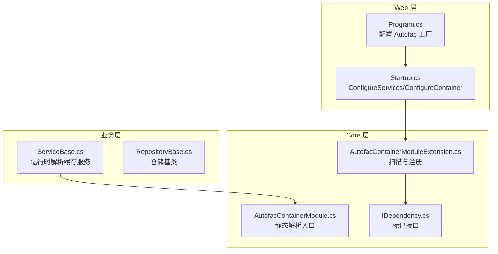
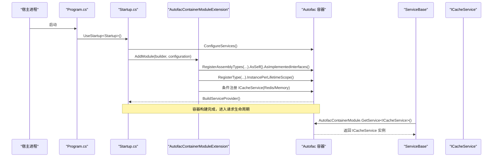
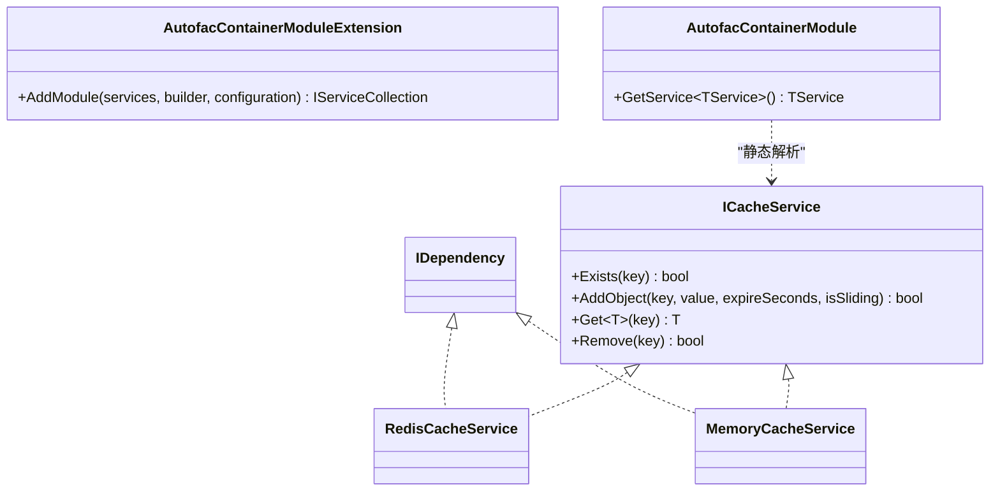
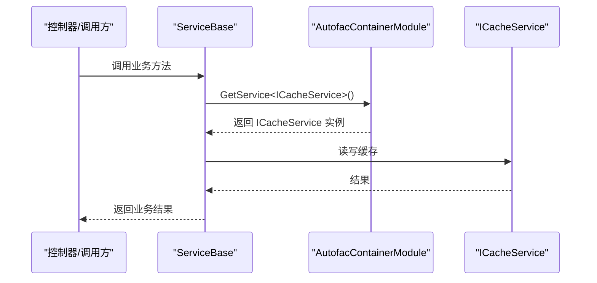
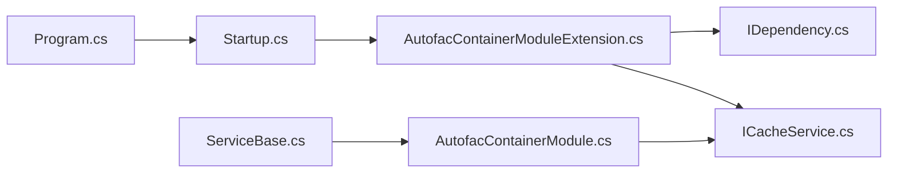

# 依赖注入设计

<cite>
**本文引用的文件**
- [AutofacContainerModule.cs](file://VolPro.Core/Extensions/AutofacManager/AutofacContainerModule.cs)
- [AutofacContainerModuleExtension.cs](file://VolPro.Core/Extensions/AutofacManager/AutofacContainerModuleExtension.cs)
- [IDependency.cs](file://VolPro.Core/Extensions/AutofacManager/IDependency.cs)
- [Program.cs](file://VolPro.WebApi/Program.cs)
- [Startup.cs](file://VolPro.WebApi/Startup.cs)
- [RepositoryBase.cs](file://VolPro.Core/BaseProvider/RepositoryBase.cs)
- [ServiceBase.cs](file://VolPro.Core/BaseProvider/ServiceBase.cs)
- [ICacheService.cs](file://VolPro.Core/CacheManager/IService/ICacheService.cs)
</cite>

## 目录
1. [引言](#引言)
2. [项目结构](#项目结构)
3. [核心组件](#核心组件)
4. [架构总览](#架构总览)
5. [详细组件分析](#详细组件分析)
6. [依赖关系分析](#依赖关系分析)
7. [性能考量](#性能考量)
8. [故障排查指南](#故障排查指南)
9. [结论](#结论)
10. [附录](#附录)

## 引言
本设计文档聚焦于水化热平台的依赖注入（DI）体系，基于 Autofac 容器在 ASP.NET Core 中的集成与扩展，系统阐述服务注册策略、生命周期管理、循环依赖处理、配置图与服务解析流程，并总结最佳实践、性能优化与调试技巧。文档旨在帮助开发者在分层架构中通过 DI 实现松耦合与高可测试性。

## 项目结构
- 平台采用多项目分层组织，Web 层负责启动与中间件装配，Core 层承载基础设施、通用能力与 DI 扩展，业务模块（如水化热平台）位于独立命名空间下。
- DI 关键入口：
  - Web 启动：Program.cs 指定 Autofac 作为 ServiceProviderFactory。
  - 容器扩展：Startup.cs 的 ConfigureContainer 注册模块；AutofacContainerModuleExtension 负责扫描与注册。
  - 服务解析：AutofacContainerModule 提供静态便捷解析入口；ServiceBase 在运行时按需解析服务。

**图表来源**
- [Program.cs:24-36](file://VolPro.WebApi/Program.cs#L24-L36)
- [Startup.cs:60-213](file://VolPro.WebApi/Startup.cs#L60-L213)
- [AutofacContainerModuleExtension.cs:36-115](file://VolPro.Core/Extensions/AutofacManager/AutofacContainerModuleExtension.cs#L36-L115)
- [AutofacContainerModule.cs:9-12](file://VolPro.Core/Extensions/AutofacManager/AutofacContainerModule.cs#L9-L12)
- [IDependency.cs:9-11](file://VolPro.Core/Extensions/AutofacManager/IDependency.cs#L9-L11)
- [ServiceBase.cs:39-44](file://VolPro.Core/BaseProvider/ServiceBase.cs#L39-L44)

**章节来源**
- [Program.cs:17-36](file://VolPro.WebApi/Program.cs#L17-L36)
- [Startup.cs:60-307](file://VolPro.WebApi/Startup.cs#L60-L307)

## 核心组件
- Autofac 容器工厂与宿主集成
  - Program.cs 使用 UseServiceProviderFactory(new AutofacServiceProviderFactory()) 将 Autofac 注入 ASP.NET Core 生命周期。
- 容器模块扩展
  - AutofacContainerModuleExtension.AddModule 负责：
    - 通过 DependencyContext.Default.RuntimeLibraries 扫描项目程序集；
    - 过滤非服务型程序集并加载；
    - 通过 RegisterAssemblyTypes 按照 IDependency 标记接口注册实现类；
    - 统一 AsSelf().AsImplementedInterfaces() 并设置 InstancePerLifetimeScope；
    - 注册 UserContext、ActionObserver、ObjectModelValidatorState 等；
    - 根据配置选择 Redis 或 Memory 缓存实现并注册 ICacheService；
    - 初始化 Dapper 类型处理器与 DbCache。
- 静态解析入口
  - AutofacContainerModule.GetService<T> 提供运行时静态解析能力，ServiceBase 通过该入口获取 ICacheService。
- 生命周期与作用域
  - 大多数服务注册为 InstancePerLifetimeScope，确保每个请求/工作单元拥有独立实例，避免状态污染。
- 循环依赖处理
  - 通过接口注入与延迟解析（如静态解析入口）规避构造函数循环依赖；仓储与服务间通过接口解耦。

**章节来源**
- [AutofacContainerModuleExtension.cs:36-115](file://VolPro.Core/Extensions/AutofacManager/AutofacContainerModuleExtension.cs#L36-L115)
- [AutofacContainerModule.cs:9-12](file://VolPro.Core/Extensions/AutofacManager/AutofacContainerModule.cs#L9-L12)
- [IDependency.cs:9-11](file://VolPro.Core/Extensions/AutofacManager/IDependency.cs#L9-L11)
- [ServiceBase.cs:39-44](file://VolPro.Core/BaseProvider/ServiceBase.cs#L39-L44)

## 架构总览
下图展示 DI 在启动阶段的服务注册与运行阶段的服务解析流程。

**图表来源**
- [Program.cs:24-36](file://VolPro.WebApi/Program.cs#L24-L36)
- [Startup.cs:60-213](file://VolPro.WebApi/Startup.cs#L60-L213)
- [AutofacContainerModuleExtension.cs:36-115](file://VolPro.Core/Extensions/AutofacManager/AutofacContainerModuleExtension.cs#L36-L115)
- [AutofacContainerModule.cs:9-12](file://VolPro.Core/Extensions/AutofacManager/AutofacContainerModule.cs#L9-L12)
- [ServiceBase.cs:39-44](file://VolPro.Core/BaseProvider/ServiceBase.cs#L39-L44)

## 详细组件分析

### 组件一：Autofac 容器与模块注册
- 扫描策略
  - 通过 DependencyContext.Default.RuntimeLibraries 获取项目级程序集，过滤非服务型库并加载，支持插件式扩展预留。
- 接口识别与注册
  - 以 IDependency 为标记接口，自动发现并注册实现类，统一暴露自身与已实现接口。
- 生命周期
  - 默认 InstancePerLifetimeScope，确保请求隔离；缓存服务 SingleInstance，提升性能。
- 条件注册
  - 根据 AppSetting.UseRedis 切换 RedisCacheService 或 MemoryCacheService，均实现 ICacheService。

**图表来源**
- [AutofacContainerModuleExtension.cs:36-115](file://VolPro.Core/Extensions/AutofacManager/AutofacContainerModuleExtension.cs#L36-L115)
- [AutofacContainerModule.cs:9-12](file://VolPro.Core/Extensions/AutofacManager/AutofacContainerModule.cs#L9-L12)
- [ICacheService.cs:8-94](file://VolPro.Core/CacheManager/IService/ICacheService.cs#L8-L94)

**章节来源**
- [AutofacContainerModuleExtension.cs:36-115](file://VolPro.Core/Extensions/AutofacManager/AutofacContainerModuleExtension.cs#L36-L115)
- [AutofacContainerModule.cs:9-12](file://VolPro.Core/Extensions/AutofacManager/AutofacContainerModule.cs#L9-L12)
- [ICacheService.cs:8-94](file://VolPro.Core/CacheManager/IService/ICacheService.cs#L8-L94)

### 组件二：服务解析与运行时使用
- 解析入口
  - ServiceBase 通过 AutofacContainerModule.GetService<ICacheService>() 获取缓存服务，避免直接依赖具体实现。
- 仓储基类协作
  - RepositoryBase 依赖 DbContext，ServiceBase 通过仓储间接使用数据访问能力，形成清晰的分层边界。

**图表来源**
- [ServiceBase.cs:39-44](file://VolPro.Core/BaseProvider/ServiceBase.cs#L39-L44)
- [AutofacContainerModule.cs:9-12](file://VolPro.Core/Extensions/AutofacManager/AutofacContainerModule.cs#L9-L12)
- [ICacheService.cs:8-94](file://VolPro.Core/CacheManager/IService/ICacheService.cs#L8-L94)

**章节来源**
- [ServiceBase.cs:39-44](file://VolPro.Core/BaseProvider/ServiceBase.cs#L39-L44)

### 组件三：生命周期与作用域管理
- 请求作用域
  - 多数服务注册为 InstancePerLifetimeScope，确保每次请求获得新实例，避免并发与状态共享问题。
- 单例缓存
  - ICacheService 注册为 SingleInstance，减少对象创建开销，提高缓存命中效率。
- 仓储与上下文
  - DbContext 由仓储基类持有，ServiceBase 仅通过仓储访问数据，避免跨作用域传递 DbContext。

**章节来源**
- [AutofacContainerModuleExtension.cs:81-105](file://VolPro.Core/Extensions/AutofacManager/AutofacContainerModuleExtension.cs#L81-L105)
- [RepositoryBase.cs:31-43](file://VolPro.Core/BaseProvider/RepositoryBase.cs#L31-L43)

### 组件四：循环依赖处理机制
- 接口注入优先
  - 服务与仓储通过接口声明依赖，避免直接构造循环。
- 延迟解析
  - 对于运行时才确定的依赖（如 ICacheService），通过静态解析入口按需获取，降低编译期耦合风险。
- 设计约束
  - 避免在构造函数中相互依赖；若确需循环，建议拆分职责或引入中介者模式。

**章节来源**
- [AutofacContainerModule.cs:9-12](file://VolPro.Core/Extensions/AutofacManager/AutofacContainerModule.cs#L9-L12)
- [ServiceBase.cs:39-44](file://VolPro.Core/BaseProvider/ServiceBase.cs#L39-L44)

## 依赖关系分析
- 启动阶段依赖链
  - Program -> Startup -> AutofacContainerModuleExtension -> 容器构建 -> ServiceProvider。
- 运行阶段依赖链
  - ServiceBase -> AutofacContainerModule -> ICacheService -> 具体实现。
- 分层耦合度
  - 上层仅依赖接口，底层实现可替换；仓储与服务通过接口解耦，便于单元测试与模拟。

**图表来源**
- [Program.cs:24-36](file://VolPro.WebApi/Program.cs#L24-L36)
- [Startup.cs:214-307](file://VolPro.WebApi/Startup.cs#L214-L307)
- [AutofacContainerModuleExtension.cs:36-115](file://VolPro.Core/Extensions/AutofacManager/AutofacContainerModuleExtension.cs#L36-L115)
- [AutofacContainerModule.cs:9-12](file://VolPro.Core/Extensions/AutofacManager/AutofacContainerModule.cs#L9-L12)
- [ServiceBase.cs:39-44](file://VolPro.Core/BaseProvider/ServiceBase.cs#L39-L44)
- [ICacheService.cs:8-94](file://VolPro.Core/CacheManager/IService/ICacheService.cs#L8-L94)

**章节来源**
- [Startup.cs:214-307](file://VolPro.WebApi/Startup.cs#L214-L307)
- [AutofacContainerModuleExtension.cs:36-115](file://VolPro.Core/Extensions/AutofacManager/AutofacContainerModuleExtension.cs#L36-L115)

## 性能考量
- 作用域与实例化
  - 使用 InstancePerLifetimeScope 保证线程安全，但会增加实例化成本；对热点服务可评估 SingleInstance（如 ICacheService）以减少分配。
- 缓存策略
  - 根据 AppSetting.UseRedis 选择 Redis 或 Memory；Redis 适合分布式场景，Memory 适合单机或小规模应用。
- 扫描与注册
  - 程序集扫描在启动阶段执行，建议控制项目数量与命名空间，避免不必要的反射开销。
- 数据访问
  - 仓储基类统一使用 SqlSugar 访问，事务与批量操作封装在基类，减少重复代码与潜在错误。

[本节为通用性能建议，无需特定文件引用]

## 故障排查指南
- 容器未构建或注册失败
  - 检查 Program.cs 是否正确设置 AutofacServiceProviderFactory；确认 Startup.cs 中 ConfigureContainer 被调用。
- 无法解析服务
  - 确认目标服务已通过 AddModule 注册且实现类实现了 IDependency；检查生命周期设置是否与使用场景匹配。
- 缓存不可用
  - 核对 AppSetting.UseRedis 配置；若使用 Redis，确认连接字符串与可用性；否则应使用 MemoryCacheService。
- 运行时解析异常
  - 确保在请求生命周期内调用 AutofacContainerModule.GetService<T>()；避免在静态构造或非托管上下文中使用。

**章节来源**
- [Program.cs:24-36](file://VolPro.WebApi/Program.cs#L24-L36)
- [Startup.cs:214-307](file://VolPro.WebApi/Startup.cs#L214-L307)
- [AutofacContainerModuleExtension.cs:36-115](file://VolPro.Core/Extensions/AutofacManager/AutofacContainerModuleExtension.cs#L36-L115)
- [AutofacContainerModule.cs:9-12](file://VolPro.Core/Extensions/AutofacManager/AutofacContainerModule.cs#L9-L12)

## 结论
本项目通过 Autofac 与 ASP.NET Core 的深度集成，建立了清晰的 DI 体系：启动阶段自动扫描与注册、运行阶段按需解析、合理的生命周期与作用域管理，有效实现了分层架构下的松耦合与可测试性。结合缓存策略与仓储基类封装，整体具备良好的扩展性与性能表现。

[本节为总结性内容，无需特定文件引用]

## 附录
- 最佳实践清单
  - 使用接口注入，避免直接依赖具体实现。
  - 明确生命周期：短生命周期用于无状态服务，单例用于无状态工具类与缓存。
  - 通过静态解析入口延迟解析复杂或可选依赖。
  - 控制程序集扫描范围，减少启动开销。
  - 为关键服务编写单元测试，利用接口与模拟对象隔离外部依赖。
- 调试技巧
  - 在 Startup.ConfigureContainer 中输出已注册服务清单，核对注册顺序与覆盖关系。
  - 使用日志记录服务解析过程，定位缺失或冲突的注册。
  - 对热点服务进行基准测试，评估不同生命周期策略的影响。

[本节为通用指导，无需特定文件引用]