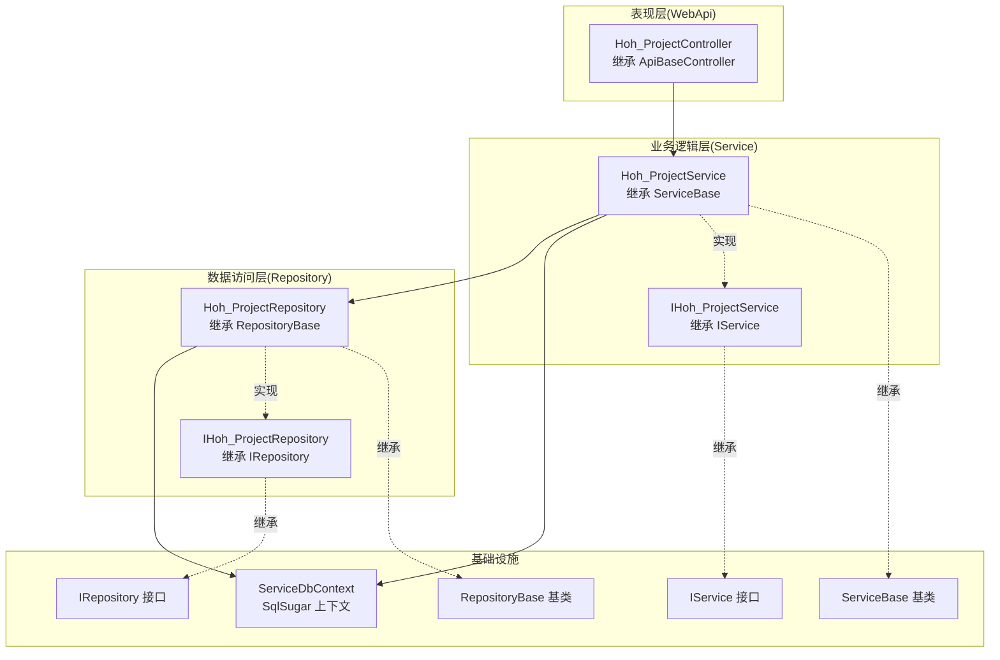
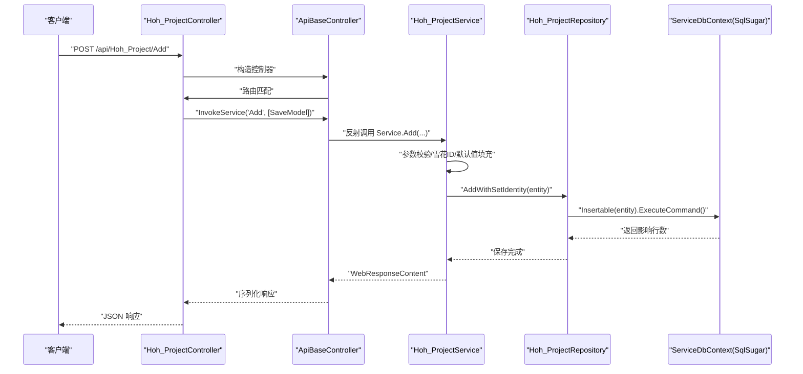
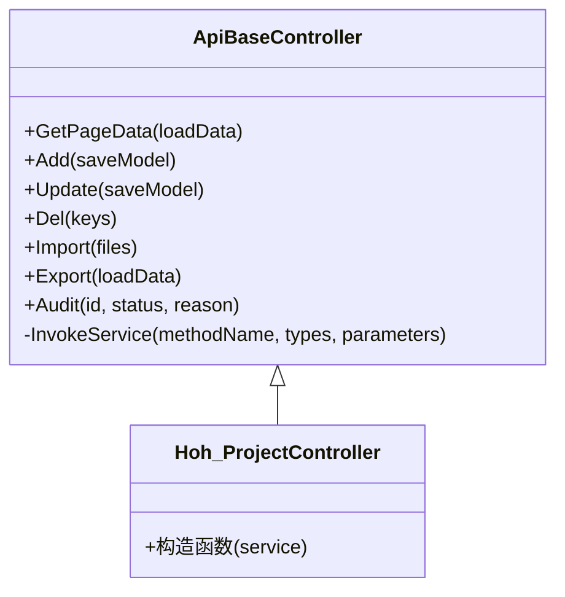
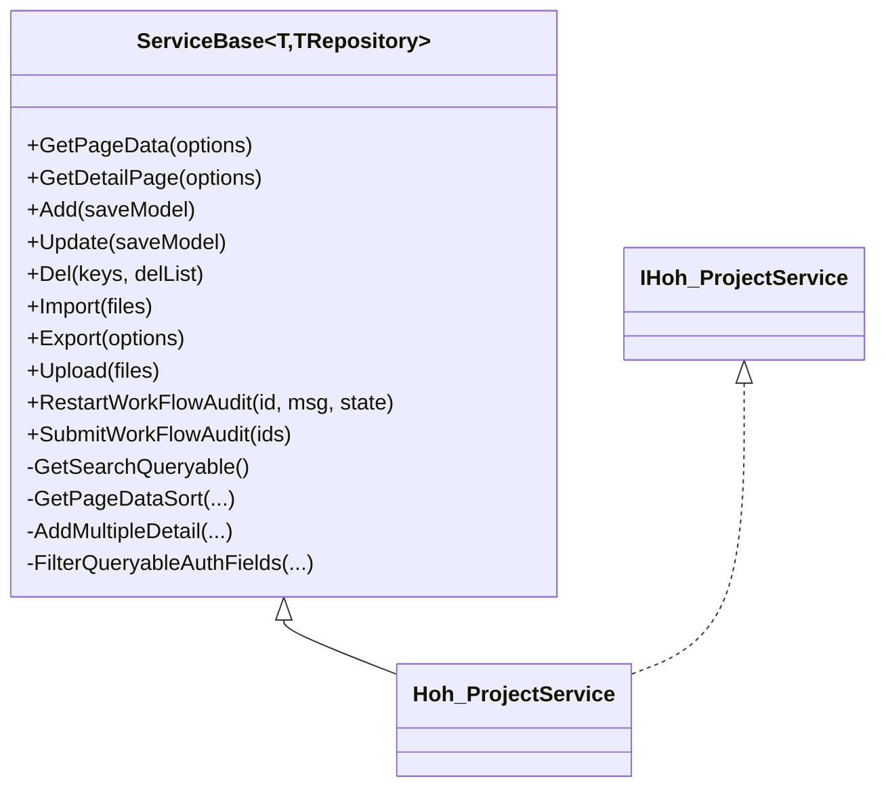
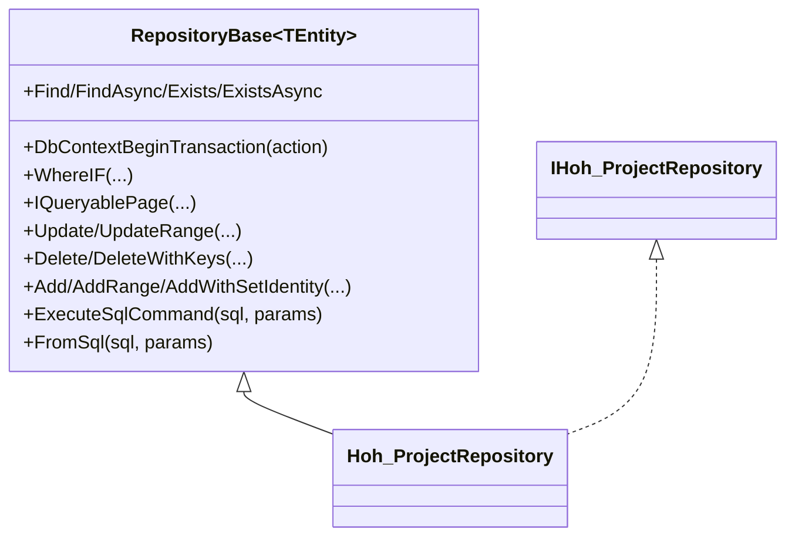
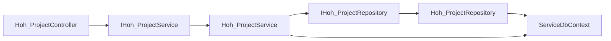

# 分层架构设计

<cite>
**本文引用的文件**
- [RepositoryBase.cs](file://VolPro.Core/BaseProvider/RepositoryBase.cs)
- [ServiceBase.cs](file://VolPro.Core/BaseProvider/ServiceBase.cs)
- [IRepository.cs](file://VolPro.Core/BaseProvider/IRepository.cs)
- [IService.cs](file://VolPro.Core/BaseProvider/IService.cs)
- [Hoh_ProjectRepository.cs](file://Hncdi.HeatOfHydration/Repositories/Hoh/Hoh_ProjectRepository.cs)
- [Hoh_ProjectService.cs](file://Hncdi.HeatOfHydration/Services/Hoh/Hoh_ProjectService.cs)
- [IHoh_ProjectService.cs](file://Hncdi.HeatOfHydration/IServices/Hoh/IHoh_ProjectService.cs)
- [IHoh_ProjectRepository.cs](file://Hncdi.HeatOfHydration/IRepositories/Hoh/IHoh_ProjectRepository.cs)
- [ServiceDbContext.cs](file://VolPro.Core/EFDbContext/ServiceDbContext.cs)
- [ApiBaseController.cs](file://VolPro.Core/Controllers/Basic/ApiBaseController.cs)
- [Hoh_ProjectController.cs](file://VolPro.WebApi/Controllers/HeatOfHydration/Hoh_ProjectController.cs)
</cite>

## 目录
1. [引言](#引言)
2. [项目结构](#项目结构)
3. [核心组件](#核心组件)
4. [架构总览](#架构总览)
5. [详细组件分析](#详细组件分析)
6. [依赖关系分析](#依赖关系分析)
7. [性能考量](#性能考量)
8. [故障排查指南](#故障排查指南)
9. [结论](#结论)
10. [附录](#附录)

## 引言
本设计文档围绕“水化热平台”的分层架构展开，系统采用经典的三层架构：表现层（WebApi 层）、业务逻辑层（Service 层）、数据访问层（Repository 层）。通过统一的基类与接口契约，结合泛型与反射机制，实现跨模块的代码复用与职责清晰的分层协作。本文将系统阐述各层职责、接口定义、实现方式、交互模式，并给出 UML 图与数据流图，帮助开发者快速理解与维护该架构。

## 项目结构
- 表现层（WebApi 层）
  - 控制器位于 VolPro.WebApi/Controllers 下，以 ApiBaseController 为基类，统一承接 HTTP 请求，委派给 Service 层。
  - 示例：Hoh_ProjectController 继承 ApiBaseController<IHoh_ProjectService>，路由为 api/Hoh_Project。
- 业务逻辑层（Service 层）
  - 位于 Hncdi.HeatOfHydration/Services 与 IServices 下，ServiceBase<T, TRepository> 提供通用的分页、导入导出、主子表保存、工作流等能力。
  - 示例：Hoh_ProjectService 继承 ServiceBase<Hoh_Project, IHoh_ProjectRepository>。
- 数据访问层（Repository 层）
  - 位于 Hncdi.HeatOfHydration/Repositories 与 IRepositories 下，RepositoryBase<TEntity> 提供通用的 CRUD、分页、事务、SQL 执行等能力。
  - 示例：Hoh_ProjectRepository 继承 RepositoryBase<Hoh_Project>。
- 基础设施与上下文
  - ServiceDbContext 作为 SqlSugar 上下文容器，贯穿 Repository 层与 Service 层。
  - 接口契约：IRepository、IService；基类：RepositoryBase、ServiceBase。

**图表来源**
- [Hoh_ProjectController.cs:1-22](file://VolPro.WebApi/Controllers/HeatOfHydration/Hoh_ProjectController.cs#L1-L22)
- [ApiBaseController.cs:1-230](file://VolPro.Core/Controllers/Basic/ApiBaseController.cs#L1-L230)
- [Hoh_ProjectService.cs:1-24](file://Hncdi.HeatOfHydration/Services/Hoh/Hoh_ProjectService.cs#L1-L24)
- [ServiceBase.cs:1-800](file://VolPro.Core/BaseProvider/ServiceBase.cs#L1-L800)
- [IHoh_ProjectService.cs:1-13](file://Hncdi.HeatOfHydration/IServices/Hoh/IHoh_ProjectService.cs#L1-L13)
- [Hoh_ProjectRepository.cs:1-25](file://Hncdi.HeatOfHydration/Repositories/Hoh/Hoh_ProjectRepository.cs#L1-L25)
- [RepositoryBase.cs:1-651](file://VolPro.Core/BaseProvider/RepositoryBase.cs#L1-L651)
- [IHoh_ProjectRepository.cs:1-19](file://Hncdi.HeatOfHydration/IRepositories/Hoh/IHoh_ProjectRepository.cs#L1-L19)
- [ServiceDbContext.cs:1-31](file://VolPro.Core/EFDbContext/ServiceDbContext.cs#L1-L31)

**章节来源**
- [Hoh_ProjectController.cs:1-22](file://VolPro.WebApi/Controllers/HeatOfHydration/Hoh_ProjectController.cs#L1-L22)
- [ApiBaseController.cs:1-230](file://VolPro.Core/Controllers/Basic/ApiBaseController.cs#L1-L230)
- [Hoh_ProjectService.cs:1-24](file://Hncdi.HeatOfHydration/Services/Hoh/Hoh_ProjectService.cs#L1-L24)
- [ServiceBase.cs:1-800](file://VolPro.Core/BaseProvider/ServiceBase.cs#L1-L800)
- [IHoh_ProjectService.cs:1-13](file://Hncdi.HeatOfHydration/IServices/Hoh/IHoh_ProjectService.cs#L1-L13)
- [Hoh_ProjectRepository.cs:1-25](file://Hncdi.HeatOfHydration/Repositories/Hoh/Hoh_ProjectRepository.cs#L1-L25)
- [RepositoryBase.cs:1-651](file://VolPro.Core/BaseProvider/RepositoryBase.cs#L1-L651)
- [IHoh_ProjectRepository.cs:1-19](file://Hncdi.HeatOfHydration/IRepositories/Hoh/IHoh_ProjectRepository.cs#L1-L19)
- [ServiceDbContext.cs:1-31](file://VolPro.Core/EFDbContext/ServiceDbContext.cs#L1-L31)

## 核心组件
- 表现层（WebApi）
  - ApiBaseController：统一接收 HTTP 请求，基于反射调用 Service 方法，封装响应格式。
  - Hoh_ProjectController：绑定具体业务服务接口，暴露标准 CRUD 与报表相关接口。
- 业务逻辑层（Service）
  - ServiceBase<T, TRepository>：提供分页查询、明细查询、导入导出、主子表保存、工作流、鉴权字段过滤、多租户过滤、雪花 ID 等通用能力。
  - Hoh_ProjectService：面向 Hoh_Project 的业务编排，依赖仓储接口完成持久化。
- 数据访问层（Repository）
  - RepositoryBase<TEntity>：提供通用 CRUD、分页、事务、动态条件查询、主子表同步更新、FromSql/ExecuteSqlCommand 等能力。
  - Hoh_ProjectRepository：面向 Hoh_Project 的仓储实现，持有 ServiceDbContext 上下文。
- 基础设施
  - ServiceDbContext：SqlSugar 上下文封装，作为仓储与服务共享的数据访问入口。
  - IRepository/IService：约束层间契约，确保松耦合与可替换性。

**章节来源**
- [ApiBaseController.cs:1-230](file://VolPro.Core/Controllers/Basic/ApiBaseController.cs#L1-L230)
- [Hoh_ProjectController.cs:1-22](file://VolPro.WebApi/Controllers/HeatOfHydration/Hoh_ProjectController.cs#L1-L22)
- [ServiceBase.cs:1-800](file://VolPro.Core/BaseProvider/ServiceBase.cs#L1-L800)
- [RepositoryBase.cs:1-651](file://VolPro.Core/BaseProvider/RepositoryBase.cs#L1-L651)
- [ServiceDbContext.cs:1-31](file://VolPro.Core/EFDbContext/ServiceDbContext.cs#L1-L31)
- [IRepository.cs:1-328](file://VolPro.Core/BaseProvider/IRepository.cs#L1-L328)
- [IService.cs:1-165](file://VolPro.Core/BaseProvider/IService.cs#L1-L165)

## 架构总览
下图展示了从 HTTP 请求到数据库的完整数据流，体现三层之间的调用关系与职责边界：

**图表来源**
- [Hoh_ProjectController.cs:1-22](file://VolPro.WebApi/Controllers/HeatOfHydration/Hoh_ProjectController.cs#L1-L22)
- [ApiBaseController.cs:213-227](file://VolPro.Core/Controllers/Basic/ApiBaseController.cs#L213-L227)
- [Hoh_ProjectService.cs:1-24](file://Hncdi.HeatOfHydration/Services/Hoh/Hoh_ProjectService.cs#L1-L24)
- [ServiceBase.cs:659-761](file://VolPro.Core/BaseProvider/ServiceBase.cs#L659-L761)
- [Hoh_ProjectRepository.cs:1-25](file://Hncdi.HeatOfHydration/Repositories/Hoh/Hoh_ProjectRepository.cs#L1-L25)
- [RepositoryBase.cs:546-597](file://VolPro.Core/BaseProvider/RepositoryBase.cs#L546-L597)
- [ServiceDbContext.cs:1-31](file://VolPro.Core/EFDbContext/ServiceDbContext.cs#L1-L31)

## 详细组件分析

### 表现层（WebApi 层）
- 职责
  - 接收 HTTP 请求，进行权限与日志记录，通过反射调用 Service 层方法，统一封装响应。
- 关键点
  - 路由与权限：控制器标注路由与权限表注解，确保资源访问受控。
  - 反射调用：ApiBaseController 内部通过方法名与参数类型反射调用 Service，避免重复样板代码。
- 示例
  - Hoh_ProjectController 继承 ApiBaseController<IHoh_ProjectService>，自动具备 GetPageData、Add、Update、Del、Import、Export、Audit 等接口。

**图表来源**
- [ApiBaseController.cs:1-230](file://VolPro.Core/Controllers/Basic/ApiBaseController.cs#L1-L230)
- [Hoh_ProjectController.cs:1-22](file://VolPro.WebApi/Controllers/HeatOfHydration/Hoh_ProjectController.cs#L1-L22)

**章节来源**
- [Hoh_ProjectController.cs:1-22](file://VolPro.WebApi/Controllers/HeatOfHydration/Hoh_ProjectController.cs#L1-L22)
- [ApiBaseController.cs:1-230](file://VolPro.Core/Controllers/Basic/ApiBaseController.cs#L1-L230)

### 业务逻辑层（Service 层）
- 职责
  - 组织业务流程，协调仓储与缓存、工作流、鉴权字段过滤、多租户过滤、导入导出、主子表保存等。
- 设计模式与复用
  - 泛型约束：ServiceBase<T, TRepository> 通过泛型约束 TEntity 与 TRepository，保证类型安全与可替换性。
  - 反射复用：ServiceBase 内部大量使用反射（如动态明细类型解析、动态泛型方法调用），减少重复代码。
  - 委托与事件：通过回调委托（如 AddOnExecuting/Executed、ImportOnExecuting/Executed、ExportOnExecuting）扩展业务行为。
- 关键能力
  - 分页查询：GetPageData 支持排序、过滤、导出、统计汇总。
  - 主子表保存：Add/Update 支持主表与明细表联动保存，自动识别明细集合并按主键增删改。
  - 导入导出：EPPlus 模板下载、Excel 读取、数据校验、列映射、权限字段过滤。
  - 多租户与鉴权：自动注入多租户过滤与角色字段授权过滤。
- 示例
  - Hoh_ProjectService 继承 ServiceBase<Hoh_Project, IHoh_ProjectRepository>，可直接使用通用能力。

**图表来源**
- [ServiceBase.cs:1-800](file://VolPro.Core/BaseProvider/ServiceBase.cs#L1-L800)
- [Hoh_ProjectService.cs:1-24](file://Hncdi.HeatOfHydration/Services/Hoh/Hoh_ProjectService.cs#L1-L24)
- [IHoh_ProjectService.cs:1-13](file://Hncdi.HeatOfHydration/IServices/Hoh/IHoh_ProjectService.cs#L1-L13)

**章节来源**
- [ServiceBase.cs:1-800](file://VolPro.Core/BaseProvider/ServiceBase.cs#L1-L800)
- [Hoh_ProjectService.cs:1-24](file://Hncdi.HeatOfHydration/Services/Hoh/Hoh_ProjectService.cs#L1-L24)
- [IHoh_ProjectService.cs:1-13](file://Hncdi.HeatOfHydration/IServices/Hoh/IHoh_ProjectService.cs#L1-L13)

### 数据访问层（Repository 层）
- 职责
  - 提供统一的 CRUD、分页、事务、动态条件查询、SQL 执行等能力，屏蔽底层数据源差异。
- 设计模式与复用
  - 泛型基类：RepositoryBase<TEntity> 通过泛型约束 TEntity，统一实体操作接口。
  - 动态分表：根据实体特性自动启用分表查询与写入。
  - 事务封装：DbContextBeginTransaction 统一事务开启、提交与回滚。
  - 反射与表达式树：WhereIF、排序字典、字段选择等均通过表达式树与反射实现灵活查询。
- 关键能力
  - 条件查询：WhereIF、Find/FindAsync、Exists/ExistsAsync。
  - 分页：IQueryablePage 支持字典排序与行数统计。
  - 主子表同步：UpdateRange 支持主表与明细联动更新、新增、删除。
  - SQL 执行：FromSql、ExecuteSqlCommand。
- 示例
  - Hoh_ProjectRepository 继承 RepositoryBase<Hoh_Project>，持有 ServiceDbContext 上下文。

**图表来源**
- [RepositoryBase.cs:1-651](file://VolPro.Core/BaseProvider/RepositoryBase.cs#L1-L651)
- [Hoh_ProjectRepository.cs:1-25](file://Hncdi.HeatOfHydration/Repositories/Hoh/Hoh_ProjectRepository.cs#L1-L25)
- [IHoh_ProjectRepository.cs:1-19](file://Hncdi.HeatOfHydration/IRepositories/Hoh/IHoh_ProjectRepository.cs#L1-L19)

**章节来源**
- [RepositoryBase.cs:1-651](file://VolPro.Core/BaseProvider/RepositoryBase.cs#L1-L651)
- [Hoh_ProjectRepository.cs:1-25](file://Hncdi.HeatOfHydration/Repositories/Hoh/Hoh_ProjectRepository.cs#L1-L25)
- [IHoh_ProjectRepository.cs:1-19](file://Hncdi.HeatOfHydration/IRepositories/Hoh/IHoh_ProjectRepository.cs#L1-L19)

### 基础设施与上下文
- ServiceDbContext
  - 作为 SqlSugar 客户端的容器，贯穿 Repository 与 Service，确保上下文一致性。
- 接口契约
  - IRepository/IService：约束层间依赖，便于替换与测试。
- 反射与依赖注入
  - 控制器与服务通过 AutofacContainerModule 获取实例，ServiceBase 亦通过容器获取缓存服务等。

**章节来源**
- [ServiceDbContext.cs:1-31](file://VolPro.Core/EFDbContext/ServiceDbContext.cs#L1-L31)
- [IRepository.cs:1-328](file://VolPro.Core/BaseProvider/IRepository.cs#L1-L328)
- [IService.cs:1-165](file://VolPro.Core/BaseProvider/IService.cs#L1-L165)

## 依赖关系分析
- 控制器依赖服务接口，服务依赖仓储接口，仓储依赖上下文。
- 通过接口与泛型约束，降低耦合度，提升可测试性与可替换性。
- 反射与表达式树广泛用于动态查询、字段映射与方法调用，提高代码复用率。

**图表来源**
- [Hoh_ProjectController.cs:1-22](file://VolPro.WebApi/Controllers/HeatOfHydration/Hoh_ProjectController.cs#L1-L22)
- [Hoh_ProjectService.cs:1-24](file://Hncdi.HeatOfHydration/Services/Hoh/Hoh_ProjectService.cs#L1-L24)
- [IHoh_ProjectService.cs:1-13](file://Hncdi.HeatOfHydration/IServices/Hoh/IHoh_ProjectService.cs#L1-L13)
- [Hoh_ProjectRepository.cs:1-25](file://Hncdi.HeatOfHydration/Repositories/Hoh/Hoh_ProjectRepository.cs#L1-L25)
- [IHoh_ProjectRepository.cs:1-19](file://Hncdi.HeatOfHydration/IRepositories/Hoh/IHoh_ProjectRepository.cs#L1-L19)
- [ServiceDbContext.cs:1-31](file://VolPro.Core/EFDbContext/ServiceDbContext.cs#L1-L31)

**章节来源**
- [Hoh_ProjectController.cs:1-22](file://VolPro.WebApi/Controllers/HeatOfHydration/Hoh_ProjectController.cs#L1-L22)
- [Hoh_ProjectService.cs:1-24](file://Hncdi.HeatOfHydration/Services/Hoh/Hoh_ProjectService.cs#L1-L24)
- [Hoh_ProjectRepository.cs:1-25](file://Hncdi.HeatOfHydration/Repositories/Hoh/Hoh_ProjectRepository.cs#L1-L25)
- [ServiceDbContext.cs:1-31](file://VolPro.Core/EFDbContext/ServiceDbContext.cs#L1-L31)

## 性能考量
- 查询性能
  - 合理使用 WhereIF 与表达式树构建查询，避免不必要的全表扫描。
  - 分页查询建议明确排序字段，避免无序分页导致的性能问题。
- 写入性能
  - 批量插入/更新优先使用 Insertable/Updateable 的批量接口，减少往返次数。
  - 主子表保存时，尽量减少不必要的明细删除与重建，控制事务范围。
- 事务与并发
  - 事务范围应最小化，避免长时间持有锁。
  - 对高并发场景，考虑读写分离与缓存策略。
- 反射与表达式树
  - 反射调用会带来一定开销，建议在热点路径谨慎使用，或进行必要的缓存与预编译。

## 故障排查指南
- 常见问题
  - 参数校验失败：检查 SaveModel 字段映射与实体验证规则。
  - 导入失败：确认 Excel 列头与模板一致，检查读取回调与忽略列配置。
  - 权限字段缺失：确认角色字段授权与隐藏字段配置。
  - 多租户过滤异常：检查多租户 SQL 注入与过滤条件。
- 日志与中间件
  - 控制器已集成操作日志与权限过滤，可通过日志定位问题。
  - 事务异常会在捕获后回滚并返回错误信息，开发环境可查看完整堆栈。

**章节来源**
- [ServiceBase.cs:531-605](file://VolPro.Core/BaseProvider/ServiceBase.cs#L531-L605)
- [RepositoryBase.cs:67-96](file://VolPro.Core/BaseProvider/RepositoryBase.cs#L67-L96)
- [ApiBaseController.cs:35-205](file://VolPro.Core/Controllers/Basic/ApiBaseController.cs#L35-L205)

## 结论
该分层架构通过统一的接口契约与泛型基类，实现了表现层、业务层与数据层的清晰分离与高度复用。ServiceBase 与 RepositoryBase 的设计充分利用了反射与表达式树，显著降低了重复代码，提升了开发效率。结合多租户、鉴权字段过滤、主子表联动、导入导出等通用能力，平台能够快速支撑复杂业务场景。建议在后续演进中持续关注查询与写入性能优化，并加强单元测试与契约约束，以进一步提升系统的稳定性与可维护性。

## 附录
- 术语
  - 泛型：通过类型参数约束，实现代码复用与类型安全。
  - 反射：运行时获取类型信息与调用成员，增强灵活性。
  - 表达式树：将 lambda 表达式转为可执行的表达式结构，用于动态查询与映射。
- 参考文件
  - [ServiceBase.cs:1-800](file://VolPro.Core/BaseProvider/ServiceBase.cs#L1-L800)
  - [RepositoryBase.cs:1-651](file://VolPro.Core/BaseProvider/RepositoryBase.cs#L1-L651)
  - [IRepository.cs:1-328](file://VolPro.Core/BaseProvider/IRepository.cs#L1-L328)
  - [IService.cs:1-165](file://VolPro.Core/BaseProvider/IService.cs#L1-L165)
  - [ServiceDbContext.cs:1-31](file://VolPro.Core/EFDbContext/ServiceDbContext.cs#L1-L31)
  - [ApiBaseController.cs:1-230](file://VolPro.Core/Controllers/Basic/ApiBaseController.cs#L1-L230)
  - [Hoh_ProjectController.cs:1-22](file://VolPro.WebApi/Controllers/HeatOfHydration/Hoh_ProjectController.cs#L1-L22)
  - [Hoh_ProjectService.cs:1-24](file://Hncdi.HeatOfHydration/Services/Hoh/Hoh_ProjectService.cs#L1-L24)
  - [Hoh_ProjectRepository.cs:1-25](file://Hncdi.HeatOfHydration/Repositories/Hoh/Hoh_ProjectRepository.cs#L1-L25)