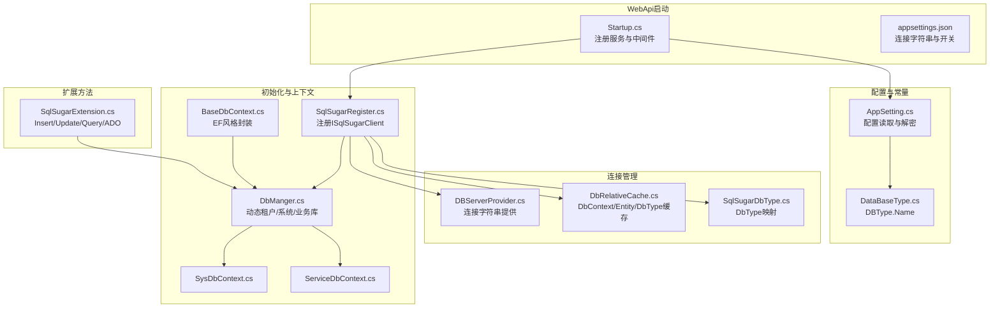
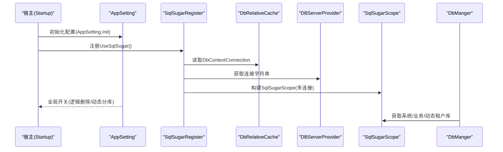
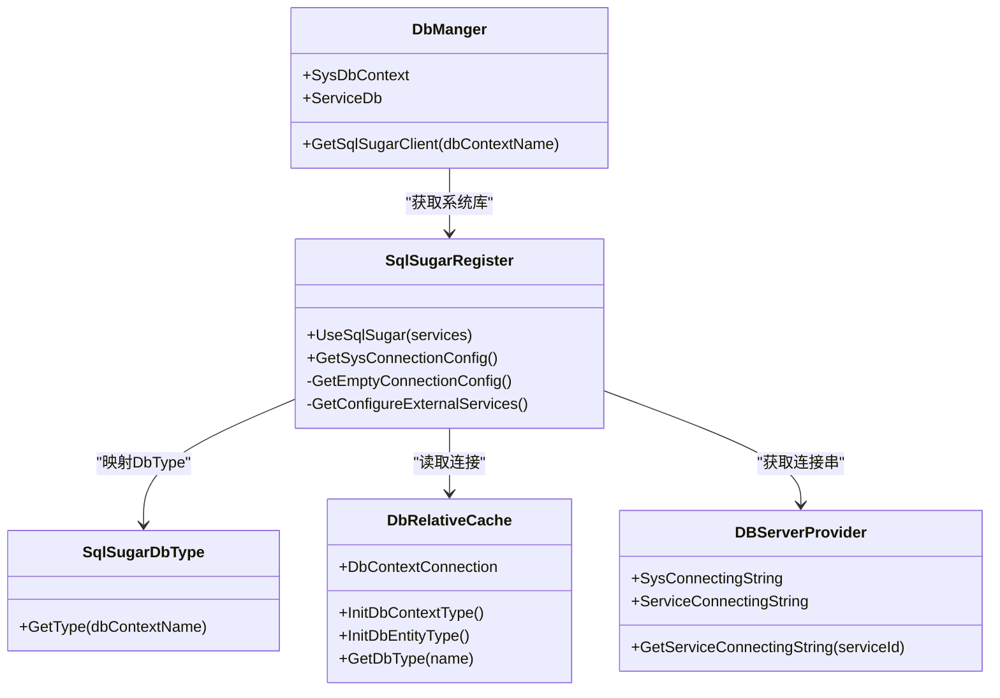
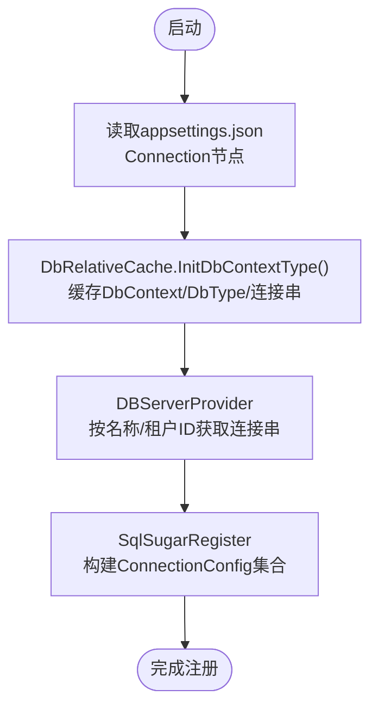
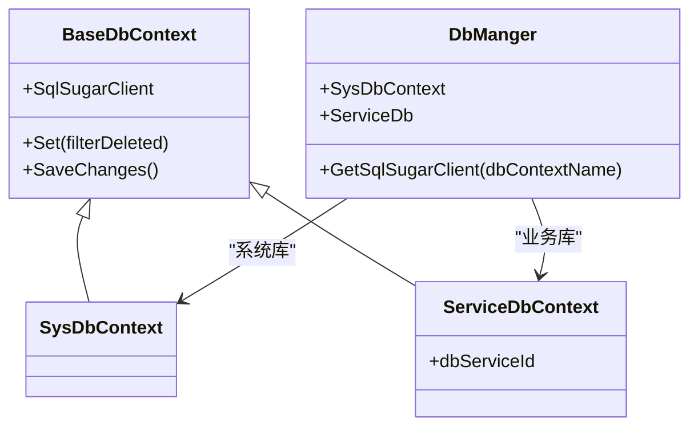
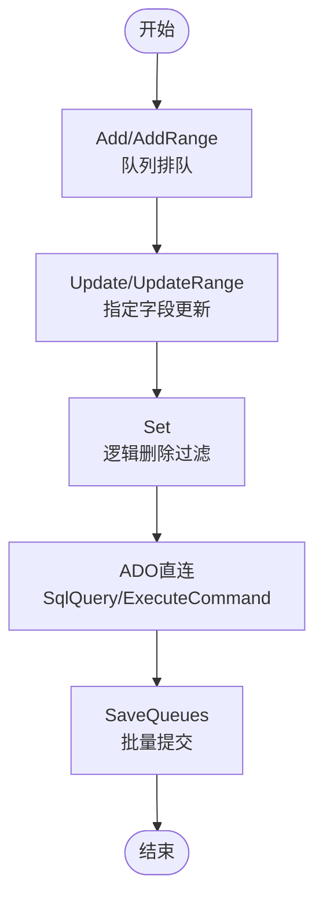
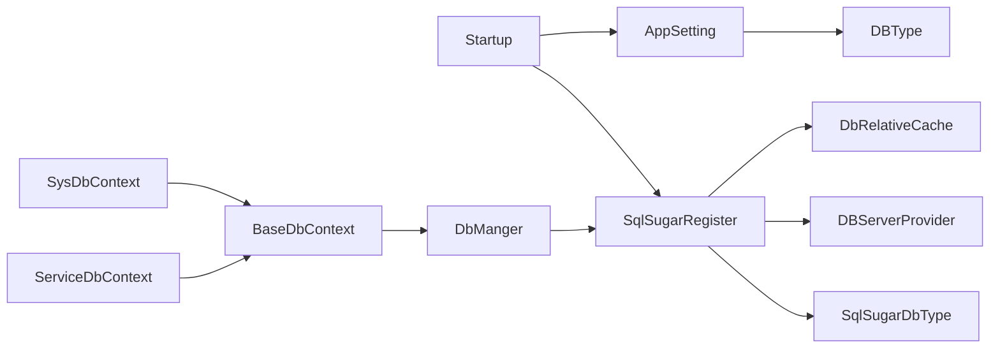

# ORM配置与集成

<cite>
**本文引用的文件**
- [VolPro.WebApi/Startup.cs](file://VolPro.WebApi/Startup.cs)
- [VolPro.WebApi/appsettings.json](file://VolPro.WebApi/appsettings.json)
- [VolPro.Core/Configuration/AppSetting.cs](file://VolPro.Core/Configuration/AppSetting.cs)
- [VolPro.Core/Const/DataBaseType.cs](file://VolPro.Core/Const/DataBaseType.cs)
- [VolPro.Core/DbManager/DBServerProvider.cs](file://VolPro.Core/DbManager/DBServerProvider.cs)
- [VolPro.Core/DbManager/DbRelativeCache.cs](file://VolPro.Core/DbManager/DbRelativeCache.cs)
- [VolPro.Core/DbSqlSugar/SqlSugarRegister.cs](file://VolPro.Core/DbSqlSugar/SqlSugarRegister.cs)
- [VolPro.Core/DbSqlSugar/DbManger.cs](file://VolPro.Core/DbSqlSugar/DbManger.cs)
- [VolPro.Core/DbSqlSugar/SqlSugarExtension.cs](file://VolPro.Core/DbSqlSugar/SqlSugarExtension.cs)
- [VolPro.Core/DbSqlSugar/SqlSugarDbType.cs](file://VolPro.Core/DbSqlSugar/SqlSugarDbType.cs)
- [VolPro.Core/EFDbContext/BaseDbContext.cs](file://VolPro.Core/EFDbContext/BaseDbContext.cs)
- [VolPro.Core/EFDbContext/SysDbContext.cs](file://VolPro.Core/EFDbContext/SysDbContext.cs)
- [VolPro.Core/EFDbContext/ServiceDbContext.cs](file://VolPro.Core/EFDbContext/ServiceDbContext.cs)
</cite>

## 目录
1. [简介](#简介)
2. [项目结构](#项目结构)
3. [核心组件](#核心组件)
4. [架构总览](#架构总览)
5. [详细组件分析](#详细组件分析)
6. [依赖关系分析](#依赖关系分析)
7. [性能考虑](#性能考虑)
8. [故障排查指南](#故障排查指南)
9. [结论](#结论)
10. [附录](#附录)

## 简介
本文件面向“水化热平台”的ORM配置与集成，聚焦于SqlSugar ORM在该系统中的初始化、连接字符串管理、数据库类型映射、多数据库支持策略（SQL Server、MySQL、Oracle等）、连接池与超时设置、连接重试机制、ORM扩展方法、性能优化以及数据库迁移与版本兼容处理建议。文档以代码为依据，结合架构图与流程图，帮助开发者快速理解并正确使用ORM层。

## 项目结构
ORM相关能力主要分布在以下模块：
- 配置与常量：应用配置、数据库类型常量
- 连接管理：连接字符串提供者、相对缓存、数据库类型映射
- 初始化注册：SqlSugar注册、外部服务配置
- 上下文封装：EF风格的DbContext基类与具体系统库/业务库上下文
- 扩展方法：常用增删改查、队列提交、逻辑删除过滤、ADO封装等

**图表来源**
- [VolPro.WebApi/Startup.cs:60-213](file://VolPro.WebApi/Startup.cs#L60-L213)
- [VolPro.WebApi/appsettings.json:16-70](file://VolPro.WebApi/appsettings.json#L16-L70)
- [VolPro.Core/Configuration/AppSetting.cs:85-163](file://VolPro.Core/Configuration/AppSetting.cs#L85-L163)
- [VolPro.Core/Const/DataBaseType.cs:3-7](file://VolPro.Core/Const/DataBaseType.cs#L3-L7)
- [VolPro.Core/DbManager/DBServerProvider.cs:108-127](file://VolPro.Core/DbManager/DBServerProvider.cs#L108-L127)
- [VolPro.Core/DbManager/DbRelativeCache.cs:25-72](file://VolPro.Core/DbManager/DbRelativeCache.cs#L25-L72)
- [VolPro.Core/DbSqlSugar/SqlSugarRegister.cs:76-131](file://VolPro.Core/DbSqlSugar/SqlSugarRegister.cs#L76-L131)
- [VolPro.Core/DbSqlSugar/DbManger.cs:115-131](file://VolPro.Core/DbSqlSugar/DbManger.cs#L115-L131)
- [VolPro.Core/EFDbContext/BaseDbContext.cs:32-40](file://VolPro.Core/EFDbContext/BaseDbContext.cs#L32-L40)
- [VolPro.Core/EFDbContext/SysDbContext.cs:13-18](file://VolPro.Core/EFDbContext/SysDbContext.cs#L13-L18)
- [VolPro.Core/EFDbContext/ServiceDbContext.cs:13-29](file://VolPro.Core/EFDbContext/ServiceDbContext.cs#L13-L29)
- [VolPro.Core/DbSqlSugar/SqlSugarExtension.cs:23-225](file://VolPro.Core/DbSqlSugar/SqlSugarExtension.cs#L23-L225)

**章节来源**
- [VolPro.WebApi/Startup.cs:60-213](file://VolPro.WebApi/Startup.cs#L60-L213)
- [VolPro.WebApi/appsettings.json:16-70](file://VolPro.WebApi/appsettings.json#L16-L70)
- [VolPro.Core/Configuration/AppSetting.cs:85-163](file://VolPro.Core/Configuration/AppSetting.cs#L85-L163)

## 核心组件
- 应用配置与解密：集中读取配置、解密敏感连接串、全局开关（逻辑删除、雪花算法、动态分库等）
- 数据库类型映射：根据配置将DbContext名称映射为SqlSugar DbType
- 连接字符串管理：统一从配置与缓存中获取，支持系统库、业务库、动态租户库
- SqlSugar注册：批量注册多连接配置，统一AOP日志，按需设置外部服务
- 上下文封装：BaseDbContext桥接SqlSugar，SysDbContext/ServiceDbContext分别绑定系统库与业务库
- ORM扩展：Insert/AddRange/Update/SaveQueues/逻辑删除过滤/ADO直连等

**章节来源**
- [VolPro.Core/Configuration/AppSetting.cs:85-163](file://VolPro.Core/Configuration/AppSetting.cs#L85-L163)
- [VolPro.Core/DbSqlSugar/SqlSugarRegister.cs:76-131](file://VolPro.Core/DbSqlSugar/SqlSugarRegister.cs#L76-L131)
- [VolPro.Core/DbSqlSugar/DbManger.cs:115-131](file://VolPro.Core/DbSqlSugar/DbManger.cs#L115-L131)
- [VolPro.Core/EFDbContext/BaseDbContext.cs:32-40](file://VolPro.Core/EFDbContext/BaseDbContext.cs#L32-L40)

## 架构总览
SqlSugar在本项目采用“多连接+动态上下文”模式：
- 启动阶段读取配置，构建多个ConnectionConfig并注册为ISqlSugarClient
- 通过DbManger统一获取系统库、业务库、动态租户库的ISqlSugarClient
- BaseDbContext将SqlSugar能力暴露为类似EF的Set/SaveChanges接口
- 扩展方法提供批量插入、更新、逻辑删除过滤、ADO直连等便捷能力

**图表来源**
- [VolPro.WebApi/Startup.cs:210-213](file://VolPro.WebApi/Startup.cs#L210-L213)
- [VolPro.Core/DbSqlSugar/SqlSugarRegister.cs:84-101](file://VolPro.Core/DbSqlSugar/SqlSugarRegister.cs#L84-L101)
- [VolPro.Core/DbManager/DbRelativeCache.cs:25-72](file://VolPro.Core/DbManager/DbRelativeCache.cs#L25-L72)
- [VolPro.Core/DbManager/DBServerProvider.cs:108-127](file://VolPro.Core/DbManager/DBServerProvider.cs#L108-L127)
- [VolPro.Core/DbSqlSugar/DbManger.cs:115-131](file://VolPro.Core/DbSqlSugar/DbManger.cs#L115-L131)

## 详细组件分析

### 组件一：SqlSugar初始化与注册
- 多连接配置：从DbRelativeCache缓存的DbContextConnection中筛选以DbContext结尾或名为default的连接，逐个构建ConnectionConfig
- 类型映射：SqlSugarDbType.GetType根据DbContext名称或全局DBType.Name映射DbType
- 外部服务：ConfigureExternalServices用于列名转换（如达梦数据库列名转大写）
- AOP日志：统一OnLogExecuting输出SQL，便于调试与性能观察
- 系统库配置：单独构造Sys库连接，便于后台异步任务使用

**图表来源**
- [VolPro.Core/DbSqlSugar/SqlSugarRegister.cs:76-151](file://VolPro.Core/DbSqlSugar/SqlSugarRegister.cs#L76-L151)
- [VolPro.Core/DbSqlSugar/SqlSugarDbType.cs:19-67](file://VolPro.Core/DbSqlSugar/SqlSugarDbType.cs#L19-L67)
- [VolPro.Core/DbManager/DbRelativeCache.cs:25-72](file://VolPro.Core/DbManager/DbRelativeCache.cs#L25-L72)
- [VolPro.Core/DbManager/DBServerProvider.cs:108-136](file://VolPro.Core/DbManager/DBServerProvider.cs#L108-L136)
- [VolPro.Core/DbSqlSugar/DbManger.cs:95-131](file://VolPro.Core/DbSqlSugar/DbManger.cs#L95-L131)

**章节来源**
- [VolPro.Core/DbSqlSugar/SqlSugarRegister.cs:76-151](file://VolPro.Core/DbSqlSugar/SqlSugarRegister.cs#L76-L151)
- [VolPro.Core/DbSqlSugar/SqlSugarDbType.cs:19-67](file://VolPro.Core/DbSqlSugar/SqlSugarDbType.cs#L19-L67)
- [VolPro.Core/DbManager/DbRelativeCache.cs:25-72](file://VolPro.Core/DbManager/DbRelativeCache.cs#L25-L72)
- [VolPro.Core/DbManager/DBServerProvider.cs:108-136](file://VolPro.Core/DbManager/DBServerProvider.cs#L108-L136)
- [VolPro.Core/DbSqlSugar/DbManger.cs:95-131](file://VolPro.Core/DbSqlSugar/DbManger.cs#L95-L131)

### 组件二：连接字符串管理与多数据库支持
- 配置文件：appsettings.json中Connection节点包含DBType、系统库与业务库连接串，以及各DbContext的DbType映射
- 缓存机制：DbRelativeCache在启动时扫描Core与Entity程序集，缓存DbContext类型、实体类型及DbType映射
- 提供者：DBServerProvider根据DbContext名称或动态租户ID获取连接串
- 支持数据库：通过DbType枚举支持SQL Server、MySQL、Oracle、PostgreSQL、Kdbndp、GaussDB、OceanBase、DM等

**图表来源**
- [VolPro.WebApi/appsettings.json:16-70](file://VolPro.WebApi/appsettings.json#L16-L70)
- [VolPro.Core/DbManager/DbRelativeCache.cs:38-72](file://VolPro.Core/DbManager/DbRelativeCache.cs#L38-L72)
- [VolPro.Core/DbManager/DBServerProvider.cs:108-136](file://VolPro.Core/DbManager/DBServerProvider.cs#L108-L136)
- [VolPro.Core/DbSqlSugar/SqlSugarRegister.cs:84-99](file://VolPro.Core/DbSqlSugar/SqlSugarRegister.cs#L84-L99)

**章节来源**
- [VolPro.WebApi/appsettings.json:16-70](file://VolPro.WebApi/appsettings.json#L16-L70)
- [VolPro.Core/DbManager/DbRelativeCache.cs:38-72](file://VolPro.Core/DbManager/DbRelativeCache.cs#L38-L72)
- [VolPro.Core/DbManager/DBServerProvider.cs:108-136](file://VolPro.Core/DbManager/DBServerProvider.cs#L108-L136)
- [VolPro.Core/DbSqlSugar/SqlSugarRegister.cs:84-99](file://VolPro.Core/DbSqlSugar/SqlSugarRegister.cs#L84-L99)

### 组件三：上下文封装与动态租户
- BaseDbContext：将SqlSugarClient暴露为Set/SaveChanges接口，统一查询与持久化入口
- SysDbContext/ServiceDbContext：分别绑定系统库与业务库上下文
- DbManger：提供GetSqlSugarClient/GetConnection，支持动态租户按serviceId创建连接并缓存

**图表来源**
- [VolPro.Core/EFDbContext/BaseDbContext.cs:32-40](file://VolPro.Core/EFDbContext/BaseDbContext.cs#L32-L40)
- [VolPro.Core/EFDbContext/SysDbContext.cs:13-18](file://VolPro.Core/EFDbContext/SysDbContext.cs#L13-L18)
- [VolPro.Core/EFDbContext/ServiceDbContext.cs:13-29](file://VolPro.Core/EFDbContext/ServiceDbContext.cs#L13-L29)
- [VolPro.Core/DbSqlSugar/DbManger.cs:115-131](file://VolPro.Core/DbSqlSugar/DbManger.cs#L115-L131)

**章节来源**
- [VolPro.Core/EFDbContext/BaseDbContext.cs:32-40](file://VolPro.Core/EFDbContext/BaseDbContext.cs#L32-L40)
- [VolPro.Core/EFDbContext/SysDbContext.cs:13-18](file://VolPro.Core/EFDbContext/SysDbContext.cs#L13-L18)
- [VolPro.Core/EFDbContext/ServiceDbContext.cs:13-29](file://VolPro.Core/EFDbContext/ServiceDbContext.cs#L13-L29)
- [VolPro.Core/DbSqlSugar/DbManger.cs:115-131](file://VolPro.Core/DbSqlSugar/DbManger.cs#L115-L131)

### 组件四：ORM扩展方法与性能优化
- 批量插入：Add/AddRange/AddAsync/AddRangeAsync，支持分表场景
- 更新：Update/UpdateRange支持指定字段更新，自动排除主键，避免误更新
- 查询：FirstOrDefault/First/Include/ThenByDescending等LINQ扩展
- 事务/队列：SaveChanges/SaveChangesAsync基于SaveQueues实现批量提交
- 逻辑删除：Set<TEntity>(filterDeleted=true)自动过滤逻辑删除字段
- ADO：QueryList/ExecuteScalar/ExcuteNonQuery直连执行SQL
- 超时：SetTimout预留接口（当前未实际设置）

**图表来源**
- [VolPro.Core/DbSqlSugar/SqlSugarExtension.cs:23-225](file://VolPro.Core/DbSqlSugar/SqlSugarExtension.cs#L23-L225)

**章节来源**
- [VolPro.Core/DbSqlSugar/SqlSugarExtension.cs:23-225](file://VolPro.Core/DbSqlSugar/SqlSugarExtension.cs#L23-L225)

## 依赖关系分析
- 启动依赖：Startup在ConfigureServices中调用AppSetting.Init与UseSqlSugar
- 配置依赖：AppSetting依赖IConfiguration，负责解密与全局开关
- 连接依赖：SqlSugarRegister依赖DbRelativeCache与DBServerProvider
- 上下文依赖：DbManger依赖Autofac容器获取ISqlSugarClient，SysDbContext/ServiceDbContext继承BaseDbContext
- 类型映射：SqlSugarDbType依赖DBType.Name与DbRelativeCache.GetDbType

**图表来源**
- [VolPro.WebApi/Startup.cs:210-213](file://VolPro.WebApi/Startup.cs#L210-L213)
- [VolPro.Core/Configuration/AppSetting.cs:85-163](file://VolPro.Core/Configuration/AppSetting.cs#L85-L163)
- [VolPro.Core/DbSqlSugar/SqlSugarRegister.cs:84-99](file://VolPro.Core/DbSqlSugar/SqlSugarRegister.cs#L84-L99)
- [VolPro.Core/DbSqlSugar/DbManger.cs:115-131](file://VolPro.Core/DbSqlSugar/DbManger.cs#L115-L131)
- [VolPro.Core/EFDbContext/BaseDbContext.cs:32-40](file://VolPro.Core/EFDbContext/BaseDbContext.cs#L32-L40)
- [VolPro.Core/EFDbContext/SysDbContext.cs:13-18](file://VolPro.Core/EFDbContext/SysDbContext.cs#L13-L18)
- [VolPro.Core/EFDbContext/ServiceDbContext.cs:13-29](file://VolPro.Core/EFDbContext/ServiceDbContext.cs#L13-L29)
- [VolPro.Core/DbSqlSugar/SqlSugarDbType.cs:19-67](file://VolPro.Core/DbSqlSugar/SqlSugarDbType.cs#L19-L67)

**章节来源**
- [VolPro.WebApi/Startup.cs:210-213](file://VolPro.WebApi/Startup.cs#L210-L213)
- [VolPro.Core/DbSqlSugar/SqlSugarRegister.cs:84-99](file://VolPro.Core/DbSqlSugar/SqlSugarRegister.cs#L84-L99)
- [VolPro.Core/DbSqlSugar/DbManger.cs:115-131](file://VolPro.Core/DbSqlSugar/DbManger.cs#L115-L131)
- [VolPro.Core/EFDbContext/BaseDbContext.cs:32-40](file://VolPro.Core/EFDbContext/BaseDbContext.cs#L32-L40)

## 性能考虑
- 批量提交：优先使用AddQueue/UpdateRange.AddQueue与SaveQueues/SaveQueuesAsync减少往返
- 指定字段更新：Update/UpdateRange支持仅更新必要字段，降低IO与锁竞争
- 逻辑删除过滤：Set<TEntity>(filterDeleted=true)自动过滤，避免无用数据传输
- 日志AOP：OnLogExecuting输出SQL，便于定位慢查询；生产环境可关闭或降级
- 连接池：SqlSugarScope内部复用连接，避免频繁创建销毁；合理设置连接串池参数
- 分表场景：Insertable(...).SplitTable()/Updateable(...).SplitTable()按表拆分提升写入吞吐

**章节来源**
- [VolPro.Core/DbSqlSugar/SqlSugarExtension.cs:53-81](file://VolPro.Core/DbSqlSugar/SqlSugarExtension.cs#L53-L81)
- [VolPro.Core/DbSqlSugar/SqlSugarExtension.cs:103-154](file://VolPro.Core/DbSqlSugar/SqlSugarExtension.cs#L103-L154)
- [VolPro.Core/DbSqlSugar/SqlSugarRegister.cs:115-127](file://VolPro.Core/DbSqlSugar/SqlSugarRegister.cs#L115-L127)

## 故障排查指南
- 未配置默认连接：AppSetting初始化时若DbConnectionString为空则抛出异常
- 未配置指定DbContext连接：DBServerProvider.GetServiceConnectingString会抛出异常
- 逻辑删除字段无效：确认AppSetting.LogicDelField与实体字段一致，且Set<TEntity>(filterDeleted=true)被调用
- 达梦数据库列名问题：ConfigureExternalServices中已将列名转为大写，确保实体属性名与数据库列名匹配
- 动态分库未生效：检查UseDynamicShareDB开关与UserContext.CurrentServiceId是否正确传递
- SQL超时：SetTimout预留接口未实际设置，可在业务侧结合ADO或外部连接串参数控制

**章节来源**
- [VolPro.Core/Configuration/AppSetting.cs:144-147](file://VolPro.Core/Configuration/AppSetting.cs#L144-L147)
- [VolPro.Core/DbManager/DBServerProvider.cs:133-136](file://VolPro.Core/DbManager/DBServerProvider.cs#L133-L136)
- [VolPro.Core/DbSqlSugar/SqlSugarRegister.cs:137-151](file://VolPro.Core/DbSqlSugar/SqlSugarRegister.cs#L137-L151)
- [VolPro.Core/DbSqlSugar/SqlSugarExtension.cs:194-206](file://VolPro.Core/DbSqlSugar/SqlSugarExtension.cs#L194-L206)
- [VolPro.Core/DbSqlSugar/SqlSugarExtension.cs:220-224](file://VolPro.Core/DbSqlSugar/SqlSugarExtension.cs#L220-L224)

## 结论
本项目通过“配置驱动+缓存+动态上下文”的方式，实现了SqlSugar在多数据库、多租户场景下的灵活集成。SqlSugarRegister统一注册、DbManger统一调度、BaseDbContext统一接口、SqlSugarExtension提供便捷能力，形成了一套可维护、可扩展、可优化的ORM体系。建议在生产环境中结合连接池参数、批量提交策略与日志AOP进行性能调优，并完善数据库迁移与版本兼容策略。

## 附录

### 多数据库支持策略与配置差异
- SQL Server：默认MsSql，连接串示例见appsettings.json中系统库与业务库
- MySQL：在Connection节点添加ServiceDbType: "MySql"，并在相应DbContext连接串中使用MySQL驱动
- Oracle：在Connection节点添加ServiceDbType: "Oracle"，并在相应DbContext连接串中使用Oracle驱动
- PostgreSQL/Kdbndp/GaussDB/OceanBase/DM：通过DbType枚举与SqlSugarDbType映射支持

**章节来源**
- [VolPro.WebApi/appsettings.json:16-70](file://VolPro.WebApi/appsettings.json#L16-L70)
- [VolPro.Core/DbSqlSugar/SqlSugarDbType.cs:37-62](file://VolPro.Core/DbSqlSugar/SqlSugarDbType.cs#L37-L62)

### 数据库连接池、超时与重试
- 连接池：SqlSugarScope内部复用连接；建议在连接串中配置池参数（如pooling、charset等）
- 超时：SetTimout预留接口未实际设置，可在ADO层或连接串Command Timeout参数控制
- 重试：未实现自动重试机制，可在业务层包装重试策略（指数退避）

**章节来源**
- [VolPro.Core/DbSqlSugar/SqlSugarRegister.cs:115-127](file://VolPro.Core/DbSqlSugar/SqlSugarRegister.cs#L115-L127)
- [VolPro.Core/DbSqlSugar/SqlSugarExtension.cs:220-224](file://VolPro.Core/DbSqlSugar/SqlSugarExtension.cs#L220-L224)

### ORM扩展方法使用指南
- 批量插入：AddRange/AddRangeAsync，支持分表场景
- 指定字段更新：Update/UpdateRange支持传入字段数组或Lambda表达式
- 逻辑删除：Set<TEntity>(filterDeleted=true)自动过滤
- ADO直连：SqlSugarClient.Ado.SqlQuery/ExecuteCommand/GetScalar
- 自定义扩展：可在SqlSugarExtension基础上新增扩展方法，保持与现有命名规范一致

**章节来源**
- [VolPro.Core/DbSqlSugar/SqlSugarExtension.cs:23-225](file://VolPro.Core/DbSqlSugar/SqlSugarExtension.cs#L23-L225)

### 数据库迁移与版本兼容
- 迁移策略：建议采用脚本化迁移（版本化SQL），结合AppSetting.LogicDelField与实体属性保持一致性
- 版本兼容：针对不同数据库（如Oracle列名大写、DM列名大写）通过ConfigureExternalServices统一处理
- 分库演进：通过DbRelativeCache缓存DbContext/DbType，新增库只需在appsettings.json中声明即可自动识别

**章节来源**
- [VolPro.Core/DbSqlSugar/SqlSugarRegister.cs:137-151](file://VolPro.Core/DbSqlSugar/SqlSugarRegister.cs#L137-L151)
- [VolPro.Core/DbManager/DbRelativeCache.cs:38-72](file://VolPro.Core/DbManager/DbRelativeCache.cs#L38-L72)