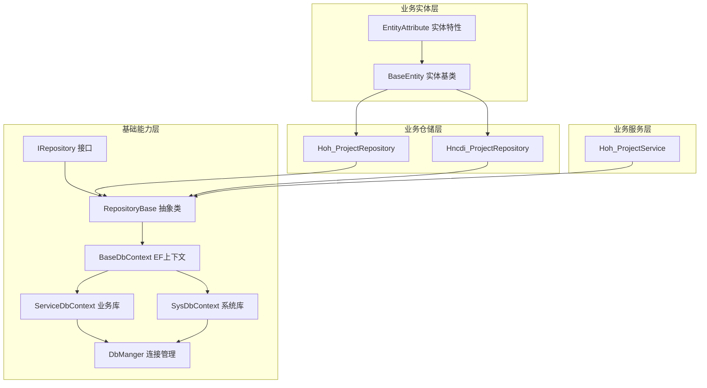
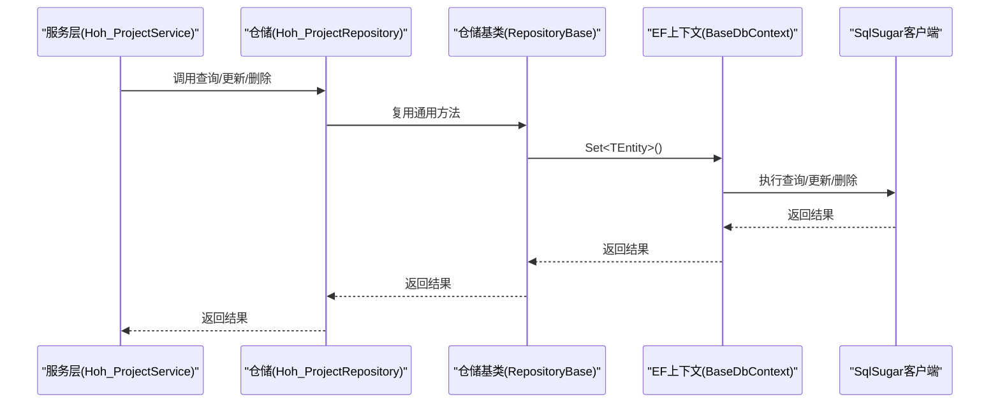
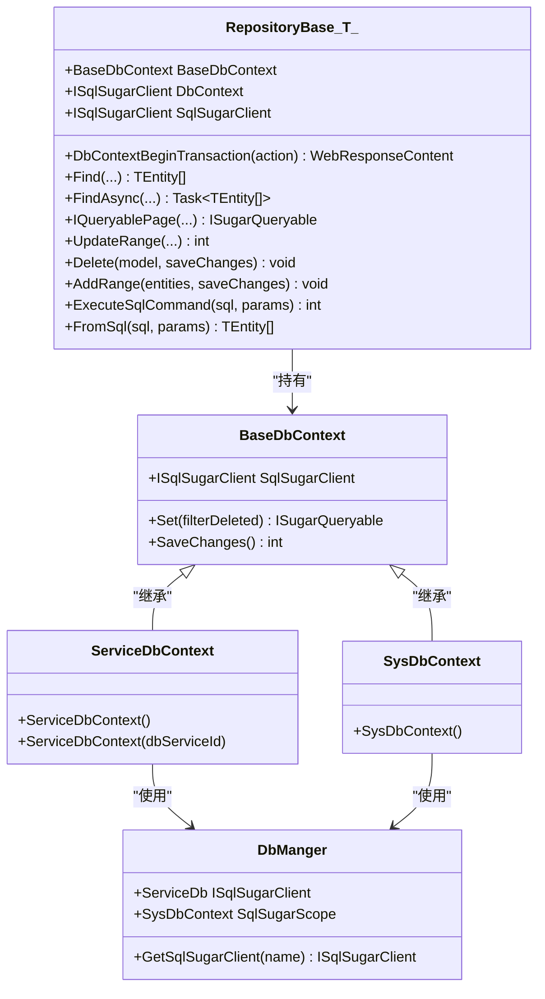
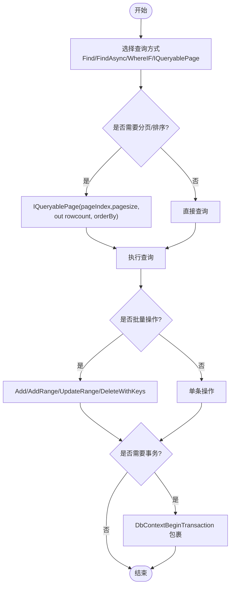
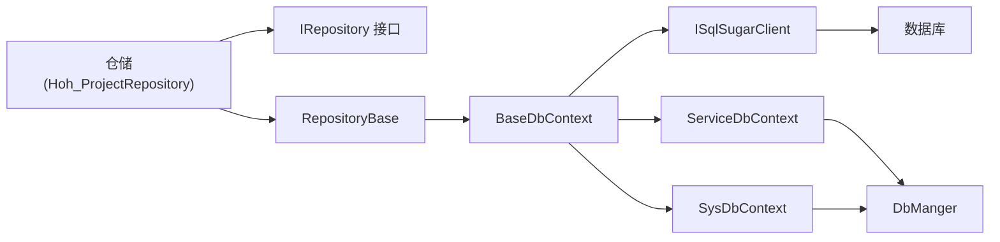

# 仓储模式基类设计

<cite>
**本文引用的文件**
- [RepositoryBase.cs](file://VolPro.Core/BaseProvider/RepositoryBase.cs)
- [IRepository.cs](file://VolPro.Core/BaseProvider/IRepository.cs)
- [BaseDbContext.cs](file://VolPro.Core/EFDbContext/BaseDbContext.cs)
- [ServiceDbContext.cs](file://VolPro.Core/EFDbContext/ServiceDbContext.cs)
- [SysDbContext.cs](file://VolPro.Core/EFDbContext/SysDbContext.cs)
- [DbManger.cs](file://VolPro.Core/DbSqlSugar/DbManger.cs)
- [Hoh_ProjectRepository.cs](file://Hncdi.HeatOfHydration/Repositories/Hoh/Hoh_ProjectRepository.cs)
- [Hncdi_ProjectRepository.cs](file://Hncdi.HeatOfHydration/Repositories/Project/Hncdi_ProjectRepository.cs)
- [Hoh_ProjectService.cs](file://Hncdi.HeatOfHydration/Services/Hoh/Hoh_ProjectService.cs)
- [EntityAttribute.cs](file://VolPro.Entity/AttributeManager/EntityAttribute.cs)
- [BaseEntity.cs](file://VolPro.Entity/SystemModels/BaseEntity.cs)
</cite>

## 目录
1. [引言](#引言)
2. [项目结构](#项目结构)
3. [核心组件](#核心组件)
4. [架构总览](#架构总览)
5. [详细组件分析](#详细组件分析)
6. [依赖关系分析](#依赖关系分析)
7. [性能考量](#性能考量)
8. [故障排查指南](#故障排查指南)
9. [结论](#结论)
10. [附录](#附录)

## 引言
本设计文档围绕“水化热平台”的仓储模式基类进行系统化阐述，重点说明 RepositoryBase 抽象类的设计理念、实现细节与最佳实践。内容涵盖：
- 泛型约束与实体基类要求
- 依赖注入与上下文管理（SqlSugar + EF）
- CRUD 操作标准实现（单表查询、分页查询、条件查询、批量操作）
- 事务处理机制、乐观锁支持与并发控制策略
- 继承与扩展示例、在业务中的使用模式
- 性能优化建议与最佳实践

## 项目结构
仓储层位于 VolPro.Core 基础能力模块，结合 Hncdi.HeatOfHydration 的具体业务实体，形成“接口 + 基类 + 具体仓储 + 服务层”的分层架构。

**图表来源**
- [IRepository.cs:19-327](file://VolPro.Core/BaseProvider/IRepository.cs#L19-L327)
- [RepositoryBase.cs:29-651](file://VolPro.Core/BaseProvider/RepositoryBase.cs#L29-L651)
- [BaseDbContext.cs:18-161](file://VolPro.Core/EFDbContext/BaseDbContext.cs#L18-L161)
- [ServiceDbContext.cs:13-31](file://VolPro.Core/EFDbContext/ServiceDbContext.cs#L13-L31)
- [SysDbContext.cs:13-20](file://VolPro.Core/EFDbContext/SysDbContext.cs#L13-L20)
- [DbManger.cs:21-159](file://VolPro.Core/DbSqlSugar/DbManger.cs#L21-L159)
- [Hoh_ProjectRepository.cs:13-24](file://Hncdi.HeatOfHydration/Repositories/Hoh/Hoh_ProjectRepository.cs#L13-L24)
- [Hncdi_ProjectRepository.cs:13-24](file://Hncdi.HeatOfHydration/Repositories/Project/Hncdi_ProjectRepository.cs#L13-L24)
- [Hoh_ProjectService.cs:16-23](file://Hncdi.HeatOfHydration/Services/Hoh/Hoh_ProjectService.cs#L16-L23)
- [BaseEntity.cs:7-10](file://VolPro.Entity/SystemModels/BaseEntity.cs#L7-L10)
- [EntityAttribute.cs:9-39](file://VolPro.Entity/AttributeManager/EntityAttribute.cs#L9-L39)

**章节来源**
- [IRepository.cs:19-327](file://VolPro.Core/BaseProvider/IRepository.cs#L19-L327)
- [RepositoryBase.cs:29-651](file://VolPro.Core/BaseProvider/RepositoryBase.cs#L29-L651)
- [BaseDbContext.cs:18-161](file://VolPro.Core/EFDbContext/BaseDbContext.cs#L18-L161)
- [ServiceDbContext.cs:13-31](file://VolPro.Core/EFDbContext/ServiceDbContext.cs#L13-L31)
- [SysDbContext.cs:13-20](file://VolPro.Core/EFDbContext/SysDbContext.cs#L13-L20)
- [DbManger.cs:21-159](file://VolPro.Core/DbSqlSugar/DbManger.cs#L21-L159)
- [Hoh_ProjectRepository.cs:13-24](file://Hncdi.HeatOfHydration/Repositories/Hoh/Hoh_ProjectRepository.cs#L13-L24)
- [Hncdi_ProjectRepository.cs:13-24](file://Hncdi.HeatOfHydration/Repositories/Project/Hncdi_ProjectRepository.cs#L13-L24)
- [Hoh_ProjectService.cs:16-23](file://Hncdi.HeatOfHydration/Services/Hoh/Hoh_ProjectService.cs#L16-L23)
- [BaseEntity.cs:7-10](file://VolPro.Entity/SystemModels/BaseEntity.cs#L7-L10)
- [EntityAttribute.cs:9-39](file://VolPro.Entity/AttributeManager/EntityAttribute.cs#L9-L39)

## 核心组件
- 抽象仓储基类 RepositoryBase<TEntity>：提供统一的 CRUD、分页、条件查询、事务、批量操作等能力，并通过泛型约束确保实体具备 BaseEntity 基类。
- 接口 IRepository<TEntity>：定义仓储契约，便于替换实现与依赖注入。
- EF 上下文 BaseDbContext：桥接 SqlSugar 与 EF，提供 Set<TEntity>()、SaveChanges() 等能力。
- 业务库/系统库上下文 ServiceDbContext、SysDbContext：分别指向业务库与系统库连接。
- 连接管理 DbManger：集中管理多租户/多库连接，按需动态切换。
- 实体基类 BaseEntity 与实体特性 EntityAttribute：统一实体元信息与行为（如明细表、数据库服务器标识）。

**章节来源**
- [RepositoryBase.cs:29-651](file://VolPro.Core/BaseProvider/RepositoryBase.cs#L29-L651)
- [IRepository.cs:19-327](file://VolPro.Core/BaseProvider/IRepository.cs#L19-L327)
- [BaseDbContext.cs:18-161](file://VolPro.Core/EFDbContext/BaseDbContext.cs#L18-L161)
- [ServiceDbContext.cs:13-31](file://VolPro.Core/EFDbContext/ServiceDbContext.cs#L13-L31)
- [SysDbContext.cs:13-20](file://VolPro.Core/EFDbContext/SysDbContext.cs#L13-L20)
- [DbManger.cs:21-159](file://VolPro.Core/DbSqlSugar/DbManger.cs#L21-L159)
- [BaseEntity.cs:7-10](file://VolPro.Entity/SystemModels/BaseEntity.cs#L7-L10)
- [EntityAttribute.cs:9-39](file://VolPro.Entity/AttributeManager/EntityAttribute.cs#L9-L39)

## 架构总览
仓储层以 RepositoryBase 为核心，向上承接服务层调用，向下通过 BaseDbContext 将请求路由至 SqlSugar 客户端；DbManger 提供连接池与多租户/多库支持；实体层通过 EntityAttribute 描述实体元信息，支持明细表联动更新。

**图表来源**
- [Hoh_ProjectService.cs:16-23](file://Hncdi.HeatOfHydration/Services/Hoh/Hoh_ProjectService.cs#L16-L23)
- [Hoh_ProjectRepository.cs:13-24](file://Hncdi.HeatOfHydration/Repositories/Hoh/Hoh_ProjectRepository.cs#L13-L24)
- [RepositoryBase.cs:57-60](file://VolPro.Core/BaseProvider/RepositoryBase.cs#L57-L60)
- [BaseDbContext.cs:32-35](file://VolPro.Core/EFDbContext/BaseDbContext.cs#L32-L35)

## 详细组件分析

### 抽象仓储基类 RepositoryBase<TEntity>
设计理念
- 以泛型约束 TEntity : BaseEntity，确保所有仓储操作面向统一实体基类。
- 通过 BaseDbContext 暴露 SqlSugarClient，统一使用 SqlSugar 的高性能 ORM 能力。
- 提供事务、条件查询、分页、批量插入/更新/删除、明细联动更新等能力。

关键实现要点
- 上下文与依赖注入
  - 构造函数接收 BaseDbContext，内部通过 BaseDbContext.SqlSugarClient 获取 ISqlSugarClient。
  - 通过 DbManger 与 ServiceDbContext/SysDbContext 配合，实现业务库/系统库的连接管理。
- 事务处理
  - DbContextBeginTransaction 包裹传入委托，自动提交/回滚；异常时统一回滚并返回错误响应。
- 条件查询与分页
  - Find/FindAsync 提供单表查询与投影查询。
  - WhereIF 支持“条件存在才参与查询”的便捷语法。
  - IQueryablePage 支持分页与排序字典。
- 批量与明细联动更新
  - UpdateRange 支持指定字段更新与全量更新。
  - UpdateRange<TEntity>(..., updateDetail: true) 通过实体特性 EntityAttribute 的 DetailTable 识别明细集合，自动完成新增、修改、删除统计与执行。
- 删除与主键批量删除
  - Delete/DeleteWithKeys 支持实体删除与主键批量删除，支持分表场景。
- 原子写入与自增
  - Add/AddRange 支持雪花 ID 自动生成（当启用 AppSetting.UseSnow 且主键为 long）。
  - AddWithSetIdentity 支持写入后返回自增主键。
- SQL 执行
  - ExecuteSqlCommand/FromSql 提供原生 SQL 执行与查询能力。

**图表来源**
- [RepositoryBase.cs:29-651](file://VolPro.Core/BaseProvider/RepositoryBase.cs#L29-L651)
- [BaseDbContext.cs:18-161](file://VolPro.Core/EFDbContext/BaseDbContext.cs#L18-L161)
- [ServiceDbContext.cs:13-31](file://VolPro.Core/EFDbContext/ServiceDbContext.cs#L13-L31)
- [SysDbContext.cs:13-20](file://VolPro.Core/EFDbContext/SysDbContext.cs#L13-L20)
- [DbManger.cs:21-159](file://VolPro.Core/DbSqlSugar/DbManger.cs#L21-L159)

**章节来源**
- [RepositoryBase.cs:29-651](file://VolPro.Core/BaseProvider/RepositoryBase.cs#L29-L651)
- [BaseDbContext.cs:18-161](file://VolPro.Core/EFDbContext/BaseDbContext.cs#L18-L161)
- [ServiceDbContext.cs:13-31](file://VolPro.Core/EFDbContext/ServiceDbContext.cs#L13-L31)
- [SysDbContext.cs:13-20](file://VolPro.Core/EFDbContext/SysDbContext.cs#L13-L20)
- [DbManger.cs:21-159](file://VolPro.Core/DbSqlSugar/DbManger.cs#L21-L159)

### 接口 IRepository<TEntity>
职责与契约
- 统一声明仓储能力：查询、分页、条件、事务、更新、删除、批量、SQL 执行等。
- 明确返回类型与参数约定，便于替换实现与测试。

**章节来源**
- [IRepository.cs:19-327](file://VolPro.Core/BaseProvider/IRepository.cs#L19-L327)

### EF 上下文 BaseDbContext 与连接管理
- BaseDbContext：封装 SqlSugarClient，提供 Set<TEntity>() 与 SaveChanges()。
- ServiceDbContext/SysDbContext：分别绑定业务库与系统库连接。
- DbManger：集中管理连接配置、动态租户分库、系统库 Scope。

**章节来源**
- [BaseDbContext.cs:18-161](file://VolPro.Core/EFDbContext/BaseDbContext.cs#L18-L161)
- [ServiceDbContext.cs:13-31](file://VolPro.Core/EFDbContext/ServiceDbContext.cs#L13-L31)
- [SysDbContext.cs:13-20](file://VolPro.Core/EFDbContext/SysDbContext.cs#L13-L20)
- [DbManger.cs:21-159](file://VolPro.Core/DbSqlSugar/DbManger.cs#L21-L159)

### 实体基类 BaseEntity 与实体特性 EntityAttribute
- BaseEntity：所有业务实体的基类，确保仓储泛型约束成立。
- EntityAttribute：描述真实表名、明细表、数据库服务器标识等元信息，用于明细联动更新与多库路由。

**章节来源**
- [BaseEntity.cs:7-10](file://VolPro.Entity/SystemModels/BaseEntity.cs#L7-L10)
- [EntityAttribute.cs:9-39](file://VolPro.Entity/AttributeManager/EntityAttribute.cs#L9-L39)

### 事务处理机制与并发控制
事务处理
- DbContextBeginTransaction：包裹业务委托，根据返回的 WebResponseContent.Status 判断提交或回滚；异常时统一回滚并返回错误消息。
- 服务层在需要原子性操作时，应调用 repository.DbContextBeginTransaction 包裹业务流程。

并发控制与乐观锁
- 当前仓储基类未内置显式的“版本号/时间戳”乐观锁字段与自动检测机制。
- 建议在实体中增加版本号字段并在 UpdateRange 中显式指定更新字段，结合数据库层面的并发控制策略（如行级锁、唯一索引）实现并发安全。

**章节来源**
- [RepositoryBase.cs:67-96](file://VolPro.Core/BaseProvider/RepositoryBase.cs#L67-L96)
- [Hoh_ProjectService.cs:16-23](file://Hncdi.HeatOfHydration/Services/Hoh/Hoh_ProjectService.cs#L16-L23)

### CRUD 标准实现与使用模式
- 单表查询
  - 同步：Find(predicate, filterDeleted)
  - 异步：FindAsync/FindFirstAsync/FindAsyncFirst
  - 投影：Find(predicate, selector, filterDeleted)
- 条件查询
  - WhereIF 支持“条件存在才参与查询”的便捷语法。
- 分页查询
  - IQueryablePage 支持分页与排序字典。
- 批量操作
  - Add/AddRange：支持雪花 ID 自动生成（long 主键）。
  - UpdateRange：支持指定字段更新与全量更新。
  - DeleteWithKeys：主键批量删除。
- 明细联动更新
  - UpdateRange<TEntity>(..., updateDetail: true)：基于 EntityAttribute.DetailTable 识别明细集合，自动完成新增、修改、删除统计与执行。

**图表来源**
- [RepositoryBase.cs:108-121](file://VolPro.Core/BaseProvider/RepositoryBase.cs#L108-L121)
- [RepositoryBase.cs:208-211](file://VolPro.Core/BaseProvider/RepositoryBase.cs#L208-L211)
- [RepositoryBase.cs:250-283](file://VolPro.Core/BaseProvider/RepositoryBase.cs#L250-L283)
- [RepositoryBase.cs:569-597](file://VolPro.Core/BaseProvider/RepositoryBase.cs#L569-L597)
- [RepositoryBase.cs:67-96](file://VolPro.Core/BaseProvider/RepositoryBase.cs#L67-L96)

**章节来源**
- [RepositoryBase.cs:108-121](file://VolPro.Core/BaseProvider/RepositoryBase.cs#L108-L121)
- [RepositoryBase.cs:208-211](file://VolPro.Core/BaseProvider/RepositoryBase.cs#L208-L211)
- [RepositoryBase.cs:250-283](file://VolPro.Core/BaseProvider/RepositoryBase.cs#L250-L283)
- [RepositoryBase.cs:569-597](file://VolPro.Core/BaseProvider/RepositoryBase.cs#L569-L597)
- [RepositoryBase.cs:67-96](file://VolPro.Core/BaseProvider/RepositoryBase.cs#L67-L96)

### 继承与扩展示例
- 继承基类
  - Hoh_ProjectRepository/Hncdi_ProjectRepository：构造函数注入 ServiceDbContext，继承 RepositoryBase<Hoh_Project>/RepositoryBase<Hncdi_Project>。
- 在服务层使用
  - Hoh_ProjectService：通过 AutofacContainerModule.GetService 获取仓储实例，复用基类提供的 CRUD 与事务能力。

**章节来源**
- [Hoh_ProjectRepository.cs:13-24](file://Hncdi.HeatOfHydration/Repositories/Hoh/Hoh_ProjectRepository.cs#L13-L24)
- [Hncdi_ProjectRepository.cs:13-24](file://Hncdi.HeatOfHydration/Repositories/Project/Hncdi_ProjectRepository.cs#L13-L24)
- [Hoh_ProjectService.cs:16-23](file://Hncdi.HeatOfHydration/Services/Hoh/Hoh_ProjectService.cs#L16-L23)

## 依赖关系分析
- 仓储层依赖于 EF 上下文与 SqlSugar 客户端，通过 BaseDbContext 暴露统一接口。
- 业务仓储通过 Autofac 注入 DbContext，实现运行时依赖注入。
- DbManger 提供连接配置与动态租户分库能力，避免硬编码与分散配置。

**图表来源**
- [Hoh_ProjectRepository.cs:13-24](file://Hncdi.HeatOfHydration/Repositories/Hoh/Hoh_ProjectRepository.cs#L13-L24)
- [IRepository.cs:19-327](file://VolPro.Core/BaseProvider/IRepository.cs#L19-L327)
- [RepositoryBase.cs:29-651](file://VolPro.Core/BaseProvider/RepositoryBase.cs#L29-L651)
- [BaseDbContext.cs:18-161](file://VolPro.Core/EFDbContext/BaseDbContext.cs#L18-L161)
- [ServiceDbContext.cs:13-31](file://VolPro.Core/EFDbContext/ServiceDbContext.cs#L13-L31)
- [SysDbContext.cs:13-20](file://VolPro.Core/EFDbContext/SysDbContext.cs#L13-L20)
- [DbManger.cs:21-159](file://VolPro.Core/DbSqlSugar/DbManger.cs#L21-L159)

**章节来源**
- [Hoh_ProjectRepository.cs:13-24](file://Hncdi.HeatOfHydration/Repositories/Hoh/Hoh_ProjectRepository.cs#L13-L24)
- [IRepository.cs:19-327](file://VolPro.Core/BaseProvider/IRepository.cs#L19-L327)
- [RepositoryBase.cs:29-651](file://VolPro.Core/BaseProvider/RepositoryBase.cs#L29-L651)
- [BaseDbContext.cs:18-161](file://VolPro.Core/EFDbContext/BaseDbContext.cs#L18-L161)
- [ServiceDbContext.cs:13-31](file://VolPro.Core/EFDbContext/ServiceDbContext.cs#L13-L31)
- [SysDbContext.cs:13-20](file://VolPro.Core/EFDbContext/SysDbContext.cs#L13-L20)
- [DbManger.cs:21-159](file://VolPro.Core/DbSqlSugar/DbManger.cs#L21-L159)

## 性能考量
- 批量写入
  - 使用 AddRange 并在 saveChanges=false 时延迟提交，减少往返次数；必要时一次性 SaveChanges。
- 分页与排序
  - 使用 IQueryablePage 的排序字典，避免在内存中二次排序。
- 条件查询
  - WhereIF 仅在条件存在时参与查询，减少无效条件带来的索引失效风险。
- 明细联动更新
  - UpdateRange<Detail> 对新增/修改/删除分别统计，减少不必要的数据库往返。
- 连接管理
  - DbManger 统一管理连接，避免重复创建连接；业务库/系统库分离，降低相互影响。
- 乐观锁与并发
  - 建议在实体中增加版本号字段并在 UpdateRange 中显式指定字段，结合数据库唯一索引与行级锁提升并发安全性。

[本节为通用指导，无需特定文件引用]

## 故障排查指南
- 事务异常回滚
  - DbContextBeginTransaction 捕获异常并统一回滚；检查返回的 WebResponseContent 错误信息定位问题。
- 并发冲突
  - 若出现“无法跟踪相同主键值的实体”等跟踪异常，可在更新前调用 Detached/DetachedRange 取消跟踪。
- 分表场景
  - 检查实体是否标注分表特性，确保 Delete/Insert/Update 调用 SplitTable。
- 多租户/多库
  - 确认 DbManger.GetServiceDb 与 ServiceDbContext 的连接配置一致；核对用户上下文中的服务 ID。

**章节来源**
- [RepositoryBase.cs:67-96](file://VolPro.Core/BaseProvider/RepositoryBase.cs#L67-L96)
- [RepositoryBase.cs:638-648](file://VolPro.Core/BaseProvider/RepositoryBase.cs#L638-L648)
- [RepositoryBase.cs:485-488](file://VolPro.Core/BaseProvider/RepositoryBase.cs#L485-L488)
- [DbManger.cs:62-90](file://VolPro.Core/DbSqlSugar/DbManger.cs#L62-L90)

## 结论
RepositoryBase 通过统一的泛型约束、SqlSugar 集成与 EF 上下文桥接，提供了高内聚、低耦合的仓储能力。配合 DbManger 的连接管理与服务层的事务封装，能够满足水化热平台的复杂业务需求。建议在实体层引入版本号字段与显式字段更新策略，进一步完善并发控制与性能优化。

[本节为总结性内容，无需特定文件引用]

## 附录
- 最佳实践清单
  - 明确实体基类与特性标注，确保明细联动与多库路由正确。
  - 使用 WhereIF 与 IQueryablePage 提升查询灵活性与性能。
  - 在服务层使用 DbContextBeginTransaction 包裹需要原子性的业务流程。
  - 批量写入时延迟 SaveChanges，减少网络往返。
  - 在高并发场景下引入版本号字段与唯一索引，结合数据库锁保障一致性。

[本节为通用指导，无需特定文件引用]