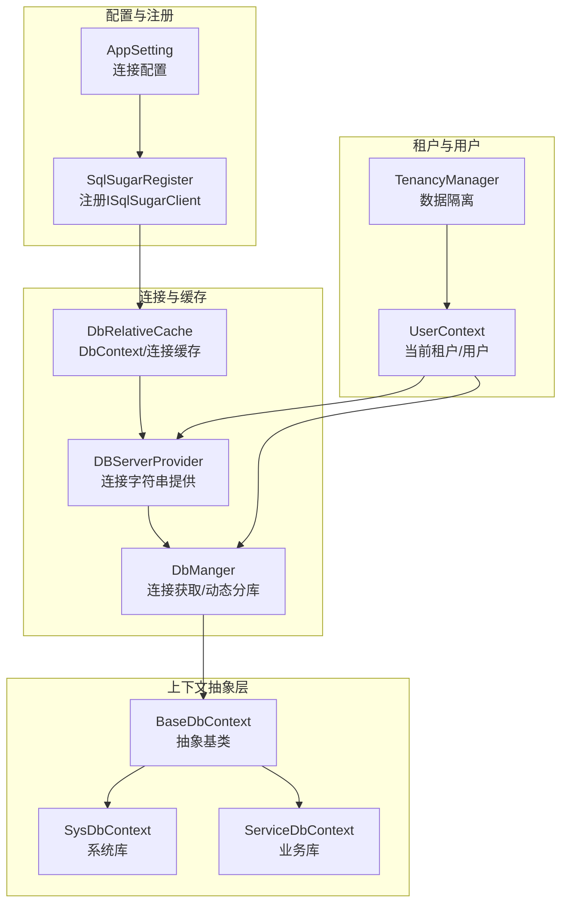
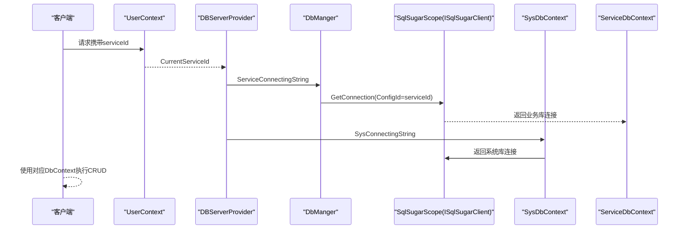
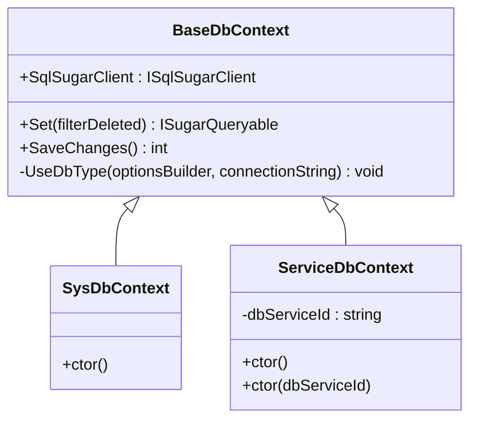
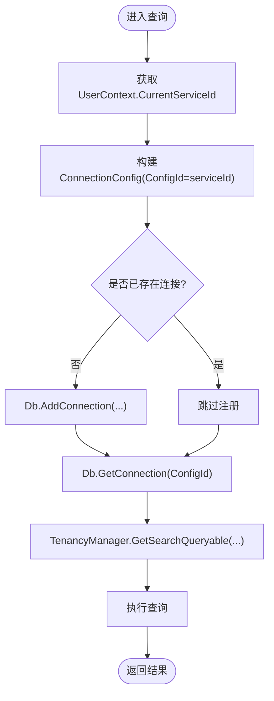
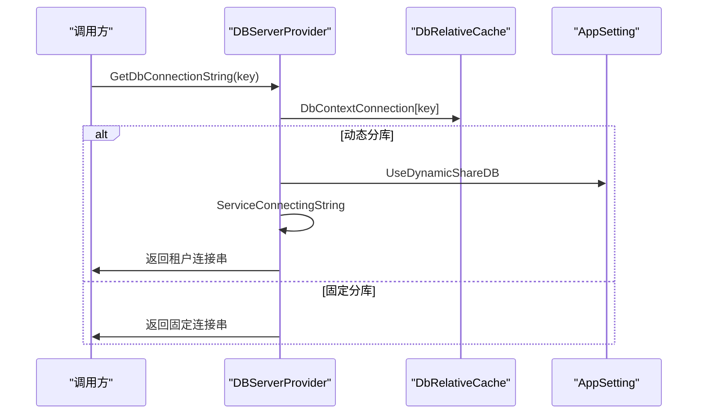
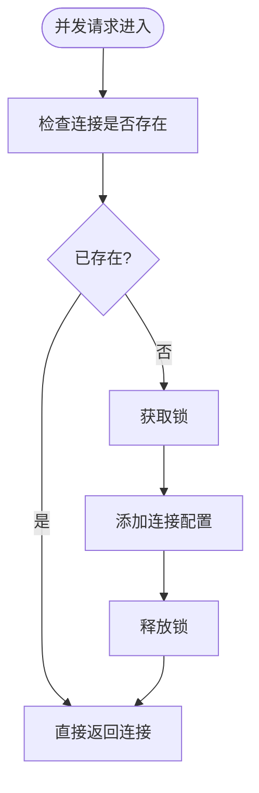
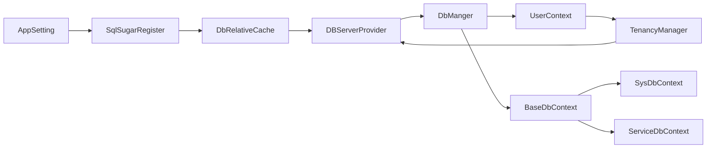

# 数据库连接管理

<cite>
**本文引用的文件**
- [BaseDbContext.cs](file://VolPro.Core/EFDbContext/BaseDbContext.cs)
- [DbContext.cs](file://VolPro.Core/EFDbContext/DbContext.cs)
- [SysDbContext.cs](file://VolPro.Core/EFDbContext/SysDbContext.cs)
- [ServiceDbContext.cs](file://VolPro.Core/EFDbContext/ServiceDbContext.cs)
- [DBServerProvider.cs](file://VolPro.Core/DbManager/DBServerProvider.cs)
- [DbRelativeCache.cs](file://VolPro.Core/DbManager/DbRelativeCache.cs)
- [DbManger.cs](file://VolPro.Core/DbSqlSugar/DbManger.cs)
- [SqlSugarRegister.cs](file://VolPro.Core/DbSqlSugar/SqlSugarRegister.cs)
- [AppSetting.cs](file://VolPro.Core/Configuration/AppSetting.cs)
- [UserContext.cs](file://VolPro.Core/UserManager/UserContext.cs)
- [TenancyManager.cs](file://VolPro.Core/Tenancy/TenancyManager.cs)
- [AutofacContainerModule.cs](file://VolPro.Core/Extensions/AutofacManager/AutofacContainerModule.cs)
</cite>

## 目录
1. [简介](#简介)
2. [项目结构](#项目结构)
3. [核心组件](#核心组件)
4. [架构总览](#架构总览)
5. [组件详解](#组件详解)
6. [依赖关系分析](#依赖关系分析)
7. [性能考量](#性能考量)
8. [故障排查指南](#故障排查指南)
9. [结论](#结论)

## 简介
本文件面向“水化热平台”的数据库连接管理，围绕以下目标展开：
- EF Core DbContext 生命周期管理与多租户支持机制
- 数据库服务器提供者的设计模式：动态切换数据库与连接管理策略
- 数据库上下文的线程安全与并发访问控制
- 连接池配置与性能调优建议
- 故障转移与高可用配置方案

平台采用 SqlSugar 作为 ORM，同时保留 EF Core 的 DbContext 抽象层以兼容既有设计。系统通过运行时装配与依赖注入，实现多数据库、多租户、动态分库与连接复用。

## 项目结构
与数据库连接管理相关的关键目录与文件如下：
- EFDbContext：EF Core 抽象与具体上下文
- DbManager：数据库连接提供者与缓存
- DbSqlSugar：SqlSugar 注册、连接管理与扩展
- Configuration：应用配置与连接字符串来源
- UserManager：用户上下文与租户选择
- Tenancy：多租户数据隔离策略
- Extensions：依赖注入容器扩展

**图表来源**
- [SqlSugarRegister.cs:76-131](file://VolPro.Core/DbSqlSugar/SqlSugarRegister.cs#L76-L131)
- [DbRelativeCache.cs:30-93](file://VolPro.Core/DbManager/DbRelativeCache.cs#L30-L93)
- [DBServerProvider.cs:92-127](file://VolPro.Core/DbManager/DBServerProvider.cs#L92-L127)
- [DbManger.cs:115-131](file://VolPro.Core/DbSqlSugar/DbManger.cs#L115-L131)
- [BaseDbContext.cs:18-40](file://VolPro.Core/EFDbContext/BaseDbContext.cs#L18-L40)
- [SysDbContext.cs:13-18](file://VolPro.Core/EFDbContext/SysDbContext.cs#L13-L18)
- [ServiceDbContext.cs:13-29](file://VolPro.Core/EFDbContext/ServiceDbContext.cs#L13-L29)
- [UserContext.cs:565-589](file://VolPro.Core/UserManager/UserContext.cs#L565-L589)
- [TenancyManager.cs:26-89](file://VolPro.Core/Tenancy/TenancyManager.cs#L26-L89)

**章节来源**
- [SqlSugarRegister.cs:76-131](file://VolPro.Core/DbSqlSugar/SqlSugarRegister.cs#L76-L131)
- [DbRelativeCache.cs:30-93](file://VolPro.Core/DbManager/DbRelativeCache.cs#L30-L93)
- [DBServerProvider.cs:92-127](file://VolPro.Core/DbManager/DBServerProvider.cs#L92-L127)
- [DbManger.cs:115-131](file://VolPro.Core/DbSqlSugar/DbManger.cs#L115-L131)
- [BaseDbContext.cs:18-40](file://VolPro.Core/EFDbContext/BaseDbContext.cs#L18-L40)
- [SysDbContext.cs:13-18](file://VolPro.Core/EFDbContext/SysDbContext.cs#L13-L18)
- [ServiceDbContext.cs:13-29](file://VolPro.Core/EFDbContext/ServiceDbContext.cs#L13-L29)
- [UserContext.cs:565-589](file://VolPro.Core/UserManager/UserContext.cs#L565-L589)
- [TenancyManager.cs:26-89](file://VolPro.Core/Tenancy/TenancyManager.cs#L26-L89)

## 核心组件
- BaseDbContext：抽象基类，桥接 EF Core 与 SqlSugar，提供 Set<T>() 与 SaveChanges() 的委托实现
- SysDbContext：系统库上下文，绑定 SqlSugar 单例连接
- ServiceDbContext：业务库上下文，支持动态租户分库构造
- DbManger：统一连接入口，按需动态添加连接配置并获取连接
- DBServerProvider：根据请求上下文与用户选择，提供系统库与业务库连接字符串
- DbRelativeCache：运行时扫描并缓存 DbContext 类型、实体类型与连接字符串
- SqlSugarRegister：注册 ISqlSugarClient，批量加载配置文件中的连接并初始化
- AppSetting：读取配置节 Connection，提供默认连接、DBType、动态分库开关等
- UserContext：解析请求头选择租户，提供 CurrentServiceId
- TenancyManager：基于用户角色与表名进行数据隔离

**章节来源**
- [BaseDbContext.cs:18-40](file://VolPro.Core/EFDbContext/BaseDbContext.cs#L18-L40)
- [SysDbContext.cs:13-18](file://VolPro.Core/EFDbContext/SysDbContext.cs#L13-L18)
- [ServiceDbContext.cs:13-29](file://VolPro.Core/EFDbContext/ServiceDbContext.cs#L13-L29)
- [DbManger.cs:26-90](file://VolPro.Core/DbSqlSugar/DbManger.cs#L26-L90)
- [DBServerProvider.cs:92-127](file://VolPro.Core/DbManager/DBServerProvider.cs#L92-L127)
- [DbRelativeCache.cs:30-93](file://VolPro.Core/DbManager/DbRelativeCache.cs#L30-L93)
- [SqlSugarRegister.cs:76-131](file://VolPro.Core/DbSqlSugar/SqlSugarRegister.cs#L76-L131)
- [AppSetting.cs:68-131](file://VolPro.Core/Configuration/AppSetting.cs#L68-L131)
- [UserContext.cs:565-589](file://VolPro.Core/UserManager/UserContext.cs#L565-L589)
- [TenancyManager.cs:26-89](file://VolPro.Core/Tenancy/TenancyManager.cs#L26-L89)

## 架构总览
系统通过依赖注入注册 SqlSugarScope，内部维护多连接配置；运行时根据 DbContext 名称或用户上下文选择连接。业务库支持动态分库，按用户当前服务Id生成连接配置Id，实现租户级连接隔离。

**图表来源**
- [UserContext.cs:565-589](file://VolPro.Core/UserManager/UserContext.cs#L565-L589)
- [DBServerProvider.cs:116-127](file://VolPro.Core/DbManager/DBServerProvider.cs#L116-L127)
- [DbManger.cs:115-131](file://VolPro.Core/DbSqlSugar/DbManger.cs#L115-L131)
- [SysDbContext.cs:13-18](file://VolPro.Core/EFDbContext/SysDbContext.cs#L13-L18)
- [ServiceDbContext.cs:13-29](file://VolPro.Core/EFDbContext/ServiceDbContext.cs#L13-L29)

## 组件详解

### EF Core DbContext 生命周期与桥接
- BaseDbContext 将 EF Core 的 Set<T>() 与 SaveChanges() 委托给 SqlSugar 的 ISqlSugarClient，实现“以 EF 接口、SqlSugar 实现”的桥接模式
- SysDbContext 与 ServiceDbContext 分别绑定系统库与业务库的 SqlSugarScope
- DbContext 抽象类保留了可扩展点，便于未来接入真实 EF Core 提供者

**图表来源**
- [BaseDbContext.cs:18-40](file://VolPro.Core/EFDbContext/BaseDbContext.cs#L18-L40)
- [SysDbContext.cs:13-18](file://VolPro.Core/EFDbContext/SysDbContext.cs#L13-L18)
- [ServiceDbContext.cs:13-29](file://VolPro.Core/EFDbContext/ServiceDbContext.cs#L13-L29)

**章节来源**
- [BaseDbContext.cs:18-40](file://VolPro.Core/EFDbContext/BaseDbContext.cs#L18-L40)
- [SysDbContext.cs:13-18](file://VolPro.Core/EFDbContext/SysDbContext.cs#L13-L18)
- [ServiceDbContext.cs:13-29](file://VolPro.Core/EFDbContext/ServiceDbContext.cs#L13-L29)

### 多租户支持机制
- 租户选择：UserContext 从请求头解析 serviceId，并结合角色权限校验，确定当前租户
- 动态分库：DbManger.ServiceDb 以 CurrentServiceId 作为 ConfigId，按需添加连接配置并获取连接
- 数据隔离：TenancyManager 对表名进行分支处理，默认调用 CreateTenancyFilter<T>() 应用数据权限过滤

**图表来源**
- [UserContext.cs:565-589](file://VolPro.Core/UserManager/UserContext.cs#L565-L589)
- [DbManger.cs:26-90](file://VolPro.Core/DbSqlSugar/DbManger.cs#L26-L90)
- [TenancyManager.cs:26-89](file://VolPro.Core/Tenancy/TenancyManager.cs#L26-L89)

**章节来源**
- [UserContext.cs:565-589](file://VolPro.Core/UserManager/UserContext.cs#L565-L589)
- [DbManger.cs:26-90](file://VolPro.Core/DbSqlSugar/DbManger.cs#L26-L90)
- [TenancyManager.cs:26-89](file://VolPro.Core/Tenancy/TenancyManager.cs#L26-L89)

### 数据库服务器提供者与动态切换
- DBServerProvider 提供系统库与业务库连接字符串的统一入口
- ServiceConnectingString 根据 AppSetting.UseDynamicShareDB 决定使用动态租户分库或固定 ServiceDbContext
- DbRelativeCache 在启动时扫描 Core 与 Entity 程序集，缓存 DbContext 类型、实体类型与连接字符串

**图表来源**
- [DBServerProvider.cs:92-127](file://VolPro.Core/DbManager/DBServerProvider.cs#L92-L127)
- [DbRelativeCache.cs:144-159](file://VolPro.Core/DbManager/DbRelativeCache.cs#L144-L159)
- [AppSetting.cs:68-131](file://VolPro.Core/Configuration/AppSetting.cs#L68-L131)

**章节来源**
- [DBServerProvider.cs:92-127](file://VolPro.Core/DbManager/DBServerProvider.cs#L92-L127)
- [DbRelativeCache.cs:144-159](file://VolPro.Core/DbManager/DbRelativeCache.cs#L144-L159)
- [AppSetting.cs:68-131](file://VolPro.Core/Configuration/AppSetting.cs#L68-L131)

### 线程安全与并发访问控制
- 运行时连接注册：DbManger.ServiceDb 与 GetServiceDb 在首次访问时检查并添加连接配置，避免重复注册
- 并发保护：UserContext 内部使用 ConcurrentDictionary 与局部锁，降低锁粒度，提升并发性能
- DI 容器：AutofacContainerModule 通过 RequestServices 获取服务实例，确保请求作用域内的上下文一致性

**图表来源**
- [DbManger.cs:30-56](file://VolPro.Core/DbSqlSugar/DbManger.cs#L30-L56)
- [UserContext.cs:135-302](file://VolPro.Core/UserManager/UserContext.cs#L135-L302)
- [AutofacContainerModule.cs:9-12](file://VolPro.Core/Extensions/AutofacManager/AutofacContainerModule.cs#L9-L12)

**章节来源**
- [DbManger.cs:30-56](file://VolPro.Core/DbSqlSugar/DbManger.cs#L30-L56)
- [UserContext.cs:135-302](file://VolPro.Core/UserManager/UserContext.cs#L135-L302)
- [AutofacContainerModule.cs:9-12](file://VolPro.Core/Extensions/AutofacManager/AutofacContainerModule.cs#L9-L12)

### 连接池配置与性能调优
- 连接注册：SqlSugarRegister.UseSqlSugar 一次性注册所有连接配置，SqlSugarScope 统一管理连接池
- 自动关闭连接：各 ConnectionConfig 设置 IsAutoCloseConnection=true，减少资源泄漏风险
- 日志与性能：全局 AOP OnLogExecuting 输出 SQL，便于定位慢查询；业务库与系统库分别配置日志回调
- 动态分库：按租户 ConfigId 隔离连接，避免跨租户共享连接带来的竞争

建议调优要点（通用指导）：
- 合理设置连接池大小与超时时间，结合压测结果调整
- 对高频查询开启查询跟踪缓存，减少重复解析
- 使用批量写入与事务合并，降低往返次数
- 对大结果集分页查询，避免一次性加载

**章节来源**
- [SqlSugarRegister.cs:76-131](file://VolPro.Core/DbSqlSugar/SqlSugarRegister.cs#L76-L131)
- [DbManger.cs:95-104](file://VolPro.Core/DbSqlSugar/DbManger.cs#L95-L104)

### 故障转移与高可用
- 多连接配置：SqlSugarRegister 一次性注册多个连接配置，便于在应用层进行失败切换
- 动态租户：DbManger.GetServiceDb 支持按租户动态创建连接，便于实现租户级故障隔离
- 配置来源：DbRelativeCache 从配置节 Connection 中读取连接字符串，支持多环境差异化部署
- 建议方案：
  - 主备库：在配置中维护主备连接串，应用层检测失败后切换到备用连接
  - 读写分离：区分业务库读写连接，写库失败时快速回滚或降级
  - 健康检查：定期探测连接可用性，预热连接池，避免冷启动抖动

**章节来源**
- [SqlSugarRegister.cs:84-101](file://VolPro.Core/DbSqlSugar/SqlSugarRegister.cs#L84-L101)
- [DbRelativeCache.cs:23-72](file://VolPro.Core/DbManager/DbRelativeCache.cs#L23-L72)
- [DbManger.cs:62-90](file://VolPro.Core/DbSqlSugar/DbManger.cs#L62-L90)

## 依赖关系分析
- SqlSugarRegister 依赖 AppSetting 与 DBServerProvider，负责注册 ISqlSugarClient
- DbRelativeCache 依赖运行时程序集扫描，缓存 DbContext 与连接字符串
- DBServerProvider 依赖 DbRelativeCache 与 AppSetting，提供连接字符串
- DbManger 依赖 DBServerProvider 与 UserContext，按需动态添加连接
- BaseDbContext 作为 EF 抽象层，SysDbContext 与 ServiceDbContext 绑定具体连接
- TenancyManager 依赖 UserContext 与 DBServerProvider，实现数据隔离

**图表来源**
- [SqlSugarRegister.cs:76-131](file://VolPro.Core/DbSqlSugar/SqlSugarRegister.cs#L76-L131)
- [DbRelativeCache.cs:30-93](file://VolPro.Core/DbManager/DbRelativeCache.cs#L30-L93)
- [DBServerProvider.cs:92-127](file://VolPro.Core/DbManager/DBServerProvider.cs#L92-L127)
- [DbManger.cs:115-131](file://VolPro.Core/DbSqlSugar/DbManger.cs#L115-L131)
- [BaseDbContext.cs:18-40](file://VolPro.Core/EFDbContext/BaseDbContext.cs#L18-L40)
- [SysDbContext.cs:13-18](file://VolPro.Core/EFDbContext/SysDbContext.cs#L13-L18)
- [ServiceDbContext.cs:13-29](file://VolPro.Core/EFDbContext/ServiceDbContext.cs#L13-L29)
- [UserContext.cs:565-589](file://VolPro.Core/UserManager/UserContext.cs#L565-L589)
- [TenancyManager.cs:26-89](file://VolPro.Core/Tenancy/TenancyManager.cs#L26-L89)

**章节来源**
- [SqlSugarRegister.cs:76-131](file://VolPro.Core/DbSqlSugar/SqlSugarRegister.cs#L76-L131)
- [DbRelativeCache.cs:30-93](file://VolPro.Core/DbManager/DbRelativeCache.cs#L30-L93)
- [DBServerProvider.cs:92-127](file://VolPro.Core/DbManager/DBServerProvider.cs#L92-L127)
- [DbManger.cs:115-131](file://VolPro.Core/DbSqlSugar/DbManger.cs#L115-L131)
- [BaseDbContext.cs:18-40](file://VolPro.Core/EFDbContext/BaseDbContext.cs#L18-L40)
- [SysDbContext.cs:13-18](file://VolPro.Core/EFDbContext/SysDbContext.cs#L13-L18)
- [ServiceDbContext.cs:13-29](file://VolPro.Core/EFDbContext/ServiceDbContext.cs#L13-L29)
- [UserContext.cs:565-589](file://VolPro.Core/UserManager/UserContext.cs#L565-L589)
- [TenancyManager.cs:26-89](file://VolPro.Core/Tenancy/TenancyManager.cs#L26-L89)

## 性能考量
- 连接池复用：SqlSugarScope 统一管理连接，避免频繁创建销毁
- 动态分库按需注册：仅在首次访问时添加连接配置，减少启动开销
- 查询日志：OnLogExecuting 输出 SQL，便于识别热点与慢查询
- 并发优化：UserContext 使用细粒度锁与缓存，降低锁竞争
- 建议：
  - 对高频接口开启查询跟踪缓存
  - 批量写入合并事务
  - 大结果集分页与投影查询
  - 连接池大小与超时依据压测结果调优

[本节为通用性能建议，无需特定文件引用]

## 故障排查指南
- 未配置连接：DBServerProvider.GetDbConnectionString 在找不到 key 时抛出异常，检查配置节 Connection
- 动态分库未生效：确认 AppSetting.UseDynamicShareDB 开关与请求头 serviceId 是否正确
- 数据隔离异常：检查 TenancyManager 中针对表名的分支逻辑与 CreateTenancyFilter<T>() 的调用
- 连接泄漏：确认 IsAutoCloseConnection=true 与请求结束后的连接释放
- 日志定位：利用 SqlSugarRegister 与 DbManger 中的日志回调输出 SQL

**章节来源**
- [DBServerProvider.cs:92-99](file://VolPro.Core/DbManager/DBServerProvider.cs#L92-L99)
- [AppSetting.cs:68-131](file://VolPro.Core/Configuration/AppSetting.cs#L68-L131)
- [TenancyManager.cs:26-89](file://VolPro.Core/Tenancy/TenancyManager.cs#L26-L89)
- [SqlSugarRegister.cs:108-126](file://VolPro.Core/DbSqlSugar/SqlSugarRegister.cs#L108-L126)
- [DbManger.cs:95-104](file://VolPro.Core/DbSqlSugar/DbManger.cs#L95-L104)

## 结论
该数据库连接管理方案以 SqlSugar 为核心，结合 EF Core 抽象层与运行时装配，实现了：
- 多数据库、多租户与动态分库的灵活切换
- 基于用户上下文的数据隔离与权限控制
- 可扩展的连接注册与统一连接池管理
- 面向性能与高可用的工程实践建议

通过合理配置与调优，可在保证线程安全与并发性能的同时，满足复杂业务场景下的数据库访问需求。