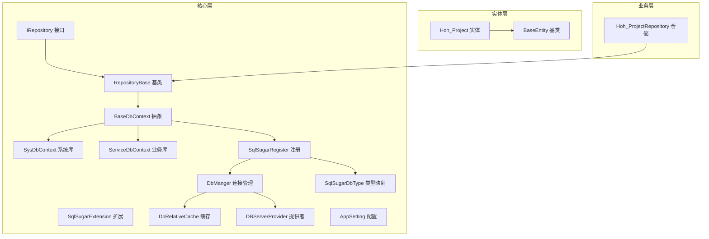
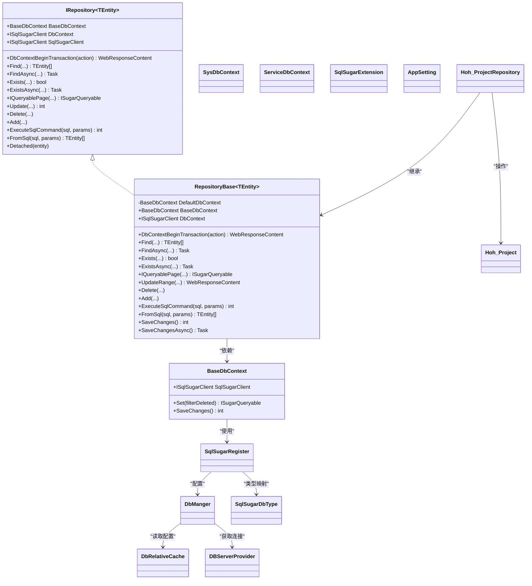
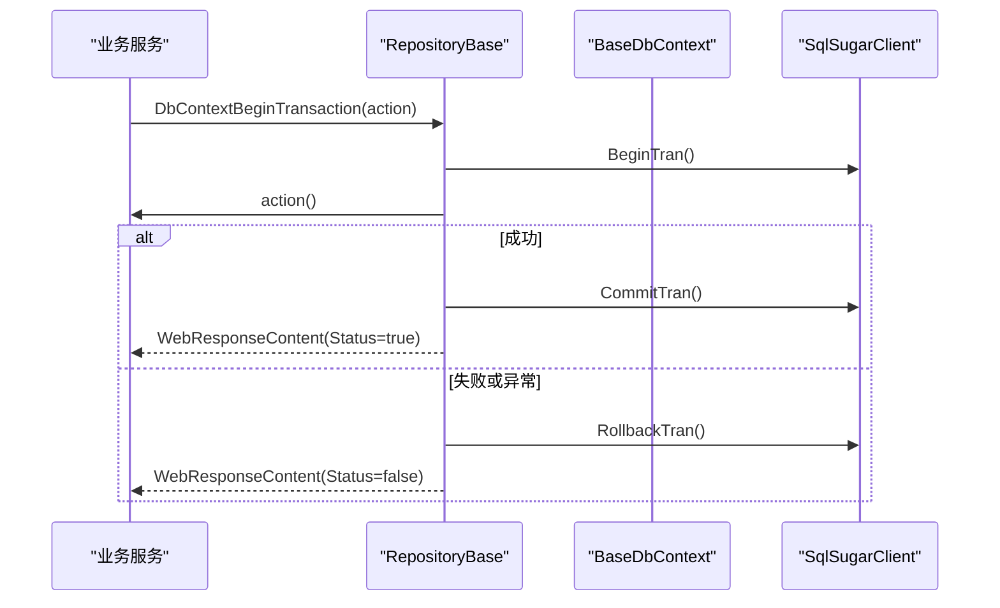
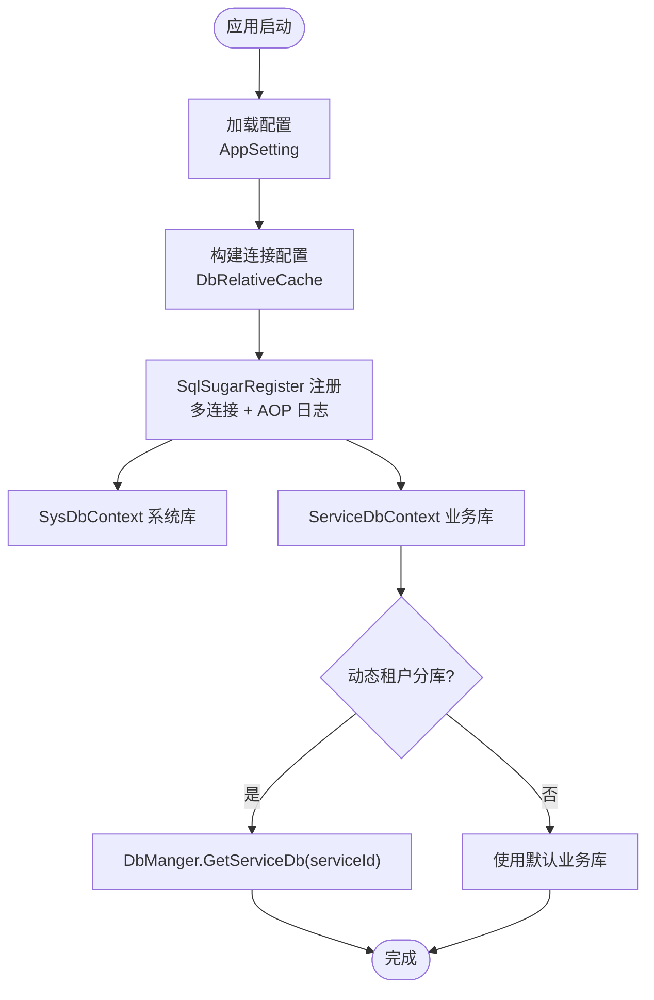
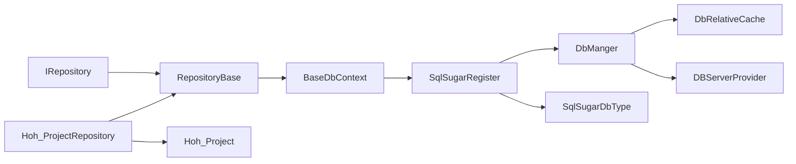

# 数据访问层设计

<cite>
**本文档引用的文件**
- [RepositoryBase.cs](file://VolPro.Core/BaseProvider/RepositoryBase.cs)
- [IRepository.cs](file://VolPro.Core/BaseProvider/IRepository.cs)
- [SqlSugarRegister.cs](file://VolPro.Core/DbSqlSugar/SqlSugarRegister.cs)
- [DbManger.cs](file://VolPro.Core/DbSqlSugar/DbManger.cs)
- [SqlSugarExtension.cs](file://VolPro.Core/DbSqlSugar/SqlSugarExtension.cs)
- [SqlSugarDbType.cs](file://VolPro.Core/DbSqlSugar/SqlSugarDbType.cs)
- [DbRelativeCache.cs](file://VolPro.Core/DbManager/DbRelativeCache.cs)
- [DBServerProvider.cs](file://VolPro.Core/DbManager/DBServerProvider.cs)
- [BaseDbContext.cs](file://VolPro.Core/EFDbContext/BaseDbContext.cs)
- [SysDbContext.cs](file://VolPro.Core/EFDbContext/SysDbContext.cs)
- [ServiceDbContext.cs](file://VolPro.Core/EFDbContext/ServiceDbContext.cs)
- [AppSetting.cs](file://VolPro.Core/Configuration/AppSetting.cs)
- [Hoh_ProjectRepository.cs](file://Hncdi.HeatOfHydration/Repositories/Hoh/Hoh_ProjectRepository.cs)
- [Hoh_Project.cs](file://VolPro.Entity/DomainModels/Hoh/Hoh_Project.cs)
- [BaseEntity.cs](file://VolPro.Entity/SystemModels/BaseEntity.cs)
</cite>

## 目录
1. [引言](#引言)
2. [项目结构](#项目结构)
3. [核心组件](#核心组件)
4. [架构总览](#架构总览)
5. [详细组件分析](#详细组件分析)
6. [依赖关系分析](#依赖关系分析)
7. [性能考虑](#性能考虑)
8. [故障排查指南](#故障排查指南)
9. [结论](#结论)
10. [附录](#附录)

## 引言
本设计文档面向“水化热平台”的数据访问层，系统性阐述基于 SqlSugar 的仓储模式实现与 RepositoryBase 基类设计，解释如何通过统一的仓储接口与 SqlSugar ORM 实现数据持久化；同时覆盖数据库连接管理、事务处理机制、多数据库支持策略、ORM 配置与连接池管理最佳实践，并给出数据访问层的架构图与数据流图，帮助开发者快速理解与扩展。

## 项目结构
数据访问层主要分布在以下模块：
- VolPro.Core：核心基础设施，包含仓储基类、EF DbContext 抽象、SqlSugar 注册与管理、数据库连接缓存与提供者等
- VolPro.Entity：领域模型与系统模型，承载实体定义与特性标注
- Hncdi.HeatOfHydration：业务域仓储与服务的具体实现，以水化热业务为例展示仓储使用

**图表来源**
- [IRepository.cs:19-328](file://VolPro.Core/BaseProvider/IRepository.cs#L19-L328)
- [RepositoryBase.cs:29-651](file://VolPro.Core/BaseProvider/RepositoryBase.cs#L29-L651)
- [BaseDbContext.cs:18-161](file://VolPro.Core/EFDbContext/BaseDbContext.cs#L18-L161)
- [SysDbContext.cs:13-20](file://VolPro.Core/EFDbContext/SysDbContext.cs#L13-L20)
- [ServiceDbContext.cs:13-31](file://VolPro.Core/EFDbContext/ServiceDbContext.cs#L13-L31)
- [SqlSugarRegister.cs:23-155](file://VolPro.Core/DbSqlSugar/SqlSugarRegister.cs#L23-L155)
- [DbManger.cs:21-159](file://VolPro.Core/DbSqlSugar/DbManger.cs#L21-L159)
- [SqlSugarExtension.cs:20-229](file://VolPro.Core/DbSqlSugar/SqlSugarExtension.cs#L20-L229)
- [SqlSugarDbType.cs:12-70](file://VolPro.Core/DbSqlSugar/SqlSugarDbType.cs#L12-L70)
- [DbRelativeCache.cs:14-162](file://VolPro.Core/DbManager/DbRelativeCache.cs#L14-L162)
- [DBServerProvider.cs:28-139](file://VolPro.Core/DbManager/DBServerProvider.cs#L28-L139)
- [AppSetting.cs:13-237](file://VolPro.Core/Configuration/AppSetting.cs#L13-L237)
- [Hoh_ProjectRepository.cs:13-25](file://Hncdi.HeatOfHydration/Repositories/Hoh/Hoh_ProjectRepository.cs#L13-L25)
- [Hoh_Project.cs:17-230](file://VolPro.Entity/DomainModels/Hoh/Hoh_Project.cs#L17-L230)
- [BaseEntity.cs:7-11](file://VolPro.Entity/SystemModels/BaseEntity.cs#L7-L11)

**章节来源**
- [RepositoryBase.cs:29-651](file://VolPro.Core/BaseProvider/RepositoryBase.cs#L29-L651)
- [IRepository.cs:19-328](file://VolPro.Core/BaseProvider/IRepository.cs#L19-L328)
- [BaseDbContext.cs:18-161](file://VolPro.Core/EFDbContext/BaseDbContext.cs#L18-L161)
- [SysDbContext.cs:13-20](file://VolPro.Core/EFDbContext/SysDbContext.cs#L13-L20)
- [ServiceDbContext.cs:13-31](file://VolPro.Core/EFDbContext/ServiceDbContext.cs#L13-L31)
- [SqlSugarRegister.cs:23-155](file://VolPro.Core/DbSqlSugar/SqlSugarRegister.cs#L23-L155)
- [DbManger.cs:21-159](file://VolPro.Core/DbSqlSugar/DbManger.cs#L21-L159)
- [SqlSugarExtension.cs:20-229](file://VolPro.Core/DbSqlSugar/SqlSugarExtension.cs#L20-L229)
- [SqlSugarDbType.cs:12-70](file://VolPro.Core/DbSqlSugar/SqlSugarDbType.cs#L12-L70)
- [DbRelativeCache.cs:14-162](file://VolPro.Core/DbManager/DbRelativeCache.cs#L14-L162)
- [DBServerProvider.cs:28-139](file://VolPro.Core/DbManager/DBServerProvider.cs#L28-L139)
- [AppSetting.cs:13-237](file://VolPro.Core/Configuration/AppSetting.cs#L13-L237)
- [Hoh_ProjectRepository.cs:13-25](file://Hncdi.HeatOfHydration/Repositories/Hoh/Hoh_ProjectRepository.cs#L13-L25)
- [Hoh_Project.cs:17-230](file://VolPro.Entity/DomainModels/Hoh/Hoh_Project.cs#L17-L230)
- [BaseEntity.cs:7-11](file://VolPro.Entity/SystemModels/BaseEntity.cs#L7-L11)

## 核心组件
- 仓储接口 IRepository：定义统一的数据访问契约，包括查询、分页、更新、删除、事务、原生 SQL 等能力
- 仓储基类 RepositoryBase：实现 IRepository，封装 SqlSugar 查询、更新、删除、事务、分页、明细同步等通用逻辑
- EF DbContext 抽象 BaseDbContext：桥接 EF 与 SqlSugar，提供 Set<TEntity>()、SaveChanges() 等能力
- SqlSugar 注册与管理：SqlSugarRegister 负责注册多连接配置，DbManger 提供系统库与业务库连接获取、动态租户分库
- 扩展与类型映射：SqlSugarExtension 提供扩展方法，SqlSugarDbType 将配置映射为具体数据库类型
- 连接缓存与提供者：DbRelativeCache 缓存连接配置与实体类型，DBServerProvider 提供连接字符串获取
- 应用配置：AppSetting 统一读取配置，控制逻辑删除字段、雪花算法、动态分库开关等

**章节来源**
- [IRepository.cs:19-328](file://VolPro.Core/BaseProvider/IRepository.cs#L19-L328)
- [RepositoryBase.cs:29-651](file://VolPro.Core/BaseProvider/RepositoryBase.cs#L29-L651)
- [BaseDbContext.cs:18-161](file://VolPro.Core/EFDbContext/BaseDbContext.cs#L18-L161)
- [SqlSugarRegister.cs:23-155](file://VolPro.Core/DbSqlSugar/SqlSugarRegister.cs#L23-L155)
- [DbManger.cs:21-159](file://VolPro.Core/DbSqlSugar/DbManger.cs#L21-L159)
- [SqlSugarExtension.cs:20-229](file://VolPro.Core/DbSqlSugar/SqlSugarExtension.cs#L20-L229)
- [SqlSugarDbType.cs:12-70](file://VolPro.Core/DbSqlSugar/SqlSugarDbType.cs#L12-L70)
- [DbRelativeCache.cs:14-162](file://VolPro.Core/DbManager/DbRelativeCache.cs#L14-L162)
- [DBServerProvider.cs:28-139](file://VolPro.Core/DbManager/DBServerProvider.cs#L28-L139)
- [AppSetting.cs:13-237](file://VolPro.Core/Configuration/AppSetting.cs#L13-L237)

## 架构总览
数据访问层采用“接口 + 基类 + ORM + 连接管理”的分层设计，业务仓储继承 RepositoryBase 并通过 BaseDbContext 获取 SqlSugarClient，实现统一的 CRUD、分页、事务与明细同步。

**图表来源**
- [IRepository.cs:19-328](file://VolPro.Core/BaseProvider/IRepository.cs#L19-L328)
- [RepositoryBase.cs:29-651](file://VolPro.Core/BaseProvider/RepositoryBase.cs#L29-L651)
- [BaseDbContext.cs:18-161](file://VolPro.Core/EFDbContext/BaseDbContext.cs#L18-L161)
- [SysDbContext.cs:13-20](file://VolPro.Core/EFDbContext/SysDbContext.cs#L13-L20)
- [ServiceDbContext.cs:13-31](file://VolPro.Core/EFDbContext/ServiceDbContext.cs#L13-L31)
- [SqlSugarRegister.cs:23-155](file://VolPro.Core/DbSqlSugar/SqlSugarRegister.cs#L23-L155)
- [DbManger.cs:21-159](file://VolPro.Core/DbSqlSugar/DbManger.cs#L21-L159)
- [SqlSugarExtension.cs:20-229](file://VolPro.Core/DbSqlSugar/SqlSugarExtension.cs#L20-L229)
- [SqlSugarDbType.cs:12-70](file://VolPro.Core/DbSqlSugar/SqlSugarDbType.cs#L12-L70)
- [DbRelativeCache.cs:14-162](file://VolPro.Core/DbManager/DbRelativeCache.cs#L14-L162)
- [DBServerProvider.cs:28-139](file://VolPro.Core/DbManager/DBServerProvider.cs#L28-L139)
- [Hoh_ProjectRepository.cs:13-25](file://Hncdi.HeatOfHydration/Repositories/Hoh/Hoh_ProjectRepository.cs#L13-L25)
- [Hoh_Project.cs:17-230](file://VolPro.Entity/DomainModels/Hoh/Hoh_Project.cs#L17-L230)

## 详细组件分析

### 仓储接口 IRepository 设计
- 职责：定义统一的数据访问契约，屏蔽底层实现细节
- 关键能力：
  - 查询：Find、FindAsync、FindFirst、Exists、ExistsAsync
  - 分页：IQueryablePage 支持按字典排序
  - 更新：Update、UpdateRange、UpdateRange<Detail>（主从明细同步）
  - 删除：Delete、DeleteWithKeys
  - 事务：DbContextBeginTransaction
  - 原生 SQL：ExecuteSqlCommand、FromSql
  - 上下文：SaveChanges、SaveChangesAsync、Detached

**章节来源**
- [IRepository.cs:19-328](file://VolPro.Core/BaseProvider/IRepository.cs#L19-L328)

### 仓储基类 RepositoryBase 实现
- 设计模式：模板方法 + 泛型约束，统一实现 CRUD、分页、事务、明细同步
- 关键实现要点：
  - 事务：DbContextBeginTransaction 包装 BeginTran/CommitTran/RollbackTran，异常自动回滚
  - 查询：Find/FindAsync/FindFirst、WhereIF 条件拼接、IQueryablePage 分页与排序
  - 更新：Update/UpdateRange 支持指定字段更新，明细同步 UpdateRange<Detail> 自动新增/修改/删除
  - 删除：Delete/DeleteWithKeys 支持拆表删除与批量删除
  - 原生 SQL：ExecuteSqlCommand、FromSql
  - 保存：SaveChanges/SaveChangesAsync，队列提交

**图表来源**
- [RepositoryBase.cs:67-96](file://VolPro.Core/BaseProvider/RepositoryBase.cs#L67-L96)

**章节来源**
- [RepositoryBase.cs:29-651](file://VolPro.Core/BaseProvider/RepositoryBase.cs#L29-L651)

### EF DbContext 抽象 BaseDbContext
- 作用：作为 EF 与 SqlSugar 的桥梁，提供 Set<TEntity>() 与 SaveChanges()
- 特性：通过 SqlSugarClient.Set<TEntity>() 实现查询；SaveChanges() 调用 SaveQueues() 批量提交

**章节来源**
- [BaseDbContext.cs:18-161](file://VolPro.Core/EFDbContext/BaseDbContext.cs#L18-L161)

### SqlSugar 注册与连接管理
- SqlSugarRegister：注册多连接配置，支持系统库与业务库，统一 AOP 日志
- DbManger：提供系统库 SysDbContext、业务库 ServiceDb、动态租户分库 GetServiceDb
- SqlSugarDbType：根据配置映射数据库类型（MySQL、Oracle、PostgreSQL、DM 等）
- DbRelativeCache：缓存连接字符串、DbContext 类型、实体类型与数据库类型
- DBServerProvider：根据实体或上下文名称获取连接字符串

**图表来源**
- [AppSetting.cs:85-163](file://VolPro.Core/Configuration/AppSetting.cs#L85-L163)
- [DbRelativeCache.cs:30-93](file://VolPro.Core/DbManager/DbRelativeCache.cs#L30-L93)
- [SqlSugarRegister.cs:76-131](file://VolPro.Core/DbSqlSugar/SqlSugarRegister.cs#L76-L131)
- [DbManger.cs:95-131](file://VolPro.Core/DbSqlSugar/DbManger.cs#L95-L131)

**章节来源**
- [SqlSugarRegister.cs:23-155](file://VolPro.Core/DbSqlSugar/SqlSugarRegister.cs#L23-L155)
- [DbManger.cs:21-159](file://VolPro.Core/DbSqlSugar/DbManger.cs#L21-L159)
- [SqlSugarDbType.cs:12-70](file://VolPro.Core/DbSqlSugar/SqlSugarDbType.cs#L12-L70)
- [DbRelativeCache.cs:14-162](file://VolPro.Core/DbManager/DbRelativeCache.cs#L14-L162)
- [DBServerProvider.cs:28-139](file://VolPro.Core/DbManager/DBServerProvider.cs#L28-L139)

### 业务仓储示例：Hoh_ProjectRepository
- 继承 RepositoryBase<Hoh_Project>
- 通过 Autofac 容器获取实例
- 依托 ServiceDbContext（业务库）进行数据操作

**章节来源**
- [Hoh_ProjectRepository.cs:13-25](file://Hncdi.HeatOfHydration/Repositories/Hoh/Hoh_ProjectRepository.cs#L13-L25)

### 实体模型：Hoh_Project
- 标注 Entity 特性，声明数据库服务器（ServiceDbContext）
- 主键、字段类型、显示名称、必填等元数据通过特性与 SugarColumn 定义

**章节来源**
- [Hoh_Project.cs:17-230](file://VolPro.Entity/DomainModels/Hoh/Hoh_Project.cs#L17-L230)
- [BaseEntity.cs:7-11](file://VolPro.Entity/SystemModels/BaseEntity.cs#L7-L11)

## 依赖关系分析
- 低耦合高内聚：IRepository 定义契约，RepositoryBase 实现通用逻辑，业务仓储仅关注领域细节
- 多数据库支持：通过 DbRelativeCache 与 SqlSugarDbType 动态映射数据库类型，SqlSugarRegister 统一注册
- 连接生命周期：SqlSugarScope 单例管理，支持系统库与业务库分离，动态租户按需添加连接
- 事务边界：RepositoryBase 统一封装事务，避免业务层重复实现

**图表来源**
- [IRepository.cs:19-328](file://VolPro.Core/BaseProvider/IRepository.cs#L19-L328)
- [RepositoryBase.cs:29-651](file://VolPro.Core/BaseProvider/RepositoryBase.cs#L29-L651)
- [BaseDbContext.cs:18-161](file://VolPro.Core/EFDbContext/BaseDbContext.cs#L18-L161)
- [SqlSugarRegister.cs:23-155](file://VolPro.Core/DbSqlSugar/SqlSugarRegister.cs#L23-L155)
- [DbManger.cs:21-159](file://VolPro.Core/DbSqlSugar/DbManger.cs#L21-L159)
- [SqlSugarDbType.cs:12-70](file://VolPro.Core/DbSqlSugar/SqlSugarDbType.cs#L12-L70)
- [DbRelativeCache.cs:14-162](file://VolPro.Core/DbManager/DbRelativeCache.cs#L14-L162)
- [DBServerProvider.cs:28-139](file://VolPro.Core/DbManager/DBServerProvider.cs#L28-L139)
- [Hoh_ProjectRepository.cs:13-25](file://Hncdi.HeatOfHydration/Repositories/Hoh/Hoh_ProjectRepository.cs#L13-L25)
- [Hoh_Project.cs:17-230](file://VolPro.Entity/DomainModels/Hoh/Hoh_Project.cs#L17-L230)

**章节来源**
- 同上

## 性能考虑
- 批量提交：通过 SaveQueues/SaveQueuesAsync 批量提交，减少往返开销
- 分页与排序：IQueryablePage 支持字典排序，避免一次性加载大量数据
- 拆表与分区：实体标注拆表特性时，自动走 SplitTable，提升大数据量写入性能
- 逻辑删除：通过 AppSetting.LogicDelField 统一过滤逻辑删除字段，减少无效数据扫描
- 连接池：SqlSugarScope 单例管理连接，建议合理设置连接字符串与超时时间
- 查询优化：优先使用 WhereIF、指定字段 Select、避免 N+1 查询（结合 Include 使用）

[本节为通用指导，无需特定文件引用]

## 故障排查指南
- 事务异常回滚：DbContextBeginTransaction 捕获异常并回滚，开发环境返回详细错误信息
- 保存失败：检查 SaveChanges/SaveQueues 是否正确调用，确认实体主键与字段映射
- 多数据库类型：核对配置项中的 DbType 映射，确保 SqlSugarDbType 正确识别
- 动态租户分库：确认 DbManger.GetServiceDb(serviceId) 已添加连接，DBServerProvider.GetServiceConnectingString 返回正确连接
- 逻辑删除：确认 AppSetting.LogicDelField 与实体字段一致，避免误删

**章节来源**
- [RepositoryBase.cs:67-96](file://VolPro.Core/BaseProvider/RepositoryBase.cs#L67-L96)
- [AppSetting.cs:114-131](file://VolPro.Core/Configuration/AppSetting.cs#L114-L131)
- [DbManger.cs:62-90](file://VolPro.Core/DbSqlSugar/DbManger.cs#L62-L90)
- [DBServerProvider.cs:133-136](file://VolPro.Core/DbManager/DBServerProvider.cs#L133-L136)

## 结论
该数据访问层以 IRepository 为契约、RepositoryBase 为实现核心、SqlSugar 为 ORM 引擎，结合 BaseDbContext 与统一的连接管理，实现了跨数据库、多租户、事务与明细同步的完整能力。通过标准化的接口与扩展方法，既保证了开发效率，又兼顾了性能与可维护性。建议在业务扩展中遵循现有模式，保持仓储职责单一、事务边界清晰、连接配置集中管理。

[本节为总结，无需特定文件引用]

## 附录
- EF Core 与 SqlSugar 集成策略
  - 通过 BaseDbContext 桥接 EF 与 SqlSugar，Set<TEntity>() 返回 SqlSugar 查询对象，SaveChanges() 走队列提交
  - 适用于需要混合使用 EF 与 SqlSugar 的场景，但建议尽量统一到 SqlSugar 以降低复杂度
- 多数据库支持策略
  - 使用 DbRelativeCache 缓存连接与类型，SqlSugarRegister 注册多连接，SqlSugarDbType 动态映射
  - 在同一进程中可同时使用 MySQL、Oracle、PostgreSQL、DM 等数据库

**章节来源**
- [BaseDbContext.cs:32-40](file://VolPro.Core/EFDbContext/BaseDbContext.cs#L32-L40)
- [SqlSugarRegister.cs:84-99](file://VolPro.Core/DbSqlSugar/SqlSugarRegister.cs#L84-L99)
- [SqlSugarDbType.cs:19-67](file://VolPro.Core/DbSqlSugar/SqlSugarDbType.cs#L19-L67)
- [DbRelativeCache.cs:25-72](file://VolPro.Core/DbManager/DbRelativeCache.cs#L25-L72)