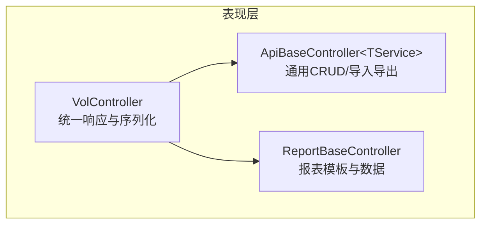
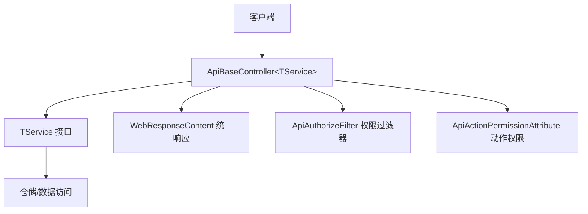
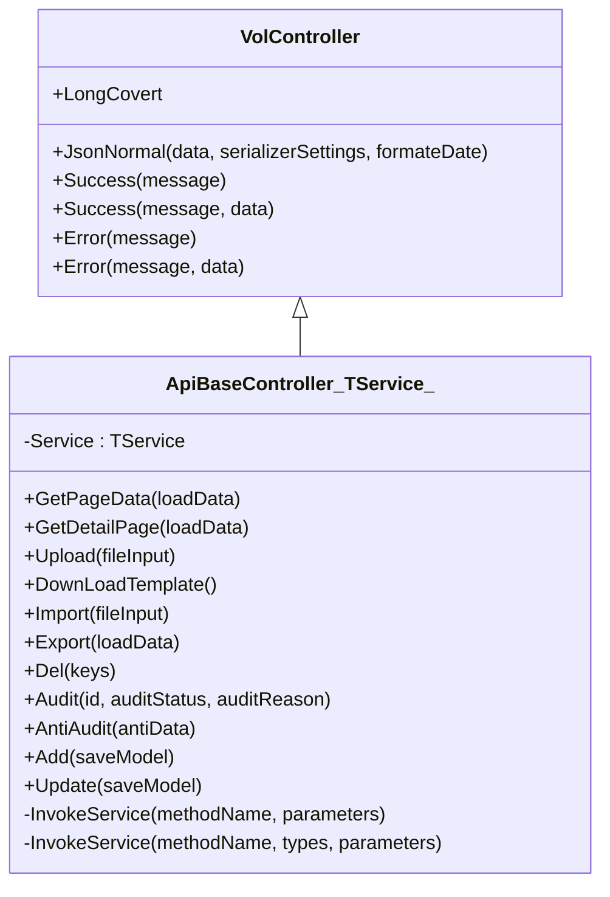
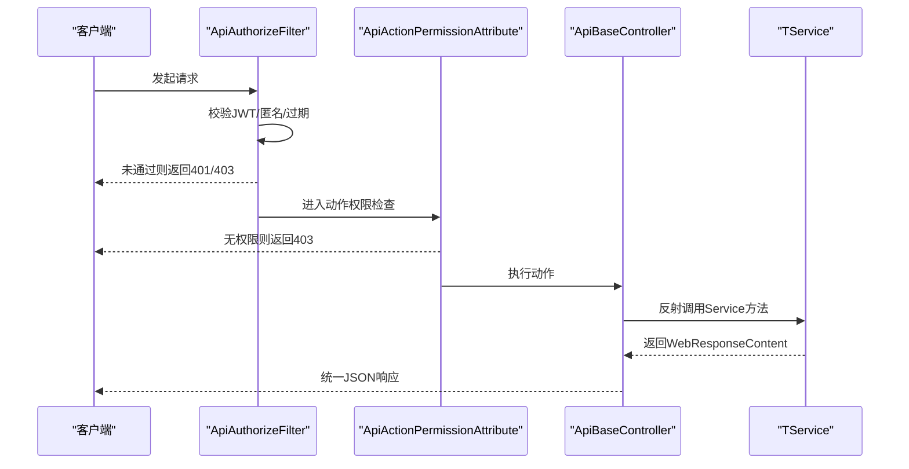
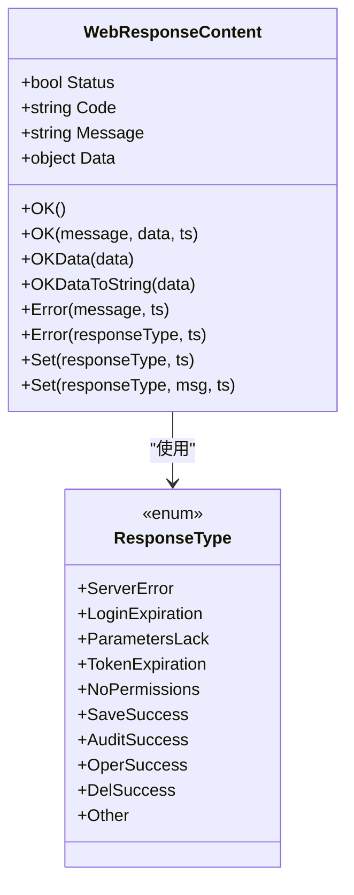
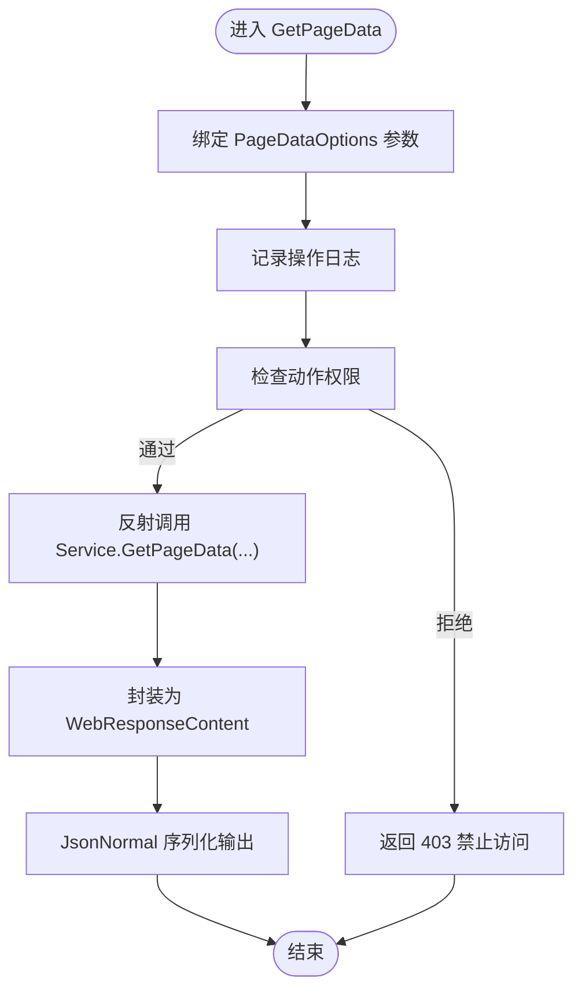
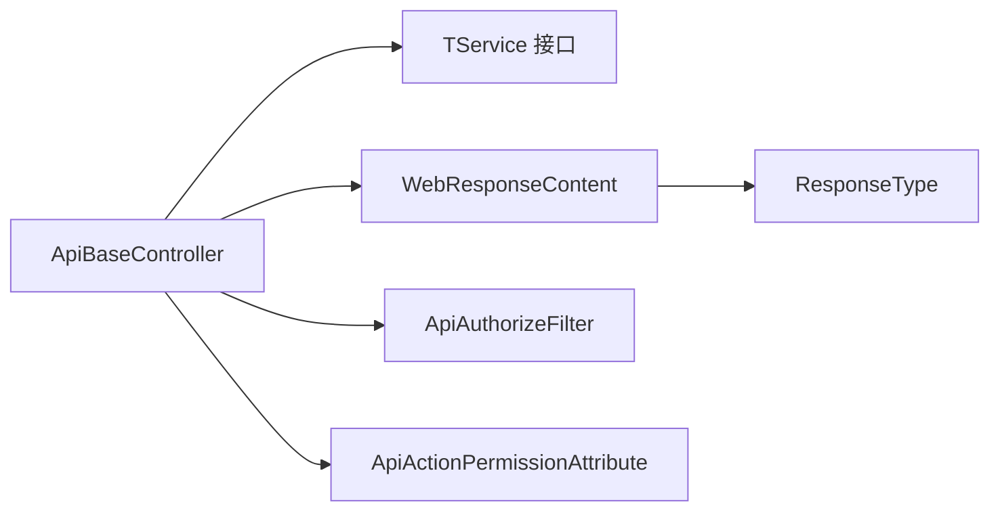

# 表现层设计

<cite>
**本文引用的文件**
- [ApiBaseController.cs](file://VolPro.Core/Controllers/Basic/ApiBaseController.cs)
- [ReportBaseController.cs](file://VolPro.Core/Controllers/Basic/ReportBaseController.cs)
- [VolController.cs](file://VolPro.Core/Controllers/Basic/VolController.cs)
- [ApiAuthorizeFilter.cs](file://VolPro.Core/Filters/ApiAuthorizeFilter.cs)
- [ApiActionPermissionAttribute.cs](file://VolPro.Core/Filters/ApiActionPermissionAttribute.cs)
- [ActionPermissionOptions.cs](file://VolPro.Core/Enums/ActionPermissionOptions.cs)
- [WebResponseContent.cs](file://VolPro.Core/Utilities/Response/WebResponseContent.cs)
- [ApiResponseExtension.cs](file://VolPro.Core/Extensions/Response/ApiResponseExtension.cs)
- [ResponseExtension.cs](file://VolPro.Core/Extensions/Response/ResponseExtension.cs)
- [ResponseType.cs](file://VolPro.Core/Enums/ResponseType.cs)
</cite>

## 目录
1. [引言](#引言)
2. [项目结构](#项目结构)
3. [核心组件](#核心组件)
4. [架构总览](#架构总览)
5. [详细组件分析](#详细组件分析)
6. [依赖关系分析](#依赖关系分析)
7. [性能考量](#性能考量)
8. [故障排查指南](#故障排查指南)
9. [结论](#结论)
10. [附录](#附录)

## 引言
本设计文档聚焦于水化热平台的Web API表现层，系统性阐述控制器基类ApiBaseController的设计模式与职责划分，解释控制器继承体系、权限控制机制与统一响应格式，并说明控制器与业务层的交互模式（含依赖注入与接口定义）。文档同时提供UML类图与请求处理流程图，给出最佳实践、错误处理策略与性能优化建议，帮助开发者快速理解并高效扩展API层。

## 项目结构
表现层位于VolPro.Core模块的Controllers/Basic目录下，围绕通用控制器基类展开：
- VolController：基础控制器，提供统一的JSON序列化、成功/失败响应封装与自定义Long类型转换器。
- ApiBaseController<TService>：泛型API控制器基类，面向数据实体的CRUD与报表导入导出等通用操作，通过反射调用Service层方法。
- ReportBaseController：报表模板与数据加载基类，基于配置化的SQL模板与数据库连接，提供模板渲染所需的数据对象。

图表来源
- [VolController.cs:1-77](file://VolPro.Core/Controllers/Basic/VolController.cs#L1-L77)
- [ApiBaseController.cs:1-230](file://VolPro.Core/Controllers/Basic/ApiBaseController.cs#L1-L230)
- [ReportBaseController.cs:1-169](file://VolPro.Core/Controllers/Basic/ReportBaseController.cs#L1-L169)

章节来源
- [VolController.cs:1-77](file://VolPro.Core/Controllers/Basic/VolController.cs#L1-L77)
- [ApiBaseController.cs:1-230](file://VolPro.Core/Controllers/Basic/ApiBaseController.cs#L1-L230)
- [ReportBaseController.cs:1-169](file://VolPro.Core/Controllers/Basic/ReportBaseController.cs#L1-L169)

## 核心组件
- 控制器基类VolController
  - 统一JSON序列化输出，支持原样返回（非驼峰）与日期格式化。
  - 提供Success/Error便捷方法，形成统一响应结构。
  - 内置Long类型序列化转换器，避免前后端长整型精度问题。
- 泛型API控制器ApiBaseController<TService>
  - 通过构造函数注入Service接口实例，实现控制器与业务层解耦。
  - 暴露通用路由：分页查询、明细查询、上传、下载模板、导入、导出、删除、审核、反审核、新增、修改。
  - 使用反射调用Service方法，支持重载方法的类型匹配。
  - 集成日志记录与权限注解，确保操作审计与安全控制。
- 报表控制器ReportBaseController
  - 基于URL参数code解析报表模板配置，按需从数据库或SQL查询获取数据。
  - 支持模板文本与数据对象组合返回，便于前端模板引擎渲染。

章节来源
- [VolController.cs:1-77](file://VolPro.Core/Controllers/Basic/VolController.cs#L1-L77)
- [ApiBaseController.cs:1-230](file://VolPro.Core/Controllers/Basic/ApiBaseController.cs#L1-L230)
- [ReportBaseController.cs:1-169](file://VolPro.Core/Controllers/Basic/ReportBaseController.cs#L1-L169)

## 架构总览
表现层采用“控制器-服务-仓储”三层分离，控制器负责请求接入与统一响应，服务层负责业务编排，仓储层负责数据持久化。权限控制通过全局授权过滤器与动作级权限特性协同完成。

图表来源
- [ApiBaseController.cs:1-230](file://VolPro.Core/Controllers/Basic/ApiBaseController.cs#L1-L230)
- [ApiAuthorizeFilter.cs:1-86](file://VolPro.Core/Filters/ApiAuthorizeFilter.cs#L1-L86)
- [ApiActionPermissionAttribute.cs:1-56](file://VolPro.Core/Filters/ApiActionPermissionAttribute.cs#L1-L56)
- [WebResponseContent.cs:1-108](file://VolPro.Core/Utilities/Response/WebResponseContent.cs#L1-L108)

## 详细组件分析

### ApiBaseController 设计与职责
- 设计模式
  - 泛型基类：通过类型参数约束Service接口，实现控制器与具体业务的解耦。
  - 反射调用：统一入口方法通过反射调用Service同名方法，减少重复代码。
  - 组合装饰器：在方法上标注日志、权限、探索设置等特性，集中式横切关注点。
- 职责划分
  - 输入校验与绑定：依赖框架模型绑定与特性校验。
  - 业务调度：通过反射调用Service方法，传递参数。
  - 统一响应：将Service返回的WebResponseContent标准化为JSON响应。
  - 日志与审计：在关键操作前记录日志，便于追踪。
- 关键路由与行为
  - 分页查询：GetPageData
  - 明细分页：GetDetailPage
  - 文件上传：Upload
  - 下载模板：DownLoadTemplate
  - 数据导入：Import
  - 数据导出：Export
  - 删除：Del
  - 审核/AntiAudit：Audit/AntiAudit
  - 新增/更新：Add/Update
- 依赖注入与接口
  - 通过构造函数注入TService接口，控制器不直接依赖具体实现，利于测试与替换。
  - 业务接口定义位于IServices命名空间，控制器仅依赖接口契约。

图表来源
- [VolController.cs:1-77](file://VolPro.Core/Controllers/Basic/VolController.cs#L1-L77)
- [ApiBaseController.cs:1-230](file://VolPro.Core/Controllers/Basic/ApiBaseController.cs#L1-L230)

章节来源
- [ApiBaseController.cs:1-230](file://VolPro.Core/Controllers/Basic/ApiBaseController.cs#L1-L230)
- [VolController.cs:1-77](file://VolPro.Core/Controllers/Basic/VolController.cs#L1-L77)

### 权限控制机制
- 全局授权过滤器ApiAuthorizeFilter
  - 判断是否匿名访问；若非匿名，则校验JWT令牌有效性与过期策略。
  - 在接近过期时通过响应头提示刷新令牌。
- 动作级权限特性ApiActionPermissionAttribute
  - 支持按操作类型（新增、删除、更新、查询、导出、审核、上传、导入）与角色/表维度进行权限控制。
  - 通过枚举ActionPermissionOptions定义权限位，便于组合与扩展。
- 集成方式
  - 控制器类级别应用JWTAuthorize特性，确保所有动作默认受保护。
  - 在具体动作上标注ApiActionPermissionAttribute，声明所需权限位。

图表来源
- [ApiAuthorizeFilter.cs:1-86](file://VolPro.Core/Filters/ApiAuthorizeFilter.cs#L1-L86)
- [ApiActionPermissionAttribute.cs:1-56](file://VolPro.Core/Filters/ApiActionPermissionAttribute.cs#L1-L56)
- [ApiBaseController.cs:1-230](file://VolPro.Core/Controllers/Basic/ApiBaseController.cs#L1-L230)

章节来源
- [ApiAuthorizeFilter.cs:1-86](file://VolPro.Core/Filters/ApiAuthorizeFilter.cs#L1-L86)
- [ApiActionPermissionAttribute.cs:1-56](file://VolPro.Core/Filters/ApiActionPermissionAttribute.cs#L1-L56)
- [ActionPermissionOptions.cs:1-23](file://VolPro.Core/Enums/ActionPermissionOptions.cs#L1-L23)

### 统一响应格式与扩展
- WebResponseContent
  - 统一承载状态、编码、消息与数据，提供OK/Error/Set等链式构建方法。
  - 支持国际化消息翻译与数据序列化。
- VolController.JsonNormal
  - 默认关闭驼峰命名，设置日期格式，注册Long类型转换器，确保前后端一致。
- ApiResponseExtension/ResponseExtension
  - 提供响应类型的扩展能力，便于在不同场景下复用统一格式。

图表来源
- [WebResponseContent.cs:1-108](file://VolPro.Core/Utilities/Response/WebResponseContent.cs#L1-L108)
- [ResponseType.cs:1-32](file://VolPro.Core/Enums/ResponseType.cs#L1-L32)

章节来源
- [WebResponseContent.cs:1-108](file://VolPro.Core/Utilities/Response/WebResponseContent.cs#L1-L108)
- [ResponseType.cs:1-32](file://VolPro.Core/Enums/ResponseType.cs#L1-L32)
- [ApiResponseExtension.cs:1-44](file://VolPro.Core/Extensions/Response/ApiResponseExtension.cs#L1-L44)
- [ResponseExtension.cs:1-45](file://VolPro.Core/Extensions/Response/ResponseExtension.cs#L1-L45)

### 请求处理流程（以分页查询为例）

图表来源
- [ApiBaseController.cs:37-41](file://VolPro.Core/Controllers/Basic/ApiBaseController.cs#L37-L41)
- [ApiActionPermissionAttribute.cs:1-56](file://VolPro.Core/Filters/ApiActionPermissionAttribute.cs#L1-L56)
- [VolController.cs:21-31](file://VolPro.Core/Controllers/Basic/VolController.cs#L21-L31)
- [WebResponseContent.cs:1-108](file://VolPro.Core/Utilities/Response/WebResponseContent.cs#L1-L108)

## 依赖关系分析
- 控制器到服务层
  - ApiBaseController通过构造函数注入TService接口，调用其方法并返回WebResponseContent。
- 控制器到权限与日志
  - 通过特性与过滤器实现权限与日志横切，降低重复逻辑。
- 响应与扩展
  - WebResponseContent作为统一载体，配合ResponseType与扩展方法，形成一致的响应语义。

图表来源
- [ApiBaseController.cs:1-230](file://VolPro.Core/Controllers/Basic/ApiBaseController.cs#L1-L230)
- [WebResponseContent.cs:1-108](file://VolPro.Core/Utilities/Response/WebResponseContent.cs#L1-L108)
- [ApiAuthorizeFilter.cs:1-86](file://VolPro.Core/Filters/ApiAuthorizeFilter.cs#L1-L86)
- [ApiActionPermissionAttribute.cs:1-56](file://VolPro.Core/Filters/ApiActionPermissionAttribute.cs#L1-L56)
- [ResponseType.cs:1-32](file://VolPro.Core/Enums/ResponseType.cs#L1-L32)

章节来源
- [ApiBaseController.cs:1-230](file://VolPro.Core/Controllers/Basic/ApiBaseController.cs#L1-L230)
- [WebResponseContent.cs:1-108](file://VolPro.Core/Utilities/Response/WebResponseContent.cs#L1-L108)
- [ApiAuthorizeFilter.cs:1-86](file://VolPro.Core/Filters/ApiAuthorizeFilter.cs#L1-L86)
- [ApiActionPermissionAttribute.cs:1-56](file://VolPro.Core/Filters/ApiActionPermissionAttribute.cs#L1-L56)
- [ResponseType.cs:1-32](file://VolPro.Core/Enums/ResponseType.cs#L1-L32)

## 性能考量
- 反射调用
  - 通过反射调用Service方法带来一定开销，建议在高频路径谨慎使用；可通过缓存MethodInfo或在业务层引入更明确的接口契约减少反射成本。
- 序列化策略
  - JsonNormal默认关闭驼峰与日期格式化，有助于前后端一致性与传输体积控制；如需进一步优化，可考虑压缩或分页数据大小。
- 权限与日志
  - 权限检查与日志记录为必要安全措施，建议结合缓存与异步写入，避免阻塞请求。
- 导入/导出
  - 导入/导出涉及IO与大文件处理，建议限制文件大小、采用流式处理与后台任务队列，避免长时间占用请求线程。

## 故障排查指南
- 401/403权限问题
  - 检查JWT是否有效、是否接近过期；确认ApiAuthorizeFilter是否正确识别匿名与固定Token场景。
  - 核对ApiActionPermissionAttribute标注的权限位与用户角色/表权限配置。
- 统一响应异常
  - 若返回格式不符合预期，检查WebResponseContent的OK/Error/Set调用链与消息国际化设置。
- 反射调用失败
  - 确认控制器动作名称与Service方法名称一致，且参数类型匹配；对于重载方法，确保类型数组与参数类型完全对应。
- 导入/导出失败
  - 检查模板路径与文件存在性、导出文件生成路径与权限、上传文件大小与类型限制。

章节来源
- [ApiAuthorizeFilter.cs:1-86](file://VolPro.Core/Filters/ApiAuthorizeFilter.cs#L1-L86)
- [ApiActionPermissionAttribute.cs:1-56](file://VolPro.Core/Filters/ApiActionPermissionAttribute.cs#L1-L56)
- [WebResponseContent.cs:1-108](file://VolPro.Core/Utilities/Response/WebResponseContent.cs#L1-L108)
- [ApiBaseController.cs:213-227](file://VolPro.Core/Controllers/Basic/ApiBaseController.cs#L213-L227)

## 结论
ApiBaseController通过泛型与反射实现了控制器与业务层的高内聚低耦合，结合统一响应格式与权限控制，形成了稳定、可扩展的API表现层骨架。建议在保持现有契约不变的前提下，逐步引入更明确的接口与缓存策略，持续优化反射与IO密集型操作，以提升整体性能与可维护性。

## 附录
- 最佳实践
  - 控制器只做“薄薄一层”，复杂业务下沉至服务层；控制器仅负责输入绑定、权限校验、日志与统一响应。
  - 对外暴露的接口尽量语义化与幂等化，避免在控制器中编写业务规则。
  - 使用ApiActionPermissionAttribute精确标注权限位，避免过度授权。
- 错误处理策略
  - 使用WebResponseContent.Error与Set方法集中处理错误码与消息，便于前端统一处理。
  - 对敏感操作（删除、审核）记录详细日志，便于审计与回溯。
- 性能优化建议
  - 减少反射调用次数，优先通过显式接口契约替代反射。
  - 对大文件导入/导出采用流式处理与异步任务，避免阻塞主线程。
  - 合理设置分页大小与排序字段，避免全量查询。