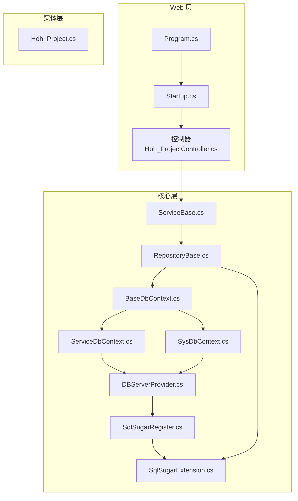
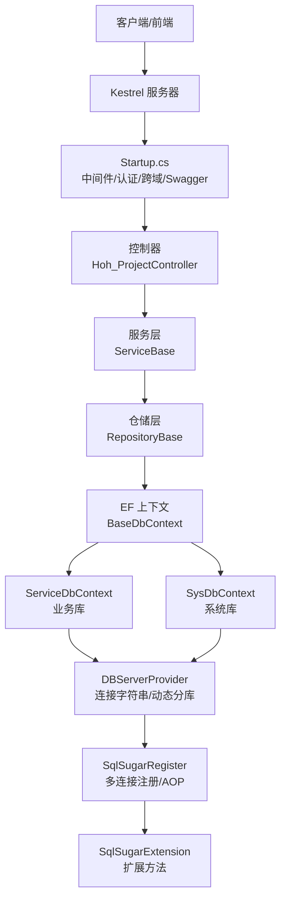
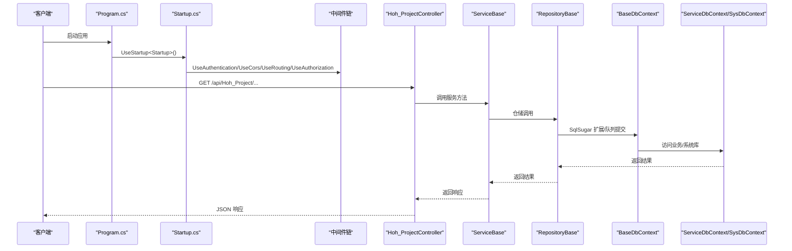
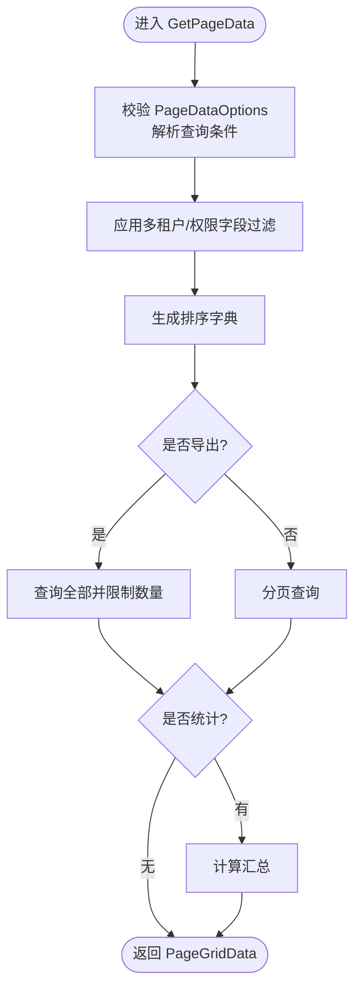
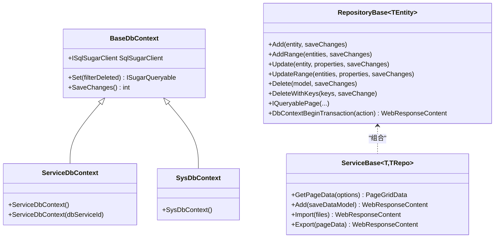
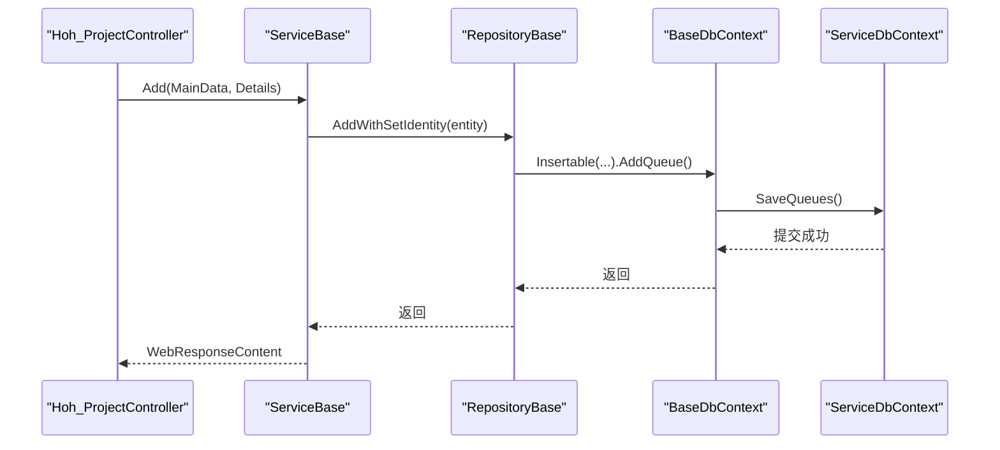
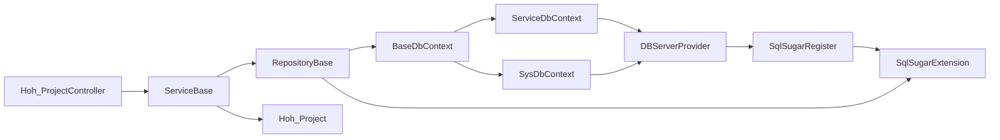

# 数据流架构

<cite>
**本文引用的文件**
- [Program.cs](file://VolPro.WebApi/Program.cs)
- [Startup.cs](file://VolPro.WebApi/Startup.cs)
- [DBServerProvider.cs](file://VolPro.Core/DbManager/DBServerProvider.cs)
- [SqlSugarRegister.cs](file://VolPro.Core/DbSqlSugar/SqlSugarRegister.cs)
- [SqlSugarExtension.cs](file://VolPro.Core/DbSqlSugar/SqlSugarExtension.cs)
- [BaseDbContext.cs](file://VolPro.Core/EFDbContext/BaseDbContext.cs)
- [ServiceDbContext.cs](file://VolPro.Core/EFDbContext/ServiceDbContext.cs)
- [SysDbContext.cs](file://VolPro.Core/EFDbContext/SysDbContext.cs)
- [RepositoryBase.cs](file://VolPro.Core/BaseProvider/RepositoryBase.cs)
- [ServiceBase.cs](file://VolPro.Core/BaseProvider/ServiceBase.cs)
- [Hoh_ProjectController.cs](file://VolPro.WebApi/Controllers/HeatOfHydration/Hoh_ProjectController.cs)
- [Hoh_Project.cs](file://VolPro.Entity/DomainModels/Hoh/Hoh_Project.cs)
</cite>

## 目录
1. [引言](#引言)
2. [项目结构](#项目结构)
3. [核心组件](#核心组件)
4. [架构总览](#架构总览)
5. [详细组件分析](#详细组件分析)
6. [依赖关系分析](#依赖关系分析)
7. [性能考虑](#性能考虑)
8. [故障排查指南](#故障排查指南)
9. [结论](#结论)

## 引言
本文件面向“水化热平台”的数据流架构，围绕从 HTTP 请求到数据库操作的完整链路进行系统化梳理，重点覆盖以下方面：
- 请求接收与中间件链路
- 参数验证与业务处理
- 数据访问层设计模式（仓储与服务）
- ORM 框架选择与使用策略（SqlSugar、Entity Framework Core、Dapper）
- 事务管理机制与数据一致性保障
- 并发控制与性能优化策略
- 典型 CRUD 的数据流图与时序图

## 项目结构
该系统采用分层清晰的多模块组织方式，Web 层负责请求接入与契约输出，Core 层提供基础设施、ORM 注册与上下文管理，Entity 层承载领域模型，各业务域（如 Hoh）在独立命名空间下提供仓储与服务。

图表来源
- [Program.cs:1-39](file://VolPro.WebApi/Program.cs#L1-L39)
- [Startup.cs:60-213](file://VolPro.WebApi/Startup.cs#L60-L213)
- [DBServerProvider.cs:28-139](file://VolPro.Core/DbManager/DBServerProvider.cs#L28-L139)
- [SqlSugarRegister.cs:76-131](file://VolPro.Core/DbSqlSugar/SqlSugarRegister.cs#L76-L131)
- [SqlSugarExtension.cs:20-229](file://VolPro.Core/DbSqlSugar/SqlSugarExtension.cs#L20-L229)
- [BaseDbContext.cs:18-40](file://VolPro.Core/EFDbContext/BaseDbContext.cs#L18-L40)
- [ServiceDbContext.cs:13-31](file://VolPro.Core/EFDbContext/ServiceDbContext.cs#L13-L31)
- [SysDbContext.cs:13-20](file://VolPro.Core/EFDbContext/SysDbContext.cs#L13-L20)
- [RepositoryBase.cs:29-651](file://VolPro.Core/BaseProvider/RepositoryBase.cs#L29-L651)
- [ServiceBase.cs:31-800](file://VolPro.Core/BaseProvider/ServiceBase.cs#L31-L800)
- [Hoh_ProjectController.cs:11-22](file://VolPro.WebApi/Controllers/HeatOfHydration/Hoh_ProjectController.cs#L11-L22)
- [Hoh_Project.cs:17-230](file://VolPro.Entity/DomainModels/Hoh/Hoh_Project.cs#L17-L230)

章节来源
- [Program.cs:17-39](file://VolPro.WebApi/Program.cs#L17-L39)
- [Startup.cs:60-213](file://VolPro.WebApi/Startup.cs#L60-L213)

## 核心组件
- Web 启动与容器
  - Program.cs：启动 Kestrel、注册 Autofac 容器工厂、绑定 Startup。
  - Startup.cs：注册认证、跨域、Swagger、中间件、定时任务、打印配置、SqlSugar 注入。
- 数据库上下文与连接
  - BaseDbContext：EF 风格的抽象基类，桥接 SqlSugar 的 ISqlSugarClient。
  - ServiceDbContext/SysDbContext：分别注入业务库与系统库的 SqlSugar 客户端。
  - DBServerProvider：集中管理连接字符串、动态分库与租户切换。
  - SqlSugarRegister：批量注册多连接配置，统一 AOP 日志与外部服务配置。
  - SqlSugarExtension：为 BaseDbContext/ISqlSugarClient 提供常用扩展方法（增删改查、队列提交、逻辑删除过滤等）。
- 仓储与服务
  - RepositoryBase：封装通用 CRUD、分页、事务、明细同步、拆表等能力。
  - ServiceBase：封装分页查询、导入导出、主从明细保存、鉴权字段过滤、多租户过滤等业务流程。
- 控制器与实体
  - Hoh_ProjectController：基于 ApiBaseController，注入 IHoh_ProjectService。
  - Hoh_Project：实体标注 EntityAttribute，声明表名、明细表、所属数据库上下文等元信息。

章节来源
- [BaseDbContext.cs:18-40](file://VolPro.Core/EFDbContext/BaseDbContext.cs#L18-L40)
- [ServiceDbContext.cs:13-31](file://VolPro.Core/EFDbContext/ServiceDbContext.cs#L13-L31)
- [SysDbContext.cs:13-20](file://VolPro.Core/EFDbContext/SysDbContext.cs#L13-L20)
- [DBServerProvider.cs:28-139](file://VolPro.Core/DbManager/DBServerProvider.cs#L28-L139)
- [SqlSugarRegister.cs:76-131](file://VolPro.Core/DbSqlSugar/SqlSugarRegister.cs#L76-L131)
- [SqlSugarExtension.cs:20-229](file://VolPro.Core/DbSqlSugar/SqlSugarExtension.cs#L20-L229)
- [RepositoryBase.cs:29-651](file://VolPro.Core/BaseProvider/RepositoryBase.cs#L29-L651)
- [ServiceBase.cs:31-800](file://VolPro.Core/BaseProvider/ServiceBase.cs#L31-L800)
- [Hoh_ProjectController.cs:11-22](file://VolPro.WebApi/Controllers/HeatOfHydration/Hoh_ProjectController.cs#L11-L22)
- [Hoh_Project.cs:17-230](file://VolPro.Entity/DomainModels/Hoh/Hoh_Project.cs#L17-L230)

## 架构总览
系统采用“控制器-服务-仓储-ORM/EF 上下文”的分层架构，Web 层仅负责路由与契约，业务与数据访问分离；ORM 以 SqlSugar 为核心，EF DbContext 仅用于桥接与部分扩展，Dapper 在当前仓库中处于注释状态，未启用。

图表来源
- [Startup.cs:309-383](file://VolPro.WebApi/Startup.cs#L309-L383)
- [Hoh_ProjectController.cs:11-22](file://VolPro.WebApi/Controllers/HeatOfHydration/Hoh_ProjectController.cs#L11-L22)
- [ServiceBase.cs:31-800](file://VolPro.Core/BaseProvider/ServiceBase.cs#L31-L800)
- [RepositoryBase.cs:29-651](file://VolPro.Core/BaseProvider/RepositoryBase.cs#L29-L651)
- [BaseDbContext.cs:18-40](file://VolPro.Core/EFDbContext/BaseDbContext.cs#L18-L40)
- [ServiceDbContext.cs:13-31](file://VolPro.Core/EFDbContext/ServiceDbContext.cs#L13-L31)
- [SysDbContext.cs:13-20](file://VolPro.Core/EFDbContext/SysDbContext.cs#L13-L20)
- [DBServerProvider.cs:28-139](file://VolPro.Core/DbManager/DBServerProvider.cs#L28-L139)
- [SqlSugarRegister.cs:76-131](file://VolPro.Core/DbSqlSugar/SqlSugarRegister.cs#L76-L131)
- [SqlSugarExtension.cs:20-229](file://VolPro.Core/DbSqlSugar/SqlSugarExtension.cs#L20-L229)

## 详细组件分析

### 组件一：请求接入与中间件链
- 启动与主机
  - Program.cs 使用 Host.CreateDefaultBuilder 创建宿主，配置 Kestrel 监听端口、IIS 集成，并指定 Startup。
- 中间件与管道
  - Startup.cs 注册认证（JWT）、跨域、静态文件、Swagger、SignalR、语言包、异常中间件、路由与终结点。
- 控制器
  - Hoh_ProjectController 基于 ApiBaseController，路由前缀为 api/Hoh_Project，权限表名为 Hoh_Project。

图表来源
- [Program.cs:17-39](file://VolPro.WebApi/Program.cs#L17-L39)
- [Startup.cs:309-383](file://VolPro.WebApi/Startup.cs#L309-L383)
- [Hoh_ProjectController.cs:11-22](file://VolPro.WebApi/Controllers/HeatOfHydration/Hoh_ProjectController.cs#L11-L22)
- [ServiceBase.cs:31-800](file://VolPro.Core/BaseProvider/ServiceBase.cs#L31-L800)
- [RepositoryBase.cs:29-651](file://VolPro.Core/BaseProvider/RepositoryBase.cs#L29-L651)
- [BaseDbContext.cs:18-40](file://VolPro.Core/EFDbContext/BaseDbContext.cs#L18-L40)
- [ServiceDbContext.cs:13-31](file://VolPro.Core/EFDbContext/ServiceDbContext.cs#L13-L31)
- [SysDbContext.cs:13-20](file://VolPro.Core/EFDbContext/SysDbContext.cs#L13-L20)

章节来源
- [Program.cs:17-39](file://VolPro.WebApi/Program.cs#L17-L39)
- [Startup.cs:309-383](file://VolPro.WebApi/Startup.cs#L309-L383)
- [Hoh_ProjectController.cs:11-22](file://VolPro.WebApi/Controllers/HeatOfHydration/Hoh_ProjectController.cs#L11-L22)

### 组件二：参数验证与业务处理
- 参数验证
  - ServiceBase 对 PageDataOptions 进行校验，将前端查询条件转换为 SqlSugar 表达式，过滤非法值与类型不匹配项。
- 业务处理
  - 分页查询：按排序字典生成排序表达式，支持导出与统计汇总。
  - 权限字段过滤：根据角色权限与隐藏字段映射，仅选择允许的列。
  - 多租户过滤：通过 TenancyManager 注入租户条件或自定义 SQL。
  - 主从明细保存：支持主表+明细批量保存与差异同步。
  - 导入导出：Excel 模板下载、读取、校验、雪花 ID 生成、租户值注入、导出列控制。

图表来源
- [ServiceBase.cs:285-340](file://VolPro.Core/BaseProvider/ServiceBase.cs#L285-L340)
- [ServiceBase.cs:218-278](file://VolPro.Core/BaseProvider/ServiceBase.cs#L218-L278)
- [ServiceBase.cs:346-378](file://VolPro.Core/BaseProvider/ServiceBase.cs#L346-L378)

章节来源
- [ServiceBase.cs:218-378](file://VolPro.Core/BaseProvider/ServiceBase.cs#L218-L378)

### 组件三：数据访问层与事务管理
- 仓储基类
  - RepositoryBase 封装了 Add/AddRange、Update/UpdateRange、Delete/DeleteWithKeys、分页、Exists、FromSql 等通用能力。
  - 支持拆表（GetSugarSplitTable）与逻辑删除过滤（SaveChanges 时统一提交队列）。
  - DbContextBeginTransaction 提供统一事务入口，自动回滚/提交与异常包装。
- 服务基类
  - ServiceBase 在 Add/Update/Import 等流程中组合仓储操作，确保主从明细一致性与权限控制。
- EF 上下文桥接
  - BaseDbContext 将 SqlSugar 的 ISqlSugarClient 暴露为 Set<TEntity>()，并提供 SaveChanges 以提交队列。

图表来源
- [BaseDbContext.cs:18-40](file://VolPro.Core/EFDbContext/BaseDbContext.cs#L18-L40)
- [ServiceDbContext.cs:13-31](file://VolPro.Core/EFDbContext/ServiceDbContext.cs#L13-L31)
- [SysDbContext.cs:13-20](file://VolPro.Core/EFDbContext/SysDbContext.cs#L13-L20)
- [RepositoryBase.cs:29-651](file://VolPro.Core/BaseProvider/RepositoryBase.cs#L29-L651)
- [ServiceBase.cs:31-800](file://VolPro.Core/BaseProvider/ServiceBase.cs#L31-L800)

章节来源
- [RepositoryBase.cs:67-96](file://VolPro.Core/BaseProvider/RepositoryBase.cs#L67-L96)
- [RepositoryBase.cs:570-607](file://VolPro.Core/BaseProvider/RepositoryBase.cs#L570-L607)
- [BaseDbContext.cs:32-40](file://VolPro.Core/EFDbContext/BaseDbContext.cs#L32-L40)

### 组件四：ORM 选择与使用策略
- SqlSugar
  - 作为主要 ORM，提供强类型 LINQ、队列提交、拆表、逻辑删除过滤、AOP 日志、批量操作等能力。
  - 通过 SqlSugarRegister 批量注册多连接配置，支持业务库与系统库分离。
  - 通过 SqlSugarExtension 提供 Set/SaveChanges/Update/Insert 等扩展方法。
- Entity Framework Core
  - 仅作为桥接层存在，暴露 Set<TEntity>() 与 SaveChanges()，便于与 SqlSugar 协作。
  - 不直接承担复杂查询与批量操作，避免与 SqlSugar 能力重复。
- Dapper
  - 当前仓库中相关实现处于注释状态，未启用；如需使用可在 DBServerProvider 中按现有模式扩展。

章节来源
- [SqlSugarRegister.cs:76-131](file://VolPro.Core/DbSqlSugar/SqlSugarRegister.cs#L76-L131)
- [SqlSugarExtension.cs:20-229](file://VolPro.Core/DbSqlSugar/SqlSugarExtension.cs#L20-L229)
- [BaseDbContext.cs:18-40](file://VolPro.Core/EFDbContext/BaseDbContext.cs#L18-L40)
- [DBServerProvider.cs:28-139](file://VolPro.Core/DbManager/DBServerProvider.cs#L28-L139)

### 组件五：典型 CRUD 数据流（以 Hoh_Project 为例）
- 新增
  - 控制器 -> 服务层 Add -> 生成雪花 ID/默认值 -> 仓储 AddWithSetIdentity -> 队列提交 -> 统一返回。
- 查询
  - 控制器 -> 服务层 GetPageData -> 解析查询条件/排序/权限字段 -> 仓储分页查询 -> 返回 PageGridData。
- 更新
  - 控制器 -> 服务层 Update -> 仓储 Update/UpdateRange -> 队列提交 -> 统一返回。
- 删除
  - 控制器 -> 服务层 Delete -> 仓储 Delete/DeleteWithKeys -> 队列提交 -> 统一返回。

图表来源
- [Hoh_ProjectController.cs:11-22](file://VolPro.WebApi/Controllers/HeatOfHydration/Hoh_ProjectController.cs#L11-L22)
- [ServiceBase.cs:659-761](file://VolPro.Core/BaseProvider/ServiceBase.cs#L659-L761)
- [RepositoryBase.cs:546-597](file://VolPro.Core/BaseProvider/RepositoryBase.cs#L546-L597)
- [BaseDbContext.cs:32-40](file://VolPro.Core/EFDbContext/BaseDbContext.cs#L32-L40)
- [ServiceDbContext.cs:13-31](file://VolPro.Core/EFDbContext/ServiceDbContext.cs#L13-L31)

章节来源
- [ServiceBase.cs:659-761](file://VolPro.Core/BaseProvider/ServiceBase.cs#L659-L761)
- [RepositoryBase.cs:546-597](file://VolPro.Core/BaseProvider/RepositoryBase.cs#L546-L597)

## 依赖关系分析
- 控制器依赖服务接口（IoC 注入），服务依赖仓储接口，仓储依赖 EF 上下文与 SqlSugar 扩展。
- DBServerProvider 作为连接中心，被 ServiceDbContext/SysDbContext 依赖，进而被 SqlSugarRegister 注册。
- 实体 Hoh_Project 通过 EntityAttribute 指定数据库上下文与明细表，驱动服务层的主从明细处理。

图表来源
- [Hoh_ProjectController.cs:11-22](file://VolPro.WebApi/Controllers/HeatOfHydration/Hoh_ProjectController.cs#L11-L22)
- [ServiceBase.cs:31-800](file://VolPro.Core/BaseProvider/ServiceBase.cs#L31-L800)
- [RepositoryBase.cs:29-651](file://VolPro.Core/BaseProvider/RepositoryBase.cs#L29-L651)
- [BaseDbContext.cs:18-40](file://VolPro.Core/EFDbContext/BaseDbContext.cs#L18-L40)
- [ServiceDbContext.cs:13-31](file://VolPro.Core/EFDbContext/ServiceDbContext.cs#L13-L31)
- [SysDbContext.cs:13-20](file://VolPro.Core/EFDbContext/SysDbContext.cs#L13-L20)
- [DBServerProvider.cs:28-139](file://VolPro.Core/DbManager/DBServerProvider.cs#L28-L139)
- [SqlSugarRegister.cs:76-131](file://VolPro.Core/DbSqlSugar/SqlSugarRegister.cs#L76-L131)
- [SqlSugarExtension.cs:20-229](file://VolPro.Core/DbSqlSugar/SqlSugarExtension.cs#L20-L229)
- [Hoh_Project.cs:17-230](file://VolPro.Entity/DomainModels/Hoh/Hoh_Project.cs#L17-L230)

章节来源
- [Hoh_Project.cs:17-230](file://VolPro.Entity/DomainModels/Hoh/Hoh_Project.cs#L17-L230)

## 性能考虑
- 批量操作
  - 使用 SqlSugar 的 Insertable/Updateable 队列提交，减少往返与锁竞争。
  - 对拆表实体优先使用 SplitTable().ExecuteCommand() 以提升写入效率。
- 查询优化
  - 仅选择必要字段（权限字段过滤），避免 SELECT *。
  - 分页与排序在数据库侧完成，避免内存压力。
- 连接与日志
  - SqlSugarRegister 统一配置连接与 AOP 日志，便于定位慢查询。
  - 多连接配置按上下文区分，避免跨库事务与锁冲突。
- 导入导出
  - 导入使用 EPPlus 读取 Excel，建议分批入库并结合事务批量提交。
  - 导出时按列白名单控制，减少序列化开销。

## 故障排查指南
- 认证失败
  - 检查 Startup.cs 中 JWT 配置与 OnChallenge 回调，确认请求头 Authorization 是否正确。
- 跨域问题
  - 确认 CorsUrls 已在配置文件中设置，且 UseCors() 已启用。
- 数据库连接
  - 通过 DBServerProvider.SysConnectingString/ServiceConnectingString 校验连接字符串是否正确。
  - 若使用动态分库/租户，确认 UserContext.CurrentServiceId 或 GetServiceConnectingString 参数。
- 事务回滚
  - RepositoryBase 的 DbContextBeginTransaction 会在异常时自动回滚，检查返回的 WebResponseContent.Status 与消息。
- 日志与诊断
  - SqlSugar 的 AOP OnLogExecuting 输出 SQL，便于定位性能瓶颈与错误语句。

章节来源
- [Startup.cs:84-114](file://VolPro.WebApi/Startup.cs#L84-L114)
- [Startup.cs:121-130](file://VolPro.WebApi/Startup.cs#L121-L130)
- [DBServerProvider.cs:108-127](file://VolPro.Core/DbManager/DBServerProvider.cs#L108-L127)
- [RepositoryBase.cs:67-96](file://VolPro.Core/BaseProvider/RepositoryBase.cs#L67-L96)
- [SqlSugarRegister.cs:110-126](file://VolPro.Core/DbSqlSugar/SqlSugarRegister.cs#L110-L126)

## 结论
本架构以 SqlSugar 为核心，结合 EF DbContext 的桥接能力，形成“控制器-服务-仓储-ORM”的清晰分层。通过统一的连接管理、事务入口与扩展方法，实现了高内聚低耦合的数据访问层；配合权限字段过滤、多租户与拆表等特性，满足水化热平台的复杂业务需求。建议在后续演进中：
- 明确 Dapper 的启用边界，避免与 SqlSugar 能力重复。
- 对热点表引入缓存与批量写入策略，进一步降低数据库压力。
- 在导入导出场景中增加断点续传与幂等控制，提升可靠性。