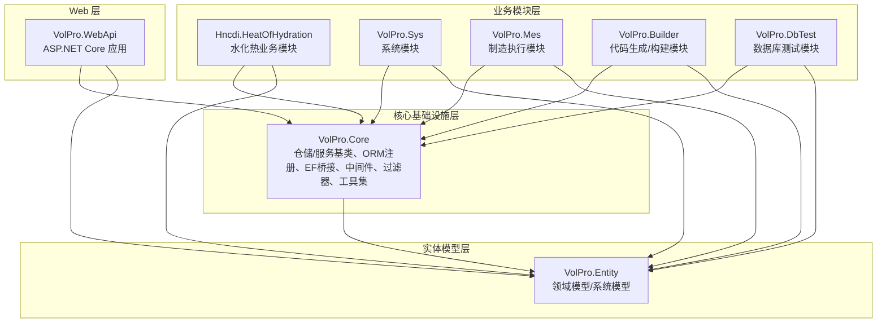
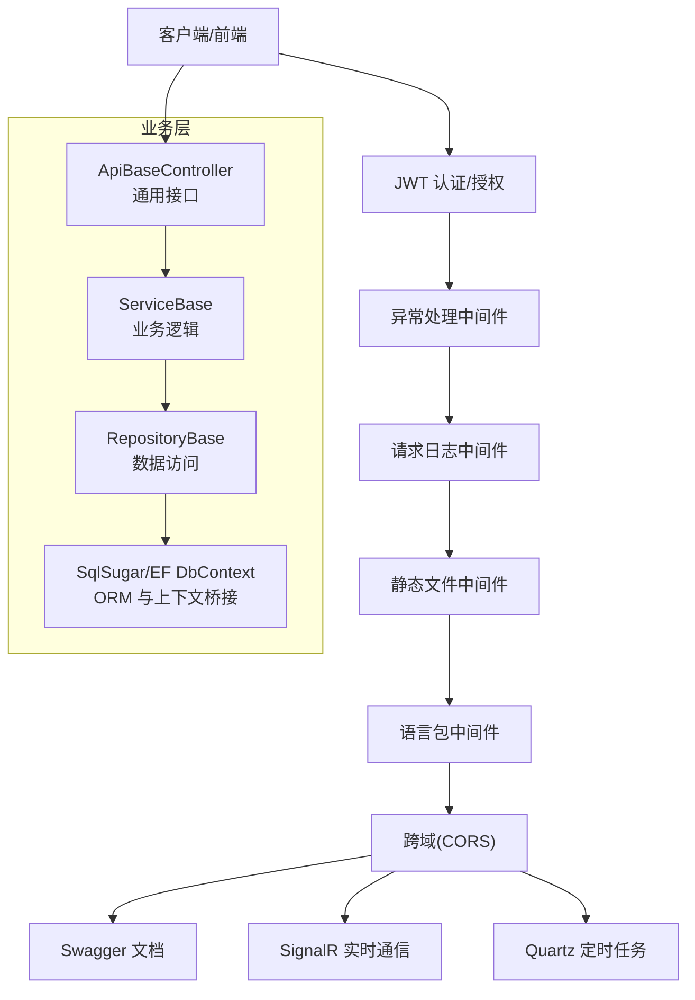
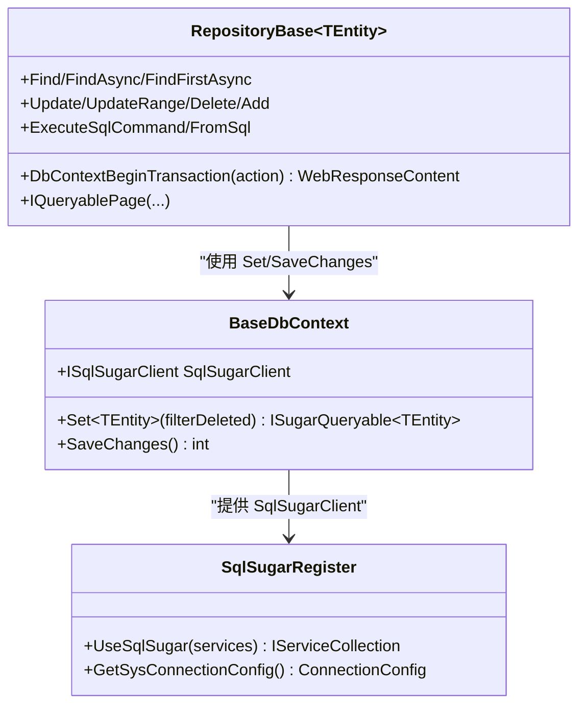
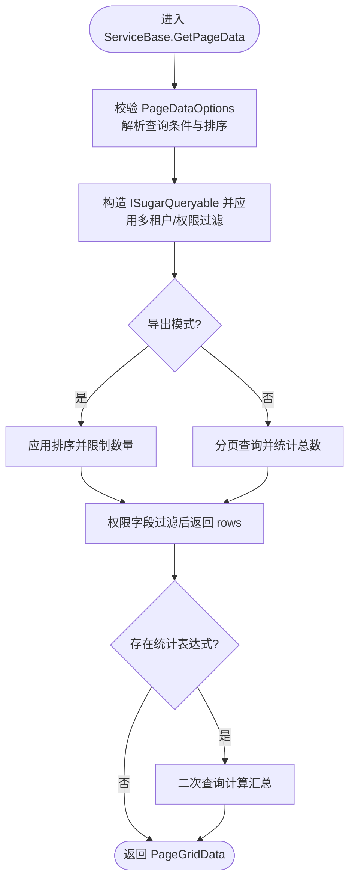
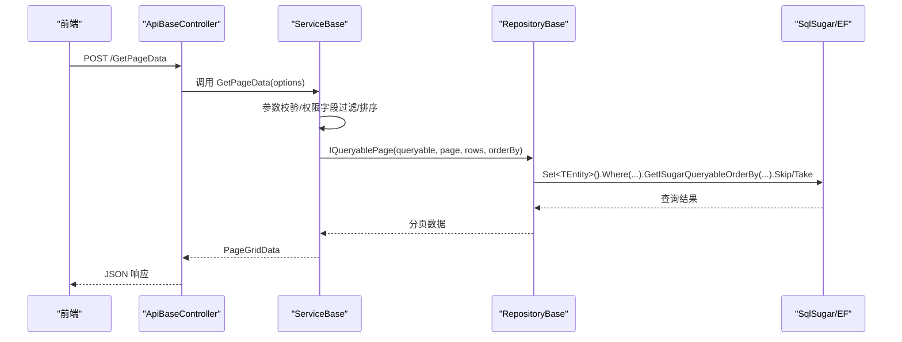
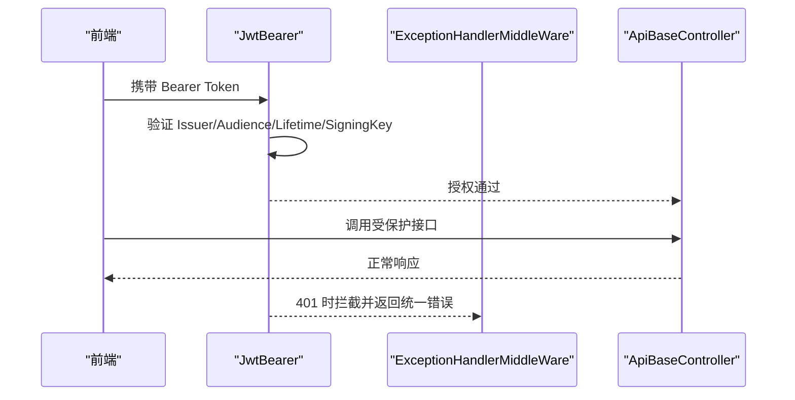
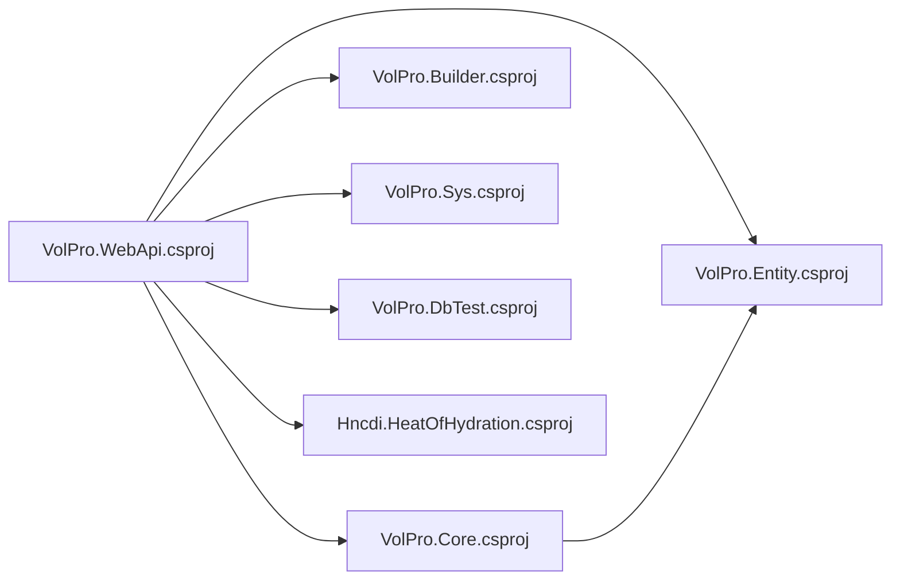

# 整体架构概览

<cite>
**本文引用的文件**
- [Program.cs](file://VolPro.WebApi/Program.cs)
- [Startup.cs](file://VolPro.WebApi/Startup.cs)
- [appsettings.json](file://VolPro.WebApi/appsettings.json)
- [VolPro.WebApi.csproj](file://VolPro.WebApi/VolPro.WebApi.csproj)
- [VolPro.Core.csproj](file://VolPro.Core/VolPro.Core.csproj)
- [VolPro.Entity.csproj](file://VolPro.Entity/VolPro.Entity.csproj)
- [Hncdi.HeatOfHydration.csproj](file://Hncdi.HeatOfHydration/Hncdi.HeatOfHydration.csproj)
- [RepositoryBase.cs](file://VolPro.Core/BaseProvider/RepositoryBase.cs)
- [ServiceBase.cs](file://VolPro.Core/BaseProvider/ServiceBase.cs)
- [SqlSugarRegister.cs](file://VolPro.Core/DbSqlSugar/SqlSugarRegister.cs)
- [BaseDbContext.cs](file://VolPro.Core/EFDbContext/BaseDbContext.cs)
- [AutofacContainerModule.cs](file://VolPro.Core/Extensions/AutofacManager/AutofacContainerModule.cs)
- [ApiBaseController.cs](file://VolPro.Core/Controllers/Basic/ApiBaseController.cs)
</cite>

## 目录
1. [引言](#引言)
2. [项目结构](#项目结构)
3. [核心组件](#核心组件)
4. [架构总览](#架构总览)
5. [详细组件分析](#详细组件分析)
6. [依赖分析](#依赖分析)
7. [性能考量](#性能考量)
8. [故障排查指南](#故障排查指南)
9. [结论](#结论)
10. [附录](#附录)

## 引言
本文件面向“水化热平台”项目，提供基于 .NET 8.0 的现代 Web 应用整体架构概览。该架构以 ASP.NET Core 8.0 为核心，采用模块化分层设计，包含 WebApi 层、核心基础设施层、实体模型层、业务模块层，结合 SqlSugar ORM、Autofac 依赖注入容器、EF Core 上下文桥接、JWT 认证与授权、Swagger 文档、SignalR 实时通信、Quartz 定时任务、打印与导出工具等关键技术，形成统一、可扩展、可维护的工程化体系。

## 项目结构
项目采用多项目解决方案，按职责清晰拆分：
- VolPro.WebApi：ASP.NET Core Web 应用入口，负责启动、中间件、路由、认证授权、Swagger、SignalR 等。
- VolPro.Core：核心基础设施与通用能力，包含仓储基类、服务基类、ORM 注册、EF 上下文桥接、中间件、过滤器、工具集等。
- VolPro.Entity：领域模型与系统模型，承载实体定义、基础模型、API 输入输出模型等。
- Hncdi.HeatOfHydration：业务模块层（以水化热业务为例），提供具体业务的仓储与服务接口与实现，依赖 Core 与 Entity。
- 其他模块（如 VolPro.Sys、VolPro.Mes、VolPro.Builder、VolPro.DbTest）遵循相同分层与命名约定，便于扩展。

图表来源
- [VolPro.WebApi.csproj:40-47](file://VolPro.WebApi/VolPro.WebApi.csproj#L40-L47)
- [VolPro.Core.csproj:68-70](file://VolPro.Core/VolPro.Core.csproj#L68-L70)
- [VolPro.Entity.csproj:26-30](file://VolPro.Entity/VolPro.Entity.csproj#L26-L30)
- [Hncdi.HeatOfHydration.csproj:9-12](file://Hncdi.HeatOfHydration/Hncdi.HeatOfHydration.csproj#L9-L12)

章节来源
- [VolPro.WebApi.csproj:40-47](file://VolPro.WebApi/VolPro.WebApi.csproj#L40-L47)
- [VolPro.Core.csproj:68-70](file://VolPro.Core/VolPro.Core.csproj#L68-L70)
- [VolPro.Entity.csproj:26-30](file://VolPro.Entity/VolPro.Entity.csproj#L26-L30)
- [Hncdi.HeatOfHydration.csproj:9-12](file://Hncdi.HeatOfHydration/Hncdi.HeatOfHydration.csproj#L9-L12)

## 核心组件
- 启动与宿主
  - Program.cs：创建并运行主机，配置 Kestrel、IIS、Startup，使用 Autofac 作为 ServiceProviderFactory。
  - Startup.cs：集中注册服务（认证、跨域、Swagger、SignalR、Quartz、打印、工作流等），配置管道（中间件、静态文件、语言包、鉴权、端点）。
- 认证与授权
  - JWT Bearer 认证，Token 参数校验，401 拦截响应；全局过滤器与权限控制。
- ORM 与数据访问
  - SqlSugar Core 注册与多库配置，支持日志、字段大写策略、动态表达式解析；EF DbContext 作为桥接，统一仓储与服务基类。
- 仓储与服务基类
  - RepositoryBase：封装 CRUD、分页、事务、条件查询、主从明细更新、原生 SQL 执行等。
  - ServiceBase：封装分页查询、权限字段过滤、导入导出、上传下载、主从保存、审计字段、雪花 ID 等。
- 控制器基类
  - ApiBaseController：统一路由与权限注解，暴露 GetPageData、Add、Update、Del、Import、Export、Upload、Audit 等通用接口。
- 中间件与工具
  - 异常处理、请求日志、语言包、静态文件、HTTP 请求上下文、缓存、工作流、打印配置等。

章节来源
- [Program.cs:17-36](file://VolPro.WebApi/Program.cs#L17-L36)
- [Startup.cs:60-213](file://VolPro.WebApi/Startup.cs#L60-L213)
- [RepositoryBase.cs:67-651](file://VolPro.Core/BaseProvider/RepositoryBase.cs#L67-L651)
- [ServiceBase.cs:285-800](file://VolPro.Core/BaseProvider/ServiceBase.cs#L285-L800)
- [ApiBaseController.cs:35-227](file://VolPro.Core/Controllers/Basic/ApiBaseController.cs#L35-L227)

## 架构总览
系统采用“WebApi 层 + 核心基础设施层 + 实体模型层 + 业务模块层”的分层架构，结合以下关键特性：
- 多数据库与多连接配置：通过 SqlSugar 的多连接配置与动态表达式解析，支持 MsSql、MySql、PgSql、Oracle 等。
- 统一认证与授权：JWT Bearer + 权限过滤器，支持全局 Action 权限控制。
- 事务与主从明细：仓储基类支持事务包裹与主从明细批量更新。
- 导入导出与上传下载：基于 EPPlus 与文件系统，提供模板下载、Excel 导入、数据导出、文件上传。
- 实时通信与定时任务：SignalR 实时推送，Quartz 定时调度。
- 可扩展性：Autofac 容器注册、打印与工作流容器配置、动态分库与租户隔离预留。

图表来源
- [Startup.cs:309-382](file://VolPro.WebApi/Startup.cs#L309-L382)
- [ApiBaseController.cs:19-227](file://VolPro.Core/Controllers/Basic/ApiBaseController.cs#L19-L227)
- [RepositoryBase.cs:67-651](file://VolPro.Core/BaseProvider/RepositoryBase.cs#L67-L651)
- [ServiceBase.cs:285-800](file://VolPro.Core/BaseProvider/ServiceBase.cs#L285-L800)
- [SqlSugarRegister.cs:76-131](file://VolPro.Core/DbSqlSugar/SqlSugarRegister.cs#L76-L131)
- [BaseDbContext.cs:22-40](file://VolPro.Core/EFDbContext/BaseDbContext.cs#L22-L40)

## 详细组件分析

### WebApi 启动与配置
- 主机与服务器
  - 使用 Host.CreateDefaultBuilder + ConfigureWebHostDefaults，Kestrel 限制请求体大小，IIS 集成，Startup 注入。
- 服务注册
  - 认证：JWT Bearer，Token 参数校验，401 响应。
  - 跨域：默认策略允许任意 Origin/Header/Method。
  - Swagger：双套文档 v1/v2，安全定义 Bearer。
  - SignalR：端点映射与 CORS 配置。
  - Quartz：SchedulerFactory、JobFactory 注册。
  - 打印与工作流：PrintContainer、WorkFlowContainer 初始化。
  - SqlSugar：UseSqlSugar 注册多连接配置与日志回调。
- 管道配置
  - 开发环境异常页，生产环境 Quartz 生命周期；语言包、异常中间件、静态文件、上传目录、HttpContext、Swagger UI、路由、鉴权、端点。

章节来源
- [Program.cs:17-36](file://VolPro.WebApi/Program.cs#L17-L36)
- [Startup.cs:60-213](file://VolPro.WebApi/Startup.cs#L60-L213)
- [Startup.cs:309-382](file://VolPro.WebApi/Startup.cs#L309-L382)
- [appsettings.json:16-139](file://VolPro.WebApi/appsettings.json#L16-L139)

### 数据访问与 ORM
- SqlSugar 注册
  - 支持多库连接配置（default、ServiceDbContext 等），动态表达式解析，字段大写策略（针对特定数据库），日志回调。
- EF DbContext 桥接
  - BaseDbContext 提供 SqlSugarClient Set<TEntity>() 与 SaveChanges() 队列提交，兼容仓储基类。
- 事务与分页
  - RepositoryBase 提供 DbContextBeginTransaction 包裹，IQueryablePage 支持排序与分页，WhereIF 条件拼接。

图表来源
- [BaseDbContext.cs:18-40](file://VolPro.Core/EFDbContext/BaseDbContext.cs#L18-L40)
- [SqlSugarRegister.cs:76-131](file://VolPro.Core/DbSqlSugar/SqlSugarRegister.cs#L76-L131)
- [RepositoryBase.cs:67-651](file://VolPro.Core/BaseProvider/RepositoryBase.cs#L67-L651)

章节来源
- [SqlSugarRegister.cs:76-131](file://VolPro.Core/DbSqlSugar/SqlSugarRegister.cs#L76-L131)
- [BaseDbContext.cs:22-40](file://VolPro.Core/EFDbContext/BaseDbContext.cs#L22-L40)
- [RepositoryBase.cs:67-283](file://VolPro.Core/BaseProvider/RepositoryBase.cs#L67-L283)

### 服务与仓储基类
- ServiceBase
  - GetPageData：参数校验、权限字段过滤、排序、分页、导出限制、统计汇总。
  - 导入导出：模板下载、Excel 读取、雪花 ID、租户值设置、审计字段、导出列控制。
  - 上传下载：文件夹规范、异常日志、返回路径。
  - 主从保存：Add/Add<TDetail> 支持明细批量更新、事务包裹。
- RepositoryBase
  - CRUD：Add/AddRange/AddWithSetIdentity、Update/UpdateRange、Delete/WithKeys。
  - 查询：Find/FindAsync、WhereIF、IQueryablePage、FromSql。
  - 事务：DbContextBeginTransaction，异常回滚与错误消息处理。

图表来源
- [ServiceBase.cs:285-340](file://VolPro.Core/BaseProvider/ServiceBase.cs#L285-L340)

章节来源
- [ServiceBase.cs:285-652](file://VolPro.Core/BaseProvider/ServiceBase.cs#L285-L652)
- [RepositoryBase.cs:108-283](file://VolPro.Core/BaseProvider/RepositoryBase.cs#L108-L283)

### 控制器基类与通用接口
- ApiBaseController
  - 统一路由：GetPageData、Add、Update、Del、Import、Export、Upload、Audit、AntiAudit。
  - 权限注解：JWTAuthorize、ApiActionPermission、ApiExplorerSettings。
  - 文件下载/上传：模板下载、Excel 导入、导出文件下载。

图表来源
- [ApiBaseController.cs:35-55](file://VolPro.Core/Controllers/Basic/ApiBaseController.cs#L35-L55)
- [ServiceBase.cs:285-340](file://VolPro.Core/BaseProvider/ServiceBase.cs#L285-L340)
- [RepositoryBase.cs:250-283](file://VolPro.Core/BaseProvider/RepositoryBase.cs#L250-L283)

章节来源
- [ApiBaseController.cs:35-227](file://VolPro.Core/Controllers/Basic/ApiBaseController.cs#L35-L227)

### 认证与授权流程
- JWT 认证
  - Startup 中配置 JwtBearer，Token 参数校验，401 拦截返回统一 JSON。
- 权限过滤
  - 全局过滤器与 ApiActionPermission 控制 Action 权限，支持 Add/Update/Del/Import/Export/Audit 等。

图表来源
- [Startup.cs:84-114](file://VolPro.WebApi/Startup.cs#L84-L114)
- [Startup.cs:321-322](file://VolPro.WebApi/Startup.cs#L321-L322)

章节来源
- [Startup.cs:84-114](file://VolPro.WebApi/Startup.cs#L84-L114)
- [Startup.cs:321-322](file://VolPro.WebApi/Startup.cs#L321-L322)

## 依赖分析
- 项目引用关系
  - VolPro.WebApi 引用 Core、Entity、Builder、Sys、DbTest、HeatOfHydration 等模块。
  - VolPro.Core 引用 VolPro.Entity。
  - 业务模块（如 Hncdi.HeatOfHydration）引用 Core 与 Entity。
- 第三方依赖
  - SqlSugarCore、Autofac、Autofac.Extensions.DependencyInjection、Quartz、Swashbuckle.AspNetCore、Newtonsoft.Json、EPPlus、CSRedisCore、Npgsql 等。

图表来源
- [VolPro.WebApi.csproj:40-47](file://VolPro.WebApi/VolPro.WebApi.csproj#L40-L47)
- [VolPro.Core.csproj:68-70](file://VolPro.Core/VolPro.Core.csproj#L68-L70)

章节来源
- [VolPro.WebApi.csproj:40-47](file://VolPro.WebApi/VolPro.WebApi.csproj#L40-L47)
- [VolPro.Core.csproj:68-70](file://VolPro.Core/VolPro.Core.csproj#L68-L70)

## 性能考量
- ORM 与查询
  - SqlSugar 支持多库与日志回调，建议在生产环境合理使用日志级别，避免高频 SQL 输出影响性能。
  - 分页查询与排序需结合索引设计，避免大偏移量分页。
- 事务与批量
  - RepositoryBase 的 DbContextBeginTransaction 适合短事务，避免长时间持有锁。
  - 批量插入/更新建议使用 SqlSugar 的 Insertable/Updateable 批处理命令。
- 缓存与中间件
  - 可根据场景引入 Redis 缓存（已提供 Redis 连接配置），减少重复查询。
  - 中间件顺序影响性能，建议将静态文件与语言包中间件置于靠前位置。
- 导入导出
  - 导入/导出大数据量时建议异步处理与分批写入，避免内存峰值过高。

## 故障排查指南
- 启动与配置
  - 若出现“请配置跨请求的前端Url”，检查 appsettings.json 中 CorsUrls 是否正确配置。
  - Kestrel 请求体过大：确认 MaxRequestBodySize 设置与前端上传大小限制一致。
- 认证与授权
  - 401 未通过：检查 JWT 的 Issuer、Audience、SigningKey 与前端配置一致。
  - 权限不足：检查 ApiActionPermission 与用户角色权限映射。
- 数据访问
  - 日志未输出：确认 UseSqlSugar 中 OnLogExecuting 回调是否生效。
  - 事务异常：查看 DbContextBeginTransaction 的回滚逻辑与异常信息。
- 导入导出
  - Excel 导入失败：检查模板列与忽略字段配置，确保数据类型匹配。
  - 导出文件路径：确认下载路径与加密配置，避免路径错误导致 404。

章节来源
- [appsettings.json:16-139](file://VolPro.WebApi/appsettings.json#L16-L139)
- [Startup.cs:84-114](file://VolPro.WebApi/Startup.cs#L84-L114)
- [SqlSugarRegister.cs:110-126](file://VolPro.Core/DbSqlSugar/SqlSugarRegister.cs#L110-L126)
- [RepositoryBase.cs:67-96](file://VolPro.Core/BaseProvider/RepositoryBase.cs#L67-L96)
- [ServiceBase.cs:531-605](file://VolPro.Core/BaseProvider/ServiceBase.cs#L531-L605)

## 结论
该架构以 .NET 8.0 为基础，结合 SqlSugar ORM、EF DbContext 桥接、Autofac 容器、JWT 认证、Swagger、SignalR、Quartz 等技术，构建了高内聚、低耦合、可扩展的现代 Web 应用。通过仓储与服务基类抽象，统一了数据访问与业务逻辑；通过模块化组织，便于功能扩展与团队协作。未来可在现有基础上进一步引入微服务拆分（如将业务模块独立部署）、容器化与 CI/CD 流水线，以提升交付效率与运维稳定性。

## 附录
- 技术选型说明
  - ASP.NET Core 8.0：高性能、跨平台、现代化框架。
  - SqlSugar：轻量、灵活、支持多数据库，适合复杂查询与批量操作。
  - EF Core：提供强类型模型与迁移能力，通过 BaseDbContext 与 SqlSugar 协作。
  - Autofac：强大的 IoC 容器，支持模块化注册与生命周期管理。
  - Quartz：企业级定时任务调度，支持集群与持久化。
  - Swagger：自动生成 API 文档，支持多版本与安全定义。
  - SignalR：实时双向通信，适用于推送与通知场景。
  - EPPlus：Excel 导入导出，模板化与列控制完善。
- 微服务化与单体架构权衡
  - 单体架构优势：开发简单、部署统一、内聚度高；劣势：耦合度随规模增长。
  - 微服务化优势：模块独立、技术栈多样化、弹性伸缩；劣势：分布式复杂度、运维成本上升。
  - 建议：初期以单体为主，逐步将高内聚业务模块（如水化热、MES、系统管理）抽取为独立服务，配合 API 网关与容器编排。