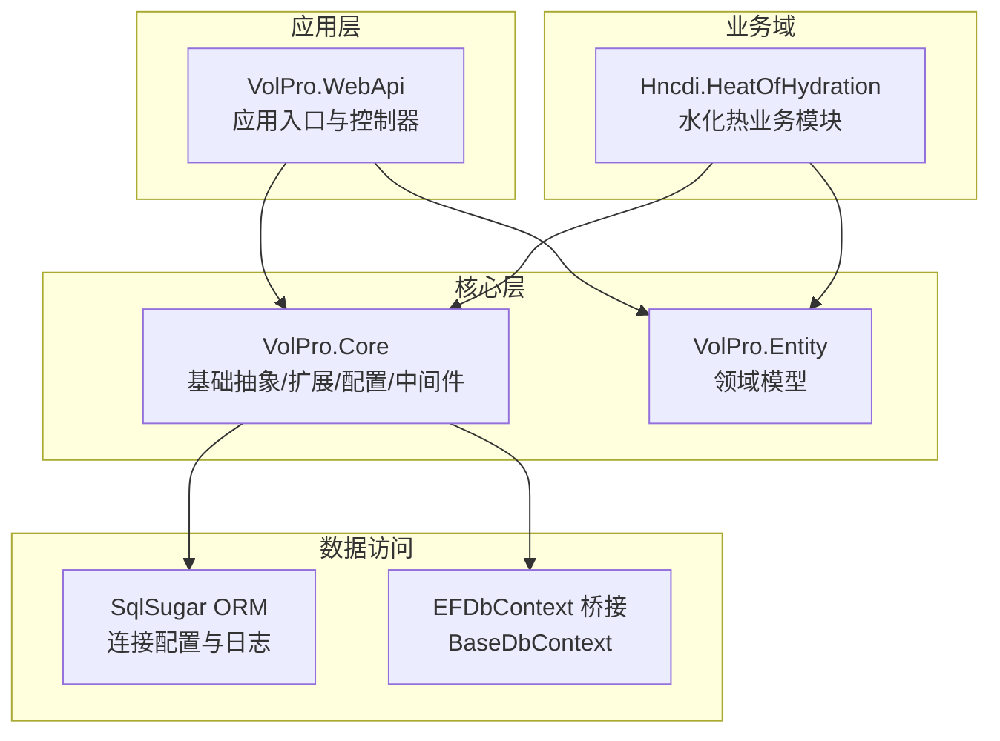
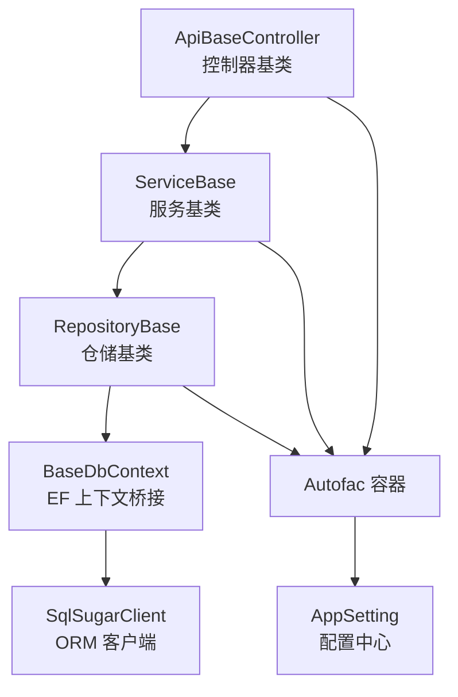
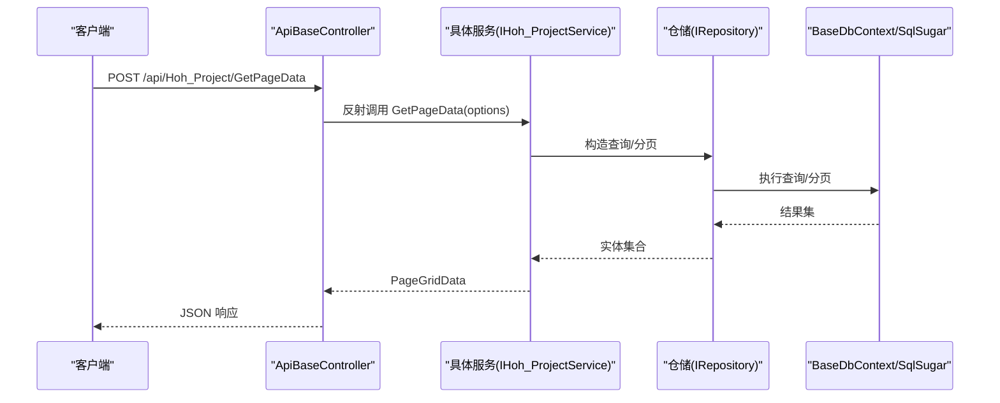
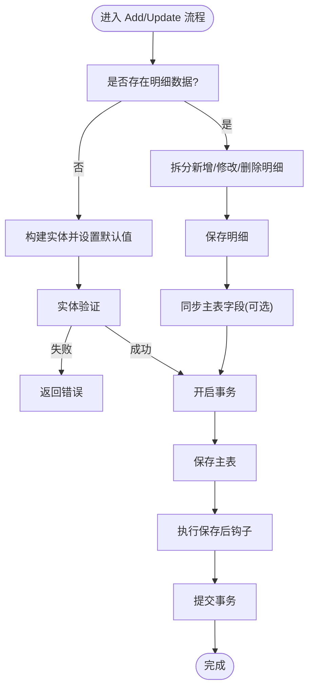
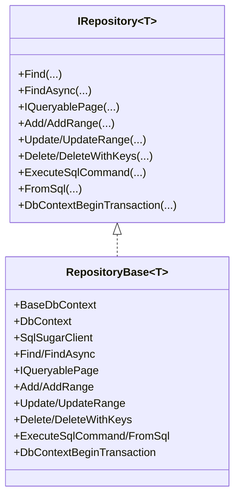
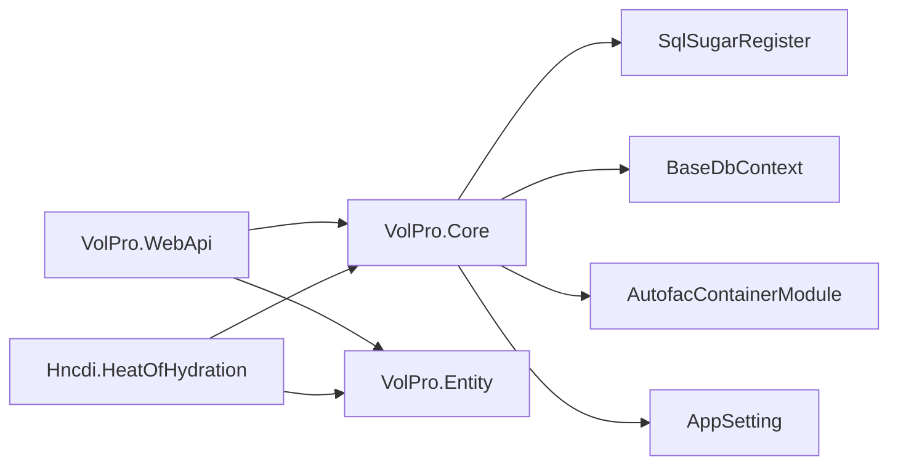

# 系统架构设计

<cite>
**本文档引用的文件**
- [Program.cs](file://VolPro.WebApi/Program.cs)
- [Startup.cs](file://VolPro.WebApi/Startup.cs)
- [IRepository.cs](file://VolPro.Core/BaseProvider/IRepository.cs)
- [IService.cs](file://VolPro.Core/BaseProvider/IService.cs)
- [RepositoryBase.cs](file://VolPro.Core/BaseProvider/RepositoryBase.cs)
- [ServiceBase.cs](file://VolPro.Core/BaseProvider/ServiceBase.cs)
- [BaseDbContext.cs](file://VolPro.Core/EFDbContext/BaseDbContext.cs)
- [SqlSugarRegister.cs](file://VolPro.Core/DbSqlSugar/SqlSugarRegister.cs)
- [AutofacContainerModule.cs](file://VolPro.Core/Extensions/AutofacManager/AutofacContainerModule.cs)
- [ApiBaseController.cs](file://VolPro.Core/Controllers/Basic/ApiBaseController.cs)
- [AppSetting.cs](file://VolPro.Core/Configuration/AppSetting.cs)
- [Hoh_ProjectController.cs](file://VolPro.WebApi/Controllers/HeatOfHydration/Hoh_ProjectController.cs)
- [Hoh_ProjectService.cs](file://Hncdi.HeatOfHydration/Services/Hoh/Hoh_ProjectService.cs)
- [Hncdi.HeatOfHydration.csproj](file://Hncdi.HeatOfHydration/Hncdi.HeatOfHydration.csproj)
</cite>

## 目录
1. [引言](#引言)
2. [项目结构](#项目结构)
3. [核心组件](#核心组件)
4. [架构总览](#架构总览)
5. [详细组件分析](#详细组件分析)
6. [依赖关系分析](#依赖关系分析)
7. [性能考虑](#性能考虑)
8. [故障排除指南](#故障排除指南)
9. [结论](#结论)
10. [附录](#附录)

## 引言
本文件面向“水化热平台”项目的系统架构设计，基于仓库现有代码进行深入分析，重点阐述以下方面：
- 整体架构模式：采用经典的三层架构（表现层、业务逻辑层、数据访问层），结合依赖注入容器（Autofac）与模块化组织结构，确保高内聚、低耦合与可扩展性。
- 层次职责划分：明确控制器、服务层、仓储层的职责边界与协作机制。
- 核心设计模式：仓储模式、工厂模式（通过依赖注入与扩展方法体现）、策略模式（多租户、多数据库类型）等。
- 架构决策的技术考量：围绕性能、可扩展性与可维护性的权衡，给出可落地的建议与图示。

## 项目结构
项目采用多项目组合的模块化布局，核心模块包括：
- VolPro.WebApi：Web 应用入口，负责启动、中间件、路由与控制器注册。
- VolPro.Core：通用基础设施与核心能力，包含基础仓储与服务抽象、EF 上下文桥接、SqlSugar 注册、Autofac 容器扩展、控制器基类、配置中心等。
- VolPro.Entity：领域模型与系统模型，承载实体定义与系统表结构。
- Hncdi.HeatOfHydration：业务域模块，封装水化热相关实体、仓储与服务接口与实现，并引用 VolPro.Core 与 VolPro.Entity。
- 其他模块（如 VolPro.Sys、VolPro.Mes、VolPro.Builder、VolPro.DbTest）按相同模式组织，形成统一的分层与依赖规范。

图表来源
- [Program.cs:15-38](file://VolPro.WebApi/Program.cs#L15-L38)
- [Startup.cs:60-213](file://VolPro.WebApi/Startup.cs#L60-L213)
- [SqlSugarRegister.cs:76-131](file://VolPro.Core/DbSqlSugar/SqlSugarRegister.cs#L76-L131)
- [BaseDbContext.cs:18-40](file://VolPro.Core/EFDbContext/BaseDbContext.cs#L18-L40)
- [Hncdi.HeatOfHydration.csproj:9-12](file://Hncdi.HeatOfHydration/Hncdi.HeatOfHydration.csproj#L9-L12)

章节来源
- [Program.cs:15-38](file://VolPro.WebApi/Program.cs#L15-L38)
- [Startup.cs:60-213](file://VolPro.WebApi/Startup.cs#L60-L213)
- [Hncdi.HeatOfHydration.csproj:9-12](file://Hncdi.HeatOfHydration/Hncdi.HeatOfHydration.csproj#L9-L12)

## 核心组件
- 表现层（控制器）
  - 以 ApiBaseController 为基类，统一提供分页查询、导入导出、上传下载、增删改等标准接口，通过反射调用具体服务方法，降低控制器样板代码，提升一致性与可维护性。
- 业务逻辑层（服务）
  - 以 ServiceBase 为核心抽象，提供分页查询、明细查询、导入导出、上传下载、主从数据保存、工作流与审计等通用能力；通过仓储接口解耦业务与数据访问。
- 数据访问层（仓储）
  - 以 IRepository 与 RepositoryBase 抽象，封装查询、分页、增删改、事务、SQL 执行等操作；通过 BaseDbContext 与 SqlSugarClient 桥接，统一数据访问入口。
- 基础设施与配置
  - 通过 Autofac 容器与扩展模块实现依赖注入；通过 AppSetting 统一读取配置；通过 SqlSugarRegister 注册多数据库连接与全局日志。

章节来源
- [ApiBaseController.cs:19-228](file://VolPro.Core/Controllers/Basic/ApiBaseController.cs#L19-L228)
- [IService.cs:14-164](file://VolPro.Core/BaseProvider/IService.cs#L14-L164)
- [IRepository.cs:19-327](file://VolPro.Core/BaseProvider/IRepository.cs#L19-L327)
- [ServiceBase.cs:31-80](file://VolPro.Core/BaseProvider/ServiceBase.cs#L31-L80)
- [RepositoryBase.cs:29-651](file://VolPro.Core/BaseProvider/RepositoryBase.cs#L29-L651)
- [BaseDbContext.cs:18-40](file://VolPro.Core/EFDbContext/BaseDbContext.cs#L18-L40)
- [SqlSugarRegister.cs:76-131](file://VolPro.Core/DbSqlSugar/SqlSugarRegister.cs#L76-L131)
- [AutofacContainerModule.cs:7-14](file://VolPro.Core/Extensions/AutofacManager/AutofacContainerModule.cs#L7-L14)
- [AppSetting.cs:85-163](file://VolPro.Core/Configuration/AppSetting.cs#L85-L163)

## 架构总览
系统采用“三层架构 + 依赖注入 + 模块化”的组合模式：
- 表现层：控制器继承 ApiBaseController，集中处理鉴权、权限、日志与响应包装。
- 业务层：服务继承 ServiceBase，复用分页、导入导出、上传下载、主从保存等通用逻辑。
- 数据层：仓储继承 RepositoryBase，统一事务、分页、SQL 执行与实体操作。
- 基础设施：Autofac 注入容器、SqlSugar 多数据库连接、EF 上下文桥接、配置中心、中间件与过滤器。

图表来源
- [ApiBaseController.cs:19-228](file://VolPro.Core/Controllers/Basic/ApiBaseController.cs#L19-L228)
- [ServiceBase.cs:31-80](file://VolPro.Core/BaseProvider/ServiceBase.cs#L31-L80)
- [RepositoryBase.cs:29-60](file://VolPro.Core/BaseProvider/RepositoryBase.cs#L29-L60)
- [BaseDbContext.cs:18-40](file://VolPro.Core/EFDbContext/BaseDbContext.cs#L18-L40)
- [SqlSugarRegister.cs:76-131](file://VolPro.Core/DbSqlSugar/SqlSugarRegister.cs#L76-L131)
- [AutofacContainerModule.cs:7-14](file://VolPro.Core/Extensions/AutofacManager/AutofacContainerModule.cs#L7-L14)
- [AppSetting.cs:85-163](file://VolPro.Core/Configuration/AppSetting.cs#L85-L163)

## 详细组件分析

### 控制器层（ApiBaseController）
- 职责：统一处理鉴权（JWTAuthorize）、权限控制（ApiActionPermission）、日志记录（ActionLog）、以及分页查询、导入导出、上传下载、增删改等通用接口。
- 交互模式：通过反射调用具体服务实例的方法，实现“控制器薄、服务厚”的设计，便于扩展与维护。
- 关键点：路由约定（如 GetPageData、Import、Export 等），参数封装（PageDataOptions、SaveModel），响应包装（WebResponseContent）。

图表来源
- [ApiBaseController.cs:35-41](file://VolPro.Core/Controllers/Basic/ApiBaseController.cs#L35-L41)
- [ServiceBase.cs:285-340](file://VolPro.Core/BaseProvider/ServiceBase.cs#L285-L340)
- [RepositoryBase.cs:208-230](file://VolPro.Core/BaseProvider/RepositoryBase.cs#L208-L230)
- [BaseDbContext.cs:32-40](file://VolPro.Core/EFDbContext/BaseDbContext.cs#L32-L40)

章节来源
- [ApiBaseController.cs:19-228](file://VolPro.Core/Controllers/Basic/ApiBaseController.cs#L19-L228)
- [Hoh_ProjectController.cs:11-18](file://VolPro.WebApi/Controllers/HeatOfHydration/Hoh_ProjectController.cs#L11-L18)

### 服务层（ServiceBase）
- 职责：封装业务规则与流程，提供分页查询、明细查询、导入导出、上传下载、主从保存、工作流与审计等能力。
- 设计要点：通过泛型约束 IRepository<T> 与实体 T 解耦；利用 Autofac 容器获取缓存与上下文；支持多租户过滤与权限字段过滤；支持雪花 ID 生成与默认字段填充。
- 关键流程：Add/Update 主从保存时，自动识别明细类型并执行新增、修改、删除同步；导出时根据角色权限裁剪字段。

图表来源
- [ServiceBase.cs:659-761](file://VolPro.Core/BaseProvider/ServiceBase.cs#L659-L761)
- [ServiceBase.cs:778-800](file://VolPro.Core/BaseProvider/ServiceBase.cs#L778-L800)
- [RepositoryBase.cs:347-481](file://VolPro.Core/BaseProvider/RepositoryBase.cs#L347-L481)

章节来源
- [ServiceBase.cs:31-80](file://VolPro.Core/BaseProvider/ServiceBase.cs#L31-L80)
- [ServiceBase.cs:285-340](file://VolPro.Core/BaseProvider/ServiceBase.cs#L285-L340)
- [ServiceBase.cs:659-761](file://VolPro.Core/BaseProvider/ServiceBase.cs#L659-L761)
- [ServiceBase.cs:778-800](file://VolPro.Core/BaseProvider/ServiceBase.cs#L778-L800)

### 仓储层（RepositoryBase）
- 职责：封装数据访问细节，提供查询、分页、增删改、事务、SQL 执行、实体跟踪解除等能力。
- 设计要点：统一通过 BaseDbContext.SqlSugarClient 访问；支持逻辑删除过滤、多租户过滤、雪花 ID 与分表；提供批量插入、更新、删除与 SQL 直接执行。
- 关键流程：事务封装 DbContextBeginTransaction，统一回滚与提交；分页通过 IQueryablePage 组合排序与跳页；明细同步通过 UpdateRange<Detail> 实现。

图表来源
- [IRepository.cs:19-327](file://VolPro.Core/BaseProvider/IRepository.cs#L19-L327)
- [RepositoryBase.cs:29-651](file://VolPro.Core/BaseProvider/RepositoryBase.cs#L29-L651)

章节来源
- [IRepository.cs:19-327](file://VolPro.Core/BaseProvider/IRepository.cs#L19-L327)
- [RepositoryBase.cs:29-651](file://VolPro.Core/BaseProvider/RepositoryBase.cs#L29-L651)

### EF 上下文桥接（BaseDbContext）
- 职责：为 EF Core 提供与 SqlSugar 的桥接，统一通过 SqlSugarClient 执行查询与保存队列，避免 EF Core 的复杂映射与迁移成本。
- 特性：Set<TEntity>() 返回 ISugarQueryable；SaveChanges() 调用 SqlSugar 的 SaveQueues()；保留 EF 的扩展点以便未来演进。

章节来源
- [BaseDbContext.cs:18-40](file://VolPro.Core/EFDbContext/BaseDbContext.cs#L18-L40)

### 依赖注入与容器（Autofac + 扩展）
- 容器：Program 中使用 UseServiceProviderFactory(new AutofacServiceProviderFactory())，Startup.ConfigureContainer 中注册模块与服务。
- 扩展：AutofacContainerModule.GetService<T>() 提供静态便捷获取服务的能力；ServiceBase 通过该扩展获取缓存与上下文。
- 作用：实现松耦合的服务发现与生命周期管理，支持多模块按需装配。

章节来源
- [Program.cs:36-36](file://VolPro.WebApi/Program.cs#L36-L36)
- [Startup.cs:214-217](file://VolPro.WebApi/Startup.cs#L214-L217)
- [AutofacContainerModule.cs:7-14](file://VolPro.Core/Extensions/AutofacManager/AutofacContainerModule.cs#L7-L14)
- [ServiceBase.cs:39-53](file://VolPro.Core/BaseProvider/ServiceBase.cs#L39-L53)

### 配置中心（AppSetting）
- 职责：集中读取与初始化配置，包括数据库连接、Redis、JWT、雪花算法、多租户字段、导出加密等。
- 机制：Startup.ConfigureServices 中调用 AppSetting.Init(...)，将配置注入到服务容器并供其他组件使用。

章节来源
- [AppSetting.cs:85-163](file://VolPro.Core/Configuration/AppSetting.cs#L85-L163)
- [Startup.cs:211-211](file://VolPro.WebApi/Startup.cs#L211-L211)

### 数据库注册（SqlSugarRegister）
- 职责：注册多数据库连接配置（含空库用于租户动态分库），设置全局日志回调，支持不同数据库类型与列名策略。
- 机制：UseSqlSugar 扩展方法在服务集合中注册 ISqlSugarClient 单例，支持多连接与日志输出。

章节来源
- [SqlSugarRegister.cs:76-131](file://VolPro.Core/DbSqlSugar/SqlSugarRegister.cs#L76-L131)

## 依赖关系分析
- 模块间依赖
  - VolPro.WebApi 依赖 VolPro.Core 与 VolPro.Entity。
  - Hncdi.HeatOfHydration 依赖 VolPro.Core 与 VolPro.Entity，实现水化热业务的接口与服务。
- 组件内依赖
  - 控制器依赖服务接口；服务依赖仓储接口；仓储依赖 BaseDbContext 与 SqlSugarClient。
- 容器与配置
  - Autofac 负责服务解析；AppSetting 负责配置读取；SqlSugarRegister 负责数据库连接注册。

图表来源
- [Hncdi.HeatOfHydration.csproj:9-12](file://Hncdi.HeatOfHydration/Hncdi.HeatOfHydration.csproj#L9-L12)
- [Program.cs:36-36](file://VolPro.WebApi/Program.cs#L36-L36)
- [Startup.cs:211-213](file://VolPro.WebApi/Startup.cs#L211-L213)
- [SqlSugarRegister.cs:76-131](file://VolPro.Core/DbSqlSugar/SqlSugarRegister.cs#L76-L131)
- [BaseDbContext.cs:18-40](file://VolPro.Core/EFDbContext/BaseDbContext.cs#L18-L40)
- [AutofacContainerModule.cs:7-14](file://VolPro.Core/Extensions/AutofacManager/AutofacContainerModule.cs#L7-L14)
- [AppSetting.cs:85-163](file://VolPro.Core/Configuration/AppSetting.cs#L85-L163)

章节来源
- [Hncdi.HeatOfHydration.csproj:9-12](file://Hncdi.HeatOfHydration/Hncdi.HeatOfHydration.csproj#L9-L12)
- [Program.cs:36-36](file://VolPro.WebApi/Program.cs#L36-L36)
- [Startup.cs:211-213](file://VolPro.WebApi/Startup.cs#L211-L213)

## 性能考虑
- 查询与分页
  - 通过 RepositoryBase.IQueryablePage 与 ServiceBase.GetPageData 统一分页与排序，避免一次性加载大量数据。
- 事务与批量操作
  - RepositoryBase.DbContextBeginTransaction 统一封装事务，减少重复代码；批量插入/更新通过 SqlSugar 的 Queue 与 ExecuteCommand 提升吞吐。
- 日志与可观测性
  - SqlSugarRegister 在全局与业务库分别注册日志回调，便于定位慢查询与异常 SQL。
- 缓存与上下文
  - ServiceBase 通过 AutofacContainerModule 获取缓存服务，结合 AppSetting.UseRedis 与缓存键扩展，降低重复计算与数据库压力。
- 多租户与权限
  - ServiceBase.ValidatePageOptions 与权限字段过滤，避免不必要的字段查询与越权访问。

[本节为通用指导，无需列出具体文件来源]

## 故障排除指南
- 启动与容器
  - 若出现“未配置好数据库默认连接”，检查 appsettings 中 Connection.DbConnectionString 是否正确且已解密。
- 权限与鉴权
  - 若返回 401，请确认 JWT 配置与 Token 格式（Bearer + 空格）是否正确。
- 文件上传/下载
  - 若上传失败或文件名乱码，检查 Upload/Download 目录权限与路径映射；导出文件路径需确保可访问。
- 事务回滚
  - 若服务层抛出异常导致事务回滚，检查 RepositoryBase.DbContextBeginTransaction 的异常捕获与消息返回。
- 多租户与逻辑删除
  - 若查询结果异常，请确认 ServiceBase 中逻辑删除字段与多租户过滤是否生效。

章节来源
- [AppSetting.cs:144-163](file://VolPro.Core/Configuration/AppSetting.cs#L144-L163)
- [Startup.cs:84-114](file://VolPro.WebApi/Startup.cs#L84-L114)
- [ServiceBase.cs:737-748](file://VolPro.Core/BaseProvider/ServiceBase.cs#L737-L748)
- [RepositoryBase.cs:67-96](file://VolPro.Core/BaseProvider/RepositoryBase.cs#L67-L96)

## 结论
本系统通过“三层架构 + 依赖注入 + 模块化”的设计，在保证清晰职责边界的同时，提供了良好的扩展性与可维护性。核心抽象（IRepository/IService/ServiceBase/RepositoryBase）有效降低了重复代码，统一了事务、分页、导入导出与主从保存等常见业务流程。配合 Autofac 容器与 SqlSugar 注册，系统具备较强的性能与可观测性。建议后续在以下方面持续演进：
- 对热点查询引入缓存策略与索引优化。
- 对大事务拆分与异步化，减少阻塞。
- 对多租户与权限过滤进一步抽象为可配置策略。
- 对控制器与服务接口进行契约化与自动化文档生成。

[本节为总结性内容，无需列出具体文件来源]

## 附录
- 系统边界与集成点
  - 系统边界：WebApi 作为外部入口，通过控制器与服务交互；服务与仓储通过接口解耦；仓储通过 BaseDbContext 与 SqlSugarClient 访问数据库。
  - 集成点：Autofac 容器作为依赖注入中心；AppSetting 作为配置中心；SqlSugarRegister 作为数据库连接注册中心；EF DbContext 作为桥接层。

章节来源
- [Program.cs:36-36](file://VolPro.WebApi/Program.cs#L36-L36)
- [Startup.cs:211-213](file://VolPro.WebApi/Startup.cs#L211-L213)
- [BaseDbContext.cs:18-40](file://VolPro.Core/EFDbContext/BaseDbContext.cs#L18-L40)
- [SqlSugarRegister.cs:76-131](file://VolPro.Core/DbSqlSugar/SqlSugarRegister.cs#L76-L131)
- [AppSetting.cs:85-163](file://VolPro.Core/Configuration/AppSetting.cs#L85-L163)