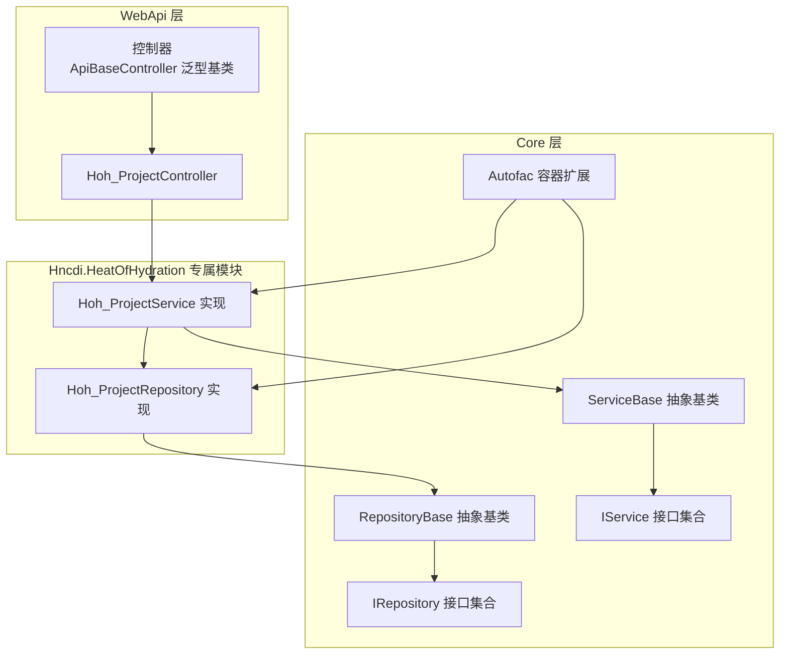
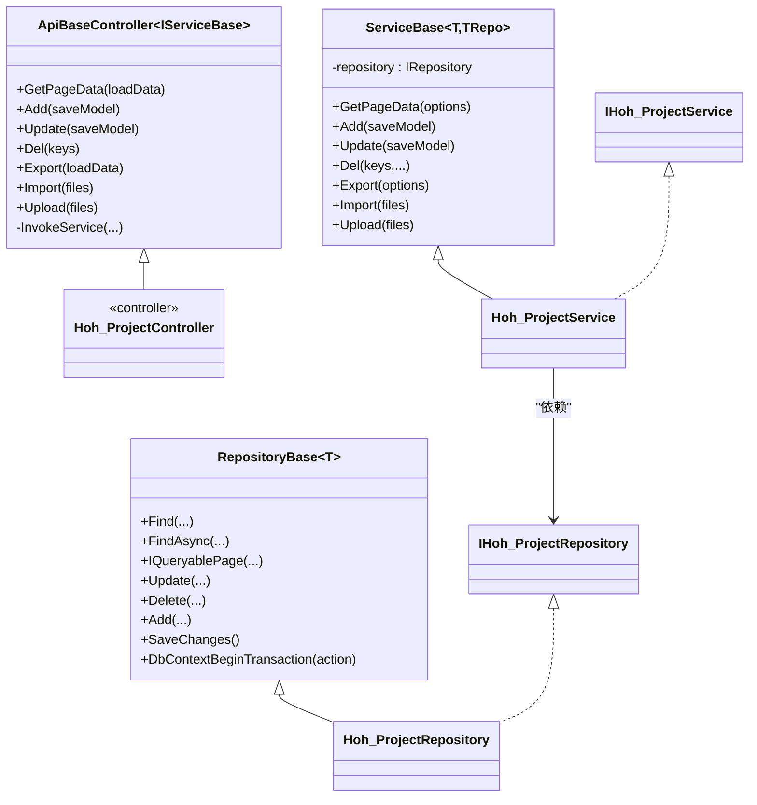
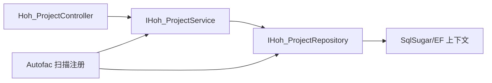

# 组件交互模式

<cite>
**本文引用的文件**
- [Program.cs](file://VolPro.WebApi/Program.cs)
- [Startup.cs](file://VolPro.WebApi/Startup.cs)
- [AutofacContainerModuleExtension.cs](file://VolPro.Core/Extensions/AutofacManager/AutofacContainerModuleExtension.cs)
- [AutofacContainerModule.cs](file://VolPro.Core/Extensions/AutofacManager/AutofacContainerModule.cs)
- [IDependency.cs](file://VolPro.Core/Extensions/AutofacManager/IDependency.cs)
- [IService.cs](file://VolPro.Core/BaseProvider/IService.cs)
- [IRepository.cs](file://VolPro.Core/BaseProvider/IRepository.cs)
- [ServiceBase.cs](file://VolPro.Core/BaseProvider/ServiceBase.cs)
- [RepositoryBase.cs](file://VolPro.Core/BaseProvider/RepositoryBase.cs)
- [ApiBaseController.cs](file://VolPro.Core/Controllers/Basic/ApiBaseController.cs)
- [Hoh_ProjectController.cs](file://VolPro.WebApi/Controllers/HeatOfHydration/Hoh_ProjectController.cs)
- [Hoh_ProjectService.cs](file://Hncdi.HeatOfHydration/Services/Hoh/Hoh_ProjectService.cs)
- [Hoh_ProjectRepository.cs](file://Hncdi.HeatOfHydration/Repositories/Hoh/Hoh_ProjectRepository.cs)
</cite>

## 目录
1. [引言](#引言)
2. [项目结构](#项目结构)
3. [核心组件](#核心组件)
4. [架构总览](#架构总览)
5. [详细组件分析](#详细组件分析)
6. [依赖分析](#依赖分析)
7. [性能考虑](#性能考虑)
8. [故障排查指南](#故障排查指南)
9. [结论](#结论)

## 引言
本文件面向“水化热平台”的组件交互模式，系统性梳理控制器、服务层、仓储层之间的协作关系与依赖注入容器（Autofac）的装配与使用方式，解释通过接口实现的松耦合设计，并给出组件生命周期管理与作用域控制策略。文档还提供了典型业务流程的时序图与依赖图，以及最佳实践与常见陷阱，帮助开发者在保持低耦合的同时获得良好的可维护性与可扩展性。

## 项目结构
- 控制层位于 WebApi 层，采用基于泛型控制器基类的统一入口，将具体业务委派给服务层。
- 服务层位于 Core 层，提供通用能力（分页、导入导出、权限与审计等），并通过仓储层访问数据。
- 仓储层位于 Core 层，封装 SqlSugar 数据访问与 EF 上下文，提供事务与分页等基础设施。
- 水化热专属模块位于 Hncdi.HeatOfHydration，按接口-实现分离的方式复用 Core 的通用能力。
- 依赖注入容器使用 Autofac，通过扩展方法自动扫描并注册实现类，统一生命周期管理。

图表来源
- [ApiBaseController.cs](file://VolPro.Core/Controllers/Basic/ApiBaseController.cs)
- [Hoh_ProjectController.cs](file://VolPro.WebApi/Controllers/HeatOfHydration/Hoh_ProjectController.cs)
- [Hoh_ProjectService.cs](file://Hncdi.HeatOfHydration/Services/Hoh/Hoh_ProjectService.cs)
- [Hoh_ProjectRepository.cs](file://Hncdi.HeatOfHydration/Repositories/Hoh/Hoh_ProjectRepository.cs)
- [ServiceBase.cs](file://VolPro.Core/BaseProvider/ServiceBase.cs)
- [RepositoryBase.cs](file://VolPro.Core/BaseProvider/RepositoryBase.cs)
- [IService.cs](file://VolPro.Core/BaseProvider/IService.cs)
- [IRepository.cs](file://VolPro.Core/BaseProvider/IRepository.cs)
- [AutofacContainerModuleExtension.cs](file://VolPro.Core/Extensions/AutofacManager/AutofacContainerModuleExtension.cs)

章节来源
- [Program.cs](file://VolPro.WebApi/Program.cs)
- [Startup.cs](file://VolPro.WebApi/Startup.cs)
- [AutofacContainerModuleExtension.cs](file://VolPro.Core/Extensions/AutofacManager/AutofacContainerModuleExtension.cs)

## 核心组件
- 控制器基类：提供统一的 API 入口与权限/日志拦截，通过反射调用服务层方法，屏蔽具体业务细节。
- 服务抽象基类：封装分页、导入导出、权限过滤、多租户、工作流、缓存等横切能力；持有仓储实例完成业务编排。
- 仓储抽象基类：封装 SqlSugar 访问、EF 上下文、事务、分页、条件构建、SQL 执行等数据访问通用能力。
- 接口契约：IService 与 IRepository 定义了服务与仓储的最小可用能力集，确保实现与调用解耦。
- Autofac 容器扩展：自动扫描项目内实现 IDependency 的类型，按接口注册并设定生命周期（作用域/单例）。

章节来源
- [ApiBaseController.cs](file://VolPro.Core/Controllers/Basic/ApiBaseController.cs)
- [ServiceBase.cs](file://VolPro.Core/BaseProvider/ServiceBase.cs)
- [RepositoryBase.cs](file://VolPro.Core/BaseProvider/RepositoryBase.cs)
- [IService.cs](file://VolPro.Core/BaseProvider/IService.cs)
- [IRepository.cs](file://VolPro.Core/BaseProvider/IRepository.cs)
- [AutofacContainerModuleExtension.cs](file://VolPro.Core/Extensions/AutofacManager/AutofacContainerModuleExtension.cs)

## 架构总览
系统采用三层架构与依赖倒置原则：
- 控制器仅依赖服务接口，通过构造函数注入具体服务实现。
- 服务层依赖仓储接口，通过构造函数注入具体仓储实现。
- 仓储层依赖数据库访问抽象（SqlSugar/EF），负责数据持久化与事务控制。
- 依赖注入容器负责装配与生命周期管理，实现运行期的多态替换。

图表来源
- [ApiBaseController.cs](file://VolPro.Core/Controllers/Basic/ApiBaseController.cs)
- [Hoh_ProjectController.cs](file://VolPro.WebApi/Controllers/HeatOfHydration/Hoh_ProjectController.cs)
- [ServiceBase.cs](file://VolPro.Core/BaseProvider/ServiceBase.cs)
- [RepositoryBase.cs](file://VolPro.Core/BaseProvider/RepositoryBase.cs)
- [Hoh_ProjectService.cs](file://Hncdi.HeatOfHydration/Services/Hoh/Hoh_ProjectService.cs)
- [Hoh_ProjectRepository.cs](file://Hncdi.HeatOfHydration/Repositories/Hoh/Hoh_ProjectRepository.cs)

## 详细组件分析

### 控制器层
- 统一入口：ApiBaseController 通过路由与特性标注提供标准 CRUD 与导入导出能力，内部通过反射调用服务层方法，避免重复样板代码。
- 权限与日志：控制器内置权限与操作日志中间件，保证安全与审计。
- 与服务层交互：控制器仅持有服务接口，通过构造函数注入，实现与实现解耦。

章节来源
- [ApiBaseController.cs](file://VolPro.Core/Controllers/Basic/ApiBaseController.cs)
- [Hoh_ProjectController.cs](file://VolPro.WebApi/Controllers/HeatOfHydration/Hoh_ProjectController.cs)

### 服务层
- 通用能力：ServiceBase 封装分页、权限字段过滤、导出模板、导入校验、雪花 ID、多租户过滤、工作流集成、缓存访问等。
- 仓储编排：服务层持有 IRepository 实例，负责业务规则与流程编排，必要时开启事务。
- 横切关注点：日志、权限、审计、导出/导入等横切逻辑集中在基类，降低重复。

章节来源
- [ServiceBase.cs](file://VolPro.Core/BaseProvider/ServiceBase.cs)
- [IService.cs](file://VolPro.Core/BaseProvider/IService.cs)

### 仓储层
- 数据访问抽象：RepositoryBase 封装 SqlSugar/EF 访问、分页、条件构建、事务、批量操作、SQL 执行等。
- 生命周期：仓储通常以“作用域”注册，确保一次请求内的仓储实例共享同一上下文。
- 事务控制：提供 DbContextBeginTransaction 包装事务提交/回滚，简化业务层事务处理。

章节来源
- [RepositoryBase.cs](file://VolPro.Core/BaseProvider/RepositoryBase.cs)
- [IRepository.cs](file://VolPro.Core/BaseProvider/IRepository.cs)

### 依赖注入与生命周期
- 容器工厂：Program 中设置 AutofacServiceProviderFactory，使 ASP.NET Core 使用 Autofac 作为服务提供者。
- 容器装配：Startup.ConfigureContainer 中调用 AddModule，扫描实现 IDependency 的类型，按接口注册并设定生命周期。
- 生命周期策略：
  - 作用域（默认）：InstancePerLifetimeScope，适合服务与仓储，确保一次请求内共享实例。
  - 单例（Singleton）：SingleInstance，适用于只读、无状态的服务（如缓存服务）。
  - 瞬态（Transient）：未显式声明时默认瞬态，一般不推荐用于仓储与服务。
- 缓存服务：根据配置选择 Redis 或内存缓存，注册为单例。

章节来源
- [Program.cs](file://VolPro.WebApi/Program.cs)
- [Startup.cs](file://VolPro.WebApi/Startup.cs)
- [AutofacContainerModuleExtension.cs](file://VolPro.Core/Extensions/AutofacManager/AutofacContainerModuleExtension.cs)
- [AutofacContainerModule.cs](file://VolPro.Core/Extensions/AutofacManager/AutofacContainerModule.cs)
- [IDependency.cs](file://VolPro.Core/Extensions/AutofacManager/IDependency.cs)

### 水化热专属组件
- Hoh_ProjectController：继承 ApiBaseController，路由到 api/Hoh_Project，权限表名为 Hoh_Project。
- Hoh_ProjectService：继承 ServiceBase，依赖 IHoh_ProjectRepository，实现 IDependency，支持静态 Instance 获取。
- Hoh_ProjectRepository：继承 RepositoryBase，构造函数注入 ServiceDbContext，支持静态 Instance 获取。

章节来源
- [Hoh_ProjectController.cs](file://VolPro.WebApi/Controllers/HeatOfHydration/Hoh_ProjectController.cs)
- [Hoh_ProjectService.cs](file://Hncdi.HeatOfHydration/Services/Hoh/Hoh_ProjectService.cs)
- [Hoh_ProjectRepository.cs](file://Hncdi.HeatOfHydration/Repositories/Hoh/Hoh_ProjectRepository.cs)

## 依赖分析
- 控制器依赖服务接口，服务依赖仓储接口，仓储依赖数据库访问抽象，形成清晰的依赖方向。
- 通过 Autofac 自动扫描实现 IDependency 的类型，按接口注册，避免硬编码注册。
- 作用域内共享仓储实例，减少上下文切换成本；缓存服务单例，提升性能。

图表来源
- [Hoh_ProjectController.cs](file://VolPro.WebApi/Controllers/HeatOfHydration/Hoh_ProjectController.cs)
- [Hoh_ProjectService.cs](file://Hncdi.HeatOfHydration/Services/Hoh/Hoh_ProjectService.cs)
- [Hoh_ProjectRepository.cs](file://Hncdi.HeatOfHydration/Repositories/Hoh/Hoh_ProjectRepository.cs)
- [AutofacContainerModuleExtension.cs](file://VolPro.Core/Extensions/AutofacManager/AutofacContainerModuleExtension.cs)

章节来源
- [AutofacContainerModuleExtension.cs](file://VolPro.Core/Extensions/AutofacManager/AutofacContainerModuleExtension.cs)

## 性能考虑
- 作用域与单例：服务与仓储建议作用域，缓存服务单例；避免在单例中持有短生命周期对象。
- 分页与排序：优先在数据库侧完成排序与分页，避免一次性加载全量数据。
- 事务边界：将相关联的多次写操作放入单个事务，减少回滚与锁竞争。
- 缓存策略：合理利用内存或 Redis 缓存热点数据，降低数据库压力。
- SQL 注入与参数化：统一使用参数化查询与 SqlSugar 参数化工具，避免字符串拼接。

## 故障排查指南
- 控制器无法注入服务：确认服务已实现 IDependency 并被 Autofac 扫描注册。
- 事务未生效：检查服务层是否使用 DbContextBeginTransaction，确保异常时回滚。
- 权限字段缺失：确认角色权限字段过滤逻辑与实体属性映射正确。
- 多租户过滤异常：检查实体上的多租户属性与过滤器配置。
- 缓存不可用：确认 AppSetting.UseRedis 配置与缓存服务注册一致性。

章节来源
- [ServiceBase.cs](file://VolPro.Core/BaseProvider/ServiceBase.cs)
- [RepositoryBase.cs](file://VolPro.Core/BaseProvider/RepositoryBase.cs)
- [AutofacContainerModuleExtension.cs](file://VolPro.Core/Extensions/AutofacManager/AutofacContainerModuleExtension.cs)

## 结论
该系统通过接口契约与 Autofac 容器实现了清晰的分层与松耦合设计。控制器仅依赖服务接口，服务层编排业务并依赖仓储接口，仓储层专注数据访问与事务控制。借助作用域与单例的生命周期策略，系统在可维护性与性能之间取得平衡。遵循本文的最佳实践与常见陷阱规避建议，可在水化热平台及其他类似项目中稳定扩展与演进。