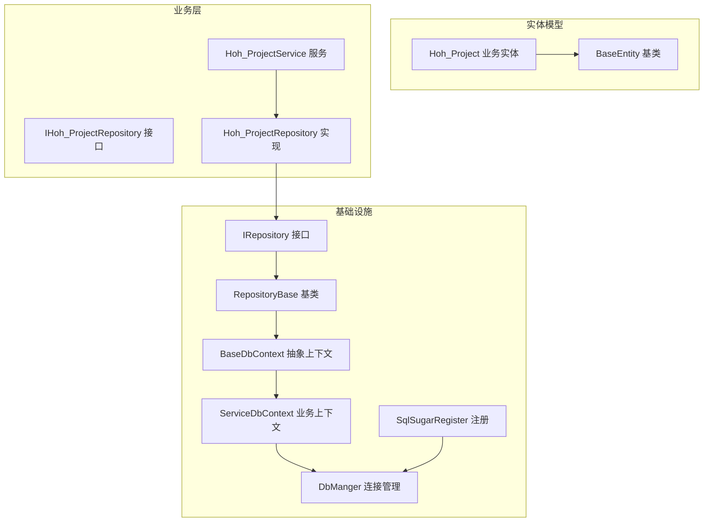
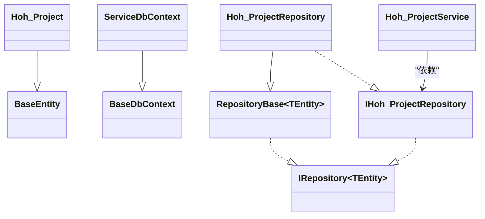
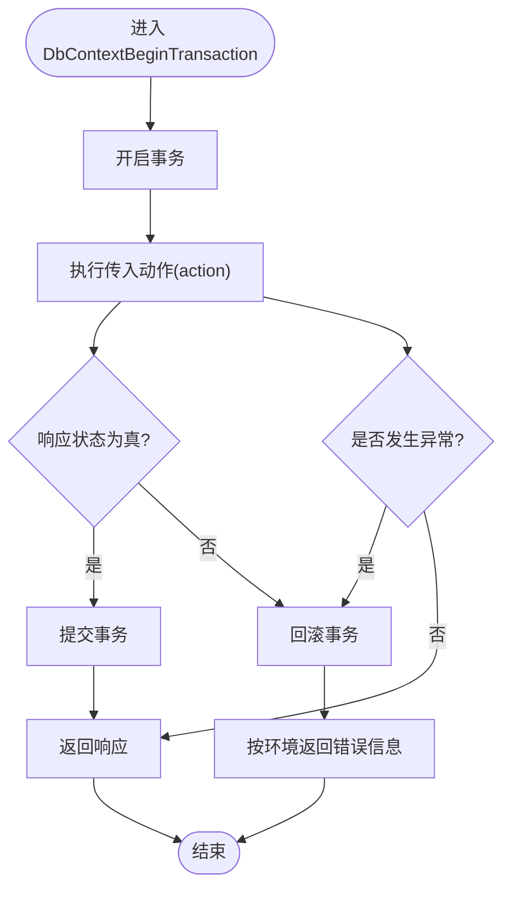
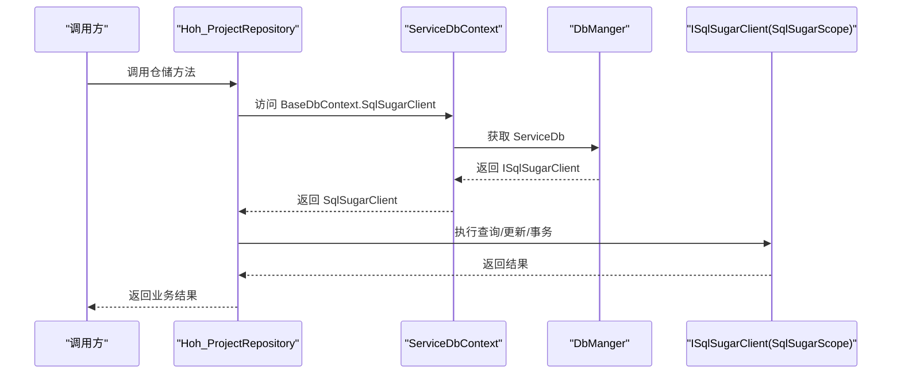
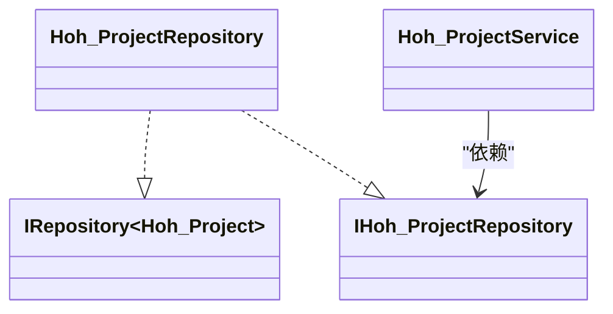

# 仓储模式实现

<cite>
**本文引用的文件**
- [RepositoryBase.cs](file://VolPro.Core/BaseProvider/RepositoryBase.cs)
- [IRepository.cs](file://VolPro.Core/BaseProvider/IRepository.cs)
- [BaseDbContext.cs](file://VolPro.Core/EFDbContext/BaseDbContext.cs)
- [ServiceDbContext.cs](file://VolPro.Core/EFDbContext/ServiceDbContext.cs)
- [DbManger.cs](file://VolPro.Core\DbSqlSugar\DbManger.cs)
- [SqlSugarRegister.cs](file://VolPro.Core\DbSqlSugar/SqlSugarRegister.cs)
- [BaseEntity.cs](file://VolPro.Entity/SystemModels/BaseEntity.cs)
- [Hoh_Project.cs](file://VolPro.Entity/DomainModels/Hoh/Hoh_Project.cs)
- [IHoh_ProjectRepository.cs](file://Hncdi.HeatOfHydration/IRepositories/Hoh/IHoh_ProjectRepository.cs)
- [Hoh_ProjectRepository.cs](file://Hncdi.HeatOfHydration/Repositories/Hoh/Hoh_ProjectRepository.cs)
- [Hoh_ProjectService.cs](file://Hncdi.HeatOfHydration/Services/Hoh/Hoh_ProjectService.cs)
- [LambdaExtensions.cs](file://VolPro.Core/Extensions/LambdaExtensions.cs)
</cite>

## 目录
1. [简介](#简介)
2. [项目结构](#项目结构)
3. [核心组件](#核心组件)
4. [架构总览](#架构总览)
5. [详细组件分析](#详细组件分析)
6. [依赖关系分析](#依赖关系分析)
7. [性能考量](#性能考量)
8. [故障排查指南](#故障排查指南)
9. [结论](#结论)
10. [附录](#附录)

## 简介
本文件面向“水化热平台”的仓储模式实现，系统性阐述RepositoryBase基类的设计理念、泛型约束、数据库上下文管理与事务处理机制；说明仓储模式如何实现数据访问层的抽象，并通过继承RepositoryBase实现具体业务仓储；提供使用仓储进行CRUD操作的示例路径；总结仓储模式的优势（代码复用、可测试性、数据访问抽象）及事务管理最佳实践与错误处理策略。

## 项目结构
围绕仓储模式的关键模块分布如下：
- 基础设施与上下文
  - VolPro.Core/BaseProvider：仓储接口与基类
  - VolPro.Core/EFDbContext：EF上下文抽象与业务上下文
  - VolPro.Core/DbSqlSugar：SqlSugar连接管理与注册
- 实体模型
  - VolPro.Entity/SystemModels：基础实体基类
  - VolPro.Entity/DomainModels/Hoh：业务实体（如Hoh_Project）
- 业务仓储与服务
  - Hncdi.HeatOfHydration/IRepositories/Hoh：仓储接口
  - Hncdi.HeatOfHydration/Repositories/Hoh：仓储实现
  - Hncdi.HeatOfHydration/Services/Hoh：服务层（依赖仓储）

图表来源
- [IRepository.cs:19-327](file://VolPro.Core/BaseProvider/IRepository.cs#L19-L327)
- [RepositoryBase.cs:29-651](file://VolPro.Core/BaseProvider/RepositoryBase.cs#L29-L651)
- [BaseDbContext.cs:18-161](file://VolPro.Core/EFDbContext/BaseDbContext.cs#L18-L161)
- [ServiceDbContext.cs:13-31](file://VolPro.Core/EFDbContext/ServiceDbContext.cs#L13-L31)
- [DbManger.cs:21-159](file://VolPro.Core/DbSqlSugar/DbManger.cs#L21-L159)
- [SqlSugarRegister.cs:23-155](file://VolPro.Core.DbSqlSugar/SqlSugarRegister.cs#L23-L155)
- [BaseEntity.cs:7-11](file://VolPro.Entity/SystemModels/BaseEntity.cs#L7-L11)
- [Hoh_Project.cs:17-230](file://VolPro.Entity/DomainModels/Hoh/Hoh_Project.cs#L17-L230)
- [IHoh_ProjectRepository.cs:15-18](file://Hncdi.HeatOfHydration/IRepositories/Hoh/IHoh_ProjectRepository.cs#L15-L18)
- [Hoh_ProjectRepository.cs:13-25](file://Hncdi.HeatOfHydration/Repositories/Hoh/Hoh_ProjectRepository.cs#L13-L25)
- [Hoh_ProjectService.cs:16-23](file://Hncdi.HeatOfHydration/Services/Hoh/Hoh_ProjectService.cs#L16-L23)

章节来源
- [RepositoryBase.cs:29-651](file://VolPro.Core/BaseProvider/RepositoryBase.cs#L29-L651)
- [IRepository.cs:19-327](file://VolPro.Core/BaseProvider/IRepository.cs#L19-L327)
- [BaseDbContext.cs:18-161](file://VolPro.Core/EFDbContext/BaseDbContext.cs#L18-L161)
- [ServiceDbContext.cs:13-31](file://VolPro.Core/EFDbContext/ServiceDbContext.cs#L13-L31)
- [DbManger.cs:21-159](file://VolPro.Core/DbSqlSugar/DbManger.cs#L21-L159)
- [SqlSugarRegister.cs:23-155](file://VolPro.Core.DbSqlSugar/SqlSugarRegister.cs#L23-L155)
- [BaseEntity.cs:7-11](file://VolPro.Entity/SystemModels/BaseEntity.cs#L7-L11)
- [Hoh_Project.cs:17-230](file://VolPro.Entity/DomainModels/Hoh/Hoh_Project.cs#L17-L230)
- [IHoh_ProjectRepository.cs:15-18](file://Hncdi.HeatOfHydration/IRepositories/Hoh/IHoh_ProjectRepository.cs#L15-L18)
- [Hoh_ProjectRepository.cs:13-25](file://Hncdi.HeatOfHydration/Repositories/Hoh/Hoh_ProjectRepository.cs#L13-L25)
- [Hoh_ProjectService.cs:16-23](file://Hncdi.HeatOfHydration/Services/Hoh/Hoh_ProjectService.cs#L16-L23)

## 核心组件
- 泛型约束与实体基类
  - RepositoryBase<TEntity> 对 TEntity 施加了 new() 和 BaseEntity 约束，确保实体具备默认构造函数与统一的实体基类特征。
  - BaseEntity 作为系统模型基类，为所有实体提供统一标识与扩展能力。
- 数据库上下文管理
  - BaseDbContext 将 SqlSugarClient 作为统一数据访问入口，并提供 Set<TEntity>()、SaveChanges() 等方法，屏蔽 EF 与 SqlSugar 的差异。
  - ServiceDbContext 继承 BaseDbContext，注入业务库连接（DbManger.ServiceDb），支持租户动态分库。
  - DbManger 提供业务库、系统库、动态租户库的连接获取与缓存，SqlSugarRegister 负责在 DI 中注册 ISqlSugarClient。
- 仓储接口与基类
  - IRepository<TEntity> 定义了仓储的标准契约，涵盖查询、分页、更新、删除、事务、原生 SQL 等。
  - RepositoryBase<TEntity> 实现了上述契约，封装了常用 CRUD、条件查询、分页、事务、明细联动更新、雪花 ID 生成、分表支持等能力。

章节来源
- [RepositoryBase.cs:29-651](file://VolPro.Core/BaseProvider/RepositoryBase.cs#L29-L651)
- [IRepository.cs:19-327](file://VolPro.Core/BaseProvider/IRepository.cs#L19-L327)
- [BaseDbContext.cs:32-40](file://VolPro.Core/EFDbContext/BaseDbContext.cs#L32-L40)
- [ServiceDbContext.cs:17-28](file://VolPro.Core/EFDbContext/ServiceDbContext.cs#L17-L28)
- [DbManger.cs:26-57](file://VolPro.Core/DbSqlSugar/DbManger.cs#L26-L57)
- [SqlSugarRegister.cs:76-131](file://VolPro.Core.DbSqlSugar/SqlSugarRegister.cs#L76-L131)
- [BaseEntity.cs:7-11](file://VolPro.Entity/SystemModels/BaseEntity.cs#L7-L11)

## 架构总览
仓储模式通过“接口隔离 + 基类实现 + 上下文抽象 + 连接管理”形成清晰的分层：
- 业务实体（如 Hoh_Project）继承系统模型基类，标注实体特性（如 DBServer、明细表等），用于仓储识别与分表/明细联动。
- 仓储接口（IHoh_ProjectRepository）声明业务所需的仓储能力。
- 仓储实现（Hoh_ProjectRepository）继承 RepositoryBase，注入 ServiceDbContext，即可获得统一的 CRUD、事务、分页等能力。
- 服务层（Hoh_ProjectService）依赖仓储接口，实现业务编排与事务控制。

图表来源
- [BaseEntity.cs:7-11](file://VolPro.Entity/SystemModels/BaseEntity.cs#L7-L11)
- [Hoh_Project.cs:17-230](file://VolPro.Entity/DomainModels/Hoh/Hoh_Project.cs#L17-L230)
- [BaseDbContext.cs:18-161](file://VolPro.Core/EFDbContext/BaseDbContext.cs#L18-L161)
- [ServiceDbContext.cs:13-31](file://VolPro.Core/EFDbContext/ServiceDbContext.cs#L13-L31)
- [IRepository.cs:19-327](file://VolPro.Core/BaseProvider/IRepository.cs#L19-L327)
- [RepositoryBase.cs:29-651](file://VolPro.Core/BaseProvider/RepositoryBase.cs#L29-L651)
- [IHoh_ProjectRepository.cs:15-18](file://Hncdi.HeatOfHydration/IRepositories/Hoh/IHoh_ProjectRepository.cs#L15-L18)
- [Hoh_ProjectRepository.cs:13-25](file://Hncdi.HeatOfHydration/Repositories/Hoh/Hoh_ProjectRepository.cs#L13-L25)
- [Hoh_ProjectService.cs:16-23](file://Hncdi.HeatOfHydration/Services/Hoh/Hoh_ProjectService.cs#L16-L23)

## 详细组件分析

### RepositoryBase 基类设计与实现
- 泛型约束与实体要求
  - TEntity 必须可 new() 且继承 BaseEntity，保证仓储可实例化实体并具备统一基类。
- 数据库上下文与客户端
  - 通过构造函数注入 BaseDbContext，统一暴露 DbContext/SqlSugarClient，屏蔽 EF 与 SqlSugar 差异。
  - BaseDbContext.Set<TEntity>() 返回 ISugarQueryable<TEntity>，便于链式查询与分页。
- 事务处理机制
  - DbContextBeginTransaction 接受一个返回 WebResponseContent 的委托，内部开启事务，若响应 Status 为真则提交，否则回滚；异常时统一回滚并按环境返回错误信息。
- 查询与分页
  - Find/FindAsync 支持谓词查询、选择器投影、异步首条/列表查询。
  - WhereIF 提供条件拼接的便捷方法，避免空值/空字符串参与查询。
  - IQueryablePage 支持分页与多字段排序（字典形式），返回可继续链式操作的 ISugarQueryable。
- 更新与删除
  - Update/UpdateRange 支持指定字段更新、批量更新、明细联动更新（含新增/修改/删除统计）。
  - Delete/DeleteWithKeys 支持按实体或主键批量删除，支持分表场景。
  - Add/AddRange 支持雪花 ID 自动生成（long 主键）、分表插入。
- 原生 SQL 与上下文
  - ExecuteSqlCommand/FromSql 提供原生 SQL 执行与查询能力。
  - Detached/DetachedRange 提供上下文跟踪解除（用于更新冲突场景）。

图表来源
- [RepositoryBase.cs:67-96](file://VolPro.Core/BaseProvider/RepositoryBase.cs#L67-L96)

章节来源
- [RepositoryBase.cs:29-651](file://VolPro.Core/BaseProvider/RepositoryBase.cs#L29-L651)
- [IRepository.cs:19-327](file://VolPro.Core/BaseProvider/IRepository.cs#L19-L327)

### 数据库上下文与连接管理
- BaseDbContext
  - 暴露 SqlSugarClient 并提供 Set<TEntity>() 与 SaveChanges()，统一 EF 与 SqlSugar 的使用体验。
- ServiceDbContext
  - 继承 BaseDbContext，注入 DbManger.ServiceDb，支持租户动态分库。
- DbManger
  - 提供业务库、系统库、动态租户库的连接获取与缓存；根据用户上下文动态切换数据库。
- SqlSugarRegister
  - 在 DI 中注册 ISqlSugarClient，缓存配置文件中的所有 DbContext 连接，支持业务库日志与全局日志。

图表来源
- [ServiceDbContext.cs:17-28](file://VolPro.Core/EFDbContext/ServiceDbContext.cs#L17-L28)
- [DbManger.cs:26-57](file://VolPro.Core/DbSqlSugar/DbManger.cs#L26-L57)
- [BaseDbContext.cs:22-40](file://VolPro.Core/EFDbContext/BaseDbContext.cs#L22-L40)
- [SqlSugarRegister.cs:102-129](file://VolPro.Core.DbSqlSugar/SqlSugarRegister.cs#L102-L129)

章节来源
- [BaseDbContext.cs:18-161](file://VolPro.Core/EFDbContext/BaseDbContext.cs#L18-L161)
- [ServiceDbContext.cs:13-31](file://VolPro.Core/EFDbContext/ServiceDbContext.cs#L13-L31)
- [DbManger.cs:21-159](file://VolPro.Core/DbSqlSugar/DbManger.cs#L21-L159)
- [SqlSugarRegister.cs:23-155](file://VolPro.Core.DbSqlSugar/SqlSugarRegister.cs#L23-L155)

### 具体业务仓储与服务
- Hoh_ProjectRepository
  - 继承 RepositoryBase<Hoh_Project>，注入 ServiceDbContext，提供静态 Instance 通过 Autofac 容器获取。
- IHoh_ProjectRepository
  - 继承 IRepository<Hoh_Project>，声明业务仓储能力。
- Hoh_ProjectService
  - 继承 ServiceBase<Hoh_Project, IHoh_ProjectRepository>，依赖仓储接口，实现业务逻辑。

图表来源
- [IHoh_ProjectRepository.cs:15-18](file://Hncdi.HeatOfHydration/IRepositories/Hoh/IHoh_ProjectRepository.cs#L15-L18)
- [Hoh_ProjectRepository.cs:13-25](file://Hncdi.HeatOfHydration/Repositories/Hoh/Hoh_ProjectRepository.cs#L13-L25)
- [Hoh_ProjectService.cs:16-23](file://Hncdi.HeatOfHydration/Services/Hoh/Hoh_ProjectService.cs#L16-L23)

章节来源
- [IHoh_ProjectRepository.cs:15-18](file://Hncdi.HeatOfHydration/IRepositories/Hoh/IHoh_ProjectRepository.cs#L15-L18)
- [Hoh_ProjectRepository.cs:13-25](file://Hncdi.HeatOfHydration/Repositories/Hoh/Hoh_ProjectRepository.cs#L13-L25)
- [Hoh_ProjectService.cs:16-23](file://Hncdi.HeatOfHydration/Services/Hoh/Hoh_ProjectService.cs#L16-L23)

### 仓储模式优势
- 代码复用
  - RepositoryBase 统一实现 CRUD、分页、事务、明细联动更新等通用逻辑，避免重复编码。
- 可测试性
  - 通过 IRepository<TEntity> 接口隔离，可在单元测试中以 Mock 替换仓储实现。
- 数据访问抽象
  - 通过 BaseDbContext/SqlSugarClient 抽象，屏蔽 EF 与 SqlSugar 差异，便于迁移与扩展。

章节来源
- [IRepository.cs:19-327](file://VolPro.Core/BaseProvider/IRepository.cs#L19-L327)
- [RepositoryBase.cs:29-651](file://VolPro.Core/BaseProvider/RepositoryBase.cs#L29-L651)

## 依赖关系分析
- 组件耦合
  - 仓储实现依赖 BaseDbContext 与 SqlSugarClient，通过 DbManger 动态获取连接，降低硬编码耦合。
  - 服务层仅依赖仓储接口，符合依赖倒置原则。
- 外部依赖
  - SqlSugarScope 作为 ISqlSugarClient 的实现，负责连接池、日志与多库配置。
- 循环依赖
  - 未发现循环依赖迹象；仓储与服务通过接口解耦。

图表来源
- [Hoh_ProjectService.cs:16-23](file://Hncdi.HeatOfHydration/Services/Hoh/Hoh_ProjectService.cs#L16-L23)
- [IHoh_ProjectRepository.cs:15-18](file://Hncdi.HeatOfHydration/IRepositories/Hoh/IHoh_ProjectRepository.cs#L15-L18)
- [RepositoryBase.cs:29-651](file://VolPro.Core/BaseProvider/RepositoryBase.cs#L29-L651)
- [BaseDbContext.cs:18-161](file://VolPro.Core/EFDbContext/BaseDbContext.cs#L18-L161)
- [ServiceDbContext.cs:13-31](file://VolPro.Core/EFDbContext/ServiceDbContext.cs#L13-L31)
- [DbManger.cs:21-159](file://VolPro.Core/DbSqlSugar/DbManger.cs#L21-L159)
- [SqlSugarRegister.cs:23-155](file://VolPro.Core.DbSqlSugar/SqlSugarRegister.cs#L23-L155)

章节来源
- [Hoh_ProjectService.cs:16-23](file://Hncdi.HeatOfHydration/Services/Hoh/Hoh_ProjectService.cs#L16-L23)
- [IHoh_ProjectRepository.cs:15-18](file://Hncdi.HeatOfHydration/IRepositories/Hoh/IHoh_ProjectRepository.cs#L15-L18)
- [RepositoryBase.cs:29-651](file://VolPro.Core/BaseProvider/RepositoryBase.cs#L29-L651)
- [BaseDbContext.cs:18-161](file://VolPro.Core/EFDbContext/BaseDbContext.cs#L18-L161)
- [ServiceDbContext.cs:13-31](file://VolPro.Core/EFDbContext/ServiceDbContext.cs#L13-L31)
- [DbManger.cs:21-159](file://VolPro.Core/DbSqlSugar/DbManger.cs#L21-L159)
- [SqlSugarRegister.cs:23-155](file://VolPro.Core.DbSqlSugar/SqlSugarRegister.cs#L23-L155)

## 性能考量
- 查询与分页
  - 使用 IQueryablePage 与多字段排序字典，避免一次性加载全量数据；结合索引与分页大小控制内存占用。
- 事务与批量操作
  - 事务内尽量减少不必要的查询与计算；批量更新/插入优先使用 SqlSugar 的队列与一次性执行，降低往返次数。
- 分表与明细联动
  - 分表场景下，插入/删除/更新需考虑 SplitTable 的开销；明细联动更新建议在事务内完成，减少多次往返。
- 日志与诊断
  - SqlSugarRegister 配置 OnLogExecuting 输出 SQL，便于定位慢查询与异常。

章节来源
- [RepositoryBase.cs:250-283](file://VolPro.Core/BaseProvider/RepositoryBase.cs#L250-L283)
- [RepositoryBase.cs:347-481](file://VolPro.Core/BaseProvider/RepositoryBase.cs#L347-L481)
- [SqlSugarRegister.cs:110-125](file://VolPro.Core.DbSqlSugar/SqlSugarRegister.cs#L110-L125)

## 故障排查指南
- 事务异常
  - DbContextBeginTransaction 捕获异常后统一回滚；开发环境返回详细错误信息，生产环境返回通用提示。检查 action 内返回的 Status 字段是否正确设置。
- 更新冲突
  - 若出现“同一主键值已被跟踪”的错误，可调用 Detached/DetachedRange 解除上下文跟踪后再更新。
- 分表与雪花 ID
  - 分表场景下注意 Insertable/Updateable/Deleteable 的 SplitTable 使用；long 主键启用雪花 ID 时确保实体主键类型匹配。
- 租户动态分库
  - 确认 DbManger.GetServiceDb 与 ServiceDbContext 的连接配置一致；检查用户上下文中的服务 ID 是否正确传递。

章节来源
- [RepositoryBase.cs:67-96](file://VolPro.Core/BaseProvider/RepositoryBase.cs#L67-L96)
- [RepositoryBase.cs:638-648](file://VolPro.Core/BaseProvider/RepositoryBase.cs#L638-L648)
- [RepositoryBase.cs:550-597](file://VolPro.Core/BaseProvider/RepositoryBase.cs#L550-L597)
- [DbManger.cs:62-90](file://VolPro.Core/DbSqlSugar/DbManger.cs#L62-L90)

## 结论
该仓储模式通过 RepositoryBase 基类实现了对 CRUD、事务、分页、明细联动更新等通用能力的统一抽象，结合 BaseDbContext/SqlSugar 的上下文管理与 DbManger 的动态分库能力，为水化热平台提供了高内聚、低耦合、易测试、可扩展的数据访问层方案。遵循本文最佳实践与错误处理策略，可在复杂业务场景中稳定地实现高性能的数据操作。

## 附录

### 使用仓储进行 CRUD 操作的示例路径
- 查询
  - 条件查询与选择器投影：[RepositoryBase.cs:193-202](file://VolPro.Core/BaseProvider/RepositoryBase.cs#L193-L202)
  - 异步查询与首条记录：[RepositoryBase.cs:158-181](file://VolPro.Core/BaseProvider/RepositoryBase.cs#L158-L181)
  - 分页与多字段排序：[RepositoryBase.cs:250-283](file://VolPro.Core/BaseProvider/RepositoryBase.cs#L250-L283)
  - 条件拼接 WhereIF：[RepositoryBase.cs:129-150](file://VolPro.Core/BaseProvider/RepositoryBase.cs#L129-L150)
- 插入
  - 新增实体并设置自增：[RepositoryBase.cs:546-558](file://VolPro.Core/BaseProvider/RepositoryBase.cs#L546-L558)
  - 批量新增与雪花 ID：[RepositoryBase.cs:570-597](file://VolPro.Core/BaseProvider/RepositoryBase.cs#L570-L597)
- 更新
  - 指定字段更新与批量更新：[RepositoryBase.cs:293-332](file://VolPro.Core/BaseProvider/RepositoryBase.cs#L293-L332)
  - 明细联动更新（新增/修改/删除统计）：[RepositoryBase.cs:347-481](file://VolPro.Core/BaseProvider/RepositoryBase.cs#L347-L481)
- 删除
  - 按实体/主键批量删除：[RepositoryBase.cs:483-540](file://VolPro.Core/BaseProvider/RepositoryBase.cs#L483-L540)
- 事务
  - 事务执行与回滚：[RepositoryBase.cs:67-96](file://VolPro.Core/BaseProvider/RepositoryBase.cs#L67-L96)
- 原生 SQL
  - 执行 SQL 与查询：[RepositoryBase.cs:609-618](file://VolPro.Core/BaseProvider/RepositoryBase.cs#L609-L618)

### 事务管理最佳实践
- 将可能失败的多步操作放入 DbContextBeginTransaction 的 action 中，确保原子性。
- 在 action 内返回 WebResponseContent，并根据业务逻辑设置 Status 控制提交/回滚。
- 开发环境可返回详细错误信息，生产环境统一返回通用提示。

章节来源
- [RepositoryBase.cs:67-96](file://VolPro.Core/BaseProvider/RepositoryBase.cs#L67-L96)