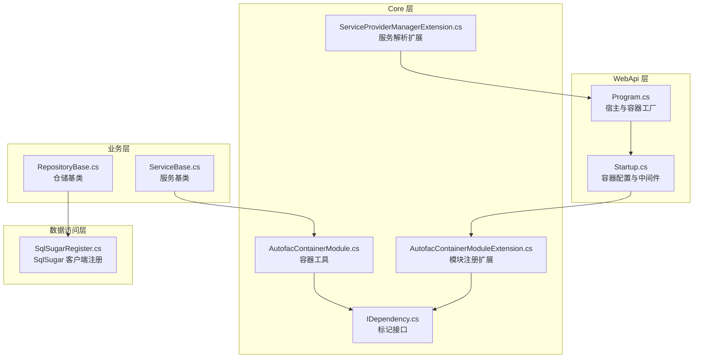
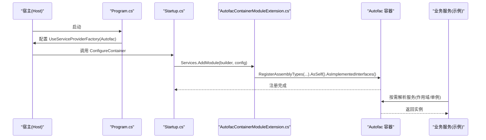
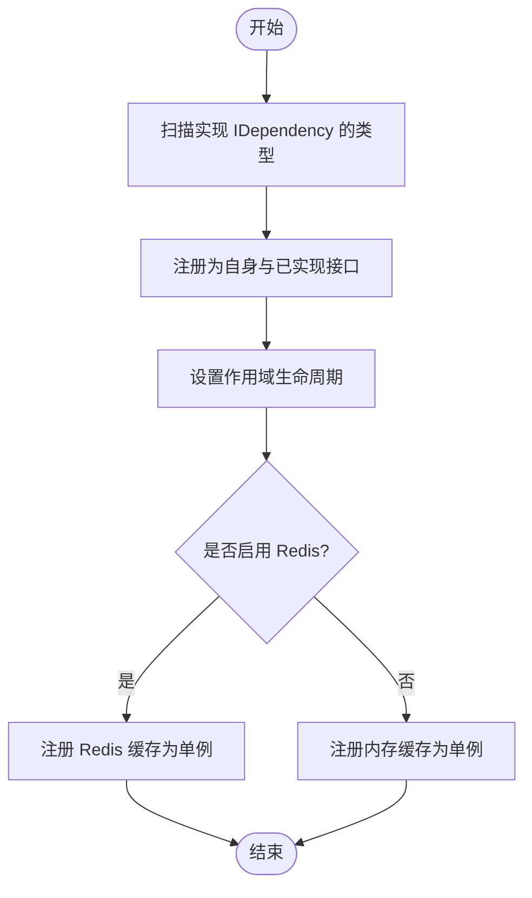
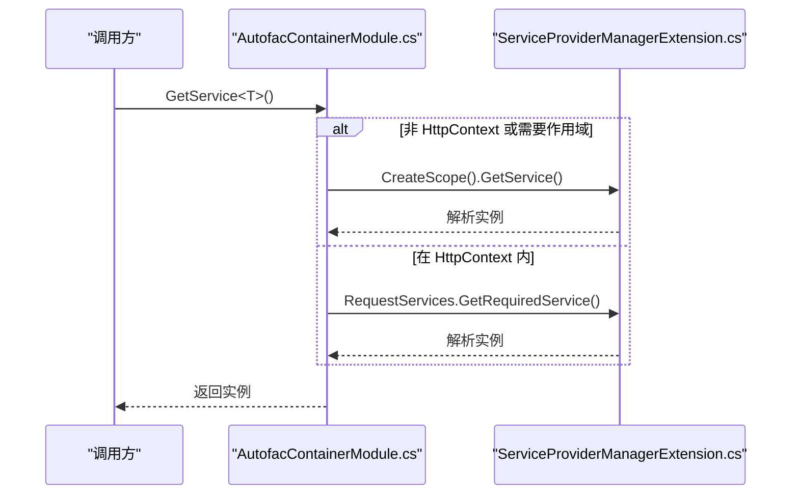
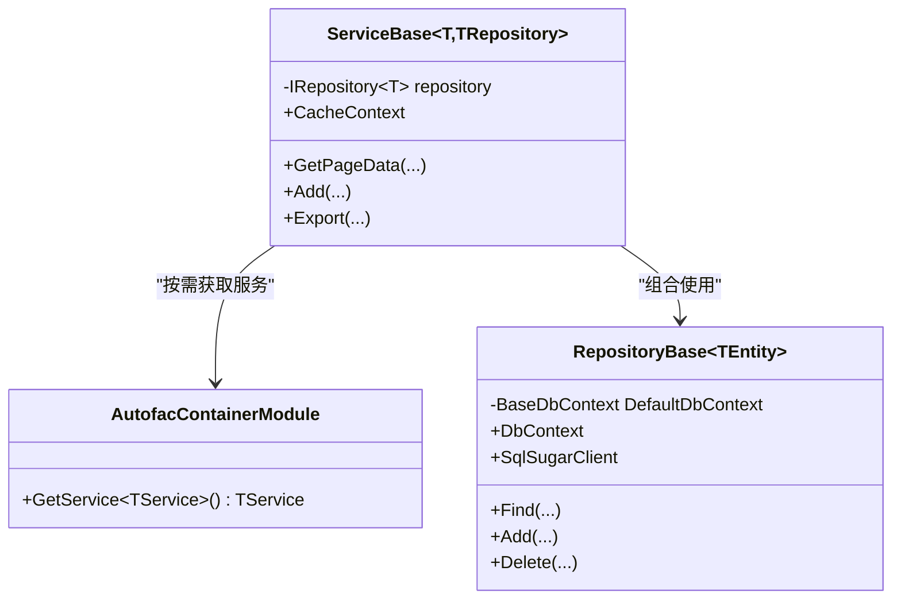
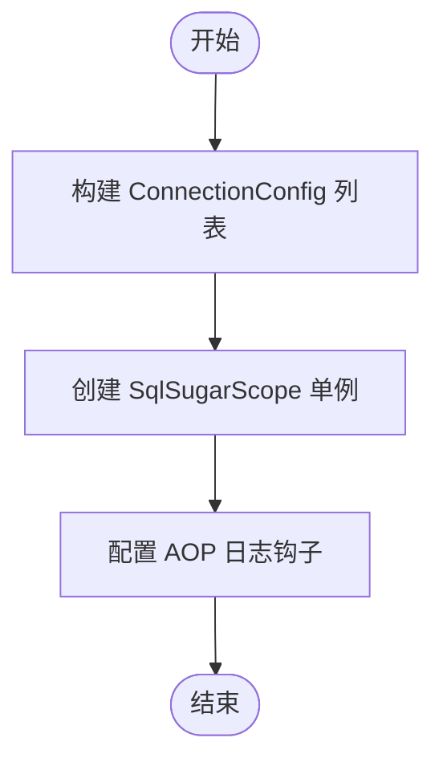
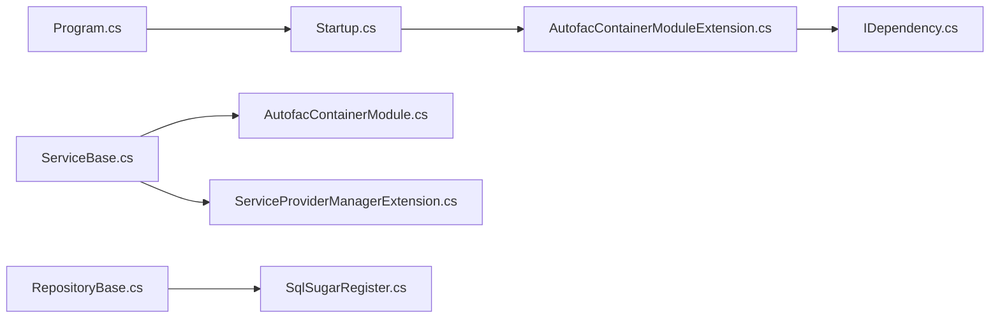

# 工厂模式应用

<cite>
**本文引用的文件**
- [Program.cs](file://VolPro.WebApi/Program.cs)
- [Startup.cs](file://VolPro.WebApi/Startup.cs)
- [AutofacContainerModule.cs](file://VolPro.Core/Extensions/AutofacManager/AutofacContainerModule.cs)
- [AutofacContainerModuleExtension.cs](file://VolPro.Core/Extensions/AutofacManager/AutofacContainerModuleExtension.cs)
- [IDependency.cs](file://VolPro.Core/Extensions/AutofacManager/IDependency.cs)
- [ServiceProviderManagerExtension.cs](file://VolPro.Core/Extensions/ServiceProviderManagerExtension.cs)
- [RepositoryBase.cs](file://VolPro.Core/BaseProvider/RepositoryBase.cs)
- [ServiceBase.cs](file://VolPro.Core/BaseProvider/ServiceBase.cs)
- [SqlSugarRegister.cs](file://VolPro.Core/DbSqlSugar/SqlSugarRegister.cs)
</cite>

## 目录
1. [引言](#引言)
2. [项目结构](#项目结构)
3. [核心组件](#核心组件)
4. [架构总览](#架构总览)
5. [详细组件分析](#详细组件分析)
6. [依赖关系分析](#依赖关系分析)
7. [性能考量](#性能考量)
8. [故障排查指南](#故障排查指南)
9. [结论](#结论)
10. [附录](#附录)

## 引言
本文件围绕“水化热平台”在 Autofac 中对依赖注入工厂模式的应用展开，重点阐述如何通过模块化配置、服务注册与生命周期管理实现延迟创建与作用域控制；并结合项目现状，给出最佳实践与性能优化建议。文档同时解释工厂模式在 DI 中的作用，以及它如何提升系统的灵活性与可扩展性。

## 项目结构
- 入口与宿主配置位于 WebApi 层，使用 ASP.NET Core 默认宿主并通过 Autofac 提供程序工厂接管容器。
- 核心 DI 逻辑集中在 Core 层的 Autofac 管理扩展与模块注册扩展中。
- 业务层通过仓储与服务基类体现“延迟创建”与“按需获取”的工厂思想。
- 数据访问层通过 SqlSugar 的单例客户端统一管理多连接配置。

**图示来源**
- [Program.cs:24-36](file://VolPro.WebApi/Program.cs#L24-L36)
- [Startup.cs:214-217](file://VolPro.WebApi/Startup.cs#L214-L217)
- [AutofacContainerModuleExtension.cs:36-115](file://VolPro.Core/Extensions/AutofacManager/AutofacContainerModuleExtension.cs#L36-L115)
- [AutofacContainerModule.cs:9-12](file://VolPro.Core/Extensions/AutofacManager/AutofacContainerModule.cs#L9-L12)
- [IDependency.cs:9-11](file://VolPro.Core/Extensions/AutofacManager/IDependency.cs#L9-L11)
- [ServiceProviderManagerExtension.cs:18-28](file://VolPro.Core/Extensions/ServiceProviderManagerExtension.cs#L18-L28)
- [RepositoryBase.cs:31-43](file://VolPro.Core/BaseProvider/RepositoryBase.cs#L31-L43)
- [ServiceBase.cs:35-53](file://VolPro.Core/BaseProvider/ServiceBase.cs#L35-L53)
- [SqlSugarRegister.cs:76-131](file://VolPro.Core/DbSqlSugar/SqlSugarRegister.cs#L76-L131)

**章节来源**
- [Program.cs:17-36](file://VolPro.WebApi/Program.cs#L17-L36)
- [Startup.cs:60-217](file://VolPro.WebApi/Startup.cs#L60-L217)

## 核心组件
- 容器工厂与宿主集成
  - 在入口中通过 UseServiceProviderFactory 指定 Autofac 提供程序工厂，使宿主构建阶段由 Autofac 接管服务提供者。
- 模块化注册扩展
  - 通过 AddModule 扩展方法扫描项目内实现 IDependency 的类型，自动注册为自身与已实现接口，并以作用域生命周期实例化。
- 容器工具
  - 提供静态方法从当前容器获取服务实例，支持作用域内解析。
- 服务解析扩展
  - 在非 HttpContext 上下文中，提供 CreateScope 并解析服务的能力，满足工厂式延迟创建需求。
- 仓储与服务基类
  - 服务基类通过容器工具按需获取缓存服务等依赖，体现“按需创建、按需释放”的工厂思想。
- SqlSugar 客户端
  - 将 SqlSugarScope 注册为单例，集中管理多连接配置，避免重复创建客户端带来的开销。

**章节来源**
- [Program.cs:36](file://VolPro.WebApi/Program.cs#L36)
- [AutofacContainerModuleExtension.cs:36-115](file://VolPro.Core/Extensions/AutofacManager/AutofacContainerModuleExtension.cs#L36-L115)
- [AutofacContainerModule.cs:9-12](file://VolPro.Core/Extensions/AutofacManager/AutofacContainerModule.cs#L9-L12)
- [ServiceProviderManagerExtension.cs:18-28](file://VolPro.Core/Extensions/ServiceProviderManagerExtension.cs#L18-L28)
- [ServiceBase.cs:39-44](file://VolPro.Core/BaseProvider/ServiceBase.cs#L39-L44)
- [SqlSugarRegister.cs:102-129](file://VolPro.Core/DbSqlSugar/SqlSugarRegister.cs#L102-L129)

## 架构总览
下图展示了从应用启动到容器装配、再到运行期服务解析的关键流程，体现了工厂模式在依赖注入中的位置与职责。

**图示来源**
- [Program.cs:24-36](file://VolPro.WebApi/Program.cs#L24-L36)
- [Startup.cs:214-217](file://VolPro.WebApi/Startup.cs#L214-L217)
- [AutofacContainerModuleExtension.cs:78-82](file://VolPro.Core/Extensions/AutofacManager/AutofacContainerModuleExtension.cs#L78-L82)

## 详细组件分析

### 组件一：Autofac 容器模块注册
- 关键点
  - 扫描项目内实现 IDependency 的类型，自动注册为自身与已实现接口。
  - 实例生命周期采用作用域级别（InstancePerLifetimeScope），确保每次请求获得独立实例。
  - 特定服务（如缓存）根据配置选择内存或 Redis 实现，并以单例形式提供。
- 生命周期策略
  - 作用域：仓储、服务、上下文类等均以作用域实例化，适合请求级资源。
  - 单例：缓存服务、SqlSugar 客户端等跨请求共享，减少重复创建成本。
- 延迟创建
  - 仅在首次解析时创建实例，符合工厂模式的延迟特性。

**图示来源**
- [AutofacContainerModuleExtension.cs:78-105](file://VolPro.Core/Extensions/AutofacManager/AutofacContainerModuleExtension.cs#L78-L105)
- [IDependency.cs:9-11](file://VolPro.Core/Extensions/AutofacManager/IDependency.cs#L9-L11)

**章节来源**
- [AutofacContainerModuleExtension.cs:36-115](file://VolPro.Core/Extensions/AutofacManager/AutofacContainerModuleExtension.cs#L36-L115)

### 组件二：容器工具与服务解析扩展
- 容器工具
  - 提供静态方法从容器获取服务实例，便于在非构造函数场景按需获取依赖。
- 服务解析扩展
  - 在无 HttpContext 或需要临时作用域时，通过 CreateScope 解析服务，保证生命周期与作用域一致性。
- 工厂式延迟创建
  - 仅在调用时创建实例，避免不必要的资源占用。

**图示来源**
- [AutofacContainerModule.cs:9-12](file://VolPro.Core/Extensions/AutofacManager/AutofacContainerModule.cs#L9-L12)
- [ServiceProviderManagerExtension.cs:18-28](file://VolPro.Core/Extensions/ServiceProviderManagerExtension.cs#L18-L28)

**章节来源**
- [AutofacContainerModule.cs:9-12](file://VolPro.Core/Extensions/AutofacManager/AutofacContainerModule.cs#L9-L12)
- [ServiceProviderManagerExtension.cs:14-28](file://VolPro.Core/Extensions/ServiceProviderManagerExtension.cs#L14-L28)

### 组件三：仓储与服务基类中的工厂思想
- 仓储基类
  - 通过构造函数注入 DbContext，实际使用时再按需访问 SqlSugar 客户端，体现“按需创建”的工厂思想。
- 服务基类
  - 通过容器工具按需获取缓存服务等依赖，避免在构造阶段绑定具体实现，增强灵活性。

**图示来源**
- [RepositoryBase.cs:31-56](file://VolPro.Core/BaseProvider/RepositoryBase.cs#L31-L56)
- [ServiceBase.cs:35-53](file://VolPro.Core/BaseProvider/ServiceBase.cs#L35-L53)
- [AutofacContainerModule.cs:9-12](file://VolPro.Core/Extensions/AutofacManager/AutofacContainerModule.cs#L9-L12)

**章节来源**
- [RepositoryBase.cs:31-56](file://VolPro.Core/BaseProvider/RepositoryBase.cs#L31-L56)
- [ServiceBase.cs:39-44](file://VolPro.Core/BaseProvider/ServiceBase.cs#L39-L44)

### 组件四：SqlSugar 客户端注册（单例工厂）
- 关键点
  - 将 SqlSugarScope 注册为单例，集中管理多连接配置，避免重复创建客户端带来的开销。
  - 通过 AOP 日志钩子统一记录 SQL 执行信息，便于诊断与性能分析。
- 生命周期
  - 单例：跨请求共享，降低对象创建与销毁成本。
- 工厂特性
  - 通过静态扩展方法集中创建与配置，形成“工厂式”的客户端提供能力。

**图示来源**
- [SqlSugarRegister.cs:76-131](file://VolPro.Core/DbSqlSugar/SqlSugarRegister.cs#L76-L131)

**章节来源**
- [SqlSugarRegister.cs:76-131](file://VolPro.Core/DbSqlSugar/SqlSugarRegister.cs#L76-L131)

## 依赖关系分析
- 宿主与容器
  - Program.cs 指定 Autofac 作为服务提供者工厂，Startup.cs 的 ConfigureContainer 负责装配。
- 模块注册
  - AutofacContainerModuleExtension 扫描并注册实现 IDependency 的类型，统一生命周期策略。
- 运行期解析
  - ServiceBase 与容器工具配合，在需要时解析缓存等服务，体现工厂式延迟创建。
- 数据访问
  - SqlSugarRegister 将客户端注册为单例，作为数据访问层的“工厂”，集中管理连接与日志。

**图示来源**
- [Program.cs:24-36](file://VolPro.WebApi/Program.cs#L24-L36)
- [Startup.cs:214-217](file://VolPro.WebApi/Startup.cs#L214-L217)
- [AutofacContainerModuleExtension.cs:78-82](file://VolPro.Core/Extensions/AutofacManager/AutofacContainerModuleExtension.cs#L78-L82)
- [IDependency.cs:9-11](file://VolPro.Core/Extensions/AutofacManager/IDependency.cs#L9-L11)
- [ServiceBase.cs:39-44](file://VolPro.Core/BaseProvider/ServiceBase.cs#L39-L44)
- [AutofacContainerModule.cs:9-12](file://VolPro.Core/Extensions/AutofacManager/AutofacContainerModule.cs#L9-L12)
- [ServiceProviderManagerExtension.cs:18-28](file://VolPro.Core/Extensions/ServiceProviderManagerExtension.cs#L18-L28)
- [RepositoryBase.cs:31-56](file://VolPro.Core/BaseProvider/RepositoryBase.cs#L31-L56)
- [SqlSugarRegister.cs:102-129](file://VolPro.Core/DbSqlSugar/SqlSugarRegister.cs#L102-L129)

**章节来源**
- [Program.cs:24-36](file://VolPro.WebApi/Program.cs#L24-L36)
- [Startup.cs:214-217](file://VolPro.WebApi/Startup.cs#L214-L217)
- [AutofacContainerModuleExtension.cs:78-82](file://VolPro.Core/Extensions/AutofacManager/AutofacContainerModuleExtension.cs#L78-L82)
- [ServiceBase.cs:39-44](file://VolPro.Core/BaseProvider/ServiceBase.cs#L39-L44)
- [SqlSugarRegister.cs:102-129](file://VolPro.Core/DbSqlSugar/SqlSugarRegister.cs#L102-L129)

## 性能考量
- 单例与作用域的选择
  - 对于高并发、无状态的服务（如缓存），优先使用单例；对于有状态、与请求强关联的对象（如仓储、上下文类）使用作用域，避免跨请求污染。
- 延迟创建与按需解析
  - 仅在首次使用时创建实例，减少启动时的内存与 CPU 开销。
- 客户端复用
  - SqlSugarScope 作为单例集中管理连接，避免频繁创建销毁带来的性能损耗。
- 日志与可观测性
  - 通过 AOP 钩子统一记录 SQL 执行，有助于定位性能瓶颈与异常。

[本节为通用指导，无需列出具体文件来源]

## 故障排查指南
- 容器未解析到服务
  - 检查是否实现 IDependency 接口并被 AddModule 扫描注册。
  - 确认生命周期设置是否与使用场景匹配（作用域 vs 单例）。
- 作用域解析异常
  - 在非 HttpContext 场景或需要临时作用域时，使用 CreateScope 解析服务。
- 缓存实现切换
  - 根据配置决定使用内存缓存还是 Redis 缓存，确认对应实现已注册为单例。

**章节来源**
- [AutofacContainerModuleExtension.cs:78-105](file://VolPro.Core/Extensions/AutofacManager/AutofacContainerModuleExtension.cs#L78-L105)
- [ServiceProviderManagerExtension.cs:18-28](file://VolPro.Core/Extensions/ServiceProviderManagerExtension.cs#L18-L28)

## 结论
本项目通过 Autofac 实现了模块化的依赖注入工厂模式：以 IDependency 为标记，自动扫描并注册服务，统一生命周期策略；在运行期通过容器工具与作用域解析实现延迟创建与按需获取。结合 SqlSugar 的单例客户端工厂，整体架构在保证灵活性的同时兼顾性能与可维护性。建议在大型项目中延续该模式，明确生命周期边界，持续优化解析路径与日志观测，以提升系统的稳定性与扩展性。

[本节为总结性内容，无需列出具体文件来源]

## 附录
- 最佳实践
  - 明确生命周期：无状态服务单例、有状态服务作用域。
  - 使用标记接口 IDependency 统一注册范围。
  - 在非 HttpContext 场景使用 CreateScope 解析服务。
  - 将重资源对象（如数据库客户端）注册为单例。
- 性能优化建议
  - 减少不必要的服务注册与解析层级。
  - 合理拆分模块，避免一次性扫描过多程序集。
  - 通过 AOP 日志与指标监控识别热点与瓶颈。

[本节为通用指导，无需列出具体文件来源]