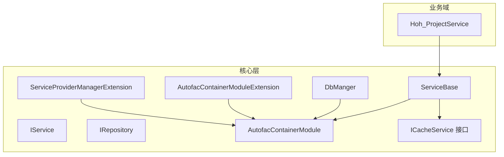
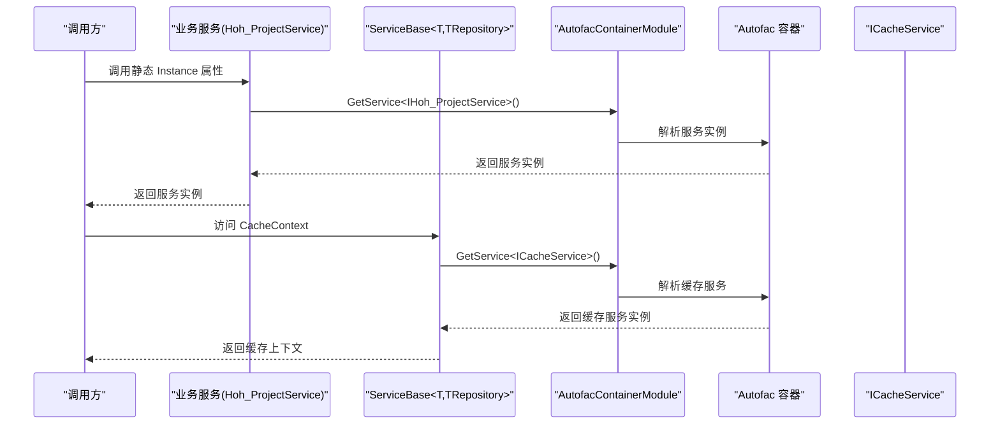
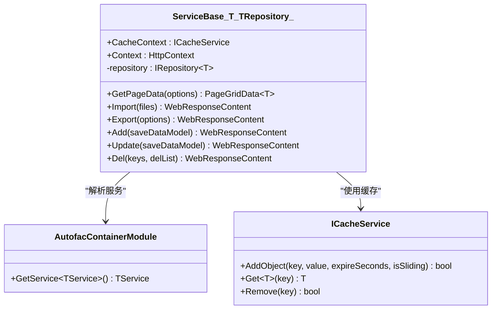
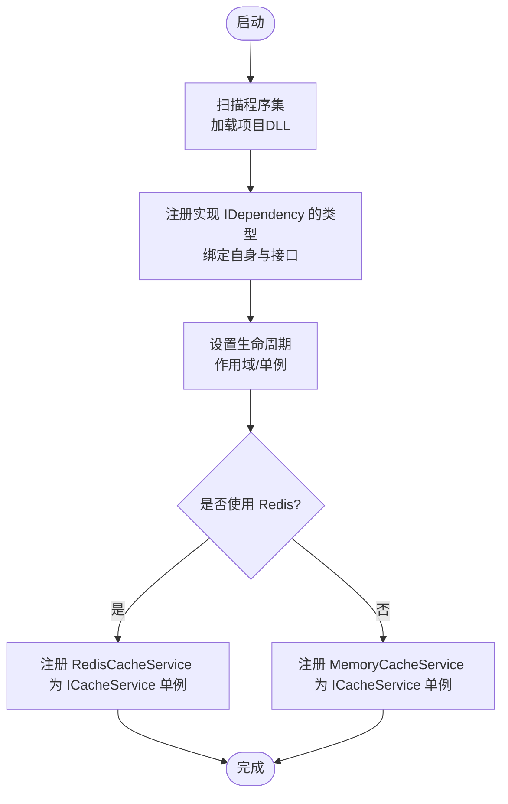
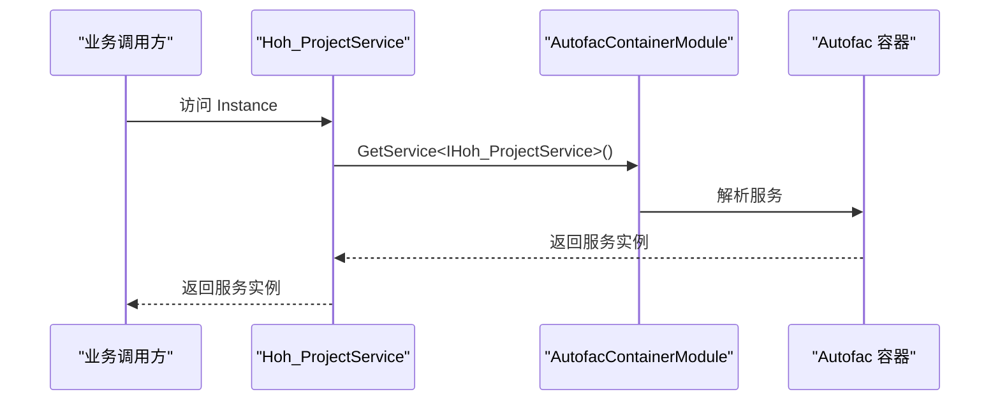
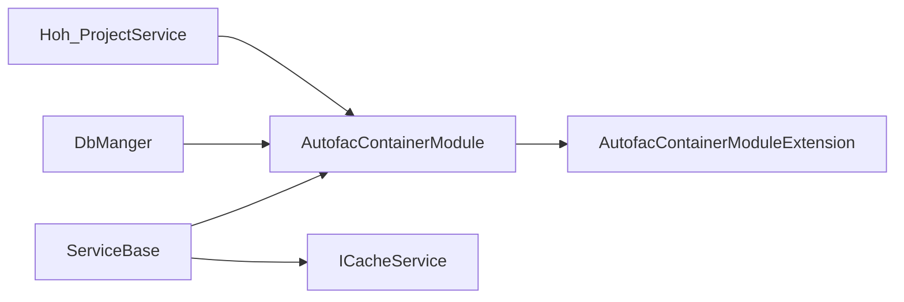

# 服务定位器模式

<cite>
**本文引用的文件**
- [ServiceBase.cs](file://VolPro.Core/BaseProvider/ServiceBase.cs)
- [IService.cs](file://VolPro.Core/BaseProvider/IService.cs)
- [IRepository.cs](file://VolPro.Core/BaseProvider/IRepository.cs)
- [AutofacContainerModule.cs](file://VolPro.Core/Extensions/AutofacManager/AutofacContainerModule.cs)
- [AutofacContainerModuleExtension.cs](file://VolPro.Core/Extensions/AutofacManager/AutofacContainerModuleExtension.cs)
- [ServiceProviderManagerExtension.cs](file://VolPro.Core/Extensions/ServiceProviderManagerExtension.cs)
- [ICacheService.cs](file://VolPro.Core/CacheManager/IService/ICacheService.cs)
- [DbManger.cs](file://VolPro.Core/DbSqlSugar/DbManger.cs)
- [Hoh_ProjectService.cs](file://Hncdi.HeatOfHydration/Services/Hoh/Hoh_ProjectService.cs)
</cite>

## 目录
1. [引言](#引言)
2. [项目结构](#项目结构)
3. [核心组件](#核心组件)
4. [架构总览](#架构总览)
5. [详细组件分析](#详细组件分析)
6. [依赖关系分析](#依赖关系分析)
7. [性能考量](#性能考量)
8. [故障排查指南](#故障排查指南)
9. [结论](#结论)
10. [附录](#附录)

## 引言
本文件围绕水化热平台中的“服务定位器模式”展开，系统性阐述 ServiceBase 基类如何借助 Autofac 容器实现服务定位器模式，包括依赖注入容器的使用、服务获取机制、生命周期管理等；并结合项目实际场景，说明该模式在跨层服务调用、动态服务解析等方面的应用价值。同时给出最佳实践建议与常见问题的解决方案，帮助读者在保持代码可测试性与解耦性的前提下，安全高效地使用服务定位器。

## 项目结构
从整体上看，平台采用分层架构与模块化设计：
- 核心层（VolPro.Core）提供基础设施能力，包括基础服务基类、仓储接口、缓存抽象、Autofac 注册扩展、数据库访问封装等。
- 业务域（如 Hncdi.HeatOfHydration、VolPro.Sys 等）提供具体业务服务与仓储实现，并通过继承 ServiceBase 与实现接口获得统一的能力入口。
- Web 层（VolPro.WebApi）负责控制器与请求处理，业务逻辑通过服务层完成。

图表来源
- [ServiceBase.cs:31-45](file://VolPro.Core/BaseProvider/ServiceBase.cs#L31-L45)
- [AutofacContainerModule.cs:7-13](file://VolPro.Core/Extensions/AutofacManager/AutofacContainerModule.cs#L7-L13)
- [AutofacContainerModuleExtension.cs:36-115](file://VolPro.Core/Extensions/AutofacManager/AutofacContainerModuleExtension.cs#L36-L115)
- [ServiceProviderManagerExtension.cs:10-32](file://VolPro.Core/Extensions/ServiceProviderManagerExtension.cs#L10-L32)
- [ICacheService.cs:8-96](file://VolPro.Core/CacheManager/IService/ICacheService.cs#L8-L96)
- [DbManger.cs:133-140](file://VolPro.Core/DbSqlSugar/DbManger.cs#L133-L140)
- [Hoh_ProjectService.cs:16-22](file://Hncdi.HeatOfHydration/Services/Hoh/Hoh_ProjectService.cs#L16-L22)

章节来源
- [ServiceBase.cs:31-45](file://VolPro.Core/BaseProvider/ServiceBase.cs#L31-L45)
- [AutofacContainerModule.cs:7-13](file://VolPro.Core/Extensions/AutofacManager/AutofacContainerModule.cs#L7-L13)
- [AutofacContainerModuleExtension.cs:36-115](file://VolPro.Core/Extensions/AutofacManager/AutofacContainerModuleExtension.cs#L36-L115)
- [ServiceProviderManagerExtension.cs:10-32](file://VolPro.Core/Extensions/ServiceProviderManagerExtension.cs#L10-L32)
- [ICacheService.cs:8-96](file://VolPro.Core/CacheManager/IService/ICacheService.cs#L8-L96)
- [DbManger.cs:133-140](file://VolPro.Core/DbSqlSugar/DbManger.cs#L133-L140)
- [Hoh_ProjectService.cs:16-22](file://Hncdi.HeatOfHydration/Services/Hoh/Hoh_ProjectService.cs#L16-L22)

## 核心组件
- ServiceBase<T,TRepository>：业务服务基类，提供统一的分页查询、导入导出、新增编辑、工作流集成、鉴权字段过滤等能力，并通过 Autofac 容器获取缓存服务与上下文。
- IService<T>：服务契约接口，定义通用的查询、导入导出、新增编辑、审核与映射等方法。
- IRepository<TEntity>：仓储契约接口，提供查询、分页、更新、删除、事务等数据库操作能力。
- AutofacContainerModule：静态服务定位器入口，提供 GetService<T>() 方法用于从容器解析服务实例。
- AutofacContainerModuleExtension：容器注册扩展，扫描程序集并按生命周期注册服务，同时根据配置选择内存或 Redis 缓存实现。
- ServiceProviderManagerExtension：基于 ASP.NET Core 的 ServiceProvider 扩展，支持在无 HttpContext 或需要作用域时获取服务。
- ICacheService：缓存抽象接口，屏蔽底层缓存实现差异。
- DbManger：数据库访问门面，通过容器解析 ISqlSugarClient 并暴露 SqlSugarScope 实例。
- Hoh_ProjectService：业务服务示例，提供静态 Instance 属性以便捷获取服务实例。

章节来源
- [ServiceBase.cs:31-45](file://VolPro.Core/BaseProvider/ServiceBase.cs#L31-L45)
- [IService.cs:14-163](file://VolPro.Core/BaseProvider/IService.cs#L14-L163)
- [IRepository.cs:19-327](file://VolPro.Core/BaseProvider/IRepository.cs#L19-L327)
- [AutofacContainerModule.cs:7-13](file://VolPro.Core/Extensions/AutofacManager/AutofacContainerModule.cs#L7-L13)
- [AutofacContainerModuleExtension.cs:36-115](file://VolPro.Core/Extensions/AutofacManager/AutofacContainerModuleExtension.cs#L36-L115)
- [ServiceProviderManagerExtension.cs:10-32](file://VolPro.Core/Extensions/ServiceProviderManagerExtension.cs#L10-L32)
- [ICacheService.cs:8-96](file://VolPro.Core/CacheManager/IService/ICacheService.cs#L8-L96)
- [DbManger.cs:133-140](file://VolPro.Core/DbSqlSugar/DbManger.cs#L133-L140)
- [Hoh_ProjectService.cs:16-22](file://Hncdi.HeatOfHydration/Services/Hoh/Hoh_ProjectService.cs#L16-L22)

## 架构总览
服务定位器模式在本项目中的落地路径如下：
- 服务注册：通过 AutofacContainerModuleExtension 在启动阶段扫描程序集并注册服务，绑定接口与实现，设置生命周期（如按作用域或单例）。
- 服务解析：在业务层或基础设施层，通过 AutofacContainerModule.GetService<T>() 获取所需服务实例，实现跨层调用与动态解析。
- 生命周期管理：容器根据注册策略控制服务实例的创建与释放，避免全局静态状态带来的副作用。
- 缓存与数据库：通过 ICacheService 与 DbManger 统一访问缓存与数据库客户端，减少重复解析与上下文管理成本。

图表来源
- [Hoh_ProjectService.cs:16-22](file://Hncdi.HeatOfHydration/Services/Hoh/Hoh_ProjectService.cs#L16-L22)
- [ServiceBase.cs:39-45](file://VolPro.Core/BaseProvider/ServiceBase.cs#L39-L45)
- [AutofacContainerModule.cs:7-13](file://VolPro.Core/Extensions/AutofacManager/AutofacContainerModule.cs#L7-L13)

## 详细组件分析

### ServiceBase 基类与服务定位器
- 服务获取：通过 AutofacContainerModule.GetService<T>() 在运行时解析服务实例，避免在构造函数中直接依赖具体实现，降低耦合度。
- 缓存上下文：CacheContext 属性通过容器解析 ICacheService，便于在业务逻辑中进行缓存读写。
- 上下文访问：Context 属性返回当前 HTTP 上下文，便于在服务层获取请求相关信息。
- 通用能力：提供分页查询、明细查询、导入导出、新增编辑、工作流集成等统一入口，减少重复代码。

图表来源
- [ServiceBase.cs:31-45](file://VolPro.Core/BaseProvider/ServiceBase.cs#L31-L45)
- [AutofacContainerModule.cs:7-13](file://VolPro.Core/Extensions/AutofacManager/AutofacContainerModule.cs#L7-L13)
- [ICacheService.cs:8-96](file://VolPro.Core/CacheManager/IService/ICacheService.cs#L8-L96)

章节来源
- [ServiceBase.cs:31-45](file://VolPro.Core/BaseProvider/ServiceBase.cs#L31-L45)
- [ServiceBase.cs:285-339](file://VolPro.Core/BaseProvider/ServiceBase.cs#L285-L339)
- [ServiceBase.cs:531-605](file://VolPro.Core/BaseProvider/ServiceBase.cs#L531-L605)
- [ServiceBase.cs:612-652](file://VolPro.Core/BaseProvider/ServiceBase.cs#L612-L652)

### Autofac 容器注册与生命周期
- 程序集扫描：遍历运行时库，加载项目程序集，自动注册实现 IDependency 的类型。
- 接口绑定：同一类型同时注册为自身与已实现的接口，支持多接口解析。
- 生命周期：按作用域注册（InstancePerLifetimeScope），UserContext、ActionObserver、ObjectModelValidatorState 等按需注册。
- 缓存选择：根据配置选择 Redis 或内存缓存实现，统一对外 ICacheService 接口。
- 数据库初始化：DbManger 通过容器解析 ISqlSugarClient，确保数据库客户端可用。

图表来源
- [AutofacContainerModuleExtension.cs:36-115](file://VolPro.Core/Extensions/AutofacManager/AutofacContainerModuleExtension.cs#L36-L115)

章节来源
- [AutofacContainerModuleExtension.cs:36-115](file://VolPro.Core/Extensions/AutofacManager/AutofacContainerModuleExtension.cs#L36-L115)

### 服务定位器在业务中的应用
- 业务服务静态入口：Hoh_ProjectService 提供静态 Instance 属性，内部通过 AutofacContainerModule.GetService<IHoh_ProjectService>() 获取服务实例，简化调用方使用。
- 数据库访问：DbManger 通过容器解析 ISqlSugarClient，统一提供 SqlSugarScope 访问点，便于在工具类中进行数据库操作。
- 缓存访问：ServiceBase 中的 CacheContext 属性解析 ICacheService，便于在业务逻辑中进行缓存读写。

图表来源
- [Hoh_ProjectService.cs:16-22](file://Hncdi.HeatOfHydration/Services/Hoh/Hoh_ProjectService.cs#L16-L22)
- [AutofacContainerModule.cs:7-13](file://VolPro.Core/Extensions/AutofacManager/AutofacContainerModule.cs#L7-L13)

章节来源
- [Hoh_ProjectService.cs:16-22](file://Hncdi.HeatOfHydration/Services/Hoh/Hoh_ProjectService.cs#L16-L22)
- [DbManger.cs:133-140](file://VolPro.Core/DbSqlSugar/DbManger.cs#L133-L140)
- [ServiceBase.cs:39-45](file://VolPro.Core/BaseProvider/ServiceBase.cs#L39-L45)

### 服务定位器与传统依赖注入的区别与优势
- 区别
  - 传统 DI：通过构造函数注入或属性注入，编译期即确定依赖关系，利于单元测试与可观察性。
  - 服务定位器：在运行时通过容器解析服务，适合跨层调用、动态解析、工具类中获取服务等场景。
- 优势
  - 跨层调用：在仓储、工具类或中间件中无需层层传递依赖，直接解析所需服务。
  - 动态解析：根据运行时条件选择不同实现，提升灵活性。
  - 快速集成：在现有代码中快速引入新服务，无需大规模重构。
- 风险与对策
  - 隐式依赖：通过在注释或文档中标注服务定位器的使用场景，避免滥用。
  - 测试困难：为关键服务提供接口抽象与模拟实现，配合容器替换策略进行测试。
  - 生命周期问题：严格遵循容器注册的生命周期策略，避免跨作用域引用造成泄漏或失效。

## 依赖关系分析
- ServiceBase 依赖 AutofacContainerModule 进行服务解析，依赖 ICacheService 进行缓存操作。
- DbManger 依赖 AutofacContainerModule 解析 ISqlSugarClient，统一数据库访问。
- 业务服务（如 Hoh_ProjectService）通过静态属性提供服务定位器入口，便于外部调用。
- 容器注册扩展负责扫描程序集、绑定接口与实现、设置生命周期与缓存策略。

图表来源
- [ServiceBase.cs:31-45](file://VolPro.Core/BaseProvider/ServiceBase.cs#L31-L45)
- [DbManger.cs:133-140](file://VolPro.Core/DbSqlSugar/DbManger.cs#L133-L140)
- [Hoh_ProjectService.cs:16-22](file://Hncdi.HeatOfHydration/Services/Hoh/Hoh_ProjectService.cs#L16-L22)
- [AutofacContainerModule.cs:7-13](file://VolPro.Core/Extensions/AutofacManager/AutofacContainerModule.cs#L7-L13)
- [AutofacContainerModuleExtension.cs:36-115](file://VolPro.Core/Extensions/AutofacManager/AutofacContainerModuleExtension.cs#L36-L115)

章节来源
- [ServiceBase.cs:31-45](file://VolPro.Core/BaseProvider/ServiceBase.cs#L31-L45)
- [DbManger.cs:133-140](file://VolPro.Core/DbSqlSugar/DbManger.cs#L133-L140)
- [Hoh_ProjectService.cs:16-22](file://Hncdi.HeatOfHydration/Services/Hoh/Hoh_ProjectService.cs#L16-L22)
- [AutofacContainerModule.cs:7-13](file://VolPro.Core/Extensions/AutofacManager/AutofacContainerModule.cs#L7-L13)
- [AutofacContainerModuleExtension.cs:36-115](file://VolPro.Core/Extensions/AutofacManager/AutofacContainerModuleExtension.cs#L36-L115)

## 性能考量
- 作用域解析：在需要独立生命周期或避免上下文污染时，使用 ServiceProviderManagerExtension 的作用域解析策略，避免跨请求共享状态。
- 缓存策略：优先使用 Redis 缓存以提升高并发下的响应速度；在本地开发或低负载场景可使用内存缓存。
- 数据库连接：通过 DbManger 统一解析 ISqlSugarClient，减少重复创建与上下文切换开销。
- 服务实例复用：容器默认按作用域注册，避免频繁创建销毁带来的性能损耗。

## 故障排查指南
- 无法解析服务
  - 检查容器注册：确认目标服务已在 AutofacContainerModuleExtension 中注册且绑定接口与实现。
  - 检查生命周期：确认服务注册的生命周期与使用场景匹配（作用域/单例）。
- 缓存异常
  - 检查 ICacheService 实现：确认 Redis 或内存缓存配置正确，网络连通性正常。
- 数据库访问失败
  - 检查 ISqlSugarClient 解析：确认容器已注册 ISqlSugarClient，连接字符串正确。
- 作用域问题
  - 在非 HTTP 上下文或需要独立作用域时，使用 ServiceProviderManagerExtension 的作用域解析方法。

章节来源
- [AutofacContainerModuleExtension.cs:36-115](file://VolPro.Core/Extensions/AutofacManager/AutofacContainerModuleExtension.cs#L36-L115)
- [ServiceProviderManagerExtension.cs:10-32](file://VolPro.Core/Extensions/ServiceProviderManagerExtension.cs#L10-L32)
- [DbManger.cs:133-140](file://VolPro.Core/DbSqlSugar/DbManger.cs#L133-L140)

## 结论
本项目通过 ServiceBase 基类与 Autofac 容器实现了服务定位器模式，在保证解耦与可测试性的同时，提供了灵活的跨层服务调用与动态解析能力。结合统一的容器注册策略与缓存/数据库访问门面，平台能够在复杂业务场景中快速集成与扩展。建议在工具类、中间件与仓储层谨慎使用服务定位器，配合清晰的文档与测试策略，确保系统的稳定性与可维护性。

## 附录
- 最佳实践
  - 仅在必要场景使用服务定位器，优先采用构造函数注入。
  - 对关键服务提供接口抽象，便于替换与测试。
  - 明确生命周期策略，避免跨作用域引用导致的资源泄漏。
  - 在工具类中统一通过容器解析服务，减少重复代码。
- 示例参考
  - 业务服务静态入口：[Hoh_ProjectService.cs:16-22](file://Hncdi.HeatOfHydration/Services/Hoh/Hoh_ProjectService.cs#L16-L22)
  - 服务定位器解析：[AutofacContainerModule.cs:7-13](file://VolPro.Core/Extensions/AutofacManager/AutofacContainerModule.cs#L7-L13)
  - 缓存服务获取：[ServiceBase.cs:39-45](file://VolPro.Core/BaseProvider/ServiceBase.cs#L39-L45)
  - 数据库客户端解析：[DbManger.cs:133-140](file://VolPro.Core/DbSqlSugar/DbManger.cs#L133-L140)