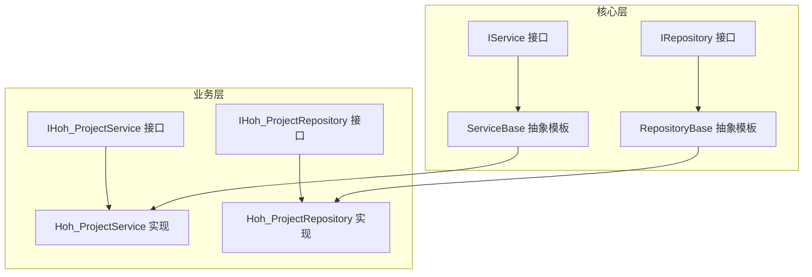
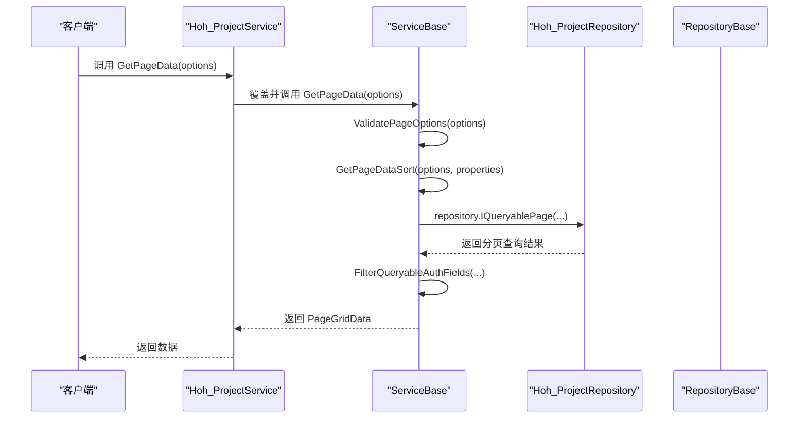
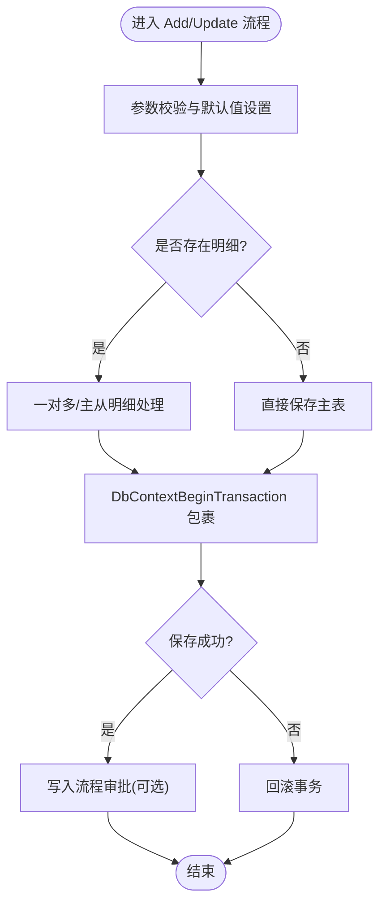
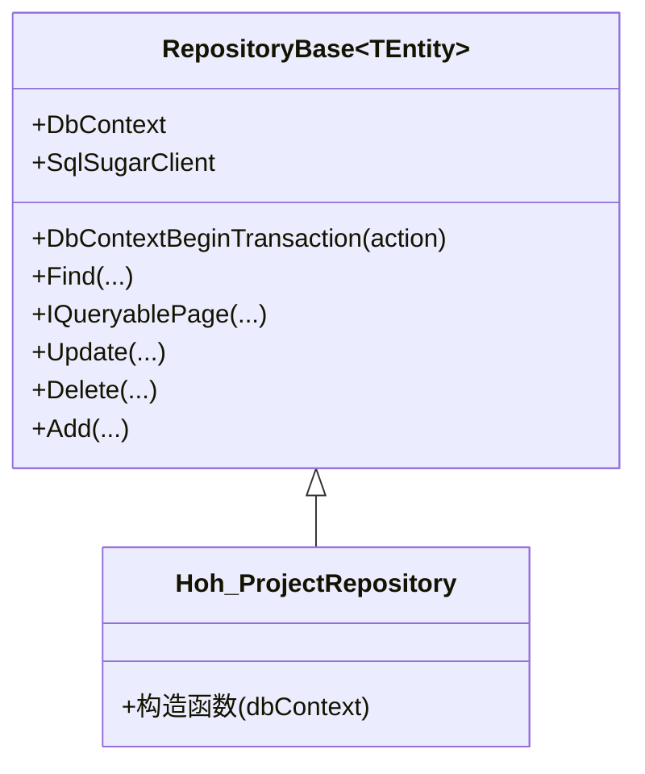
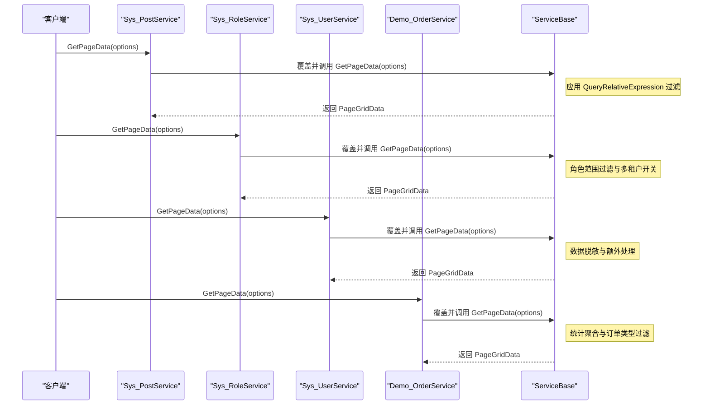
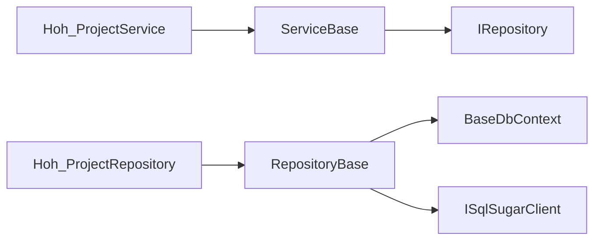

# 模板方法模式

<cite>
**本文档引用的文件**
- [ServiceBase.cs](file://VolPro.Core/BaseProvider/ServiceBase.cs)
- [RepositoryBase.cs](file://VolPro.Core/BaseProvider/RepositoryBase.cs)
- [IService.cs](file://VolPro.Core/BaseProvider/IService.cs)
- [IRepository.cs](file://VolPro.Core/BaseProvider/IRepository.cs)
- [Hoh_ProjectService.cs](file://Hncdi.HeatOfHydration/Services/Hoh/Hoh_ProjectService.cs)
- [Hoh_ProjectRepository.cs](file://Hncdi.HeatOfHydration/Repositories/Hoh/Hoh_ProjectRepository.cs)
- [Sys_PostService.cs](file://VolPro.Sys/Services/System/Partial/Sys_PostService.cs)
- [Sys_RoleService.cs](file://VolPro.Sys/Services/System/Partial/Sys_RoleService.cs)
- [Sys_UserService.cs](file://VolPro.Sys/Services/System/Partial/Sys_UserService.cs)
- [Demo_OrderService.cs](file://VolPro.DbTest/Services/Order/Partial/Demo_OrderService.cs)
</cite>

## 目录
1. [简介](#简介)
2. [项目结构](#项目结构)
3. [核心组件](#核心组件)
4. [架构总览](#架构总览)
5. [详细组件分析](#详细组件分析)
6. [依赖关系分析](#依赖关系分析)
7. [性能考量](#性能考量)
8. [故障排查指南](#故障排查指南)
9. [结论](#结论)
10. [附录](#附录)

## 简介
本文件围绕“模板方法模式”在水化热平台中的应用展开，重点阐述如何通过 ServiceBase 与 RepositoryBase 的模板方法设计，统一业务流程与数据访问流程，实现“算法骨架”的标准化、公共逻辑的复用与扩展点的规范化。通过对 GetPageData、Add、Update、DbContextBeginTransaction 等关键方法的分析，展示模板方法如何在不同业务模块中保持一致的调用形态，并允许子类按需覆盖特定步骤。

## 项目结构
- 核心基类位于 VolPro.Core.BaseProvider，提供 ServiceBase 与 RepositoryBase 两大模板方法载体。
- 具体业务模块（如 Hncdi.HeatOfHydration）基于上述基类进行二次开发，形成 IHoh_ProjectService/IHoh_ProjectRepository 与 Hoh_ProjectService/Hoh_ProjectRepository 的完整链路。
- 通过 Partial 文件夹对具体服务进行扩展，实现对模板方法的覆盖与增强。

图表来源
- [IService.cs:14-163](file://VolPro.Core/BaseProvider/IService.cs#L14-L163)
- [IRepository.cs:19-326](file://VolPro.Core/BaseProvider/IRepository.cs#L19-L326)
- [ServiceBase.cs:31-81](file://VolPro.Core/BaseProvider/ServiceBase.cs#L31-L81)
- [RepositoryBase.cs:29-61](file://VolPro.Core/BaseProvider/RepositoryBase.cs#L29-L61)
- [Hoh_ProjectService.cs:16-22](file://Hncdi.HeatOfHydration/Services/Hoh/Hoh_ProjectService.cs#L16-L22)
- [Hoh_ProjectRepository.cs:13-23](file://Hncdi.HeatOfHydration/Repositories/Hoh/Hoh_ProjectRepository.cs#L13-L23)

章节来源
- [ServiceBase.cs:31-81](file://VolPro.Core/BaseProvider/ServiceBase.cs#L31-L81)
- [RepositoryBase.cs:29-61](file://VolPro.Core/BaseProvider/RepositoryBase.cs#L29-L61)
- [Hoh_ProjectService.cs:16-22](file://Hncdi.HeatOfHydration/Services/Hoh/Hoh_ProjectService.cs#L16-L22)
- [Hoh_ProjectRepository.cs:13-23](file://Hncdi.HeatOfHydration/Repositories/Hoh/Hoh_ProjectRepository.cs#L13-L23)

## 核心组件
- ServiceBase：面向业务的服务模板，定义了通用的业务流程骨架，如分页查询、导入导出、新增与编辑、流程审批等。其核心在于将“固定流程”与“可变步骤”分离，子类仅需覆盖可变部分即可完成定制。
- RepositoryBase：面向数据访问的仓储模板，封装了事务、查询、分页、增删改等通用数据操作，提供统一的 DbContext 访问入口与事务控制机制。
- IService/IRepository：定义服务与仓储的契约接口，确保模板方法的对外一致性。

章节来源
- [ServiceBase.cs:31-81](file://VolPro.Core/BaseProvider/ServiceBase.cs#L31-L81)
- [RepositoryBase.cs:29-61](file://VolPro.Core/BaseProvider/RepositoryBase.cs#L29-L61)
- [IService.cs:14-163](file://VolPro.Core/BaseProvider/IService.cs#L14-L163)
- [IRepository.cs:19-326](file://VolPro.Core/BaseProvider/IRepository.cs#L19-L326)

## 架构总览
模板方法在本项目中的体现：
- ServiceBase 定义业务流程的“算法骨架”，如 GetPageData 的标准流程（参数校验、排序生成、分页查询、权限过滤、汇总计算、回调钩子），子类通过覆盖可选委托（如 QueryRelativeExpression、SummaryExpress、AddOnExecuting 等）注入差异化逻辑。
- RepositoryBase 定义数据访问的“算法骨架”，如 DbContextBeginTransaction 的事务控制流程（开启事务、执行动作、根据结果提交或回滚），子类通过传入 Func<WebResponseContent> 动作函数实现可插拔的业务处理块。

图表来源
- [ServiceBase.cs:285-340](file://VolPro.Core/BaseProvider/ServiceBase.cs#L285-L340)
- [RepositoryBase.cs:250-283](file://VolPro.Core/BaseProvider/RepositoryBase.cs#L250-L283)
- [Hoh_ProjectService.cs:16-22](file://Hncdi.HeatOfHydration/Services/Hoh/Hoh_ProjectService.cs#L16-L22)
- [Hoh_ProjectRepository.cs:13-23](file://Hncdi.HeatOfHydration/Repositories/Hoh/Hoh_ProjectRepository.cs#L13-L23)

## 详细组件分析

### ServiceBase 模板方法详解
- GetPageData：定义标准的分页查询流程，包括参数校验、排序字典生成、权限字段过滤、导出与分页处理、汇总计算与回调钩子。子类通过 QueryRelativeExpression 注入自定义过滤条件，通过 SummaryExpress 注入统计逻辑。
- Add/Update：定义标准的新增与编辑流程，包括参数校验、默认值设置、主从/一对多明细处理、事务控制、流程审批写入等。子类可通过 AddOnExecuting/UpdateOnExecuting 等钩子在关键节点进行前置处理。
- DbContextBeginTransaction：定义标准的事务控制流程，子类只需传入业务动作函数，即可获得自动提交/回滚的保障。

图表来源
- [ServiceBase.cs:768-857](file://VolPro.Core/BaseProvider/ServiceBase.cs#L768-L857)
- [ServiceBase.cs:1376-1486](file://VolPro.Core/BaseProvider/ServiceBase.cs#L1376-L1486)
- [ServiceBase.cs:805-850](file://VolPro.Core/BaseProvider/ServiceBase.cs#L805-L850)

章节来源
- [ServiceBase.cs:285-340](file://VolPro.Core/BaseProvider/ServiceBase.cs#L285-L340)
- [ServiceBase.cs:768-857](file://VolPro.Core/BaseProvider/ServiceBase.cs#L768-L857)
- [ServiceBase.cs:1376-1486](file://VolPro.Core/BaseProvider/ServiceBase.cs#L1376-L1486)
- [ServiceBase.cs:805-850](file://VolPro.Core/BaseProvider/ServiceBase.cs#L805-L850)

### RepositoryBase 模板方法详解
- DbContextBeginTransaction：定义标准的事务控制流程，子类传入业务动作函数，框架负责事务开启、执行、提交或回滚。
- Find/IQueryablePage/Update/Delete/Add：提供统一的数据访问能力，支持泛型实体、异步查询、分页排序、条件过滤等，减少重复代码。

图表来源
- [RepositoryBase.cs:29-61](file://VolPro.Core/BaseProvider/RepositoryBase.cs#L29-L61)
- [RepositoryBase.cs:67-96](file://VolPro.Core/BaseProvider/RepositoryBase.cs#L67-L96)
- [RepositoryBase.cs:153-211](file://VolPro.Core/BaseProvider/RepositoryBase.cs#L153-L211)
- [RepositoryBase.cs:250-283](file://VolPro.Core/BaseProvider/RepositoryBase.cs#L250-L283)
- [RepositoryBase.cs:293-332](file://VolPro.Core/BaseProvider/RepositoryBase.cs#L293-L332)
- [RepositoryBase.cs:483-540](file://VolPro.Core/BaseProvider/RepositoryBase.cs#L483-L540)
- [RepositoryBase.cs:559-597](file://VolPro.Core/BaseProvider/RepositoryBase.cs#L559-L597)
- [Hoh_ProjectRepository.cs:13-23](file://Hncdi.HeatOfHydration/Repositories/Hoh/Hoh_ProjectRepository.cs#L13-L23)

章节来源
- [RepositoryBase.cs:29-61](file://VolPro.Core/BaseProvider/RepositoryBase.cs#L29-L61)
- [RepositoryBase.cs:67-96](file://VolPro.Core/BaseProvider/RepositoryBase.cs#L67-L96)
- [RepositoryBase.cs:153-211](file://VolPro.Core/BaseProvider/RepositoryBase.cs#L153-L211)
- [RepositoryBase.cs:250-283](file://VolPro.Core/BaseProvider/RepositoryBase.cs#L250-L283)
- [RepositoryBase.cs:293-332](file://VolPro.Core/BaseProvider/RepositoryBase.cs#L293-L332)
- [RepositoryBase.cs:483-540](file://VolPro.Core/BaseProvider/RepositoryBase.cs#L483-L540)
- [RepositoryBase.cs:559-597](file://VolPro.Core/BaseProvider/RepositoryBase.cs#L559-L597)
- [Hoh_ProjectRepository.cs:13-23](file://Hncdi.HeatOfHydration/Repositories/Hoh/Hoh_ProjectRepository.cs#L13-L23)

### 子类扩展与模板方法应用
- Hoh_ProjectService：继承 ServiceBase，作为水化热项目的核心业务服务，复用模板方法完成分页查询、导入导出、新增编辑等。
- 多个 Sys_* 与 DbTest 示例服务通过覆盖 ServiceBase 的可选委托（如 QueryRelativeExpression、SummaryExpress）实现差异化业务逻辑，体现了模板方法的“钩子扩展”。

图表来源
- [Sys_PostService.cs:48-52](file://VolPro.Sys/Services/System/Partial/Sys_PostService.cs#L48-L52)
- [Sys_RoleService.cs:38-52](file://VolPro.Sys/Services/System/Partial/Sys_RoleService.cs#L38-L52)
- [Sys_UserService.cs:201-229](file://VolPro.Sys/Services/System/Partial/Sys_UserService.cs#L201-L229)
- [Demo_OrderService.cs:44-91](file://VolPro.DbTest/Services/Order/Partial/Demo_OrderService.cs#L44-L91)
- [ServiceBase.cs:285-340](file://VolPro.Core/BaseProvider/ServiceBase.cs#L285-L340)

章节来源
- [Sys_PostService.cs:48-52](file://VolPro.Sys/Services/System/Partial/Sys_PostService.cs#L48-L52)
- [Sys_RoleService.cs:38-52](file://VolPro.Sys/Services/System/Partial/Sys_RoleService.cs#L38-L52)
- [Sys_UserService.cs:201-229](file://VolPro.Sys/Services/System/Partial/Sys_UserService.cs#L201-L229)
- [Demo_OrderService.cs:44-91](file://VolPro.DbTest/Services/Order/Partial/Demo_OrderService.cs#L44-L91)
- [ServiceBase.cs:285-340](file://VolPro.Core/BaseProvider/ServiceBase.cs#L285-L340)

## 依赖关系分析
- ServiceBase 依赖 IRepository<T> 以复用数据访问模板；通过缓存、用户上下文、工作流等外部组件实现横切关注点。
- RepositoryBase 依赖 BaseDbContext 与 ISqlSugarClient，提供统一的数据访问与事务控制。
- 具体业务服务与仓储通过 Partial 扩展，仅覆盖必要的可选委托，避免重复实现。

图表来源
- [ServiceBase.cs:56-76](file://VolPro.Core/BaseProvider/ServiceBase.cs#L56-L76)
- [RepositoryBase.cs:31-56](file://VolPro.Core/BaseProvider/RepositoryBase.cs#L31-L56)
- [Hoh_ProjectService.cs:16-22](file://Hncdi.HeatOfHydration/Services/Hoh/Hoh_ProjectService.cs#L16-L22)
- [Hoh_ProjectRepository.cs:13-23](file://Hncdi.HeatOfHydration/Repositories/Hoh/Hoh_ProjectRepository.cs#L13-L23)

章节来源
- [ServiceBase.cs:56-76](file://VolPro.Core/BaseProvider/ServiceBase.cs#L56-L76)
- [RepositoryBase.cs:31-56](file://VolPro.Core/BaseProvider/RepositoryBase.cs#L31-L56)
- [Hoh_ProjectService.cs:16-22](file://Hncdi.HeatOfHydration/Services/Hoh/Hoh_ProjectService.cs#L16-L22)
- [Hoh_ProjectRepository.cs:13-23](file://Hncdi.HeatOfHydration/Repositories/Hoh/Hoh_ProjectRepository.cs#L13-L23)

## 性能考量
- 分页与排序：ServiceBase 在分页查询中统一生成排序字典，避免重复逻辑，提升查询性能与一致性。
- 权限字段过滤：在导出与查询阶段对权限字段进行过滤，减少不必要的数据传输与映射开销。
- 事务批处理：RepositoryBase 的 DbContextBeginTransaction 将多个操作纳入同一事务，减少事务切换成本。
- 异步与延迟加载：RepositoryBase 提供 FindAsync/FindFirstAsync 等异步方法，降低阻塞风险。

## 故障排查指南
- 事务异常：若业务动作返回失败，DbContextBeginTransaction 将自动回滚；检查 AddOnExecuting/UpdateOnExecuting 中的前置校验与异常日志。
- 权限字段缺失：导出或查询结果中出现字段缺失，检查角色权限与 FilterQueryableAuthFields 的映射逻辑。
- 主键与明细校验：新增/编辑时若提示主键错误或明细数据不合法，检查 SaveModel 的主键与明细键值是否符合约定。
- 多租户与动态共享数据库：当启用 UseDynamicShareDB 或多租户时，确认 QueryRelativeExpression 是否正确注入过滤条件。

章节来源
- [ServiceBase.cs:805-850](file://VolPro.Core/BaseProvider/ServiceBase.cs#L805-L850)
- [ServiceBase.cs:346-378](file://VolPro.Core/BaseProvider/ServiceBase.cs#L346-L378)
- [ServiceBase.cs:1600-1654](file://VolPro.Core/BaseProvider/ServiceBase.cs#L1600-L1654)
- [RepositoryBase.cs:67-96](file://VolPro.Core/BaseProvider/RepositoryBase.cs#L67-L96)

## 结论
通过 ServiceBase 与 RepositoryBase 的模板方法设计，水化热平台实现了业务流程与数据访问的标准化与高复用性。子类仅需关注差异化逻辑（如查询过滤、统计聚合、审批流程），即可在统一的骨架下完成复杂的业务需求。该模式在复杂业务场景中尤为适用，既保证了流程一致性，又提供了灵活的扩展点。

## 附录
- 最佳实践
  - 将“不变流程”放入模板方法，将“可变步骤”通过可选委托注入。
  - 在 AddOnExecuting/UpdateOnExecuting 中进行前置校验与数据准备，避免在模板方法中分散逻辑。
  - 合理使用 QueryRelativeExpression 与 SummaryExpress，确保查询与统计的一致性与可维护性。
- 扩展策略
  - 通过 Partial 文件夹对具体服务进行覆盖，最小化重复代码。
  - 对于跨模块的通用逻辑，优先下沉至 ServiceBase/RepositoryBase 的可选委托或受保护方法中。