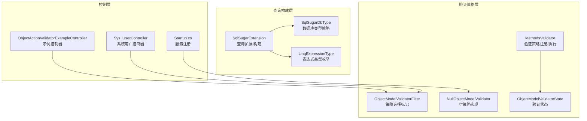
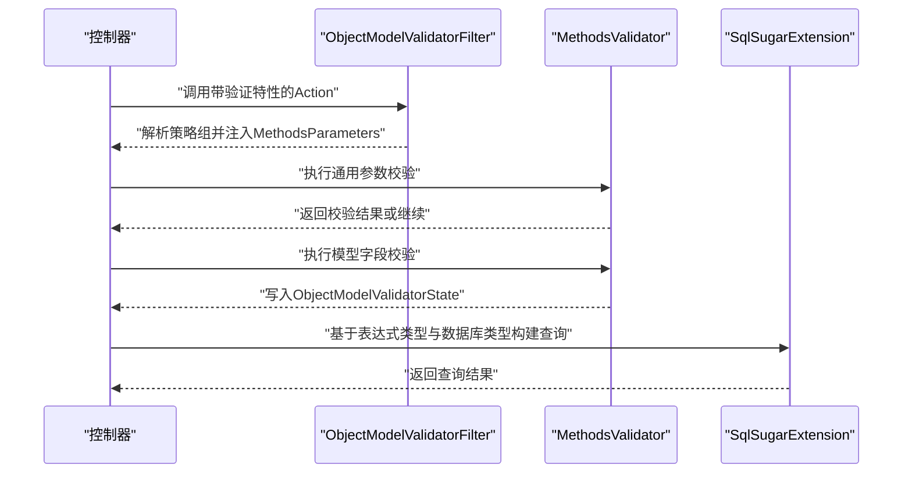
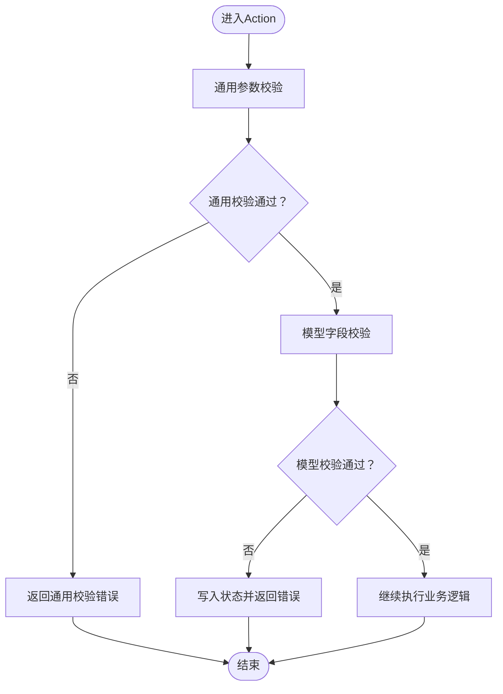
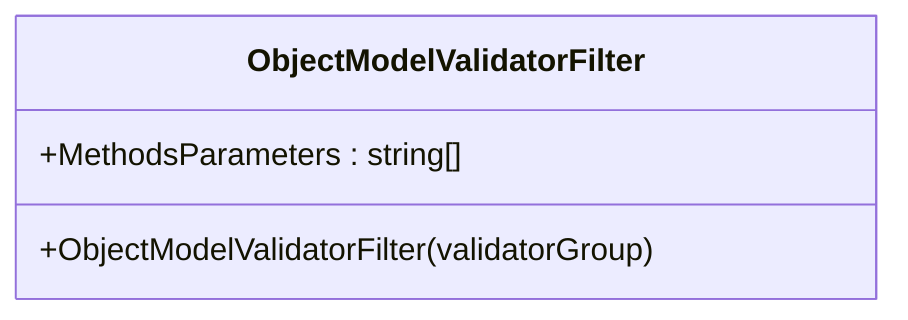
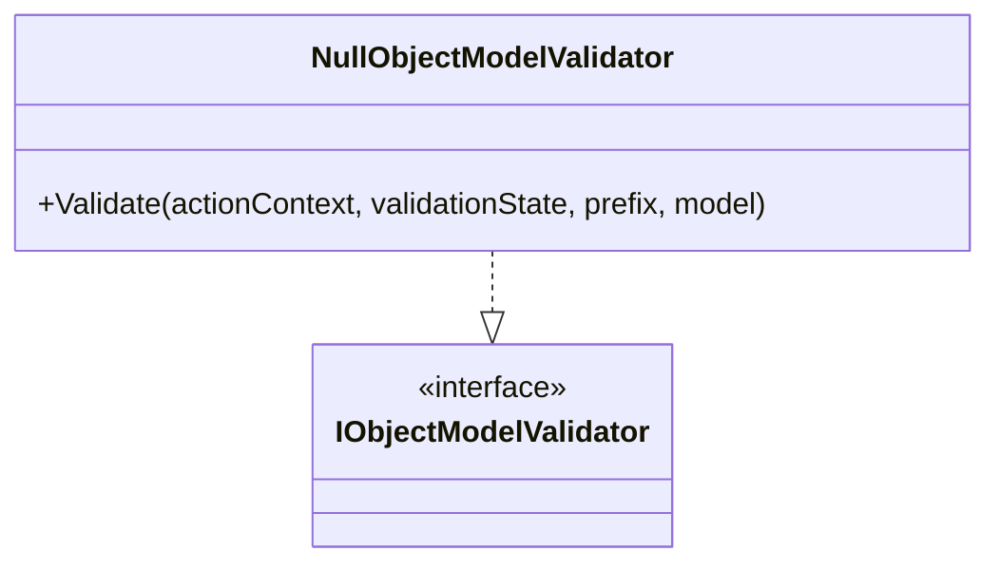
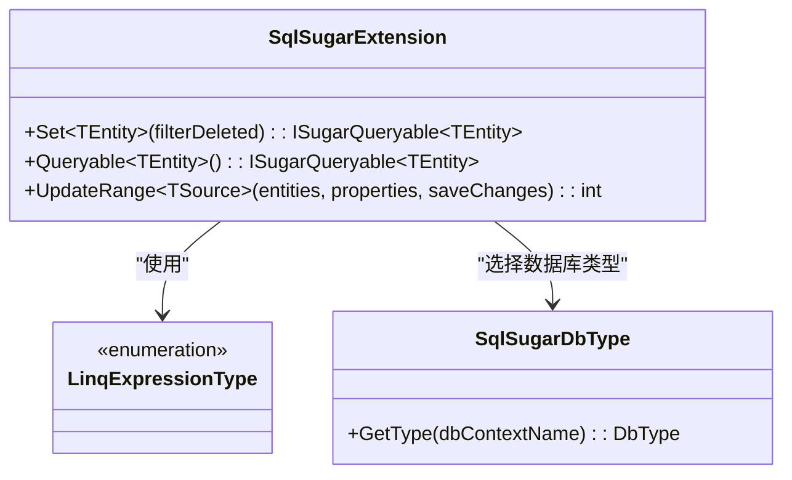
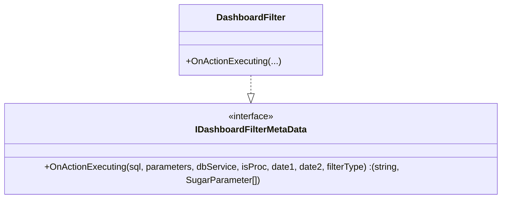
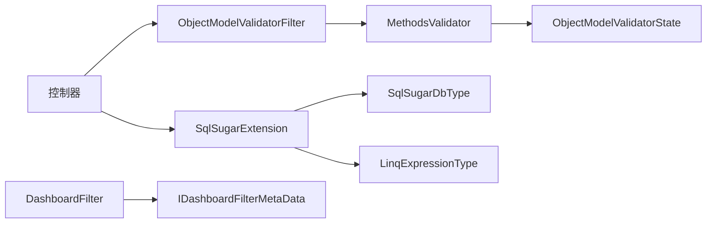

# 策略模式应用

<cite>
**本文引用的文件**
- [MethodsValidator.cs](file://VolPro.Core/ObjectActionValidator/ExpressValidator/MethodsValidator.cs)
- [ObjectModelValidatorState.cs](file://VolPro.Core/ObjectActionValidator/ExpressValidator/ObjectModelValidatorState.cs)
- [ObjectModelValidatorFilter.cs](file://VolPro.Core/ObjectActionValidator/Filters/ObjectModelValidatorFilter.cs)
- [NullObjectModelValidator.cs](file://VolPro.Core/ObjectActionValidator/NullObjectModelValidator.cs)
- [DashboardFilter.cs](file://VolPro.Core/Dashboard/DashboardFilter.cs)
- [IDashboardFilterMetaData.cs](file://VolPro.Core/Dashboard/IDashboardFilterMetaData.cs)
- [SqlSugarDbType.cs](file://VolPro.Core/DbSqlSugar/SqlSugarDbType.cs)
- [SqlSugarExtension.cs](file://VolPro.Core/DbSqlSugar/SqlSugarExtension.cs)
- [LinqExpressionType.cs](file://VolPro.Core/Enums/LinqExpressionType.cs)
- [AutofacContainerModuleExtension.cs](file://VolPro.Core/Extensions/AutofacManager/AutofacContainerModuleExtension.cs)
- [ObjectActionValidatorExampleController.cs](file://VolPro.WebApi/Controllers/ObjectActionValidatorExampleController.cs)
- [Sys_UserController.cs](file://VolPro.WebApi/Controllers/Sys/Sys_UserController.cs)
- [Startup.cs](file://VolPro.WebApi/Startup.cs)
</cite>

## 目录
1. [引言](#引言)
2. [项目结构](#项目结构)
3. [核心组件](#核心组件)
4. [架构总览](#架构总览)
5. [详细组件分析](#详细组件分析)
6. [依赖关系分析](#依赖关系分析)
7. [性能考量](#性能考量)
8. [故障排查指南](#故障排查指南)
9. [结论](#结论)
10. [附录](#附录)

## 引言
本文件围绕“水化热平台”在验证与查询构建方面的策略模式实践展开，重点阐述以下内容：
- 如何通过策略模式实现“验证策略”的选择与切换（表达式验证、条件查询、数据校验）；
- 在动态查询构建、数据验证、算法替换中的应用价值；
- 具体的策略定义与使用方式，包括控制器层注解标记、运行时解析与执行；
- 提高可扩展性与可维护性的最佳实践，以及在复杂业务场景下的组合策略建议。

## 项目结构
本项目采用分层+领域模块化组织，验证与查询构建相关能力主要分布在以下位置：
- 验证策略与执行：VolPro.Core/ObjectActionValidator
- 查询构建与数据库适配：VolPro.Core/DbSqlSugar
- 控制器示例与注册：VolPro.WebApi/Controllers 与 VolPro.WebApi/Startup.cs

图表来源
- [MethodsValidator.cs:18-367](file://VolPro.Core/ObjectActionValidator/ExpressValidator/MethodsValidator.cs#L18-L367)
- [ObjectModelValidatorFilter.cs:9-17](file://VolPro.Core/ObjectActionValidator/Filters/ObjectModelValidatorFilter.cs#L9-L17)
- [ObjectModelValidatorState.cs:7-44](file://VolPro.Core/ObjectActionValidator/ExpressValidator/ObjectModelValidatorState.cs#L7-L44)
- [NullObjectModelValidator.cs:13-29](file://VolPro.Core/ObjectActionValidator/NullObjectModelValidator.cs#L13-L29)
- [SqlSugarExtension.cs:20-229](file://VolPro.Core/DbSqlSugar/SqlSugarExtension.cs#L20-L229)
- [SqlSugarDbType.cs:12-68](file://VolPro.Core/DbSqlSugar/SqlSugarDbType.cs#L12-L68)
- [LinqExpressionType.cs:7-23](file://VolPro.Core/Enums/LinqExpressionType.cs#L7-L23)
- [ObjectActionValidatorExampleController.cs:15](file://VolPro.WebApi/Controllers/ObjectActionValidatorExampleController.cs#L15)
- [Sys_UserController.cs:54](file://VolPro.WebApi/Controllers/Sys/Sys_UserController.cs#L54)
- [Startup.cs:63](file://VolPro.WebApi/Startup.cs#L63)

章节来源
- [MethodsValidator.cs:18-367](file://VolPro.Core/ObjectActionValidator/ExpressValidator/MethodsValidator.cs#L18-L367)
- [SqlSugarExtension.cs:20-229](file://VolPro.Core/DbSqlSugar/SqlSugarExtension.cs#L20-L229)
- [SqlSugarDbType.cs:12-68](file://VolPro.Core/DbSqlSugar/SqlSugarDbType.cs#L12-L68)
- [ObjectActionValidatorExampleController.cs:15](file://VolPro.WebApi/Controllers/ObjectActionValidatorExampleController.cs#L15)
- [Sys_UserController.cs:54](file://VolPro.WebApi/Controllers/Sys/Sys_UserController.cs#L54)
- [Startup.cs:63](file://VolPro.WebApi/Startup.cs#L63)

## 核心组件
- 验证策略注册与执行
  - MethodsValidator：提供静态方法用于注册验证策略（模型字段集合、通用参数规则），并在Action执行前后进行校验。
  - ObjectModelValidatorFilter：以特性形式标记方法需要启用的验证策略组。
  - ObjectModelValidatorState：承载验证状态（是否通过、是否有模型内容、消息等）。
  - NullObjectModelValidator：空对象策略，作为默认兜底实现。
- 查询构建与数据库适配
  - SqlSugarExtension：封装ISqlSugarClient常用操作，支持逻辑删除过滤、分表更新、队列保存等。
  - SqlSugarDbType：根据配置选择数据库类型（MySQL、Oracle、PostgreSQL等）。
  - LinqExpressionType：表达式类型枚举（等于、不等、大于、小于、包含、模糊匹配等）。

章节来源
- [MethodsValidator.cs:18-367](file://VolPro.Core/ObjectActionValidator/ExpressValidator/MethodsValidator.cs#L18-L367)
- [ObjectModelValidatorFilter.cs:9-17](file://VolPro.Core/ObjectActionValidator/Filters/ObjectModelValidatorFilter.cs#L9-L17)
- [ObjectModelValidatorState.cs:7-44](file://VolPro.Core/ObjectActionValidator/ExpressValidator/ObjectModelValidatorState.cs#L7-L44)
- [NullObjectModelValidator.cs:13-29](file://VolPro.Core/ObjectActionValidator/NullObjectModelValidator.cs#L13-L29)
- [SqlSugarExtension.cs:20-229](file://VolPro.Core/DbSqlSugar/SqlSugarExtension.cs#L20-L229)
- [SqlSugarDbType.cs:12-68](file://VolPro.Core/DbSqlSugar/SqlSugarDbType.cs#L12-L68)
- [LinqExpressionType.cs:7-23](file://VolPro.Core/Enums/LinqExpressionType.cs#L7-L23)

## 架构总览
验证与查询构建的策略模式体现在“声明式策略选择 + 运行时策略执行”的协作中：
- 控制器通过特性声明策略组；
- 过滤器解析特性，定位对应策略；
- 执行器按策略规则完成参数与模型校验；
- 查询构建器根据数据库类型与表达式类型生成SQL片段或完整查询。

图表来源
- [ObjectModelValidatorFilter.cs:11-14](file://VolPro.Core/ObjectActionValidator/Filters/ObjectModelValidatorFilter.cs#L11-L14)
- [MethodsValidator.cs:146-218](file://VolPro.Core/ObjectActionValidator/ExpressValidator/MethodsValidator.cs#L146-L218)
- [SqlSugarExtension.cs:194-206](file://VolPro.Core/DbSqlSugar/SqlSugarExtension.cs#L194-L206)

## 详细组件分析

### 组件A：验证策略注册与执行（MethodsValidator）
- 职责
  - 注册模型字段验证策略（键为策略组名，值为字段数组）；
  - 注册通用参数验证规则（键为参数名，值为规则对象）；
  - 在Action执行前执行通用参数校验，在存在模型校验时执行模型字段校验，并通过状态对象传递结果。
- 关键流程
  - 通用参数校验：从请求查询字符串读取参数，按规则类型（字符串、整数、日期、Decimal、Guid）进行长度/范围/格式校验，支持自定义校验函数；
  - 模型字段校验：根据特性标记的字段集合，对模型属性逐一校验，失败则写入状态对象并中断后续处理；
  - 状态管理：通过ObjectModelValidatorState记录验证状态与消息，避免重复校验。

图表来源
- [MethodsValidator.cs:146-258](file://VolPro.Core/ObjectActionValidator/ExpressValidator/MethodsValidator.cs#L146-L258)
- [ObjectModelValidatorState.cs:7-18](file://VolPro.Core/ObjectActionValidator/ExpressValidator/ObjectModelValidatorState.cs#L7-L18)

章节来源
- [MethodsValidator.cs:25-93](file://VolPro.Core/ObjectActionValidator/ExpressValidator/MethodsValidator.cs#L25-L93)
- [MethodsValidator.cs:146-258](file://VolPro.Core/ObjectActionValidator/ExpressValidator/MethodsValidator.cs#L146-L258)
- [ObjectModelValidatorState.cs:7-18](file://VolPro.Core/ObjectActionValidator/ExpressValidator/ObjectModelValidatorState.cs#L7-L18)

### 组件B：策略选择标记（ObjectModelValidatorFilter）
- 职责
  - 通过构造函数接收策略组枚举，解析并缓存该组对应的模型字段集合；
  - 将字段集合暴露给执行器，确保只对声明字段进行校验。
- 应用方式
  - 控制器Action上标注特性，例如登录、修改密码等不同策略组。

图表来源
- [ObjectModelValidatorFilter.cs:9-17](file://VolPro.Core/ObjectActionValidator/Filters/ObjectModelValidatorFilter.cs#L9-L17)

章节来源
- [ObjectModelValidatorFilter.cs:9-17](file://VolPro.Core/ObjectActionValidator/Filters/ObjectModelValidatorFilter.cs#L9-L17)
- [ObjectActionValidatorExampleController.cs:76](file://VolPro.WebApi/Controllers/ObjectActionValidatorExampleController.cs#L76)
- [ObjectActionValidatorExampleController.cs:88](file://VolPro.WebApi/Controllers/ObjectActionValidatorExampleController.cs#L88)
- [Sys_UserController.cs:54](file://VolPro.WebApi/Controllers/Sys/Sys_UserController.cs#L54)

### 组件C：空策略实现（NullObjectModelValidator）
- 职责
  - 实现IObjectModelValidator接口，作为默认策略，当未显式声明验证策略时生效；
  - 在特定条件下触发模型字段校验入口。
- 价值
  - 保证系统始终有一个可用的策略实现，避免空引用；
  - 便于在容器中统一注册默认策略。

图表来源
- [NullObjectModelValidator.cs:13-29](file://VolPro.Core/ObjectActionValidator/NullObjectModelValidator.cs#L13-L29)

章节来源
- [NullObjectModelValidator.cs:13-29](file://VolPro.Core/ObjectActionValidator/NullObjectModelValidator.cs#L13-L29)
- [Startup.cs:63](file://VolPro.WebApi/Startup.cs#L63)
- [AutofacContainerModuleExtension.cs:85](file://VolPro.Core/Extensions/AutofacManager/AutofacContainerModuleExtension.cs#L85)

### 组件D：查询构建与数据库适配（SqlSugarExtension / SqlSugarDbType / LinqExpressionType）
- 职责
  - SqlSugarExtension：提供Set<TEntity>(filterDeleted)等查询构建扩展，结合AppSetting与LinqExpressionType生成Where表达式；
  - SqlSugarDbType：根据配置选择数据库类型，支持多数据库适配；
  - LinqExpressionType：表达式类型枚举，用于动态拼接查询条件。
- 应用价值
  - 将“查询构建算法”抽象为可替换策略，便于在不同数据库间切换；
  - 将“表达式类型”抽象为枚举策略，便于在不同业务场景下灵活组合。

图表来源
- [SqlSugarExtension.cs:194-206](file://VolPro.Core/DbSqlSugar/SqlSugarExtension.cs#L194-L206)
- [SqlSugarDbType.cs:19-67](file://VolPro.Core/DbSqlSugar/SqlSugarDbType.cs#L19-L67)
- [LinqExpressionType.cs:7-23](file://VolPro.Core/Enums/LinqExpressionType.cs#L7-L23)

章节来源
- [SqlSugarExtension.cs:194-206](file://VolPro.Core/DbSqlSugar/SqlSugarExtension.cs#L194-L206)
- [SqlSugarDbType.cs:19-67](file://VolPro.Core/DbSqlSugar/SqlSugarDbType.cs#L19-L67)
- [LinqExpressionType.cs:7-23](file://VolPro.Core/Enums/LinqExpressionType.cs#L7-L23)

### 组件E：仪表盘查询策略（DashboardFilter）
- 职责
  - 实现IDashboardFilterMetaData接口，提供OnActionExecuting钩子，允许在执行前对SQL与参数进行定制化处理；
  - 可根据业务需求（如日期范围、用户上下文）动态调整查询。
- 应用价值
  - 将“查询策略”从控制器中剥离，形成可插拔的过滤器策略；
  - 支持在不修改控制器逻辑的前提下，灵活调整查询行为。

图表来源
- [IDashboardFilterMetaData.cs:11-14](file://VolPro.Core/Dashboard/IDashboardFilterMetaData.cs#L11-L14)
- [DashboardFilter.cs:27-44](file://VolPro.Core/Dashboard/DashboardFilter.cs#L27-L44)

章节来源
- [IDashboardFilterMetaData.cs:11-14](file://VolPro.Core/Dashboard/IDashboardFilterMetaData.cs#L11-L14)
- [DashboardFilter.cs:27-44](file://VolPro.Core/Dashboard/DashboardFilter.cs#L27-L44)

## 依赖关系分析
- 控制器层依赖于验证策略标记（ObjectModelValidatorFilter）与执行器（MethodsValidator）；
- 执行器依赖于状态对象（ObjectModelValidatorState）与通用参数规则注册；
- 查询构建层依赖于数据库类型策略（SqlSugarDbType）与表达式类型（LinqExpressionType）；
- 仪表盘策略实现依赖于IDashboardFilterMetaData接口，形成可替换的查询策略。

图表来源
- [ObjectModelValidatorFilter.cs:11-14](file://VolPro.Core/ObjectActionValidator/Filters/ObjectModelValidatorFilter.cs#L11-L14)
- [MethodsValidator.cs:146-218](file://VolPro.Core/ObjectActionValidator/ExpressValidator/MethodsValidator.cs#L146-L218)
- [ObjectModelValidatorState.cs:7-18](file://VolPro.Core/ObjectActionValidator/ExpressValidator/ObjectModelValidatorState.cs#L7-L18)
- [SqlSugarExtension.cs:194-206](file://VolPro.Core/DbSqlSugar/SqlSugarExtension.cs#L194-L206)
- [SqlSugarDbType.cs:19-67](file://VolPro.Core/DbSqlSugar/SqlSugarDbType.cs#L19-L67)
- [LinqExpressionType.cs:7-23](file://VolPro.Core/Enums/LinqExpressionType.cs#L7-L23)
- [DashboardFilter.cs:27-44](file://VolPro.Core/Dashboard/DashboardFilter.cs#L27-L44)
- [IDashboardFilterMetaData.cs:11-14](file://VolPro.Core/Dashboard/IDashboardFilterMetaData.cs#L11-L14)

章节来源
- [ObjectActionValidatorExampleController.cs:15](file://VolPro.WebApi/Controllers/ObjectActionValidatorExampleController.cs#L15)
- [Sys_UserController.cs:54](file://VolPro.WebApi/Controllers/Sys/Sys_UserController.cs#L54)
- [Startup.cs:63](file://VolPro.WebApi/Startup.cs#L63)

## 性能考量
- 验证策略
  - 通用参数校验仅读取查询字符串，开销较低；模型字段校验按需执行，避免不必要的反射遍历。
  - 建议：对高频Action尽量减少模型字段数量，优先使用通用参数校验替代复杂模型校验。
- 查询构建
  - 使用队列批量保存（SaveQueues）降低网络往返次数；
  - 逻辑删除过滤在查询阶段一次性完成，避免在业务层重复判断。
- 数据库适配
  - 通过SqlSugarDbType集中选择数据库类型，避免分散配置带来的性能与一致性问题。

## 故障排查指南
- 未注册验证策略
  - 现象：抛出“未注册参数的表达式/配置”异常。
  - 排查：确认在启动或初始化阶段已调用注册方法，且策略组名大小写一致。
- 参数为空或格式错误
  - 现象：通用参数校验返回错误，提示参数缺失或格式不符。
  - 排查：检查请求参数名与规则配置，确认自定义校验函数返回正确结果。
- 模型字段校验失败
  - 现象：模型字段校验写入状态并中断执行。
  - 排查：核对ObjectModelValidatorFilter标注的字段集合与实际提交的模型字段是否一致。
- 查询构建异常
  - 现象：逻辑删除过滤或表达式拼接导致查询异常。
  - 排查：检查AppSetting中逻辑删除字段配置与LinqExpressionType使用是否匹配。

章节来源
- [MethodsValidator.cs:113-118](file://VolPro.Core/ObjectActionValidator/ExpressValidator/MethodsValidator.cs#L113-L118)
- [MethodsValidator.cs:138-143](file://VolPro.Core/ObjectActionValidator/ExpressValidator/MethodsValidator.cs#L138-L143)
- [MethodsValidator.cs:234-256](file://VolPro.Core/ObjectActionValidator/ExpressValidator/MethodsValidator.cs#L234-L256)
- [SqlSugarExtension.cs:197-204](file://VolPro.Core/DbSqlSugar/SqlSugarExtension.cs#L197-L204)

## 结论
本项目通过“声明式策略选择 + 运行时策略执行”的验证与查询构建机制，有效实现了：
- 验证策略的可插拔与可替换，支持表达式验证、条件查询、数据校验等多维策略；
- 查询构建算法与数据库类型的解耦，便于在多数据库环境下灵活切换；
- 在复杂业务场景中，通过策略组合与状态管理提升系统的可扩展性与可维护性。

## 附录
- 策略定义与使用示例路径
  - 验证策略注册与执行：[MethodsValidator.cs:25-93](file://VolPro.Core/ObjectActionValidator/ExpressValidator/MethodsValidator.cs#L25-L93)
  - 策略选择标记：[ObjectModelValidatorFilter.cs:11-14](file://VolPro.Core/ObjectActionValidator/Filters/ObjectModelValidatorFilter.cs#L11-L14)
  - 空策略实现注册：[Startup.cs:63](file://VolPro.WebApi/Startup.cs#L63)
  - 查询构建扩展：[SqlSugarExtension.cs:194-206](file://VolPro.Core/DbSqlSugar/SqlSugarExtension.cs#L194-L206)
  - 数据库类型策略：[SqlSugarDbType.cs:19-67](file://VolPro.Core/DbSqlSugar/SqlSugarDbType.cs#L19-L67)
  - 表达式类型枚举：[LinqExpressionType.cs:7-23](file://VolPro.Core/Enums/LinqExpressionType.cs#L7-L23)
  - 仪表盘查询策略接口与实现：[IDashboardFilterMetaData.cs:11-14](file://VolPro.Core/Dashboard/IDashboardFilterMetaData.cs#L11-L14)、[DashboardFilter.cs:27-44](file://VolPro.Core/Dashboard/DashboardFilter.cs#L27-L44)
- 控制器示例
  - 登录与参数校验示例：[ObjectActionValidatorExampleController.cs:76](file://VolPro.WebApi/Controllers/ObjectActionValidatorExampleController.cs#L76)
  - 系统用户控制器使用：[Sys_UserController.cs:54](file://VolPro.WebApi/Controllers/Sys/Sys_UserController.cs#L54)