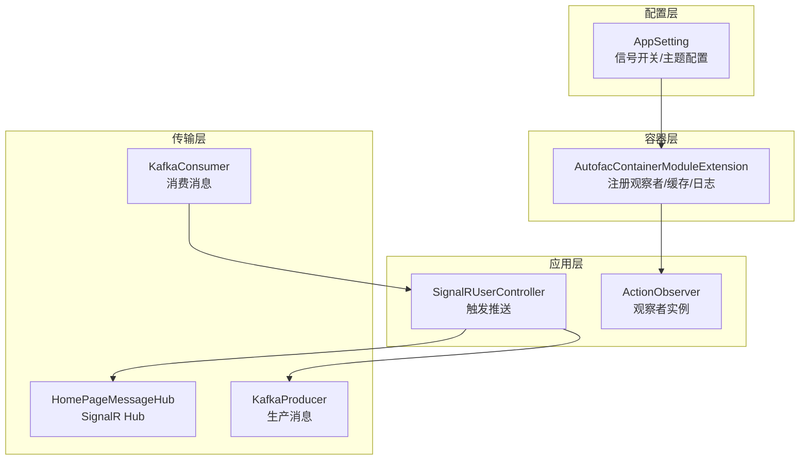
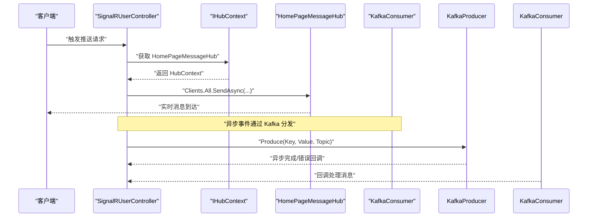
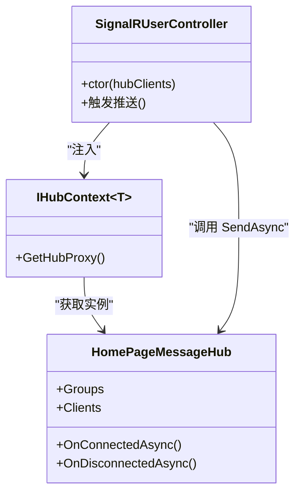
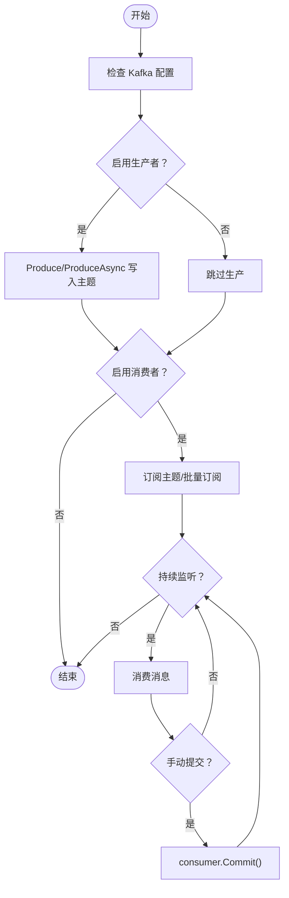
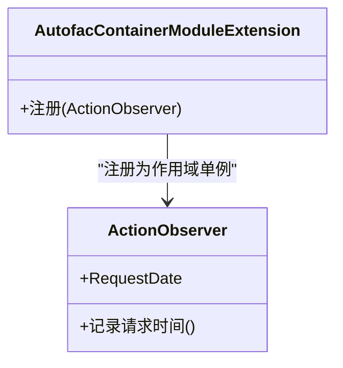
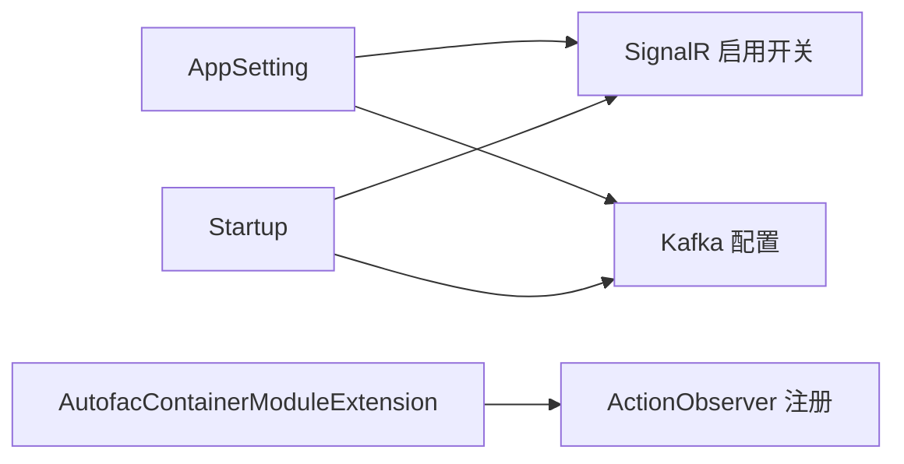

# 观察者模式实现

<cite>
**本文档引用的文件**
- [AppSetting.cs](file://VolPro.Core/Configuration/AppSetting.cs)
- [AutofacContainerModuleExtension.cs](file://VolPro.Core/Extensions/AutofacManager/AutofacContainerModuleExtension.cs)
- [IKafkaConsumer.cs](file://VolPro.Core/KafkaManager/IService/IKafkaConsumer.cs)
- [IKafkaProducer.cs](file://VolPro.Core/KafkaManager/IService/IKafkaProducer.cs)
- [KafkaConsumer.cs](file://VolPro.Core/KafkaManager/Service/KafkaConsumer.cs)
- [KafkaProducer.cs](file://VolPro.Core/KafkaManager/Service/KafkaProducer.cs)
- [ActionObserver.cs](file://VolPro.Core/Services/ActionExecutingLogger.cs)
- [HomePageMessageHub.cs](file://VolPro.WebApi/Controllers/Hubs/HomePageMessageHub.cs)
- [SignalRUserController.cs](file://VolPro.WebApi/Controllers/Hubs/SignalRUserController.cs)
- [Startup.cs](file://VolPro.WebApi/Startup.cs)
</cite>

## 目录
1. [简介](#简介)
2. [项目结构](#项目结构)
3. [核心组件](#核心组件)
4. [架构总览](#架构总览)
5. [详细组件分析](#详细组件分析)
6. [依赖关系分析](#依赖关系分析)
7. [性能考量](#性能考量)
8. [故障排查指南](#故障排查指南)
9. [结论](#结论)

## 简介
本文件面向“水化热平台”的观察者模式实现，系统性阐述两类发布-订阅机制：
- 基于 SignalR 的实时通信（服务器到客户端的事件推送）
- 基于 Kafka 的消息订阅（服务间异步解耦与事件分发）

文档将从架构设计、组件职责、数据流与处理逻辑、错误处理与连接管理等方面进行深入分析，并给出最佳实践建议。

## 项目结构
围绕观察者模式的关键模块分布如下：
- 配置层：集中管理 SignalR 开关与 Kafka 配置
- 容器层：通过 Autofac 注册观察者与消息中间件
- 传输层：SignalR Hub 与 Kafka 生产/消费者
- 应用层：控制器通过 Hub 上下文向客户端推送；服务层可触发事件并通过 Kafka 发布

**图表来源**
- [AppSetting.cs:30-34](file://VolPro.Core/Configuration/AppSetting.cs#L30-L34)
- [AutofacContainerModuleExtension.cs:83-84](file://VolPro.Core/Extensions/AutofacManager/AutofacContainerModuleExtension.cs#L83-L84)
- [HomePageMessageHub.cs:19](file://VolPro.WebApi/Controllers/Hubs/HomePageMessageHub.cs#L19)
- [KafkaProducer.cs:49-70](file://VolPro.Core/KafkaManager/Service/KafkaProducer.cs#L49-L70)
- [KafkaConsumer.cs:71-121](file://VolPro.Core/KafkaManager/Service/KafkaConsumer.cs#L71-L121)
- [SignalRUserController.cs:17](file://VolPro.WebApi/Controllers/Hubs/SignalRUserController.cs#L17)

**章节来源**
- [AppSetting.cs:30-34](file://VolPro.Core/Configuration/AppSetting.cs#L30-L34)
- [AutofacContainerModuleExtension.cs:83-84](file://VolPro.Core/Extensions/AutofacManager/AutofacContainerModuleExtension.cs#L83-L84)
- [HomePageMessageHub.cs:19](file://VolPro.WebApi/Controllers/Hubs/HomePageMessageHub.cs#L19)
- [KafkaProducer.cs:49-70](file://VolPro.Core/KafkaManager/Service/KafkaProducer.cs#L49-L70)
- [KafkaConsumer.cs:71-121](file://VolPro.Core/KafkaManager/Service/KafkaConsumer.cs#L71-L121)
- [SignalRUserController.cs:17](file://VolPro.WebApi/Controllers/Hubs/SignalRUserController.cs#L17)

## 核心组件
- 观察者实例（ActionObserver）：通过 Autofac 注册为生命周期作用域内的单例，用于记录请求时间等上下文信息，体现“被观察”对象的职责。
- SignalR Hub（HomePageMessageHub）：继承自 Hub，负责与客户端建立长连接、加入/离开组、广播消息。
- Kafka 生产者（KafkaProducer）：封装生产消息的接口与异步实现，支持错误回调与日志记录。
- Kafka 消费者（KafkaConsumer）：提供订阅回调、批量消费、单次消费等多种消费模式，具备分区分配/回收与手动提交能力。
- 配置中心（AppSetting）：集中管理 UseSignalR、Kafka 开关与主题配置，驱动运行时行为。

**章节来源**
- [ActionObserver.cs:7](file://VolPro.Core/Services/ActionExecutingLogger.cs#L7)
- [HomePageMessageHub.cs:19](file://VolPro.WebApi/Controllers/Hubs/HomePageMessageHub.cs#L19)
- [IKafkaProducer.cs:8-27](file://VolPro.Core/KafkaManager/IService/IKafkaProducer.cs#L8-L27)
- [IKafkaConsumer.cs:8-40](file://VolPro.Core/KafkaManager/IService/IKafkaConsumer.cs#L8-L40)
- [AppSetting.cs:30-34](file://VolPro.Core/Configuration/AppSetting.cs#L30-L34)

## 架构总览
观察者模式在本项目中的落地体现在两条主线：
- 实时事件推送：控制器通过 HubContext 获取 Hub，向客户端广播/分组推送
- 异步事件分发：服务层将事件写入 Kafka 主题，消费者异步处理并可能再次触发业务动作

**图表来源**
- [SignalRUserController.cs:17](file://VolPro.WebApi/Controllers/Hubs/SignalRUserController.cs#L17)
- [HomePageMessageHub.cs:19](file://VolPro.WebApi/Controllers/Hubs/HomePageMessageHub.cs#L19)
- [KafkaProducer.cs:49-70](file://VolPro.Core/KafkaManager/Service/KafkaProducer.cs#L49-L70)
- [KafkaConsumer.cs:71-121](file://VolPro.Core/KafkaManager/Service/KafkaConsumer.cs#L71-L121)

## 详细组件分析

### 组件一：SignalR 实时通信（观察者模式）
- Hub 创建与客户端连接
  - Hub 继承自 Hub，提供与客户端的双向通信通道
  - 客户端通过 Hub 连接建立长连接，可加入/离开组以实现多播
- 消息发送与接收
  - 控制器注入 IHubContext<HomePageMessageHub>，通过 Clients.All/Clients.Group 向订阅者推送消息
  - 可结合 UseSignalR 配置开关控制是否启用
- 优势
  - 解耦：控制器不直接依赖具体客户端，仅通过 Hub 推送
  - 实时：基于长连接，低延迟事件通知
  - 异步：基于 ASP.NET Core SignalR 的异步模型

**图表来源**
- [SignalRUserController.cs:17](file://VolPro.WebApi/Controllers/Hubs/SignalRUserController.cs#L17)
- [HomePageMessageHub.cs:19](file://VolPro.WebApi/Controllers/Hubs/HomePageMessageHub.cs#L19)

**章节来源**
- [SignalRUserController.cs:17](file://VolPro.WebApi/Controllers/Hubs/SignalRUserController.cs#L17)
- [HomePageMessageHub.cs:19](file://VolPro.WebApi/Controllers/Hubs/HomePageMessageHub.cs#L19)
- [AppSetting.cs:30-34](file://VolPro.Core/Configuration/AppSetting.cs#L30-L34)

### 组件二：Kafka 消息订阅（观察者模式）
- 发布-订阅机制
  - 生产者：通过 Produce/ProduceAsync 将事件写入指定主题
  - 消费者：支持订阅回调、批量消费、单次消费，具备分区分配/回收与手动提交
- 观察者角色
  - 消费者回调函数作为“观察者”，对每条消息进行处理
  - 可根据主题集合批量订阅，实现一对多事件分发
- 错误处理与日志
  - 消费异常捕获并记录 KafkaException 日志类型
  - 提供统计处理器输出监听状态

**图表来源**
- [KafkaProducer.cs:49-70](file://VolPro.Core/KafkaManager/Service/KafkaProducer.cs#L49-L70)
- [KafkaConsumer.cs:71-121](file://VolPro.Core/KafkaManager/Service/KafkaConsumer.cs#L71-L121)
- [AppSetting.cs:206-214](file://VolPro.Core/Configuration/AppSetting.cs#L206-L214)

**章节来源**
- [IKafkaProducer.cs:8-27](file://VolPro.Core/KafkaManager/IService/IKafkaProducer.cs#L8-L27)
- [IKafkaConsumer.cs:8-40](file://VolPro.Core/KafkaManager/IService/IKafkaConsumer.cs#L8-L40)
- [KafkaProducer.cs:49-70](file://VolPro.Core/KafkaManager/Service/KafkaProducer.cs#L49-L70)
- [KafkaConsumer.cs:71-121](file://VolPro.Core/KafkaManager/Service/KafkaConsumer.cs#L71-L121)
- [AppSetting.cs:206-214](file://VolPro.Core/Configuration/AppSetting.cs#L206-L214)

### 组件三：观察者实例（ActionObserver）
- 职责
  - 作为“被观察”对象，承载请求上下文（如请求时间），供其他组件观察
  - 在中间件与日志组件中被注入与使用，体现观察者模式中的“状态暴露”
- 注册与生命周期
  - 通过 Autofac 注册为 InstancePerLifetimeScope，确保每个请求生命周期内共享同一实例

**图表来源**
- [ActionObserver.cs:7](file://VolPro.Core/Services/ActionExecutingLogger.cs#L7)
- [AutofacContainerModuleExtension.cs:83-84](file://VolPro.Core/Extensions/AutofacManager/AutofacContainerModuleExtension.cs#L83-L84)

**章节来源**
- [ActionObserver.cs:7](file://VolPro.Core/Services/ActionExecutingLogger.cs#L7)
- [AutofacContainerModuleExtension.cs:83-84](file://VolPro.Core/Extensions/AutofacManager/AutofacContainerModuleExtension.cs#L83-L84)

## 依赖关系分析
- 配置驱动：AppSetting 中的 UseSignalR 与 Kafka 配置决定运行时行为
- 容器装配：Autofac 注册 ActionObserver 与缓存服务，为观察者模式提供基础设施
- 传输对接：SignalR 与 Kafka 分别在 Startup 中按配置启用

**图表来源**
- [AppSetting.cs:30-34](file://VolPro.Core/Configuration/AppSetting.cs#L30-L34)
- [AutofacContainerModuleExtension.cs:83-84](file://VolPro.Core/Extensions/AutofacManager/AutofacContainerModuleExtension.cs#L83-L84)
- [Startup.cs:179](file://VolPro.WebApi/Startup.cs#L179)
- [Startup.cs:368-369](file://VolPro.WebApi/Startup.cs#L368-L369)

**章节来源**
- [AppSetting.cs:30-34](file://VolPro.Core/Configuration/AppSetting.cs#L30-L34)
- [AutofacContainerModuleExtension.cs:83-84](file://VolPro.Core/Extensions/AutofacManager/AutofacContainerModuleExtension.cs#L83-L84)
- [Startup.cs:179](file://VolPro.WebApi/Startup.cs#L179)
- [Startup.cs:368-369](file://VolPro.WebApi/Startup.cs#L368-L369)

## 性能考量
- SignalR
  - 长连接占用资源，需合理设置断线重连与心跳策略
  - 分组广播优于逐点推送，降低网络与 CPU 开销
- Kafka
  - 批量消费与单次消费模式平衡吞吐与延迟
  - 手动提交可保证幂等性，但会增加处理复杂度
  - 分区数量影响并行度，应结合业务主题与消费者数量规划
- 缓存与日志
  - 使用内存/Redis 缓存减少重复计算
  - 日志级别与采样策略避免 IO 抖动

## 故障排查指南
- SignalR
  - 连接失败：检查 UseSignalR 开关与 Startup 中 AddSignalR 配置
  - 消息未达：确认客户端已加入正确组，服务端调用 Clients.Group
- Kafka
  - 生产失败：查看 Produce/ProduceAsync 的错误回调日志
  - 消费停滞：检查消费者是否处于持续监听循环，手动提交是否成功
  - 分区分配问题：关注分区分配/回收回调输出，排查消费者组配置
- 观察者上下文
  - ActionObserver 的请求时间可用于定位请求链路耗时

**章节来源**
- [AppSetting.cs:30-34](file://VolPro.Core/Configuration/AppSetting.cs#L30-L34)
- [KafkaProducer.cs:62-69](file://VolPro.Core/KafkaManager/Service/KafkaProducer.cs#L62-L69)
- [KafkaConsumer.cs:78-92](file://VolPro.Core/KafkaManager/Service/KafkaConsumer.cs#L78-L92)
- [KafkaConsumer.cs:109-118](file://VolPro.Core/KafkaManager/Service/KafkaConsumer.cs#L109-L118)
- [ActionObserver.cs:7](file://VolPro.Core/Services/ActionExecutingLogger.cs#L7)

## 结论
本项目通过 SignalR 与 Kafka 两条路径实现了完整的观察者模式：
- SignalR 用于实时事件推送，强调低延迟与强解耦
- Kafka 用于异步事件分发，强调高吞吐与可扩展性
配合 AppSetting 的集中配置与 Autofac 的依赖注入，形成清晰的职责边界与可维护的架构。在分布式场景中，建议优先采用 Kafka 作为内部事件总线，SignalR 作为对外实时通道，同时完善错误处理与连接管理策略，确保系统稳定与高性能。