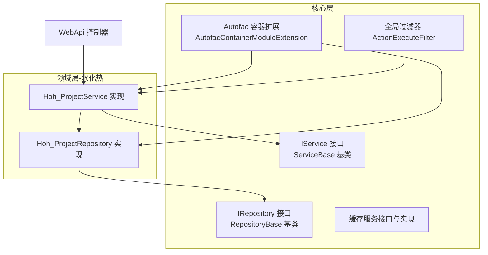
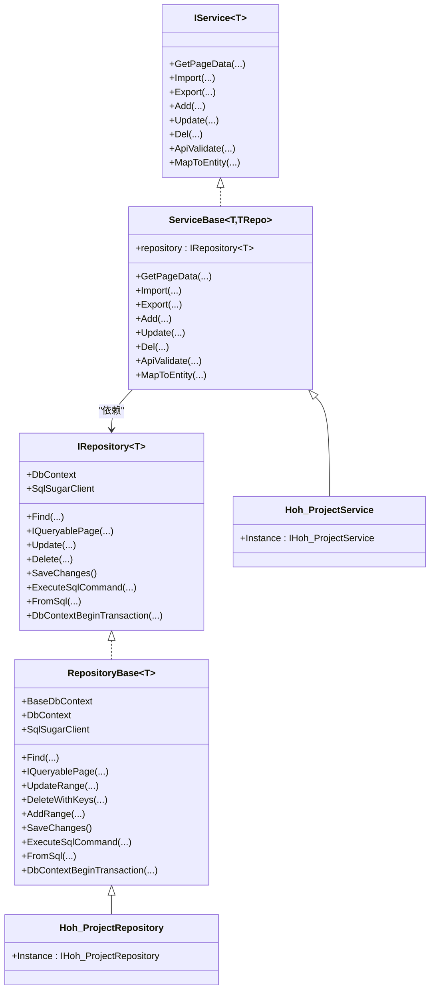
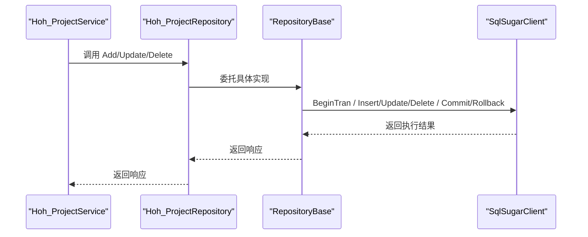
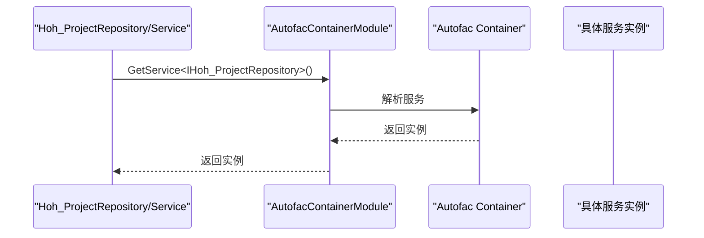
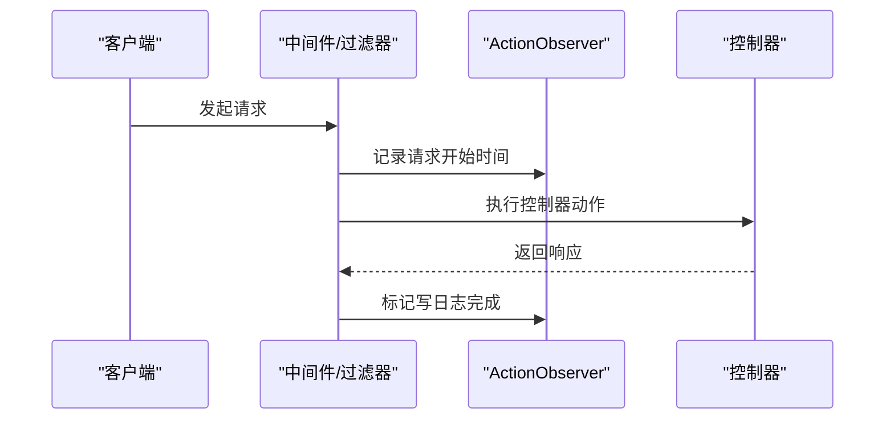
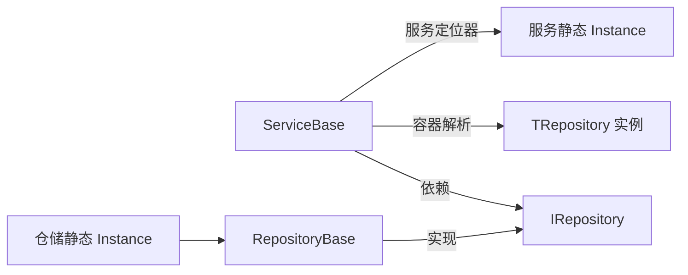

# 设计模式应用

<cite>
**本文引用的文件**   
- [IRepository.cs](file://VolPro.Core/BaseProvider/IRepository.cs)
- [IService.cs](file://VolPro.Core/BaseProvider/IService.cs)
- [RepositoryBase.cs](file://VolPro.Core/BaseProvider/RepositoryBase.cs)
- [ServiceBase.cs](file://VolPro.Core/BaseProvider/ServiceBase.cs)
- [Hoh_ProjectRepository.cs](file://Hncdi.HeatOfHydration/Repositories/Hoh/Hoh_ProjectRepository.cs)
- [Hoh_ProjectService.cs](file://Hncdi.HeatOfHydration/Services/Hoh/Hoh_ProjectService.cs)
- [AutofacContainerModule.cs](file://VolPro.Core/Extensions/AutofacManager/AutofacContainerModule.cs)
- [AutofacContainerModuleExtension.cs](file://VolPro.Core/Extensions/AutofacManager/AutofacContainerModuleExtension.cs)
- [ActionObserver.cs](file://VolPro.Core/Services/ActionExecutingLogger.cs)
- [ActionExecuteFilter.cs](file://VolPro.Core/Filters/ActionExecuteFilter.cs)
</cite>

## 目录
1. [引言](#引言)
2. [项目结构](#项目结构)
3. [核心组件](#核心组件)
4. [架构总览](#架构总览)
5. [详细组件分析](#详细组件分析)
6. [依赖关系分析](#依赖关系分析)
7. [性能考虑](#性能考虑)
8. [故障排查指南](#故障排查指南)
9. [结论](#结论)
10. [附录](#附录)

## 引言
本文件面向“水化热平台”项目，系统梳理并深入解析项目中应用的设计模式，重点覆盖仓储模式（Repository Pattern）、服务定位器模式（Service Locator）、工厂模式（Factory Pattern）以及观察者模式（Observer Pattern）。通过对接口与基类的抽象、依赖注入容器的使用、以及服务层与仓储层的协作机制进行剖析，帮助读者理解这些模式在实际工程中的落地方式、带来的好处（如代码复用、可测试性、可扩展性），并给出最佳实践与性能影响分析。

## 项目结构
项目采用分层+模块化的组织方式：
- 核心层（VolPro.Core）：提供通用基础设施、仓储与服务基类、依赖注入扩展、缓存、日志、过滤器等。
- 领域层（Hncdi.HeatOfHydration）：按业务域划分（如 Hoh、Project 等），包含接口与实现，具体业务逻辑位于 Partial 扩展文件中。
- Web 层（VolPro.WebApi）：控制器与启动配置，负责请求入口与集成。

图表来源
- [IRepository.cs:19-328](file://VolPro.Core/BaseProvider/IRepository.cs#L19-L328)
- [IService.cs:14-165](file://VolPro.Core/BaseProvider/IService.cs#L14-L165)
- [RepositoryBase.cs:29-651](file://VolPro.Core/BaseProvider/RepositoryBase.cs#L29-L651)
- [ServiceBase.cs:31-800](file://VolPro.Core/BaseProvider/ServiceBase.cs#L31-L800)
- [Hoh_ProjectRepository.cs:13-24](file://Hncdi.HeatOfHydration/Repositories/Hoh/Hoh_ProjectRepository.cs#L13-L24)
- [Hoh_ProjectService.cs:16-23](file://Hncdi.HeatOfHydration/Services/Hoh/Hoh_ProjectService.cs#L16-L23)
- [AutofacContainerModuleExtension.cs:36-115](file://VolPro.Core/Extensions/AutofacManager/AutofacContainerModuleExtension.cs#L36-L115)
- [ActionExecuteFilter.cs:13-26](file://VolPro.Core/Filters/ActionExecuteFilter.cs#L13-L26)

章节来源
- [IRepository.cs:19-328](file://VolPro.Core/BaseProvider/IRepository.cs#L19-L328)
- [IService.cs:14-165](file://VolPro.Core/BaseProvider/IService.cs#L14-L165)
- [RepositoryBase.cs:29-651](file://VolPro.Core/BaseProvider/RepositoryBase.cs#L29-L651)
- [ServiceBase.cs:31-800](file://VolPro.Core/BaseProvider/ServiceBase.cs#L31-L800)
- [Hoh_ProjectRepository.cs:13-24](file://Hncdi.HeatOfHydration/Repositories/Hoh/Hoh_ProjectRepository.cs#L13-L24)
- [Hoh_ProjectService.cs:16-23](file://Hncdi.HeatOfHydration/Services/Hoh/Hoh_ProjectService.cs#L16-L23)
- [AutofacContainerModuleExtension.cs:36-115](file://VolPro.Core/Extensions/AutofacManager/AutofacContainerModuleExtension.cs#L36-L115)
- [ActionExecuteFilter.cs:13-26](file://VolPro.Core/Filters/ActionExecuteFilter.cs#L13-L26)

## 核心组件
- 仓储接口与基类
  - IRepository<TEntity>：统一定义查询、分页、增删改、事务、SQL 执行等能力，屏蔽底层持久化细节。
  - RepositoryBase<TEntity>：基于 SqlSugar 的具体实现，封装了事务、分页、条件查询、主从明细同步更新、物理/逻辑删除、雪花 ID 等通用逻辑。
- 服务接口与基类
  - IService<T>：统一定义分页、导入导出、新增/编辑/删除、工作流、参数校验、实体映射等服务层契约。
  - ServiceBase<T, TRepository>：提供页面数据加载、权限字段过滤、多租户过滤、导入导出、明细处理、流程审批等通用服务逻辑，并通过依赖注入获取仓储实例。
- 依赖注入与服务定位器
  - AutofacContainerModuleExtension：扫描程序集，注册实现 IDependency 的类型为自身与已实现接口，生命周期按作用域管理；同时注册缓存服务、Dapper 类型处理器、数据库缓存初始化等。
  - AutofacContainerModule：提供静态 GetService<T>() 方法，作为服务定位器的便捷入口。
- 观察者与过滤器
  - ActionObserver：记录请求执行时间与状态，用于日志与审计。
  - ActionExecuteFilter：全局 Action 参数校验过滤器，属于观察式行为的一种体现。

章节来源
- [IRepository.cs:19-328](file://VolPro.Core/BaseProvider/IRepository.cs#L19-L328)
- [IService.cs:14-165](file://VolPro.Core/BaseProvider/IService.cs#L14-L165)
- [RepositoryBase.cs:29-651](file://VolPro.Core/BaseProvider/RepositoryBase.cs#L29-L651)
- [ServiceBase.cs:31-800](file://VolPro.Core/BaseProvider/ServiceBase.cs#L31-L800)
- [AutofacContainerModule.cs:7-14](file://VolPro.Core/Extensions/AutofacManager/AutofacContainerModule.cs#L7-L14)
- [AutofacContainerModuleExtension.cs:36-115](file://VolPro.Core/Extensions/AutofacManager/AutofacContainerModuleExtension.cs#L36-L115)
- [ActionObserver.cs:8-27](file://VolPro.Core/Services/ActionExecutingLogger.cs#L8-L27)
- [ActionExecuteFilter.cs:13-26](file://VolPro.Core/Filters/ActionExecuteFilter.cs#L13-L26)

## 架构总览
下图展示了“水化热平台”中仓储与服务层的整体交互，以及依赖注入容器在其中的作用。

图表来源
- [IRepository.cs:19-328](file://VolPro.Core/BaseProvider/IRepository.cs#L19-L328)
- [IService.cs:14-165](file://VolPro.Core/BaseProvider/IService.cs#L14-L165)
- [RepositoryBase.cs:29-651](file://VolPro.Core/BaseProvider/RepositoryBase.cs#L29-L651)
- [ServiceBase.cs:31-800](file://VolPro.Core/BaseProvider/ServiceBase.cs#L31-L800)
- [Hoh_ProjectRepository.cs:13-24](file://Hncdi.HeatOfHydration/Repositories/Hoh/Hoh_ProjectRepository.cs#L13-L24)
- [Hoh_ProjectService.cs:16-23](file://Hncdi.HeatOfHydration/Services/Hoh/Hoh_ProjectService.cs#L16-L23)

## 详细组件分析

### 仓储模式（Repository Pattern）
- 抽象与实现分离
  - IRepository<TEntity> 定义了统一的仓储契约，RepositoryBase<TEntity> 提供了基于 SqlSugar 的完整实现，确保上层仅依赖抽象，便于替换与扩展。
- 事务与一致性
  - DbContextBeginTransaction 封装事务提交/回滚与异常处理，保证复杂业务的一致性。
- 主从明细同步更新
  - UpdateRange<Detail> 支持主表与明细表的“新增/修改/删除”同步，结合实体特性与反射，自动识别明细集合并执行相应操作。
- 多租户与权限过滤
  - ServiceBase 在分页查询与导出时集成多租户过滤与权限字段过滤，避免越权访问与多余数据加载。
- 性能与可维护性
  - 统一分页、排序、条件拼装逻辑，减少重复代码；支持 SplitTable 分表场景，提升大数据量下的可维护性。

图表来源
- [Hoh_ProjectService.cs:16-23](file://Hncdi.HeatOfHydration/Services/Hoh/Hoh_ProjectService.cs#L16-L23)
- [Hoh_ProjectRepository.cs:13-24](file://Hncdi.HeatOfHydration/Repositories/Hoh/Hoh_ProjectRepository.cs#L13-L24)
- [RepositoryBase.cs:67-96](file://VolPro.Core/BaseProvider/RepositoryBase.cs#L67-L96)
- [RepositoryBase.cs:347-377](file://VolPro.Core/BaseProvider/RepositoryBase.cs#L347-L377)

章节来源
- [IRepository.cs:19-328](file://VolPro.Core/BaseProvider/IRepository.cs#L19-L328)
- [RepositoryBase.cs:29-651](file://VolPro.Core/BaseProvider/RepositoryBase.cs#L29-L651)
- [Hoh_ProjectRepository.cs:13-24](file://Hncdi.HeatOfHydration/Repositories/Hoh/Hoh_ProjectRepository.cs#L13-L24)

### 服务定位器模式（Service Locator）
- 服务定位器实现
  - AutofacContainerModule.GetService<T>() 提供静态入口，通过反射与容器解析服务实例，简化跨层获取依赖的复杂度。
- 注册与生命周期
  - AutofacContainerModuleExtension.AddModule 扫描项目内实现 IDependency 的类型，注册为自身与已实现接口，并按作用域生命周期管理；同时注册缓存服务、Dapper 类型处理器、数据库缓存等。
- 应用场景
  - 水化热仓库与服务通过静态 Instance 属性间接使用服务定位器，实现松耦合的服务获取。

图表来源
- [AutofacContainerModule.cs:9-12](file://VolPro.Core/Extensions/AutofacManager/AutofacContainerModule.cs#L9-L12)
- [AutofacContainerModuleExtension.cs:36-115](file://VolPro.Core/Extensions/AutofacManager/AutofacContainerModuleExtension.cs#L36-L115)
- [Hoh_ProjectRepository.cs:20-22](file://Hncdi.HeatOfHydration/Repositories/Hoh/Hoh_ProjectRepository.cs#L20-L22)
- [Hoh_ProjectService.cs:19-21](file://Hncdi.HeatOfHydration/Services/Hoh/Hoh_ProjectService.cs#L19-L21)

章节来源
- [AutofacContainerModule.cs:7-14](file://VolPro.Core/Extensions/AutofacManager/AutofacContainerModule.cs#L7-L14)
- [AutofacContainerModuleExtension.cs:36-115](file://VolPro.Core/Extensions/AutofacManager/AutofacContainerModuleExtension.cs#L36-L115)
- [Hoh_ProjectRepository.cs:13-24](file://Hncdi.HeatOfHydration/Repositories/Hoh/Hoh_ProjectRepository.cs#L13-L24)
- [Hoh_ProjectService.cs:16-23](file://Hncdi.HeatOfHydration/Services/Hoh/Hoh_ProjectService.cs#L16-L23)

### 工厂模式（Factory Pattern）
- 工厂职责
  - 项目未直接暴露显式的“工厂类”，但通过仓储与服务基类的泛型约束与反射机制，实现了“按类型创建”的工厂式行为：
    - 泛型 ServiceBase<T, TRepository> 在构造时绑定实体与仓储类型，形成“类型工厂”的效果。
    - RepositoryBase<TEntity> 中对分表、雪花 ID、明细同步等场景的处理，体现了“根据实体特性动态选择策略”的工厂思想。
- 最佳实践
  - 将“如何创建与组装对象”的逻辑集中在基类与容器注册中，调用方仅需关注契约与使用。

章节来源
- [ServiceBase.cs:31-800](file://VolPro.Core/BaseProvider/ServiceBase.cs#L31-L800)
- [RepositoryBase.cs:29-651](file://VolPro.Core/BaseProvider/RepositoryBase.cs#L29-L651)

### 观察者模式（Observer Pattern）
- 观察者实现
  - ActionObserver 记录请求开始时间与写日志标记，配合中间件与过滤器在请求生命周期内进行观察与记录。
  - ActionExecuteFilter 在 Action 执行前后进行参数校验与拦截，属于典型的观察式行为。
- 应用场景
  - 日志与审计、参数校验、请求生命周期监控等。

图表来源
- [ActionObserver.cs:8-27](file://VolPro.Core/Services/ActionExecutingLogger.cs#L8-L27)
- [ActionExecuteFilter.cs:13-26](file://VolPro.Core/Filters/ActionExecuteFilter.cs#L13-L26)

章节来源
- [ActionObserver.cs:8-27](file://VolPro.Core/Services/ActionExecutingLogger.cs#L8-L27)
- [ActionExecuteFilter.cs:13-26](file://VolPro.Core/Filters/ActionExecuteFilter.cs#L13-L26)

## 依赖关系分析
- 松耦合与可替换
  - 上层仅依赖接口（IRepository、IService），具体实现由容器注册与服务定位器解析，便于替换不同数据库或存储后端。
- 循环依赖规避
  - 通过接口与基类解耦，避免仓储与服务之间的直接循环引用；容器负责生命周期管理。
- 外部依赖与集成点
  - SqlSugar、Autofac、Dapper、缓存服务等外部组件通过扩展方法集中初始化，降低散落配置带来的风险。

图表来源
- [IService.cs:14-165](file://VolPro.Core/BaseProvider/IService.cs#L14-L165)
- [IRepository.cs:19-328](file://VolPro.Core/BaseProvider/IRepository.cs#L19-L328)
- [ServiceBase.cs:31-800](file://VolPro.Core/BaseProvider/ServiceBase.cs#L31-L800)
- [RepositoryBase.cs:29-651](file://VolPro.Core/BaseProvider/RepositoryBase.cs#L29-L651)
- [Hoh_ProjectRepository.cs:13-24](file://Hncdi.HeatOfHydration/Repositories/Hoh/Hoh_ProjectRepository.cs#L13-L24)
- [Hoh_ProjectService.cs:16-23](file://Hncdi.HeatOfHydration/Services/Hoh/Hoh_ProjectService.cs#L16-L23)

章节来源
- [IService.cs:14-165](file://VolPro.Core/BaseProvider/IService.cs#L14-L165)
- [IRepository.cs:19-328](file://VolPro.Core/BaseProvider/IRepository.cs#L19-L328)
- [ServiceBase.cs:31-800](file://VolPro.Core/BaseProvider/ServiceBase.cs#L31-L800)
- [RepositoryBase.cs:29-651](file://VolPro.Core/BaseProvider/RepositoryBase.cs#L29-L651)
- [Hoh_ProjectRepository.cs:13-24](file://Hncdi.HeatOfHydration/Repositories/Hoh/Hoh_ProjectRepository.cs#L13-L24)
- [Hoh_ProjectService.cs:16-23](file://Hncdi.HeatOfHydration/Services/Hoh/Hoh_ProjectService.cs#L16-L23)

## 性能考虑
- 查询与分页
  - 统一的分页与排序逻辑减少重复实现，避免误用导致的全表扫描；建议在高频查询字段建立索引。
- 事务与批量操作
  - 事务封装与批量插入/更新可显著降低往返次数；注意控制单次事务范围，避免长时间锁持有。
- 缓存与序列化
  - 通过容器注册缓存服务（内存/Redis），结合权限字段过滤与导出列裁剪，减少不必要的数据传输与计算。
- 反射与动态调用
  - 明细同步更新与泛型反射提升了灵活性，但需注意性能开销；建议对热点路径进行缓存或预编译表达式。

## 故障排查指南
- 事务异常
  - 若出现事务回滚或异常消息，请检查 DbContextBeginTransaction 的返回状态与异常捕获分支，确认业务逻辑是否正确设置响应状态。
- 主从明细同步问题
  - UpdateRange<Detail> 依赖实体特性与主键约定；若明细未按预期新增/修改/删除，请核对实体特性配置与主键生成策略。
- 导入/导出失败
  - 导入失败通常与 Excel 列映射、忽略字段、雪花 ID 生成有关；导出失败可能与权限字段过滤或列配置冲突有关。
- 参数校验与权限
  - 全局 ActionExecuteFilter 会在 Action 执行前进行参数校验；若出现参数缺失或非法，请检查过滤器链与实体验证逻辑。

章节来源
- [RepositoryBase.cs:67-96](file://VolPro.Core/BaseProvider/RepositoryBase.cs#L67-L96)
- [RepositoryBase.cs:347-377](file://VolPro.Core/BaseProvider/RepositoryBase.cs#L347-L377)
- [ServiceBase.cs:531-605](file://VolPro.Core/BaseProvider/ServiceBase.cs#L531-L605)
- [ServiceBase.cs:612-652](file://VolPro.Core/BaseProvider/ServiceBase.cs#L612-L652)
- [ActionExecuteFilter.cs:13-26](file://VolPro.Core/Filters/ActionExecuteFilter.cs#L13-L26)

## 结论
本项目通过仓储与服务基类的抽象、依赖注入容器的集中管理、以及服务定位器的便捷访问，有效实现了代码复用、可测试性与可扩展性。结合事务封装、主从明细同步、多租户与权限过滤、以及观察式日志与参数校验，形成了稳定且易于演进的架构基础。在后续扩展中，建议持续关注性能热点、完善单元测试与集成测试，并保持接口契约的稳定性以降低耦合。

## 附录
- 最佳实践清单
  - 优先使用接口编程，避免直接依赖具体实现。
  - 将创建与组装逻辑收敛至容器注册与基类，调用方仅关心契约。
  - 对高频路径进行缓存与索引优化，避免过度反射。
  - 严格区分事务边界，确保一致性与性能平衡。
  - 使用全局过滤器与观察者模式统一处理横切关注点（日志、校验、审计）。