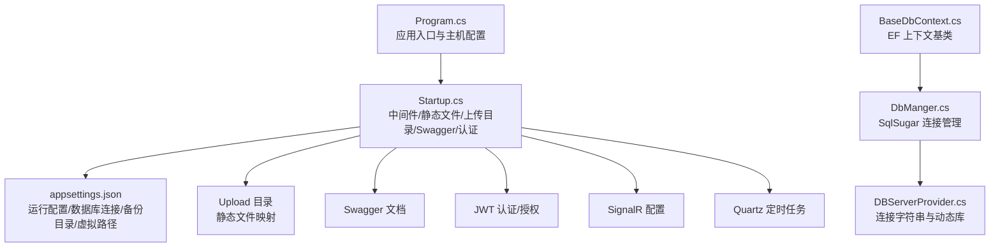
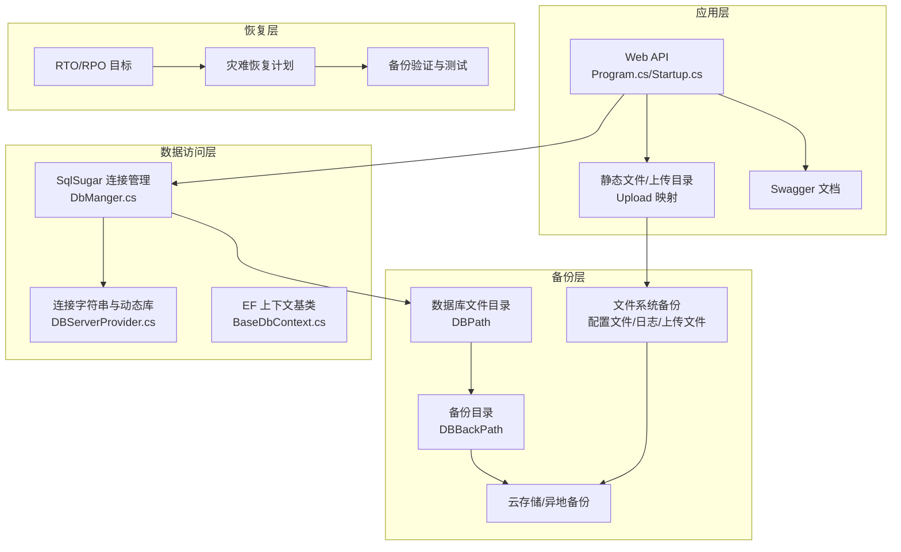
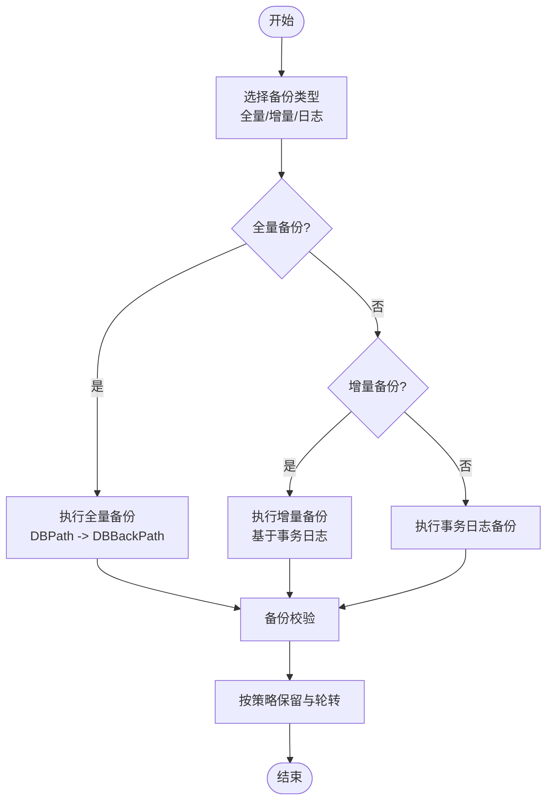
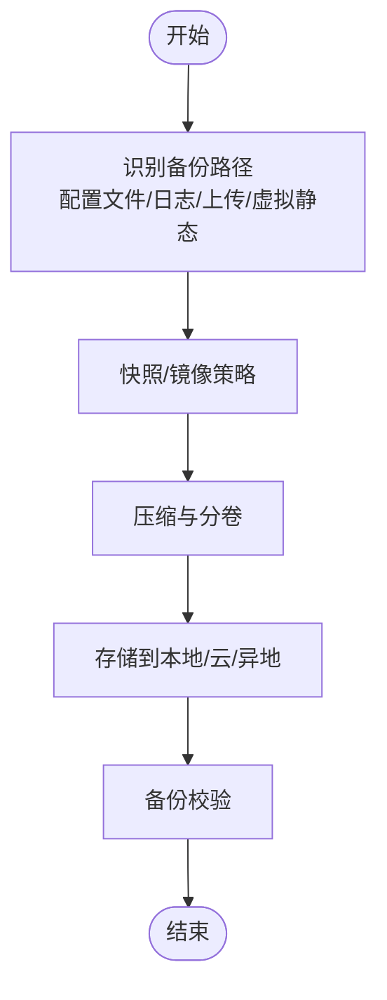
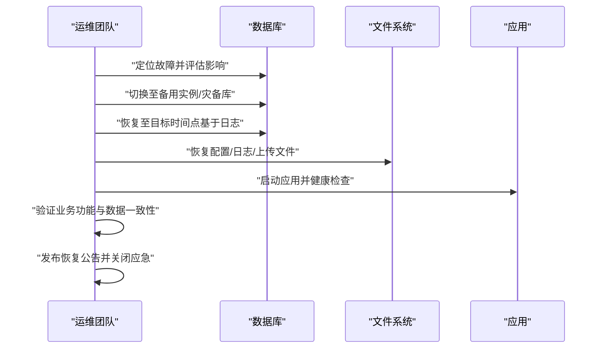
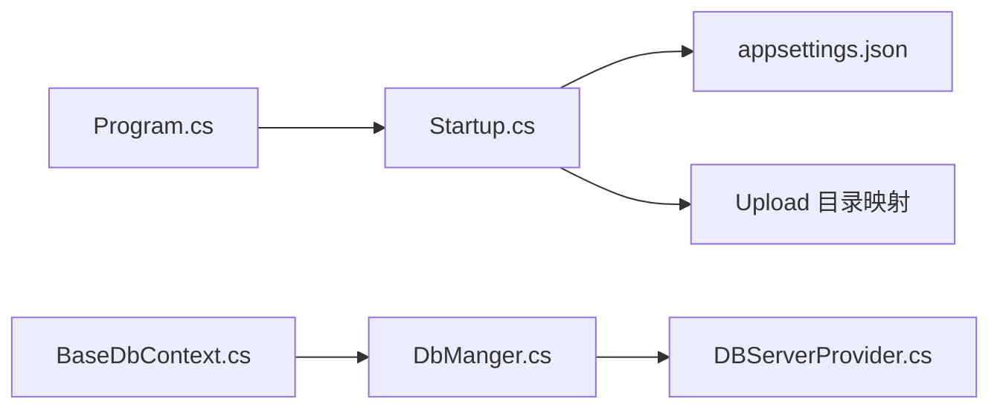

# 备份与恢复

<cite>
**本文引用的文件**
- [appsettings.json](file://VolPro.WebApi/appsettings.json)
- [Program.cs](file://VolPro.WebApi/Program.cs)
- [Startup.cs](file://VolPro.WebApi/Startup.cs)
- [DBServerProvider.cs](file://VolPro.Core/DbManager/DBServerProvider.cs)
- [DbManger.cs](file://VolPro.Core/DbSqlSugar/DbManger.cs)
- [BaseDbContext.cs](file://VolPro.Core/EFDbContext/BaseDbContext.cs)
- [dev_run.bat](file://VolPro.WebApi/dev_run.bat)
- [dev_run2.bat](file://VolPro.WebApi/dev_run2.bat)
- [tmp.bat](file://VolPro.WebApi/tmp.bat)
</cite>

## 目录
1. [引言](#引言)
2. [项目结构](#项目结构)
3. [核心组件](#核心组件)
4. [架构总览](#架构总览)
5. [详细组件分析](#详细组件分析)
6. [依赖关系分析](#依赖关系分析)
7. [性能考量](#性能考量)
8. [故障排查指南](#故障排查指南)
9. [结论](#结论)
10. [附录](#附录)

## 引言
本文件面向“水化热平台”的备份与恢复，围绕数据库与文件系统的备份策略、灾难恢复计划（RTO/RPO）、备份验证与测试、存储策略（本地/云/异地）、自动化脚本与监控告警、以及数据迁移与升级过程中的备份策略进行系统化文档化，帮助运维与开发团队建立可执行、可验证、可审计的备份体系。

## 项目结构
- 应用运行与配置
  - 程序入口与主机配置位于 Program.cs
  - 启动与中间件、静态文件、上传目录映射、Swagger、认证授权等在 Startup.cs 中集中配置
  - 运行时配置与数据库连接、备份目录、虚拟路径等在 appsettings.json 中定义
- 数据访问层
  - 基于 SqlSugar 的数据库连接管理集中在 DbManger.cs
  - 连接字符串来源与动态库选择在 DBServerProvider.cs
  - EF 上下文基类 BaseDbContext 提供统一抽象
- 文件系统
  - 上传文件目录 Upload 在启动时自动创建并映射为静态资源
  - 虚拟静态文件目录通过配置 VirtualPath 指定

图表来源
- [Program.cs:17-36](file://VolPro.WebApi/Program.cs#L17-L36)
- [Startup.cs:309-382](file://VolPro.WebApi/Startup.cs#L309-L382)
- [appsettings.json:10-139](file://VolPro.WebApi/appsettings.json#L10-L139)
- [DbManger.cs:21-158](file://VolPro.Core/DbSqlSugar/DbManger.cs#L21-L158)
- [DBServerProvider.cs:28-138](file://VolPro.Core/DbManager/DBServerProvider.cs#L28-L138)
- [BaseDbContext.cs:18-161](file://VolPro.Core/EFDbContext/BaseDbContext.cs#L18-L161)

章节来源
- [Program.cs:17-36](file://VolPro.WebApi/Program.cs#L17-L36)
- [Startup.cs:309-382](file://VolPro.WebApi/Startup.cs#L309-L382)
- [appsettings.json:10-139](file://VolPro.WebApi/appsettings.json#L10-L139)
- [DbManger.cs:21-158](file://VolPro.Core/DbSqlSugar/DbManger.cs#L21-L158)
- [DBServerProvider.cs:28-138](file://VolPro.Core/DbManager/DBServerProvider.cs#L28-L138)
- [BaseDbContext.cs:18-161](file://VolPro.Core/EFDbContext/BaseDbContext.cs#L18-L161)

## 核心组件
- 数据库连接与备份目录
  - 运行配置中包含数据库类型、连接字符串、Redis、SignalR、Kafka、邮件、定时任务等；其中 DBPath 与 DBBackPath 指向数据库文件目录与备份目录，为数据库备份提供基础路径
- 文件系统与上传目录
  - Startup.cs 在应用启动时检查并创建 Upload 目录，将其映射为静态文件服务，便于备份与恢复时统一处理
- 运行与部署
  - Program.cs 使用 Kestrel 监听固定端口，便于容器化与外部访问
  - 提供 dev_run.bat、dev_run2.bat、tmp.bat 等批处理脚本，可用于本地开发与快速启动

章节来源
- [appsettings.json:16-139](file://VolPro.WebApi/appsettings.json#L16-L139)
- [Startup.cs:330-350](file://VolPro.WebApi/Startup.cs#L330-L350)
- [Program.cs:24-36](file://VolPro.WebApi/Program.cs#L24-L36)
- [dev_run.bat](file://VolPro.WebApi/dev_run.bat)
- [dev_run2.bat](file://VolPro.WebApi/dev_run2.bat)
- [tmp.bat](file://VolPro.WebApi/tmp.bat)

## 架构总览
下图展示备份与恢复策略在系统中的位置与交互关系：应用层负责运行与静态文件服务；数据访问层负责数据库连接与持久化；备份层负责数据库与文件系统的定期/增量备份及归档；恢复层负责在故障场景下的数据回滚与系统重建。

图表来源
- [appsettings.json:134-135](file://VolPro.WebApi/appsettings.json#L134-L135)
- [DbManger.cs:26-56](file://VolPro.Core/DbSqlSugar/DbManger.cs#L26-L56)
- [DBServerProvider.cs:116-127](file://VolPro.Core/DbManager/DBServerProvider.cs#L116-L127)
- [Startup.cs:330-350](file://VolPro.WebApi/Startup.cs#L330-L350)

## 详细组件分析

### 数据库备份策略
- 全量备份
  - 建议在业务低峰期执行，备份系统库与业务库的完整数据与事务日志
  - 备份目标目录由配置项 DBBackPath 指定，建议与 DBPath 同盘或异地挂载
- 增量备份
  - 基于事务日志的增量备份，每日执行以降低备份窗口与存储占用
  - 增量备份需与全量备份周期配合，确保可恢复点合理
- 事务日志备份
  - 开启数据库事务日志备份，支持点-in-time 恢复
  - 建议定期清理过期日志，避免磁盘空间不足
- 备份保留与轮转
  - 建议采用“全量+近7天增量+月度全量+年度全量”的轮转策略
  - 所有备份完成后进行校验与元数据登记（备份时间、版本、校验和）

图表来源
- [appsettings.json:134-135](file://VolPro.WebApi/appsettings.json#L134-L135)
- [DbManger.cs:26-56](file://VolPro.Core/DbSqlSugar/DbManger.cs#L26-L56)
- [DBServerProvider.cs:116-127](file://VolPro.Core/DbManager/DBServerProvider.cs#L116-L127)

章节来源
- [appsettings.json:134-135](file://VolPro.WebApi/appsettings.json#L134-L135)
- [DbManger.cs:26-56](file://VolPro.Core/DbSqlSugar/DbManger.cs#L26-L56)
- [DBServerProvider.cs:116-127](file://VolPro.Core/DbManager/DBServerProvider.cs#L116-L127)

### 文件系统备份方案
- 配置文件
  - appsettings.json 与各环境配置文件属于关键配置，需纳入备份范围
- 日志文件
  - 应用日志与业务日志建议单独存放并纳入备份
- 上传文件
  - Upload 目录在启动时自动创建并映射为静态文件，需纳入备份
- 虚拟静态文件
  - VirtualPath 配置的静态文件目录也应纳入备份

图表来源
- [appsettings.json:10-13](file://VolPro.WebApi/appsettings.json#L10-L13)
- [Startup.cs:330-350](file://VolPro.WebApi/Startup.cs#L330-L350)

章节来源
- [appsettings.json:10-13](file://VolPro.WebApi/appsettings.json#L10-L13)
- [Startup.cs:330-350](file://VolPro.WebApi/Startup.cs#L330-L350)

### 灾难恢复计划（RTO/RPO）
- RTO（恢复时间目标）
  - 生产环境建议 RTO ≤ 4 小时；关键业务 ≤ 2 小时
- RPO（恢复点目标）
  - 生产环境建议 RPO ≤ 15 分钟；关键业务 ≤ 5 分钟
- 恢复流程
  - 确认故障级别与影响范围
  - 切换至备用节点或灾备中心
  - 恢复数据库：优先事务日志恢复至最近可接受时间点
  - 恢复文件系统：恢复配置、日志、上传文件
  - 启动应用并验证核心功能
  - 发布恢复公告并关闭应急响应

图表来源
- [appsettings.json:134-135](file://VolPro.WebApi/appsettings.json#L134-L135)
- [Startup.cs:330-350](file://VolPro.WebApi/Startup.cs#L330-L350)

章节来源
- [appsettings.json:134-135](file://VolPro.WebApi/appsettings.json#L134-L135)
- [Startup.cs:330-350](file://VolPro.WebApi/Startup.cs#L330-L350)

### 备份验证与测试程序
- 验证清单
  - 备份完整性：校验文件数量与大小
  - 备份可用性：定期执行还原演练（最小化环境）
  - 元数据核对：时间戳、版本、校验和
- 测试频率
  - 全量备份：每季度一次还原演练
  - 增量备份：每月一次还原演练
  - 事务日志：每次日志备份后进行小规模恢复测试
- 回归验证
  - 恢复后进行核心接口与报表验证
  - 核对关键业务指标（如数据条目数、关键字段值）

章节来源
- [appsettings.json:134-135](file://VolPro.WebApi/appsettings.json#L134-L135)
- [DbManger.cs:26-56](file://VolPro.Core/DbSqlSugar/DbManger.cs#L26-L56)

### 备份存储策略（本地/云/异地）
- 本地存储
  - 用于快速恢复与短期保留，建议 RAID 或 NAS
- 云存储
  - 使用对象存储（如 OSS/COS/OBS），支持版本控制与生命周期管理
- 异地备份
  - 跨地域/跨机房同步，满足 RTO/RPO 与法规要求
- 存储安全
  - 加密传输与静态加密
  - 访问控制与审计日志

章节来源
- [appsettings.json:134-135](file://VolPro.WebApi/appsettings.json#L134-L135)

### 自动化备份脚本与监控告警
- 自动化脚本
  - 数据库：全量/增量/日志备份脚本，结合调度工具（Windows 任务计划/Unix Cron）
  - 文件系统：rsync/robocopy/Veeam 等工具执行增量与全量
  - 归档与清理：按策略删除过期备份
- 监控与告警
  - 备份成功率、耗时、失败重试次数
  - 存储容量与日志空间预警
  - 恢复演练结果与回归测试通过率

章节来源
- [appsettings.json:134-135](file://VolPro.WebApi/appsettings.json#L134-L135)

### 数据迁移与升级过程中的备份策略
- 升级前
  - 执行一次全量备份与一次事务日志备份
  - 备份配置文件与上传文件
- 升级中
  - 保持数据库只读或短暂停机窗口
  - 仅迁移必要对象，保留旧版本回滚包
- 升级后
  - 执行恢复演练与核心功能回归
  - 清理旧版本备份与临时文件

章节来源
- [appsettings.json:134-135](file://VolPro.WebApi/appsettings.json#L134-L135)
- [Startup.cs:330-350](file://VolPro.WebApi/Startup.cs#L330-L350)

## 依赖关系分析
- 应用层依赖
  - Program.cs 与 Startup.cs 决定运行时行为与静态资源映射
  - appsettings.json 提供数据库与文件系统路径等关键配置
- 数据访问层依赖
  - DbManger.cs 依赖 DBServerProvider.cs 提供的连接字符串与动态库选择
  - BaseDbContext.cs 作为 EF 抽象基类，间接参与数据持久化

图表来源
- [Program.cs:17-36](file://VolPro.WebApi/Program.cs#L17-L36)
- [Startup.cs:309-382](file://VolPro.WebApi/Startup.cs#L309-L382)
- [appsettings.json:10-139](file://VolPro.WebApi/appsettings.json#L10-L139)
- [DbManger.cs:21-158](file://VolPro.Core/DbSqlSugar/DbManger.cs#L21-L158)
- [DBServerProvider.cs:28-138](file://VolPro.Core/DbManager/DBServerProvider.cs#L28-L138)
- [BaseDbContext.cs:18-161](file://VolPro.Core/EFDbContext/BaseDbContext.cs#L18-L161)

章节来源
- [Program.cs:17-36](file://VolPro.WebApi/Program.cs#L17-L36)
- [Startup.cs:309-382](file://VolPro.WebApi/Startup.cs#L309-L382)
- [appsettings.json:10-139](file://VolPro.WebApi/appsettings.json#L10-L139)
- [DbManger.cs:21-158](file://VolPro.Core/DbSqlSugar/DbManger.cs#L21-L158)
- [DBServerProvider.cs:28-138](file://VolPro.Core/DbManager/DBServerProvider.cs#L28-L138)
- [BaseDbContext.cs:18-161](file://VolPro.Core/EFDbContext/BaseDbContext.cs#L18-L161)

## 性能考量
- 备份窗口与业务影响
  - 全量备份安排在业务低峰期；增量与日志备份尽量减少对在线业务的影响
- 存储与网络
  - 本地与异地备份的吞吐与延迟差异，需提前压测
- 并发与锁
  - 备份期间避免长事务与热点表写入
- 压缩与去重
  - 启用压缩与重复数据删除，降低存储成本与传输时间

## 故障排查指南
- 备份失败
  - 检查 DBBackPath 权限与磁盘空间
  - 校验连接字符串与数据库可达性
  - 查看应用日志与备份日志
- 恢复异常
  - 确认目标时间点的日志链完整
  - 核对文件系统权限与路径映射
- 启动问题
  - 确认 Upload 目录存在且可读写
  - 检查 Kestrel 端口占用与防火墙规则

章节来源
- [appsettings.json:134-135](file://VolPro.WebApi/appsettings.json#L134-L135)
- [Startup.cs:330-350](file://VolPro.WebApi/Startup.cs#L330-L350)
- [Program.cs:24-36](file://VolPro.WebApi/Program.cs#L24-L36)

## 结论
通过明确的数据库与文件系统备份策略、严格的 RTO/RPO 目标、完善的验证与测试流程、合理的存储与自动化手段，以及针对升级与迁移的专项备份，水化热平台可在发生故障时快速恢复业务，保障数据安全与连续性。

## 附录
- 关键配置项
  - DBPath：数据库文件目录
  - DBBackPath：数据库备份目录
  - VirtualPath：虚拟静态文件目录
  - Upload：上传文件目录（启动时自动创建）
- 启动与运行
  - Program.cs 使用 Kestrel 监听固定端口
  - 提供 dev_run.bat、dev_run2.bat、tmp.bat 用于本地开发与启动

章节来源
- [appsettings.json:134-135](file://VolPro.WebApi/appsettings.json#L134-L135)
- [Startup.cs:330-350](file://VolPro.WebApi/Startup.cs#L330-L350)
- [Program.cs:24-36](file://VolPro.WebApi/Program.cs#L24-L36)
- [dev_run.bat](file://VolPro.WebApi/dev_run.bat)
- [dev_run2.bat](file://VolPro.WebApi/dev_run2.bat)
- [tmp.bat](file://VolPro.WebApi/tmp.bat)