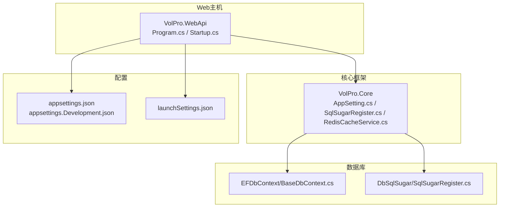
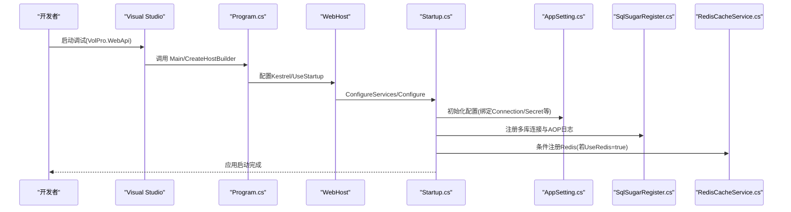
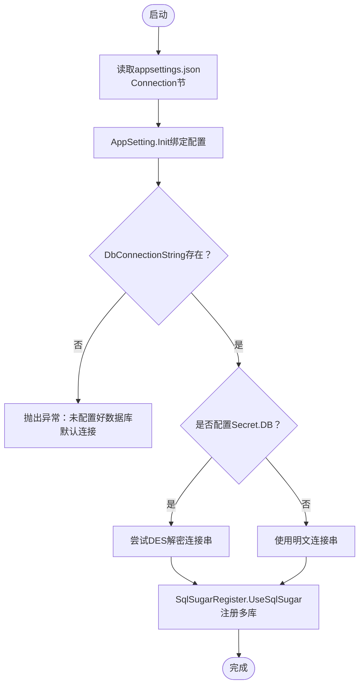
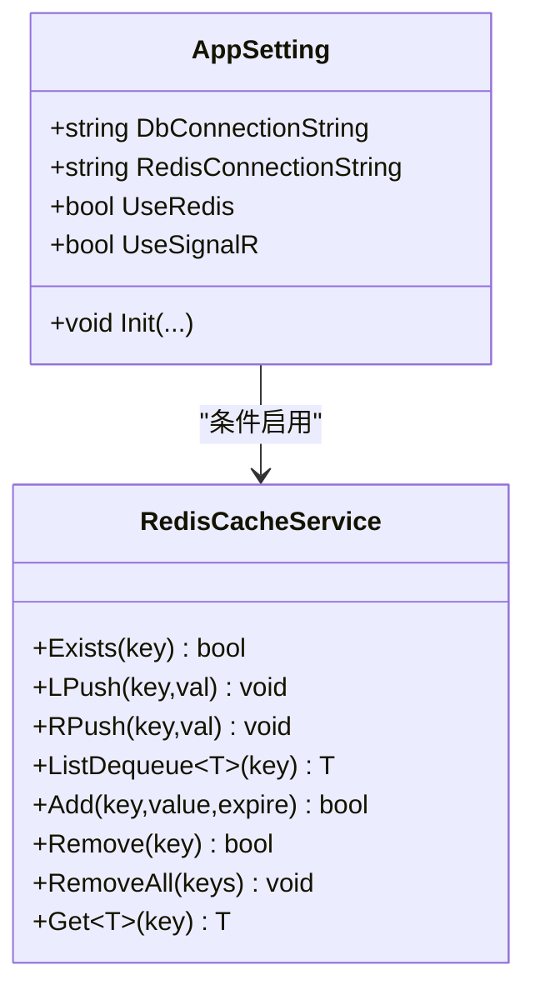
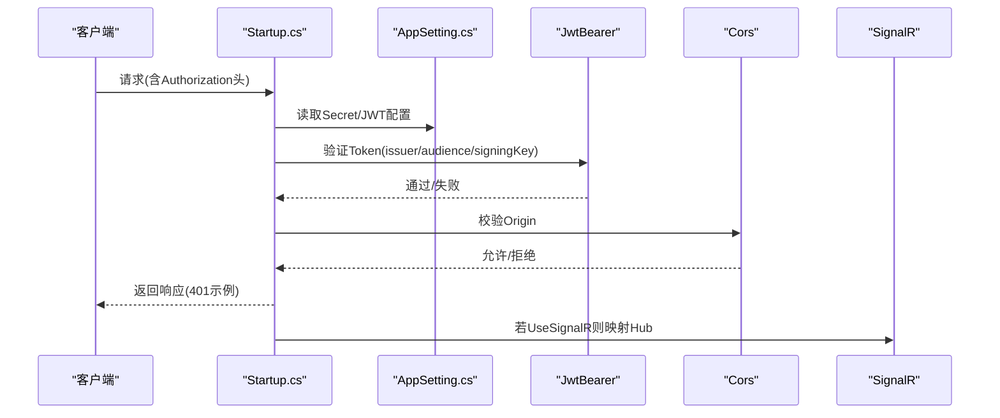
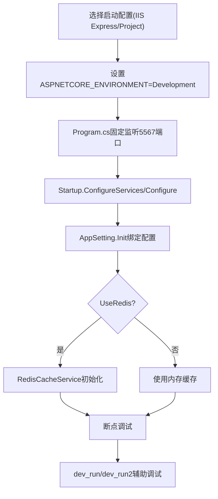
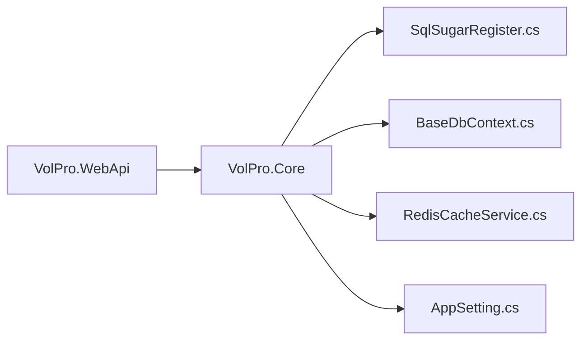

# 开发环境搭建

<cite>
**本文引用的文件**   
- [VolPro.WebApi/appsettings.json](file://VolPro.WebApi/appsettings.json)
- [VolPro.WebApi/appsettings.Development.json](file://VolPro.WebApi/appsettings.Development.json)
- [VolPro.WebApi/Program.cs](file://VolPro.WebApi/Program.cs)
- [VolPro.WebApi/Startup.cs](file://VolPro.WebApi/Startup.cs)
- [VolPro.WebApi/Properties/launchSettings.json](file://VolPro.WebApi/Properties/launchSettings.json)
- [VolPro.Core/Configuration/AppSetting.cs](file://VolPro.Core/Configuration/AppSetting.cs)
- [VolPro.Core/Const/Secret.cs](file://VolPro.Core/Const/Secret.cs)
- [VolPro.Core/DbSqlSugar/SqlSugarRegister.cs](file://VolPro.Core/DbSqlSugar/SqlSugarRegister.cs)
- [VolPro.Core/EFDbContext/BaseDbContext.cs](file://VolPro.Core/EFDbContext/BaseDbContext.cs)
- [VolPro.Core/CacheManager/Service/RedisCacheService.cs](file://VolPro.Core/CacheManager/Service/RedisCacheService.cs)
- [VolPro.WebApi/dev_run.bat](file://VolPro.WebApi/dev_run.bat)
- [VolPro.WebApi/dev_run2.bat](file://VolPro.WebApi/dev_run2.bat)
</cite>

## 目录
1. [简介](#简介)
2. [项目结构](#项目结构)
3. [核心组件](#核心组件)
4. [架构总览](#架构总览)
5. [详细组件分析](#详细组件分析)
6. [依赖关系分析](#依赖关系分析)
7. [性能注意事项](#性能注意事项)
8. [故障排除指南](#故障排除指南)
9. [结论](#结论)
10. [附录](#附录)

## 简介
本指南面向“水化热平台”项目的开发者，提供从零搭建开发环境的完整步骤，涵盖以下方面：
- .NET 8.0 SDK 安装与验证
- Visual Studio 配置建议
- 数据库环境准备（SQL Server 与 MySQL 的安装与配置要点）
- 环境变量与配置文件说明（连接字符串、JWT 密钥、Redis、跨域等）
- 本地调试配置（launchSettings.json、Program.cs、断点调试技巧）
- Git 工作流与分支管理建议
- 常见开发工具（Postman、SQL Server Management Studio）配置
- 常见问题排查与解决方案

## 项目结构
该仓库采用多项目解决方案组织，Web API 主机位于 VolPro.WebApi，核心能力集中在 VolPro.Core，业务实体与仓储服务分布在各子模块中。关键运行时配置集中在 appsettings.json 与 appsettings.Development.json，启动入口在 Program.cs，管道与中间件在 Startup.cs 中配置。

图表来源
- [VolPro.WebApi/Program.cs:1-39](file://VolPro.WebApi/Program.cs#L1-L39)
- [VolPro.WebApi/Startup.cs:1-407](file://VolPro.WebApi/Startup.cs#L1-L407)
- [VolPro.Core/Configuration/AppSetting.cs:1-237](file://VolPro.Core/Configuration/AppSetting.cs#L1-L237)
- [VolPro.Core/DbSqlSugar/SqlSugarRegister.cs:1-155](file://VolPro.Core/DbSqlSugar/SqlSugarRegister.cs#L1-L155)
- [VolPro.Core/EFDbContext/BaseDbContext.cs:1-161](file://VolPro.Core/EFDbContext/BaseDbContext.cs#L1-L161)

章节来源
- [VolPro.WebApi/Program.cs:1-39](file://VolPro.WebApi/Program.cs#L1-L39)
- [VolPro.WebApi/Startup.cs:1-407](file://VolPro.WebApi/Startup.cs#L1-L407)
- [VolPro.Core/Configuration/AppSetting.cs:1-237](file://VolPro.Core/Configuration/AppSetting.cs#L1-L237)

## 核心组件
- 配置中心 AppSetting：负责从 appsettings.json 绑定 Connection、Secret、CreateMember、ModifyMember、GlobalFilter、Kafka 等配置，并提供运行时访问入口；支持 DES 解密数据库与 Redis 连接串。
- 数据库层：SqlSugarRegister 注册多库连接（默认、业务库、空库），统一 AOP 日志输出；EFDbContext/BaseDbContext 提供基于 SqlSugar 的仓储与保存队列能力。
- 缓存层：RedisCacheService 基于 CSRedis/StackExchange.Redis 实现常用缓存操作；可通过 UseRedis 控制是否启用。
- 启动与中间件：Program.cs 指定 Kestrel 监听端口与 Autofac 容器工厂；Startup.cs 配置认证（JWT）、跨域、Swagger、SignalR、静态文件、异常处理等。

章节来源
- [VolPro.Core/Configuration/AppSetting.cs:85-163](file://VolPro.Core/Configuration/AppSetting.cs#L85-L163)
- [VolPro.Core/DbSqlSugar/SqlSugarRegister.cs:76-131](file://VolPro.Core/DbSqlSugar/SqlSugarRegister.cs#L76-L131)
- [VolPro.Core/CacheManager/Service/RedisCacheService.cs:1-120](file://VolPro.Core/CacheManager/Service/RedisCacheService.cs#L1-L120)
- [VolPro.WebApi/Program.cs:24-36](file://VolPro.WebApi/Program.cs#L24-L36)
- [VolPro.WebApi/Startup.cs:60-213](file://VolPro.WebApi/Startup.cs#L60-L213)

## 架构总览
下图展示开发环境启动到请求处理的关键流程，以及配置与数据库交互路径。

图表来源
- [VolPro.WebApi/Program.cs:17-36](file://VolPro.WebApi/Program.cs#L17-L36)
- [VolPro.WebApi/Startup.cs:60-213](file://VolPro.WebApi/Startup.cs#L60-L213)
- [VolPro.Core/Configuration/AppSetting.cs:85-163](file://VolPro.Core/Configuration/AppSetting.cs#L85-L163)
- [VolPro.Core/DbSqlSugar/SqlSugarRegister.cs:76-131](file://VolPro.Core/DbSqlSugar/SqlSugarRegister.cs#L76-L131)
- [VolPro.Core/CacheManager/Service/RedisCacheService.cs:14-18](file://VolPro.Core/CacheManager/Service/RedisCacheService.cs#L14-L18)

## 详细组件分析

### 数据库环境设置（SQL Server 与 MySQL）
- 连接字符串配置
  - 默认使用 SQL Server：在 appsettings.json 中的 Connection.DBType 为 MsSql，DbConnectionString 指向系统库，ServiceDbContext 指向业务库。
  - MySQL 示例已在配置中以注释形式给出，可按需启用。
- 运行时解析
  - AppSetting.Init 在启动时绑定 Connection 并校验 DbConnectionString 是否存在；若配置了 Secret.DB，还会尝试对连接串进行 DES 解密。
  - SqlSugarRegister.UseSqlSugar 注册多库连接（默认、业务库、空库），并为每个连接配置 AOP 日志。
- EF 兼容性
  - BaseDbContext 提供基于 SqlSugar 的仓储能力；EF 相关代码在当前版本中主要作为兼容层存在，实际 ORM 使用 SqlSugar。

图表来源
- [VolPro.Core/Configuration/AppSetting.cs:85-163](file://VolPro.Core/Configuration/AppSetting.cs#L85-L163)
- [VolPro.Core/DbSqlSugar/SqlSugarRegister.cs:76-131](file://VolPro.Core/DbSqlSugar/SqlSugarRegister.cs#L76-L131)

章节来源
- [VolPro.WebApi/appsettings.json:16-57](file://VolPro.WebApi/appsettings.json#L16-L57)
- [VolPro.Core/Configuration/AppSetting.cs:144-163](file://VolPro.Core/Configuration/AppSetting.cs#L144-L163)
- [VolPro.Core/DbSqlSugar/SqlSugarRegister.cs:76-131](file://VolPro.Core/DbSqlSugar/SqlSugarRegister.cs#L76-L131)
- [VolPro.Core/EFDbContext/BaseDbContext.cs:45-73](file://VolPro.Core/EFDbContext/BaseDbContext.cs#L45-L73)

### 环境变量与配置文件
- 关键配置项
  - Connection：DBType、DbConnectionString、ServiceDbContext、RedisConnectionString、UseRedis、UseSignalR
  - Secret：JWT、Audience、Issuer、User、DB、Redis
  - CorsUrls：允许跨域的前端地址列表
  - ExpMinutes：JWT 有效期（分钟）
  - Kafka：生产者/消费者开关与连接参数
- 启动配置
  - launchSettings.json 指定 IIS Express 与 Project 两种启动方式，均设置 ASPNETCORE_ENVIRONMENT=Development。
  - Program.cs 固定 Kestrel 监听地址为 http://*:5567，便于前后端联调。

章节来源
- [VolPro.WebApi/appsettings.json:16-110](file://VolPro.WebApi/appsettings.json#L16-L110)
- [VolPro.Core/Const/Secret.cs:6-35](file://VolPro.Core/Const/Secret.cs#L6-L35)
- [VolPro.WebApi/Properties/launchSettings.json:18-25](file://VolPro.WebApi/Properties/launchSettings.json#L18-L25)
- [VolPro.WebApi/Program.cs:33-34](file://VolPro.WebApi/Program.cs#L33-L34)

### 缓存与 Redis
- 启用控制
  - 当 appsettings.json 中 Connection.UseRedis 为 true 时，应用启动时会初始化 RedisCacheService。
- 连接串
  - RedisConnectionString 支持 DES 解密（若配置了 Secret.Redis）。
- 常用操作
  - 支持键存在性检查、入队/出队、增删改查、批量删除等。

图表来源
- [VolPro.Core/Configuration/AppSetting.cs:17-34](file://VolPro.Core/Configuration/AppSetting.cs#L17-L34)
- [VolPro.Core/CacheManager/Service/RedisCacheService.cs:12-118](file://VolPro.Core/CacheManager/Service/RedisCacheService.cs#L12-L118)

章节来源
- [VolPro.WebApi/appsettings.json:54-56](file://VolPro.WebApi/appsettings.json#L54-L56)
- [VolPro.Core/Configuration/AppSetting.cs:27-30](file://VolPro.Core/Configuration/AppSetting.cs#L27-L30)
- [VolPro.Core/CacheManager/Service/RedisCacheService.cs:14-18](file://VolPro.Core/CacheManager/Service/RedisCacheService.cs#L14-L18)

### 认证与跨域（JWT、CORS、SignalR）
- JWT
  - Startup.cs 中配置 AddJwtBearer，使用 AppSetting.Secret 中的 Issuer、Audience、JWT 密钥进行签名校验；未通过时返回 401。
- CORS
  - 从配置读取 CorsUrls，设置默认 Policy 允许任意 Origin/Header/Method。
- SignalR
  - 若 UseSignalR=true，则在路由中映射消息 Hub，并按 CorsUrls 动态允许来源。

图表来源
- [VolPro.WebApi/Startup.cs:84-130](file://VolPro.WebApi/Startup.cs#L84-L130)
- [VolPro.WebApi/Startup.cs:366-382](file://VolPro.WebApi/Startup.cs#L366-L382)
- [VolPro.Core/Configuration/AppSetting.cs:85-108](file://VolPro.Core/Configuration/AppSetting.cs#L85-L108)

章节来源
- [VolPro.WebApi/Startup.cs:84-130](file://VolPro.WebApi/Startup.cs#L84-L130)
- [VolPro.WebApi/Startup.cs:366-382](file://VolPro.WebApi/Startup.cs#L366-L382)
- [VolPro.Core/Configuration/AppSetting.cs:85-108](file://VolPro.Core/Configuration/AppSetting.cs#L85-L108)

### 本地调试配置（launchSettings.json 与断点技巧）
- 启动配置
  - IIS Express 与 Project 两种模式，均设置 ASPNETCORE_ENVIRONMENT=Development。
  - Program.cs 固定 Kestrel 监听 http://*:5567，便于前端访问。
- 断点调试建议
  - 在 Startup.ConfigureServices/Configure 中设置断点，观察配置绑定与中间件注册。
  - 在 AppSetting.Init 中断点，确认连接串与密钥解密是否正确。
  - 在 SqlSugarRegister.UseSqlSugar 中断点，验证多库连接与 AOP 日志是否生效。
  - 在 RedisCacheService 构造函数断点，确认 Redis 初始化成功。
- 快速启动脚本
  - dev_run.bat：使用 dotnet watch --no-hot-reload，异常时输出日志文件。
  - dev_run2.bat：使用 dotnet watch run --framework net8.0。

图表来源
- [VolPro.WebApi/Properties/launchSettings.json:18-25](file://VolPro.WebApi/Properties/launchSettings.json#L18-L25)
- [VolPro.WebApi/Program.cs:33-34](file://VolPro.WebApi/Program.cs#L33-L34)
- [VolPro.WebApi/Startup.cs:60-213](file://VolPro.WebApi/Startup.cs#L60-L213)
- [VolPro.Core/Configuration/AppSetting.cs:85-163](file://VolPro.Core/Configuration/AppSetting.cs#L85-L163)
- [VolPro.Core/CacheManager/Service/RedisCacheService.cs:14-18](file://VolPro.Core/CacheManager/Service/RedisCacheService.cs#L14-L18)
- [VolPro.WebApi/dev_run.bat:1-20](file://VolPro.WebApi/dev_run.bat#L1-L20)
- [VolPro.WebApi/dev_run2.bat:1-3](file://VolPro.WebApi/dev_run2.bat#L1-L3)

章节来源
- [VolPro.WebApi/Properties/launchSettings.json:18-25](file://VolPro.WebApi/Properties/launchSettings.json#L18-L25)
- [VolPro.WebApi/Program.cs:33-34](file://VolPro.WebApi/Program.cs#L33-L34)
- [VolPro.WebApi/dev_run.bat:1-20](file://VolPro.WebApi/dev_run.bat#L1-L20)
- [VolPro.WebApi/dev_run2.bat:1-3](file://VolPro.WebApi/dev_run2.bat#L1-L3)

### Git 工作流与分支管理建议
- 分支策略
  - main/master：稳定发布分支
  - develop：日常开发分支
  - feature/<name>：新功能开发
  - hotfix/<name>：紧急修复
- 提交规范
  - 类型：feat、fix、docs、style、refactor、test、chore
  - 示例：feat(core): 添加配置中心初始化逻辑
- 合并与审查
  - Pull Request 合并前进行代码审查与单元测试
  - 合并后打 Tag 并更新 Changelog

（本节为通用实践建议，不直接分析具体文件）

## 依赖关系分析
- 组件耦合
  - WebApi 依赖 Core 的配置与数据库/缓存能力
  - Core 通过 AppSetting 统一读取配置，避免硬编码
  - SqlSugarRegister 与 EFDbContext/BaseDbContext 协作，提供 ORM 能力
- 外部依赖
  - SqlSugar、CSRedis/StackExchange.Redis、Autofac、Swagger、SignalR、JWT

图表来源
- [VolPro.WebApi/Startup.cs:60-213](file://VolPro.WebApi/Startup.cs#L60-L213)
- [VolPro.Core/DbSqlSugar/SqlSugarRegister.cs:76-131](file://VolPro.Core/DbSqlSugar/SqlSugarRegister.cs#L76-L131)
- [VolPro.Core/EFDbContext/BaseDbContext.cs:22-40](file://VolPro.Core/EFDbContext/BaseDbContext.cs#L22-L40)
- [VolPro.Core/CacheManager/Service/RedisCacheService.cs:14-18](file://VolPro.Core/CacheManager/Service/RedisCacheService.cs#L14-L18)
- [VolPro.Core/Configuration/AppSetting.cs:85-163](file://VolPro.Core/Configuration/AppSetting.cs#L85-L163)

章节来源
- [VolPro.WebApi/Startup.cs:60-213](file://VolPro.WebApi/Startup.cs#L60-L213)
- [VolPro.Core/DbSqlSugar/SqlSugarRegister.cs:76-131](file://VolPro.Core/DbSqlSugar/SqlSugarRegister.cs#L76-L131)
- [VolPro.Core/EFDbContext/BaseDbContext.cs:22-40](file://VolPro.Core/EFDbContext/BaseDbContext.cs#L22-L40)
- [VolPro.Core/CacheManager/Service/RedisCacheService.cs:14-18](file://VolPro.Core/CacheManager/Service/RedisCacheService.cs#L14-L18)
- [VolPro.Core/Configuration/AppSetting.cs:85-163](file://VolPro.Core/Configuration/AppSetting.cs#L85-L163)

## 性能注意事项
- 数据库日志
  - SqlSugar AOP OnLogExecuting 输出 SQL，便于定位慢查询；生产环境建议关闭或降级日志级别。
- 缓存策略
  - Redis 启用时优先使用；合理设置过期时间与序列化策略。
- 文件上传与请求体大小
  - Program.cs 中已限制最大请求体大小；如需更大文件上传，可在 Startup 或配置中调整。
- 跨域与 SignalR
  - CORS 配置为宽松策略，生产环境建议明确允许来源与方法。

（本节为通用指导，不直接分析具体文件）

## 故障排除指南
- 启动失败：未配置数据库连接
  - 现象：启动即抛出“未配置好数据库默认连接”
  - 排查：检查 appsettings.json 中 Connection.DbConnectionString 是否存在；若使用 Secret.DB，确认 DES 解密密钥正确
  - 参考
    - [VolPro.Core/Configuration/AppSetting.cs:144-147](file://VolPro.Core/Configuration/AppSetting.cs#L144-L147)
    - [VolPro.WebApi/appsettings.json:19-25](file://VolPro.WebApi/appsettings.json#L19-L25)
- JWT 401
  - 现象：接口返回 401 未授权
  - 排查：核对 Authorization 头格式（Bearer token）、Issuer/Audience/SigningKey 与 appsettings.json 一致
  - 参考
    - [VolPro.WebApi/Startup.cs:84-114](file://VolPro.WebApi/Startup.cs#L84-L114)
    - [VolPro.Core/Const/Secret.cs:27-28](file://VolPro.Core/Const/Secret.cs#L27-L28)
- Redis 连接失败
  - 现象：缓存相关功能异常
  - 排查：确认 RedisConnectionString 正确；若使用 Secret.Redis，确认 DES 解密密钥；检查 UseRedis=true
  - 参考
    - [VolPro.WebApi/appsettings.json:54-56](file://VolPro.WebApi/appsettings.json#L54-L56)
    - [VolPro.Core/CacheManager/Service/RedisCacheService.cs:14-18](file://VolPro.Core/CacheManager/Service/RedisCacheService.cs#L14-L18)
- 跨域问题
  - 现象：前端无法访问后端接口
  - 排查：确认 CorsUrls 包含前端地址；检查 Startup 中 AddCors 与 UseCors 的配置
  - 参考
    - [VolPro.WebApi/appsettings.json:67](file://VolPro.WebApi/appsettings.json#L67)
    - [VolPro.WebApi/Startup.cs:116-130](file://VolPro.WebApi/Startup.cs#L116-L130)
- SignalR 无法连接
  - 现象：消息推送失败
  - 排查：确认 UseSignalR=true；检查 CorsUrls 中包含 SignalR 前端地址；核对 MapHub 路径
  - 参考
    - [VolPro.WebApi/appsettings.json:56](file://VolPro.WebApi/appsettings.json#L56)
    - [VolPro.WebApi/Startup.cs:366-382](file://VolPro.WebApi/Startup.cs#L366-L382)
- 开发调试卡顿
  - 建议：使用 dev_run2.bat（run）替代 dev_run.bat（watch+no-hot-reload）以减少热重载开销；必要时在 Startup 中降低日志级别

章节来源
- [VolPro.Core/Configuration/AppSetting.cs:144-147](file://VolPro.Core/Configuration/AppSetting.cs#L144-L147)
- [VolPro.WebApi/Startup.cs:84-114](file://VolPro.WebApi/Startup.cs#L84-L114)
- [VolPro.Core/Const/Secret.cs:27-28](file://VolPro.Core/Const/Secret.cs#L27-L28)
- [VolPro.WebApi/appsettings.json:54-56](file://VolPro.WebApi/appsettings.json#L54-L56)
- [VolPro.Core/CacheManager/Service/RedisCacheService.cs:14-18](file://VolPro.Core/CacheManager/Service/RedisCacheService.cs#L14-L18)
- [VolPro.WebApi/appsettings.json:67](file://VolPro.WebApi/appsettings.json#L67)
- [VolPro.WebApi/Startup.cs:116-130](file://VolPro.WebApi/Startup.cs#L116-L130)
- [VolPro.WebApi/appsettings.json:56](file://VolPro.WebApi/appsettings.json#L56)
- [VolPro.WebApi/Startup.cs:366-382](file://VolPro.WebApi/Startup.cs#L366-L382)
- [VolPro.WebApi/dev_run.bat:1-20](file://VolPro.WebApi/dev_run.bat#L1-L20)
- [VolPro.WebApi/dev_run2.bat:1-3](file://VolPro.WebApi/dev_run2.bat#L1-L3)

## 结论
通过本指南，您可以在本地快速搭建“水化热平台”的开发环境：安装 .NET 8.0 SDK，准备 SQL Server 或 MySQL 数据库，配置 appsettings.json 中的连接串与密钥，使用 launchSettings.json 与 Program.cs 的端口设置进行调试，并结合 dev_run/dev_run2 脚本提升开发效率。遇到问题时，可依据故障排除章节逐项排查配置与运行时状态。

## 附录
- 常用开发工具
  - Postman：导入 Swagger 文档（/swagger/v1 或 /swagger/v2）进行接口测试；设置 Authorization 为 Bearer Token
  - SQL Server Management Studio：连接 appsettings.json 中的数据库实例，执行建库、建表与数据初始化脚本
- 版本与工具链
  - .NET SDK：8.0.x
  - IDE：Visual Studio 2022（推荐）
  - 数据库：SQL Server 2016+ 或 MySQL 8.0+

（本节为通用指导，不直接分析具体文件）