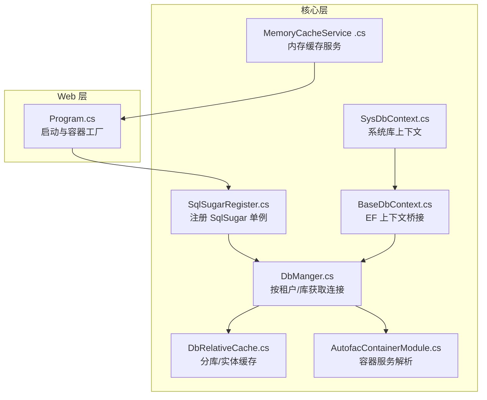
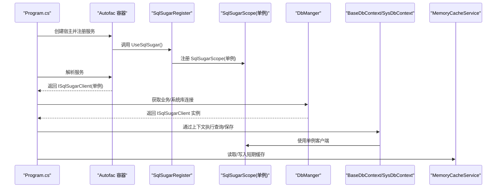
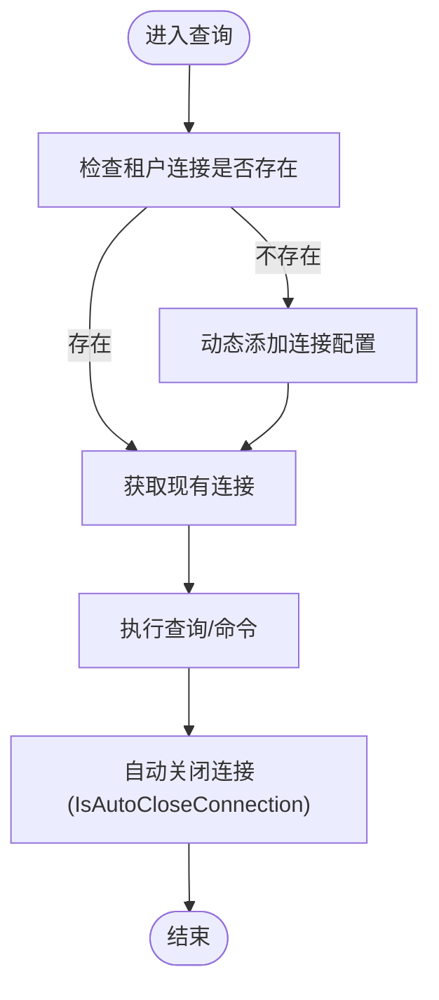
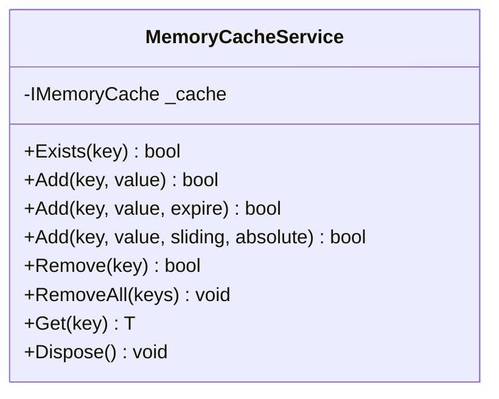
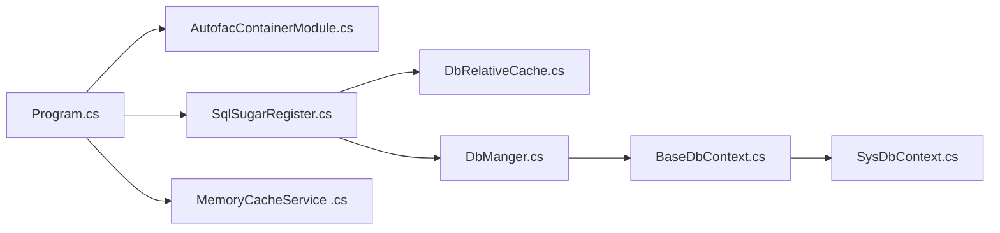

# 内存使用优化

<cite>
**本文引用的文件**   
- [VolPro.Core/DbSqlSugar/DbManger.cs](file://VolPro.Core/DbSqlSugar/DbManger.cs)
- [VolPro.Core/DbSqlSugar/SqlSugarRegister.cs](file://VolPro.Core/DbSqlSugar/SqlSugarRegister.cs)
- [VolPro.Core/EFDbContext/BaseDbContext.cs](file://VolPro.Core/EFDbContext/BaseDbContext.cs)
- [VolPro.Core/EFDbContext/SysDbContext.cs](file://VolPro.Core/EFDbContext/SysDbContext.cs)
- [VolPro.Core/CacheManager/Service/MemoryCacheService .cs](file://VolPro.Core/CacheManager/Service/MemoryCacheService .cs)
- [VolPro.Core/DbManager/DbRelativeCache.cs](file://VolPro.Core/DbManager/DbRelativeCache.cs)
- [VolPro.Core/Extensions/AutofacManager/AutofacContainerModule.cs](file://VolPro.Core/Extensions/AutofacManager/AutofacContainerModule.cs)
- [VolPro.WebApi/Program.cs](file://VolPro.WebApi/Program.cs)
</cite>

## 目录
1. [引言](#引言)
2. [项目结构](#项目结构)
3. [核心组件](#核心组件)
4. [架构总览](#架构总览)
5. [详细组件分析](#详细组件分析)
6. [依赖关系分析](#依赖关系分析)
7. [性能考量](#性能考量)
8. [故障排查指南](#故障排查指南)
9. [结论](#结论)
10. [附录](#附录)

## 引言
本指南面向“水化热平台”的内存使用优化，聚焦于以下目标：
- 垃圾回收调优策略：大对象堆管理、GC 模式选择建议
- 内存泄漏检测与预防：弱引用使用、资源释放最佳实践
- 对象池与缓存池：减少频繁对象分配
- 大数据集处理：流式处理与分页查询
- 内存监控与性能指标分析
- 内存密集型操作的替代方案与优化建议

本指南结合代码库中的数据库访问层、缓存层、依赖注入容器与运行时配置，给出可落地的优化建议。

## 项目结构
围绕内存优化的关键模块与职责如下：
- 数据库访问层：统一通过 SqlSugar 管理多租户/多库连接，支持自动关闭连接与日志钩子
- 缓存层：基于内存缓存的缓存服务，支持滑动过期与绝对过期
- 依赖注入与生命周期：Autofac 容器注册，SqlSugar 作为单例注入
- 运行时配置：最大请求体大小等服务器级限制

**图表来源**
- [VolPro.WebApi/Program.cs:1-39](file://VolPro.WebApi/Program.cs#L1-L39)
- [VolPro.Core/DbSqlSugar/SqlSugarRegister.cs:76-131](file://VolPro.Core/DbSqlugar/SqlSugarRegister.cs#L76-L131)
- [VolPro.Core/DbSqlSugar/DbManger.cs:21-159](file://VolPro.Core/DbSqlugar/DbManger.cs#L21-L159)
- [VolPro.Core/EFDbContext/BaseDbContext.cs:18-40](file://VolPro.Core/EFDbContext/BaseDbContext.cs#L18-L40)
- [VolPro.Core/EFDbContext/SysDbContext.cs:13-19](file://VolPro.Core/EFDbContext/SysDbContext.cs#L13-L19)
- [VolPro.Core/CacheManager/Service/MemoryCacheService .cs:9-190](file://VolPro.Core/CacheManager/Service/MemoryCacheService .cs#L9-L190)
- [VolPro.Core/DbManager/DbRelativeCache.cs:14-162](file://VolPro.Core/DbManager/DbRelativeCache.cs#L14-L162)
- [VolPro.Core/Extensions/AutofacManager/AutofacContainerModule.cs:7-15](file://VolPro.Core/Extensions/AutofacManager/AutofacContainerModule.cs#L7-L15)

**章节来源**
- [VolPro.WebApi/Program.cs:1-39](file://VolPro.WebApi/Program.cs#L1-L39)
- [VolPro.Core/DbSqlSugar/SqlSugarRegister.cs:76-131](file://VolPro.Core/DbSqlugar/SqlSugarRegister.cs#L76-L131)
- [VolPro.Core/DbSqlSugar/DbManger.cs:21-159](file://VolPro.Core/DbSqlugar/DbManger.cs#L21-L159)
- [VolPro.Core/EFDbContext/BaseDbContext.cs:18-40](file://VolPro.Core/EFDbContext/BaseDbContext.cs#L18-L40)
- [VolPro.Core/EFDbContext/SysDbContext.cs:13-19](file://VolPro.Core/EFDbContext/SysDbContext.cs#L13-L19)
- [VolPro.Core/CacheManager/Service/MemoryCacheService .cs:9-190](file://VolPro.Core/CacheManager/Service/MemoryCacheService .cs#L9-L190)
- [VolPro.Core/DbManager/DbRelativeCache.cs:14-162](file://VolPro.Core/DbManager/DbRelativeCache.cs#L14-L162)
- [VolPro.Core/Extensions/AutofacManager/AutofacContainerModule.cs:7-15](file://VolPro.Core/Extensions/AutofacManager/AutofacContainerModule.cs#L7-L15)

## 核心组件
- SqlSugar 注册与连接管理：集中注册多库连接，设置自动关闭连接与日志钩子；按租户动态生成连接配置
- EF 上下文桥接：BaseDbContext 将 EF 与 SqlSugar 结合，统一保存队列提交
- 内存缓存服务：提供滑动/绝对过期、批量删除、存在性检查等能力
- 分库/实体缓存：运行时缓存 DbContext 类型、实体类型与连接串，支持动态租户切换
- 容器与生命周期：Autofac 提供服务解析；SqlSugar 以单例注入，避免重复初始化带来的额外分配

**章节来源**
- [VolPro.Core/DbSqlSugar/SqlSugarRegister.cs:76-131](file://VolPro.Core/DbSqlugar/SqlSugarRegister.cs#L76-L131)
- [VolPro.Core/DbSqlSugar/DbManger.cs:21-159](file://VolPro.Core/DbSqlugar/DbManger.cs#L21-L159)
- [VolPro.Core/EFDbContext/BaseDbContext.cs:32-40](file://VolPro.Core/EFDbContext/BaseDbContext.cs#L32-L40)
- [VolPro.Core/CacheManager/Service/MemoryCacheService .cs:9-190](file://VolPro.Core/CacheManager/Service/MemoryCacheService .cs#L9-L190)
- [VolPro.Core/DbManager/DbRelativeCache.cs:30-93](file://VolPro.Core/DbManager/DbRelativeCache.cs#L30-L93)
- [VolPro.Core/Extensions/AutofacManager/AutofacContainerModule.cs:9-12](file://VolPro.Core/Extensions/AutofacManager/AutofacContainerModule.cs#L9-L12)

## 架构总览
下图展示内存优化相关的组件交互：程序启动后通过 Autofac 注入 SqlSugar 单例，DbManger 根据租户/库动态获取连接；BaseDbContext 统一保存队列；MemCache 提供短期缓存；DbRelativeCache 缓存分库元信息。

**图表来源**
- [VolPro.WebApi/Program.cs:24-36](file://VolPro.WebApi/Program.cs#L24-L36)
- [VolPro.Core/DbSqlSugar/SqlSugarRegister.cs:76-131](file://VolPro.Core/DbSqlugar/SqlSugarRegister.cs#L76-L131)
- [VolPro.Core/DbSqlSugar/DbManger.cs:115-131](file://VolPro.Core/DbSqlugar/DbManger.cs#L115-L131)
- [VolPro.Core/EFDbContext/BaseDbContext.cs:32-40](file://VolPro.Core/EFDbContext/BaseDbContext.cs#L32-L40)
- [VolPro.Core/CacheManager/Service/MemoryCacheService .cs:97-129](file://VolPro.Core/CacheManager/Service/MemoryCacheService .cs#L97-L129)

## 详细组件分析

### 组件一：数据库连接与 GC 友好设计（DbManger + SqlSugarRegister）
- 设计要点
  - 使用 SqlSugarScope 并以单例注入，避免重复初始化导致的额外分配与 GC 压力
  - 启用 IsAutoCloseConnection，确保每次查询后连接及时释放，降低句柄与缓冲区占用
  - 通过 ConfigureExternalServices 与 AOP 日志钩子，仅在需要时输出 SQL，避免不必要的字符串拼接与内存增长
  - 按租户动态添加连接配置，避免常驻大量无效连接对象

- 内存优化建议
  - 控制连接数量：仅在需要时创建连接，避免同时持有多个租户连接
  - 合理设置命令超时：防止长时间阻塞导致线程/缓冲占用
  - 使用只读查询与跟踪控制：减少 EF 跟踪对象的内存占用（BaseDbContext 中已预留开关）

**图表来源**
- [VolPro.Core/DbSqlSugar/DbManger.cs:26-56](file://VolPro.Core/DbSqlugar/DbManger.cs#L26-L56)
- [VolPro.Core/DbSqlSugar/SqlSugarRegister.cs:102-129](file://VolPro.Core/DbSqlugar/SqlSugarRegister.cs#L102-L129)

**章节来源**
- [VolPro.Core/DbSqlSugar/DbManger.cs:21-159](file://VolPro.Core/DbSqlugar/DbManger.cs#L21-L159)
- [VolPro.Core/DbSqlSugar/SqlSugarRegister.cs:76-131](file://VolPro.Core/DbSqlugar/SqlSugarRegister.cs#L76-L131)
- [VolPro.Core/EFDbContext/BaseDbContext.cs:24-29](file://VolPro.Core/EFDbContext/BaseDbContext.cs#L24-L29)

### 组件二：EF 上下文与保存队列（BaseDbContext）
- 设计要点
  - 通过 Set<TEntity>() 将 EF 查询桥接到 SqlSugar，统一保存队列提交 SaveQueues()
  - 保留 QueryTracking 开关，便于在高并发场景下禁用跟踪以减少内存占用

- 内存优化建议
  - 在只读查询中禁用跟踪，避免 EF 跟踪代理与导航属性的额外内存
  - 批量保存使用 SaveQueues()，减少多次往返与中间对象堆积

**章节来源**
- [VolPro.Core/EFDbContext/BaseDbContext.cs:32-40](file://VolPro.Core/EFDbContext/BaseDbContext.cs#L32-L40)

### 组件三：内存缓存服务（MemoryCacheService）
- 设计要点
  - 支持滑动过期与绝对过期，避免长期持有大对象
  - 提供批量删除接口，便于在内存压力增大时主动清理
  - 显式实现 IDisposable，可在容器销毁时释放缓存资源

- 内存优化建议
  - 为热点但体积较大的对象设置合理过期策略，避免晋升到 LOH
  - 对大对象优先考虑外部缓存（如 Redis）或分片存储
  - 使用弱引用缓存（WeakReference/ConditionalWeakTable）存放可重建的大对象，防止强引用导致 GC 不回收

**图表来源**
- [VolPro.Core/CacheManager/Service/MemoryCacheService .cs:9-190](file://VolPro.Core/CacheManager/Service/MemoryCacheService .cs#L9-L190)

**章节来源**
- [VolPro.Core/CacheManager/Service/MemoryCacheService .cs:9-190](file://VolPro.Core/CacheManager/Service/MemoryCacheService .cs#L9-L190)

### 组件四：分库/实体缓存（DbRelativeCache）
- 设计要点
  - 运行时缓存 DbContext 类型、实体类型与连接串，避免反射与字符串拼接的重复成本
  - 支持动态租户连接串替换，减少重复创建连接对象

- 内存优化建议
  - 保持缓存键稳定，避免因键不稳定导致的缓存碎片
  - 在租户切换频繁的场景，注意缓存项的过期与清理策略

**章节来源**
- [VolPro.Core/DbManager/DbRelativeCache.cs:30-93](file://VolPro.Core/DbManager/DbRelativeCache.cs#L30-L93)
- [VolPro.Core/DbManager/DbRelativeCache.cs:150-159](file://VolPro.Core/DbManager/DbRelativeCache.cs#L150-L159)

### 组件五：容器与生命周期（Autofac + Program）
- 设计要点
  - 使用 AutofacServiceProviderFactory，集中管理服务生命周期
  - SqlSugar 以单例注入，避免多实例带来的重复初始化与 GC 压力

- 内存优化建议
  - 避免在请求范围内注册重型单例服务
  - 对短生命周期对象尽量使用工厂或延迟创建，减少瞬时峰值

**章节来源**
- [VolPro.WebApi/Program.cs:36-36](file://VolPro.WebApi/Program.cs#L36-L36)
- [VolPro.Core/Extensions/AutofacManager/AutofacContainerModule.cs:9-12](file://VolPro.Core/Extensions/AutofacManager/AutofacContainerModule.cs#L9-L12)

## 依赖关系分析
- 组件耦合
  - Program 依赖 Autofac 容器工厂与 Startup
  - SqlSugarRegister 依赖 DbRelativeCache 与配置，向容器注册单例 SqlSugarScope
  - DbManger 依赖 Autofac 与 DbRelativeCache，按租户动态获取连接
  - BaseDbContext/SysDbContext 依赖 DbManger 与 SqlSugar 客户端
  - MemoryCacheService 由容器注入，供业务层使用

**图表来源**
- [VolPro.WebApi/Program.cs:24-36](file://VolPro.WebApi/Program.cs#L24-L36)
- [VolPro.Core/DbSqlSugar/SqlSugarRegister.cs:76-131](file://VolPro.Core/DbSqlugar/SqlSugarRegister.cs#L76-L131)
- [VolPro.Core/DbSqlSugar/DbManger.cs:133-140](file://VolPro.Core/DbSqlugar/DbManger.cs#L133-L140)
- [VolPro.Core/EFDbContext/BaseDbContext.cs:22-35](file://VolPro.Core/EFDbContext/BaseDbContext.cs#L22-L35)
- [VolPro.Core/EFDbContext/SysDbContext.cs:15-16](file://VolPro.Core/EFDbContext/SysDbContext.cs#L15-L16)
- [VolPro.Core/CacheManager/Service/MemoryCacheService .cs:11-15](file://VolPro.Core/CacheManager/Service/MemoryCacheService .cs#L11-L15)

**章节来源**
- [VolPro.WebApi/Program.cs:24-36](file://VolPro.WebApi/Program.cs#L24-L36)
- [VolPro.Core/DbSqlSugar/SqlSugarRegister.cs:76-131](file://VolPro.Core/DbSqlugar/SqlSugarRegister.cs#L76-L131)
- [VolPro.Core/DbSqlSugar/DbManger.cs:133-140](file://VolPro.Core/DbSqlugar/DbManger.cs#L133-L140)
- [VolPro.Core/EFDbContext/BaseDbContext.cs:22-35](file://VolPro.Core/EFDbContext/BaseDbContext.cs#L22-L35)
- [VolPro.Core/EFDbContext/SysDbContext.cs:15-16](file://VolPro.Core/EFDbContext/SysDbContext.cs#L15-L16)
- [VolPro.Core/CacheManager/Service/MemoryCacheService .cs:11-15](file://VolPro.Core/CacheManager/Service/MemoryCacheService .cs#L11-L15)

## 性能考量
- 大对象堆（LOH）管理
  - 避免频繁创建大于 85KB 的对象数组/列表，防止晋升至 LOH
  - 对大对象采用分块/分页处理，减少一次性分配
  - 使用 Span<T>/Memory<T> 或 ArrayPool<T> 减少堆分配（在允许的场景下）

- GC 模式选择
  - 服务器 GC：适合后台服务与长生命周期应用，降低中断时间
  - 吞吐优先 GC：适合高吞吐 Web 服务，平衡吞吐与延迟
  - 建议在生产环境启用服务器 GC，并结合 GC 日志分析

- 流式处理与分页查询
  - 使用 SqlSugar 的分页接口与只读查询，避免一次性加载全量数据
  - 对大数据导出/报表，采用流式写入与分块传输，控制内存峰值

- 缓存策略
  - 短期热点数据使用内存缓存，设置合理过期策略
  - 大对象或跨进程共享数据使用 Redis 等外部缓存
  - 对可重建的大对象使用弱引用缓存，避免强引用导致的 GC 不回收

- 资源释放最佳实践
  - 确保连接与命令对象使用 using/await using，配合 IsAutoCloseConnection
  - 在 Dispose 中显式释放缓存与底层资源
  - 避免静态集合无限增长，定期清理或使用弱引用

[本节为通用指导，无需特定文件引用]

## 故障排查指南
- 常见问题与定位
  - 高内存占用：检查是否存在未过期的大型缓存项、未释放的连接与命令对象
  - 频繁 Full GC：排查 LOH 大对象分配、缓存未清理、连接未自动关闭
  - 查询慢：确认是否启用了 EF 跟踪、是否使用了只读查询

- 排查步骤
  - 启用 GC 日志与内存快照，观察 LOH 分配趋势
  - 使用性能分析器定位热点方法与对象分配
  - 检查缓存过期策略与批量删除逻辑
  - 确认连接生命周期与自动关闭配置

**章节来源**
- [VolPro.Core/DbSqlSugar/SqlSugarRegister.cs:122-125](file://VolPro.Core/DbSqlugar/SqlSugarRegister.cs#L122-L125)
- [VolPro.Core/CacheManager/Service/MemoryCacheService .cs:180-185](file://VolPro.Core/CacheManager/Service/MemoryCacheService .cs#L180-L185)

## 结论
通过集中管理数据库连接、统一使用单例 SqlSugar 客户端、合理设置缓存过期与清理策略、以及采用流式与分页处理，可以在“水化热平台”中显著降低内存峰值与 GC 压力。建议在生产环境启用服务器 GC，并结合监控与分析工具持续优化。

[本节为总结，无需特定文件引用]

## 附录
- 关键路径参考
  - [DbManger.GetServiceDb:62-89](file://VolPro.Core/DbSqlugar/DbManger.cs#L62-L89)
  - [SqlSugarRegister.UseSqlSugar:76-131](file://VolPro.Core/DbSqlugar/SqlSugarRegister.cs#L76-L131)
  - [BaseDbContext.Set/SaveChanges:32-40](file://VolPro.Core/EFDbContext/BaseDbContext.cs#L32-L40)
  - [MemoryCacheService.Add/Remove:97-147](file://VolPro.Core/CacheManager/Service/MemoryCacheService .cs#L97-L147)
  - [DbRelativeCache.InitDbContextType:38-72](file://VolPro.Core/DbManager/DbRelativeCache.cs#L38-L72)

[本节为索引，无需特定文件引用]