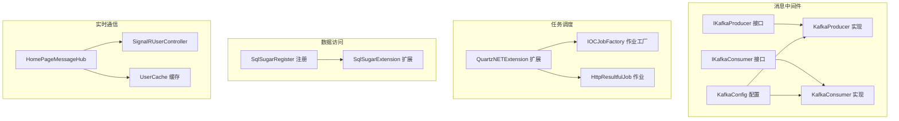
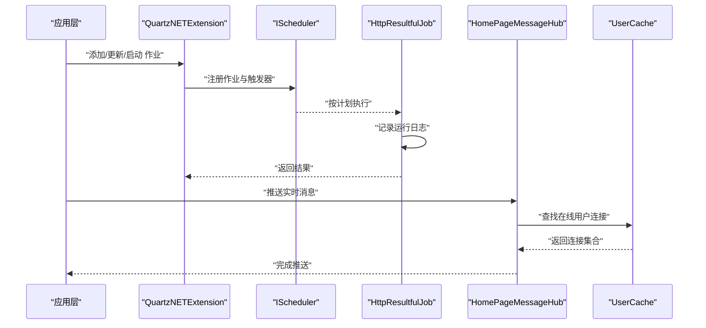
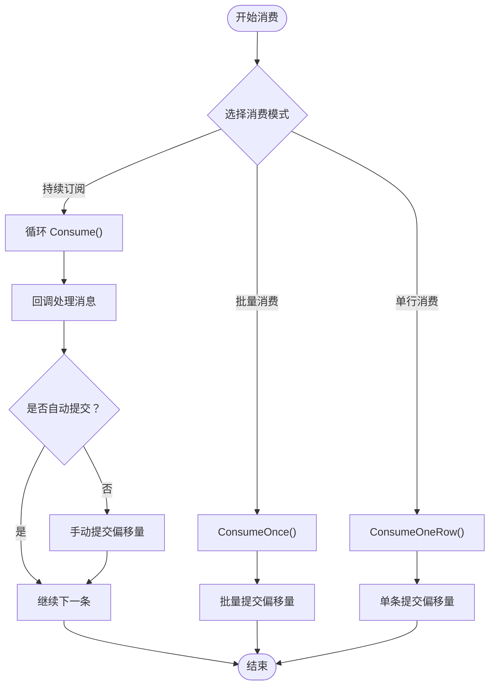
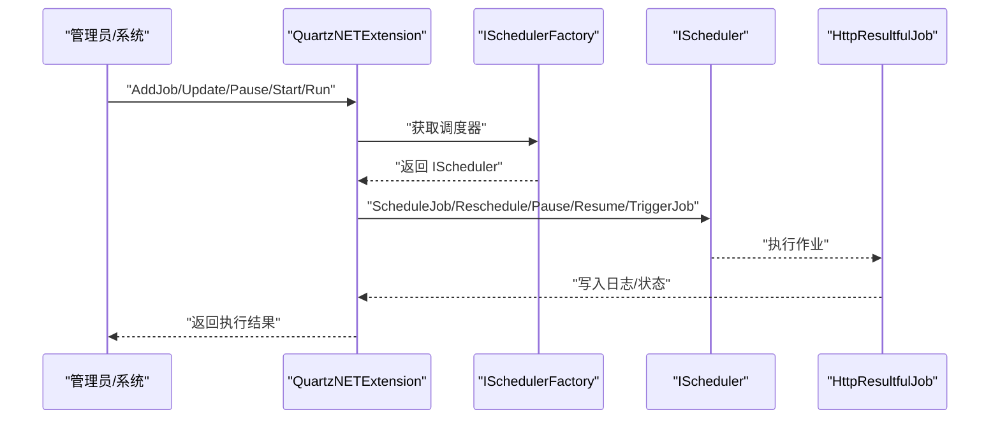
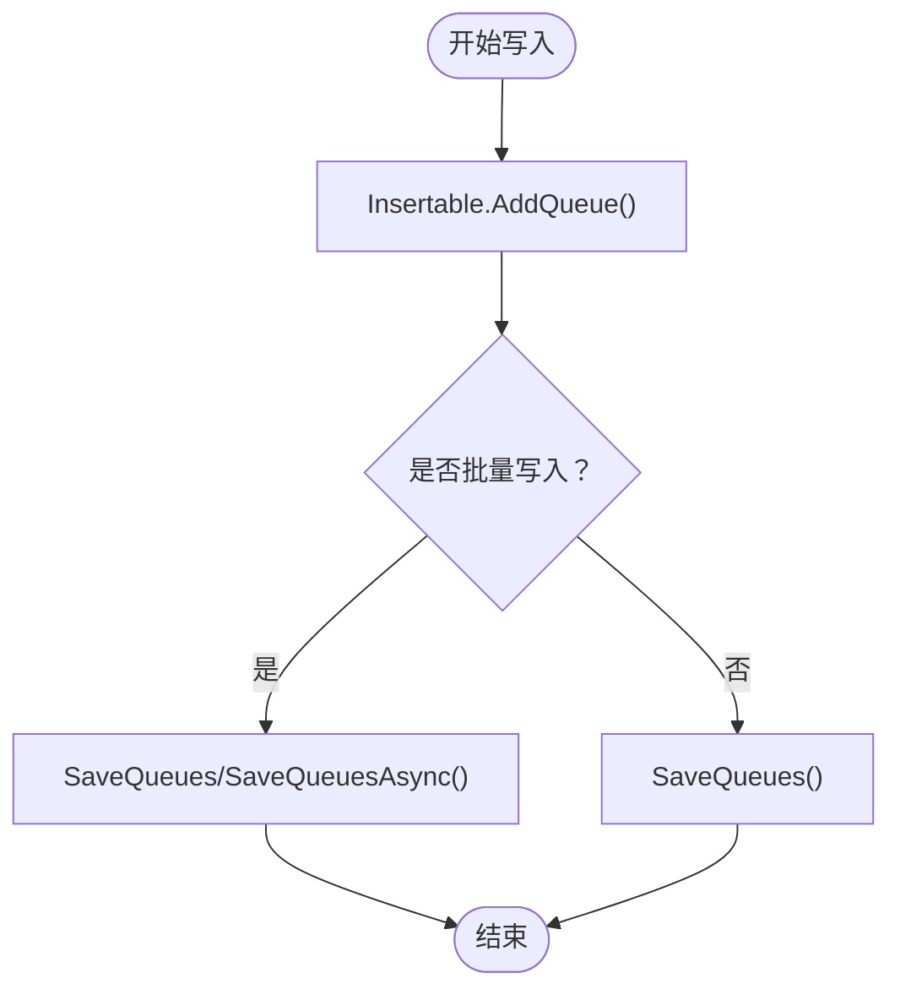
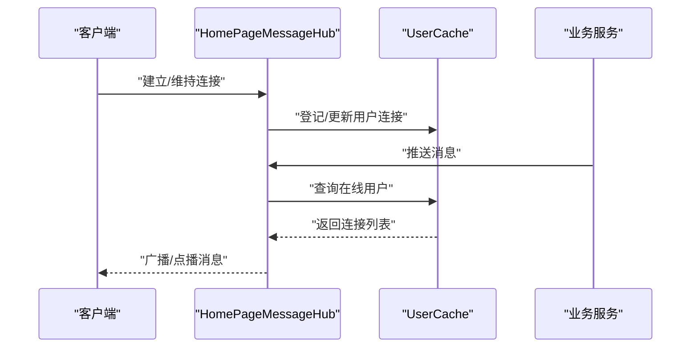
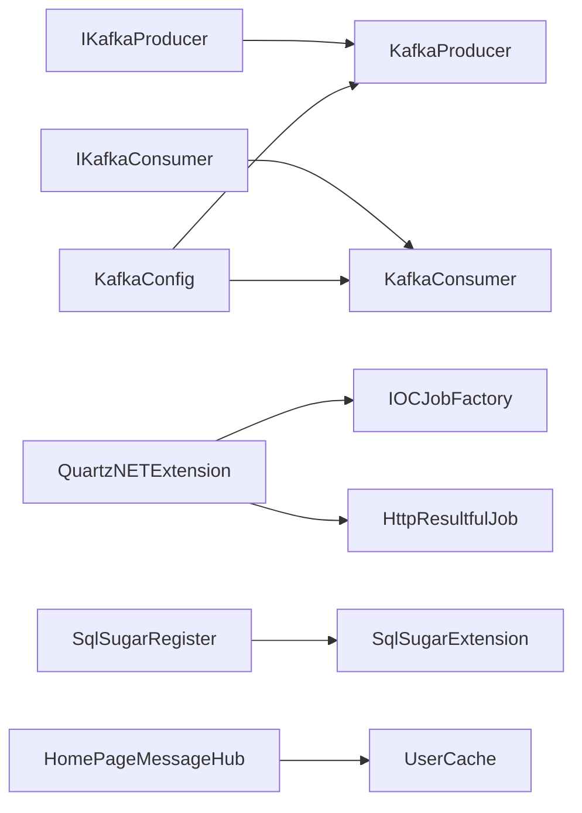

# 并发处理优化

<cite>
**本文引用的文件**
- [KafkaProducer.cs](file://VolPro.Core/KafkaManager/Service/KafkaProducer.cs)
- [KafkaConsumer.cs](file://VolPro.Core/KafkaManager/Service/KafkaConsumer.cs)
- [IKafkaProducer.cs](file://VolPro.Core/KafkaManager/IService/IKafkaProducer.cs)
- [IKafkaConsumer.cs](file://VolPro.Core/KafkaManager/IService/IKafkaConsumer.cs)
- [KafkaConfig.cs](file://VolPro.Core/KafkaManager/KafkaConfig.cs)
- [QuartzNETExtension.cs](file://VolPro.Core/Quartz/QuartzNETExtension.cs)
- [HttpResultfulJob.cs](file://VolPro.Core/Quartz/HttpResultfulJob.cs)
- [IOCJobFactory.cs](file://VolPro.Core/Quartz/IOCJobFactory.cs)
- [SqlSugarRegister.cs](file://VolPro.Core/DbSqlSugar/SqlSugarRegister.cs)
- [SqlSugarExtension.cs](file://VolPro.Core/DbSqlSugar/SqlSugarExtension.cs)
- [HomePageMessageHub.cs](file://VolPro.WebApi/Controllers/Hubs/HomePageMessageHub.cs)
- [SignalRUserController.cs](file://VolPro.WebApi/Controllers/Hubs/SignalRUserController.cs)
- [UserCache.cs](file://VolPro.WebApi/Controllers/Hubs/UserCache.cs)
</cite>

## 目录
1. [引言](#引言)
2. [项目结构](#项目结构)
3. [核心组件](#核心组件)
4. [架构总览](#架构总览)
5. [详细组件分析](#详细组件分析)
6. [依赖关系分析](#依赖关系分析)
7. [性能考量](#性能考量)
8. [故障排查指南](#故障排查指南)
9. [结论](#结论)
10. [附录](#附录)

## 引言
本文件面向“水化热平台”的并发处理优化，聚焦以下方面：
- 异步编程模式与线程池配置建议（基于现有实现的可扩展性）
- SignalR 实时通信的性能优化（连接池、推送策略）
- Quartz.NET 任务调度的性能调优（并发控制、资源管理）
- Kafka 消息队列的性能优化（生产者与消费者配置）
- 并发数据访问策略（乐观锁/悲观锁选择）
- 死锁预防与性能瓶颈识别方法

本文件在不直接展示具体代码的前提下，结合仓库中已存在的实现进行分析与优化建议。

## 项目结构
围绕并发处理的关键模块分布如下：
- 消息中间件：Kafka 生产者/消费者接口与实现
- 任务调度：Quartz.NET 扩展、作业工厂、HTTP 调度作业
- 数据访问：SqlSugar 注册与扩展（队列化写入、异步接口）
- 实时通信：SignalR Hub 及用户缓存

**图表来源**
- [KafkaProducer.cs:18-98](file://VolPro.Core/KafkaManager/Service/KafkaProducer.cs#L18-L98)
- [KafkaConsumer.cs:19-256](file://VolPro.Core/KafkaManager/Service/KafkaConsumer.cs#L19-L256)
- [IKafkaProducer.cs:8-25](file://VolPro.Core/KafkaManager/IService/IKafkaProducer.cs#L8-L25)
- [IKafkaConsumer.cs:8-40](file://VolPro.Core/KafkaManager/IService/IKafkaConsumer.cs#L8-L40)
- [KafkaConfig.cs:12-47](file://VolPro.Core/KafkaManager/KafkaConfig.cs#L12-L47)
- [QuartzNETExtension.cs:22-377](file://VolPro.Core/Quartz/QuartzNETExtension.cs#L22-L377)
- [IOCJobFactory.cs:10-28](file://VolPro.Core/Quartz/IOCJobFactory.cs#L10-L28)
- [HttpResultfulJob.cs:19-120](file://VolPro.Core/Quartz/HttpResultfulJob.cs#L19-L120)
- [SqlSugarRegister.cs:23-155](file://VolPro.Core/DbSqlSugar/SqlSugarRegister.cs#L23-L155)
- [SqlSugarExtension.cs:20-229](file://VolPro.Core/DbSqlSugar/SqlSugarExtension.cs#L20-L229)
- [HomePageMessageHub.cs](file://VolPro.WebApi/Controllers/Hubs/HomePageMessageHub.cs)
- [SignalRUserController.cs](file://VolPro.WebApi/Controllers/Hubs/SignalRUserController.cs)
- [UserCache.cs](file://VolPro.WebApi/Controllers/Hubs/UserCache.cs)

**章节来源**
- [KafkaProducer.cs:18-98](file://VolPro.Core/KafkaManager/Service/KafkaProducer.cs#L18-L98)
- [KafkaConsumer.cs:19-256](file://VolPro.Core/KafkaManager/Service/KafkaConsumer.cs#L19-L256)
- [QuartzNETExtension.cs:22-377](file://VolPro.Core/Quartz/QuartzNETExtension.cs#L22-L377)
- [SqlSugarRegister.cs:23-155](file://VolPro.Core/DbSqlSugar/SqlSugarRegister.cs#L23-L155)
- [SqlSugarExtension.cs:20-229](file://VolPro.Core/DbSqlSugar/SqlSugarExtension.cs#L20-L229)
- [HomePageMessageHub.cs](file://VolPro.WebApi/Controllers/Hubs/HomePageMessageHub.cs)
- [SignalRUserController.cs](file://VolPro.WebApi/Controllers/Hubs/SignalRUserController.cs)
- [UserCache.cs](file://VolPro.WebApi/Controllers/Hubs/UserCache.cs)

## 核心组件
- Kafka 生产者/消费者：提供同步与异步生产、多种消费模式（持续订阅、批量消费、单次/单行消费），支持手动/自动提交偏移量。
- Quartz.NET：提供作业注册、启停、更新、立即执行等操作，作业通过 IHttpClientFactory 发起 HTTP 请求。
- SqlSugar：提供插入队列化与异步保存、逻辑删除过滤、SQL 直接执行等能力，便于批量写入与查询。
- SignalR：提供实时消息推送能力，结合用户缓存进行连接管理。

**章节来源**
- [IKafkaProducer.cs:8-25](file://VolPro.Core/KafkaManager/IService/IKafkaProducer.cs#L8-L25)
- [IKafkaConsumer.cs:8-40](file://VolPro.Core/KafkaManager/IService/IKafkaConsumer.cs#L8-L40)
- [QuartzNETExtension.cs:87-160](file://VolPro.Core/Quartz/QuartzNETExtension.cs#L87-L160)
- [HttpResultfulJob.cs:34-119](file://VolPro.Core/Quartz/HttpResultfulJob.cs#L34-L119)
- [SqlSugarRegister.cs:76-131](file://VolPro.Core/DbSqlSugar/SqlSugarRegister.cs#L76-L131)
- [SqlSugarExtension.cs:43-81](file://VolPro.Core/DbSqlSugar/SqlSugarExtension.cs#L43-L81)

## 架构总览
下图展示了并发处理相关组件之间的交互关系与数据流。

**图表来源**
- [QuartzNETExtension.cs:87-160](file://VolPro.Core/Quartz/QuartzNETExtension.cs#L87-L160)
- [HttpResultfulJob.cs:34-119](file://VolPro.Core/Quartz/HttpResultfulJob.cs#L34-L119)
- [HomePageMessageHub.cs](file://VolPro.WebApi/Controllers/Hubs/HomePageMessageHub.cs)
- [UserCache.cs](file://VolPro.WebApi/Controllers/Hubs/UserCache.cs)

## 详细组件分析

### Kafka 消息队列优化
- 生产者
  - 同步/异步 Produce 接口均存在，异步版本通过 await producer.ProduceAsync(...) 提升吞吐。
  - 建议：在高并发场景下优先使用异步生产，避免阻塞线程；对错误处理进行幂等设计（重试+去重）。
- 消费者
  - 支持持续订阅、批量订阅、单次/单行消费；手动/自动提交偏移量可配置。
  - 建议：批量消费时合理设置最大行数与超时，避免长时间占用；启用自动提交时注意重复消费风险；持续订阅模式下确保异常捕获与日志记录完善。
- 配置
  - 当前配置类为占位实现，建议在实际部署中启用具体 Producer/ConsumerConfig，并根据环境调整超时、重试、分区策略等。

**图表来源**
- [KafkaConsumer.cs:67-246](file://VolPro.Core/KafkaManager/Service/KafkaConsumer.cs#L67-L246)
- [IKafkaConsumer.cs:8-40](file://VolPro.Core/KafkaManager/IService/IKafkaConsumer.cs#L8-L40)

**章节来源**
- [KafkaProducer.cs:49-97](file://VolPro.Core/KafkaManager/Service/KafkaProducer.cs#L49-L97)
- [KafkaConsumer.cs:67-246](file://VolPro.Core/KafkaManager/Service/KafkaConsumer.cs#L67-L246)
- [IKafkaProducer.cs:8-25](file://VolPro.Core/KafkaManager/IService/IKafkaProducer.cs#L8-L25)
- [IKafkaConsumer.cs:8-40](file://VolPro.Core/KafkaManager/IService/IKafkaConsumer.cs#L8-L40)
- [KafkaConfig.cs:12-47](file://VolPro.Core/KafkaManager/KafkaConfig.cs#L12-L47)

### Quartz.NET 任务调度优化
- 作业生命周期管理
  - 支持添加、删除、修改、暂停、恢复、立即执行；通过 TriggerAction 统一调度。
  - 建议：对频繁变更的作业采用“先校验再更新”，减少不必要的调度器操作。
- 作业执行
  - HttpResultfulJob 使用 IHttpClientFactory 发起 HTTP 请求，记录运行时长与结果。
  - 建议：为每个作业设置独立超时与重试策略；对失败日志进行分级存储与告警。
- 作业工厂
  - IOCJobFactory 将作业实例交由容器管理，便于注入服务与生命周期控制。

**图表来源**
- [QuartzNETExtension.cs:87-160](file://VolPro.Core/Quartz/QuartzNETExtension.cs#L87-L160)
- [QuartzNETExtension.cs:229-326](file://VolPro.Core/Quartz/QuartzNETExtension.cs#L229-L326)
- [HttpResultfulJob.cs:34-119](file://VolPro.Core/Quartz/HttpResultfulJob.cs#L34-L119)
- [IOCJobFactory.cs:17-26](file://VolPro.Core/Quartz/IOCJobFactory.cs#L17-L26)

**章节来源**
- [QuartzNETExtension.cs:87-160](file://VolPro.Core/Quartz/QuartzNETExtension.cs#L87-L160)
- [QuartzNETExtension.cs:229-326](file://VolPro.Core/Quartz/QuartzNETExtension.cs#L229-L326)
- [HttpResultfulJob.cs:34-119](file://VolPro.Core/Quartz/HttpResultfulJob.cs#L34-L119)
- [IOCJobFactory.cs:10-28](file://VolPro.Core/Quartz/IOCJobFactory.cs#L10-L28)

### 并发数据访问优化
- 插入队列化与异步保存
  - Insertable/AddQueue 与 SaveQueues/SaveQueuesAsync 支持批量写入，降低事务开销。
  - 建议：大批量写入时合并 SaveChanges，减少往返次数；对拆表实体使用 SplitTable 提升写入效率。
- 更新与字段选择
  - UpdateRange 支持指定字段更新，避免全量更新；自动剔除主键字段以防止误更新。
- 查询与逻辑删除
  - Set 支持逻辑删除字段过滤，减少无效数据扫描。
- 连接与日志
  - SqlSugarRegister 在多连接配置下统一 AOP 日志输出，便于定位慢查询。

**图表来源**
- [SqlSugarExtension.cs:23-81](file://VolPro.Core/DbSqlSugar/SqlSugarExtension.cs#L23-L81)
- [SqlSugarRegister.cs:104-129](file://VolPro.Core/DbSqlSugar/SqlSugarRegister.cs#L104-L129)

**章节来源**
- [SqlSugarExtension.cs:23-154](file://VolPro.Core/DbSqlSugar/SqlSugarExtension.cs#L23-L154)
- [SqlSugarRegister.cs:76-131](file://VolPro.Core/DbSqlSugar/SqlSugarRegister.cs#L76-L131)

### SignalR 实时通信优化
- 连接管理
  - HomePageMessageHub 作为实时通信入口，结合 UserCache 管理用户连接集合，提升推送效率。
- 推送策略
  - 建议：按用户维度聚合消息，避免逐个连接发送；对高频推送采用批量化与去抖策略；对离线用户进行清理与降级处理。
- 连接池
  - 建议：结合应用服务器的连接池配置与 SignalR 的传输协议选择（WebSockets/ServerSentEvents/LongPolling），在高并发场景优先使用 WebSockets。

**图表来源**
- [HomePageMessageHub.cs](file://VolPro.WebApi/Controllers/Hubs/HomePageMessageHub.cs)
- [SignalRUserController.cs](file://VolPro.WebApi/Controllers/Hubs/SignalRUserController.cs)
- [UserCache.cs](file://VolPro.WebApi/Controllers/Hubs/UserCache.cs)

**章节来源**
- [HomePageMessageHub.cs](file://VolPro.WebApi/Controllers/Hubs/HomePageMessageHub.cs)
- [SignalRUserController.cs](file://VolPro.WebApi/Controllers/Hubs/SignalRUserController.cs)
- [UserCache.cs](file://VolPro.WebApi/Controllers/Hubs/UserCache.cs)

## 依赖关系分析
- Kafka 组件依赖配置类与日志服务，生产者/消费者通过接口解耦，便于替换与测试。
- Quartz 组件依赖调度器工厂、作业工厂与 HTTP 客户端工厂，作业执行链路清晰。
- SqlSugar 组件通过扩展方法提供统一的 CRUD 与异步能力，降低上层复杂度。
- SignalR 组件依赖 Hub 与用户缓存，形成松耦合的实时推送体系。

**图表来源**
- [IKafkaProducer.cs:8-25](file://VolPro.Core/KafkaManager/IService/IKafkaProducer.cs#L8-L25)
- [IKafkaConsumer.cs:8-40](file://VolPro.Core/KafkaManager/IService/IKafkaConsumer.cs#L8-L40)
- [KafkaProducer.cs:18-98](file://VolPro.Core/KafkaManager/Service/KafkaProducer.cs#L18-L98)
- [KafkaConsumer.cs:19-256](file://VolPro.Core/KafkaManager/Service/KafkaConsumer.cs#L19-L256)
- [KafkaConfig.cs:12-47](file://VolPro.Core/KafkaManager/KafkaConfig.cs#L12-L47)
- [QuartzNETExtension.cs:22-377](file://VolPro.Core/Quartz/QuartzNETExtension.cs#L22-L377)
- [IOCJobFactory.cs:10-28](file://VolPro.Core/Quartz/IOCJobFactory.cs#L10-L28)
- [HttpResultfulJob.cs:19-120](file://VolPro.Core/Quartz/HttpResultfulJob.cs#L19-L120)
- [SqlSugarRegister.cs:23-155](file://VolPro.Core/DbSqlSugar/SqlSugarRegister.cs#L23-L155)
- [SqlSugarExtension.cs:20-229](file://VolPro.Core/DbSqlSugar/SqlSugarExtension.cs#L20-L229)
- [HomePageMessageHub.cs](file://VolPro.WebApi/Controllers/Hubs/HomePageMessageHub.cs)
- [UserCache.cs](file://VolPro.WebApi/Controllers/Hubs/UserCache.cs)

**章节来源**
- [KafkaProducer.cs:18-98](file://VolPro.Core/KafkaManager/Service/KafkaProducer.cs#L18-L98)
- [KafkaConsumer.cs:19-256](file://VolPro.Core/KafkaManager/Service/KafkaConsumer.cs#L19-L256)
- [QuartzNETExtension.cs:22-377](file://VolPro.Core/Quartz/QuartzNETExtension.cs#L22-L377)
- [SqlSugarRegister.cs:23-155](file://VolPro.Core/DbSqlSugar/SqlSugarRegister.cs#L23-L155)
- [HomePageMessageHub.cs](file://VolPro.WebApi/Controllers/Hubs/HomePageMessageHub.cs)

## 性能考量
- 异步编程与线程池
  - 优先使用 async/await 与异步 I/O，避免阻塞线程池线程；对 CPU 密集型任务使用合适的线程池配置与限制并发度。
- Kafka
  - 生产者：启用异步生产与批量缓冲；合理设置 acks、retries、linger.ms；消费者：批量拉取与批量提交；根据主题分区数与消费者数量平衡负载。
- Quartz
  - 作业并发：通过作业工厂与容器生命周期控制实例复用；为耗时作业设置独立超时与重试；避免同一作业的重复触发。
- SqlSugar
  - 写入：使用队列化与批量保存；读取：合理使用索引与投影字段；逻辑删除：统一过滤减少扫描。
- SignalR
  - 连接：优先使用 WebSockets；推送：按用户聚合与去抖；缓存：及时清理离线连接。

[本节为通用指导，不直接分析具体文件]

## 故障排查指南
- Kafka
  - 错误处理：捕获 ProduceException/ConsumeException 并记录详细日志；对网络异常与序列化异常进行分类处理。
  - 偏移量：手动提交时确保异常路径也能提交，避免重复消费或丢失。
- Quartz
  - 日志：作业执行结果与异常写入日志表；对调度器状态进行监控与告警。
  - 资源：作业实例通过容器释放，避免内存泄漏。
- SqlSugar
  - 慢查询：利用 AOP 日志定位 SQL；检查索引与查询条件。
  - 事务：批量写入时合并 SaveChanges，减少事务开销。
- SignalR
  - 连接异常：检查传输协议与防火墙；对断连进行重连与状态同步。

**章节来源**
- [KafkaProducer.cs:66-96](file://VolPro.Core/KafkaManager/Service/KafkaProducer.cs#L66-L96)
- [KafkaConsumer.cs:111-118](file://VolPro.Core/KafkaManager/Service/KafkaConsumer.cs#L111-L118)
- [HttpResultfulJob.cs:95-115](file://VolPro.Core/Quartz/HttpResultfulJob.cs#L95-L115)
- [SqlSugarRegister.cs:115-125](file://VolPro.Core/DbSqlSugar/SqlSugarRegister.cs#L115-L125)

## 结论
本项目在并发处理方面已具备良好的基础：Kafka 的异步生产与多种消费模式、Quartz 的作业生命周期管理、SqlSugar 的队列化写入与异步扩展、以及 SignalR 的实时推送能力。后续优化重点在于：
- 明确启用 Kafka 配置并进行参数调优；
- 对 Quartz 作业实施并发控制与资源隔离；
- 在数据访问层进一步细化乐观/悲观锁策略与事务边界；
- 建立完善的死锁预防与性能瓶颈识别机制。

[本节为总结，不直接分析具体文件]

## 附录
- 并发数据访问策略建议
  - 乐观锁：适用于冲突较少、读多写少的场景；通过版本号/时间戳检测冲突。
  - 悲观锁：适用于高冲突、强一致要求场景；通过数据库锁或分布式锁控制。
- 死锁预防与识别
  - 统一加锁顺序与超时；避免长事务；定期巡检锁等待与阻塞；对热点资源进行分片或缓存。

[本节为通用指导，不直接分析具体文件]