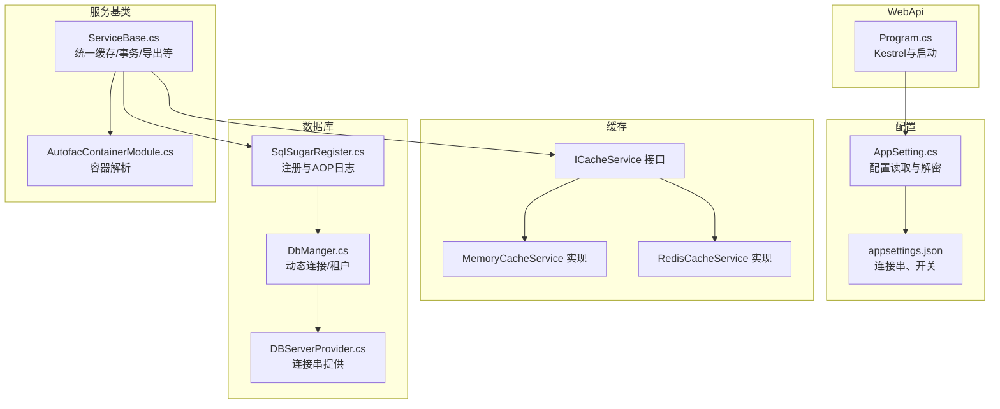
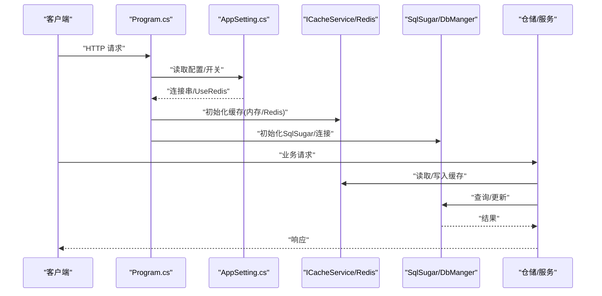
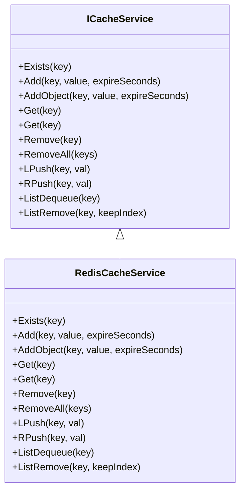
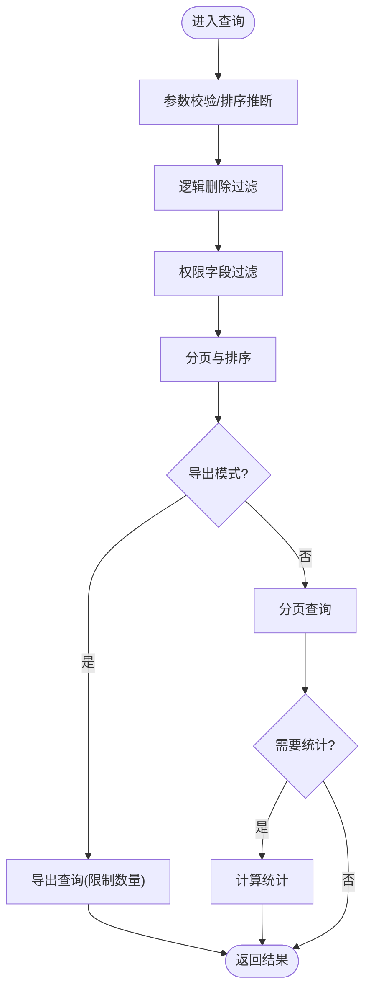
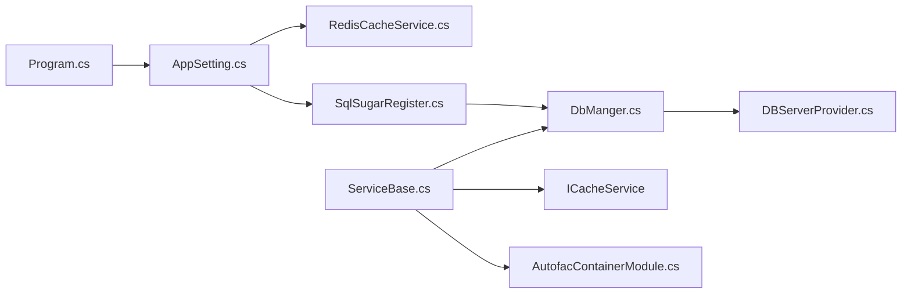

# 性能优化

<cite>
**本文引用的文件**
- [RedisCacheService.cs](file://VolPro.Core/CacheManager/Service/RedisCacheService.cs)
- [AppSetting.cs](file://VolPro.Core/Configuration/AppSetting.cs)
- [SqlSugarRegister.cs](file://VolPro.Core/DbSqlSugar/SqlSugarRegister.cs)
- [DBServerProvider.cs](file://VolPro.Core/DbManager/DBServerProvider.cs)
- [DbManger.cs](file://VolPro.Core/DbSqlSugar/DbManger.cs)
- [Program.cs](file://VolPro.WebApi/Program.cs)
- [appsettings.json](file://VolPro.WebApi/appsettings.json)
- [ServiceBase.cs](file://VolPro.Core/BaseProvider/ServiceBase.cs)
- [AutofacContainerModule.cs](file://VolPro.Core/Extensions/AutofacManager/AutofacContainerModule.cs)
</cite>

## 目录
1. [简介](#简介)
2. [项目结构](#项目结构)
3. [核心组件](#核心组件)
4. [架构总览](#架构总览)
5. [详细组件分析](#详细组件分析)
6. [依赖关系分析](#依赖关系分析)
7. [性能考量](#性能考量)
8. [故障排查指南](#故障排查指南)
9. [结论](#结论)
10. [附录](#附录)

## 简介
本指南面向“水化热平台”的性能优化实践，围绕缓存策略（内存缓存与Redis）、数据库查询优化（索引、查询计划、连接池）、并发处理（异步、线程池、锁）、内存使用（GC调优与泄漏检测）、性能测试与基准测试、以及容量规划与扩容策略，结合代码库中的实际实现进行系统化梳理与落地建议。目标是在保障功能正确性的前提下，显著提升系统吞吐、降低延迟并增强稳定性。

## 项目结构
从性能优化视角，以下模块与配置尤为关键：
- 缓存层：内存缓存与Redis缓存服务接口与实现，统一通过ICacheService注入使用
- 数据库层：SqlSugar注册与连接配置、动态分库与租户隔离、日志与AOP
- 配置层：应用配置集中管理，含数据库、Redis、信号、Kafka、雪花算法等开关
- 运行时：Kestrel服务器参数、容器依赖注入（Autofac）

图表来源
- [Program.cs:1-39](file://VolPro.WebApi/Program.cs#L1-L39)
- [AppSetting.cs:1-237](file://VolPro.Core/Configuration/AppSetting.cs#L1-L237)
- [appsettings.json:1-140](file://VolPro.WebApi/appsettings.json#L1-L140)
- [RedisCacheService.cs:1-120](file://VolPro.Core/CacheManager/Service/RedisCacheService.cs#L1-L120)
- [SqlSugarRegister.cs:1-155](file://VolPro.Core/DbSqlSugar/SqlSugarRegister.cs#L1-L155)
- [DbManger.cs:1-159](file://VolPro.Core/DbSqlSugar/DbManger.cs#L1-L159)
- [DBServerProvider.cs:1-139](file://VolPro.Core/DbManager/DBServerProvider.cs#L1-L139)
- [ServiceBase.cs:1-800](file://VolPro.Core/BaseProvider/ServiceBase.cs#L1-L800)
- [AutofacContainerModule.cs:1-15](file://VolPro.Core/Extensions/AutofacManager/AutofacContainerModule.cs#L1-L15)

章节来源
- [Program.cs:1-39](file://VolPro.WebApi/Program.cs#L1-L39)
- [AppSetting.cs:1-237](file://VolPro.Core/Configuration/AppSetting.cs#L1-L237)
- [appsettings.json:1-140](file://VolPro.WebApi/appsettings.json#L1-L140)

## 核心组件
- 缓存组件
  - ICacheService：抽象缓存接口，统一内存与Redis实现
  - MemoryCacheService：内存缓存（未在仓库中直接展示，但通过ICacheService注入）
  - RedisCacheService：基于CSRedis/StackExchange.Redis的Redis实现，支持过期、列表操作、批量删除等
- 数据库组件
  - SqlSugarRegister：集中注册SqlSugar客户端，配置AOP日志、字段映射、连接池等
  - DbManger：动态租户分库、按用户上下文获取连接、系统库/业务库切换
  - DBServerProvider：根据上下文动态解析连接串，支持动态分库
- 配置组件
  - AppSetting：集中读取配置、解密敏感信息、暴露UseRedis、UseDynamicShareDB等开关
  - appsettings.json：数据库连接串、Redis连接串、开关项、雪花算法、逻辑删除字段等
- 运行时与容器
  - Program：Kestrel参数、URL绑定、Autofac容器工厂
  - ServiceBase：统一业务服务基类，集成缓存、事务、导出、权限字段过滤等

章节来源
- [RedisCacheService.cs:1-120](file://VolPro.Core/CacheManager/Service/RedisCacheService.cs#L1-L120)
- [SqlSugarRegister.cs:1-155](file://VolPro.Core/DbSqlSugar/SqlSugarRegister.cs#L1-L155)
- [DbManger.cs:1-159](file://VolPro.Core/DbSqlSugar/DbManger.cs#L1-L159)
- [DBServerProvider.cs:1-139](file://VolPro.Core/DbManager/DBServerProvider.cs#L1-L139)
- [AppSetting.cs:1-237](file://VolPro.Core/Configuration/AppSetting.cs#L1-L237)
- [appsettings.json:1-140](file://VolPro.WebApi/appsettings.json#L1-L140)
- [ServiceBase.cs:1-800](file://VolPro.Core/BaseProvider/ServiceBase.cs#L1-L800)
- [Program.cs:1-39](file://VolPro.WebApi/Program.cs#L1-L39)

## 架构总览
下图展示了请求在系统中的关键流转：WebApi启动、配置加载、缓存与数据库初始化、业务服务调用与数据持久化。

图表来源
- [Program.cs:1-39](file://VolPro.WebApi/Program.cs#L1-L39)
- [AppSetting.cs:1-237](file://VolPro.Core/Configuration/AppSetting.cs#L1-L237)
- [RedisCacheService.cs:1-120](file://VolPro.Core/CacheManager/Service/RedisCacheService.cs#L1-L120)
- [SqlSugarRegister.cs:1-155](file://VolPro.Core/DbSqlSugar/SqlSugarRegister.cs#L1-L155)
- [DbManger.cs:1-159](file://VolPro.Core/DbSqlSugar/DbManger.cs#L1-L159)

## 详细组件分析

### 缓存策略优化（内存缓存与Redis）
- 统一接口与注入
  - 业务层通过ICacheService获取缓存实例，避免直接耦合具体实现
  - 容器解析通过AutofacContainerModule.GetService<T>()完成
- Redis实现要点
  - 初始化：通过AppSetting.RedisConnectionString与CSRedis初始化RedisHelper
  - 常用操作：Exists、Set(Get)/Del、LPush/RPush/RPop、LTrim（保留尾部）
  - 序列化：对象存取使用JSON序列化
- 内存缓存
  - 通过AppSetting.UseRedis控制启用Redis或内存缓存；未在仓库中直接展示内存实现类，但可通过接口注入使用
- 使用建议
  - 对热点查询（如字典、报表元数据）设置合理TTL
  - 列表类缓存采用LPush/RPop配合LTrim做滑动窗口
  - 批量删除使用Del(keys[])减少网络往返

图表来源
- [RedisCacheService.cs:1-120](file://VolPro.Core/CacheManager/Service/RedisCacheService.cs#L1-L120)

章节来源
- [RedisCacheService.cs:1-120](file://VolPro.Core/CacheManager/Service/RedisCacheService.cs#L1-L120)
- [AppSetting.cs:1-237](file://VolPro.Core/Configuration/AppSetting.cs#L1-L237)
- [AutofacContainerModule.cs:1-15](file://VolPro.Core/Extensions/AutofacManager/AutofacContainerModule.cs#L1-L15)
- [ServiceBase.cs:1-800](file://VolPro.Core/BaseProvider/ServiceBase.cs#L1-L800)

### 数据库查询优化（索引、查询计划、连接池）
- 连接与注册
  - SqlSugarRegister集中注册ISqlSugarClient，配置AOP OnLogExecuting输出SQL，便于分析慢查询
  - 支持多库配置（系统库、业务库、空库），动态分库场景下按ConfigId隔离
- 动态分库与租户
  - DbManger根据用户上下文动态添加/获取连接，支持按serviceId的租户分库
  - DBServerProvider根据UseDynamicShareDB与上下文选择业务库连接串
- 查询与分页
  - ServiceBase对查询参数进行合法性校验、排序字段推断、逻辑删除过滤、权限字段过滤
  - 分页使用IQueryablePage，支持排序字典与统计表达式
- 索引与查询计划
  - 建议：针对高频过滤字段、排序字段建立复合索引；定期审查OnLogExecuting输出的SQL执行计划
  - 避免SELECT *，仅查询必要列；对导出场景使用权限字段过滤减少传输
- 连接池配置
  - 在连接串中启用连接池参数（Pooling=true等），结合SqlSugar的连接配置与多库隔离

图表来源
- [ServiceBase.cs:285-338](file://VolPro.Core/BaseProvider/ServiceBase.cs#L285-L338)
- [DbManger.cs:26-56](file://VolPro.Core/DbSqlSugar/DbManger.cs#L26-L56)
- [DBServerProvider.cs:121-127](file://VolPro.Core/DbManager/DBServerProvider.cs#L121-L127)

章节来源
- [SqlSugarRegister.cs:1-155](file://VolPro.Core/DbSqlSugar/SqlSugarRegister.cs#L1-L155)
- [DbManger.cs:1-159](file://VolPro.Core/DbSqlSugar/DbManger.cs#L1-L159)
- [DBServerProvider.cs:1-139](file://VolPro.Core/DbManager/DBServerProvider.cs#L1-L139)
- [ServiceBase.cs:1-800](file://VolPro.Core/BaseProvider/ServiceBase.cs#L1-L800)

### 并发处理优化（异步、线程池、锁）
- 异步与线程池
  - WebApi使用Kestrel默认线程模型；建议在IO密集型操作（如Redis、数据库、文件导入导出）采用异步API
  - 对于CPU密集型任务（如大数据导出、复杂计算）考虑后台作业或队列化
- 锁优化
  - 避免在高并发场景下持有全局锁；对热点资源使用细粒度锁或无锁结构
  - 对缓存更新采用CAS或原子操作，减少锁竞争
- 业务侧建议
  - ServiceBase的导入/导出流程已包含事务与异步写入，建议在控制器层尽量使用异步方法签名

章节来源
- [Program.cs:24-36](file://VolPro.WebApi/Program.cs#L24-L36)
- [ServiceBase.cs:531-605](file://VolPro.Core/BaseProvider/ServiceBase.cs#L531-L605)

### 内存使用优化（GC调优与内存泄漏检测）
- GC调优
  - 减少短生命周期临时对象；避免在热路径频繁装箱/拆箱
  - 合理复用集合（如StringBuilder、List<T>），避免大对象频繁分配
- 泄漏检测
  - 关注长生命周期容器（Autofac）中单例对象持有的外部资源
  - 对Redis/数据库连接、文件流等及时释放
  - 使用性能计数器与诊断工具（如dotTrace、PerfView）定位峰值与泄漏点

章节来源
- [AutofacContainerModule.cs:1-15](file://VolPro.Core/Extensions/AutofacManager/AutofacContainerModule.cs#L1-L15)
- [RedisCacheService.cs:115-118](file://VolPro.Core/CacheManager/Service/RedisCacheService.cs#L115-L118)

### 前端性能优化（静态资源、CDN、浏览器缓存）
- 静态资源压缩
  - 生产环境启用静态文件中间件与压缩（如gzip/br），减少带宽占用
- CDN配置
  - 将CSS/JS/Lib等静态资源托管至CDN，缩短首屏渲染时间
- 浏览器缓存策略
  - 对不常变更的静态资源设置强缓存（Cache-Control/ETag）
  - 对HTML设置较短缓存或no-cache，确保版本更新可见

章节来源
- [appsettings.json:10-13](file://VolPro.WebApi/appsettings.json#L10-L13)

### 性能测试与基准测试
- 工具建议
  - 压力测试：wrk、JMeter、k6
  - .NET基准测试：BenchmarkDotNet
  - 数据库压测：tpcc-mysql/tpcc-postgres（依据实际数据库类型）
- 关键指标
  - QPS、P95/P99延迟、错误率、数据库连接池命中率、Redis命中率
- 基准场景
  - 分页查询、导出、导入、缓存命中/未命中对比、并发写入

章节来源
- [SqlSugarRegister.cs:115-125](file://VolPro.Core/DbSqlSugar/SqlSugarRegister.cs#L115-L125)
- [ServiceBase.cs:612-652](file://VolPro.Core/BaseProvider/ServiceBase.cs#L612-L652)

### 容量规划与扩容策略
- 前端与网关
  - CDN+静态资源分离；反向代理（Nginx/IIS）前置，开启连接复用
- 应用层
  - 水平扩展：多实例部署，共享Redis；数据库读写分离+只读副本
- 数据库
  - 索引与分区：对大表按时间/租户分区；定期维护统计信息
  - 连接池：按实例QPS与并发连接需求配置最大连接数
- 缓存
  - 多级缓存：本地内存+Redis；热点数据双写+失效策略
- 监控
  - APM（如Application Insights/自建Prometheus）采集关键指标，设置告警阈值

## 依赖关系分析
- 组件耦合
  - ServiceBase依赖ICacheService、SqlSugar、权限与租户上下文
  - DbManger与DBServerProvider共同决定连接配置与租户分库
  - Program负责运行时参数与容器工厂
- 外部依赖
  - Redis：CSRedis/StackExchange.Redis
  - 数据库：SqlSugar（支持MsSql/MySql/PgSql/Oracle等）
  - 容器：Autofac

图表来源
- [Program.cs:1-39](file://VolPro.WebApi/Program.cs#L1-L39)
- [AppSetting.cs:1-237](file://VolPro.Core/Configuration/AppSetting.cs#L1-L237)
- [RedisCacheService.cs:1-120](file://VolPro.Core/CacheManager/Service/RedisCacheService.cs#L1-L120)
- [SqlSugarRegister.cs:1-155](file://VolPro.Core/DbSqlSugar/SqlSugarRegister.cs#L1-L155)
- [DbManger.cs:1-159](file://VolPro.Core/DbSqlSugar/DbManger.cs#L1-L159)
- [DBServerProvider.cs:1-139](file://VolPro.Core/DbManager/DBServerProvider.cs#L1-L139)
- [ServiceBase.cs:1-800](file://VolPro.Core/BaseProvider/ServiceBase.cs#L1-L800)
- [AutofacContainerModule.cs:1-15](file://VolPro.Core/Extensions/AutofacManager/AutofacContainerModule.cs#L1-L15)

章节来源
- [Program.cs:1-39](file://VolPro.WebApi/Program.cs#L1-L39)
- [AppSetting.cs:1-237](file://VolPro.Core/Configuration/AppSetting.cs#L1-L237)
- [RedisCacheService.cs:1-120](file://VolPro.Core/CacheManager/Service/RedisCacheService.cs#L1-L120)
- [SqlSugarRegister.cs:1-155](file://VolPro.Core/DbSqlSugar/SqlSugarRegister.cs#L1-L155)
- [DbManger.cs:1-159](file://VolPro.Core/DbSqlSugar/DbManger.cs#L1-L159)
- [DBServerProvider.cs:1-139](file://VolPro.Core/DbManager/DBServerProvider.cs#L1-L139)
- [ServiceBase.cs:1-800](file://VolPro.Core/BaseProvider/ServiceBase.cs#L1-L800)
- [AutofacContainerModule.cs:1-15](file://VolPro.Core/Extensions/AutofacManager/AutofacContainerModule.cs#L1-L15)

## 性能考量
- 缓存
  - 合理TTL与淘汰策略；对热点键设置更高优先级
  - 利用列表类缓存实现滑动窗口，减少无效数据
- 数据库
  - 使用SqlSugar AOP日志定位慢SQL；对高频查询建立合适索引
  - 分页查询避免“跳页”带来的高偏移成本，推荐基于游标/键值的分页
- 并发
  - 控制并发度，避免连接池耗尽；对写操作使用幂等设计
- 内存
  - 避免大对象驻留；关注大集合与字符串拼接
- 前端
  - 资源压缩与CDN；合理缓存策略与版本号

## 故障排查指南
- 缓存问题
  - Redis不可用：检查连接串与网络；确认UseRedis开关
  - 缓存穿透：对空值设置短TTL；对非法输入快速拒绝
- 数据库问题
  - 连接超时：检查连接池参数与数据库负载；启用只读副本
  - 慢查询：通过AOP日志定位；审查索引与查询计划
- 运行时问题
  - Kestrel参数不当：调整MaxRequestBodySize与URL绑定
  - 容器解析失败：检查Autofac注册与生命周期

章节来源
- [AppSetting.cs:144-163](file://VolPro.Core/Configuration/AppSetting.cs#L144-L163)
- [SqlSugarRegister.cs:115-125](file://VolPro.Core/DbSqlSugar/SqlSugarRegister.cs#L115-L125)
- [Program.cs:28-36](file://VolPro.WebApi/Program.cs#L28-L36)
- [AutofacContainerModule.cs:9-12](file://VolPro.Core/Extensions/AutofacManager/AutofacContainerModule.cs#L9-L12)

## 结论
通过统一的缓存接口与Redis实现、SqlSugar的集中注册与AOP日志、动态分库与租户隔离、以及完善的配置体系，水化热平台具备了良好的性能优化基础。建议在生产环境中结合压力测试与APM监控，持续迭代索引、连接池、缓存策略与并发控制，以获得更稳定的吞吐与更低的延迟。

## 附录
- 关键配置项参考
  - 数据库类型与连接串：appsettings.json中Connection节
  - Redis开关与连接串：appsettings.json中Connection.UseRedis/RedisConnectionString
  - 逻辑删除字段：appsettings.json中LogicDelField
  - 雪花算法开关：appsettings.json中UseSnow
  - 动态分库开关：appsettings.json中UseDynamicShareDB

章节来源
- [appsettings.json:16-57](file://VolPro.WebApi/appsettings.json#L16-L57)
- [AppSetting.cs:144-163](file://VolPro.Core/Configuration/AppSetting.cs#L144-L163)