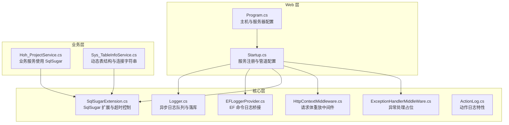
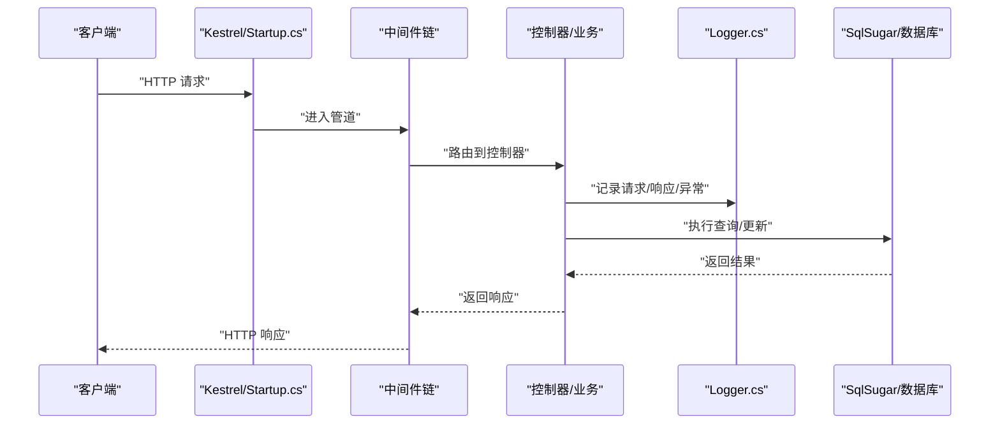
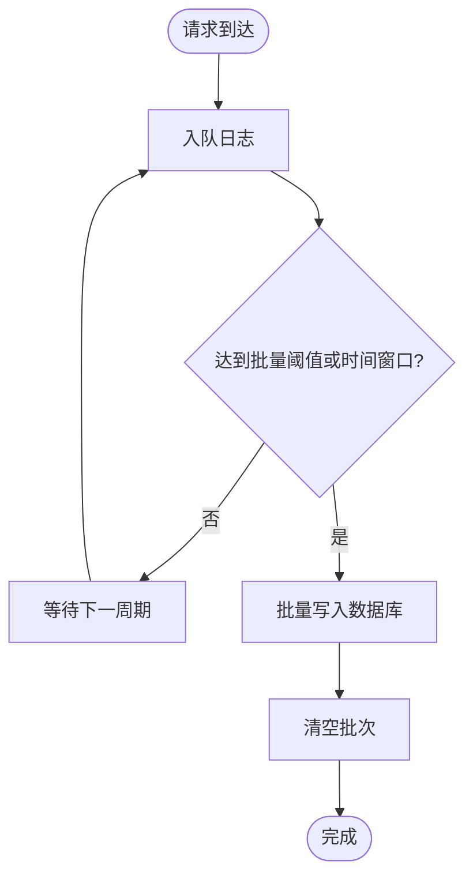
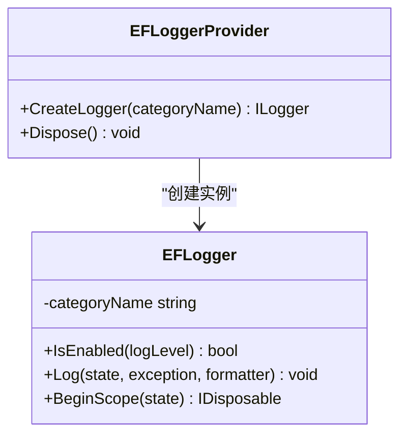
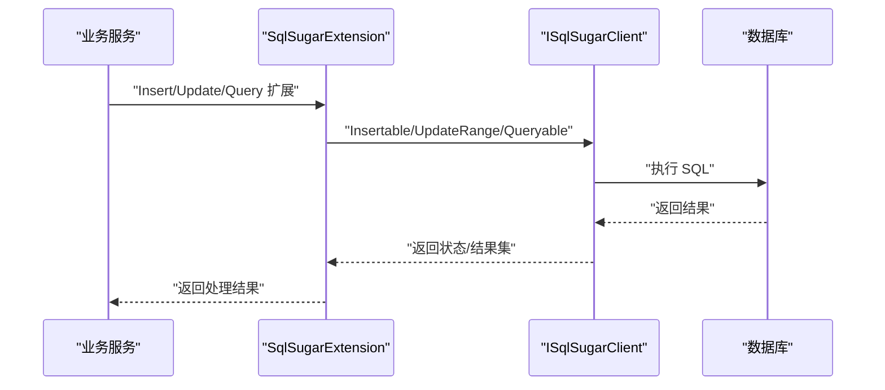
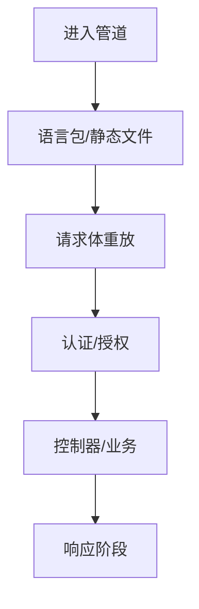
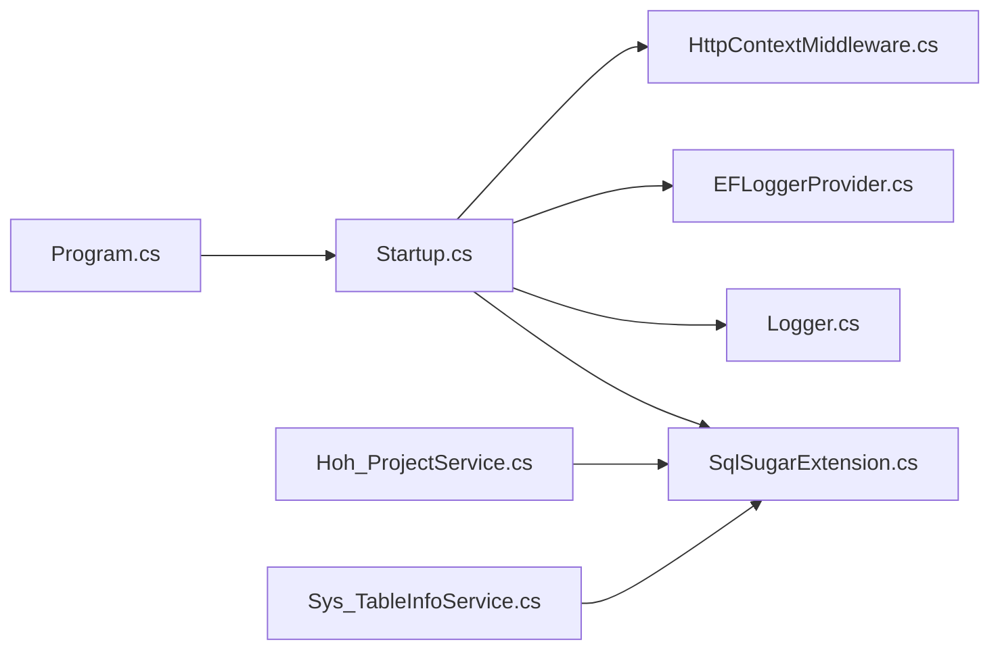

# 性能监控与指标

<cite>
**本文引用的文件**
- [Program.cs](file://VolPro.WebApi/Program.cs)
- [Startup.cs](file://VolPro.WebApi/Startup.cs)
- [EFLoggerProvider.cs](file://VolPro.Core/EFDbContext/EFLoggerProvider.cs)
- [SqlSugarExtension.cs](file://VolPro.Core/DbSqlSugar/SqlSugarExtension.cs)
- [Logger.cs](file://VolPro.Core/Services/Logger.cs)
- [ActionLog.cs](file://VolPro.Core/Middleware/ActionLog.cs)
- [HttpContextMiddleware.cs](file://VolPro.Core/Extensions/Middleware/HttpContextMiddleware.cs)
- [ExceptionHandlerMiddleWare.cs](file://VolPro.Core/Extensions/Middleware/ExceptionHandlerMiddleWare.cs)
- [Hoh_ProjectService.cs](file://Hncdi.HeatOfHydration/Services/Hoh/Partial/Hoh_ProjectService.cs)
- [Sys_TableInfoService.cs](file://VolPro.Builder/Services/Core/Partial/Sys_TableInfoService.cs)
</cite>

## 目录
1. [引言](#引言)
2. [项目结构](#项目结构)
3. [核心组件](#核心组件)
4. [架构总览](#架构总览)
5. [详细组件分析](#详细组件分析)
6. [依赖关系分析](#依赖关系分析)
7. [性能考量](#性能考量)
8. [故障排查指南](#故障排查指南)
9. [结论](#结论)
10. [附录](#附录)

## 引言
本文件面向“水化热平台”的性能监控与指标建设，结合现有代码库中的日志、数据库访问、中间件与启动配置等模块，系统性地提出应用性能监控体系的落地建议，涵盖关键性能指标（KPI）定义与采集、日志性能影响与优化策略（结构化日志与采样）、数据库性能监控（执行时间与慢查询分析）、系统资源监控（CPU、内存、磁盘、网络），以及 APM 工具集成与性能告警、故障排查流程。

## 项目结构
该仓库采用分层与领域划分的组织方式：
- Web 层：WebApi 启动与路由、中间件、认证授权、Swagger 文档等
- 核心层：日志服务、EF 日志桥接、SqlSugar 扩展、缓存与中间件基础设施
- 领域服务层：水化热业务服务（Hoh_*）与通用 Builder 系统服务
- 实体层：系统与业务实体模型

图表来源
- [Program.cs:1-39](file://VolPro.WebApi/Program.cs#L1-L39)
- [Startup.cs:1-407](file://VolPro.WebApi/Startup.cs#L1-L407)
- [Logger.cs:1-308](file://VolPro.Core/Services/Logger.cs#L1-L308)
- [EFLoggerProvider.cs:1-35](file://VolPro.Core/EFDbContext/EFLoggerProvider.cs#L1-L35)
- [SqlSugarExtension.cs:1-229](file://VolPro.Core/DbSqlSugar/SqlSugarExtension.cs#L1-L229)
- [HttpContextMiddleware.cs:1-59](file://VolPro.Core/Extensions/Middleware/HttpContextMiddleware.cs#L1-L59)
- [ExceptionHandlerMiddleWare.cs:1-91](file://VolPro.Core/Extensions/Middleware/ExceptionHandlerMiddleWare.cs#L1-L91)
- [ActionLog.cs:1-32](file://VolPro.Core/Middleware/ActionLog.cs#L1-L32)
- [Hoh_ProjectService.cs](file://Hncdi.HeatOfHydration/Services/Hoh/Partial/Hoh_ProjectService.cs)
- [Sys_TableInfoService.cs](file://VolPro.Builder/Services/Core/Partial/Sys_TableInfoService.cs)

章节来源
- [Program.cs:1-39](file://VolPro.WebApi/Program.cs#L1-L39)
- [Startup.cs:1-407](file://VolPro.WebApi/Startup.cs#L1-L407)

## 核心组件
- 异步日志队列与批量写入：通过并发队列收集日志，定时批量写入数据库，降低 I/O 压力并保证吞吐
- EF 命令日志桥接：拦截 EF Core 数据库命令日志，便于统一输出与后续分析
- SqlSugar 扩展：提供插入/更新队列、批量保存、逻辑删除过滤、SQL 执行扩展与超时控制
- 中间件链：请求体重放、语言包、静态文件、认证授权、Swagger、SignalR 等
- 业务服务：通过 SqlSugar 访问数据库，支持分表与批量操作

章节来源
- [Logger.cs:1-308](file://VolPro.Core/Services/Logger.cs#L1-L308)
- [EFLoggerProvider.cs:1-35](file://VolPro.Core/EFDbContext/EFLoggerProvider.cs#L1-L35)
- [SqlSugarExtension.cs:1-229](file://VolPro.Core/DbSqlSugar/SqlSugarExtension.cs#L1-L229)
- [HttpContextMiddleware.cs:1-59](file://VolPro.Core/Extensions/Middleware/HttpContextMiddleware.cs#L1-L59)
- [Hoh_ProjectService.cs](file://Hncdi.HeatOfHydration/Services/Hoh/Partial/Hoh_ProjectService.cs)

## 架构总览
下图展示请求在管道中的流转、日志与数据库访问的关键节点，以及与 APM 的集成位置建议。

图表来源
- [Startup.cs:309-383](file://VolPro.WebApi/Startup.cs#L309-L383)
- [Logger.cs:52-170](file://VolPro.Core/Services/Logger.cs#L52-L170)
- [SqlSugarExtension.cs:183-191](file://VolPro.Core/DbSqlSugar/SqlSugarExtension.cs#L183-L191)

## 详细组件分析

### 组件一：异步日志与结构化指标采集
- 设计要点
  - 使用并发队列收集日志，按固定周期批量写入数据库，减少频繁 I/O
  - 在日志对象中计算耗时字段，便于后续统计与可视化
  - 支持异步写入与错误兜底，避免阻塞请求线程
- 关键指标建议
  - 每秒日志条目数（QPS）
  - 日志写入延迟（批量间隔与队列长度）
  - 异常日志占比与 Top 异常类型
- 结构化日志与采样
  - 结构化：将请求参数、响应参数、URL、用户信息、耗时等作为结构化字段
  - 采样：对高频接口或低价值日志进行采样，降低存储与分析成本

图表来源
- [Logger.cs:172-207](file://VolPro.Core/Services/Logger.cs#L172-L207)

章节来源
- [Logger.cs:1-308](file://VolPro.Core/Services/Logger.cs#L1-L308)

### 组件二：EF 命令日志桥接
- 设计要点
  - 通过实现 ILoggerProvider/ILogger，在特定类别与级别下输出 EF Core 命令日志
  - 可用于慢查询识别与 SQL 调优
- 建议
  - 将 EF 命令日志接入统一日志系统，结合结构化字段进行聚合分析

图表来源
- [EFLoggerProvider.cs:9-34](file://VolPro.Core/EFDbContext/EFLoggerProvider.cs#L9-L34)

章节来源
- [EFLoggerProvider.cs:1-35](file://VolPro.Core/EFDbContext/EFLoggerProvider.cs#L1-L35)

### 组件三：SqlSugar 扩展与数据库访问
- 设计要点
  - 提供插入/更新队列与批量保存能力，支持分表场景
  - 提供逻辑删除过滤、SQL 查询与标量执行、非阻塞保存等
  - 提供超时设置扩展点（当前注释为占位，可按需启用）
- 关键指标建议
  - 插入/更新 QPS、批量保存耗时
  - 查询执行时间分布（P50/P90/P99）
  - 事务/队列保存耗时与失败率
- 慢查询分析
  - 结合 EF 命令日志与业务服务中的 SQL 执行点，定位慢查询
  - 对高频慢查询进行索引优化与 SQL 重构

图表来源
- [SqlSugarExtension.cs:23-81](file://VolPro.Core/DbSqlSugar/SqlSugarExtension.cs#L23-L81)
- [SqlSugarExtension.cs:183-191](file://VolPro.Core/DbSqlSugar/SqlSugarExtension.cs#L183-L191)
- [Hoh_ProjectService.cs](file://Hncdi.HeatOfHydration/Services/Hoh/Partial/Hoh_ProjectService.cs)

章节来源
- [SqlSugarExtension.cs:1-229](file://VolPro.Core/DbSqlSugar/SqlSugarExtension.cs#L1-L229)
- [Hoh_ProjectService.cs](file://Hncdi.HeatOfHydration/Services/Hoh/Partial/Hoh_ProjectService.cs)

### 组件四：中间件与请求处理
- 设计要点
  - 请求体重放中间件确保后续组件可重复读取请求流
  - 语言包、静态文件、认证授权、Swagger、SignalR 等在管道中有序装配
- 性能影响
  - 中间件顺序影响整体延迟；将高频检查前置，短路失败请求
  - 静态文件与缓存策略影响 I/O 与带宽

图表来源
- [Startup.cs:309-383](file://VolPro.WebApi/Startup.cs#L309-L383)
- [HttpContextMiddleware.cs:18-53](file://VolPro.Core/Extensions/Middleware/HttpContextMiddleware.cs#L18-L53)

章节来源
- [Startup.cs:1-407](file://VolPro.WebApi/Startup.cs#L1-L407)
- [HttpContextMiddleware.cs:1-59](file://VolPro.Core/Extensions/Middleware/HttpContextMiddleware.cs#L1-L59)

### 组件五：异常处理与可观测性入口
- 设计要点
  - 当前存在异常处理中间件占位，建议在此集中记录异常日志、上报 APM，并返回统一错误格式
- 建议
  - 在异常处理中间件中注入日志记录与 APM 上报逻辑，形成统一的异常观测入口

章节来源
- [ExceptionHandlerMiddleWare.cs:1-91](file://VolPro.Core/Extensions/Middleware/ExceptionHandlerMiddleWare.cs#L1-L91)

## 依赖关系分析
- WebApi 启动负责注册服务与装配中间件，是性能监控与指标采集的全局入口
- 核心日志与 EF 日志桥接为统一观测提供基础
- SqlSugar 扩展贯穿业务层，是数据库性能观测的关键节点
- 中间件链决定请求处理路径与性能瓶颈位置

图表来源
- [Program.cs:24-36](file://VolPro.WebApi/Program.cs#L24-L36)
- [Startup.cs:60-213](file://VolPro.WebApi/Startup.cs#L60-L213)
- [Logger.cs:1-308](file://VolPro.Core/Services/Logger.cs#L1-L308)
- [EFLoggerProvider.cs:1-35](file://VolPro.Core/EFDbContext/EFLoggerProvider.cs#L1-L35)
- [SqlSugarExtension.cs:1-229](file://VolPro.Core/DbSqlSugar/SqlSugarExtension.cs#L1-L229)
- [HttpContextMiddleware.cs:1-59](file://VolPro.Core/Extensions/Middleware/HttpContextMiddleware.cs#L1-L59)
- [Hoh_ProjectService.cs](file://Hncdi.HeatOfHydration/Services/Hoh/Partial/Hoh_ProjectService.cs)
- [Sys_TableInfoService.cs](file://VolPro.Builder/Services/Core/Partial/Sys_TableInfoService.cs)

章节来源
- [Program.cs:1-39](file://VolPro.WebApi/Program.cs#L1-L39)
- [Startup.cs:1-407](file://VolPro.WebApi/Startup.cs#L1-L407)

## 性能考量
- 日志性能
  - 异步队列与批量写入显著降低 I/O 压力；建议根据数据库吞吐调整批量阈值与周期
  - 对高频接口采用采样策略，避免日志风暴
- 数据库性能
  - 使用 SqlSugar 批量保存与分表能力，减少单次提交压力
  - 通过 EF 命令日志与业务 SQL 执行点定位慢查询，结合索引与查询计划优化
- 中间件与请求处理
  - 合理安排中间件顺序，前置短路逻辑
  - 控制静态文件缓存与压缩，减少带宽占用
- 资源监控
  - CPU/内存/磁盘/网络：建议通过 APM 或系统监控工具采集，结合业务指标进行关联分析

## 故障排查指南
- 快速定位
  - 查看异常处理中间件入口，确认异常日志与 APM 上报是否生效
  - 检查日志队列是否积压，判断是否存在写库瓶颈
- 数据库问题
  - 结合 EF 命令日志与业务 SQL 执行点，定位慢查询与高失败率接口
  - 审视批量保存与分表策略，确认是否存在锁竞争或回滚
- 中间件问题
  - 若出现请求体读取异常，检查请求体重放中间件是否正确恢复原始流
- 建议流程
  - 发现异常 -> 触发异常处理中间件 -> 记录结构化日志 -> 上报 APM -> 回滚/降级/扩容

章节来源
- [ExceptionHandlerMiddleWare.cs:1-91](file://VolPro.Core/Extensions/Middleware/ExceptionHandlerMiddleWare.cs#L1-L91)
- [Logger.cs:172-207](file://VolPro.Core/Services/Logger.cs#L172-L207)
- [HttpContextMiddleware.cs:18-53](file://VolPro.Core/Extensions/Middleware/HttpContextMiddleware.cs#L18-L53)

## 结论
通过现有日志、EF 日志桥接、SqlSugar 扩展与中间件链，水化热平台已具备构建性能监控体系的基础。建议在此基础上完善异常处理中间件、引入 APM 工具、建立结构化日志与采样策略、强化数据库慢查询治理，并配套系统资源监控与告警，最终形成闭环的性能保障体系。

## 附录
- 关键性能指标（KPI）建议
  - 应用层：请求延迟（P50/P90/P99）、吞吐（QPS）、错误率、异常率
  - 数据库层：查询执行时间分布、慢查询数量、连接池利用率、锁等待
  - 日志层：日志写入延迟、队列积压、异常日志占比
  - 系统层：CPU 使用率、内存占用、磁盘 IO、网络带宽与连接数
- APM 集成建议
  - 在异常处理中间件中接入 APM SDK，统一上报错误与追踪
  - 在日志与数据库访问扩展点埋点，采集结构化指标
- 告警机制
  - 基于阈值与趋势的告警（如延迟突增、错误率上升、日志积压）
  - 结合业务 SLA 设置分级告警，联动值班与自动扩缩容