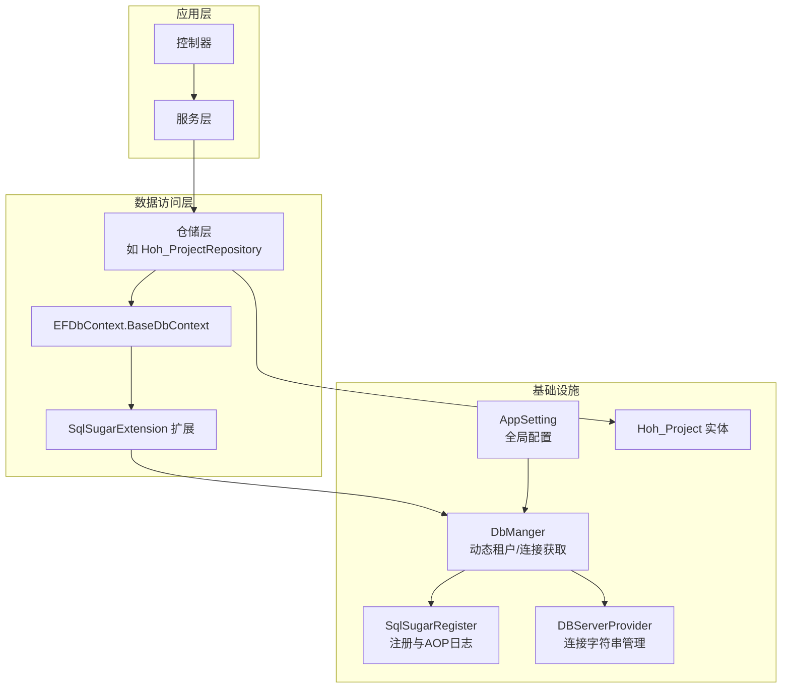
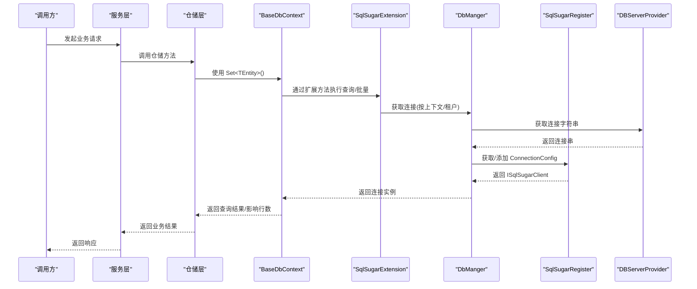
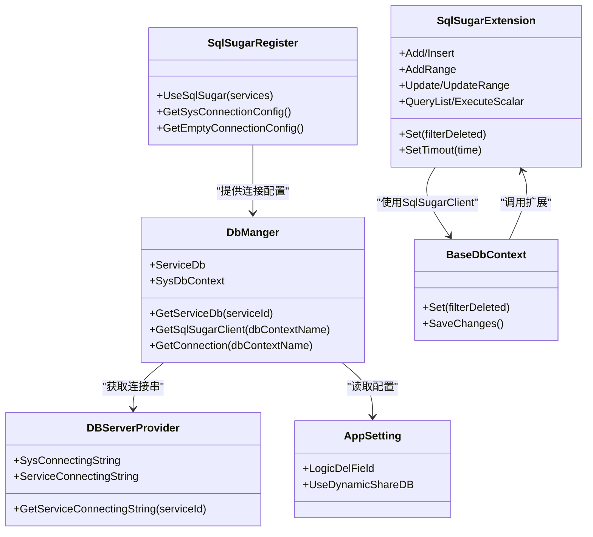

# 数据库性能优化

<cite>
**本文引用的文件**
- [VolPro.Core/DbSqlSugar/SqlSugarRegister.cs](file://VolPro.Core/DbSqlSugar/SqlSugarRegister.cs)
- [VolPro.Core/DbSqlSugar/DbManger.cs](file://VolPro.Core/DbSqlSugar/DbManger.cs)
- [VolPro.Core/DbSqlSugar/SqlSugarExtension.cs](file://VolPro.Core/DbSqlSugar/SqlSugarExtension.cs)
- [VolPro.Core/EFDbContext/BaseDbContext.cs](file://VolPro.Core/EFDbContext/BaseDbContext.cs)
- [VolPro.Core/EFDbContext/DbContext.cs](file://VolPro.Core/EFDbContext/DbContext.cs)
- [VolPro.Core/DbManager/DBServerProvider.cs](file://VolPro.Core/DbManager/DBServerProvider.cs)
- [VolPro.Core/Configuration/AppSetting.cs](file://VolPro.Core/Configuration/AppSetting.cs)
- [VolPro.Entity/DomainModels/Hoh/Hoh_Project.cs](file://VolPro.Entity/DomainModels/Hoh/Hoh_Project.cs)
- [Hncdi.HeatOfHydration/Repositories/Hoh/Hoh_ProjectRepository.cs](file://Hncdi.HeatOfHydration/Repositories/Hoh/Hoh_ProjectRepository.cs)
</cite>

## 目录
1. [简介](#简介)
2. [项目结构](#项目结构)
3. [核心组件](#核心组件)
4. [架构总览](#架构总览)
5. [详细组件分析](#详细组件分析)
6. [依赖关系分析](#依赖关系分析)
7. [性能考虑](#性能考虑)
8. [故障排查指南](#故障排查指南)
9. [结论](#结论)
10. [附录](#附录)

## 简介
本指南面向“水化热平台”的数据库性能优化，聚焦以下目标：
- 基于 SqlSugar 的性能优化配置：连接池与连接复用、查询优化、批量操作、超时控制与日志监控。
- 数据库索引设计原则与查询计划分析方法。
- EF Core 的性能优化技巧：延迟加载、贪婪加载与 NoTracking 查询。
- 数据库连接管理策略：连接复用、动态租户分库、连接字符串管理。
- 慢查询分析与性能监控工具使用建议。
- 数据库架构优化建议与分区策略。

## 项目结构
围绕数据库访问的关键模块包括：
- SqlSugar 注册与连接管理：负责多库配置、连接复用、AOP 日志与列名映射。
- EF DbContext 抽象：桥接 EF 与 SqlSugar，支持逻辑删除与队列保存。
- 连接字符串与数据库类型管理：集中配置与动态租户分库。
- 实体与仓储：示例实体与仓储体现数据模型与访问层组织方式。

图表来源
- [VolPro.Core/DbSqlSugar/SqlSugarRegister.cs:76-131](file://VolPro.Core/DbSqlSugar/SqlSugarRegister.cs#L76-L131)
- [VolPro.Core/DbSqlSugar/DbManger.cs:26-131](file://VolPro.Core/DbSqlSugar/DbManger.cs#L26-L131)
- [VolPro.Core/DbSqlSugar/SqlSugarExtension.cs:23-229](file://VolPro.Core/DbSqlSugar/SqlSugarExtension.cs#L23-L229)
- [VolPro.Core/EFDbContext/BaseDbContext.cs:32-40](file://VolPro.Core/EFDbContext/BaseDbContext.cs#L32-L40)
- [VolPro.Core/DbManager/DBServerProvider.cs:108-127](file://VolPro.Core/DbManager/DBServerProvider.cs#L108-L127)
- [VolPro.Entity/DomainModels/Hoh/Hoh_Project.cs:17-29](file://VolPro.Entity/DomainModels/Hoh/Hoh_Project.cs#L17-L29)
- [Hncdi.HeatOfHydration/Repositories/Hoh/Hoh_ProjectRepository.cs:13-23](file://Hncdi.HeatOfHydration/Repositories/Hoh/Hoh_ProjectRepository.cs#L13-L23)

章节来源
- [VolPro.Core/DbSqlSugar/SqlSugarRegister.cs:23-131](file://VolPro.Core/DbSqlSugar/SqlSugarRegister.cs#L23-L131)
- [VolPro.Core/DbSqlSugar/DbManger.cs:21-159](file://VolPro.Core/DbSqlSugar/DbManger.cs#L21-L159)
- [VolPro.Core/DbSqlSugar/SqlSugarExtension.cs:20-229](file://VolPro.Core/DbSqlSugar/SqlSugarExtension.cs#L20-L229)
- [VolPro.Core/EFDbContext/BaseDbContext.cs:18-40](file://VolPro.Core/EFDbContext/BaseDbContext.cs#L18-L40)
- [VolPro.Core/DbManager/DBServerProvider.cs:28-139](file://VolPro.Core/DbManager/DBServerProvider.cs#L28-L139)
- [VolPro.Entity/DomainModels/Hoh/Hoh_Project.cs:17-29](file://VolPro.Entity/DomainModels/Hoh/Hoh_Project.cs#L17-L29)
- [Hncdi.HeatOfHydration/Repositories/Hoh/Hoh_ProjectRepository.cs:13-23](file://Hncdi.HeatOfHydration/Repositories/Hoh/Hoh_ProjectRepository.cs#L13-L23)

## 核心组件
- SqlSugarRegister：集中注册多个 ConnectionConfig，启用自动关闭连接、AOP 日志、列名映射等。
- DbManger：动态租户分库、按上下文获取连接、系统库与业务库统一入口。
- SqlSugarExtension：批量插入/更新队列、逻辑删除过滤、SQL 执行扩展、超时设置接口。
- EFDbContext.BaseDbContext：桥接 EF 与 SqlSugar，暴露 Set<TEntity>() 与 SaveQueues()。
- DBServerProvider：根据上下文名称获取连接字符串，支持动态租户。
- AppSetting：全局配置项，含逻辑删除字段、雪花算法开关、动态分库开关等。

章节来源
- [VolPro.Core/DbSqlSugar/SqlSugarRegister.cs:23-155](file://VolPro.Core/DbSqlSugar/SqlSugarRegister.cs#L23-L155)
- [VolPro.Core/DbSqlSugar/DbManger.cs:21-159](file://VolPro.Core/DbSqlSugar/DbManger.cs#L21-L159)
- [VolPro.Core/DbSqlSugar/SqlSugarExtension.cs:20-229](file://VolPro.Core/DbSqlSugar/SqlSugarExtension.cs#L20-L229)
- [VolPro.Core/EFDbContext/BaseDbContext.cs:18-40](file://VolPro.Core/EFDbContext/BaseDbContext.cs#L18-L40)
- [VolPro.Core/DbManager/DBServerProvider.cs:28-139](file://VolPro.Core/DbManager/DBServerProvider.cs#L28-L139)
- [VolPro.Core/Configuration/AppSetting.cs:13-174](file://VolPro.Core/Configuration/AppSetting.cs#L13-L174)

## 架构总览
SqlSugar 在本项目中承担主要的 ORM 能力，EF DbContext 提供抽象与桥接，DbManger 统一连接管理，AppSetting 提供全局配置。动态租户通过 DbManger.ServiceDb 与 DBServerProvider.ServiceConnectingString 实现。

图表来源
- [VolPro.Core/EFDbContext/BaseDbContext.cs:32-40](file://VolPro.Core/EFDbContext/BaseDbContext.cs#L32-L40)
- [VolPro.Core/DbSqlSugar/SqlSugarExtension.cs:194-229](file://VolPro.Core/DbSqlSugar/SqlSugarExtension.cs#L194-L229)
- [VolPro.Core/DbSqlSugar/DbManger.cs:115-131](file://VolPro.Core/DbSqlSugar/DbManger.cs#L115-L131)
- [VolPro.Core/DbSqlSugar/SqlSugarRegister.cs:76-131](file://VolPro.Core/DbSqlSugar/SqlSugarRegister.cs#L76-L131)
- [VolPro.Core/DbManager/DBServerProvider.cs:108-127](file://VolPro.Core/DbManager/DBServerProvider.cs#L108-L127)

## 详细组件分析

### SqlSugar 注册与连接池配置
- 多库注册：通过遍历配置缓存生成多个 ConnectionConfig，并统一注入到 SqlSugarScope。
- 自动关闭连接：IsAutoCloseConnection=true，减少连接泄漏风险。
- AOP 日志：对业务库与全局设置 OnLogExecuting，便于慢查询定位。
- 列名映射：ConfigureExternalServices 对特定数据库（如达梦 DM）进行列名全大写处理。
- 系统库与空库：分别提供系统库与模板空库配置，满足后台任务与动态租户场景。

章节来源
- [VolPro.Core/DbSqlSugar/SqlSugarRegister.cs:30-131](file://VolPro.Core/DbSqlSugar/SqlSugarRegister.cs#L30-L131)
- [VolPro.Core/DbSqlSugar/SqlSugarRegister.cs:137-151](file://VolPro.Core/DbSqlSugar/SqlSugarRegister.cs#L137-L151)

### 动态租户与连接管理
- 动态租户：DbManger.ServiceDb 与 GetServiceDb(Guid) 支持按租户动态添加连接并获取。
- 上下文路由：GetConnection 根据 DbContext 名称返回系统库或业务库。
- 连接字符串：DBServerProvider.SysConnectingString 与 ServiceConnectingString 提供系统与业务库连接串；动态租户优先使用当前用户服务ID对应的连接串。

章节来源
- [VolPro.Core/DbSqlSugar/DbManger.cs:26-90](file://VolPro.Core/DbSqlSugar/DbManger.cs#L26-L90)
- [VolPro.Core/DbSqlSugar/DbManger.cs:115-131](file://VolPro.Core/DbSqlSugar/DbManger.cs#L115-L131)
- [VolPro.Core/DbManager/DBServerProvider.cs:108-136](file://VolPro.Core/DbManager/DBServerProvider.cs#L108-L136)

### 批量操作与队列保存
- 批量插入：Insertable(...).AddQueue() + SaveQueues()/SaveQueuesAsync()，支持单条与列表。
- 分表插入：针对带分表特性的实体，使用 SplitTable() 直接执行。
- 批量更新：UpdateRange(...) 支持指定属性更新，避免全量更新；可结合分表执行。
- 队列保存：SaveQueues()/SaveQueuesAsync() 将多次变更合并提交，降低往返次数。

章节来源
- [VolPro.Core/DbSqlSugar/SqlSugarExtension.cs:23-154](file://VolPro.Core/DbSqlSugar/SqlSugarExtension.cs#L23-L154)
- [VolPro.Core/DbSqlSugar/SqlSugarExtension.cs:53-81](file://VolPro.Core/DbSqlSugar/SqlSugarExtension.cs#L53-L81)

### 查询优化与逻辑删除
- 逻辑删除过滤：Set<TEntity>(filterDeleted=true) 会基于 AppSetting.LogicDelField 自动追加过滤条件。
- 查询扩展：FirstOrDefault/First/Includes/OrderByDescending 等扩展方法简化查询链。
- SQL 直连：QueryList/ExecuteScalar/ExcuteNonQuery 支持原生 SQL 与参数化执行。

章节来源
- [VolPro.Core/DbSqlSugar/SqlSugarExtension.cs:157-229](file://VolPro.Core/DbSqlSugar/SqlSugarExtension.cs#L157-L229)
- [VolPro.Core/Configuration/AppSetting.cs:68-125](file://VolPro.Core/Configuration/AppSetting.cs#L68-L125)

### EF Core 集成与性能要点
- 桥接 EF 与 SqlSugar：BaseDbContext.Set<TEntity>() 返回 SqlSugar 的可查询对象，便于统一使用队列保存与批量操作。
- 保存变更：SaveChanges() 调用 SaveQueues() 合并提交。
- 逻辑删除：通过 Set<TEntity>() 的 filterDeleted 参数实现统一过滤。

章节来源
- [VolPro.Core/EFDbContext/BaseDbContext.cs:32-40](file://VolPro.Core/EFDbContext/BaseDbContext.cs#L32-L40)

### 示例实体与仓储
- 实体标注：Hoh_Project 使用 Entity 特性标注表名、数据库服务器标识等。
- 仓储组织：Hoh_ProjectRepository 继承 RepositoryBase 并注入 ServiceDbContext，体现仓储模式。

章节来源
- [VolPro.Entity/DomainModels/Hoh/Hoh_Project.cs:17-29](file://VolPro.Entity/DomainModels/Hoh/Hoh_Project.cs#L17-L29)
- [Hncdi.HeatOfHydration/Repositories/Hoh/Hoh_ProjectRepository.cs:13-23](file://Hncdi.HeatOfHydration/Repositories/Hoh/Hoh_ProjectRepository.cs#L13-L23)

## 依赖关系分析
- SqlSugarRegister 依赖 DbManger、DBServerProvider、AppSetting、EFDbContext。
- DbManger 依赖 DBServerProvider、UserContext、Autofac 容器。
- SqlSugarExtension 依赖 ISqlSugarClient、AppSetting。
- BaseDbContext 依赖 SqlSugarClient 与 EF DbContext 抽象。
- 实体与仓储分别位于 Entity 与 Hncdi.HeatOfHydration 工程，通过接口与扩展解耦。

图表来源
- [VolPro.Core/DbSqlSugar/SqlSugarRegister.cs:76-131](file://VolPro.Core/DbSqlSugar/SqlSugarRegister.cs#L76-L131)
- [VolPro.Core/DbSqlSugar/DbManger.cs:26-131](file://VolPro.Core/DbSqlSugar/DbManger.cs#L26-L131)
- [VolPro.Core/DbSqlSugar/SqlSugarExtension.cs:23-229](file://VolPro.Core/DbSqlSugar/SqlSugarExtension.cs#L23-L229)
- [VolPro.Core/EFDbContext/BaseDbContext.cs:32-40](file://VolPro.Core/EFDbContext/BaseDbContext.cs#L32-L40)
- [VolPro.Core/DbManager/DBServerProvider.cs:108-136](file://VolPro.Core/DbManager/DBServerProvider.cs#L108-L136)
- [VolPro.Core/Configuration/AppSetting.cs:68-131](file://VolPro.Core/Configuration/AppSetting.cs#L68-L131)

章节来源
- [VolPro.Core/DbSqlSugar/SqlSugarRegister.cs:76-131](file://VolPro.Core/DbSqlSugar/SqlSugarRegister.cs#L76-L131)
- [VolPro.Core/DbSqlSugar/DbManger.cs:26-131](file://VolPro.Core/DbSqlSugar/DbManger.cs#L26-L131)
- [VolPro.Core/DbSqlSugar/SqlSugarExtension.cs:23-229](file://VolPro.Core/DbSqlSugar/SqlSugarExtension.cs#L23-L229)
- [VolPro.Core/EFDbContext/BaseDbContext.cs:32-40](file://VolPro.Core/EFDbContext/BaseDbContext.cs#L32-L40)
- [VolPro.Core/DbManager/DBServerProvider.cs:108-136](file://VolPro.Core/DbManager/DBServerProvider.cs#L108-L136)
- [VolPro.Core/Configuration/AppSetting.cs:68-131](file://VolPro.Core/Configuration/AppSetting.cs#L68-L131)

## 性能考虑

### SqlSugar 性能优化配置
- 连接池与连接复用
  - 使用 SqlSugarScope 管理多连接，避免频繁创建销毁连接。
  - IsAutoCloseConnection=true 可减少连接泄漏，但需确保在请求生命周期内复用同一连接。
- AOP 日志与慢查询定位
  - OnLogExecuting 输出 SQL，便于识别慢查询与重复执行。
  - 建议仅在调试环境开启日志，生产环境关闭或降级。
- 批量操作
  - 插入/更新使用 AddQueue/UpdateRange + SaveQueues，减少网络往返。
  - 分表实体使用 SplitTable() 直接执行，避免队列合并带来的额外开销。
- 超时控制
  - 提供 SetTimout 接口，可在关键路径设置合理超时，避免阻塞。
- 列名映射
  - 对特定数据库（如 DM）进行列名全大写映射，避免大小写导致的索引失效。

章节来源
- [VolPro.Core/DbSqlSugar/SqlSugarRegister.cs:34-47](file://VolPro.Core/DbSqlSugar/SqlSugarRegister.cs#L34-L47)
- [VolPro.Core/DbSqlSugar/SqlSugarRegister.cs:115-126](file://VolPro.Core/DbSqlSugar/SqlSugarRegister.cs#L115-L126)
- [VolPro.Core/DbSqlSugar/SqlSugarExtension.cs:23-81](file://VolPro.Core/DbSqlSugar/SqlSugarExtension.cs#L23-L81)
- [VolPro.Core/DbSqlSugar/SqlSugarExtension.cs:220-224](file://VolPro.Core/DbSqlSugar/SqlSugarExtension.cs#L220-L224)
- [VolPro.Core/DbSqlSugar/SqlSugarRegister.cs:142-150](file://VolPro.Core/DbSqlSugar/SqlSugarRegister.cs#L142-L150)

### EF Core 性能优化技巧
- 延迟加载
  - 默认启用延迟加载，适合按需加载关联数据，但可能引发 N+1 查询问题。
- 贪婪加载
  - 使用 Include/ThenInclude 预加载必要关联，减少查询次数。
- NoTracking 查询
  - 对只读查询使用 AsNoTracking，避免跟踪变更，降低内存与 CPU 开销。
- 逻辑删除
  - 通过 BaseDbContext.Set<TEntity>(filterDeleted=true) 统一过滤逻辑删除记录，避免重复判断。

章节来源
- [VolPro.Core/EFDbContext/BaseDbContext.cs:32-40](file://VolPro.Core/EFDbContext/BaseDbContext.cs#L32-L40)
- [VolPro.Core/DbSqlSugar/SqlSugarExtension.cs:194-206](file://VolPro.Core/DbSqlSugar/SqlSugarExtension.cs#L194-L206)

### 数据库索引设计原则与查询计划分析
- 设计原则
  - 为高频过滤/排序/连接字段建立合适索引，避免全表扫描。
  - 联合索引遵循“最左前缀”原则，匹配查询条件中最左侧的列。
  - 控制索引数量，平衡写入性能与查询性能。
- 查询计划分析
  - 使用数据库自带的执行计划分析工具（如 SQL Server Management Studio 的“显示估计的执行计划”或“实际执行计划”）。
  - 关注关键指标：索引命中率、扫描深度、排序/哈希警告、远程查询等。
  - 结合 AOP 日志输出的 SQL，定位热点查询并针对性优化。

（本节为通用指导，不直接分析具体文件）

### 数据库连接管理策略
- 连接复用
  - 在请求生命周期内复用同一 ISqlSugarClient 或 SqlSugarScope，避免频繁创建。
- 动态租户分库
  - 通过 DbManger.ServiceDb 与 DBServerProvider.ServiceConnectingString 动态切换租户库。
- 超时配置
  - 使用 SetTimout 接口设置命令超时，防止长时间阻塞。
- 配置集中化
  - 通过 AppSetting 与 DBServerProvider 统一管理连接字符串与数据库类型。

章节来源
- [VolPro.Core/DbSqlSugar/DbManger.cs:26-90](file://VolPro.Core/DbSqlSugar/DbManger.cs#L26-L90)
- [VolPro.Core/DbManager/DBServerProvider.cs:108-136](file://VolPro.Core/DbManager/DBServerProvider.cs#L108-L136)
- [VolPro.Core/DbSqlSugar/SqlSugarExtension.cs:220-224](file://VolPro.Core/DbSqlSugar/SqlSugarExtension.cs#L220-L224)
- [VolPro.Core/Configuration/AppSetting.cs:68-131](file://VolPro.Core/Configuration/AppSetting.cs#L68-L131)

### 慢查询分析与性能监控
- 慢查询定位
  - 启用 AOP 日志输出 SQL，结合数据库慢查询日志筛选耗时长的语句。
- 性能监控
  - 建议集成数据库性能视图与 APM 工具，持续观察关键指标（QPS、P95/P99 延迟、锁等待、索引使用率）。
- 优化闭环
  - 以监控数据驱动索引与 SQL 优化，形成“观测—分析—优化—验证”的闭环。

（本节为通用指导，不直接分析具体文件）

### 数据库架构优化与分区策略
- 架构优化
  - 读写分离：将只读查询路由至从库，写入集中在主库。
  - 垂直分库：按业务域拆分库，降低单库压力。
- 分区策略
  - 时间分区：对按时间增长的表（如日志、统计数据）按月/季度分区，提升归档与清理效率。
  - 哈希分区：对高并发写入场景按业务键哈希分区，均衡写入压力。
- 注意事项
  - 分区键选择需与查询模式匹配，避免跨分区扫描。
  - 分区维护需自动化，避免人工干预导致的运维成本上升。

（本节为通用指导，不直接分析具体文件）

## 故障排查指南
- SQL 输出与日志
  - 检查 OnLogExecuting 是否正确输出 SQL，确认是否存在重复执行或未命中索引的查询。
- 逻辑删除未生效
  - 确认 AppSetting.LogicDelField 配置正确，且实体具备对应字段。
- 批量操作未提交
  - 确认 SaveQueues()/SaveQueuesAsync() 已调用，或 saveChange 参数已启用。
- 动态租户连接失败
  - 检查 DBServerProvider.ServiceConnectingString 与 DbManger.GetServiceDb(Guid) 的连接串是否正确。
- 超时问题
  - 使用 SetTimout 接口设置合理超时，避免长时间阻塞。

章节来源
- [VolPro.Core/DbSqlSugar/SqlSugarRegister.cs:115-126](file://VolPro.Core/DbSqlSugar/SqlSugarRegister.cs#L115-L126)
- [VolPro.Core/DbSqlSugar/SqlSugarExtension.cs:194-229](file://VolPro.Core/DbSqlSugar/SqlSugarExtension.cs#L194-L229)
- [VolPro.Core/DbManager/DBServerProvider.cs:108-136](file://VolPro.Core/DbManager/DBServerProvider.cs#L108-L136)
- [VolPro.Core/Configuration/AppSetting.cs:68-131](file://VolPro.Core/Configuration/AppSetting.cs#L68-L131)

## 结论
本指南基于现有代码结构总结了 SqlSugar 与 EF Core 的性能优化实践，重点覆盖连接管理、批量操作、逻辑删除、查询扩展与动态租户分库。建议在生产环境中结合数据库执行计划与 APM 监控，持续迭代索引与 SQL，配合读写分离与分区策略，进一步提升系统整体性能与稳定性。

## 附录
- 关键配置项参考
  - 逻辑删除字段：AppSetting.LogicDelField
  - 动态分库开关：AppSetting.UseDynamicShareDB
  - 连接字符串：DBServerProvider.SysConnectingString / ServiceConnectingString
- 示例实体与仓储
  - Hoh_Project 实体用于监控部位数据，仓储体现标准访问层组织方式。

章节来源
- [VolPro.Core/Configuration/AppSetting.cs:68-131](file://VolPro.Core/Configuration/AppSetting.cs#L68-L131)
- [VolPro.Core/DbManager/DBServerProvider.cs:108-136](file://VolPro.Core/DbManager/DBServerProvider.cs#L108-L136)
- [VolPro.Entity/DomainModels/Hoh/Hoh_Project.cs:17-29](file://VolPro.Entity/DomainModels/Hoh/Hoh_Project.cs#L17-L29)
- [Hncdi.HeatOfHydration/Repositories/Hoh/Hoh_ProjectRepository.cs:13-23](file://Hncdi.HeatOfHydration/Repositories/Hoh/Hoh_ProjectRepository.cs#L13-L23)