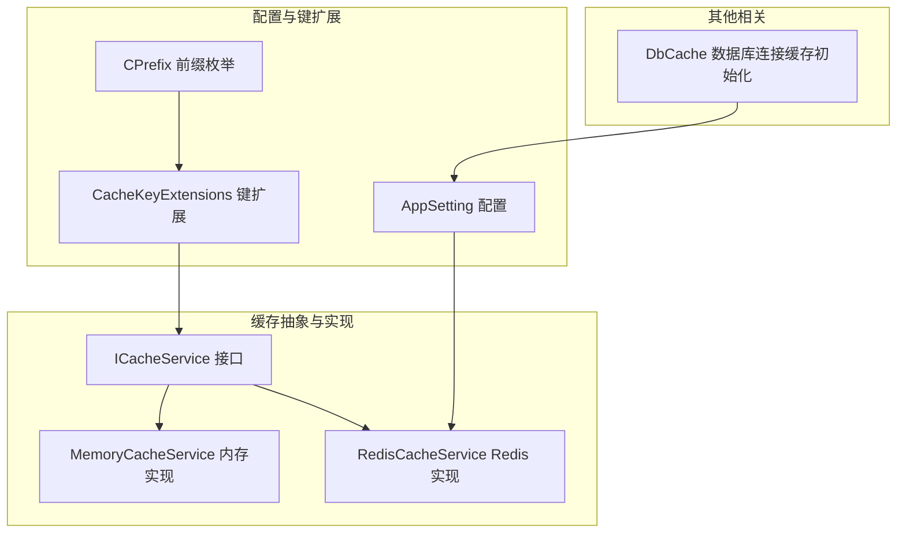
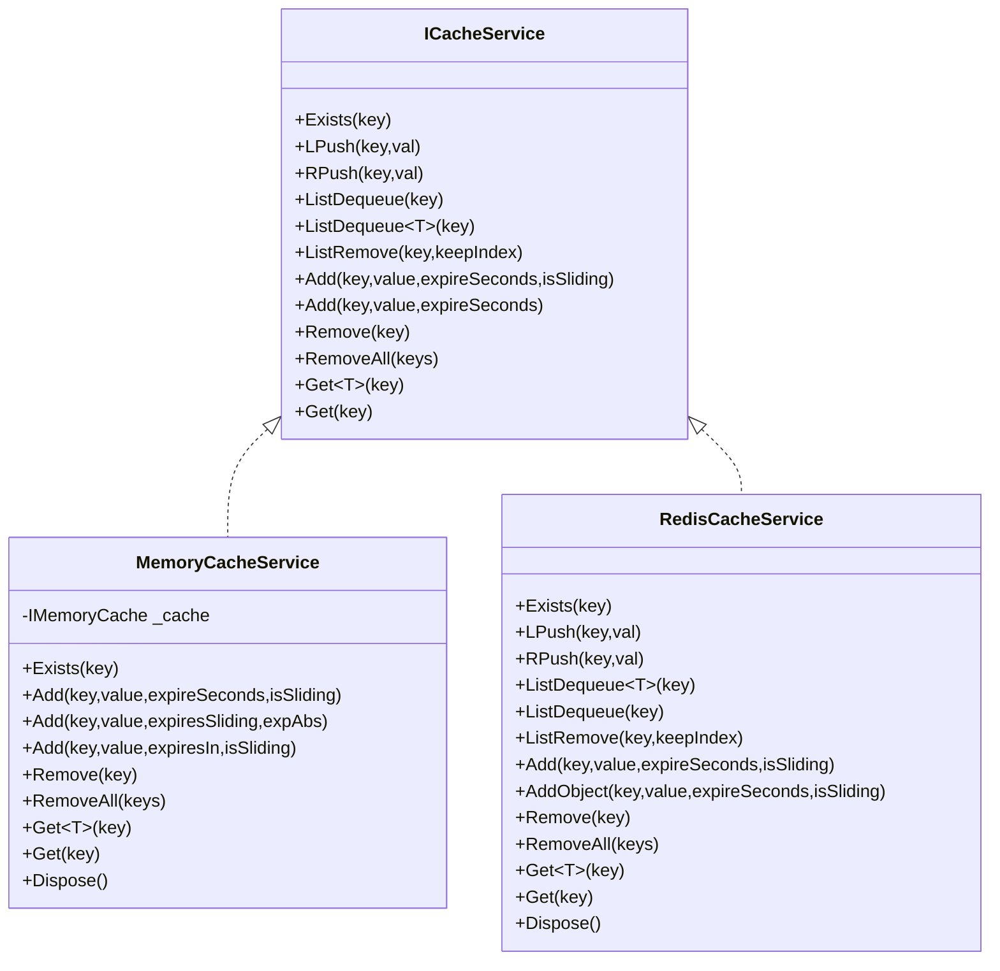
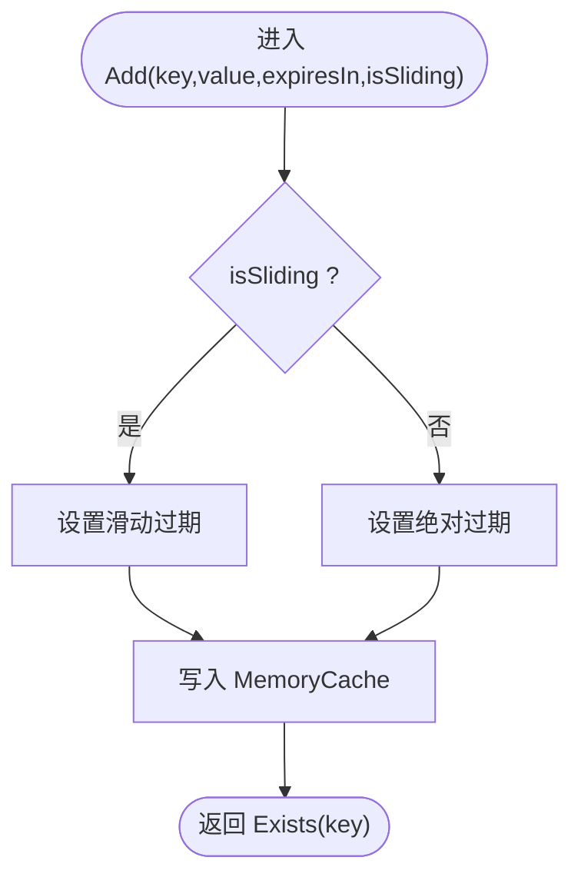
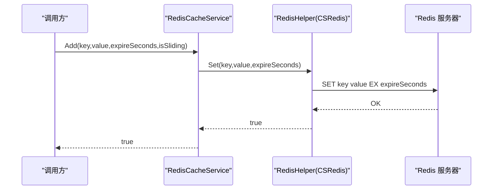
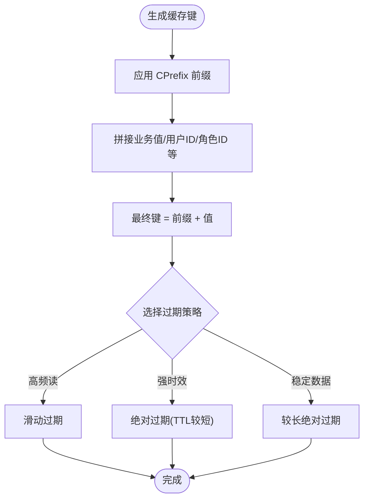
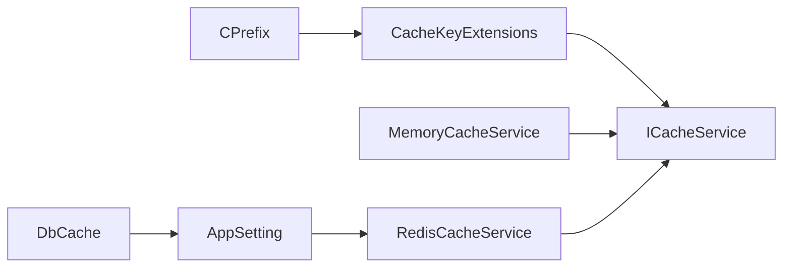

# 缓存策略优化

<cite>
**本文引用的文件**
- [ICacheService.cs](file://VolPro.Core/CacheManager/IService/ICacheService.cs)
- [MemoryCacheService.cs](file://VolPro.Core/CacheManager/Service/MemoryCacheService .cs)
- [RedisCacheService.cs](file://VolPro.Core/CacheManager/Service/RedisCacheService.cs)
- [AppSetting.cs](file://VolPro.Core/Configuration/AppSetting.cs)
- [CacheKeyExtensions.cs](file://VolPro.Core/Extensions/CacheKeyExtensions.cs)
- [CPrefix.cs](file://VolPro.Core/Enums/CPrefix.cs)
- [DbCache.cs](file://VolPro.Core/CacheManager/DbCache.cs)
</cite>

## 目录
1. [简介](#简介)
2. [项目结构](#项目结构)
3. [核心组件](#核心组件)
4. [架构总览](#架构总览)
5. [详细组件分析](#详细组件分析)
6. [依赖关系分析](#依赖关系分析)
7. [性能考量与监控](#性能考量与监控)
8. [故障排查指南](#故障排查指南)
9. [结论](#结论)
10. [附录](#附录)

## 简介
本文件面向“水化热平台”的缓存策略优化，系统化阐述 ICacheService 接口的设计与实现，覆盖内存缓存与 Redis 缓存的配置与使用；明确缓存键设计原则（命名规范、过期策略、滑动过期）；给出命中率优化技巧（预热、热点处理、穿透防护）；说明分布式缓存一致性与失效策略；并提供性能监控指标与调优方法，最后结合平台业务场景给出可落地的最佳实践与使用案例。

## 项目结构
围绕缓存的关键代码位于 VolPro.Core 的 CacheManager 与 Configuration、Extensions、Enums 子模块中，形成“接口抽象 + 多种实现 + 配置 + 键扩展”的清晰分层。

**图示来源**
- [ICacheService.cs:1-96](file://VolPro.Core/CacheManager/IService/ICacheService.cs#L1-L96)
- [MemoryCacheService.cs:1-190](file://VolPro.Core/CacheManager/Service/MemoryCacheService .cs#L1-L190)
- [RedisCacheService.cs:1-120](file://VolPro.Core/CacheManager/Service/RedisCacheService.cs#L1-L120)
- [AppSetting.cs:1-237](file://VolPro.Core/Configuration/AppSetting.cs#L1-L237)
- [CacheKeyExtensions.cs:1-24](file://VolPro.Core/Extensions/CacheKeyExtensions.cs#L1-L24)
- [CPrefix.cs:1-23](file://VolPro.Core/Enums/CPrefix.cs#L1-L23)
- [DbCache.cs:1-133](file://VolPro.Core/CacheManager/DbCache.cs#L1-L133)

**章节来源**
- [ICacheService.cs:1-96](file://VolPro.Core/CacheManager/IService/ICacheService.cs#L1-L96)
- [MemoryCacheService.cs:1-190](file://VolPro.Core/CacheManager/Service/MemoryCacheService .cs#L1-L190)
- [RedisCacheService.cs:1-120](file://VolPro.Core/CacheManager/Service/RedisCacheService.cs#L1-L120)
- [AppSetting.cs:1-237](file://VolPro.Core/Configuration/AppSetting.cs#L1-L237)
- [CacheKeyExtensions.cs:1-24](file://VolPro.Core/Extensions/CacheKeyExtensions.cs#L1-L24)
- [CPrefix.cs:1-23](file://VolPro.Core/Enums/CPrefix.cs#L1-L23)
- [DbCache.cs:1-133](file://VolPro.Core/CacheManager/DbCache.cs#L1-L133)

## 核心组件
- ICacheService：统一的缓存抽象接口，定义了键存在性检查、列表操作（LPush/RPush/LPop）、添加/删除/批量删除、以及泛型/字符串的获取与带过期参数的添加等能力。
- MemoryCacheService：基于 .NET MemoryCache 的本地实现，支持绝对过期与滑动过期两种策略。
- RedisCacheService：基于 CSRedis 的分布式实现，负责连接初始化、键存在性检查、增删改查、列表操作与批量删除。
- AppSetting：集中式配置入口，提供 Redis 连接串、是否启用 Redis 等关键开关。
- CacheKeyExtensions + CPrefix：提供键前缀与组合规则，确保键空间有序、可维护。
- DbCache：数据库连接信息的缓存与初始化工具，间接影响缓存层对数据源的访问稳定性。

**章节来源**
- [ICacheService.cs:1-96](file://VolPro.Core/CacheManager/IService/ICacheService.cs#L1-L96)
- [MemoryCacheService.cs:1-190](file://VolPro.Core/CacheManager/Service/MemoryCacheService .cs#L1-L190)
- [RedisCacheService.cs:1-120](file://VolPro.Core/CacheManager/Service/RedisCacheService.cs#L1-L120)
- [AppSetting.cs:1-237](file://VolPro.Core/Configuration/AppSetting.cs#L1-L237)
- [CacheKeyExtensions.cs:1-24](file://VolPro.Core/Extensions/CacheKeyExtensions.cs#L1-L24)
- [CPrefix.cs:1-23](file://VolPro.Core/Enums/CPrefix.cs#L1-L23)
- [DbCache.cs:1-133](file://VolPro.Core/CacheManager/DbCache.cs#L1-L133)

## 架构总览
缓存层采用“接口 + 多实现”的策略，运行时根据配置选择内存或 Redis 实现。键空间由前缀与业务值组合而成，便于隔离与治理。列表操作在 Redis 实现中可用，在内存实现中为空操作（不抛错但无副作用），调用方需注意兼容性。

**图示来源**
- [ICacheService.cs:1-96](file://VolPro.Core/CacheManager/IService/ICacheService.cs#L1-L96)
- [MemoryCacheService.cs:1-190](file://VolPro.Core/CacheManager/Service/MemoryCacheService .cs#L1-L190)
- [RedisCacheService.cs:1-120](file://VolPro.Core/CacheManager/Service/RedisCacheService.cs#L1-L120)

## 详细组件分析

### ICacheService 接口设计
- 职责边界清晰：统一缓存 CRUD、存在性检查、列表队列操作、批量删除与带过期参数的添加。
- 兼容性考虑：列表操作在内存实现中为空实现，调用方应避免强依赖。
- 泛型与字符串双通道：Get<T>/Get 支持不同序列化/反序列化场景。

**章节来源**
- [ICacheService.cs:1-96](file://VolPro.Core/CacheManager/IService/ICacheService.cs#L1-L96)

### MemoryCacheService 实现
- 过期策略：
  - 绝对过期：通过 SetAbsoluteExpiration 设置。
  - 滑动过期：通过 SetSlidingExpiration 设置，若在过期窗口内访问则刷新。
- 列表操作：空实现，不会产生异常，但也不会持久化。
- 生命周期：实现 IDisposable，便于资源释放。

**图示来源**
- [MemoryCacheService.cs:97-129](file://VolPro.Core/CacheManager/Service/MemoryCacheService .cs#L97-L129)

**章节来源**
- [MemoryCacheService.cs:1-190](file://VolPro.Core/CacheManager/Service/MemoryCacheService .cs#L1-L190)

### RedisCacheService 实现
- 初始化：构造函数中使用 AppSetting 中的 Redis 连接串初始化 CSRedis 客户端。
- 列表操作：基于 RPush/LPop/RPop/LTrim 实现，适合消息队列/滚动窗口等场景。
- 批量删除：Del 支持数组批量键删除。
- 过期策略：Set 支持秒级过期，滑动过期参数在该实现中未直接使用，实际行为取决于底层客户端配置。

**图示来源**
- [RedisCacheService.cs:69-76](file://VolPro.Core/CacheManager/Service/RedisCacheService.cs#L69-L76)
- [AppSetting.cs:22-30](file://VolPro.Core/Configuration/AppSetting.cs#L22-L30)

**章节来源**
- [RedisCacheService.cs:1-120](file://VolPro.Core/CacheManager/Service/RedisCacheService.cs#L1-L120)
- [AppSetting.cs:1-237](file://VolPro.Core/Configuration/AppSetting.cs#L1-L237)

### 缓存键设计原则
- 命名规范：
  - 使用 CPrefix 枚举作为键前缀，结合业务实体/维度值拼接，确保键空间隔离与可读性。
  - 提供扩展方法将前缀与具体值组合，避免硬编码。
- 过期策略：
  - 对于高频读取且变更不频繁的数据，采用绝对过期或滑动过期结合。
  - 对于时效性强的数据，采用短 TTL 并配合预热。
- 滑动过期机制：
  - 在内存实现中可通过滑动过期延长生命周期；在 Redis 实现中需确保客户端支持或通过定期续期策略实现。

**图示来源**
- [CacheKeyExtensions.cs:1-24](file://VolPro.Core/Extensions/CacheKeyExtensions.cs#L1-L24)
- [CPrefix.cs:1-23](file://VolPro.Core/Enums/CPrefix.cs#L1-L23)

**章节来源**
- [CacheKeyExtensions.cs:1-24](file://VolPro.Core/Extensions/CacheKeyExtensions.cs#L1-L24)
- [CPrefix.cs:1-23](file://VolPro.Core/Enums/CPrefix.cs#L1-L23)

### 缓存命中率优化技巧
- 预热策略：
  - 启动阶段或定时任务加载热点数据到缓存，降低冷启动抖动。
- 热点数据处理：
  - 对热点键进行多副本或分片存储（在 Redis 场景下可结合集群/分片）。
  - 引入二级缓存（本地 + 远程）以减少跨网络访问。
- 缓存穿透防护：
  - 对空结果也做短 TTL 缓存，避免对后端数据库的重复冲击。
  - 使用布隆过滤器（如 Redis 的布隆过滤器模块）快速判断 Key 是否可能存在于 DB。

[本节为通用优化建议，不直接分析具体文件，故不附加章节来源]

### 分布式缓存一致性与失效策略
- 一致性：
  - 写路径采用“先更新数据库，再删除/更新缓存”，避免脏读。
  - 对于列表/队列类数据，确保原子性操作（Redis 的事务或 Lua 脚本）。
- 失效策略：
  - 主动失效：在写操作后立即删除相关键或键前缀。
  - 被动失效：依赖 TTL 自然过期，结合监控告警及时调整 TTL。

[本节为通用策略建议，不直接分析具体文件，故不附加章节来源]

### 性能监控指标与调优
- 关键指标：
  - 命中率（请求命中数/总请求数）
  - 平均响应时间（含序列化/反序列化）
  - 内存/Redis 使用量与碎片率
  - 列表操作吞吐（RPush/RPop）
- 调优方向：
  - 合理设置 TTL，避免过短导致频繁回源，过长导致内存压力。
  - 对大对象采用压缩或二进制序列化（如 MessagePack）。
  - 控制键数量与长度，避免键空间膨胀。

[本节为通用指标建议，不直接分析具体文件，故不附加章节来源]

## 依赖关系分析
- 配置依赖：RedisCacheService 依赖 AppSetting 中的 RedisConnectionString 与 UseRedis 开关。
- 键空间依赖：CacheKeyExtensions 依赖 CPrefix 枚举，确保键前缀一致。
- 数据库连接：DbCache 负责数据库连接信息的缓存与初始化，间接影响缓存层对数据源的访问稳定性。

**图示来源**
- [AppSetting.cs:1-237](file://VolPro.Core/Configuration/AppSetting.cs#L1-L237)
- [RedisCacheService.cs:1-120](file://VolPro.Core/CacheManager/Service/RedisCacheService.cs#L1-L120)
- [CacheKeyExtensions.cs:1-24](file://VolPro.Core/Extensions/CacheKeyExtensions.cs#L1-L24)
- [CPrefix.cs:1-23](file://VolPro.Core/Enums/CPrefix.cs#L1-L23)
- [DbCache.cs:1-133](file://VolPro.Core/CacheManager/DbCache.cs#L1-L133)

**章节来源**
- [AppSetting.cs:1-237](file://VolPro.Core/Configuration/AppSetting.cs#L1-L237)
- [RedisCacheService.cs:1-120](file://VolPro.Core/CacheManager/Service/RedisCacheService.cs#L1-L120)
- [CacheKeyExtensions.cs:1-24](file://VolPro.Core/Extensions/CacheKeyExtensions.cs#L1-L24)
- [CPrefix.cs:1-23](file://VolPro.Core/Enums/CPrefix.cs#L1-L23)
- [DbCache.cs:1-133](file://VolPro.Core/CacheManager/DbCache.cs#L1-L133)

## 性能考量与监控
- 内存缓存适合低延迟、单实例场景；Redis 适合多实例共享与持久化需求。
- 列表操作在 Redis 实现有完整实现，内存实现为空操作，调用方需注意兼容性。
- 建议对高频键设置滑动过期，对强时效键设置短 TTL 并配合预热。
- 结合监控指标持续迭代 TTL 与键空间设计，避免缓存雪崩与击穿。

[本节为通用性能建议，不直接分析具体文件，故不附加章节来源]

## 故障排查指南
- 常见问题：
  - Redis 连接失败：检查 AppSetting 中的 RedisConnectionString 与 UseRedis 配置。
  - 键不存在：确认键前缀与业务值拼接是否正确，以及是否被主动删除。
  - 列表操作无效：在内存实现中为空操作，需切换到 Redis 实现或自行实现。
- 排查步骤：
  - 核对配置文件与环境变量。
  - 使用 Exists(key) 验证键状态。
  - 查看日志与监控指标，定位异常峰值。

**章节来源**
- [AppSetting.cs:1-237](file://VolPro.Core/Configuration/AppSetting.cs#L1-L237)
- [RedisCacheService.cs:1-120](file://VolPro.Core/CacheManager/Service/RedisCacheService.cs#L1-L120)
- [MemoryCacheService.cs:1-190](file://VolPro.Core/CacheManager/Service/MemoryCacheService .cs#L1-L190)

## 结论
通过统一的 ICacheService 抽象与内存/Redis 双实现，平台可在不同部署形态下灵活切换缓存方案。结合规范化的键设计、合理的过期与滑动过期策略、以及预热与穿透防护等手段，可显著提升缓存命中率与系统整体性能。建议持续监控关键指标并迭代优化 TTL 与键空间设计，确保缓存层稳定高效。

[本节为总结性内容，不直接分析具体文件，故不附加章节来源]

## 附录

### 实际使用案例与最佳实践
- 用户登录态缓存：
  - 键设计：使用 CPrefix.Token + 用户ID 组合，TTL 设为 Token 有效期。
  - 过期策略：滑动过期，保持活跃会话不被频繁踢出。
- 角色/权限缓存：
  - 键设计：使用 CPrefix.Role + 角色ID，TTL 设为较短周期，定期刷新。
  - 防穿透：空结果也缓存短 TTL，避免对后端查询风暴。
- 列表/滚动窗口：
  - 使用 Redis 的列表操作（RPush/RPop/LTrim）实现消息队列或最近 N 条记录窗口。
  - 注意在内存实现中列表操作为空实现，需在 Redis 实现中使用。
- 数据库连接信息缓存：
  - 使用 DbCache 缓存 Sys_DbService 列表，减少数据库查询开销，配合 Reload 机制按需重载。

**章节来源**
- [CacheKeyExtensions.cs:1-24](file://VolPro.Core/Extensions/CacheKeyExtensions.cs#L1-L24)
- [CPrefix.cs:1-23](file://VolPro.Core/Enums/CPrefix.cs#L1-L23)
- [RedisCacheService.cs:1-120](file://VolPro.Core/CacheManager/Service/RedisCacheService.cs#L1-L120)
- [MemoryCacheService.cs:1-190](file://VolPro.Core/CacheManager/Service/MemoryCacheService .cs#L1-L190)
- [DbCache.cs:1-133](file://VolPro.Core/CacheManager/DbCache.cs#L1-L133)