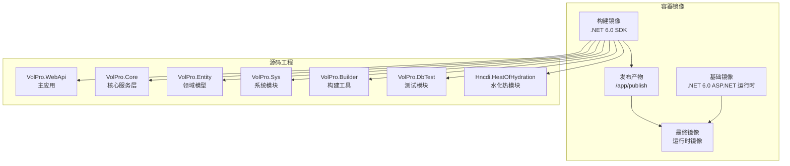
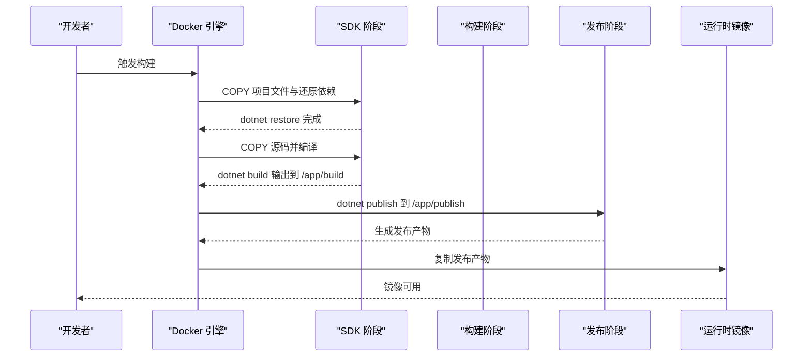
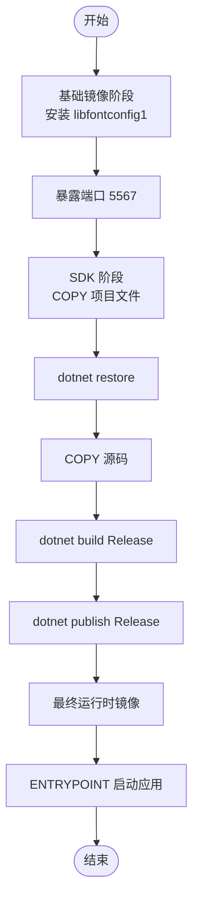
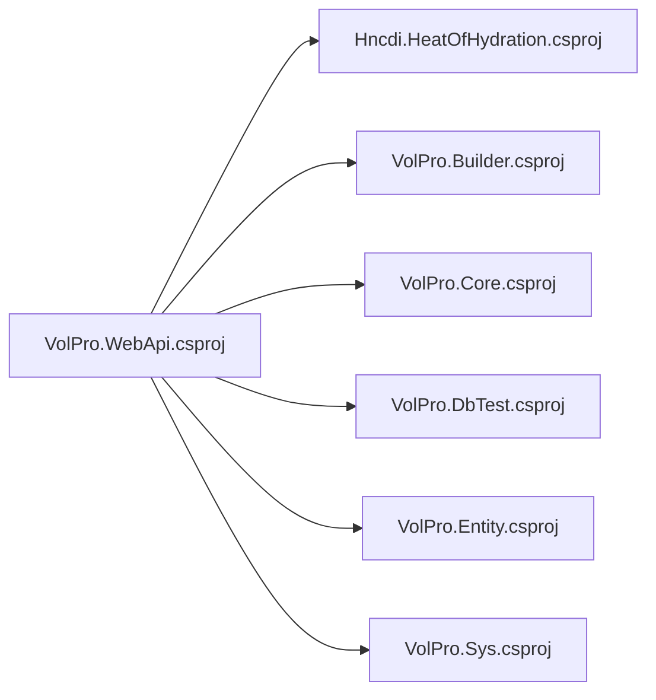

# Docker容器化部署

<cite>
**本文引用的文件**
- [Dockerfile](file://VolPro.WebApi/Dockerfile)
- [.dockerignore](file://.dockerignore)
- [appsettings.json](file://VolPro.WebApi/appsettings.json)
- [appsettings.Development.json](file://VolPro.WebApi/appsettings.Development.json)
- [Program.cs](file://VolPro.WebApi/Program.cs)
- [Startup.cs](file://VolPro.WebApi/Startup.cs)
- [VolPro.WebApi.csproj](file://VolPro.WebApi/VolPro.WebApi.csproj)
- [dev_run.bat](file://VolPro.WebApi/dev_run.bat)
- [dev_run2.bat](file://VolPro.WebApi/dev_run2.bat)
</cite>

## 目录
1. [简介](#简介)
2. [项目结构](#项目结构)
3. [核心组件](#核心组件)
4. [架构总览](#架构总览)
5. [详细组件分析](#详细组件分析)
6. [依赖关系分析](#依赖关系分析)
7. [性能考虑](#性能考虑)
8. [故障排查指南](#故障排查指南)
9. [结论](#结论)
10. [附录](#附录)

## 简介
本文件面向水化热平台的Docker容器化部署，围绕Dockerfile配置、多阶段构建策略、基础镜像选择、依赖安装、端口暴露、构建流程、忽略规则、运行命令与参数、健康检查、环境变量与卷挂载、以及调试与日志等维度，提供完整、可操作的部署指导。文档严格基于仓库中的实际文件进行分析与总结，避免臆测。

## 项目结构
水化热平台采用多项目解决方案，Web API作为容器化入口，核心配置集中在VolPro.WebApi项目中；Docker相关配置位于该目录下。

图表来源
- [Dockerfile:1-29](file://VolPro.WebApi/Dockerfile#L1-L29)
- [VolPro.WebApi.csproj:40-47](file://VolPro.WebApi/VolPro.WebApi.csproj#L40-L47)

章节来源
- [Dockerfile:1-29](file://VolPro.WebApi/Dockerfile#L1-L29)
- [VolPro.WebApi.csproj:40-47](file://VolPro.WebApi/VolPro.WebApi.csproj#L40-L47)

## 核心组件
- Dockerfile：定义多阶段构建、依赖安装、端口暴露与运行入口。
- .dockerignore：控制构建上下文排除，减少镜像体积与构建时间。
- appsettings.json：运行期配置（数据库、Redis、JWT、CORS、Kafka、邮件等）。
- Program.cs：Kestrel绑定端口为5567，作为容器对外暴露端口的依据。
- Startup.cs：注册服务、中间件、认证授权、Swagger、SignalR、打印与工作流等。
- 开发脚本：dev_run.bat、dev_run2.bat，便于本地开发调试。

章节来源
- [Dockerfile:1-29](file://VolPro.WebApi/Dockerfile#L1-L29)
- [.dockerignore:1-25](file://.dockerignore#L1-L25)
- [appsettings.json:1-140](file://VolPro.WebApi/appsettings.json#L1-L140)
- [Program.cs:24-36](file://VolPro.WebApi/Program.cs#L24-L36)
- [Startup.cs:60-213](file://VolPro.WebApi/Startup.cs#L60-L213)
- [dev_run.bat:1-20](file://VolPro.WebApi/dev_run.bat#L1-L20)
- [dev_run2.bat:1-3](file://VolPro.WebApi/dev_run2.bat#L1-L3)

## 架构总览
容器化部署采用两阶段构建：
- 阶段一（SDK）：还原NuGet包、编译并输出到构建产物目录。
- 阶段二（发布）：执行发布，生成可部署产物。
- 阶段三（运行时）：复制发布产物至最终运行时镜像，设置工作目录与入口点。

图表来源
- [Dockerfile:9-24](file://VolPro.WebApi/Dockerfile#L9-L24)

章节来源
- [Dockerfile:9-24](file://VolPro.WebApi/Dockerfile#L9-L24)

## 详细组件分析

### Dockerfile 配置详解
- 基础镜像与运行时
  - 基础镜像：使用官方 ASP.NET 6.0 运行时镜像，确保运行时环境稳定。
  - 运行时镜像：最终镜像以基础镜像为基础，复制发布产物并设置入口点。
- 依赖安装
  - 在基础镜像阶段安装 libfontconfig1，用于PDF渲染与报表导出能力。
- 端口暴露
  - EXPOSE 5567，与 Program.cs 中 Kestrel 绑定的端口保持一致。
- 多阶段构建
  - SDK 阶段：还原依赖、编译、输出构建产物。
  - 发布阶段：发布到 /app/publish。
  - 最终阶段：复制发布产物至运行时镜像，设置 ENTRYPOINT 为 dotnet VolPro.WebApi.dll。

图表来源
- [Dockerfile:3-29](file://VolPro.WebApi/Dockerfile#L3-L29)

章节来源
- [Dockerfile:3-29](file://VolPro.WebApi/Dockerfile#L3-L29)

### .dockerignore 忽略规则
- 排除目标：IDE配置、版本控制文件、构建输出、对象文件、Docker相关文件、node_modules、日志等。
- 目的：缩小构建上下文，提升构建速度，减小镜像体积，避免无关文件进入镜像。

章节来源
- [.dockerignore:1-25](file://.dockerignore#L1-L25)

### 端口与运行时绑定
- 端口暴露：Dockerfile EXPOSE 5567。
- 运行时绑定：Program.cs 中 Kestrel 使用 http://*:5567。
- 建议：容器运行时映射宿主机端口时保持一致，避免冲突。

章节来源
- [Dockerfile:7](file://VolPro.WebApi/Dockerfile#L7)
- [Program.cs:33](file://VolPro.WebApi/Program.cs#L33)

### 依赖安装与PDF支持
- 基础镜像阶段安装 libfontconfig1，满足PDF渲染与报表导出需求。
- 若后续引入更多系统库，可在同一阶段追加安装命令。

章节来源
- [Dockerfile:4](file://VolPro.WebApi/Dockerfile#L4)

### 构建流程与产物
- SDK 阶段：还原依赖、编译 Release 并输出到 /app/build。
- 发布阶段：发布 Release 到 /app/publish。
- 最终阶段：复制 /app/publish 到运行时镜像工作目录，设置 ENTRYPOINT。

章节来源
- [Dockerfile:18-24](file://VolPro.WebApi/Dockerfile#L18-L24)

### 运行命令与参数
- 基本运行
  - docker run -d -p 5567:5567 --name api-container vol.pro.webapi
- 环境变量
  - 可通过 -e 或 docker compose 的 environment 注入运行时配置（如数据库连接、Redis、JWT密钥等）。
- 卷挂载
  - Upload 目录：建议挂载宿主机目录，持久化上传文件。
  - 日志目录：可挂载宿主机日志目录，便于收集与分析。
- 健康检查
  - 当前 Dockerfile 未定义 HEALTHCHECK。建议在最终镜像中添加对 /api/health 的探针，或使用外部编排工具进行健康检查。

章节来源
- [Dockerfile:29](file://VolPro.WebApi/Dockerfile#L29)
- [Startup.cs:324-350](file://VolPro.WebApi/Startup.cs#L324-L350)

### 配置与环境变量
- appsettings.json
  - 数据库连接：支持 MsSql、MySql、PgSql、Oracle 等，按需启用。
  - Redis：连接字符串与开关。
  - CORS：前端地址列表，需与前端部署地址一致。
  - Kafka：生产者/消费者开关与配置。
  - SignalR：开关与路由配置。
  - 其他：JWT、定时任务、文件上传、租户字段等。
- 开发配置
  - appsettings.Development.json 提供开发环境日志级别等轻量配置。
- 建议
  - 生产环境建议通过环境变量覆盖敏感配置，避免硬编码在镜像中。

章节来源
- [appsettings.json:16-139](file://VolPro.WebApi/appsettings.json#L16-L139)
- [appsettings.Development.json:1-10](file://VolPro.WebApi/appsettings.Development.json#L1-L10)

### 调试与日志
- 开发脚本
  - dev_run.bat：使用 dotnet watch 启动，便于热重载调试。
  - dev_run2.bat：指定 .NET 8.0 运行框架（注意与项目目标框架一致性）。
- 容器日志
  - docker logs -f api-container 查看实时日志。
  - 结合 appsettings.json 中的日志级别调整输出详细度。
- 端口与网络
  - 确保宿主机端口 5567 未被占用，容器网络策略允许访问。

章节来源
- [dev_run.bat:1-20](file://VolPro.WebApi/dev_run.bat#L1-L20)
- [dev_run2.bat:1-3](file://VolPro.WebApi/dev_run2.bat#L1-L3)

## 依赖关系分析
- 项目间引用
  - VolPro.WebApi 引用 Hncdi.HeatOfHydration、VolPro.Builder、VolPro.Core、VolPro.DbTest、VolPro.Entity、VolPro.Sys。
- 构建阶段依赖
  - Dockerfile 中显式 COPY 对应 csproj 文件，确保 SDK 阶段正确还原依赖。
- 运行时依赖
  - libfontconfig1 用于PDF处理；Kestrel 绑定 5567 端口。

图表来源
- [VolPro.WebApi.csproj:41-46](file://VolPro.WebApi/VolPro.WebApi.csproj#L41-L46)

章节来源
- [VolPro.WebApi.csproj:41-46](file://VolPro.WebApi/VolPro.WebApi.csproj#L41-L46)

## 性能考虑
- 多阶段构建
  - SDK 阶段仅用于编译与发布，最终镜像仅包含运行时所需文件，显著减小镜像体积。
- 构建上下文
  - .dockerignore 排除不必要的文件与目录，缩短构建时间。
- 运行时优化
  - 建议在生产环境中启用压缩、合理配置 GC 与线程池，结合容器资源限制与扩缩容策略。

## 故障排查指南
- 端口冲突
  - 确认宿主机 5567 端口未被占用；若冲突，修改映射端口。
- PDF 渲染失败
  - 检查 libfontconfig1 是否正确安装；确认容器内字体可用。
- CORS 错误
  - 确认 appsettings.json 中 CorsUrls 包含前端访问地址；前后端协议与域名需匹配。
- 数据库连接失败
  - 检查连接字符串、网络连通性与防火墙；必要时使用环境变量注入。
- 日志定位
  - 使用 docker logs -f api-container 查看实时日志；根据日志级别调整配置。

章节来源
- [Dockerfile:4](file://VolPro.WebApi/Dockerfile#L4)
- [appsettings.json:67,16-56](file://VolPro.WebApi/appsettings.json#L67,L16-L56)
- [Program.cs:33](file://VolPro.WebApi/Program.cs#L33)

## 结论
本文档基于仓库中的实际文件，系统梳理了水化热平台的Docker容器化部署方案。通过多阶段构建、基础镜像选择、依赖安装与端口暴露，结合合理的忽略规则、运行命令与参数、环境变量与卷挂载策略，以及调试与日志方法，可实现稳定高效的容器化交付。建议在生产环境中进一步完善健康检查、安全加固与可观测性配置。

## 附录
- 常用命令示例
  - 构建镜像：docker build -t vol.pro.webapi .
  - 运行容器：docker run -d -p 5567:5567 --name api-container vol.pro.webapi
  - 查看日志：docker logs -f api-container
  - 停止容器：docker stop api-container
  - 删除容器：docker rm api-container
- 健康检查建议
  - 在最终镜像中添加 HEALTHCHECK，探测 /api/health 或 /swagger/index.html。
- 环境变量建议
  - DATABASE_CONNECTION_STRING、REDIS_CONNECTION_STRING、JWT_SECRET、CORS_URLS 等通过 -e 或 docker compose 注入。