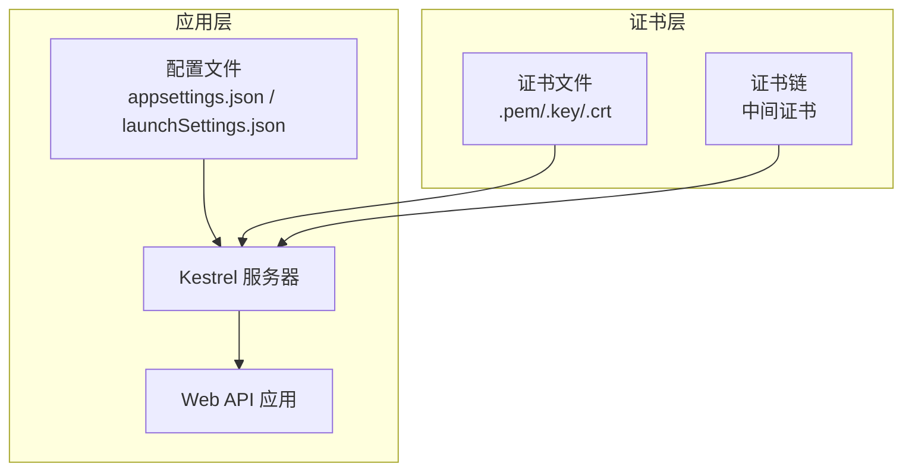
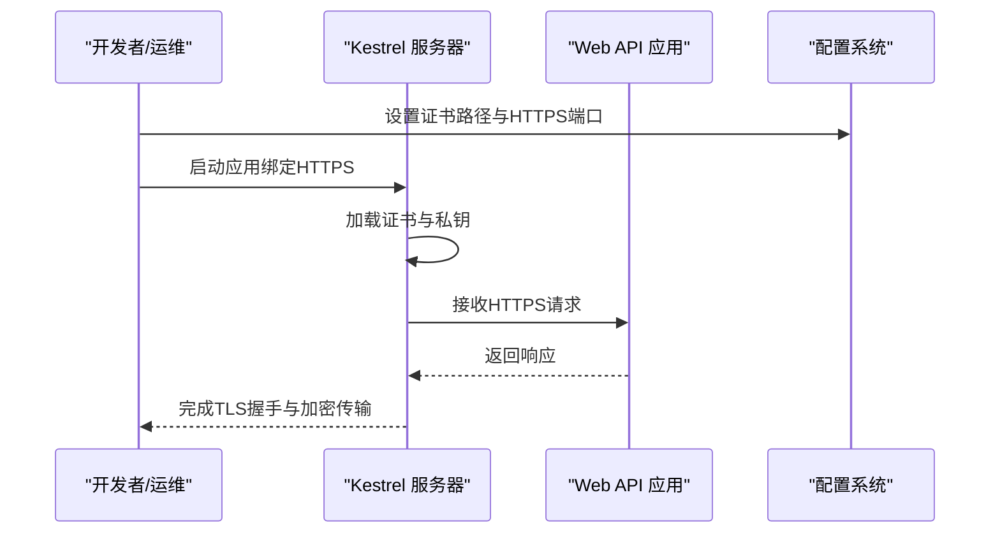
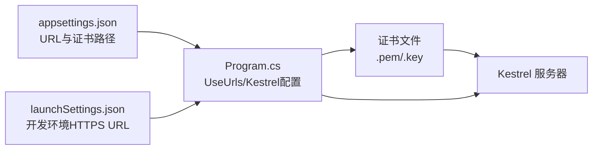

# SSL证书配置

<cite>
**本文引用的文件**
- [Program.cs](file://VolPro.WebApi/Program.cs)
- [Startup.cs](file://VolPro.WebApi/Startup.cs)
- [appsettings.json](file://VolPro.WebApi/appsettings.json)
- [appsettings.Development.json](file://VolPro.WebApi/appsettings.Development.json)
- [launchSettings.json](file://VolPro.WebApi/Properties/launchSettings.json)
- [JwtHelper.cs](file://VolPro.Core/Utilities/JwtHelper.cs)
</cite>

## 目录
1. [引言](#引言)
2. [项目结构](#项目结构)
3. [核心组件](#核心组件)
4. [架构总览](#架构总览)
5. [详细组件分析](#详细组件分析)
6. [依赖关系分析](#依赖关系分析)
7. [性能考虑](#性能考虑)
8. [故障排查指南](#故障排查指南)
9. [结论](#结论)
10. [附录](#附录)

## 引言
本文件面向“水化热平台”的运维与开发人员，提供一套完整的SSL/TLS证书配置指南，覆盖以下主题：
- Let’s Encrypt免费证书的申请与自动续期（基于certbot）
- 自签名证书的生成与配置（适用于测试环境）
- 在Kestrel（.NET内置服务器）中配置证书路径、私钥权限与证书链
- HTTPS重定向与安全响应头建议
- 证书监控、过期提醒与自动续期脚本思路
- 证书格式转换与兼容性处理

说明：当前代码库未包含Nginx配置示例；本文提供Nginx配置要点与最佳实践，但不展示具体Nginx配置文件内容。

## 项目结构
本项目为.NET 8 Web API工程，运行于Kestrel服务器。SSL/TLS配置主要通过应用启动参数与配置文件实现，不依赖外部反向代理（如Nginx）的证书加载。若部署在容器或Linux服务器上，可通过命令行参数或环境变量为Kestrel绑定HTTPS端口并加载证书。

图表来源
- [Program.cs:24-36](file://VolPro.WebApi/Program.cs#L24-L36)
- [appsettings.json:14-16](file://VolPro.WebApi/appsettings.json#L14-L16)
- [launchSettings.json:21](file://VolPro.WebApi/Properties/launchSettings.json#L21)

章节来源
- [Program.cs:17-36](file://VolPro.WebApi/Program.cs#L17-L36)
- [appsettings.json:14-16](file://VolPro.WebApi/appsettings.json#L14-L16)
- [launchSettings.json:10-26](file://VolPro.WebApi/Properties/launchSettings.json#L10-L26)

## 核心组件
- Kestrel服务器：负责监听HTTP/HTTPS端口，加载证书并提供TLS终止。
- 配置系统：通过appsettings.json与launchSettings.json控制URL、证书路径等。
- 启动入口：Program.cs中设置Kestrel监听与启动流程。
- 安全中间件：JWT鉴权与CORS策略，与证书配置共同保障传输安全。

章节来源
- [Program.cs:24-36](file://VolPro.WebApi/Program.cs#L24-L36)
- [Startup.cs:84-114](file://VolPro.WebApi/Startup.cs#L84-L114)
- [appsettings.json:67](file://VolPro.WebApi/appsettings.json#L67)

## 架构总览
下图展示了Kestrel如何加载证书并处理HTTPS请求，以及与配置的关系。

图表来源
- [Program.cs:24-36](file://VolPro.WebApi/Program.cs#L24-L36)
- [appsettings.json:14-16](file://VolPro.WebApi/appsettings.json#L14-L16)
- [launchSettings.json:21](file://VolPro.WebApi/Properties/launchSettings.json#L21)

## 详细组件分析

### 1) Let’s Encrypt免费证书申请与自动续期（certbot）
- 适用场景：生产环境域名已解析至服务器，具备公网可达性。
- 基本步骤概览（概念性说明，非仓库内容）：
  - 安装certbot（根据操作系统选择包管理器或官方脚本）
  - 使用Webroot或独立Nginx模式进行域名验证
  - 获取证书并输出为.pem/.key组合
  - 配置自动续期（crontab或systemd timer）
- 证书位置与命名建议：将证书与私钥置于受控目录，例如/etc/letsencrypt/live/yourdomain/，并确保仅允许运行用户读取。
- 自动续期脚本建议：在续期前执行服务重启（如systemctl reload nginx或重启应用），以使新证书生效。

[本节为通用运维指导，不直接分析具体源码文件]

### 2) 自签名证书生成与配置（测试环境）
- 生成自签名证书（概念性说明，非仓库内容）：
  - 使用openssl生成私钥与CSR，再签发自签名证书
  - 或直接生成自签名证书（适合本地测试）
- 配置要点：
  - 私钥文件权限：仅运行用户可读
  - 证书链：若无中间证书，可直接使用根证书
  - 将证书与私钥路径写入配置（见下一节）

[本节为通用运维指导，不直接分析具体源码文件]

### 3) 在Kestrel中配置SSL证书
- 监听HTTPS端口与证书路径
  - 方式一：在Program.cs中通过UseUrls绑定HTTPS地址与端口，并在启动参数中传入证书路径与密码（如使用命令行参数）
  - 方式二：在launchSettings.json中配置HTTPS URL（开发环境常用）
  - 方式三：在appsettings.json中集中管理URL与证书路径（需在Startup中读取并传递给Kestrel）
- 证书与私钥权限
  - Linux：确保运行账户对证书与私钥具有只读权限，避免root权限泄露
  - Windows：确保IIS Express或服务账户对证书与私钥具有读取权限
- 证书链完整性
  - 将中间证书合并到证书文件末尾，形成完整链
  - 确保证书与私钥匹配（同一CA签发且密钥长度兼容）

章节来源
- [Program.cs:24-36](file://VolPro.WebApi/Program.cs#L24-L36)
- [launchSettings.json:21](file://VolPro.WebApi/Properties/launchSettings.json#L21)
- [appsettings.json:14-16](file://VolPro.WebApi/appsettings.json#L14-L16)

### 4) HTTPS重定向与安全响应头
- HTTPS重定向（概念性说明，非仓库内容）：
  - 在Kestrel中可结合中间件实现HTTP到HTTPS的301/308跳转
  - 或在反向代理（如Nginx）层统一做重定向
- 安全响应头建议（概念性说明，非仓库内容）：
  - HSTS、X-Frame-Options、X-Content-Type-Options、Referrer-Policy、Permissions-Policy等
  - 通过中间件或反向代理统一注入

[本节为通用安全实践，不直接分析具体源码文件]

### 5) 证书监控、过期提醒与自动续期脚本
- 监控与告警（概念性说明，非仓库内容）：
  - 使用openssl命令检查证书有效期
  - 结合系统日志与邮件/IM告警
- 自动续期（概念性说明，非仓库内容）：
  - certbot自带自动续期机制
  - 续期后触发服务重启或健康检查
- 脚本示例思路（概念性说明，非仓库内容）：
  - 检查证书剩余天数（如小于30天则告警）
  - 执行certbot renew并重启服务
  - 记录续期结果与失败原因

[本节为通用运维实践，不直接分析具体源码文件]

### 6) 证书格式转换与兼容性
- PEM与DER互转（概念性说明，非仓库内容）：
  - openssl x509 -in cert.pem -out cert.der -outform DER
  - openssl x509 -in cert.der -out cert.pem -inform DER
- PFX/P12导入（概念性说明，非仓库内容）：
  - 若需Windows证书存储，可将PEM转为PFX
  - 注意私钥保护与密码管理
- 兼容性注意事项（概念性说明，非仓库内容）：
  - 现代浏览器与移动客户端对椭圆曲线与RSA密钥的支持不同
  - 优先使用SHA-2及以上签名算法与至少2048位RSA或等效曲线

[本节为通用技术实践，不直接分析具体源码文件]

### 7) Nginx中的SSL配置（概念性说明，非仓库内容）
- 基本要点：
  - ssl_certificate与ssl_certificate_key指向证书与私钥
  - ssl_trusted_certificate用于信任链
  - 启用TLS 1.2/1.3，禁用弱套件
- 与Kestrel配合：
  - 若Nginx作为反向代理，Kestrel可仅监听内网端口并使用自签名或内部CA证书
  - 若Nginx直管TLS，应用仅监听HTTP或内网端口

[本节为通用Nginx实践，不直接分析具体源码文件]

## 依赖关系分析
Kestrel与证书配置之间的关系如下：

图表来源
- [Program.cs:24-36](file://VolPro.WebApi/Program.cs#L24-L36)
- [appsettings.json:14-16](file://VolPro.WebApi/appsettings.json#L14-L16)
- [launchSettings.json:21](file://VolPro.WebApi/Properties/launchSettings.json#L21)

章节来源
- [Program.cs:24-36](file://VolPro.WebApi/Program.cs#L24-L36)
- [appsettings.json:14-16](file://VolPro.WebApi/appsettings.json#L14-L16)
- [launchSettings.json:21](file://VolPro.WebApi/Properties/launchSettings.json#L21)

## 性能考虑
- 证书链长度与握手耗时：尽量减少中间证书层数
- 密钥算法：优先使用RSA 2048+/ECC P-256+，兼顾性能与安全
- OCSP Stapling：在Nginx/Apache中启用以降低在线验证延迟（概念性说明）
- 连接复用：合理配置TLS会话复用与ALPN，提升并发性能（概念性说明）

[本节为通用性能建议，不直接分析具体源码文件]

## 故障排查指南
- 证书无法加载
  - 检查证书与私钥路径是否正确
  - 确认文件权限与运行账户权限
  - 验证证书链完整性
- 握手失败
  - 检查协议版本与加密套件是否被客户端支持
  - 确认域名与SAN匹配
- 开发环境HTTPS无效
  - 确认launchSettings.json中的HTTPS URL已启用
  - 检查IIS Express证书导入与信任状态

章节来源
- [launchSettings.json:21](file://VolPro.WebApi/Properties/launchSettings.json#L21)
- [appsettings.json:14-16](file://VolPro.WebApi/appsettings.json#L14-L16)

## 结论
- 本项目采用Kestrel作为Web服务器，SSL/TLS配置应通过应用启动参数与配置文件完成
- 生产环境推荐使用Let’s Encrypt免费证书，并配置自动续期
- 测试环境可使用自签名证书，注意私钥权限与证书链完整性
- 如使用Nginx反向代理，请单独在Nginx中配置证书与TLS策略
- 建议补充安全响应头与HTTPS重定向策略，完善整体安全基线

[本节为总结性内容，不直接分析具体源码文件]

## 附录

### A. 关键配置参考路径
- HTTPS监听与证书路径：参见[Program.cs:24-36](file://VolPro.WebApi/Program.cs#L24-L36)
- CORS与前端URL：参见[appsettings.json:67](file://VolPro.WebApi/appsettings.json#L67)
- 开发环境HTTPS URL：参见[launchSettings.json:21](file://VolPro.WebApi/Properties/launchSettings.json#L21)

### B. JWT与安全上下文
- JWT签发与校验参数来源于配置，与证书配置共同保障传输层与应用层安全：参见[JwtHelper.cs:21-46](file://VolPro.Core/Utilities/JwtHelper.cs#L21-L46)、[Startup.cs:84-114](file://VolPro.WebApi/Startup.cs#L84-L114)