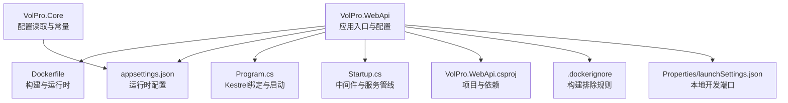
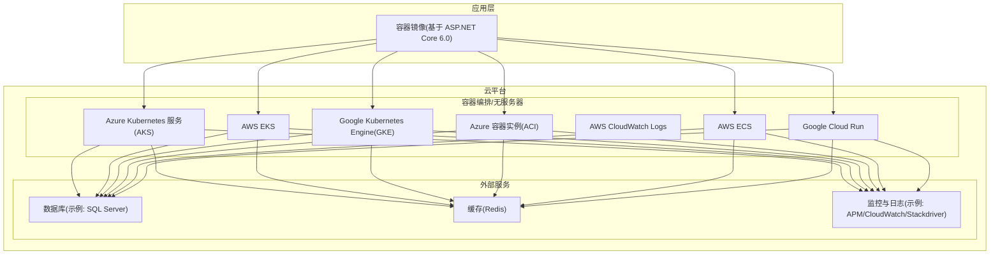
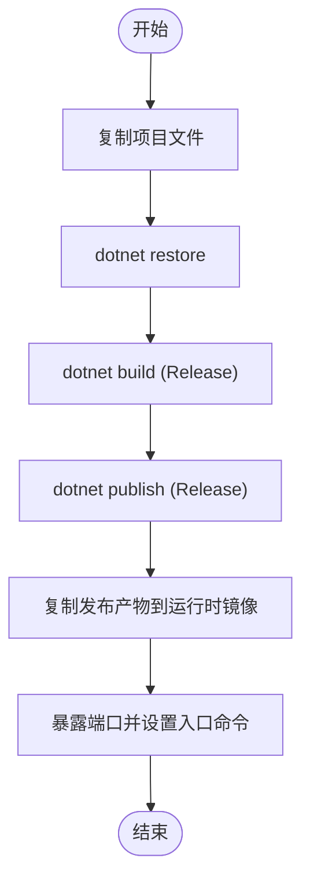
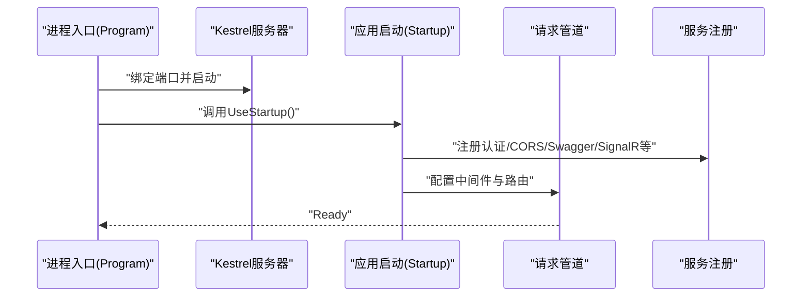
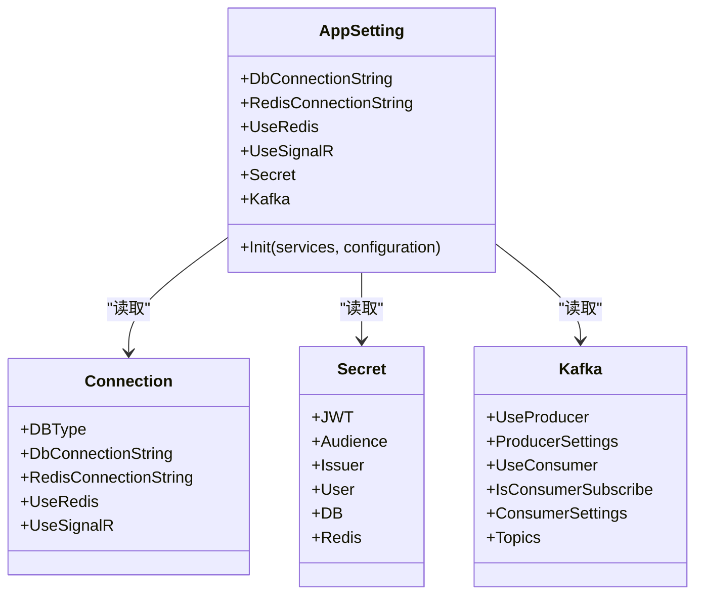
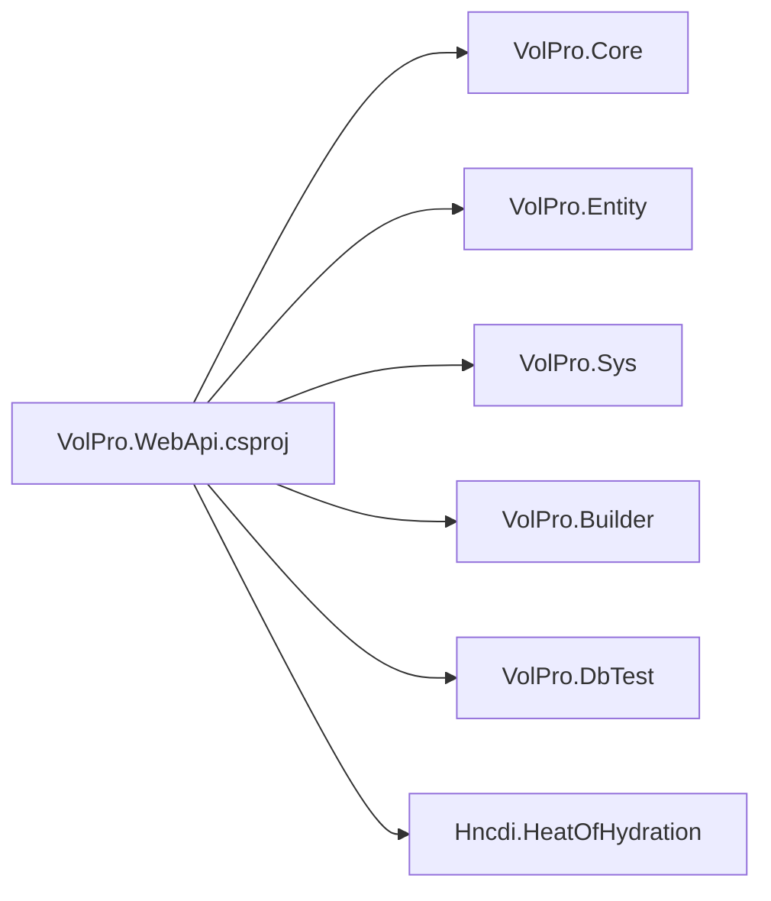

# 云平台部署

<cite>
**本文引用的文件**
- [Dockerfile](file://VolPro.WebApi/Dockerfile)
- [appsettings.json](file://VolPro.WebApi/appsettings.json)
- [appsettings.Development.json](file://VolPro.WebApi/appsettings.Development.json)
- [Program.cs](file://VolPro.WebApi/Program.cs)
- [Startup.cs](file://VolPro.WebApi/Startup.cs)
- [.dockerignore](file://.dockerignore)
- [VolPro.WebApi.csproj](file://VolPro.WebApi/VolPro.WebApi.csproj)
- [AppSetting.cs](file://VolPro.Core/Configuration/AppSetting.cs)
- [launchSettings.json](file://VolPro.WebApi/Properties/launchSettings.json)
</cite>

## 目录
1. [简介](#简介)
2. [项目结构](#项目结构)
3. [核心组件](#核心组件)
4. [架构总览](#架构总览)
5. [详细组件分析](#详细组件分析)
6. [依赖关系分析](#依赖关系分析)
7. [性能考虑](#性能考虑)
8. [故障排查指南](#故障排查指南)
9. [结论](#结论)
10. [附录](#附录)

## 简介
本文件面向“水化热平台”在云平台的部署实践，聚焦于以下目标：
- 基于容器镜像的统一打包与运行（基于 ASP.NET Core 6.0 运行时）
- Azure 容器实例（ACI）与 Azure Kubernetes 服务（AKS）部署方案
- AWS ECS 与 EKS 部署方案
- Google Cloud Platform（GCP）Cloud Run 与 GKE 部署方案
- 容器注册表配置（ACR、ECR、GCR）
- 自动扩缩容、资源限制与成本优化策略
- 云原生监控与日志收集配置建议

本指南以仓库中的 Dockerfile、应用配置与启动入口为依据，结合云平台通用最佳实践，提供可落地的部署步骤与运维要点。

## 项目结构
该仓库采用多项目解决方案，Web API 主项目位于 VolPro.WebApi，核心配置与运行时由其负责；容器化与发布流程以 Dockerfile 为核心。

图表来源
- [Dockerfile:1-29](file://VolPro.WebApi/Dockerfile#L1-L29)
- [appsettings.json:1-140](file://VolPro.WebApi/appsettings.json#L1-L140)
- [Program.cs:1-39](file://VolPro.WebApi/Program.cs#L1-L39)
- [Startup.cs:1-407](file://VolPro.WebApi/Startup.cs#L1-L407)
- [VolPro.WebApi.csproj:1-55](file://VolPro.WebApi/VolPro.WebApi.csproj#L1-L55)
- [.dockerignore:1-25](file://.dockerignore#L1-L25)
- [launchSettings.json:1-28](file://VolPro.WebApi/Properties/launchSettings.json#L1-L28)
- [AppSetting.cs:1-237](file://VolPro.Core/Configuration/AppSetting.cs#L1-L237)

章节来源
- [Dockerfile:1-29](file://VolPro.WebApi/Dockerfile#L1-L29)
- [VolPro.WebApi.csproj:1-55](file://VolPro.WebApi/VolPro.WebApi.csproj#L1-L55)
- [Program.cs:1-39](file://VolPro.WebApi/Program.cs#L1-L39)
- [Startup.cs:1-407](file://VolPro.WebApi/Startup.cs#L1-L407)
- [appsettings.json:1-140](file://VolPro.WebApi/appsettings.json#L1-L140)
- [.dockerignore:1-25](file://.dockerignore#L1-L25)
- [launchSettings.json:1-28](file://VolPro.WebApi/Properties/launchSettings.json#L1-L28)
- [AppSetting.cs:1-237](file://VolPro.Core/Configuration/AppSetting.cs#L1-L237)

## 核心组件
- 容器镜像与运行时
  - 基于 ASP.NET Core 6.0 运行时镜像，容器暴露端口与应用绑定保持一致
  - 构建阶段复制项目文件并执行 restore/build/publish
- 应用配置
  - 数据库连接、Redis、JWT、CORS、SignalR、Kafka、邮件等配置集中于 appsettings.json
  - 启动时通过 AppSetting 初始化配置对象，供各模块读取
- 启动与中间件
  - Program 中绑定 Kestrel 到固定端口，启用 Autofac 依赖注入工厂
  - Startup 中注册认证、CORS、Swagger、SignalR、Quartz 等服务与管道

章节来源
- [Dockerfile:1-29](file://VolPro.WebApi/Dockerfile#L1-L29)
- [Program.cs:1-39](file://VolPro.WebApi/Program.cs#L1-L39)
- [Startup.cs:1-407](file://VolPro.WebApi/Startup.cs#L1-L407)
- [appsettings.json:1-140](file://VolPro.WebApi/appsettings.json#L1-L140)
- [AppSetting.cs:1-237](file://VolPro.Core/Configuration/AppSetting.cs#L1-L237)

## 架构总览
下图展示应用在云平台的典型部署形态：容器镜像在注册表中托管，通过 ACI、ECS、Cloud Run 或 AKS/GKE 托管服务运行，配合外部数据库与缓存服务。

## 详细组件分析

### 容器化与镜像构建
- 运行时与端口
  - 使用 ASP.NET Core 6.0 运行时镜像作为基础
  - 容器 EXPOSE 端口与应用绑定端口需一致
- 构建与发布
  - 多阶段构建：SDK 阶段 restore/build/publish，最终运行阶段仅拷贝发布产物
- 构建排除
  - .dockerignore 排除 IDE、Git、日志与构建输出目录，减小镜像体积

图表来源
- [Dockerfile:1-29](file://VolPro.WebApi/Dockerfile#L1-L29)

章节来源
- [Dockerfile:1-29](file://VolPro.WebApi/Dockerfile#L1-L29)
- [.dockerignore:1-25](file://.dockerignore#L1-L25)

### 应用启动与网络绑定
- Kestrel 绑定
  - 在 Program 中通过 UseUrls 将 Kestrel 绑定到固定端口，确保容器端口映射一致
- CORS 与认证
  - Startup 注册 JWT 认证、CORS 策略与 Swagger，便于云平台网关与反向代理接入
- SignalR
  - 可选启用 SignalR，需在云平台配置 WebSocket 支持与长连接

图表来源
- [Program.cs:1-39](file://VolPro.WebApi/Program.cs#L1-L39)
- [Startup.cs:1-407](file://VolPro.WebApi/Startup.cs#L1-L407)

章节来源
- [Program.cs:1-39](file://VolPro.WebApi/Program.cs#L1-L39)
- [Startup.cs:1-407](file://VolPro.WebApi/Startup.cs#L1-L407)

### 配置与外部依赖
- 数据库与缓存
  - appsettings.json 提供多种数据库类型与连接串示例，以及 Redis 连接串
  - AppSetting 在运行时解密并加载配置，供各模块使用
- Kafka
  - 提供生产者/消费者与主题配置，便于事件驱动扩展
- 文件与静态资源
  - Upload 目录用于文件上传，支持静态文件服务与虚拟路径配置

图表来源
- [AppSetting.cs:1-237](file://VolPro.Core/Configuration/AppSetting.cs#L1-L237)
- [appsettings.json:1-140](file://VolPro.WebApi/appsettings.json#L1-L140)

章节来源
- [AppSetting.cs:1-237](file://VolPro.Core/Configuration/AppSetting.cs#L1-L237)
- [appsettings.json:1-140](file://VolPro.WebApi/appsettings.json#L1-L140)

## 依赖关系分析
- 项目依赖
  - VolPro.WebApi 依赖多个子项目（含水化热平台相关模块），通过 csproj 引用
- 运行时依赖
  - ASP.NET Core 6.0 运行时镜像，Kestrel 服务器，Autofac 依赖注入
- 外部依赖
  - 数据库（SQL Server 示例）、Redis、Kafka（可选）

图表来源
- [VolPro.WebApi.csproj:1-55](file://VolPro.WebApi/VolPro.WebApi.csproj#L1-L55)

章节来源
- [VolPro.WebApi.csproj:1-55](file://VolPro.WebApi/VolPro.WebApi.csproj#L1-L55)

## 性能考虑
- 容器镜像优化
  - 使用多阶段构建，仅在最终镜像包含运行时产物
  - .dockerignore 排除不必要的构建与日志文件
- 运行时参数
  - 固定端口绑定，避免动态端口带来的云平台负载均衡复杂度
- 资源与扩缩容
  - 建议在云平台侧设置 CPU/内存初始配额与上限，结合 HPA 实现基于 CPU/自定义指标的自动扩缩容
- 缓存与数据库
  - 启用 Redis（若可用）以降低数据库压力；合理设置连接池与超时
- 日志与监控
  - 使用云平台日志服务聚合容器日志，结合 APM/告警实现可观测性

## 故障排查指南
- 启动失败
  - 检查容器端口与应用绑定端口是否一致
  - 查看启动日志与异常中间件输出
- CORS 问题
  - 确认 appsettings.json 中的 CORS 允许来源已正确配置
- 认证失败
  - 核对 JWT Issuer/Audience 与密钥配置
- 数据库连接
  - 确认连接串与加密密钥配置正确，必要时检查网络连通性与防火墙
- 文件上传
  - 若出现请求体过大错误，可在云平台入口或反向代理调整请求体大小限制

章节来源
- [Program.cs:1-39](file://VolPro.WebApi/Program.cs#L1-L39)
- [Startup.cs:1-407](file://VolPro.WebApi/Startup.cs#L1-L407)
- [appsettings.json:1-140](file://VolPro.WebApi/appsettings.json#L1-L140)
- [AppSetting.cs:1-237](file://VolPro.Core/Configuration/AppSetting.cs#L1-L237)

## 结论
本指南以仓库现有 Dockerfile、配置与启动入口为基础，给出了在 Azure、AWS、GCP 的容器与容器编排平台部署思路。建议在生产环境中结合云平台的托管服务特性，完善注册表、网络、安全组、自动扩缩容与监控告警体系，确保高可用与低成本运营。

## 附录

### Azure 部署方案

- Azure Container Instances（ACI）
  - 使用容器镜像注册到 Azure Container Registry（ACR）
  - 在 ACI 中创建容器实例，绑定固定端口与健康探针
  - 配置 DNS 名称或负载均衡器入口
  - 建议：为数据库与缓存配置专用 VNet 与网络安全组

- Azure Kubernetes Service（AKS）
  - 使用 ACR 存储镜像，配置 AKS 集群的拉取凭据
  - 通过 Deployment/Service 暴露应用，使用 Ingress 控制器与 TLS
  - 配置 Horizontal Pod Autoscaler（HPA）基于 CPU/自定义指标扩缩容
  - 集成 Azure Monitor 与 Application Insights

### AWS 部署方案

- Amazon ECS
  - 使用 ECR 托管镜像，创建任务定义与服务
  - 通过 ALB 暴露端口，配置健康检查与安全组
  - 使用 ECS Auto Scaling 基于 CPU/目标追踪策略扩缩容

- Amazon EKS
  - 使用 ECR 存储镜像，通过 Helm/Kubernetes Manifest 部署
  - 使用 NLB/ALB 作为入口，Ingress 控制器管理域名与证书
  - 配置 Cluster Autoscaler 与 HPA，结合 AWS X-Ray 与 CloudWatch Logs

### Google Cloud Platform（GCP）部署方案

- Cloud Run
  - 使用 Artifact Registry 托管镜像，启用无服务器部署
  - 配置最小/最大实例数、并发与超时，启用 HTTPS
  - 集成 Cloud Logging 与 Cloud Monitoring

- GKE
  - 使用 Artifact Registry 存储镜像，部署到 GKE 集群
  - 使用 Network Endpoint Groups/NLB 或 Ingress 暴露服务
  - 配置 Cluster Autoscaler 与 HPA，集成 Cloud Operations（原 Stackdriver）

### 容器注册表配置

- Azure Container Registry（ACR）
  - 创建 ACR 实例，推送镜像
  - 在 AKS/ACI 中配置拉取凭据（Service Principal 或托管身份）

- Amazon ECR
  - 创建仓库，推送镜像
  - 在 ECS/EKS 中配置 IAM 角色与拉取凭据

- Google Artifact Registry
  - 创建仓库，推送镜像
  - 在 Cloud Run/GKE 中配置工作负载身份与拉取凭据

### 自动扩缩容与资源限制

- 资源限制
  - 在云平台侧为容器设置 CPU/内存请求与限制
- HPA
  - 基于 CPU 使用率或自定义指标（如请求延迟、队列长度）配置 HPA
- 预留与冷启动
  - Cloud Run/ACI 可设置最小实例，减少冷启动影响
- 成本优化
  - 使用 Spot/批处理实例（EKS/AKS/GKE）
  - 合理设置副本与实例下限，避免过度预留
  - 使用压缩与缓存减少带宽与数据库压力

### 云原生监控与日志

- 日志
  - 容器标准输出重定向至云平台日志服务（Azure Monitor、CloudWatch、Cloud Logging）
  - 静态文件与上传目录的日志采集策略
- 监控
  - 指标：CPU/内存/请求速率/错误率/响应时间
  - 告警：阈值告警与异常检测
- APM
  - 集成平台提供的 APM（Application Insights、X-Ray、Cloud Operations）