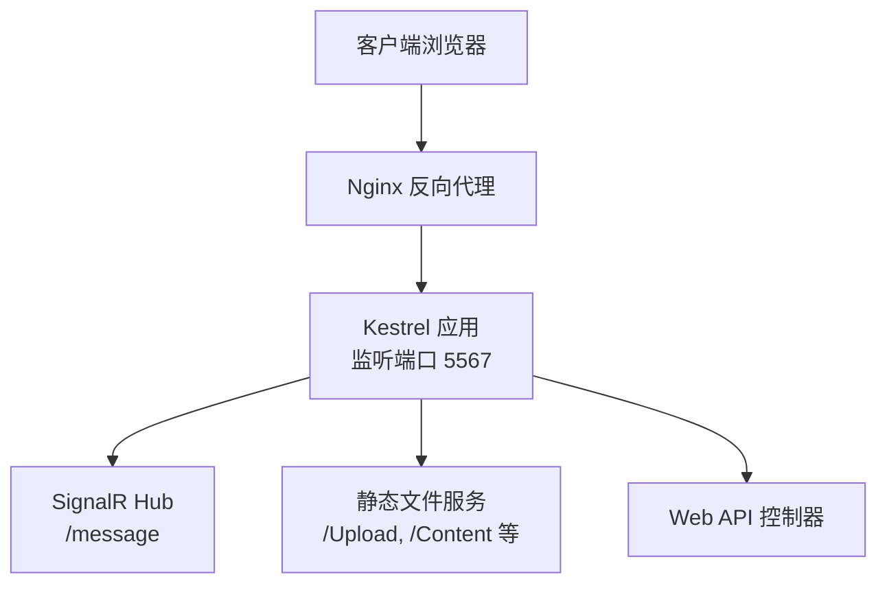
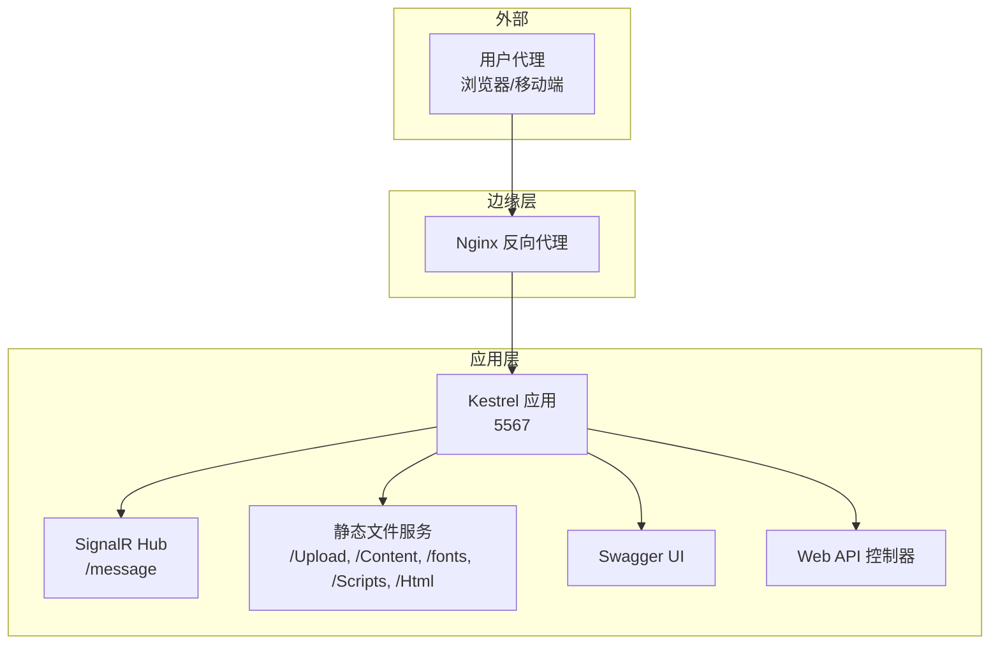
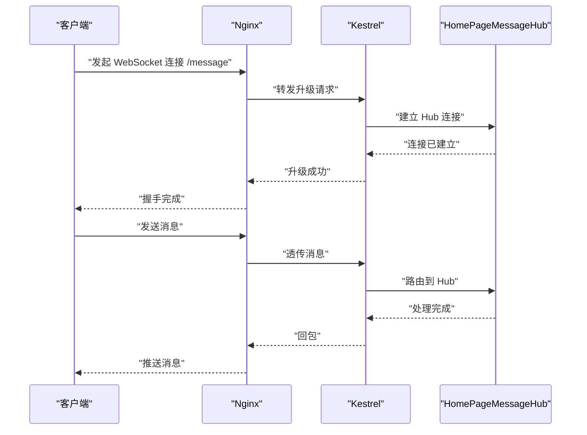
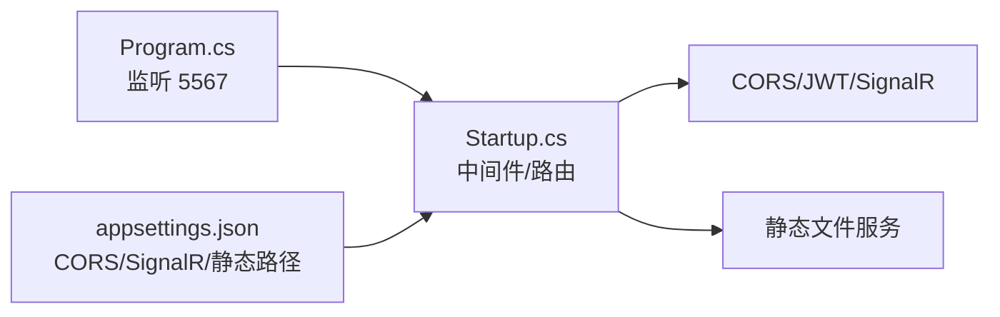

# 反向代理配置

<cite>
**本文引用的文件**
- [appsettings.json](file://VolPro.WebApi/appsettings.json)
- [Program.cs](file://VolPro.WebApi/Program.cs)
- [Startup.cs](file://VolPro.WebApi/Startup.cs)
- [Dockerfile](file://VolPro.WebApi/Dockerfile)
- [HomePageMessageHub.cs](file://VolPro.WebApi/Controllers/Hubs/HomePageMessageHub.cs)
- [ExceptionHandlerMiddleWare.cs](file://VolPro.Core/Middleware/ExceptionHandlerMiddleWare.cs)
- [HttpRequestMiddleware.cs](file://VolPro.Core/Middleware/HttpRequestMiddleware.cs)
- [StaticHttpContextExtensions.cs](file://VolPro.Core/Extensions/StaticHttpContextExtensions.cs)
- [StaticFileExtensions.cs](file://VolPro.Core/Extensions/StaticFileExtensions.cs)
- [AppSetting.cs](file://VolPro.Core/Configuration/AppSetting.cs)
</cite>

## 目录
1. [简介](#简介)
2. [项目结构](#项目结构)
3. [核心组件](#核心组件)
4. [架构总览](#架构总览)
5. [详细组件分析](#详细组件分析)
6. [依赖关系分析](#依赖关系分析)
7. [性能考虑](#性能考虑)
8. [故障排查指南](#故障排查指南)
9. [结论](#结论)
10. [附录](#附录)

## 简介
本文件面向“水化热平台”的反向代理部署，基于仓库中的 ASP.NET Core 应用配置与运行方式，给出 Nginx 反向代理的完整配置建议，涵盖 upstream 服务器配置、负载均衡策略、健康检查、SSL/TLS、静态文件服务、Gzip 压缩、CORS 跨域、WebSocket 代理、安全防护与性能优化等主题。文中所有实现细节均以仓库源码为依据，避免臆测。

## 项目结构
- 应用容器化与端口暴露：应用以 Kestrel 运行并暴露固定端口，Dockerfile 中声明了容器内端口，需与反向代理上游端口保持一致。
- 运行时监听：Program.cs 指定 Kestrel 监听地址与端口，作为反向代理上游目标。
- 中间件与静态文件：Startup.cs 配置了静态文件服务、Swagger 文档、CORS、SignalR 等，影响反向代理的静态资源与 WebSocket 代理策略。
- 配置中心：appsettings.json 提供 CORS、JWT、SignalR 开关、静态文件虚拟路径等关键参数，决定反向代理行为。

图表来源
- [Program.cs:33](file://VolPro.WebApi/Program.cs#L33)
- [Startup.cs:366-382](file://VolPro.WebApi/Startup.cs#L366-L382)
- [Dockerfile:7](file://VolPro.WebApi/Dockerfile#L7)

章节来源
- [Program.cs:24-36](file://VolPro.WebApi/Program.cs#L24-L36)
- [Dockerfile:1-29](file://VolPro.WebApi/Dockerfile#L1-L29)

## 核心组件
- 应用监听与上游端口
  - Kestrel 监听地址为 http://*:5567，反向代理需指向该上游地址与端口。
- CORS 与跨域
  - CORS 来源列表来自配置项，反向代理需确保与该列表一致，避免预检失败。
- SignalR 与 WebSocket
  - 启用了 SignalR 并映射到 /message，反向代理需启用 WebSocket 支持并透传升级头。
- 静态文件服务
  - 默认启用静态文件服务；另有 Upload 目录映射与虚拟路径配置，反向代理可按需缓存与压缩。
- 中间件与安全
  - 异常处理中间件与请求头透出，影响错误响应与跨域暴露头。

章节来源
- [Program.cs:33](file://VolPro.WebApi/Program.cs#L33)
- [Startup.cs:116-130](file://VolPro.WebApi/Startup.cs#L116-L130)
- [Startup.cs:366-382](file://VolPro.WebApi/Startup.cs#L366-L382)
- [appsettings.json:67](file://VolPro.WebApi/appsettings.json#L67)
- [ExceptionHandlerMiddleWare.cs:19-24](file://VolPro.Core/Middleware/ExceptionHandlerMiddleWare.cs#L19-L24)

## 架构总览
下图展示反向代理在整体架构中的位置与流量走向，以及与应用各模块的关系。

图表来源
- [Program.cs:33](file://VolPro.WebApi/Program.cs#L33)
- [Startup.cs:366-382](file://VolPro.WebApi/Startup.cs#L366-L382)
- [StaticFileExtensions.cs:13-48](file://VolPro.Core/Extensions/StaticFileExtensions.cs#L13-L48)

## 详细组件分析

### Nginx 反向代理与上游配置
- 上游服务器
  - 定义一个或多个 upstream，指向 Kestrel 的监听地址与端口。
- 负载均衡策略
  - 使用轮询或最少连接策略，结合健康检查实现自动摘挂。
- 健康检查
  - 建议对 /health 或 /swagger（或 /api/values）进行探测，失败时自动摘除节点。
- 会话亲和
  - 如需基于 Cookie 的粘性会话，可在 upstream 中启用 hash 或基于 Cookie 的一致性哈希。

章节来源
- [Program.cs:33](file://VolPro.WebApi/Program.cs#L33)
- [Dockerfile:7](file://VolPro.WebApi/Dockerfile#L7)

### SSL/TLS 配置
- 证书链
  - 在 server 块中配置 ssl_certificate 与 ssl_certificate_key，并加载中间证书链。
- 加密协议与套件
  - 推荐禁用弱协议，启用 TLSv1.2+，使用现代加密套件。
- 安全头
  - 建议设置 Strict-Transport-Security、Content-Security-Policy、X-Frame-Options、X-Content-Type-Options、Referrer-Policy 等。

章节来源
- [Startup.cs:116-130](file://VolPro.WebApi/Startup.cs#L116-L130)

### 静态文件服务与缓存
- 静态文件根目录
  - 应用默认启用静态文件服务；另有 Upload 目录映射与虚拟路径配置，反向代理可针对 /Upload 设置缓存与压缩。
- 缓存策略
  - 对于 /Upload 下的二进制文件，建议设置较长缓存；对于 /Content、/fonts、/Scripts、/Html 等目录，可按版本号或 ETag 实现缓存控制。
- 压缩
  - 对文本类静态资源启用 gzip/br 压缩，提升首屏加载速度。

章节来源
- [Startup.cs:324-350](file://VolPro.WebApi/Startup.cs#L324-L350)
- [StaticFileExtensions.cs:13-48](file://VolPro.Core/Extensions/StaticFileExtensions.cs#L13-L48)

### Gzip 压缩与传输优化
- 压缩范围
  - 对 HTML、CSS、JS、JSON、XML 等文本类响应启用压缩。
- 压缩级别
  - 平衡压缩比与 CPU 开销，建议中等压缩级别。
- 传输编码
  - 启用 gzip/deflate 或更优的 brotli，优先级顺序按客户端支持协商。

章节来源
- [Startup.cs:324-350](file://VolPro.WebApi/Startup.cs#L324-L350)

### CORS 跨域配置
- 来源白名单
  - CORS 来源列表来自配置项，反向代理需确保与该列表一致，避免预检失败。
- 预检缓存
  - 设置合理的预检缓存时间，减少重复预检请求。
- 凭据与暴露头
  - 若前端携带凭据，需允许凭据并正确暴露相关响应头。

章节来源
- [Startup.cs:116-130](file://VolPro.WebApi/Startup.cs#L116-L130)
- [appsettings.json:67](file://VolPro.WebApi/appsettings.json#L67)
- [HttpRequestMiddleware.cs:19](file://VolPro.Core/Middleware/HttpRequestMiddleware.cs#L19)

### WebSocket 代理与实时通信
- WebSocket 升级
  - 反向代理需透传 Upgrade、Connection、Sec-WebSocket-* 等头部，并启用 keepalive。
- 路径映射
  - 将 /message 映射到应用的 SignalR Hub，确保路由与应用一致。
- 超时与缓冲
  - 适当增大 proxy_read_timeout、proxy_send_timeout，避免长连接被中断。

图表来源
- [Startup.cs:366-382](file://VolPro.WebApi/Startup.cs#L366-L382)
- [HomePageMessageHub.cs:20-66](file://VolPro.WebApi/Controllers/Hubs/HomePageMessageHub.cs#L20-L66)

章节来源
- [Startup.cs:366-382](file://VolPro.WebApi/Startup.cs#L366-L382)
- [HomePageMessageHub.cs:20-66](file://VolPro.WebApi/Controllers/Hubs/HomePageMessageHub.cs#L20-L66)

### 安全防护与头部控制
- 异常处理与响应
  - 异常中间件统一拦截异常并返回 JSON 错误，反向代理可据此进行日志与告警。
- 请求头透出
  - 中间件在响应头中暴露特定头部，便于前端识别令牌过期等场景。
- 认证与授权
  - 应用侧使用 JWT Bearer 认证，反向代理可配合 HSTS、CSP 等提升安全性。

章节来源
- [ExceptionHandlerMiddleWare.cs:28-107](file://VolPro.Core/Middleware/ExceptionHandlerMiddleWare.cs#L28-L107)
- [Startup.cs:84-114](file://VolPro.WebApi/Startup.cs#L84-L114)
- [HttpRequestMiddleware.cs:19](file://VolPro.Core/Middleware/HttpRequestMiddleware.cs#L19)

## 依赖关系分析
- 应用启动与监听
  - Program.cs 指定 Kestrel 监听端口，作为反向代理上游。
- 中间件链路
  - Startup.cs 中间件顺序影响静态文件、CORS、认证与授权、SignalR 等模块的行为。
- 配置驱动
  - appsettings.json 的 CORS、JWT、SignalR、静态文件路径等参数直接影响反向代理策略。

图表来源
- [Program.cs:33](file://VolPro.WebApi/Program.cs#L33)
- [Startup.cs:309-382](file://VolPro.WebApi/Startup.cs#L309-L382)
- [appsettings.json:67](file://VolPro.WebApi/appsettings.json#L67)

章节来源
- [Program.cs:24-36](file://VolPro.WebApi/Program.cs#L24-L36)
- [Startup.cs:309-382](file://VolPro.WebApi/Startup.cs#L309-L382)
- [appsettings.json:67](file://VolPro.WebApi/appsettings.json#L67)

## 性能考虑
- 连接复用
  - 启用 keepalive，减少 TCP 握手开销。
- 压缩与缓存
  - 对静态资源与 API 响应启用压缩与缓存，降低带宽与延迟。
- 超时与缓冲
  - 合理设置超时与缓冲区大小，避免慢客户端拖累整体吞吐。
- 负载均衡
  - 结合健康检查与权重，实现平滑扩容与故障恢复。

## 故障排查指南
- CORS 预检失败
  - 检查反向代理是否透传预检请求并正确设置预检缓存。
- WebSocket 无法升级
  - 确认反向代理启用了 WebSocket 支持并透传升级头。
- 静态文件 401
  - 若启用了文件访问授权，确认 access_token 参数与缓存校验逻辑。
- 500 异常
  - 查看应用日志与中间件异常处理输出，定位具体控制器或服务问题。

章节来源
- [ExceptionHandlerMiddleWare.cs:34-70](file://VolPro.Core/Middleware/ExceptionHandlerMiddleWare.cs#L34-L70)
- [Startup.cs:366-382](file://VolPro.WebApi/Startup.cs#L366-L382)

## 结论
本配置文档以仓库源码为依据，给出了水化热平台在 Nginx 反向代理下的完整实践建议。通过明确上游端口、CORS 来源、SignalR 路由、静态文件与压缩策略、以及安全与性能优化要点，可有效提升系统的稳定性、安全性与用户体验。

## 附录
- 关键配置项索引
  - CORS 来源列表：参见 [appsettings.json:67](file://VolPro.WebApi/appsettings.json#L67)
  - Kestrel 监听端口：参见 [Program.cs:33](file://VolPro.WebApi/Program.cs#L33)
  - SignalR 开关与路由：参见 [Startup.cs:370-380](file://VolPro.WebApi/Startup.cs#L370-L380)
  - 静态文件映射：参见 [Startup.cs:324-350](file://VolPro.WebApi/Startup.cs#L324-L350) 与 [StaticFileExtensions.cs:13-48](file://VolPro.Core/Extensions/StaticFileExtensions.cs#L13-L48)
  - 文件访问授权与令牌：参见 [ExceptionHandlerMiddleWare.cs:34-70](file://VolPro.Core/Middleware/ExceptionHandlerMiddleWare.cs#L34-L70)