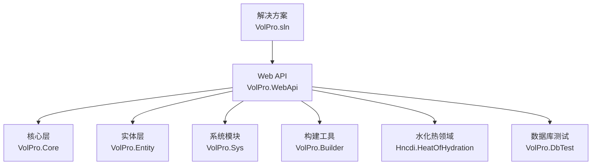
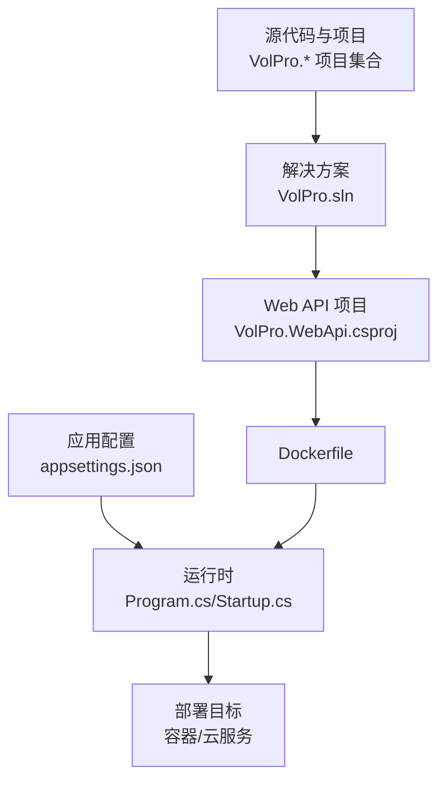
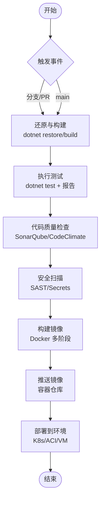
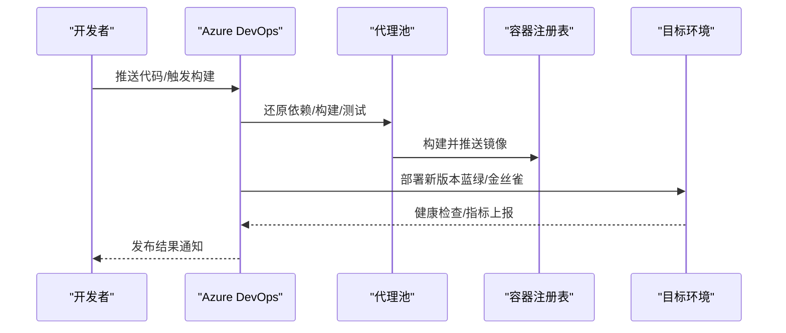
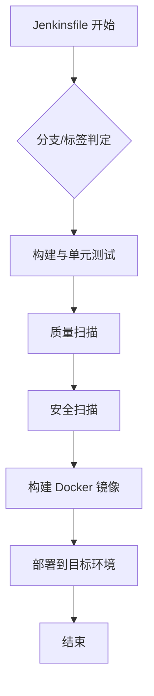
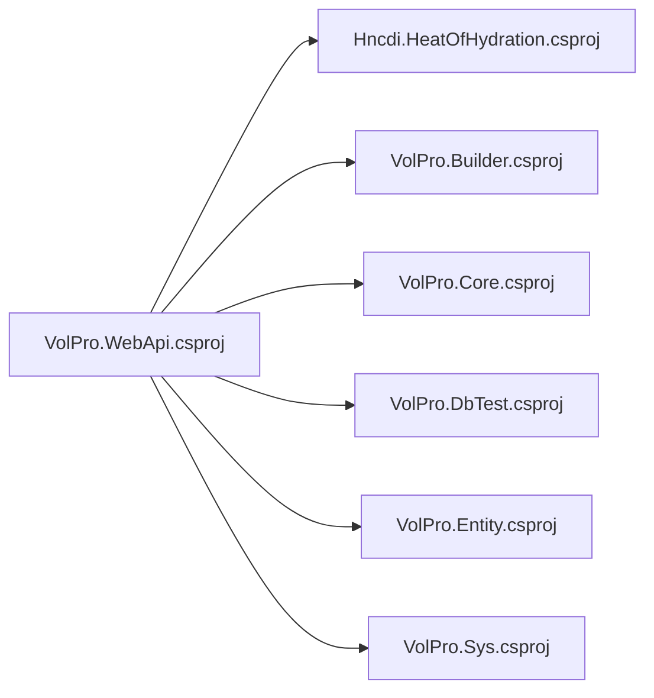

# 持续集成部署

<cite>
**本文引用的文件**
- [VolPro.WebApi/Dockerfile](file://VolPro.WebApi/Dockerfile)
- [VolPro.WebApi/appsettings.json](file://VolPro.WebApi/appsettings.json)
- [VolPro.WebApi/appsettings.Development.json](file://VolPro.WebApi/appsettings.Development.json)
- [VolPro.WebApi/Program.cs](file://VolPro.WebApi/Program.cs)
- [VolPro.WebApi/Startup.cs](file://VolPro.WebApi/Startup.cs)
- [VolPro.WebApi/VolPro.WebApi.csproj](file://VolPro.WebApi/VolPro.WebApi.csproj)
- [VolPro.sln](file://VolPro.sln)
</cite>

## 目录
1. [简介](#简介)
2. [项目结构](#项目结构)
3. [核心组件](#核心组件)
4. [架构总览](#架构总览)
5. [详细组件分析](#详细组件分析)
6. [依赖关系分析](#依赖关系分析)
7. [性能考虑](#性能考虑)
8. [故障排查指南](#故障排查指南)
9. [结论](#结论)
10. [附录](#附录)

## 简介
本文件面向“水化热平台”的持续集成与持续部署（CI/CD）场景，结合仓库中的实际工程结构与配置，给出可落地的自动化流水线设计建议，覆盖以下方面：
- GitHub Actions 工作流配置要点（构建、测试、打包、容器镜像、部署）
- Azure DevOps 管道配置要点（变量组、环境、发布管道）
- Jenkins CI 配置示例与插件清单
- 代码质量检查、自动化测试与安全扫描集成
- 部署前验证、蓝绿与金丝雀发布策略
- 回滚机制与灾难恢复
- 环境管理与密钥管理最佳实践

说明：本仓库未包含现成的CI/CD配置文件（如 .github/workflows/*.yml、azure-pipelines.yml、Jenkinsfile 等），因此本文以“基于现有工程结构与配置”的方式，提供可直接实施的流水线设计蓝图与图示。

## 项目结构
该仓库采用多项目解决方案组织，Web API 主项目位于 VolPro.WebApi，核心能力通过 VolPro.Core、VolPro.Entity、VolPro.Sys、VolPro.Builder 等模块提供；另有 Hncdi.HeatOfHydration 与 VolPro.DbTest 等子项目。整体结构如下：

图表来源
- [VolPro.sln:1-69](file://VolPro.sln#L1-L69)
- [VolPro.WebApi/VolPro.WebApi.csproj:40-47](file://VolPro.WebApi/VolPro.WebApi.csproj#L40-L47)

章节来源
- [VolPro.sln:1-69](file://VolPro.sln#L1-L69)
- [VolPro.WebApi/VolPro.WebApi.csproj:40-47](file://VolPro.WebApi/VolPro.WebApi.csproj#L40-L47)

## 核心组件
- Web API 运行时与端口绑定：Program.cs 中通过 Kestrel 绑定端口，便于容器化与外部访问。
- 启动配置与中间件：Startup.cs 负责服务注册、认证授权、Swagger、SignalR、静态文件、CORS 等。
- 应用配置：appsettings.json 定义数据库连接、Redis、JWT、Kafka、邮件、定时任务等运行参数。
- 容器化：Dockerfile 提供多阶段构建与发布产物复制，支持镜像快速构建与部署。

章节来源
- [VolPro.WebApi/Program.cs:17-38](file://VolPro.WebApi/Program.cs#L17-L38)
- [VolPro.WebApi/Startup.cs:60-213](file://VolPro.WebApi/Startup.cs#L60-L213)
- [VolPro.WebApi/appsettings.json:16-139](file://VolPro.WebApi/appsettings.json#L16-L139)
- [VolPro.WebApi/Dockerfile:1-29](file://VolPro.WebApi/Dockerfile#L1-L29)

## 架构总览
下图展示从源码到运行时的整体路径，以及与配置文件的关系：

图表来源
- [VolPro.sln:1-69](file://VolPro.sln#L1-L69)
- [VolPro.WebApi/VolPro.WebApi.csproj:1-55](file://VolPro.WebApi/VolPro.WebApi.csproj#L1-L55)
- [VolPro.WebApi/Dockerfile:1-29](file://VolPro.WebApi/Dockerfile#L1-L29)
- [VolPro.WebApi/appsettings.json:16-139](file://VolPro.WebApi/appsettings.json#L16-L139)
- [VolPro.WebApi/Program.cs:17-38](file://VolPro.WebApi/Program.cs#L17-L38)
- [VolPro.WebApi/Startup.cs:309-383](file://VolPro.WebApi/Startup.cs#L309-L383)

## 详细组件分析

### GitHub Actions 工作流设计
建议流水线包含以下阶段：
- 触发条件：push 到 main 分支、PR、tag 推送
- 步骤：
  - 设置 .NET SDK（与项目 TargetFramework 对齐）
  - 还原依赖与构建（Release）
  - 单元测试（含覆盖率收集）
  - 代码质量检查（SonarQube 或 CodeClimate）
  - 安全扫描（SAST/Secrets）
  - 打包与推送镜像（Docker）
  - 发布到目标环境（Kubernetes/Azure Container Apps/VM）

说明
- 使用 Dockerfile 进行多阶段构建，确保镜像最小化与可重复性。
- 将 appsettings.json 中的敏感配置通过环境变量注入（见“密钥管理最佳实践”）。

### Azure DevOps 管道设计
- 变量组（Variable Groups）
  - 数据库连接串、Redis、JWT 密钥、Kafka 凭据、邮件凭据等
  - 区分开发/测试/预发布/生产环境
- 环境（Environments）
  - 为每个环境创建环境资源（如 Kubernetes 集群、容器实例）
  - 在环境上配置审批与锁定规则
- 发布管道（Release Pipeline）
  - 基于 YAML 的多阶段流水线
  - 部署前检查：健康检查、配置校验、灰度阈值
  - 蓝绿/金丝雀发布：滚动更新、权重切换、回滚策略

### Jenkins CI 配置示例与插件清单
- 插件建议
  - Pipeline: Workflow Multibranch
  - Docker Pipeline Steps
  - SonarQube Scanner
  - Publish Over SSH / Azure CLI
  - Environment Injector
- Jenkinsfile 示例要点
  - 多分支流水线（根据分支/标签）
  - 阶段化：构建、测试、质量门禁、镜像构建、部署
  - 使用环境变量与密钥管理插件注入敏感配置

### 代码质量、测试与安全扫描集成
- 质量检查
  - 使用 SonarQube 或 Azure DevOps SonarQube 扩展
  - 关注覆盖率、重复率、技术债
- 自动化测试
  - 单元测试：xUnit/nUnit + 测试报告
  - 集成测试：基于 TestContainers 或外部数据库
- 安全扫描
  - SAST：Secret scanning、依赖漏洞扫描
  - 配置扫描：避免硬编码敏感信息

### 部署前验证、蓝绿与金丝雀发布
- 部署前验证
  - 配置校验：连接串、密钥、CORS、JWT 参数
  - 健康检查：/health、数据库连通性
  - 性能基线：启动时间、内存占用
- 蓝绿发布
  - 两套实例并行，流量切换
  - 失败即回滚至上一稳定版本
- 金丝雀发布
  - 逐步放量（如 10%→50%→100%）
  - 结合指标（错误率、P95）自动决策

### 回滚机制与灾难恢复
- 回滚
  - 版本标记与镜像标签管理
  - 快速回滚脚本或自动化按钮
- 灾难恢复
  - 数据库备份与恢复演练
  - 配置与密钥的异地备份
  - 多可用区部署与自动故障转移

### 环境管理与密钥管理最佳实践
- 环境隔离
  - 不同环境使用不同变量组与配置文件
  - 通过 appsettings.{Environment}.json 管理差异化
- 密钥管理
  - 使用 Azure Key Vault/AWS Secrets Manager/HashiCorp Vault
  - 避免将密钥写入仓库，使用环境变量注入
- 配置注入
  - 在容器编排中使用 ConfigMap/Secret
  - 在本地开发使用 user-secrets 或 .env（仅限开发）

章节来源
- [VolPro.WebApi/appsettings.json:16-139](file://VolPro.WebApi/appsettings.json#L16-L139)
- [VolPro.WebApi/appsettings.Development.json:1-10](file://VolPro.WebApi/appsettings.Development.json#L1-L10)

## 依赖关系分析
Web API 项目对各模块的依赖关系如下：

图表来源
- [VolPro.WebApi/VolPro.WebApi.csproj:40-47](file://VolPro.WebApi/VolPro.WebApi.csproj#L40-L47)

章节来源
- [VolPro.WebApi/VolPro.WebApi.csproj:40-47](file://VolPro.WebApi/VolPro.WebApi.csproj#L40-L47)

## 性能考虑
- 构建优化
  - 多阶段 Docker 构建减少镜像体积
  - 并行构建与缓存 NuGet/SDK
- 运行时优化
  - 合理设置 Kestrel 请求体大小与并发
  - 启用压缩与静态文件缓存
- 监控与可观测性
  - 集成 Application Insights 或 Prometheus
  - 关键指标：启动耗时、内存、GC、HTTP 延迟

## 故障排查指南
- 启动失败
  - 检查 Program.cs 中端口绑定与 IIS 配置
  - 查看 Startup.cs 中认证、CORS、Swagger 初始化日志
- 配置问题
  - appsettings.json 中数据库连接、Redis、JWT、Kafka 是否正确
  - 环境变量覆盖顺序与优先级
- 容器化问题
  - Dockerfile 构建阶段顺序与输出目录
  - ENTRYPOINT 与运行时命令一致性

章节来源
- [VolPro.WebApi/Program.cs:24-36](file://VolPro.WebApi/Program.cs#L24-L36)
- [VolPro.WebApi/Startup.cs:309-383](file://VolPro.WebApi/Startup.cs#L309-L383)
- [VolPro.WebApi/appsettings.json:16-139](file://VolPro.WebApi/appsettings.json#L16-L139)
- [VolPro.WebApi/Dockerfile:26-29](file://VolPro.WebApi/Dockerfile#L26-L29)

## 结论
通过将现有工程结构与配置（Dockerfile、appsettings、Program/Startup）与 CI/CD 最佳实践相结合，可实现：
- 可重复、可追溯的构建与发布
- 安全可控的密钥与配置管理
- 可观测、可回滚的部署策略
- 支持蓝绿与金丝雀的渐进式发布

## 附录
- Dockerfile 关键点
  - 多阶段构建与发布产物复制
  - 暴露端口与入口命令
- 配置文件关键点
  - 数据库连接、Redis、JWT、CORS、Kafka、邮件、定时任务等
- 运行时关键点
  - Kestrel 端口绑定、IIS 集成、中间件链路、Swagger 与 SignalR

章节来源
- [VolPro.WebApi/Dockerfile:1-29](file://VolPro.WebApi/Dockerfile#L1-L29)
- [VolPro.WebApi/appsettings.json:16-139](file://VolPro.WebApi/appsettings.json#L16-L139)
- [VolPro.WebApi/Program.cs:24-36](file://VolPro.WebApi/Program.cs#L24-L36)
- [VolPro.WebApi/Startup.cs:309-383](file://VolPro.WebApi/Startup.cs#L309-L383)