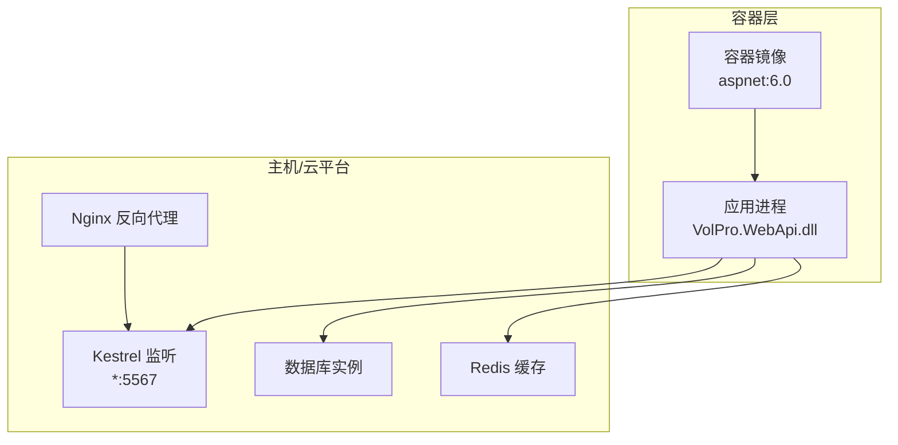
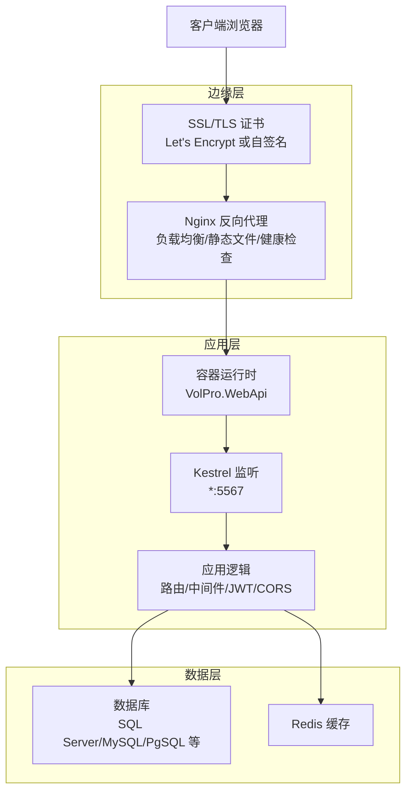
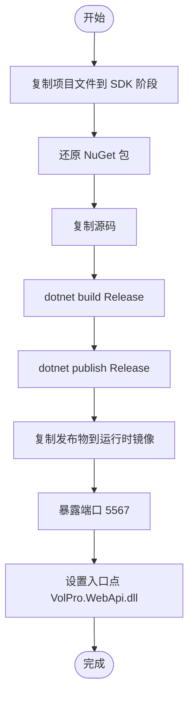
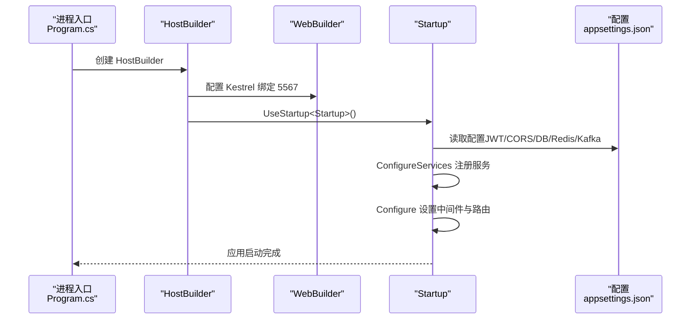

# 生产环境部署

<cite>
**本文引用的文件**
- [Dockerfile](file://VolPro.WebApi/Dockerfile)
- [appsettings.json](file://VolPro.WebApi/appsettings.json)
- [appsettings.Development.json](file://VolPro.WebApi/appsettings.Development.json)
- [Program.cs](file://VolPro.WebApi/Program.cs)
- [Startup.cs](file://VolPro.WebApi/Startup.cs)
- [.dockerignore](file://.dockerignore)
- [dev_run.bat](file://VolPro.WebApi/dev_run.bat)
- [dev_run2.bat](file://VolPro.WebApi/dev_run2.bat)
</cite>

## 目录
1. [简介](#简介)
2. [项目结构](#项目结构)
3. [核心组件](#核心组件)
4. [架构总览](#架构总览)
5. [详细组件分析](#详细组件分析)
6. [依赖关系分析](#依赖关系分析)
7. [性能考量](#性能考量)
8. [故障排查指南](#故障排查指南)
9. [结论](#结论)
10. [附录](#附录)

## 简介
本文件面向“水化热平台”生产环境部署，围绕容器化、反向代理、证书与云平台部署、CI/CD 流水线、部署脚本与自动化工具、部署验证与回滚策略等维度，提供系统性、可操作的指导。文档严格基于仓库现有配置与代码进行分析与提炼，避免臆测。

## 项目结构
- 后端采用 ASP.NET Core 6.0（容器基础镜像为 aspnet:6.0），通过多阶段构建发布至最终运行镜像。
- 配置集中于 appsettings.json，包含数据库连接、Redis、JWT、CORS、Kafka、邮件、定时任务等关键参数。
- 运行时绑定端口在 Program.cs 中显式配置，容器暴露端口与应用端口需保持一致。
- 开发期提供批处理脚本以辅助本地调试与热重载。

图表来源
- [Dockerfile:1-29](file://VolPro.WebApi/Dockerfile#L1-L29)
- [Program.cs:28-36](file://VolPro.WebApi/Program.cs#L28-L36)
- [appsettings.json:16-57](file://VolPro.WebApi/appsettings.json#L16-L57)

章节来源
- [Dockerfile:1-29](file://VolPro.WebApi/Dockerfile#L1-L29)
- [Program.cs:28-36](file://VolPro.WebApi/Program.cs#L28-L36)
- [appsettings.json:16-57](file://VolPro.WebApi/appsettings.json#L16-L57)

## 核心组件
- 容器镜像与构建
  - 多阶段构建：SDK 阶段恢复依赖与编译，Build 阶段产出构建产物，Publish 阶段发布，Final 阶段复制发布物到运行时镜像。
  - 暴露端口与入口：容器 EXPOSE 与 ENTRYPOINT 已配置，需确保与应用监听端口一致。
- 应用配置
  - 数据库连接：支持 MsSql/MySql/PgSql/Oracle/Kdbndp，示例为 MsSql；生产需替换为实际连接串与加密策略。
  - 缓存与 SignalR：可选 Redis 或内存缓存；SignalR 默认启用。
  - CORS：必须在配置中提供前端访问地址列表，否则启动即抛出异常。
  - JWT：密钥、签发方、受众、有效期等均在配置中集中管理。
  - Kafka：生产/消费开关与连接参数可按需启用。
- 运行时绑定
  - Kestrel 在 Program.cs 中绑定到 http://*:5567，容器 EXPOSE 也需同步该端口。

章节来源
- [Dockerfile:3-29](file://VolPro.WebApi/Dockerfile#L3-L29)
- [appsettings.json:16-139](file://VolPro.WebApi/appsettings.json#L16-L139)
- [Program.cs:28-36](file://VolPro.WebApi/Program.cs#L28-L36)

## 架构总览
下图展示生产环境典型拓扑：Nginx 作为反向代理与 SSL 终止，后端容器承载 ASP.NET Core 应用，应用访问数据库与 Redis 缓存。

图表来源
- [Startup.cs:309-382](file://VolPro.WebApi/Startup.cs#L309-L382)
- [appsettings.json:16-57](file://VolPro.WebApi/appsettings.json#L16-L57)
- [Program.cs:28-36](file://VolPro.WebApi/Program.cs#L28-L36)

## 详细组件分析

### 容器化与镜像构建
- 基础镜像与运行时
  - 基础镜像为 aspnet:6.0；最终运行镜像复制发布产物并以 VolPro.WebApi.dll 作为入口。
- 多阶段构建流程
  - SDK 阶段：复制 csproj 并还原依赖；随后复制源码并编译/构建。
  - 发布阶段：dotnet publish 输出到 /app/publish。
  - 最终阶段：复制发布物到 /app 并设置 ENTRYPOINT。
- 端口与暴露
  - Dockerfile EXPOSE 5567；Program.cs 中 Kestrel 绑定到 5567；需保持一致。
- .dockerignore
  - 忽略 IDE、构建输出、Git、日志等无关文件，减小镜像体积。

图表来源
- [Dockerfile:9-29](file://VolPro.WebApi/Dockerfile#L9-L29)

章节来源
- [Dockerfile:1-29](file://VolPro.WebApi/Dockerfile#L1-L29)
- [.dockerignore:1-25](file://.dockerignore#L1-L25)
- [Program.cs:28-36](file://VolPro.WebApi/Program.cs#L28-L36)

### Nginx 反向代理配置要点
- 负载均衡
  - 在 upstream 中配置后端容器实例，结合健康检查与权重实现弹性伸缩。
- SSL 终止
  - 使用 Let’s Encrypt 获取免费证书或自签名证书；在 server 块中配置 ssl_certificate、ssl_certificate_key。
- 静态文件服务
  - 将 Upload 等静态目录映射到 Nginx 的静态根目录，或通过 alias 映射到 Upload 物理路径。
- 访问控制与安全
  - 结合 CORS 与 JWT，确保仅允许受信来源访问；对敏感接口启用鉴权。
- 日志与监控
  - 开启 access_log 与 error_log，采集指标并接入监控告警。

（本节为概念性说明，未直接分析具体文件）

### SSL 证书配置指南
- Let’s Encrypt 免费证书
  - 使用 certbot/acme 客户端申请与续期；在 Nginx 中指向证书与私钥路径。
- 自签名证书
  - 生成自签名证书与私钥；在浏览器导入 CA 或在服务端信任链中配置。
- 注意事项
  - 证书域名需与前端与后端域名一致；生产环境建议强制 HTTPS。

（本节为概念性说明，未直接分析具体文件）

### Azure/AWS 云部署方案
- Azure 容器服务
  - 使用 Azure Container Apps 或 AKS：配置容器注册表、部署 YAML、HPA 自动扩缩容、Ingress/Nginx 控制器。
- AWS 容器服务
  - 使用 ECS/EKS：配置任务定义/集群、负载均衡、ALB/NLB、自动扩缩容策略。
- 关键配置
  - 环境变量覆盖 appsettings.json 中敏感配置；挂载持久化卷用于 Upload/日志。
  - 集成 WAF/DDoS 防护与网络 ACL。

（本节为概念性说明，未直接分析具体文件）

### CI/CD 流水线配置
- GitHub Actions
  - 触发条件：push 到主分支或打标签；步骤包括：构建 SDK 镜像、推送至容器注册表、部署到目标环境。
  - 安全：使用 secrets 管理证书、数据库连接串、容器注册表凭据。
- Azure DevOps
  - 管道阶段：构建（dotnet build/publish）、测试、打包镜像、推送、部署（Kubernetes/ACI/Container Apps）。
  - 环境：按环境划分变量组（开发/预发/生产），启用审批与回滚策略。

（本节为概念性说明，未直接分析具体文件）

### 部署脚本与自动化工具
- 开发期脚本
  - dev_run.bat：封装 dotnet watch 命令并输出错误日志，便于本地调试。
  - dev_run2.bat：指定 .NET 8 运行时的 watch run。
- 生产期建议
  - 使用 docker-compose 或 Kubernetes Deployment/YAML 管理容器生命周期。
  - 编写部署脚本（PowerShell/Shell）：构建镜像、推送、滚动更新、健康检查、回滚。

章节来源
- [dev_run.bat:1-20](file://VolPro.WebApi/dev_run.bat#L1-L20)
- [dev_run2.bat:1-3](file://VolPro.WebApi/dev_run2.bat#L1-L3)

### 部署验证与回滚策略
- 部署验证
  - 健康检查：通过 /health 接口或容器探针判断存活/就绪。
  - 功能验证：Swagger 文档可用、JWT 登录、静态文件访问、SignalR 连接。
  - 性能验证：基准测试与压力测试，观察 CPU/内存/IO。
- 回滚策略
  - 蓝绿/金丝雀：逐步切换流量，失败时快速回切。
  - 镜像版本标记：固定镜像标签，回滚时切换到上一稳定版本。
  - 配置回滚：通过环境变量或配置中心回滚到上一版本配置。

（本节为概念性说明，未直接分析具体文件）

## 依赖关系分析
- 应用启动流程
  - Program.cs 初始化 HostBuilder，绑定 Kestrel 到 5567，加载 Startup。
  - Startup.ConfigureServices 注册认证、CORS、Swagger、SignalR、SqlSugar 等。
  - Startup.Configure 设置中间件链、静态文件、Swagger UI、路由与终结点。
- 配置依赖
  - appsettings.json 提供数据库、缓存、JWT、CORS、Kafka、邮件、定时任务等全局配置。
  - appsettings.Development.json 仅覆盖日志级别，不影响生产配置。

图表来源
- [Program.cs:24-36](file://VolPro.WebApi/Program.cs#L24-L36)
- [Startup.cs:60-213](file://VolPro.WebApi/Startup.cs#L60-L213)
- [appsettings.json:16-139](file://VolPro.WebApi/appsettings.json#L16-L139)

章节来源
- [Program.cs:24-36](file://VolPro.WebApi/Program.cs#L24-L36)
- [Startup.cs:60-213](file://VolPro.WebApi/Startup.cs#L60-L213)
- [appsettings.json:16-139](file://VolPro.WebApi/appsettings.json#L16-L139)

## 性能考量
- 连接池与超时
  - 数据库连接串与超时参数需根据实例规格与网络延迟调整。
- 缓存策略
  - Redis 可显著降低数据库压力；生产建议启用并配置合适的过期策略。
- 文件上传与静态资源
  - 合理设置请求体大小限制与静态文件缓存头；必要时将静态资源迁移至 CDN。
- 定时任务与并发
  - Quartz 任务数量与并发度需与 CPU/内存匹配，避免争用。

（本节为通用指导，未直接分析具体文件）

## 故障排查指南
- CORS 异常
  - 现象：启动即抛出“请配置跨请求的前端 Url”异常。
  - 排查：确认 appsettings.json 中 CorsUrls 配置正确且包含前端访问地址。
- JWT 未通过
  - 现象：401 授权未通过响应。
  - 排查：核对 Issuer/Audience/SigningKey 与配置一致；检查 Token 是否过期。
- 数据库连接失败
  - 现象：应用无法连接数据库。
  - 排查：核对连接串、加密参数、网络连通性与防火墙规则。
- 静态文件不可访问
  - 现象：Upload 或静态资源 404。
  - 排查：确认物理路径与映射路径一致；检查 Nginx 静态文件配置与权限。
- 容器端口不一致
  - 现象：容器启动但无法访问。
  - 排查：确保 Dockerfile EXPOSE 与 Program.cs 绑定端口一致。

章节来源
- [Startup.cs:116-130](file://VolPro.WebApi/Startup.cs#L116-L130)
- [Startup.cs:102-114](file://VolPro.WebApi/Startup.cs#L102-L114)
- [appsettings.json:16-57](file://VolPro.WebApi/appsettings.json#L16-L57)
- [Program.cs:33](file://VolPro.WebApi/Program.cs#L33)

## 结论
本文基于仓库现有配置与代码，给出了水化热平台生产环境部署的系统性方案：容器化构建与运行、Nginx 反向代理与证书、云平台部署与自动扩缩容、CI/CD 流水线、部署脚本与自动化工具、部署验证与回滚策略。建议在生产落地前，结合实际网络与安全策略完善配置，并建立完善的监控与告警体系。

## 附录
- 关键配置清单
  - 数据库连接串与加密参数
  - Redis 连接串与启用状态
  - JWT 密钥、签发方、受众、有效期
  - CORS 前端地址列表
  - Kafka 生产/消费开关与连接参数
  - 定时任务访问密钥
- 端口与路径
  - 应用监听端口：5567
  - 容器暴露端口：5567
  - 静态文件目录：Upload（物理路径与映射需一致）

章节来源
- [appsettings.json:16-139](file://VolPro.WebApi/appsettings.json#L16-L139)
- [Program.cs:33](file://VolPro.WebApi/Program.cs#L33)
- [Dockerfile:7](file://VolPro.WebApi/Dockerfile#L7)