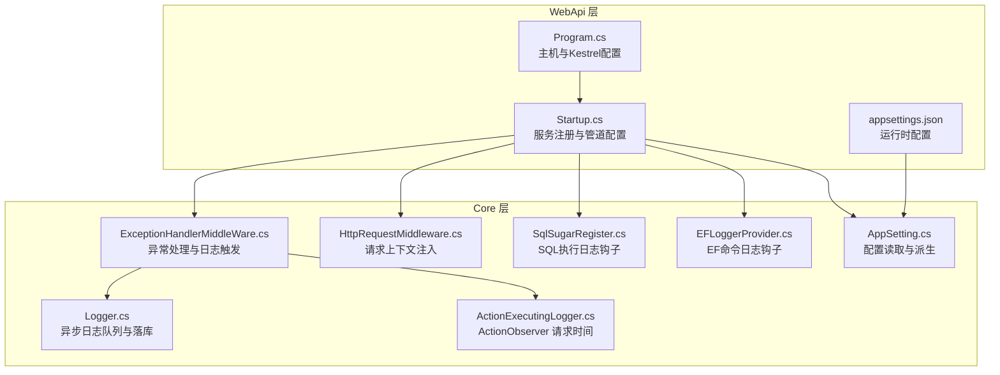
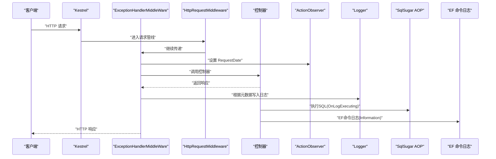
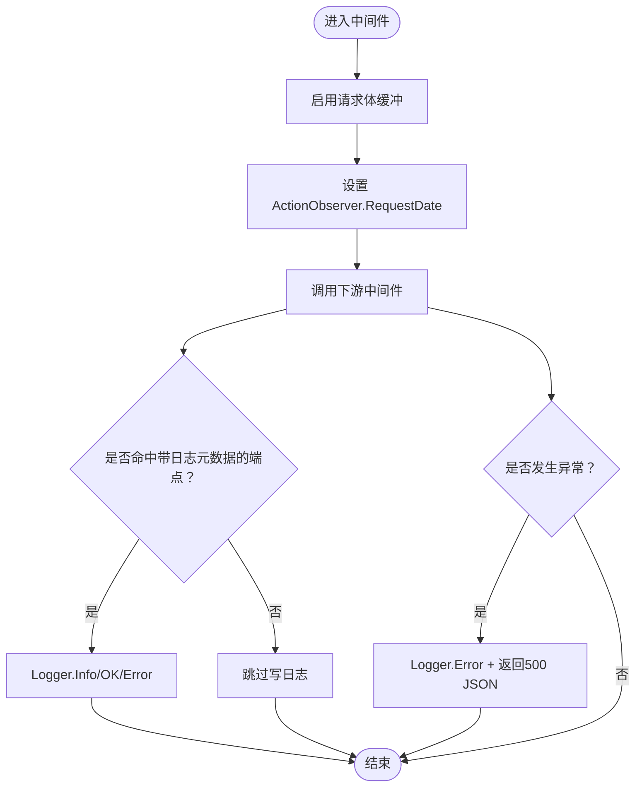
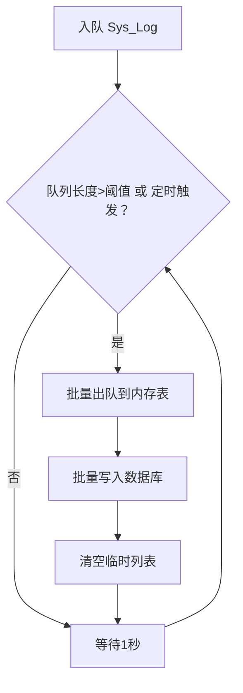
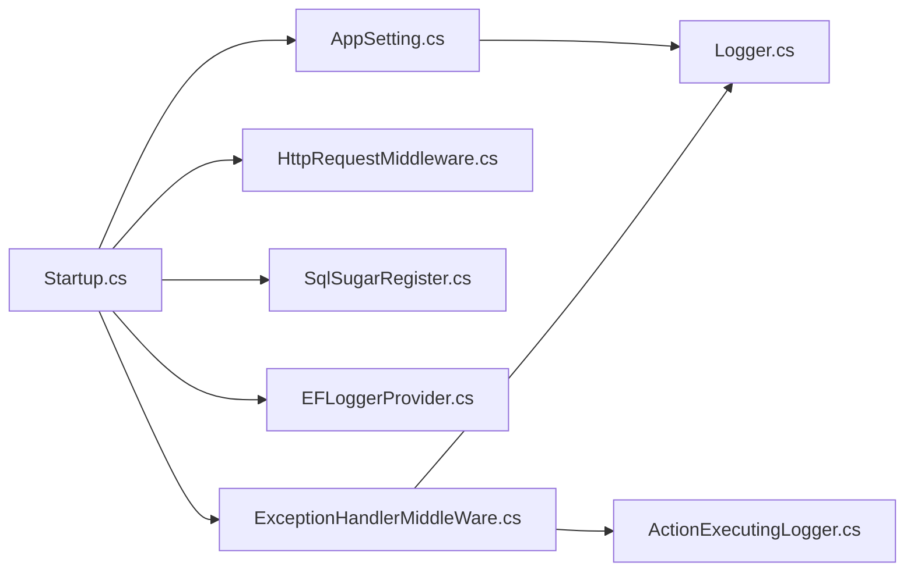

# 应用性能监控

<cite>
**本文引用的文件**
- [Program.cs](file://VolPro.WebApi/Program.cs)
- [Startup.cs](file://VolPro.WebApi/Startup.cs)
- [appsettings.json](file://VolPro.WebApi/appsettings.json)
- [appsettings.Development.json](file://VolPro.WebApi/appsettings.Development.json)
- [ExceptionHandlerMiddleWare.cs](file://VolPro.Core/Middleware/ExceptionHandlerMiddleWare.cs)
- [HttpRequestMiddleware.cs](file://VolPro.Core/Middleware/HttpRequestMiddleware.cs)
- [Logger.cs](file://VolPro.Core/Services/Logger.cs)
- [ActionExecutingLogger.cs](file://VolPro.Core/Services/ActionExecutingLogger.cs)
- [SqlSugarRegister.cs](file://VolPro.Core/DbSqlSugar/SqlSugarRegister.cs)
- [EFLoggerProvider.cs](file://VolPro.Core/EFDbContext/EFLoggerProvider.cs)
- [AppSetting.cs](file://VolPro.Core/Configuration/AppSetting.cs)
</cite>

## 目录
1. [简介](#简介)
2. [项目结构](#项目结构)
3. [核心组件](#核心组件)
4. [架构总览](#架构总览)
5. [详细组件分析](#详细组件分析)
6. [依赖关系分析](#依赖关系分析)
7. [性能考量](#性能考量)
8. [故障排查指南](#故障排查指南)
9. [结论](#结论)
10. [附录](#附录)

## 简介
本文件面向“水化热平台”后端服务，系统性梳理并文档化应用性能监控方案，覆盖以下方面：
- 请求响应时间、吞吐量、错误率等关键指标的采集与呈现路径
- 性能基准测试方法与瓶颈定位技术
- 日志记录体系：结构化日志格式、日志级别、异步写入机制
- 监控工具集成指南：Application Insights、Prometheus 等
- 性能优化建议与最佳实践

## 项目结构
本项目采用 ASP.NET Core 标准结构，WebApi 层负责启动与中间件管线，Core 层提供通用能力（日志、数据库、中间件、配置等）。与性能监控密切相关的模块集中在：
- 启动与主机配置：Program.cs、Startup.cs
- 中间件链路：异常处理、HTTP 请求上下文
- 日志与指标：Logger 异步队列、EF/SqlSugar 日志钩子
- 配置中心：appsettings.json、AppSetting.cs

图表来源
- [Program.cs:17-36](file://VolPro.WebApi/Program.cs#L17-L36)
- [Startup.cs:309-382](file://VolPro.WebApi/Startup.cs#L309-L382)
- [ExceptionHandlerMiddleWare.cs:28-106](file://VolPro.Core/Middleware/ExceptionHandlerMiddleWare.cs#L28-L106)
- [Logger.cs:27-207](file://VolPro.Core/Services/Logger.cs#L27-L207)
- [SqlSugarRegister.cs:76-131](file://VolPro.Core/DbSqlSugar/SqlSugarRegister.cs#L76-L131)
- [EFLoggerProvider.cs:9-34](file://VolPro.Core/EFDbContext/EFLoggerProvider.cs#L9-L34)
- [AppSetting.cs:85-163](file://VolPro.Core/Configuration/AppSetting.cs#L85-L163)

章节来源
- [Program.cs:17-36](file://VolPro.WebApi/Program.cs#L17-L36)
- [Startup.cs:60-213](file://VolPro.WebApi/Startup.cs#L60-L213)

## 核心组件
- 主机与服务器配置：Program.cs 使用 Kestrel 并绑定端口，便于后续接入外部监控探针。
- 中间件链：异常处理中间件在路由之后执行，统一捕获异常并记录；HTTP 请求中间件用于响应头透传等上下文注入。
- 日志系统：Logger 提供异步队列写入，按秒批量入库，支持 Info/Error/OK 三类状态；ActionObserver 记录请求开始时间，用于计算耗时。
- 数据库日志：SqlSugar 的 AOP OnLogExecuting 输出 SQL；EF 的 EFLoggerProvider 过滤并输出数据库命令日志。
- 配置中心：AppSetting 负责从 appsettings.json 解析并派生运行时配置，影响日志路径、缓存策略等。

章节来源
- [Program.cs:24-36](file://VolPro.WebApi/Program.cs#L24-L36)
- [ExceptionHandlerMiddleWare.cs:28-106](file://VolPro.Core/Middleware/ExceptionHandlerMiddleWare.cs#L28-L106)
- [Logger.cs:27-207](file://VolPro.Core/Services/Logger.cs#L27-L207)
- [ActionExecutingLogger.cs:8-27](file://VolPro.Core/Services/ActionExecutingLogger.cs#L8-L27)
- [SqlSugarRegister.cs:110-125](file://VolPro.Core/DbSqlSugar/SqlSugarRegister.cs#L110-L125)
- [EFLoggerProvider.cs:22-30](file://VolPro.Core/EFDbContext/EFLoggerProvider.cs#L22-L30)
- [AppSetting.cs:85-163](file://VolPro.Core/Configuration/AppSetting.cs#L85-L163)

## 架构总览
下图展示请求在中间件链中的流转、日志与数据库日志钩子的触发时机，以及配置对运行行为的影响。

图表来源
- [Startup.cs:309-382](file://VolPro.WebApi/Startup.cs#L309-L382)
- [ExceptionHandlerMiddleWare.cs:28-106](file://VolPro.Core/Middleware/ExceptionHandlerMiddleWare.cs#L28-L106)
- [Logger.cs:121-170](file://VolPro.Core/Services/Logger.cs#L121-L170)
- [SqlSugarRegister.cs:110-125](file://VolPro.Core/DbSqlSugar/SqlSugarRegister.cs#L110-L125)
- [EFLoggerProvider.cs:22-30](file://VolPro.Core/EFDbContext/EFLoggerProvider.cs#L22-L30)

## 详细组件分析

### 组件一：异常处理与日志触发（ExceptionHandlerMiddleWare）
- 功能要点
  - 在路由之后拦截请求，记录 Action 开始时间，处理文件访问授权，调用下游中间件。
  - 对命中带有 ActionLog 元数据的端点，触发 Logger 写入；异常时统一记录错误日志并返回 JSON。
- 关键路径
  - 请求进入：设置 ActionObserver.RequestDate
  - 正常返回：根据端点元数据决定是否写日志
  - 异常捕获：记录异常日志并返回 500 JSON

图表来源
- [ExceptionHandlerMiddleWare.cs:28-106](file://VolPro.Core/Middleware/ExceptionHandlerMiddleWare.cs#L28-L106)

章节来源
- [ExceptionHandlerMiddleWare.cs:28-106](file://VolPro.Core/Middleware/ExceptionHandlerMiddleWare.cs#L28-L106)

### 组件二：HTTP 请求上下文中间件（HttpRequestMiddleware）
- 功能要点
  - 在响应头中暴露 Access-Control-Expose-Headers，便于前端读取特定响应头。
  - 作为请求上下文注入的前置中间件，确保后续中间件可获取 HttpContext。

章节来源
- [HttpRequestMiddleware.cs:12-25](file://VolPro.Core/Middleware/HttpRequestMiddleware.cs#L12-L25)

### 组件三：异步日志系统（Logger）
- 功能要点
  - 使用 ConcurrentQueue 收集日志条目，后台定时批量写入数据库，减少 IO 压力。
  - 计算 ElapsedTime（毫秒），记录请求 URL、用户 IP、服务 IP、浏览器类型等。
  - 支持 Info/OK/Error 三类状态，异步与同步两种写入入口。
- 关键路径
  - Add/AddAsync：构造 Sys_Log 并入队
  - Start：每秒批量写入（不同数据库类型采用不同批量方式）

图表来源
- [Logger.cs:27-207](file://VolPro.Core/Services/Logger.cs#L27-L207)

章节来源
- [Logger.cs:27-207](file://VolPro.Core/Services/Logger.cs#L27-L207)

### 组件四：请求时间观测（ActionObserver）
- 功能要点
  - 记录每次请求开始时间，供日志系统计算耗时。
  - 提供 IsWrite 标记避免重复写日志。

章节来源
- [ActionExecutingLogger.cs:8-27](file://VolPro.Core/Services/ActionExecutingLogger.cs#L8-L27)

### 组件五：数据库日志钩子（SqlSugar AOP、EF 命令日志）
- 功能要点
  - SqlSugar：在 OnLogExecuting 回调中输出 SQL，便于定位慢查询与异常 SQL。
  - EF：通过 EFLoggerProvider 过滤 Category 为 Microsoft.EntityFrameworkCore.Database.Command 且 Level 为 Information 的日志，输出到控制台。
- 影响范围
  - 所有业务库与系统库的 SQL 执行均会被记录，便于性能分析与问题定位。

章节来源
- [SqlSugarRegister.cs:110-125](file://VolPro.Core/DbSqlSugar/SqlSugarRegister.cs#L110-L125)
- [EFLoggerProvider.cs:22-30](file://VolPro.Core/EFDbContext/EFLoggerProvider.cs#L22-L30)

### 组件六：配置中心（AppSetting）
- 功能要点
  - 从 appsettings.json 读取连接串、缓存开关、信号通道、雪花算法、用户权限等配置。
  - 提供运行时派生配置（如下载路径、静态资源路径等）。
- 性能相关
  - 缓存与 Redis 开关、批量写日志路径等均受配置影响。

章节来源
- [AppSetting.cs:85-163](file://VolPro.Core/Configuration/AppSetting.cs#L85-L163)
- [appsettings.json:16-57](file://VolPro.WebApi/appsettings.json#L16-L57)

## 依赖关系分析
- 中间件依赖
  - Startup.Configure 注册异常处理中间件与 HTTP 请求中间件，确保异常统一处理与上下文可用。
- 日志依赖
  - Logger 依赖 HttpContext、ActionObserver、AppSetting（下载路径、日志队列）。
- 数据库日志依赖
  - SqlSugarRegister 与 EFLoggerProvider 分别为 ORM 层提供日志钩子。
- 配置依赖
  - AppSetting.Init 在服务容器构建后解析配置，供全局使用。

图表来源
- [Startup.cs:309-382](file://VolPro.WebApi/Startup.cs#L309-L382)
- [Logger.cs:27-207](file://VolPro.Core/Services/Logger.cs#L27-L207)
- [SqlSugarRegister.cs:76-131](file://VolPro.Core/DbSqlSugar/SqlSugarRegister.cs#L76-L131)
- [EFLoggerProvider.cs:9-34](file://VolPro.Core/EFDbContext/EFLoggerProvider.cs#L9-L34)
- [AppSetting.cs:85-163](file://VolPro.Core/Configuration/AppSetting.cs#L85-L163)

章节来源
- [Startup.cs:309-382](file://VolPro.WebApi/Startup.cs#L309-L382)

## 性能考量
- 请求响应时间
  - 通过 ActionObserver.RequestDate 与日志 EndDate 计算 ElapsedTime（毫秒），可用于统计 P50/P90/P99 响应时间。
  - 建议在网关或反向代理层补充上游耗时指标，形成端到端时延视图。
- 吞吐量
  - 以每秒请求数（QPS）衡量；可通过日志中的时间戳与 URL 聚合统计。
  - 注意并发与连接池上限，结合 Kestrel 与数据库连接数配置进行压测。
- 错误率
  - 通过 Logger.Status（Success/Error/Info）与异常中间件返回码（500）统计错误率。
- 数据库性能
  - 利用 SqlSugar AOP 与 EF 命令日志定位慢 SQL；结合数据库执行计划与索引策略优化。
- 日志写入
  - Logger 采用每秒批量写入与内存表聚合，降低 IO 压力；建议根据业务峰值调整批量阈值与写入周期。

[本节为通用性能讨论，无需列出具体文件来源]

## 故障排查指南
- 异常统一处理
  - 异常中间件捕获异常并记录日志，开发环境下输出详细信息，生产环境返回统一 JSON。
- 日志落盘
  - 若数据库写入失败，Logger 会回退到本地文本文件记录错误堆栈，便于离线排查。
- 数据库日志
  - SQL 执行日志与 EF 命令日志均可在控制台查看，优先关注超长执行时间与高频率重复 SQL。

章节来源
- [ExceptionHandlerMiddleWare.cs:90-106](file://VolPro.Core/Middleware/ExceptionHandlerMiddleWare.cs#L90-L106)
- [Logger.cs:209-219](file://VolPro.Core/Services/Logger.cs#L209-L219)
- [EFLoggerProvider.cs:22-30](file://VolPro.Core/EFDbContext/EFLoggerProvider.cs#L22-L30)

## 结论
本项目已具备完善的请求拦截、异常统一处理与异步日志落库能力，并通过 ORM 层日志钩子实现数据库侧可观测性。建议在此基础上：
- 引入外部监控系统（如 Application Insights、Prometheus+Grafana）采集指标与日志
- 建立性能基线与告警阈值
- 将关键业务接口纳入 APM 探针，形成端到端性能视图

[本节为总结性内容，无需列出具体文件来源]

## 附录

### A. 性能指标采集清单
- 请求响应时间：基于 ActionObserver.RequestDate 与日志 EndDate 计算
- 吞吐量：按时间窗口统计请求数
- 错误率：统计状态为 Error 的日志占比
- 数据库慢 SQL：通过 SqlSugar AOP 与 EF 命令日志识别
- 日志写入延迟：观察批量写入周期与队列长度

章节来源
- [ActionExecutingLogger.cs:15-23](file://VolPro.Core/Services/ActionExecutingLogger.cs#L15-L23)
- [Logger.cs:237-237](file://VolPro.Core/Services/Logger.cs#L237-L237)
- [SqlSugarRegister.cs:115-124](file://VolPro.Core/DbSqlSugar/SqlSugarRegister.cs#L115-L124)
- [EFLoggerProvider.cs:22-30](file://VolPro.Core/EFDbContext/EFLoggerProvider.cs#L22-L30)

### B. 监控工具集成指南
- Application Insights
  - 在服务注册阶段引入 Application Insights SDK，并配置 Instrumentation Key。
  - 通过中间件或 AOP 记录自定义事件与度量，结合日志系统实现端到端追踪。
- Prometheus
  - 暴露 /metrics 端点，导出请求耗时直方图、错误计数器、数据库查询次数等。
  - 使用日志系统与数据库日志作为数据源，结合外部采集器（如 Prometheus Exporter）汇聚指标。
- Grafana
  - 以 Prometheus 为数据源，创建面板展示 P50/P90/P99 响应时间、错误率、吞吐量与慢 SQL TopN。

[本节为通用集成指导，无需列出具体文件来源]

### C. 性能基准测试与瓶颈分析
- 基准测试
  - 使用压测工具（如 k6、JMeter）模拟并发场景，采集 QPS、响应时间分布、错误率。
  - 对比启用/禁用缓存、不同批量写入周期的日志策略对吞吐与延迟的影响。
- 瓶颈分析
  - 依据日志中的 ElapsedTime 与数据库日志定位热点接口与慢 SQL。
  - 结合 Kestrel 连接数、数据库连接池上限与 GC 行为进行综合分析。

[本节为通用方法论，无需列出具体文件来源]