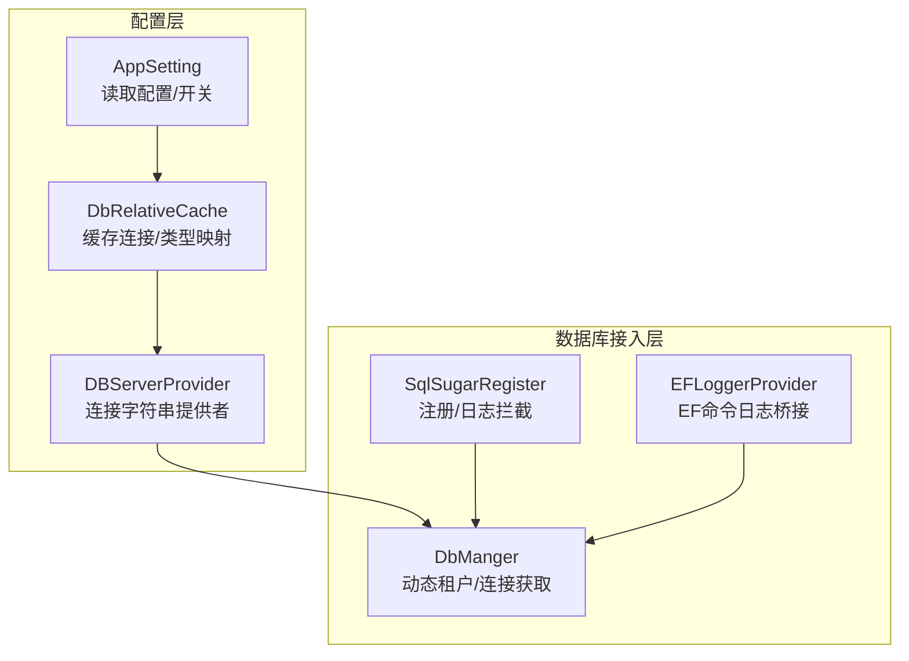
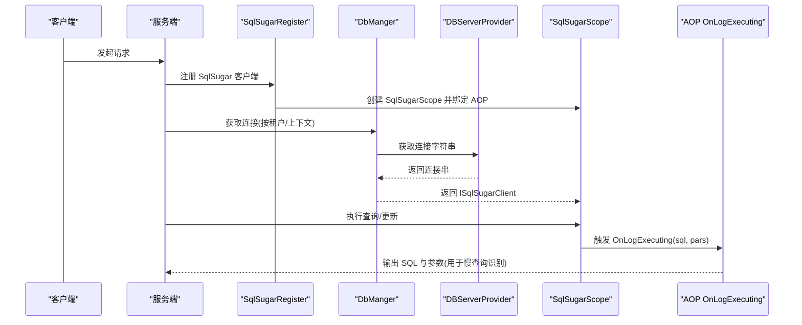
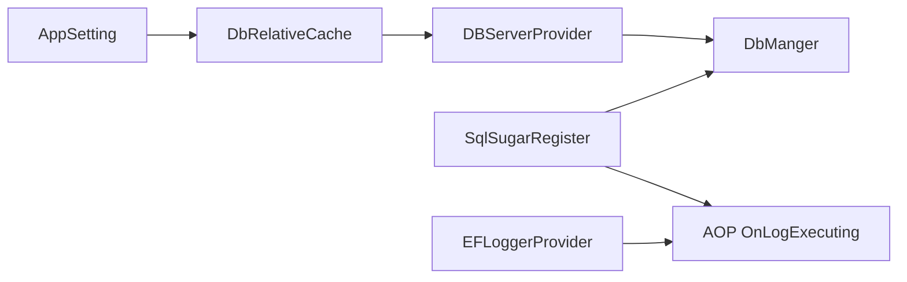

# 数据库性能监控

<cite>
**本文引用的文件**
- [SqlSugarRegister.cs](file://VolPro.Core/DbSqlSugar/SqlSugarRegister.cs)
- [DbManger.cs](file://VolPro.Core/DbSqlSugar/DbManger.cs)
- [DBServerProvider.cs](file://VolPro.Core/DbManager/DBServerProvider.cs)
- [DbRelativeCache.cs](file://VolPro.Core/DbManager/DbRelativeCache.cs)
- [AppSetting.cs](file://VolPro.Core/Configuration/AppSetting.cs)
- [EFLoggerProvider.cs](file://VolPro.Core/EFDbContext/EFLoggerProvider.cs)
</cite>

## 目录
1. [简介](#简介)
2. [项目结构](#项目结构)
3. [核心组件](#核心组件)
4. [架构总览](#架构总览)
5. [详细组件分析](#详细组件分析)
6. [依赖关系分析](#依赖关系分析)
7. [性能考量](#性能考量)
8. [故障排查指南](#故障排查指南)
9. [结论](#结论)
10. [附录](#附录)

## 简介
本文件面向“水化热平台”的数据库性能监控与调优，聚焦以下目标：
- 数据库查询性能分析：慢查询识别、查询计划优化、执行时间监控
- 连接池监控：连接数统计、连接泄漏检测、连接池配置优化
- 索引使用情况监控：索引命中率分析与使用建议
- 数据库性能调优：索引优化、查询优化、数据库配置调优
- 监控工具集成：SQL Profiler、Performance Monitor 等

基于仓库现有代码，重点围绕 SqlSugar 的注册与日志拦截、EF Core 日志桥接、多数据库连接配置与动态租户分库能力，给出可落地的监控与优化实践路径。

## 项目结构
与数据库性能监控直接相关的核心模块如下：
- 数据库注册与日志拦截：SqlSugar 注册、AOP 日志拦截
- 连接配置与动态分库：连接字符串缓存、按租户动态获取连接
- EF Core 日志桥接：将 EF Core 命令日志输出到控制台
- 配置中心：连接串、数据库类型、动态分库开关等

图表来源
- [AppSetting.cs:85-163](file://VolPro.Core/Configuration/AppSetting.cs#L85-L163)
- [DbRelativeCache.cs:25-72](file://VolPro.Core/DbManager/DbRelativeCache.cs#L25-L72)
- [DBServerProvider.cs:108-127](file://VolPro.Core/DbManager/DBServerProvider.cs#L108-L127)
- [SqlSugarRegister.cs:76-131](file://VolPro.Core/DbSqlSugar/SqlSugarRegister.cs#L76-L131)
- [DbManger.cs:115-131](file://VolPro.Core/DbSqlSugar/DbManger.cs#L115-L131)
- [EFLoggerProvider.cs:22-30](file://VolPro.Core/EFDbContext/EFLoggerProvider.cs#L22-L30)

章节来源
- [AppSetting.cs:85-163](file://VolPro.Core/Configuration/AppSetting.cs#L85-L163)
- [DbRelativeCache.cs:25-72](file://VolPro.Core/DbManager/DbRelativeCache.cs#L25-L72)
- [DBServerProvider.cs:108-127](file://VolPro.Core/DbManager/DBServerProvider.cs#L108-L127)
- [SqlSugarRegister.cs:76-131](file://VolPro.Core/DbSqlSugar/SqlSugarRegister.cs#L76-L131)
- [DbManger.cs:115-131](file://VolPro.Core/DbSqlSugar/DbManger.cs#L115-L131)
- [EFLoggerProvider.cs:22-30](file://VolPro.Core/EFDbContext/EFLoggerProvider.cs#L22-L30)

## 核心组件
- SqlSugarRegister：集中注册多个 ConnectionConfig，并为业务库与全局设置 AOP 日志拦截，便于统一采集 SQL 执行信息
- DbManger：提供按租户动态添加/获取连接的能力；封装系统库与业务库的获取入口
- DBServerProvider：根据上下文/租户动态返回正确的连接字符串
- DbRelativeCache：扫描并缓存各 DbContext 的连接字符串与数据库类型，支持动态分库
- AppSetting：集中读取配置（含连接串、数据库类型、动态分库开关）
- EFLoggerProvider：将 EF Core 的命令日志输出到控制台，辅助查询性能观测

章节来源
- [SqlSugarRegister.cs:76-131](file://VolPro.Core/DbSqlSugar/SqlSugarRegister.cs#L76-L131)
- [DbManger.cs:26-57](file://VolPro.Core/DbSqlSugar/DbManger.cs#L26-L57)
- [DBServerProvider.cs:108-127](file://VolPro.Core/DbManager/DBServerProvider.cs#L108-L127)
- [DbRelativeCache.cs:25-72](file://VolPro.Core/DbManager/DbRelativeCache.cs#L25-L72)
- [AppSetting.cs:176-184](file://VolPro.Core/Configuration/AppSetting.cs#L176-L184)
- [EFLoggerProvider.cs:22-30](file://VolPro.Core/EFDbContext/EFLoggerProvider.cs#L22-L30)

## 架构总览
下图展示从配置到数据库访问的关键链路，以及日志采集点位：

图表来源
- [SqlSugarRegister.cs:104-129](file://VolPro.Core/DbSqlSugar/SqlSugarRegister.cs#L104-L129)
- [DbManger.cs:115-131](file://VolPro.Core/DbSqlSugar/DbManger.cs#L115-L131)
- [DBServerProvider.cs:116-127](file://VolPro.Core/DbManager/DBServerProvider.cs#L116-L127)

## 详细组件分析

### 组件一：SqlSugar 注册与日志拦截
- 能力要点
  - 支持多连接配置（系统库、业务库、动态租户库）
  - 全局与业务库 AOP 日志拦截，统一输出 SQL 与参数
  - 可扩展 ConfigureExternalServices 实现字段命名策略（如大小写转换）

- 监控价值
  - 通过 OnLogExecuting 可采集 SQL 执行信息，作为慢查询识别与执行时间监控的基础
  - 可在此处扩展耗时统计、错误计数、重复 SQL 检测等

- 优化建议
  - 在生产环境建议将日志输出重定向至专用日志系统（如 Serilog/Seq），避免 Console 带来的性能开销
  - 对高频重复 SQL 建议引入查询结果缓存或 SQL 去重策略

章节来源
- [SqlSugarRegister.cs:76-131](file://VolPro.Core/DbSqlSugar/SqlSugarRegister.cs#L76-L131)
- [SqlSugarRegister.cs:137-151](file://VolPro.Core/DbSqlSugar/SqlSugarRegister.cs#L137-L151)

### 组件二：动态租户与连接管理（DbManger）
- 能力要点
  - 按租户动态添加/获取连接，支持无限分库场景
  - 提供系统库与业务库统一入口
  - 结合 AppSetting.UseDynamicShareDB 决定是否走动态分库

- 监控价值
  - 通过动态连接管理，可对每个租户建立独立的连接池视图，便于统计连接数与泄漏检测
  - 可结合日志拦截统计各租户的 SQL 执行量与耗时

- 优化建议
  - 建议为每个租户建立独立的连接池统计维度，便于定位异常租户
  - 对长时间不活跃的租户连接应考虑超时回收，避免资源泄露

章节来源
- [DbManger.cs:26-57](file://VolPro.Core/DbSqlSugar/DbManger.cs#L26-L57)
- [DbManger.cs:115-131](file://VolPro.Core/DbSqlSugar/DbManger.cs#L115-L131)
- [AppSetting.cs:69](file://VolPro.Core/Configuration/AppSetting.cs#L69)

### 组件三：连接字符串与数据库类型缓存（DbRelativeCache）
- 能力要点
  - 自动扫描并缓存各 DbContext 的连接字符串与数据库类型
  - 支持根据 DbContext 名称获取连接字符串，兼容动态分库场景

- 监控价值
  - 为连接池监控提供准确的连接串来源，便于区分不同数据库实例
  - 为索引与查询优化提供数据库类型信息（如 PostgreSQL/MySQL/SqlServer 差异）

- 优化建议
  - 建议在缓存中记录连接串指纹，用于检测连接串变更导致的连接池重建
  - 对数据库类型进行白名单校验，避免不支持的类型被误用

章节来源
- [DbRelativeCache.cs:25-72](file://VolPro.Core/DbManager/DbRelativeCache.cs#L25-L72)
- [DbRelativeCache.cs:99-107](file://VolPro.Core/DbManager/DbRelativeCache.cs#L99-L107)
- [DbRelativeCache.cs:144-159](file://VolPro.Core/DbManager/DbRelativeCache.cs#L144-L159)

### 组件四：连接字符串提供者（DBServerProvider）
- 能力要点
  - 提供系统库与业务库连接字符串
  - 支持动态租户分库，按当前用户选择的数据库返回连接串

- 监控价值
  - 为连接池监控提供准确的连接来源，便于按租户/库维度统计
  - 为慢查询定位提供库级上下文

- 优化建议
  - 建议在获取连接串失败时记录详细错误（如缺少租户配置），便于快速定位问题

章节来源
- [DBServerProvider.cs:108-127](file://VolPro.Core/DbManager/DBServerProvider.cs#L108-L127)
- [DBServerProvider.cs:133-136](file://VolPro.Core/DbManager/DBServerProvider.cs#L133-L136)

### 组件五：EF Core 日志桥接（EFLoggerProvider）
- 能力要点
  - 将 EF Core 的命令日志（类别为 Microsoft.EntityFrameworkCore.Database.Command）输出到控制台
  - 仅在 Information 级别下输出，避免噪声

- 监控价值
  - 辅助识别 EF Core 发出的底层 SQL，与 SqlSugar 日志形成互补
  - 适合在混合使用 EF Core 与 SqlSugar 的场景下统一观测

- 优化建议
  - 生产环境建议将 EF Core 日志也重定向到统一日志系统，便于聚合分析

章节来源
- [EFLoggerProvider.cs:22-30](file://VolPro.Core/EFDbContext/EFLoggerProvider.cs#L22-L30)

## 依赖关系分析
- SqlSugarRegister 依赖 DbManger 与 DBServerProvider 获取连接配置，并注入 AOP 日志拦截
- DbManger 依赖 DbRelativeCache 与 DBServerProvider 获取连接串与数据库类型
- AppSetting 为上述组件提供配置基础（连接串、数据库类型、动态分库开关）
- EFLoggerProvider 与 SqlSugar 的日志拦截共同构成查询 SQL 的可观测性基础

图表来源
- [AppSetting.cs:85-163](file://VolPro.Core/Configuration/AppSetting.cs#L85-L163)
- [DbRelativeCache.cs:25-72](file://VolPro.Core/DbManager/DbRelativeCache.cs#L25-L72)
- [DBServerProvider.cs:108-127](file://VolPro.Core/DbManager/DBServerProvider.cs#L108-L127)
- [DbManger.cs:115-131](file://VolPro.Core/DbSqlSugar/DbManger.cs#L115-L131)
- [SqlSugarRegister.cs:104-129](file://VolPro.Core/DbSqlSugar/SqlSugarRegister.cs#L104-L129)
- [EFLoggerProvider.cs:22-30](file://VolPro.Core/EFDbContext/EFLoggerProvider.cs#L22-L30)

章节来源
- [AppSetting.cs:85-163](file://VolPro.Core/Configuration/AppSetting.cs#L85-L163)
- [DbRelativeCache.cs:25-72](file://VolPro.Core/DbManager/DbRelativeCache.cs#L25-L72)
- [DBServerProvider.cs:108-127](file://VolPro.Core/DbManager/DBServerProvider.cs#L108-L127)
- [DbManger.cs:115-131](file://VolPro.Core/DbSqlSugar/DbManger.cs#L115-L131)
- [SqlSugarRegister.cs:104-129](file://VolPro.Core/DbSqlSugar/SqlSugarRegister.cs#L104-L129)
- [EFLoggerProvider.cs:22-30](file://VolPro.Core/EFDbContext/EFLoggerProvider.cs#L22-L30)

## 性能考量
- 查询性能分析
  - 利用 SqlSugar 的 AOP OnLogExecuting 与 EFLoggerProvider 输出 SQL，结合应用日志系统实现慢查询识别
  - 建议在 AOP 中增加执行时间统计与参数脱敏，便于后续分析
- 连接池监控
  - 基于 DbManger 的动态租户连接管理，可按租户维度统计连接数与使用率
  - 建议引入连接池健康检查与超时回收策略，防止连接泄漏
- 索引使用情况监控
  - 结合数据库自带的执行计划分析工具（如 SQL Server 的执行计划、PostgreSQL 的 EXPLAIN/ANALYZE）与应用侧 SQL 日志，评估索引命中率
  - 建议定期巡检热点表与慢 SQL，针对性补充或调整索引
- 数据库配置调优
  - 根据数据库类型（SqlServer/PostgreSQL/MySQL/达梦等）采用差异化参数
  - 合理设置连接池大小、超时时间、事务隔离级别等

## 故障排查指南
- 慢查询定位
  - 步骤：开启 AOP 日志与 EF Core 命令日志 → 重现问题 → 在日志中筛选耗时长的 SQL → 使用数据库执行计划分析
  - 关注点：是否存在全表扫描、索引缺失、参数嗅探、锁等待
- 连接泄漏检测
  - 现象：连接池耗尽、连接数持续增长
  - 排查：确认是否正确释放连接、是否存在长时间未关闭的事务、动态租户连接是否及时回收
- 索引命中率低
  - 现象：大量慢查询、CPU 占用高
  - 排查：核对执行计划、确认索引覆盖度、避免函数作用于索引列、定期维护统计信息

章节来源
- [SqlSugarRegister.cs:115-125](file://VolPro.Core/DbSqlSugar/SqlSugarRegister.cs#L115-L125)
- [EFLoggerProvider.cs:22-30](file://VolPro.Core/EFDbContext/EFLoggerProvider.cs#L22-L30)

## 结论
通过现有代码的 AOP 日志拦截与动态连接管理，已具备数据库性能监控与调优的基础能力。建议在此基础上：
- 引入统一日志系统与指标采集（如 Prometheus/Grafana）
- 增强慢查询与连接池监控告警
- 建立索引使用情况与执行计划的自动化巡检流程
- 结合数据库厂商工具（如 SQL Profiler、Performance Monitor、EXPLAIN/ANALYZE）完善诊断手段

## 附录
- 监控工具集成建议
  - SQL Profiler：捕获数据库事件流，定位慢查询与阻塞
  - Performance Monitor：采集 CPU、内存、磁盘、网络与 SQL Server 性能计数器
  - 数据库执行计划：对比优化前后执行计划变化
  - 应用侧指标：SQL 执行次数、耗时分布、错误率、连接池使用率