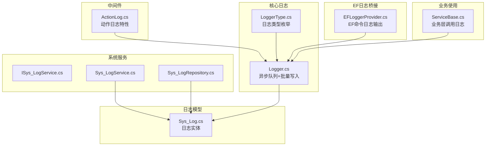
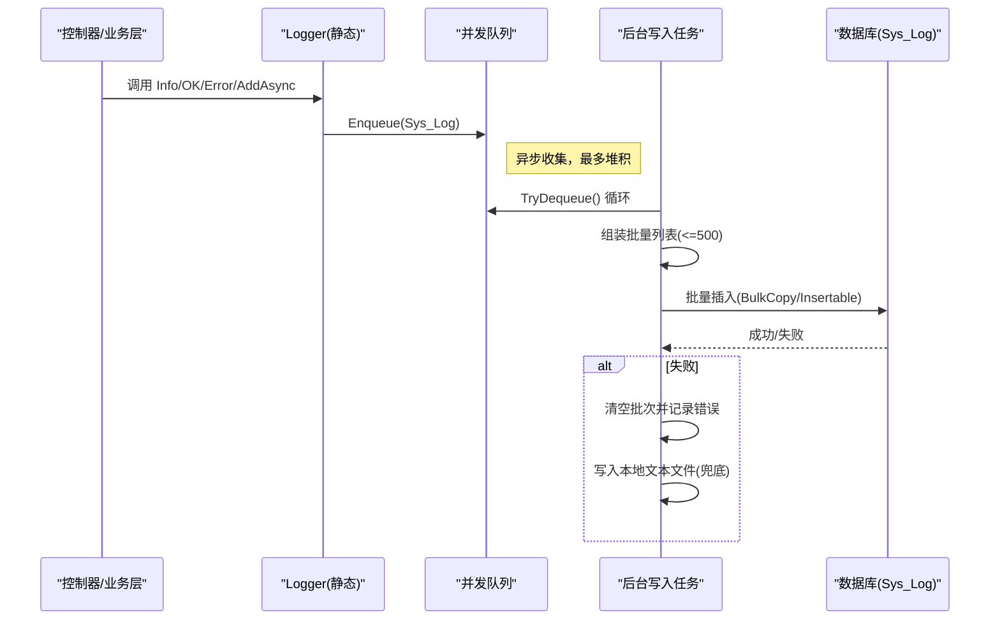
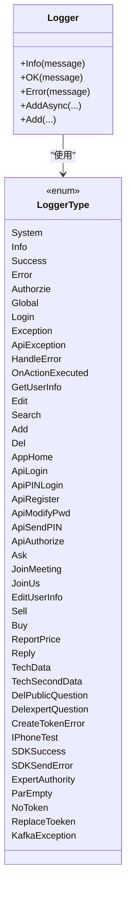
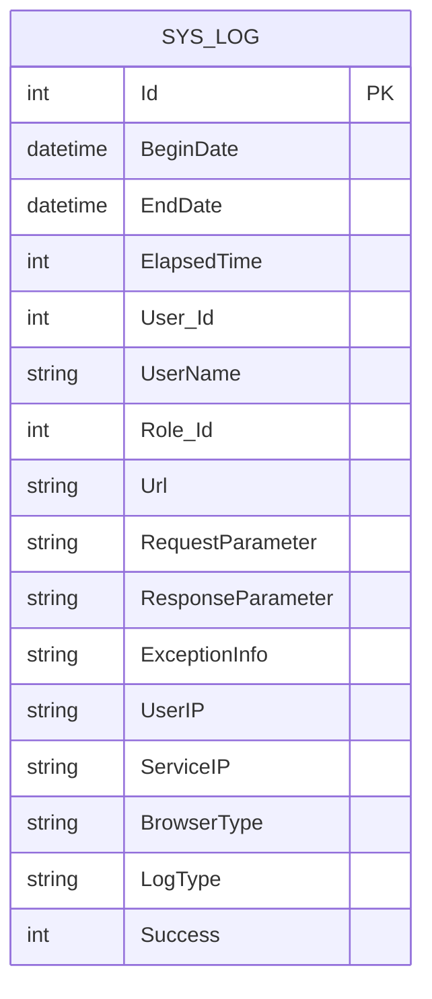
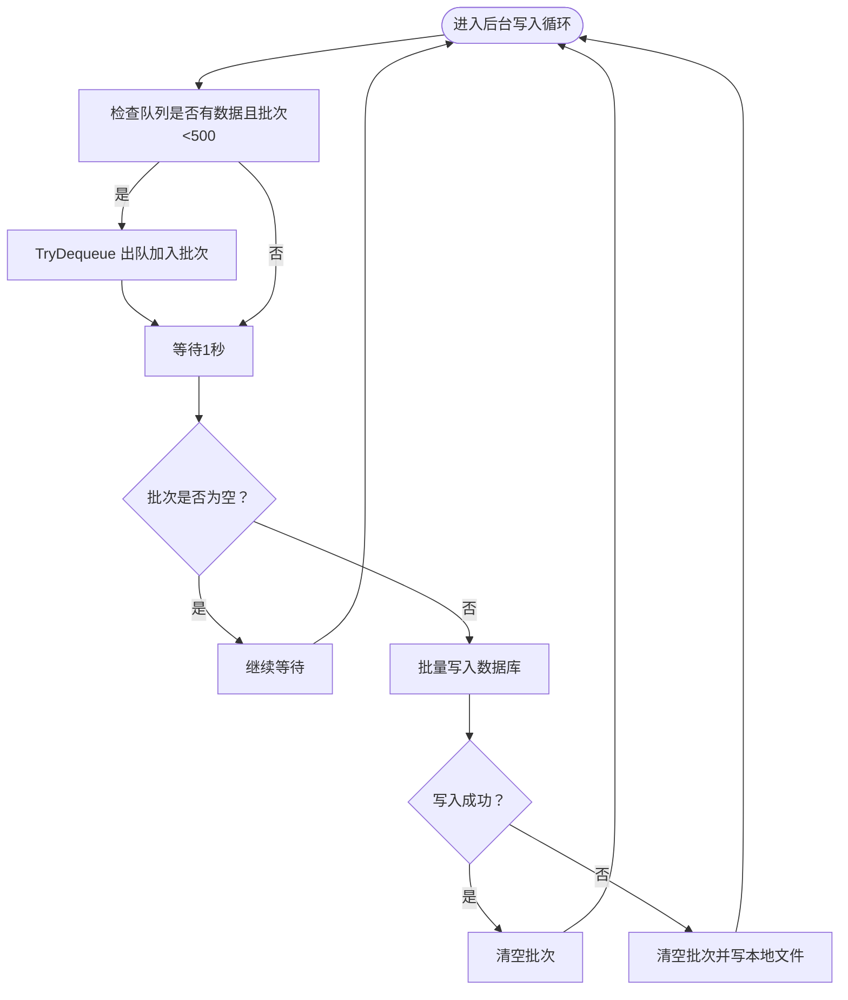
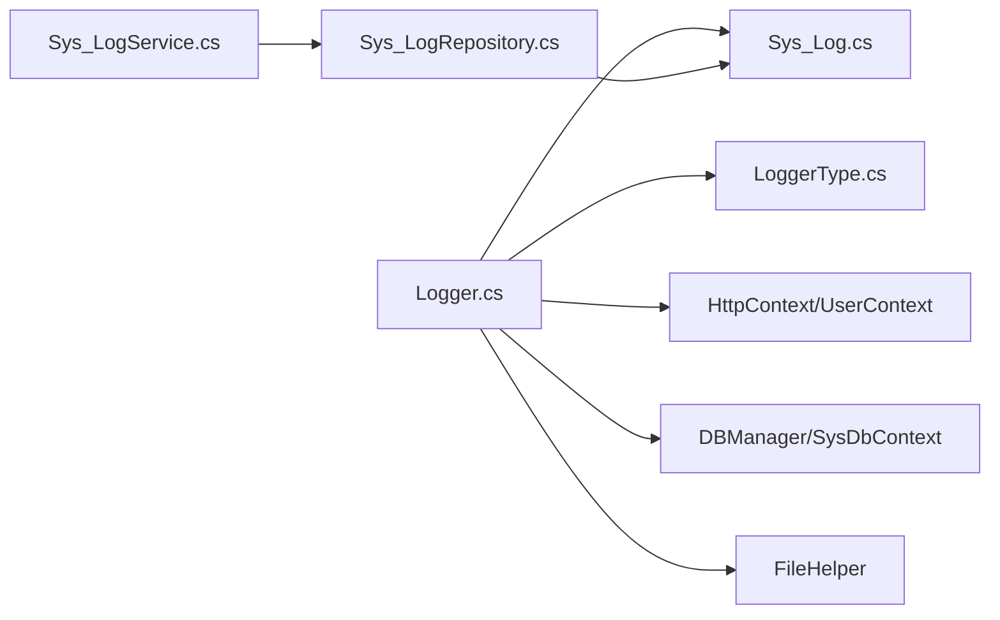

# 日志管理

<cite>
**本文引用的文件**
- [Logger.cs](file://VolPro.Core/Services/Logger.cs)
- [LoggerType.cs](file://VolPro.Core/Enums/LoggerType.cs)
- [Sys_Log.cs](file://VolPro.Entity/DomainModels/System/Sys_Log.cs)
- [ActionLog.cs](file://VolPro.Core/Middleware/ActionLog.cs)
- [EFLoggerProvider.cs](file://VolPro.Core/EFDbContext/EFLoggerProvider.cs)
- [ISys_LogService.cs](file://VolPro.Sys/IServices/System/ISys_LogService.cs)
- [Sys_LogService.cs](file://VolPro.Sys/Services/System/Sys_LogService.cs)
- [Sys_LogRepository.cs](file://VolPro.Sys/Repositories/System/Sys_LogRepository.cs)
- [ServiceBase.cs](file://VolPro.Core/BaseProvider/ServiceBase.cs)
</cite>

## 目录
1. [简介](#简介)
2. [项目结构](#项目结构)
3. [核心组件](#核心组件)
4. [架构总览](#架构总览)
5. [详细组件分析](#详细组件分析)
6. [依赖关系分析](#依赖关系分析)
7. [性能考量](#性能考量)
8. [故障排查指南](#故障排查指南)
9. [结论](#结论)
10. [附录](#附录)

## 简介
本文件面向“水化热平台”的日志管理，系统性阐述结构化日志记录机制与实现，涵盖日志级别与类型、统一格式与字段、异步写入与批量持久化、日志聚合与检索、日志告警与阈值、存储轮转与清理、以及日志分析与可视化建议。内容基于仓库中现有日志相关组件进行归纳与扩展说明，帮助开发与运维人员快速理解并使用平台的日志能力。

## 项目结构
围绕日志管理的关键代码分布在以下模块：
- 核心日志服务与类型：VolPro.Core.Services.Logger、VolPro.Core.Enums.LoggerType
- 日志实体模型：VolPro.Entity.DomainModels.System.Sys_Log
- 中间件标注：VolPro.Core.Middleware.ActionLog
- EF Core 日志桥接：VolPro.Core.EFDbContext.EFLoggerProvider
- 日志服务与仓储：VolPro.Sys.IServices/System/ISys_LogService、VolPro.Sys.Services/System/Sys_LogService、VolPro.Sys.Repositories/System/Sys_LogRepository
- 业务层日志使用示例：VolPro.Core.BaseProvider.ServiceBase

图表来源
- [Logger.cs:1-308](file://VolPro.Core/Services/Logger.cs#L1-L308)
- [LoggerType.cs:1-55](file://VolPro.Core/Enums/LoggerType.cs#L1-L55)
- [Sys_Log.cs:1-141](file://VolPro.Entity/DomainModels/System/Sys_Log.cs#L1-L141)
- [ActionLog.cs:1-32](file://VolPro.Core/Middleware/ActionLog.cs#L1-L32)
- [EFLoggerProvider.cs:1-35](file://VolPro.Core/EFDbContext/EFLoggerProvider.cs#L1-L35)
- [ISys_LogService.cs:1-11](file://VolPro.Sys/IServices/System/ISys_LogService.cs#L1-L11)
- [Sys_LogService.cs:1-23](file://VolPro.Sys/Services/System/Sys_LogService.cs#L1-L23)
- [Sys_LogRepository.cs:1-23](file://VolPro.Sys/Repositories/System/Sys_LogRepository.cs#L1-L23)
- [ServiceBase.cs:1-3000](file://VolPro.Core/BaseProvider/ServiceBase.cs#L1-L3000)

章节来源
- [Logger.cs:1-308](file://VolPro.Core/Services/Logger.cs#L1-L308)
- [LoggerType.cs:1-55](file://VolPro.Core/Enums/LoggerType.cs#L1-L55)
- [Sys_Log.cs:1-141](file://VolPro.Entity/DomainModels/System/Sys_Log.cs#L1-L141)
- [ActionLog.cs:1-32](file://VolPro.Core/Middleware/ActionLog.cs#L1-L32)
- [EFLoggerProvider.cs:1-35](file://VolPro.Core/EFDbContext/EFLoggerProvider.cs#L1-L35)
- [ISys_LogService.cs:1-11](file://VolPro.Sys/IServices/System/ISys_LogService.cs#L1-L11)
- [Sys_LogService.cs:1-23](file://VolPro.Sys/Services/System/Sys_LogService.cs#L1-L23)
- [Sys_LogRepository.cs:1-23](file://VolPro.Sys/Repositories/System/Sys_LogRepository.cs#L1-L23)
- [ServiceBase.cs:1-3000](file://VolPro.Core/BaseProvider/ServiceBase.cs#L1-L3000)

## 核心组件
- 结构化日志记录器：提供 Info、OK、Error 三类入口，支持异步与同步两种写入模式；内部维护并发队列，按固定周期批量写入数据库，并在异常时落盘本地文件辅助诊断。
- 日志类型体系：通过 LoggerType 枚举定义系统、登录、异常、API 行为等多维度日志类别，便于分类检索与统计。
- 日志实体模型：Sys_Log 定义了完整的日志字段集，包括时间戳、用户与角色、请求/响应参数、异常信息、网络与浏览器信息等。
- EF Core 日志桥接：EFLoggerProvider 将 EF 命令级日志输出到控制台，便于调试 SQL 执行情况。
- 日志服务与仓储：Sys_LogService 与 Sys_LogRepository 提供标准的增删改查与分页查询能力，支撑日志聚合与检索。
- 动作日志特性：ActionLog 可用于标记控制器动作是否需要写入日志及日志类型，便于统一管控。
- 业务层使用：ServiceBase 在导入、上传、保存等关键流程中调用 Logger 记录操作结果与异常，形成全链路日志闭环。

章节来源
- [Logger.cs:24-308](file://VolPro.Core/Services/Logger.cs#L24-L308)
- [LoggerType.cs:7-53](file://VolPro.Core/Enums/LoggerType.cs#L7-L53)
- [Sys_Log.cs:17-141](file://VolPro.Entity/DomainModels/System/Sys_Log.cs#L17-L141)
- [EFLoggerProvider.cs:9-35](file://VolPro.Core/EFDbContext/EFLoggerProvider.cs#L9-L35)
- [ISys_LogService.cs:6-8](file://VolPro.Sys/IServices/System/ISys_LogService.cs#L6-L8)
- [Sys_LogService.cs:9-21](file://VolPro.Sys/Services/System/Sys_LogService.cs#L9-L21)
- [Sys_LogRepository.cs:9-21](file://VolPro.Sys/Repositories/System/Sys_LogRepository.cs#L9-L21)
- [ActionLog.cs:9-31](file://VolPro.Core/Middleware/ActionLog.cs#L9-L31)
- [ServiceBase.cs:499-558](file://VolPro.Core/BaseProvider/ServiceBase.cs#L499-L558)

## 架构总览
下图展示了从应用层到日志持久化的整体流程，包括异步队列、批量写入、数据库落库与本地兜底写入。

图表来源
- [Logger.cs:93-207](file://VolPro.Core/Services/Logger.cs#L93-L207)

章节来源
- [Logger.cs:93-207](file://VolPro.Core/Services/Logger.cs#L93-L207)

## 详细组件分析

### 日志级别与类型
- 级别划分
  - Info：普通信息日志，通常用于记录请求处理开始、参数、耗时等。
  - OK：成功结果日志，用于记录请求处理成功、返回结果等。
  - Error：错误日志，用于记录异常、失败原因、堆栈等。
- 类型体系
  - 通过 LoggerType 枚举定义多种日志类型，覆盖系统、登录、授权、API 异常、业务操作等场景，便于后续检索与统计。

图表来源
- [Logger.cs:52-88](file://VolPro.Core/Services/Logger.cs#L52-L88)
- [LoggerType.cs:7-53](file://VolPro.Core/Enums/LoggerType.cs#L7-L53)

章节来源
- [Logger.cs:52-88](file://VolPro.Core/Services/Logger.cs#L52-L88)
- [LoggerType.cs:7-53](file://VolPro.Core/Enums/LoggerType.cs#L7-L53)

### 日志格式与字段定义
- 字段清单（来源于 Sys_Log 实体）
  - 主键与时间：Id、BeginDate、EndDate、ElapsedTime
  - 用户与角色：User_Id、UserName、Role_Id
  - 请求与响应：Url、RequestParameter、ResponseParameter
  - 异常与状态：ExceptionInfo、Success
  - 网络与环境：UserIP、ServiceIP、BrowserType
- 字段约束与类型
  - 文本字段采用 nvarchar(max) 或限定长度的 nvarchar(n)
  - 数值与时间字段采用 int/datetime
  - 部分字段允许为空，便于兼容不同场景

图表来源
- [Sys_Log.cs:17-141](file://VolPro.Entity/DomainModels/System/Sys_Log.cs#L17-L141)

章节来源
- [Sys_Log.cs:17-141](file://VolPro.Entity/DomainModels/System/Sys_Log.cs#L17-L141)

### 异步日志写入与批量策略
- 队列机制
  - 使用 ConcurrentQueue<Sys_Log> 收集日志条目，避免阻塞主线程。
- 批量写入
  - 后台任务每秒尝试从队列取出若干条（上限 500），组装成批量集合后一次性写入数据库。
  - 针对不同数据库类型采用不同的高效写入方式（例如 BulkCopy 或 Insertable）。
- 兜底写入
  - 写入异常时清空批次并记录错误，同时将错误信息写入本地文本文件，确保问题可追踪。

图表来源
- [Logger.cs:172-207](file://VolPro.Core/Services/Logger.cs#L172-L207)
- [Logger.cs:209-219](file://VolPro.Core/Services/Logger.cs#L209-L219)

章节来源
- [Logger.cs:172-207](file://VolPro.Core/Services/Logger.cs#L172-L207)
- [Logger.cs:209-219](file://VolPro.Core/Services/Logger.cs#L209-L219)

### 日志聚合与检索
- 服务与仓储
  - Sys_LogService 与 Sys_LogRepository 提供标准的 CRUD 与分页查询能力，可用于日志聚合与检索。
- 查询接口建议
  - 按时间范围、日志类型、用户、URL、状态、异常关键字等条件组合查询。
  - 支持分页与排序，优先按 BeginDate 降序。
- 导出功能
  - 可基于查询结果导出 Excel/PDF 等格式，便于离线分析与归档。

章节来源
- [ISys_LogService.cs:6-8](file://VolPro.Sys/IServices/System/ISys_LogService.cs#L6-L8)
- [Sys_LogService.cs:9-21](file://VolPro.Sys/Services/System/Sys_LogService.cs#L9-L21)
- [Sys_LogRepository.cs:9-21](file://VolPro.Sys/Repositories/System/Sys_LogRepository.cs#L9-L21)

### 日志告警机制
- 错误日志自动告警
  - 建议在日志入库后，针对 Success=Error 的日志触发告警流程（如邮件、IM 通知）。
- 阈值设置
  - 可按日志类型、URL、用户等维度设置错误率阈值与窗口期，超过阈值触发告警。
- 通知方式
  - 集成邮件、企业微信、钉钉或短信通道，支持多通道并行或备用。
- 建议扩展点
  - 在 Logger.AddAsync 或后台写入阶段增加告警触发逻辑，或在 Sys_LogService 层增加订阅/回调机制。

章节来源
- [Logger.cs:93-113](file://VolPro.Core/Services/Logger.cs#L93-L113)
- [Logger.cs:126-170](file://VolPro.Core/Services/Logger.cs#L126-L170)

### 存储策略（轮转、归档与清理）
- 归档与清理
  - 建议按月/季度归档历史日志至独立表或对象存储，保留近期日志以便高频查询。
  - 设置清理策略（如保留最近 90 天），定期删除过期日志。
- 性能优化
  - 对日志表建立索引：BeginDate、LogType、User_Id、Url、Success 等常用查询字段。
  - 分表分库：高并发场景下可按日期或租户拆分表，降低单表压力。
- 本地兜底
  - Logger 在写入异常时会将错误信息写入本地文本文件，作为兜底手段辅助定位问题。

章节来源
- [Logger.cs:209-219](file://VolPro.Core/Services/Logger.cs#L209-L219)

### 日志分析与可视化
- 分析工具集成
  - 可将 Sys_Log 数据接入 ELK/ClickHouse/Lakehouse 等分析平台，构建指标看板。
- 可视化建议
  - 日志总量趋势、错误率趋势、Top URL、Top 用户、异常分布、响应时长分布等。
- 交互式查询
  - 提供前端查询面板，支持时间选择、类型筛选、关键字搜索、导出等功能。

章节来源
- [Sys_Log.cs:17-141](file://VolPro.Entity/DomainModels/System/Sys_Log.cs#L17-L141)

## 依赖关系分析
- Logger 依赖
  - LoggerType：决定日志类别
  - Sys_Log：承载日志字段
  - HttpContext/UserContext：提取用户与请求上下文
  - DBManager/SysDbContext：执行批量写入
  - FileHelper：异常时写本地文件
- 服务与仓储
  - Sys_LogService 继承自通用 ServiceBase，复用分页、查询等能力
  - Sys_LogRepository 绑定 SysDbContext，提供仓储基础能力

图表来源
- [Logger.cs:12-20](file://VolPro.Core/Services/Logger.cs#L12-L20)
- [LoggerType.cs:1-55](file://VolPro.Core/Enums/LoggerType.cs#L1-L55)
- [Sys_Log.cs:1-141](file://VolPro.Entity/DomainModels/System/Sys_Log.cs#L1-L141)
- [Sys_LogService.cs:1-23](file://VolPro.Sys/Services/System/Sys_LogService.cs#L1-L23)
- [Sys_LogRepository.cs:1-23](file://VolPro.Sys/Repositories/System/Sys_LogRepository.cs#L1-L23)

章节来源
- [Logger.cs:12-20](file://VolPro.Core/Services/Logger.cs#L12-L20)
- [Sys_LogService.cs:1-23](file://VolPro.Sys/Services/System/Sys_LogService.cs#L1-L23)
- [Sys_LogRepository.cs:1-23](file://VolPro.Sys/Repositories/System/Sys_LogRepository.cs#L1-L23)

## 性能考量
- 异步与批量
  - 使用并发队列与批量写入显著降低 IO 压力，建议根据数据库吞吐调整批次大小与写入间隔。
- 字段裁剪
  - 对超长字段（如 BrowserType、RequestParameter）进行截断或压缩，减少存储与传输开销。
- 索引与分区
  - 针对高频查询字段建立索引；必要时按时间分区，提升查询效率。
- 异常兜底
  - 写入失败时写本地文件，避免丢失关键错误信息，但需定期巡检与清理本地文件。

章节来源
- [Logger.cs:172-207](file://VolPro.Core/Services/Logger.cs#L172-L207)
- [Logger.cs:209-219](file://VolPro.Core/Services/Logger.cs#L209-L219)
- [Sys_Log.cs:113-116](file://VolPro.Entity/DomainModels/System/Sys_Log.cs#L113-L116)

## 故障排查指南
- 控制台 EF 命令日志
  - EFLoggerProvider 会在特定类别与级别下输出 EF 命令日志，便于定位慢查询与异常 SQL。
- 本地文件兜底
  - 当数据库写入异常时，错误信息会被写入本地文本文件，路径包含日期标识，便于定位问题。
- 业务层日志使用
  - 在导入、上传、保存等关键流程中调用 Logger 记录结果与异常，有助于回溯问题。

章节来源
- [EFLoggerProvider.cs:22-30](file://VolPro.Core/EFDbContext/EFLoggerProvider.cs#L22-L30)
- [Logger.cs:209-219](file://VolPro.Core/Services/Logger.cs#L209-L219)
- [ServiceBase.cs:499-558](file://VolPro.Core/BaseProvider/ServiceBase.cs#L499-L558)

## 结论
平台已具备完善的结构化日志能力：统一的类型体系、标准化的字段设计、异步队列与批量写入、数据库与本地兜底双通道，以及可扩展的告警与分析能力。建议在此基础上完善日志告警阈值配置、归档与清理策略、以及可视化看板，以满足生产环境的可观测性需求。

## 附录
- 日志类型参考：见 LoggerType 枚举定义
- 日志实体字段参考：见 Sys_Log 实体定义
- 日志服务与仓储接口：见 ISys_LogService、Sys_LogService、Sys_LogRepository

章节来源
- [LoggerType.cs:7-53](file://VolPro.Core/Enums/LoggerType.cs#L7-L53)
- [Sys_Log.cs:17-141](file://VolPro.Entity/DomainModels/System/Sys_Log.cs#L17-L141)
- [ISys_LogService.cs:6-8](file://VolPro.Sys/IServices/System/ISys_LogService.cs#L6-L8)
- [Sys_LogService.cs:9-21](file://VolPro.Sys/Services/System/Sys_LogService.cs#L9-L21)
- [Sys_LogRepository.cs:9-21](file://VolPro.Sys/Repositories/System/Sys_LogRepository.cs#L9-L21)