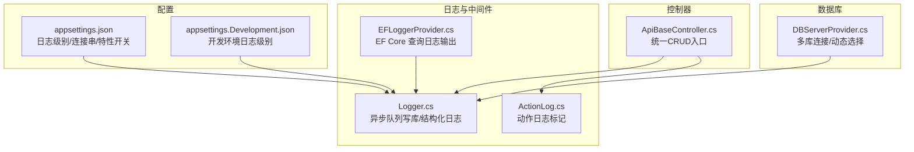
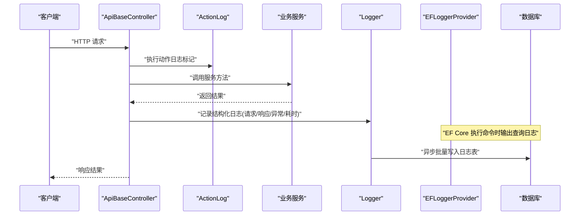
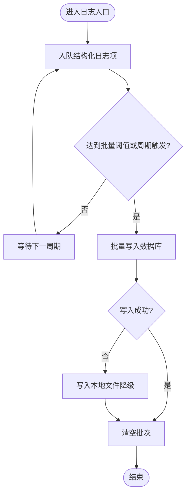
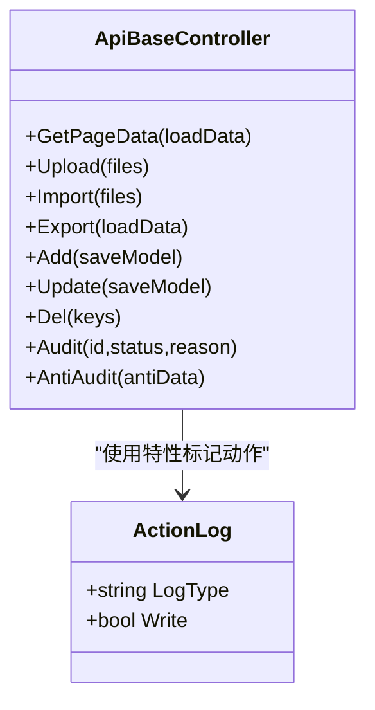
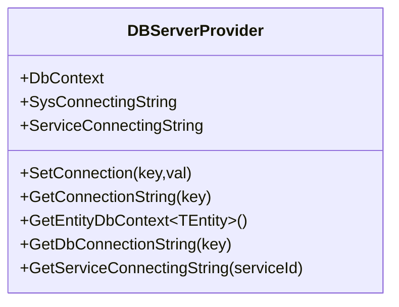
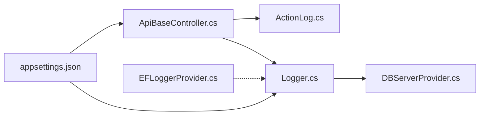

# 系统监控

<cite>
**本文引用的文件**
- [appsettings.json](file://VolPro.WebApi/appsettings.json)
- [appsettings.Development.json](file://VolPro.WebApi/appsettings.Development.json)
- [EFLoggerProvider.cs](file://VolPro.Core/EFDbContext/EFLoggerProvider.cs)
- [Logger.cs](file://VolPro.Core/Services/Logger.cs)
- [ActionLog.cs](file://VolPro.Core/Middleware/ActionLog.cs)
- [ApiBaseController.cs](file://VolPro.Core/Controllers/Basic/ApiBaseController.cs)
- [DBServerProvider.cs](file://VolPro.Core/DbManager/DBServerProvider.cs)
</cite>

## 目录
1. [简介](#简介)
2. [项目结构](#项目结构)
3. [核心组件](#核心组件)
4. [架构总览](#架构总览)
5. [详细组件分析](#详细组件分析)
6. [依赖关系分析](#依赖关系分析)
7. [性能考虑](#性能考虑)
8. [故障排查指南](#故障排查指南)
9. [结论](#结论)
10. [附录](#附录)

## 简介
本文件面向“水化热平台”的系统监控，聚焦于应用性能监控、数据库性能监控、系统资源监控、日志管理、健康检查与监控仪表板、以及与 Prometheus、Grafana、ELK Stack 的集成建议。基于仓库现有实现，重点梳理了日志系统（异步队列、结构化写库）、EF Core 查询日志采集、数据库连接与多库管理等能力，并给出可落地的监控与可视化方案。

## 项目结构
围绕监控主题，与之直接相关的模块与文件如下：
- 配置层：应用配置与日志级别控制
- 日志与中间件：统一日志入口、动作日志标记、EF Core 查询日志输出
- 控制器基类：统一的增删改查入口，便于埋点与统计
- 数据库管理：多库连接字符串管理与动态选择

图表来源
- [appsettings.json:1-140](file://VolPro.WebApi/appsettings.json#L1-L140)
- [appsettings.Development.json:1-10](file://VolPro.WebApi/appsettings.Development.json#L1-L10)
- [Logger.cs:1-308](file://VolPro.Core/Services/Logger.cs#L1-L308)
- [ActionLog.cs:1-32](file://VolPro.Core/Middleware/ActionLog.cs#L1-L32)
- [EFLoggerProvider.cs:1-35](file://VolPro.Core/EFDbContext/EFLoggerProvider.cs#L1-L35)
- [ApiBaseController.cs:1-230](file://VolPro.Core/Controllers/Basic/ApiBaseController.cs#L1-L230)
- [DBServerProvider.cs:1-139](file://VolPro.Core/DbManager/DBServerProvider.cs#L1-L139)

章节来源
- [appsettings.json:1-140](file://VolPro.WebApi/appsettings.json#L1-L140)
- [appsettings.Development.json:1-10](file://VolPro.WebApi/appsettings.Development.json#L1-L10)
- [Logger.cs:1-308](file://VolPro.Core/Services/Logger.cs#L1-L308)
- [ActionLog.cs:1-32](file://VolPro.Core/Middleware/ActionLog.cs#L1-L32)
- [EFLoggerProvider.cs:1-35](file://VolPro.Core/EFDbContext/EFLoggerProvider.cs#L1-L35)
- [ApiBaseController.cs:1-230](file://VolPro.Core/Controllers/Basic/ApiBaseController.cs#L1-L230)
- [DBServerProvider.cs:1-139](file://VolPro.Core/DbManager/DBServerProvider.cs#L1-L139)

## 核心组件
- 应用日志与结构化日志
  - 统一日志入口采用异步队列批量写库，支持结构化字段（请求参数、响应参数、异常、耗时、用户IP、服务IP、浏览器类型、URL、用户与角色等），并具备降级写文件能力。
  - EF Core 查询日志通过专用 Provider 输出，便于定位慢查询与异常 SQL。
  - 控制器基类统一入口，结合动作日志标记，便于按接口维度统计与审计。
- 数据库连接与多库管理
  - 提供系统库与业务库连接字符串管理，支持动态租户/分库场景下的连接选择。
- 配置与环境
  - 通过 appsettings.json 控制日志级别、连接串、Redis、SignalR、Kafka、定时任务等全局特性；开发环境单独覆盖日志级别。

章节来源
- [Logger.cs:27-308](file://VolPro.Core/Services/Logger.cs#L27-L308)
- [EFLoggerProvider.cs:9-35](file://VolPro.Core/EFDbContext/EFLoggerProvider.cs#L9-L35)
- [ApiBaseController.cs:19-228](file://VolPro.Core/Controllers/Basic/ApiBaseController.cs#L19-L228)
- [DBServerProvider.cs:28-139](file://VolPro.Core/DbManager/DBServerProvider.cs#L28-L139)
- [appsettings.json:2-139](file://VolPro.WebApi/appsettings.json#L2-L139)
- [appsettings.Development.json:2-9](file://VolPro.WebApi/appsettings.Development.json#L2-L9)

## 架构总览
下图展示从请求进入、动作日志标记、日志采集、EF Core 查询日志输出，到异步批量写库的整体流程。

图表来源
- [ApiBaseController.cs:35-205](file://VolPro.Core/Controllers/Basic/ApiBaseController.cs#L35-L205)
- [ActionLog.cs:9-31](file://VolPro.Core/Middleware/ActionLog.cs#L9-L31)
- [Logger.cs:52-170](file://VolPro.Core/Services/Logger.cs#L52-L170)
- [EFLoggerProvider.cs:22-31](file://VolPro.Core/EFDbContext/EFLoggerProvider.cs#L22-L31)

## 详细组件分析

### 日志系统（异步队列与结构化）
- 异步队列与批量写入
  - 使用并发队列收集日志项，每秒或达到阈值后批量写入数据库，减少频繁 IO。
  - 针对不同数据库类型采用最优写入方式，保证吞吐。
- 结构化字段
  - 包含请求参数、响应参数、异常信息、开始/结束时间、耗时、用户与角色、IP、浏览器类型、URL 等，便于后续分析与报表。
- 降级策略
  - 写库失败时自动落盘至本地文件，避免丢失。
- EF Core 查询日志
  - 仅输出 EF Core 命令日志（类别名与级别匹配），便于识别慢查询与异常 SQL。

图表来源
- [Logger.cs:172-207](file://VolPro.Core/Services/Logger.cs#L172-L207)
- [Logger.cs:209-219](file://VolPro.Core/Services/Logger.cs#L209-L219)
- [EFLoggerProvider.cs:22-31](file://VolPro.Core/EFDbContext/EFLoggerProvider.cs#L22-L31)

章节来源
- [Logger.cs:27-308](file://VolPro.Core/Services/Logger.cs#L27-L308)
- [EFLoggerProvider.cs:9-35](file://VolPro.Core/EFDbContext/EFLoggerProvider.cs#L9-L35)

### 控制器基类与动作日志
- 统一入口
  - 提供分页查询、上传/下载、导入/导出、新增/编辑/删除、审核/反审核等通用接口，便于集中埋点与统计。
- 动作日志标记
  - 通过特性标记动作类型，结合日志系统记录操作行为与结果状态。
- 与日志系统的配合
  - 在关键操作后调用日志记录，形成结构化审计数据。

图表来源
- [ApiBaseController.cs:35-205](file://VolPro.Core/Controllers/Basic/ApiBaseController.cs#L35-L205)
- [ActionLog.cs:9-31](file://VolPro.Core/Middleware/ActionLog.cs#L9-L31)

章节来源
- [ApiBaseController.cs:19-228](file://VolPro.Core/Controllers/Basic/ApiBaseController.cs#L19-L228)
- [ActionLog.cs:1-32](file://VolPro.Core/Middleware/ActionLog.cs#L1-L32)

### 数据库连接与多库管理
- 连接字符串管理
  - 支持系统库与业务库连接串，可通过配置文件切换。
- 动态选择
  - 支持动态租户/分库场景，按用户上下文选择目标数据库连接。
- 与日志的协同
  - 日志写库与数据库连接管理解耦，便于在多库环境下统一记录审计。

图表来源
- [DBServerProvider.cs:28-139](file://VolPro.Core/DbManager/DBServerProvider.cs#L28-L139)

章节来源
- [DBServerProvider.cs:28-139](file://VolPro.Core/DbManager/DBServerProvider.cs#L28-L139)

## 依赖关系分析
- 日志系统依赖
  - 控制器基类与动作日志特性共同驱动日志产生。
  - EF Core 查询日志输出作为补充，聚焦 SQL 层面。
  - 数据库连接管理为日志写库提供连接基础。
- 配置依赖
  - appsettings.json 控制日志级别、连接串、特性开关等，开发环境覆盖默认日志级别。

图表来源
- [ApiBaseController.cs:19-228](file://VolPro.Core/Controllers/Basic/ApiBaseController.cs#L19-L228)
- [ActionLog.cs:9-31](file://VolPro.Core/Middleware/ActionLog.cs#L9-L31)
- [Logger.cs:27-308](file://VolPro.Core/Services/Logger.cs#L27-L308)
- [DBServerProvider.cs:28-139](file://VolPro.Core/DbManager/DBServerProvider.cs#L28-L139)
- [EFLoggerProvider.cs:9-35](file://VolPro.Core/EFDbContext/EFLoggerProvider.cs#L9-L35)
- [appsettings.json:2-139](file://VolPro.WebApi/appsettings.json#L2-L139)

章节来源
- [appsettings.json:2-139](file://VolPro.WebApi/appsettings.json#L2-L139)
- [Logger.cs:27-308](file://VolPro.Core/Services/Logger.cs#L27-L308)
- [ApiBaseController.cs:19-228](file://VolPro.Core/Controllers/Basic/ApiBaseController.cs#L19-L228)
- [DBServerProvider.cs:28-139](file://VolPro.Core/DbManager/DBServerProvider.cs#L28-L139)
- [EFLoggerProvider.cs:9-35](file://VolPro.Core/EFDbContext/EFLoggerProvider.cs#L9-L35)

## 性能考虑
- 日志写入
  - 异步队列与批量写入降低 IO 压力；针对不同数据库类型采用最优写入方式，提升吞吐。
  - 建议根据业务峰值调整批量阈值与刷新周期，避免队列积压。
- EF Core 查询日志
  - 仅输出命令日志，避免高频写入造成性能抖动；建议在问题定位阶段临时提高日志级别。
- 数据库连接
  - 多库场景下合理复用连接，避免频繁切换；结合连接池参数优化长事务与高并发场景。
- 资源监控
  - 建议结合系统指标（CPU、内存、磁盘、网络）与应用指标（请求耗时、错误率、队列长度）综合评估。

[本节为通用指导，不直接分析具体文件]

## 故障排查指南
- 日志写库失败
  - 观察本地降级文件是否存在错误记录；检查数据库连接串与目标库可用性。
- EF Core 查询异常
  - 关注 EF Core 命令日志输出，定位慢查询与异常 SQL；结合业务接口日志确认上下文。
- 控制器动作未记录
  - 确认动作已添加日志标记特性；检查日志入口是否被拦截或条件过滤。
- 配置问题
  - 开发环境日志级别过低可能隐藏问题；必要时临时提升日志级别以便诊断。

章节来源
- [Logger.cs:209-219](file://VolPro.Core/Services/Logger.cs#L209-L219)
- [EFLoggerProvider.cs:22-31](file://VolPro.Core/EFDbContext/EFLoggerProvider.cs#L22-L31)
- [appsettings.Development.json:2-9](file://VolPro.WebApi/appsettings.Development.json#L2-L9)

## 结论
当前实现提供了完善的日志基础设施（异步队列、结构化字段、降级写盘）与 EF Core 查询日志输出，配合控制器基类与动作日志标记，能够满足应用性能监控与审计需求。数据库连接管理支持多库与动态选择，为跨库场景下的监控与分析提供基础。建议在此基础上引入系统资源指标采集与外部监控栈（Prometheus/Grafana/ELK），以实现更全面的可观测性与可视化。

[本节为总结性内容，不直接分析具体文件]

## 附录

### 关键指标建议
- 应用层
  - 请求 QPS、P95/P99 响应时间、错误率、队列长度、日志写入速率
- 数据库层
  - 连接数、等待事件、慢查询数量、事务回滚率、缓冲池命中率（视数据库而定）
- 系统层
  - CPU 使用率、内存占用、磁盘 IO、网络带宽与连接数

[本节为通用指导，不直接分析具体文件]

### 健康检查端点与仪表板配置（建议）
- 健康检查端点
  - 建议新增健康检查端点，返回应用、数据库、缓存、消息队列等依赖项状态。
- 监控仪表板
  - Grafana 面板建议包含：请求趋势、错误分布、慢查询 TopN、日志写入速率、资源使用趋势。

[本节为通用指导，不直接分析具体文件]

### 监控工具集成指南（建议）
- Prometheus
  - 通过应用指标导出器暴露指标；Prometheus 抓取周期与告警规则按业务阈值设定。
- Grafana
  - 基于 Prometheus 数据源构建仪表板；结合 Loki/ELK 实现日志关联分析。
- ELK Stack
  - 将结构化日志输出到集中式日志系统，结合 Kibana 进行检索与可视化。

[本节为通用指导，不直接分析具体文件]