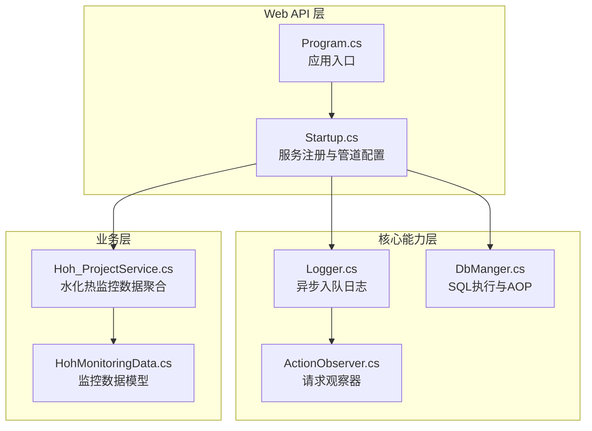
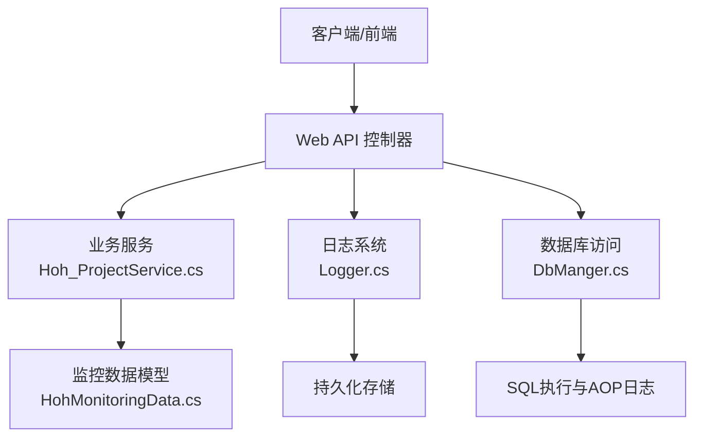
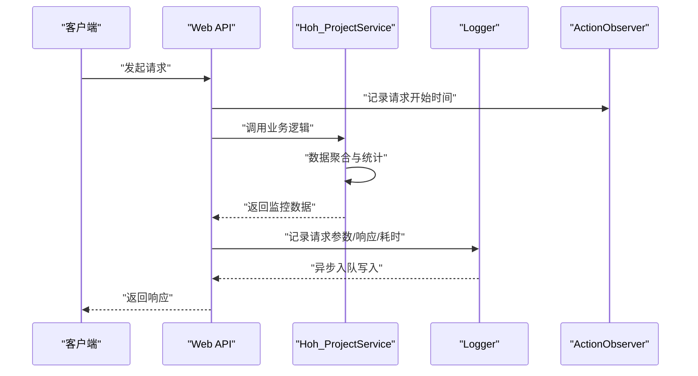
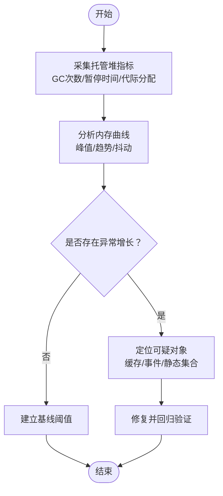
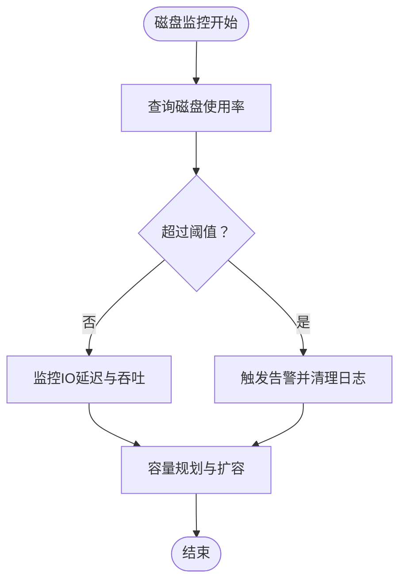
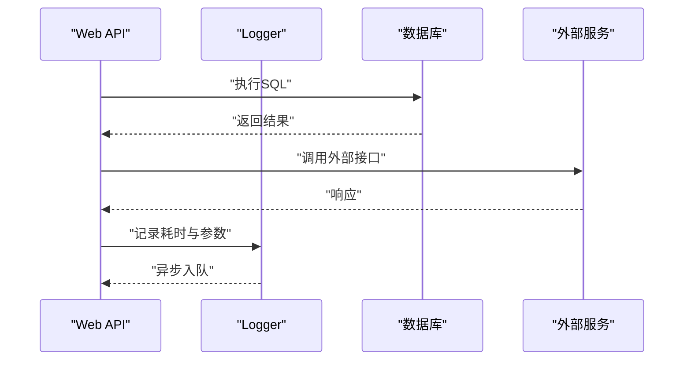
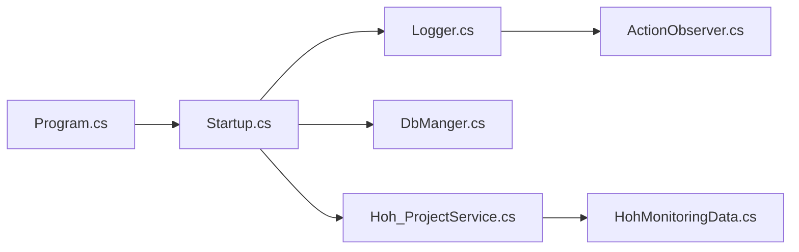

# 系统资源监控

<cite>
**本文引用的文件**
- [Hoh_ProjectService.cs](file://Hncdi.HeatOfHydration/Services/Hoh/Partial/Hoh_ProjectService.cs)
- [HohMonitoringData.cs](file://VolPro.Entity/DomainModels/Hoh/partial/HohMonitoringData.cs)
- [Logger.cs](file://VolPro.Core/Services/Logger.cs)
- [ActionExecutingLogger.cs](file://VolPro.Core/Services/ActionObserver.cs)
- [DbManger.cs](file://VolPro.Core/DbSqlSugar/DbManger.cs)
- [Program.cs](file://VolPro.WebApi/Program.cs)
- [Startup.cs](file://VolPro.WebApi/Startup.cs)
</cite>

## 目录
1. [简介](#简介)
2. [项目结构](#项目结构)
3. [核心组件](#核心组件)
4. [架构总览](#架构总览)
5. [详细组件分析](#详细组件分析)
6. [依赖关系分析](#依赖关系分析)
7. [性能考量](#性能考量)
8. [故障排查指南](#故障排查指南)
9. [结论](#结论)
10. [附录](#附录)

## 简介
本文件面向“水化热平台”的系统资源监控需求，围绕CPU使用率、内存使用、磁盘空间、网络监控以及资源监控工具集成进行系统化梳理与落地建议。结合现有代码库，重点分析以下方面：
- CPU使用率监控：进程CPU占用、线程池状态、CPU负载分析
- 内存使用监控：堆内存使用、GC统计、内存泄漏检测
- 磁盘空间监控：磁盘使用率、IO性能、存储容量规划
- 网络监控方案：带宽使用、连接数统计、网络延迟分析
- 资源监控工具集成：Windows Performance Counter、WMI、第三方监控工具
- 资源使用优化建议与告警阈值设置

## 项目结构
本项目采用多层架构与模块化组织，Web API 层负责请求接入与路由，Core 层提供通用能力（日志、缓存、数据库、中间件等），Entity 定义领域模型，具体业务模块按功能域划分（如 Hncdi.HeatOfHydration、VolPro.Sys 等）。与资源监控密切相关的模块包括：
- Web API 启动与配置：Program.cs、Startup.cs
- 日志与性能观测：Logger.cs、ActionObserver.cs
- 数据访问与SQL执行：DbManger.cs
- 业务数据聚合与展示：Hoh_ProjectService.cs、HohMonitoringData.cs

**图表来源**
- [Program.cs:1-39](file://VolPro.WebApi/Program.cs#L1-L39)
- [Startup.cs:1-407](file://VolPro.WebApi/Startup.cs#L1-L407)
- [Logger.cs:1-308](file://VolPro.Core/Services/Logger.cs#L1-L308)
- [ActionExecutingLogger.cs:1-28](file://VolPro.Core/Services/ActionObserver.cs#L1-L28)
- [DbManger.cs:1-159](file://VolPro.Core/DbSqlSugar/DbManger.cs#L1-L159)
- [Hoh_ProjectService.cs:1-471](file://Hncdi.HeatOfHydration/Services/Hoh/Partial/Hoh_ProjectService.cs#L1-L471)
- [HohMonitoringData.cs:1-187](file://VolPro.Entity/DomainModels/Hoh/partial/HohMonitoringData.cs#L1-L187)

**章节来源**
- [Program.cs:1-39](file://VolPro.WebApi/Program.cs#L1-L39)
- [Startup.cs:1-407](file://VolPro.WebApi/Startup.cs#L1-L407)

## 核心组件
- Web API 启动与配置：Program.cs 负责 Kestrel 配置与启动；Startup.cs 注册服务、认证、跨域、Swagger、SignalR、中间件等。
- 日志与性能观测：Logger.cs 提供异步入队日志写入，支持批量写入与错误回退；ActionObserver.cs 记录请求开始时间，用于后续耗时统计。
- 数据访问与SQL执行：DbManger.cs 提供 SQL 执行上下文与 AOP 日志钩子，便于采集 SQL 执行性能。
- 业务数据聚合：Hoh_ProjectService.cs 聚合水化热监控数据，计算温度统计、速率等指标；HohMonitoringData.cs 定义监控数据结构。

**章节来源**
- [Logger.cs:1-308](file://VolPro.Core/Services/Logger.cs#L1-L308)
- [ActionExecutingLogger.cs:1-28](file://VolPro.Core/Services/ActionObserver.cs#L1-L28)
- [DbManger.cs:1-159](file://VolPro.Core/DbSqlSugar/DbManger.cs#L1-L159)
- [Hoh_ProjectService.cs:1-471](file://Hncdi.HeatOfHydration/Services/Hoh/Partial/Hoh_ProjectService.cs#L1-L471)
- [HohMonitoringData.cs:1-187](file://VolPro.Entity/DomainModels/Hoh/partial/HohMonitoringData.cs#L1-L187)

## 架构总览
下图展示了资源监控在系统中的位置与交互关系，强调 Web API、日志与数据库访问三者如何协同支撑监控数据采集与展示。

**图表来源**
- [Hoh_ProjectService.cs:61-216](file://Hncdi.HeatOfHydration/Services/Hoh/Partial/Hoh_ProjectService.cs#L61-L216)
- [HohMonitoringData.cs:9-77](file://VolPro.Entity/DomainModels/Hoh/partial/HohMonitoringData.cs#L9-L77)
- [Logger.cs:27-113](file://VolPro.Core/Services/Logger.cs#L27-L113)
- [DbManger.cs:95-104](file://VolPro.Core/DbSqlSugar/DbManger.cs#L95-L104)

## 详细组件分析

### CPU 使用率监控
- 进程CPU占用：可通过 Windows Performance Counter 或第三方监控工具采集 .NET 进程的 CPU 百分比、处理器时间等指标。建议在生产环境部署时启用 WMI/PerfCounter 采集，并结合应用级采样（如每分钟一次）。
- 线程池状态：关注排队长度、完成端口线程数、工作线程数等。结合日志与业务峰值时段，评估线程池饱和度与阻塞情况。
- CPU负载分析：结合业务服务（如 Hoh_ProjectService）的处理耗时（ActionObserver 记录请求开始时间，Logger 记录耗时），分析热点接口与潜在瓶颈。

**图表来源**
- [Hoh_ProjectService.cs:61-216](file://Hncdi.HeatOfHydration/Services/Hoh/Partial/Hoh_ProjectService.cs#L61-L216)
- [Logger.cs:121-170](file://VolPro.Core/Services/Logger.cs#L121-L170)
- [ActionExecutingLogger.cs:8-26](file://VolPro.Core/Services/ActionObserver.cs#L8-L26)

**章节来源**
- [Hoh_ProjectService.cs:61-216](file://Hncdi.HeatOfHydration/Services/Hoh/Partial/Hoh_ProjectService.cs#L61-L216)
- [Logger.cs:121-170](file://VolPro.Core/Services/Logger.cs#L121-L170)
- [ActionExecutingLogger.cs:8-26](file://VolPro.Core/Services/ActionObserver.cs#L8-L26)

### 内存使用监控
- 堆内存使用：通过 .NET GC 指标（代际分配速率、GC 次数、暂停时间）与托管堆大小监控。建议结合 GC 日志与内存快照定位异常增长。
- GC统计：关注 Gen0/Gen1/Gen2 次数与回收时间，识别频繁小对象分配与短生命周期对象压力。
- 内存泄漏检测：结合日志与业务峰值时段的内存曲线，排查未释放的缓存、事件订阅、静态集合等。

[本图为概念性流程图，无需图表来源]

### 磁盘空间监控
- 磁盘使用率：定期检查系统盘与数据盘使用率，结合日志文件路径与下载路径（Logger 中的文件落盘路径）评估日志膨胀风险。
- IO性能：关注日志批量写入（Logger 批量写入逻辑）与数据库写入（DbManger BulkCopy）的IO延迟与吞吐。
- 存储容量规划：根据日志量、数据量增长趋势与保留周期，制定磁盘扩容与清理策略。

[本图为概念性流程图，无需图表来源]

### 网络监控方案
- 带宽使用：采集 NIC 字节/包速率，结合请求/响应大小与并发连接数，评估带宽瓶颈。
- 连接数统计：监控 TCP 连接数、队列长度、TIME_WAIT 状态，识别连接泄漏与拥塞。
- 网络延迟分析：结合日志中的 ElapsedTime（由 Logger 计算）与外部依赖（如数据库、HTTP 客户端）的延迟，定位慢请求。

**图表来源**
- [Logger.cs:237-237](file://VolPro.Core/Services/Logger.cs#L237-L237)
- [DbManger.cs:99-103](file://VolPro.Core/DbSqlSugar/DbManger.cs#L99-L103)

**章节来源**
- [Logger.cs:237-237](file://VolPro.Core/Services/Logger.cs#L237-L237)
- [DbManger.cs:99-103](file://VolPro.Core/DbSqlSugar/DbManger.cs#L99-L103)

### 资源监控工具集成
- Windows Performance Counter/WMI：采集 CPU、内存、磁盘、网络等系统级指标；结合 .NET CLR 指标（如 GC、线程池、JIT）。
- 第三方监控工具：Prometheus/Grafana、APM（如 Application Insights、New Relic）用于全链路监控与告警。
- 集成建议：在 Startup 中注册指标收集器，在 Program 中配置探针与健康检查端点，确保与现有日志体系联动。

[本节为概念性内容，无需章节来源]

## 依赖关系分析
- Web API 层依赖核心能力层（日志、缓存、数据库、中间件），并通过业务服务聚合监控数据。
- 日志系统依赖 HttpContext 上下文与异步入队机制，避免阻塞请求线程。
- 数据访问层提供统一的 SQL 执行与 AOP 日志钩子，便于性能追踪。

**图表来源**
- [Program.cs:1-39](file://VolPro.WebApi/Program.cs#L1-L39)
- [Startup.cs:1-407](file://VolPro.WebApi/Startup.cs#L1-L407)
- [Logger.cs:1-308](file://VolPro.Core/Services/Logger.cs#L1-L308)
- [ActionExecutingLogger.cs:1-28](file://VolPro.Core/Services/ActionObserver.cs#L1-L28)
- [DbManger.cs:1-159](file://VolPro.Core/DbSqlSugar/DbManger.cs#L1-L159)
- [Hoh_ProjectService.cs:1-471](file://Hncdi.HeatOfHydration/Services/Hoh/Partial/Hoh_ProjectService.cs#L1-L471)
- [HohMonitoringData.cs:1-187](file://VolPro.Entity/DomainModels/Hoh/partial/HohMonitoringData.cs#L1-L187)

**章节来源**
- [Program.cs:1-39](file://VolPro.WebApi/Program.cs#L1-L39)
- [Startup.cs:1-407](file://VolPro.WebApi/Startup.cs#L1-L407)

## 性能考量
- 异步入队与批量写入：Logger 的异步入队与批量写入（每秒或达到一定条数后批量写入）降低主线程阻塞风险。
- SQL 执行性能：DbManger 的 AOP OnLogExecuting 可输出 SQL，便于定位慢查询与索引缺失问题。
- 请求耗时统计：ActionObserver 记录请求开始时间，Logger 计算 ElapsedTime，形成端到端耗时闭环。
- 线程池与并发：结合线程池指标与业务峰值，调整并发策略与超时配置，避免线程饥饿。

**章节来源**
- [Logger.cs:172-207](file://VolPro.Core/Services/Logger.cs#L172-L207)
- [DbManger.cs:99-103](file://VolPro.Core/DbSqlSugar/DbManger.cs#L99-L103)
- [ActionExecutingLogger.cs:8-26](file://VolPro.Core/Services/ActionObserver.cs#L8-L26)

## 故障排查指南
- 日志写入异常：Logger 在批量写入失败时会清空队列并回退到文件写入，检查异常日志与文件路径，确认磁盘空间与权限。
- SQL 执行缓慢：利用 DbManger 的 AOP 输出 SQL，结合数据库执行计划与索引策略优化。
- 请求耗时异常：核对 ActionObserver 是否正确注入，确认 Logger 的 ElapsedTime 计算逻辑与请求参数读取是否正常。
- 线程池饱和：监控排队长度与工作线程数，必要时调整线程池配置或拆分任务。

**章节来源**
- [Logger.cs:200-219](file://VolPro.Core/Services/Logger.cs#L200-L219)
- [Logger.cs:268-298](file://VolPro.Core/Services/Logger.cs#L268-L298)
- [DbManger.cs:99-103](file://VolPro.Core/DbSqlSugar/DbManger.cs#L99-L103)

## 结论
本项目已具备完善的日志与数据库访问基础能力，可作为资源监控的观测点与数据来源。建议在现有基础上补充系统级指标采集（CPU/内存/磁盘/网络）、引入第三方监控工具与告警机制，并结合业务场景设定合理的阈值与处置流程，以实现对水化热平台的全面资源监控与优化。

## 附录
- 建议的告警阈值（示例）
  - CPU 使用率：平均 > 80% 持续 5 分钟；瞬时 > 95%
  - 内存 GC：Gen2 次数/分钟 > 预设阈值；堆大小持续增长
  - 磁盘使用率：> 85% 触发预警；> 95% 立即告警
  - 日志写入：批量写入失败率 > 1%；队列积压 > 1000 条
  - SQL 执行：P95 > 5 秒；慢查询数 > 10/分钟
  - 网络：带宽使用 > 80%；连接数 > 预设上限；延迟 P95 > 1 秒

[本节为通用建议，无需章节来源]